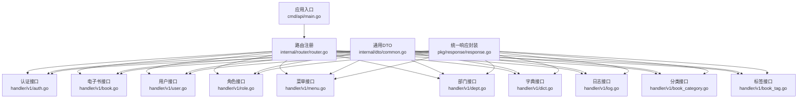
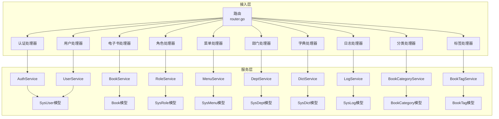
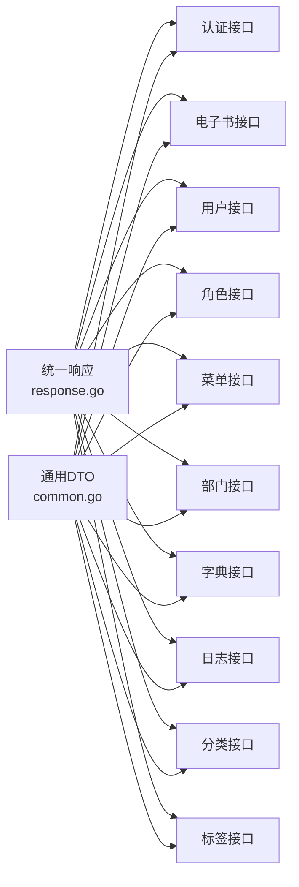

# API接口文档

<cite>
**本文档引用的文件**
- [main.go](file://app/server/cmd/api/main.go)
- [swagger.yaml](file://app/server/docs/swagger.yaml)
- [common.go](file://app/server/internal/dto/common.go)
- [response.go](file://app/server/pkg/response/response.go)
- [auth.go](file://app/server/internal/handler/v1/auth.go)
- [book.go](file://app/server/internal/handler/v1/book.go)
- [user.go](file://app/server/internal/handler/v1/user.go)
- [role.go](file://app/server/internal/handler/v1/role.go)
- [menu.go](file://app/server/internal/handler/v1/menu.go)
- [dept.go](file://app/server/internal/handler/v1/dept.go)
- [dict.go](file://app/server/internal/handler/v1/dict.go)
- [log.go](file://app/server/internal/handler/v1/log.go)
- [book_category.go](file://app/server/internal/handler/v1/book_category.go)
- [book_tag.go](file://app/server/internal/handler/v1/book_tag.go)
</cite>

## 目录
1. [简介](#简介)
2. [项目结构](#项目结构)
3. [核心组件](#核心组件)
4. [架构总览](#架构总览)
5. [详细组件分析](#详细组件分析)
6. [依赖分析](#依赖分析)
7. [性能考虑](#性能考虑)
8. [故障排查指南](#故障排查指南)
9. [结论](#结论)
10. [附录](#附录)

## 简介
本项目为小说阅读平台后端，采用Go语言与Gin框架构建RESTful API服务，通过Swagger生成在线API文档。本文档面向开发者与集成方，覆盖用户认证、电子书管理、系统配置与权限控制等核心业务API，提供统一的响应格式、错误码说明、分页与搜索机制，并给出调用示例与最佳实践。

## 项目结构
后端服务入口位于命令行程序，负责加载配置、初始化数据库连接、JWT与日志、种子数据模式以及路由注册；API文档由Swagger自动生成，定义了各模块的请求/响应模型与接口规范。

**图表来源**
- [main.go:30-84](file://app/server/cmd/api/main.go#L30-L84)
- [auth.go:14-142](file://app/server/internal/handler/v1/auth.go#L14-L142)
- [book.go:15-180](file://app/server/internal/handler/v1/book.go#L15-L180)
- [user.go:18-178](file://app/server/internal/handler/v1/user.go#L18-L178)
- [role.go:18-272](file://app/server/internal/handler/v1/role.go#L18-L272)
- [menu.go:21-248](file://app/server/internal/handler/v1/menu.go#L21-L248)
- [dept.go:18-187](file://app/server/internal/handler/v1/dept.go#L18-L187)
- [dict.go:21-274](file://app/server/internal/handler/v1/dict.go#L21-L274)
- [log.go:11-64](file://app/server/internal/handler/v1/log.go#L11-L64)
- [book_category.go:15-183](file://app/server/internal/handler/v1/book_category.go#L15-L183)
- [book_tag.go:15-147](file://app/server/internal/handler/v1/book_tag.go#L15-L147)
- [common.go:3-52](file://app/server/internal/dto/common.go#L3-L52)
- [response.go:9-37](file://app/server/pkg/response/response.go#L9-L37)

**章节来源**
- [main.go:30-84](file://app/server/cmd/api/main.go#L30-L84)

## 核心组件
- 统一响应封装：所有接口返回统一结构，包含状态码、消息与数据体，便于前端处理与错误识别。
- 通用分页与搜索：提供标准分页请求与默认值处理，支持关键字搜索。
- Swagger文档：基于注释自动生成，定义了各模块的请求/响应模型与接口规范。

**章节来源**
- [response.go:9-37](file://app/server/pkg/response/response.go#L9-L37)
- [common.go:3-52](file://app/server/internal/dto/common.go#L3-L52)

## 架构总览
后端采用分层架构：入口程序负责初始化与路由注册；处理器层承接HTTP请求，调用服务层完成业务逻辑；服务层协调仓储与模型；统一响应封装与DTO模型贯穿各层。

**图表来源**
- [auth.go:14-142](file://app/server/internal/handler/v1/auth.go#L14-L142)
- [book.go:15-180](file://app/server/internal/handler/v1/book.go#L15-L180)
- [user.go:18-178](file://app/server/internal/handler/v1/user.go#L18-L178)
- [role.go:18-272](file://app/server/internal/handler/v1/role.go#L18-L272)
- [menu.go:21-248](file://app/server/internal/handler/v1/menu.go#L21-L248)
- [dept.go:18-187](file://app/server/internal/handler/v1/dept.go#L18-L187)
- [dict.go:21-274](file://app/server/internal/handler/v1/dict.go#L21-L274)
- [log.go:11-64](file://app/server/internal/handler/v1/log.go#L11-L64)
- [book_category.go:15-183](file://app/server/internal/handler/v1/book_category.go#L15-L183)
- [book_tag.go:15-147](file://app/server/internal/handler/v1/book_tag.go#L15-L147)

## 详细组件分析

### 认证接口
- 登录
  - 方法与路径：POST /api/auth/login
  - 安全：无（登录接口）
  - 请求体：用户名、密码
  - 响应：令牌、过期时间、刷新令牌等
  - 错误码：用户名或密码错误、账号禁用、账号锁定、其他登录失败
- 获取当前用户信息
  - 方法与路径：GET /api/auth/userInfo
  - 安全：Bearer Token
  - 响应：用户标识、角色、按钮权限等
- 获取当前用户菜单树
  - 方法与路径：GET /api/auth/menu
  - 安全：Bearer Token
  - 响应：路由树结构
- 获取当前用户按钮码集合
  - 方法与路径：GET /api/auth/buttons
  - 安全：Bearer Token
  - 响应：按钮权限码数组

**章节来源**
- [auth.go:23-122](file://app/server/internal/handler/v1/auth.go#L23-L122)

### 电子书管理接口
- 书籍详情
  - 方法与路径：GET /api/manage/book/{id}
  - 安全：Bearer Token
  - 路径参数：id
  - 响应：书籍详情
- 新增书籍
  - 方法与路径：POST /api/manage/book
  - 安全：Bearer Token
  - 请求体：书籍信息
  - 响应：书籍详情
- 编辑书籍
  - 方法与路径：PUT /api/manage/book/{id}
  - 安全：Bearer Token
  - 路径参数：id
  - 请求体：书籍信息
  - 响应：书籍详情
- 删除书籍
  - 方法与路径：DELETE /api/manage/book/{id}
  - 安全：Bearer Token
  - 路径参数：id
  - 响应：空
- 书籍分页列表
  - 方法与路径：POST /api/manage/book/page
  - 安全：Bearer Token
  - 请求体：分页与搜索条件
  - 响应：分页结果
- 更新上架状态
  - 方法与路径：PUT /api/manage/book/{id}/status
  - 安全：Bearer Token
  - 路径参数：id
  - 请求体：状态
  - 响应：空

**章节来源**
- [book.go:23-167](file://app/server/internal/handler/v1/book.go#L23-L167)

### 用户管理接口
- 用户分页
  - 方法与路径：POST /api/manage/user/page
  - 安全：Bearer Token
  - 请求体：分页与搜索条件
  - 响应：分页结果
- 用户详情
  - 方法与路径：GET /api/manage/user/{id}
  - 安全：Bearer Token
  - 路径参数：id
  - 响应：用户详情
- 新增用户
  - 方法与路径：POST /api/manage/user
  - 安全：Bearer Token
  - 请求体：用户信息
  - 响应：用户详情
- 编辑用户
  - 方法与路径：PUT /api/manage/user/{id}
  - 安全：Bearer Token
  - 路径参数：id
  - 请求体：用户信息
  - 响应：用户详情
- 删除用户
  - 方法与路径：DELETE /api/manage/user/{id}
  - 安全：Bearer Token
  - 路径参数：id
  - 响应：空
- 重置密码
  - 方法与路径：PUT /api/manage/user/{id}/reset-password
  - 安全：Bearer Token
  - 路径参数：id
  - 请求体：新密码
  - 响应：空

**章节来源**
- [user.go:26-170](file://app/server/internal/handler/v1/user.go#L26-L170)

### 角色管理接口
- 角色分页
  - 方法与路径：POST /api/manage/role/page
  - 安全：Bearer Token
  - 请求体：分页与搜索条件
  - 响应：分页结果
- 角色详情
  - 方法与路径：GET /api/manage/role/{id}
  - 安全：Bearer Token
  - 路径参数：id
  - 响应：角色详情
- 全量角色（下拉）
  - 方法与路径：GET /api/manage/role/all
  - 安全：Bearer Token
  - 响应：简要角色列表
- 新增角色
  - 方法与路径：POST /api/manage/role
  - 安全：Bearer Token
  - 请求体：角色信息
  - 响应：角色详情
- 编辑角色
  - 方法与路径：PUT /api/manage/role/{id}
  - 安全：Bearer Token
  - 路径参数：id
  - 请求体：角色信息
  - 响应：角色详情
- 删除角色
  - 方法与路径：DELETE /api/manage/role/{id}
  - 安全：Bearer Token
  - 路径参数：id
  - 响应：空
- 角色授权菜单
  - 方法与路径：PUT /api/manage/role/{id}/menus
  - 安全：Bearer Token
  - 路径参数：id
  - 请求体：菜单ID数组
  - 响应：空
- 角色授权按钮
  - 方法与路径：PUT /api/manage/role/{id}/buttons
  - 安全：Bearer Token
  - 路径参数：id
  - 请求体：按钮ID数组
  - 响应：空
- 获取角色已授权菜单ID
  - 方法与路径：GET /api/manage/role/{id}/menus
  - 安全：Bearer Token
  - 路径参数：id
  - 响应：菜单ID数组
- 获取角色已授权按钮ID
  - 方法与路径：GET /api/manage/role/{id}/buttons
  - 安全：Bearer Token
  - 路径参数：id
  - 响应：按钮ID数组

**章节来源**
- [role.go:26-258](file://app/server/internal/handler/v1/role.go#L26-L258)

### 菜单管理接口
- 菜单分页列表（平级，含按钮）
  - 方法与路径：POST /api/manage/menu/page
  - 安全：Bearer Token
  - 请求体：分页与搜索条件
  - 响应：分页结果
- 全量菜单树（含按钮）
  - 方法与路径：GET /api/manage/menu/tree
  - 安全：Bearer Token
  - 响应：菜单树
- 菜单详情
  - 方法与路径：GET /api/manage/menu/{id}
  - 安全：Bearer Token
  - 路径参数：id
  - 响应：菜单详情
- 新增菜单
  - 方法与路径：POST /api/manage/menu
  - 安全：Bearer Token
  - 请求体：菜单信息
  - 响应：菜单详情
- 编辑菜单
  - 方法与路径：PUT /api/manage/menu/{id}
  - 安全：Bearer Token
  - 路径参数：id
  - 请求体：菜单信息
  - 响应：菜单详情
- 删除菜单
  - 方法与路径：DELETE /api/manage/menu/{id}
  - 安全：Bearer Token
  - 路径参数：id
  - 响应：空
- 新增菜单按钮
  - 方法与路径：POST /api/manage/menu/button
  - 安全：Bearer Token
  - 请求体：按钮信息
  - 响应：按钮详情
- 删除菜单按钮
  - 方法与路径：DELETE /api/manage/menu/button/{id}
  - 安全：Bearer Token
  - 路径参数：id
  - 响应：空
- 按菜单查询按钮
  - 方法与路径：GET /api/manage/menu/buttons/{menuId}
  - 安全：Bearer Token
  - 路径参数：menuId
  - 响应：按钮列表

**章节来源**
- [menu.go:29-234](file://app/server/internal/handler/v1/menu.go#L29-L234)

### 部门管理接口
- 部门分页列表（平级）
  - 方法与路径：POST /api/manage/dept/page
  - 安全：Bearer Token
  - 请求体：分页与搜索条件
  - 响应：分页结果
- 部门树
  - 方法与路径：GET /api/manage/dept/tree
  - 安全：Bearer Token
  - 查询参数：部门名称、部门编码、状态
  - 响应：部门树
- 部门详情
  - 方法与路径：GET /api/manage/dept/{id}
  - 安全：Bearer Token
  - 路径参数：id
  - 响应：部门详情
- 新增部门
  - 方法与路径：POST /api/manage/dept
  - 安全：Bearer Token
  - 请求体：部门信息
  - 响应：部门详情
- 编辑部门
  - 方法与路径：PUT /api/manage/dept/{id}
  - 安全：Bearer Token
  - 路径参数：id
  - 请求体：部门信息
  - 响应：部门详情
- 删除部门
  - 方法与路径：DELETE /api/manage/dept/{id}
  - 安全：Bearer Token
  - 路径参数：id
  - 响应：空

**章节来源**
- [dept.go:26-173](file://app/server/internal/handler/v1/dept.go#L26-L173)

### 字典管理接口
- 字典分页
  - 方法与路径：POST /api/manage/dict/page
  - 安全：Bearer Token
  - 请求体：分页与搜索条件
  - 响应：分页结果
- 字典详情
  - 方法与路径：GET /api/manage/dict/{id}
  - 安全：Bearer Token
  - 路径参数：id
  - 响应：字典详情
- 新增字典
  - 方法与路径：POST /api/manage/dict
  - 安全：Bearer Token
  - 请求体：字典信息
  - 响应：字典详情
- 编辑字典
  - 方法与路径：PUT /api/manage/dict/{id}
  - 安全：Bearer Token
  - 路径参数：id
  - 请求体：字典信息
  - 响应：字典详情
- 删除字典
  - 方法与路径：DELETE /api/manage/dict/{id}
  - 安全：Bearer Token
  - 路径参数：id
  - 响应：空
- 按字典ID查询字典项
  - 方法与路径：GET /api/manage/dict/items/{dictId}
  - 安全：Bearer Token
  - 路径参数：dictId
  - 响应：字典项列表
- 按字典编码查询字典项（高频）
  - 方法与路径：GET /api/manage/dict/code/{code}
  - 安全：Bearer Token
  - 路径参数：code
  - 响应：字典项列表
- 新增字典项
  - 方法与路径：POST /api/manage/dict/item
  - 安全：Bearer Token
  - 请求体：字典项信息
  - 响应：字典项详情
- 编辑字典项
  - 方法与路径：PUT /api/manage/dict/item/{id}
  - 安全：Bearer Token
  - 路径参数：id
  - 请求体：字典项信息
  - 响应：字典项详情
- 删除字典项
  - 方法与路径：DELETE /api/manage/dict/item/{id}
  - 安全：Bearer Token
  - 路径参数：id
  - 响应：空

**章节来源**
- [dict.go:29-262](file://app/server/internal/handler/v1/dict.go#L29-L262)

### 日志管理接口
- 登录日志分页
  - 方法与路径：POST /api/manage/log/login/page
  - 安全：Bearer Token
  - 请求体：分页与搜索条件
  - 响应：分页结果
- 操作日志分页
  - 方法与路径：POST /api/manage/log/operation/page
  - 安全：Bearer Token
  - 请求体：分页与搜索条件
  - 响应：分页结果

**章节来源**
- [log.go:19-63](file://app/server/internal/handler/v1/log.go#L19-L63)

### 电子书分类接口
- 分类树
  - 方法与路径：GET /api/manage/book-category/tree
  - 安全：Bearer Token
  - 响应：分类树
- 分类详情
  - 方法与路径：GET /api/manage/book-category/{id}
  - 安全：Bearer Token
  - 路径参数：id
  - 响应：分类详情
- 新增分类
  - 方法与路径：POST /api/manage/book-category
  - 安全：Bearer Token
  - 请求体：分类信息
  - 响应：分类详情
- 编辑分类
  - 方法与路径：PUT /api/manage/book-category/{id}
  - 安全：Bearer Token
  - 路径参数：id
  - 请求体：分类信息
  - 响应：分类详情
- 删除分类
  - 方法与路径：DELETE /api/manage/book-category/{id}
  - 安全：Bearer Token
  - 路径参数：id
  - 响应：空
- 分类分页列表（树形）
  - 方法与路径：POST /api/manage/book-category/page
  - 安全：Bearer Token
  - 请求体：分页与搜索条件
  - 响应：分页结果
- 热门分类列表（公开）
  - 方法与路径：GET /api/book-category/hot
  - 安全：无
  - 响应：热门分类列表

**章节来源**
- [book_category.go:23-182](file://app/server/internal/handler/v1/book_category.go#L23-L182)

### 电子书标签接口
- 标签分页
  - 方法与路径：POST /api/manage/book-tag/page
  - 安全：Bearer Token
  - 请求体：分页与搜索条件
  - 响应：分页结果
- 标签详情
  - 方法与路径：GET /api/manage/book-tag/{id}
  - 安全：Bearer Token
  - 路径参数：id
  - 响应：标签详情
- 新增标签
  - 方法与路径：POST /api/manage/book-tag
  - 安全：Bearer Token
  - 请求体：标签信息
  - 响应：标签详情
- 编辑标签
  - 方法与路径：PUT /api/manage/book-tag/{id}
  - 安全：Bearer Token
  - 路径参数：id
  - 请求体：标签信息
  - 响应：标签详情
- 删除标签
  - 方法与路径：DELETE /api/manage/book-tag/{id}
  - 安全：Bearer Token
  - 路径参数：id
  - 响应：空

**章节来源**
- [book_tag.go:23-139](file://app/server/internal/handler/v1/book_tag.go#L23-L139)

## 依赖分析
- 统一响应封装被所有处理器复用，保证接口一致性。
- DTO层提供通用分页与搜索模型，减少重复代码。
- Swagger定义了丰富的数据模型与接口契约，便于前后端协作。

**图表来源**
- [response.go:9-37](file://app/server/pkg/response/response.go#L9-L37)
- [common.go:3-52](file://app/server/internal/dto/common.go#L3-L52)

**章节来源**
- [response.go:9-37](file://app/server/pkg/response/response.go#L9-L37)
- [common.go:3-52](file://app/server/internal/dto/common.go#L3-L52)

## 性能考虑
- 分页与搜索：建议前端传入合理的分页大小与关键字，避免一次性加载过多数据。
- 缓存策略：高频字典项可考虑缓存以降低数据库压力。
- 并发与限流：在网关或中间件层实施请求限流，防止突发流量冲击。
- 数据库优化：为常用查询字段建立索引，优化分页查询性能。

## 故障排查指南
- 通用错误码
  - 1001：请求参数校验失败
  - 2001：未授权或用户相关错误
  - 2003：账号已禁用
  - 2004：账号已锁定
  - 3001：业务冲突或资源存在
  - 3002：系统保留或不可删除
  - 3003：角色仍有绑定用户
  - 5001：服务器内部错误
- 排查步骤
  - 检查请求头Authorization是否携带有效Bearer Token
  - 校验请求参数类型与必填项
  - 查看服务端日志定位具体错误
  - 对高频接口增加缓存与降级策略

**章节来源**
- [auth.go:42-52](file://app/server/internal/handler/v1/auth.go#L42-L52)
- [user.go:172-177](file://app/server/internal/handler/v1/user.go#L172-L177)
- [role.go:260-271](file://app/server/internal/handler/v1/role.go#L260-L271)
- [menu.go:236-247](file://app/server/internal/handler/v1/menu.go#L236-L247)
- [dept.go:175-186](file://app/server/internal/handler/v1/dept.go#L175-L186)
- [dict.go:264-273](file://app/server/internal/handler/v1/dict.go#L264-L273)
- [book.go:169-179](file://app/server/internal/handler/v1/book.go#L169-L179)

## 结论
本项目通过清晰的分层设计与Swagger文档，提供了完整且一致的RESTful API能力。结合统一响应与通用DTO，能够快速扩展新的业务模块。建议在生产环境中配合缓存、限流与监控体系，确保系统的稳定性与可维护性。

## 附录

### API版本管理
- 版本号：1.0
- 基础路径：/
- 认证方式：Bearer Token（除登录与公开接口外）

**章节来源**
- [main.go:21-28](file://app/server/cmd/api/main.go#L21-L28)

### 分页机制
- 请求参数
  - current：当前页，默认1
  - size：每页条数，默认10，最大100
  - keyword：关键字搜索
- 响应参数
  - records：数据列表
  - current：当前页
  - size：每页条数
  - total：总数

**章节来源**
- [common.go:3-52](file://app/server/internal/dto/common.go#L3-L52)

### 搜索过滤与排序规则
- 搜索过滤：支持按关键字、状态、编码、名称等字段过滤
- 排序规则：接口层面未显式定义排序字段，如需排序请在前端或服务端实现

**章节来源**
- [swagger.yaml:40-54](file://app/server/docs/swagger.yaml#L40-L54)
- [swagger.yaml:96-110](file://app/server/docs/swagger.yaml#L96-L110)
- [swagger.yaml:148-162](file://app/server/docs/swagger.yaml#L148-L162)
- [swagger.yaml:419-439](file://app/server/docs/swagger.yaml#L419-L439)

### 请求与响应示例
- 登录请求
  - 请求体：username, password
  - 成功响应：token, refreshToken, expiresAt, refreshExpiresAt
- 获取用户信息
  - 成功响应：userId, userName, roles, buttons
- 书籍分页
  - 请求体：current, size, keyword
  - 成功响应：current, size, total, records

**章节来源**
- [swagger.yaml:185-198](file://app/server/docs/swagger.yaml#L185-L198)
- [swagger.yaml:577-591](file://app/server/docs/swagger.yaml#L577-L591)
- [swagger.yaml:440-449](file://app/server/docs/swagger.yaml#L440-L449)

### SDK使用指南与客户端集成最佳实践
- SDK选择：推荐使用Gin生态或HTTP客户端发起请求
- 认证流程：先调用登录接口获取Token，后续请求在Authorization头中携带Bearer Token
- 错误处理：根据统一响应中的code与message进行提示与重试
- 最佳实践：对高频接口增加本地缓存；对批量操作分批处理；对敏感操作记录审计日志