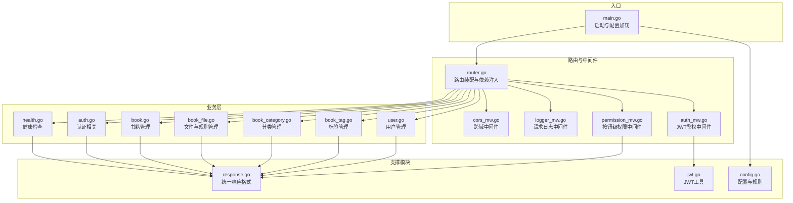
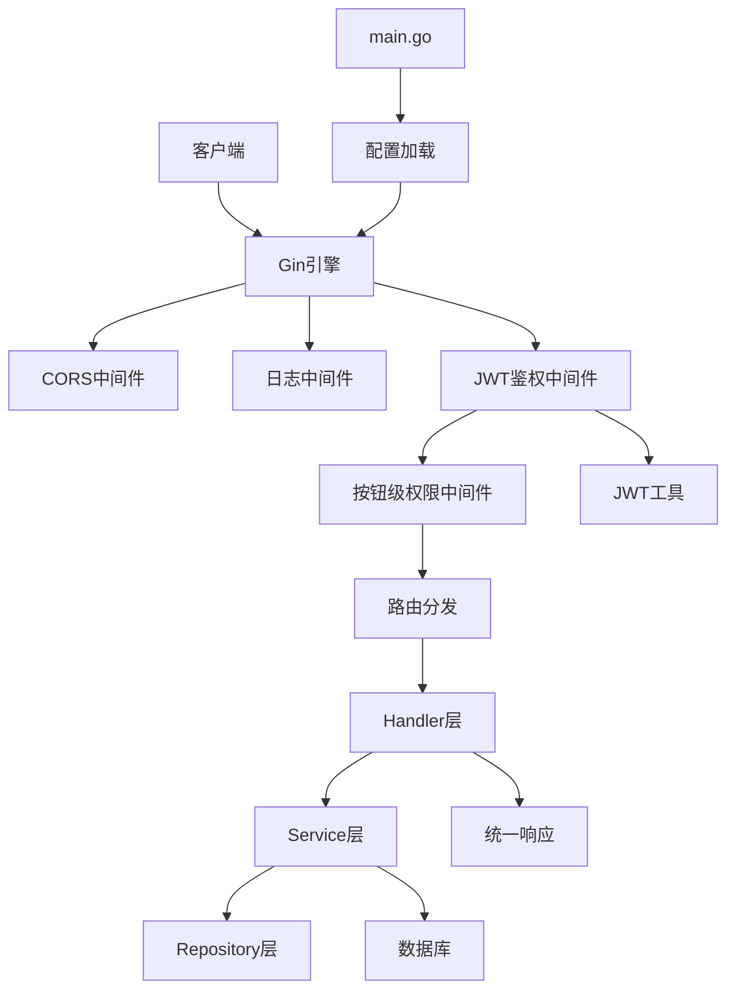
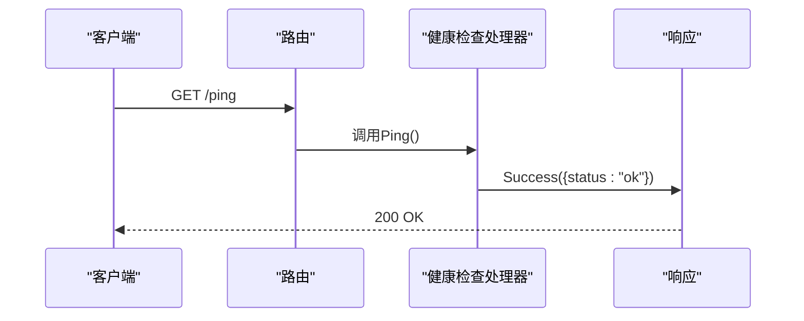
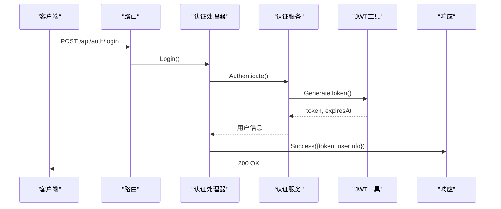
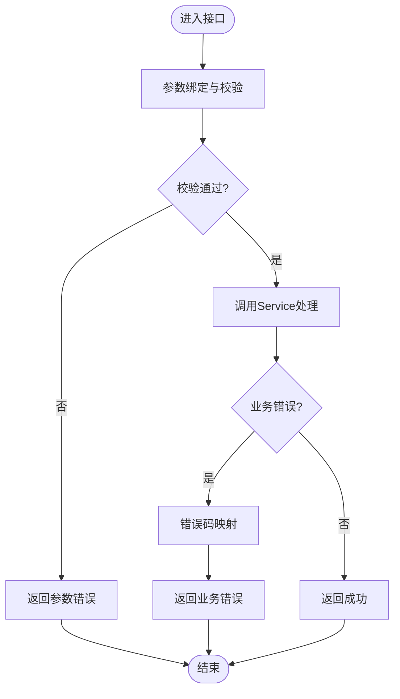
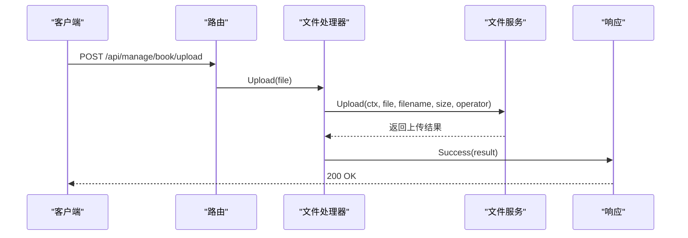
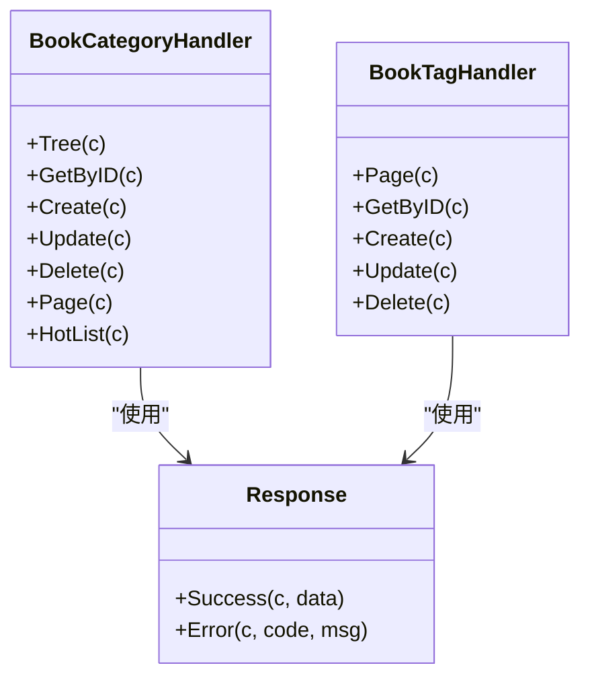
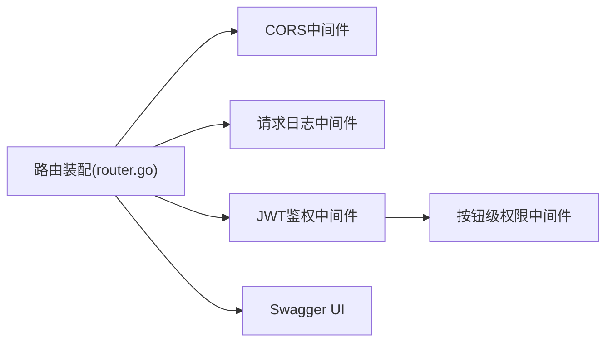
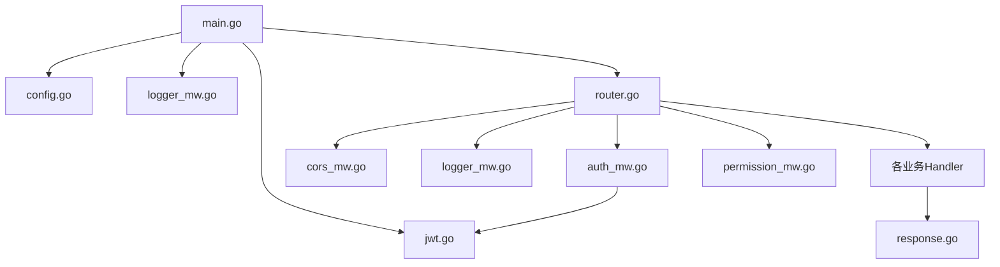

# 业务功能API

<cite>
**本文档引用的文件**
- [main.go](file://app/server/cmd/api/main.go)
- [router.go](file://app/server/internal/router/router.go)
- [health.go](file://app/server/internal/handler/v1/health.go)
- [auth.go](file://app/server/internal/handler/v1/auth.go)
- [book.go](file://app/server/internal/handler/v1/book.go)
- [book_file.go](file://app/server/internal/handler/v1/book_file.go)
- [book_category.go](file://app/server/internal/handler/v1/book_category.go)
- [book_tag.go](file://app/server/internal/handler/v1/book_tag.go)
- [user.go](file://app/server/internal/handler/v1/user.go)
- [auth_mw.go](file://app/server/internal/middleware/auth.go)
- [cors_mw.go](file://app/server/internal/middleware/cors.go)
- [logger_mw.go](file://app/server/internal/middleware/logger.go)
- [permission_mw.go](file://app/server/internal/middleware/permission.go)
- [response.go](file://app/server/pkg/response/response.go)
- [jwt.go](file://app/server/pkg/jwt/jwt.go)
- [config.go](file://app/server/pkg/config/config.go)
</cite>

## 目录
1. [简介](#简介)
2. [项目结构](#项目结构)
3. [核心组件](#核心组件)
4. [架构总览](#架构总览)
5. [详细组件分析](#详细组件分析)
6. [依赖关系分析](#依赖关系分析)
7. [性能考虑](#性能考虑)
8. [故障排查指南](#故障排查指南)
9. [结论](#结论)
10. [附录](#附录)

## 简介
本文件面向boread项目的业务功能API，覆盖健康检查、路由管理、业务规则配置、工作流控制等通用业务接口。重点说明业务状态监控、服务可用性检测、动态路由配置、业务规则引擎等特性，并提供完整的业务流程接口、状态查询接口、配置更新接口的详细说明。同时解释业务逻辑封装、异常处理机制与性能监控方案，并给出业务集成示例与故障排查指南。

## 项目结构
后端采用Go语言与Gin框架，按领域模型分层组织：入口程序负责配置加载、数据库连接、路由装配；中间件提供CORS、日志、鉴权与按钮级权限控制；Handler层承接HTTP请求，调用Service层完成业务处理；Service层封装业务规则与工作流；Repository层负责数据访问；配置模块支持运行时配置加载与元信息提取规则。

图表来源
- [main.go:30-84](file://app/server/cmd/api/main.go#L30-L84)
- [router.go:20-205](file://app/server/internal/router/router.go#L20-L205)
- [health.go:17-33](file://app/server/internal/handler/v1/health.go#L17-L33)
- [auth_mw.go:12-40](file://app/server/internal/middleware/auth.go#L12-L40)
- [permission_mw.go:10-52](file://app/server/internal/middleware/permission.go#L10-L52)
- [response.go:9-37](file://app/server/pkg/response/response.go#L9-L37)
- [jwt.go:19-71](file://app/server/pkg/jwt/jwt.go#L19-L71)
- [config.go:58-66](file://app/server/pkg/config/config.go#L58-L66)

章节来源
- [main.go:30-84](file://app/server/cmd/api/main.go#L30-L84)
- [router.go:20-205](file://app/server/internal/router/router.go#L20-L205)

## 核心组件
- 统一响应格式：所有接口返回统一结构，包含状态码、消息与数据体，便于前端一致化处理与错误定位。
- JWT鉴权：基于Bearer Token进行身份验证，解析用户标识并注入到请求上下文。
- 按钮级权限：在受保护管理接口上，按用户拥有的按钮代码进行细粒度授权控制。
- 跨域与日志：全局启用CORS与请求日志中间件，便于调试与跨域联调。
- 配置系统：支持从YAML加载服务器、数据库、JWT、日志与元信息提取规则配置。

章节来源
- [response.go:9-37](file://app/server/pkg/response/response.go#L9-L37)
- [auth_mw.go:12-40](file://app/server/internal/middleware/auth.go#L12-L40)
- [permission_mw.go:10-52](file://app/server/internal/middleware/permission.go#L10-L52)
- [cors_mw.go:9-23](file://app/server/internal/middleware/cors.go#L9-L23)
- [logger_mw.go:10-28](file://app/server/internal/middleware/logger.go#L10-L28)
- [config.go:58-66](file://app/server/pkg/config/config.go#L58-L66)

## 架构总览
后端以Gin为核心，通过中间件链路实现横切关注点，路由层按模块划分业务域，Handler层负责参数绑定与错误映射，Service层承载业务规则与工作流，Repository层抽象数据访问。配置模块贯穿启动阶段，确保运行时参数可控。

图表来源
- [router.go:20-205](file://app/server/internal/router/router.go#L20-L205)
- [auth_mw.go:12-40](file://app/server/internal/middleware/auth.go#L12-L40)
- [permission_mw.go:10-52](file://app/server/internal/middleware/permission.go#L10-L52)
- [response.go:9-37](file://app/server/pkg/response/response.go#L9-L37)
- [jwt.go:19-71](file://app/server/pkg/jwt/jwt.go#L19-L71)
- [main.go:34-84](file://app/server/cmd/api/main.go#L34-L84)
- [config.go:58-66](file://app/server/pkg/config/config.go#L58-L66)

## 详细组件分析

### 健康检查与可用性检测
- 接口：GET /ping 返回服务健康状态。
- 异常：未找到路由与方法不被允许时分别返回对应错误。
- 监控建议：结合反向代理与Kubernetes探针定期调用/ping，实现服务可用性监控。

图表来源
- [router.go:26-30](file://app/server/internal/router/router.go#L26-L30)
- [health.go:17-25](file://app/server/internal/handler/v1/health.go#L17-L25)
- [response.go:15-21](file://app/server/pkg/response/response.go#L15-L21)

章节来源
- [router.go:26-30](file://app/server/internal/router/router.go#L26-L30)
- [health.go:17-33](file://app/server/internal/handler/v1/health.go#L17-L33)

### 认证与会话管理
- 接口：POST /api/auth/login 登录获取令牌；GET /api/auth/userInfo、/api/auth/menu、/api/auth/buttons 获取用户信息与菜单/按钮。
- 鉴权：Authorization: Bearer <token>，中间件解析并注入user_id与username。
- 令牌：支持生成与解析，包含过期时间控制。

图表来源
- [router.go:80-91](file://app/server/internal/router/router.go#L80-L91)
- [auth_mw.go:12-40](file://app/server/internal/middleware/auth.go#L12-L40)
- [jwt.go:24-38](file://app/server/pkg/jwt/jwt.go#L24-L38)
- [response.go:15-21](file://app/server/pkg/response/response.go#L15-L21)

章节来源
- [router.go:80-91](file://app/server/internal/router/router.go#L80-L91)
- [auth_mw.go:12-40](file://app/server/internal/middleware/auth.go#L12-L40)
- [jwt.go:19-71](file://app/server/pkg/jwt/jwt.go#L19-L71)

### 书籍管理（业务流程与状态控制）
- 接口：GET/POST/PUT/DELETE /api/manage/book/{id} 与 /api/manage/book/page、/api/manage/book/{id}/status。
- 工作流：新增/编辑书籍、更新上架状态、分页查询。
- 错误映射：针对书籍不存在、标签/分类无效等场景返回特定业务码。

图表来源
- [book.go:23-43](file://app/server/internal/handler/v1/book.go#L23-L43)
- [book.go:54-66](file://app/server/internal/handler/v1/book.go#L54-L66)
- [book.go:78-95](file://app/server/internal/handler/v1/book.go#L78-L95)
- [book.go:105-116](file://app/server/internal/handler/v1/book.go#L105-L116)
- [book.go:127-139](file://app/server/internal/handler/v1/book.go#L127-L139)
- [book.go:151-167](file://app/server/internal/handler/v1/book.go#L151-L167)
- [book.go:169-179](file://app/server/internal/handler/v1/book.go#L169-L179)

章节来源
- [book.go:23-179](file://app/server/internal/handler/v1/book.go#L23-L179)

### 文件与规则管理（工作流控制与动态配置）
- 文件扫描与入库：POST /api/manage/book/upload、/api/manage/book/confirm-import、/api/manage/book/scan、/api/manage/book/scan-path、/api/manage/book/scan/{id}。
- 章节内容读取：GET /api/manage/book/{id}/chapter/{chapterNo}。
- 规则管理：章节识别规则与内容净化规则的增删改查与分页。
- 错误映射：针对文件大小、类型、空文件、MD5重复、规则不存在等场景返回特定业务码。

图表来源
- [router.go:176-186](file://app/server/internal/router/router.go#L176-L186)
- [book_file.go:29-52](file://app/server/internal/handler/v1/book_file.go#L29-L52)
- [book_file.go:63-75](file://app/server/internal/handler/v1/book_file.go#L63-L75)
- [book_file.go:84-91](file://app/server/internal/handler/v1/book_file.go#L84-L91)
- [book_file.go:102-114](file://app/server/internal/handler/v1/book_file.go#L102-L114)
- [book_file.go:124-136](file://app/server/internal/handler/v1/book_file.go#L124-L136)
- [book_file.go:175-187](file://app/server/internal/handler/v1/book_file.go#L175-L187)
- [response.go:15-21](file://app/server/pkg/response/response.go#L15-L21)

章节来源
- [book_file.go:29-544](file://app/server/internal/handler/v1/book_file.go#L29-L544)

### 分类与标签管理（动态配置与查询）
- 分类：树形结构、分页、详情、增删改、热门分类查询。
- 标签：分页、详情、增删改。
- 权限：均需登录态，部分按钮级权限保护。

图表来源
- [book_category.go:23-183](file://app/server/internal/handler/v1/book_category.go#L23-L183)
- [book_tag.go:23-147](file://app/server/internal/handler/v1/book_tag.go#L23-L147)
- [response.go:15-37](file://app/server/pkg/response/response.go#L15-L37)

章节来源
- [book_category.go:23-183](file://app/server/internal/handler/v1/book_category.go#L23-L183)
- [book_tag.go:23-147](file://app/server/internal/handler/v1/book_tag.go#L23-L147)

### 用户管理（状态与权限）
- 接口：分页、详情、新增、编辑、删除、重置密码。
- 权限：受保护管理接口，部分操作需按钮级权限。

章节来源
- [user.go:26-178](file://app/server/internal/handler/v1/user.go#L26-L178)

### 路由管理与中间件链
- 路由装配：统一在SetupRouter中完成，按模块注册公开、登录态与受保护管理接口。
- 中间件：CORS、请求日志、恢复、JWT鉴权、按钮级权限。
- Swagger：内置Swagger UI接口文档。

图表来源
- [router.go:20-34](file://app/server/internal/router/router.go#L20-L34)
- [router.go:78-202](file://app/server/internal/router/router.go#L78-L202)
- [cors_mw.go:9-23](file://app/server/internal/middleware/cors.go#L9-L23)
- [logger_mw.go:10-28](file://app/server/internal/middleware/logger.go#L10-L28)
- [auth_mw.go:12-40](file://app/server/internal/middleware/auth.go#L12-L40)
- [permission_mw.go:10-52](file://app/server/internal/middleware/permission.go#L10-L52)

章节来源
- [router.go:20-205](file://app/server/internal/router/router.go#L20-L205)

## 依赖关系分析
- 入口依赖配置与日志初始化，建立数据库连接并装配路由。
- 路由依赖中间件与各业务Handler，Handler依赖Service，Service依赖Repository与模型。
- 配置模块提供元信息提取规则，用于文件解析与内容净化。

图表来源
- [main.go:34-84](file://app/server/cmd/api/main.go#L34-L84)
- [router.go:20-205](file://app/server/internal/router/router.go#L20-L205)
- [config.go:58-66](file://app/server/pkg/config/config.go#L58-L66)
- [jwt.go:19-71](file://app/server/pkg/jwt/jwt.go#L19-L71)
- [response.go:15-37](file://app/server/pkg/response/response.go#L15-L37)

章节来源
- [main.go:34-84](file://app/server/cmd/api/main.go#L34-L84)
- [router.go:20-205](file://app/server/internal/router/router.go#L20-L205)

## 性能考虑
- 数据库连接池：通过配置设置最大空闲与最大打开连接数，避免连接争用。
- 中间件顺序：日志中间件置于鉴权之后，减少无效请求的日志输出。
- 按钮级权限：当前每次请求查询权限，存在DB压力；建议在性能瓶颈出现后再引入缓存策略。
- 请求参数校验：Handler层统一绑定与校验，减少后续处理分支判断成本。

## 故障排查指南
- 健康检查失败
  - 现象：/ping返回非200或无响应。
  - 排查：确认服务进程正常、监听端口开放、反向代理配置正确。
  - 参考：[router.go:26-30](file://app/server/internal/router/router.go#L26-L30)，[health.go:17-25](file://app/server/internal/handler/v1/health.go#L17-L25)

- 认证失败
  - 现象：401未授权或403权限不足。
  - 排查：确认Authorization头格式为Bearer Token、Token未过期、用户存在且有效。
  - 参考：[auth_mw.go:12-40](file://app/server/internal/middleware/auth.go#L12-L40)，[jwt.go:57-71](file://app/server/pkg/jwt/jwt.go#L57-L71)

- 按钮级权限拒绝
  - 现象：返回permission denied。
  - 排查：确认用户具备所需按钮code，检查角色授权与菜单按钮配置。
  - 参考：[permission_mw.go:10-52](file://app/server/internal/middleware/permission.go#L10-L52)

- 业务接口错误
  - 现象：返回特定业务码与错误信息。
  - 排查：根据Handler中的错误映射定位具体原因（如书籍不存在、文件类型不支持等）。
  - 参考：[book.go:169-179](file://app/server/internal/handler/v1/book.go#L169-L179)，[book_file.go:527-543](file://app/server/internal/handler/v1/book_file.go#L527-L543)

- 日志与可观测性
  - 现象：请求无日志或日志缺失。
  - 排查：确认日志中间件已启用、日志级别配置正确、输出路径可写。
  - 参考：[logger_mw.go:10-28](file://app/server/internal/middleware/logger.go#L10-L28)

## 结论
boread的业务功能API围绕“统一响应、JWT鉴权、按钮级权限、清晰分层”构建，覆盖书籍、文件、分类、标签与用户等核心业务域。通过路由装配与中间件链路实现横切能力，配合Swagger文档与错误映射提升开发与运维效率。建议在性能瓶颈出现后再引入权限缓存与异步处理，持续优化业务工作流与规则引擎。

## 附录

### 接口清单与说明
- 健康检查
  - GET /ping：服务健康状态
  - 参考：[router.go:26-30](file://app/server/internal/router/router.go#L26-L30)，[health.go:17-25](file://app/server/internal/handler/v1/health.go#L17-L25)

- 认证相关
  - POST /api/auth/login：登录获取令牌
  - GET /api/auth/userInfo：获取用户信息
  - GET /api/auth/menu：获取用户菜单
  - GET /api/auth/buttons：获取用户按钮
  - 参考：[router.go:80-91](file://app/server/internal/router/router.go#L80-L91)，[auth_mw.go:12-40](file://app/server/internal/middleware/auth.go#L12-L40)

- 书籍管理
  - GET/POST/PUT/DELETE /api/manage/book/{id}
  - POST /api/manage/book/page
  - PUT /api/manage/book/{id}/status
  - 参考：[book.go:23-167](file://app/server/internal/handler/v1/book.go#L23-L167)

- 文件与规则
  - POST /api/manage/book/upload
  - POST /api/manage/book/confirm-import
  - POST /api/manage/book/scan、/api/manage/book/scan-path、/api/manage/book/scan/{id}
  - GET /api/manage/book/{id}/chapter/{chapterNo}
  - POST /api/manage/book/re-parse
  - 章节识别规则：GET/POST/PUT/DELETE /api/manage/book/chapter-rule/{id} 与 /api/manage/book/chapter-rule/page
  - 内容净化规则：GET/POST/PUT/DELETE /api/manage/book/filter-rule/{id} 与 /api/manage/book/filter-rule/page
  - 参考：[book_file.go:29-544](file://app/server/internal/handler/v1/book_file.go#L29-L544)

- 分类与标签
  - 分类：GET/POST/PUT/DELETE /api/manage/book-category/{id} 与 /api/manage/book-category/page、/api/manage/book-category/tree、/api/book-category/hot
  - 标签：GET/POST/PUT/DELETE /api/manage/book-tag/{id} 与 /api/manage/book-tag/page
  - 参考：[book_category.go:23-183](file://app/server/internal/handler/v1/book_category.go#L23-L183)，[book_tag.go:23-147](file://app/server/internal/handler/v1/book_tag.go#L23-L147)

- 用户管理
  - GET/POST/PUT/DELETE /api/manage/user/{id}
  - POST /api/manage/user/page
  - PUT /api/manage/user/{id}/reset-password
  - 参考：[user.go:26-178](file://app/server/internal/handler/v1/user.go#L26-L178)

### 配置说明
- 配置项：server、database、jwt、log、meta.rules
- 加载方式：启动时从YAML读取并初始化日志、JWT与数据库连接
- 参考：[config.go:58-66](file://app/server/pkg/config/config.go#L58-L66)，[main.go:34-84](file://app/server/cmd/api/main.go#L34-L84)