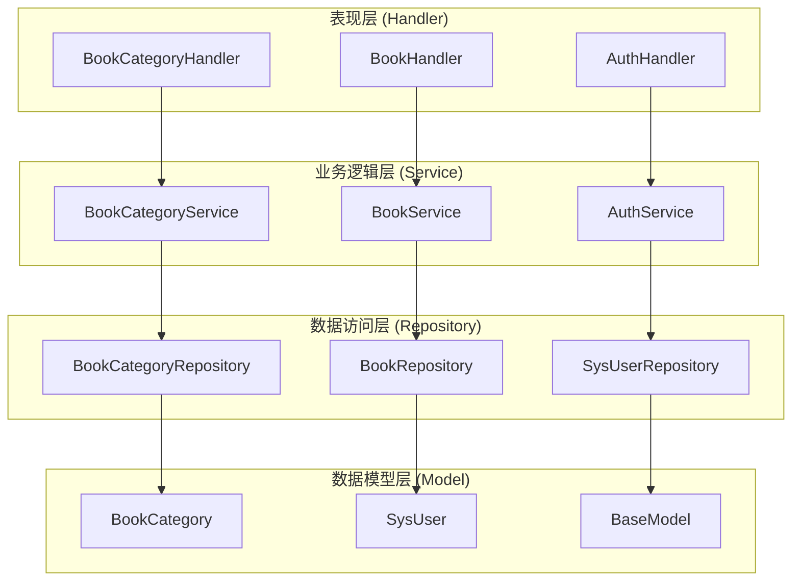
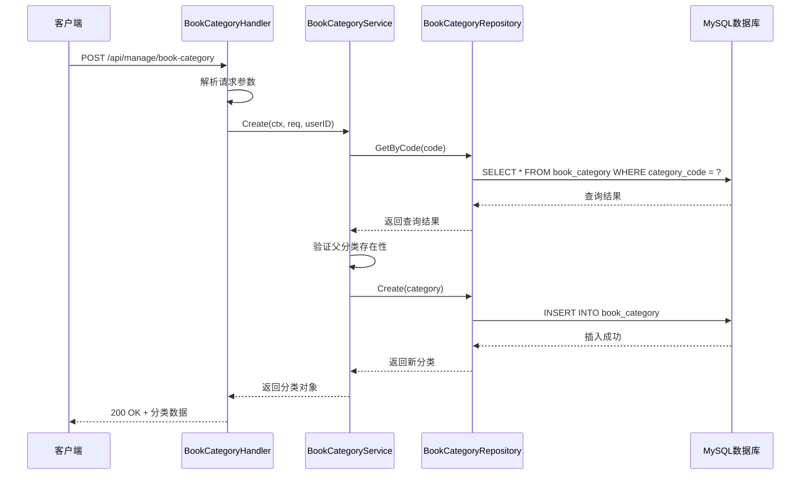
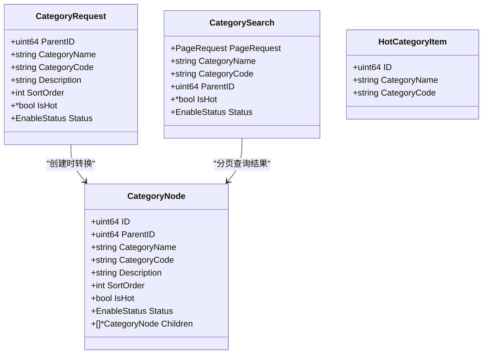
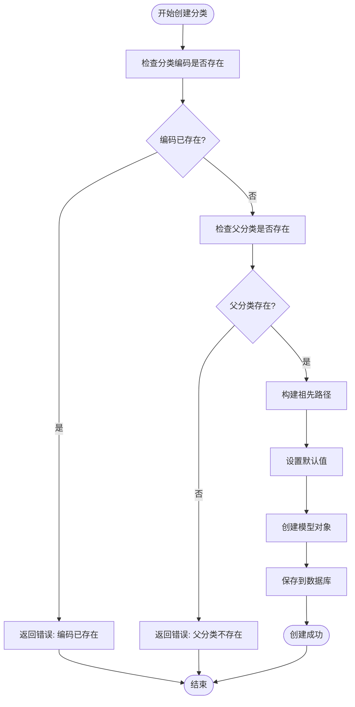
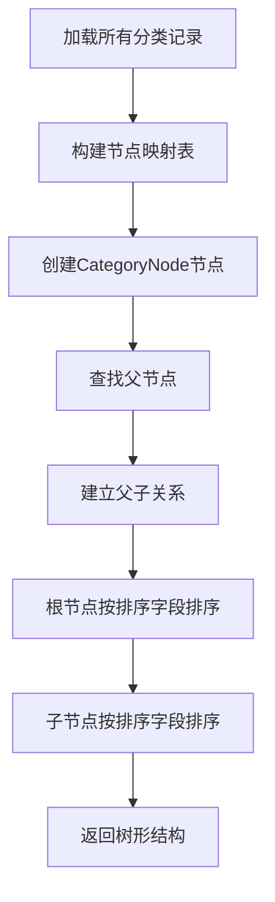
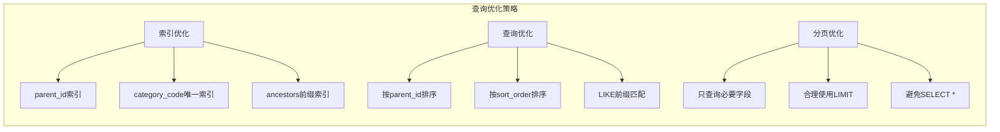
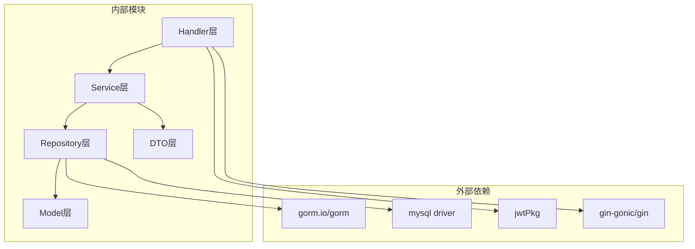

# 电子书分类管理API

<cite>
**本文档引用的文件**
- [book_category.go](file://app/server/internal/handler/v1/book_category.go)
- [book_category.go](file://app/server/internal/service/book_category.go)
- [book_category.go](file://app/server/internal/repository/book_category.go)
- [book_category.go](file://app/server/internal/model/book_category.go)
- [book_category.go](file://app/server/internal/dto/book_category.go)
- [router.go](file://app/server/internal/router/router.go)
- [auth.go](file://app/server/internal/middleware/auth.go)
- [main.go](file://app/server/cmd/api/main.go)
- [book_v1.sql](file://app/sql/book_v1.sql)
- [book-manage.ts](file://app/web/src/service/api/book-manage.ts)
- [book-manage.d.ts](file://app/web/src/typings/api/book-manage.d.ts)
</cite>

## 目录
1. [简介](#简介)
2. [项目结构](#项目结构)
3. [核心组件](#核心组件)
4. [架构概览](#架构概览)
5. [详细组件分析](#详细组件分析)
6. [依赖关系分析](#依赖关系分析)
7. [性能考虑](#性能考虑)
8. [故障排除指南](#故障排除指南)
9. [结论](#结论)
10. [附录](#附录)

## 简介

电子书分类管理API是Boread小说阅读平台的核心功能模块，提供完整的电子书分类管理体系。该系统基于Go语言和Gin框架构建，采用分层架构设计，支持树形分类结构、父子关系维护、分类排序、权限控制等高级特性。

本API主要功能包括：
- 分类的增删改查操作
- 分类树形结构展示
- 分类父子关系维护
- 分类排序和层级管理
- 权限控制和批量操作
- 分类统计和热门分类展示

## 项目结构

Boread项目采用典型的三层架构设计，分为表示层、业务逻辑层和服务层：



**图表来源**
- [book_category.go:15-21](file://app/server/internal/handler/v1/book_category.go#L15-L21)
- [book_category.go:22-28](file://app/server/internal/service/book_category.go#L22-L28)
- [book_category.go:11-17](file://app/server/internal/repository/book_category.go#L11-L17)

**章节来源**
- [router.go:15-206](file://app/server/internal/router/router.go#L15-L206)
- [main.go:30-85](file://app/server/cmd/api/main.go#L30-L85)

## 核心组件

### 数据模型定义

电子书分类的数据模型采用标准的树形结构设计，支持无限层级的父子关系：

| 字段名 | 类型 | 约束 | 描述 | 默认值 |
|--------|------|------|------|--------|
| id | bigint unsigned | 主键, 自增 | 分类唯一标识 | - |
| parent_id | bigint unsigned | 索引 | 父分类ID | 0 |
| ancestors | varchar(1024) | - | 祖先路径(如: 0,1,5) | '' |
| category_name | varchar(64) | not null | 分类名称 | - |
| category_code | varchar(64) | not null, 唯一 | 分类编码 | - |
| description | varchar(255) | - | 分类描述 | null |
| sort_order | int | - | 排序权重 | 0 |
| is_hot | tinyint(1) | - | 是否热门分类 | false |
| status | char(1) | - | 状态: 1-启用, 2-禁用 | '1' |
| create_by | bigint unsigned | - | 创建人ID | null |
| create_time | datetime(3) | 自动创建 | 创建时间 | 当前时间 |
| update_by | bigint unsigned | - | 更新人ID | null |
| update_time | datetime(3) | 自动更新 | 更新时间 | 当前时间 |
| deleted_at | datetime(3) | 索引 | 软删除时间 | null |

**章节来源**
- [book_category.go:3-13](file://app/server/internal/model/book_category.go#L3-L13)
- [book_v1.sql:37-57](file://app/sql/book_v1.sql#L37-L57)

### API接口定义

系统提供以下核心API接口：

#### 分类树形展示
- **GET** `/api/manage/book-category/tree` - 获取完整的分类树形结构
- **GET** `/api/book-category/hot` - 获取热门分类列表（公开接口）

#### 分类CRUD操作
- **POST** `/api/manage/book-category` - 创建新分类
- **GET** `/api/manage/book-category/{id}` - 获取分类详情
- **PUT** `/api/manage/book-category/{id}` - 更新分类信息
- **DELETE** `/api/manage/book-category/{id}` - 删除分类

#### 分类分页查询
- **POST** `/api/manage/book-category/page` - 分类分页列表（树形结构）

**章节来源**
- [book_category.go:23-183](file://app/server/internal/handler/v1/book_category.go#L23-L183)
- [router.go:152-158](file://app/server/internal/router/router.go#L152-L158)

## 架构概览

系统采用经典的MVC架构模式，结合领域驱动设计原则：



**图表来源**
- [book_category.go:70-82](file://app/server/internal/handler/v1/book_category.go#L70-L82)
- [book_category.go:30-66](file://app/server/internal/service/book_category.go#L30-L66)
- [book_category.go:19-21](file://app/server/internal/repository/book_category.go#L19-L21)

**章节来源**
- [book_category.go:30-66](file://app/server/internal/service/book_category.go#L30-L66)

## 详细组件分析

### 数据传输对象(DTO)

系统使用DTO模式来封装API请求和响应数据：



**图表来源**
- [book_category.go:5-42](file://app/server/internal/dto/book_category.go#L5-L42)

**章节来源**
- [book_category.go:5-42](file://app/server/internal/dto/book_category.go#L5-L42)

### 服务层实现

服务层负责处理业务逻辑和事务管理：

#### 分类创建流程


**图表来源**
- [book_category.go:30-66](file://app/server/internal/service/book_category.go#L30-L66)

#### 分类树形构建算法
服务层实现了高效的树形结构构建算法：



**图表来源**
- [book_category.go:139-172](file://app/server/internal/service/book_category.go#L139-L172)

**章节来源**
- [book_category.go:131-172](file://app/server/internal/service/book_category.go#L131-L172)

### 数据访问层

数据访问层提供了对MySQL数据库的抽象：

#### 分类查询优化


**图表来源**
- [book_category.go:47-53](file://app/server/internal/repository/book_category.go#L47-L53)

**章节来源**
- [book_category.go:47-108](file://app/server/internal/repository/book_category.go#L47-L108)

## 依赖关系分析

系统采用清晰的依赖层次结构：



**图表来源**
- [main.go:3-19](file://app/server/cmd/api/main.go#L3-L19)
- [router.go:3-13](file://app/server/internal/router/router.go#L3-L13)

**章节来源**
- [main.go:3-19](file://app/server/cmd/api/main.go#L3-L19)
- [router.go:3-13](file://app/server/internal/router/router.go#L3-L13)

## 性能考虑

### 数据库性能优化

1. **索引设计**
   - `parent_id` 索引：加速父子关系查询
   - `category_code` 唯一索引：确保编码唯一性
   - `ancestors` 前缀索引：支持祖先路径快速匹配

2. **查询优化**
   - 使用 `ORDER BY parent_id ASC, sort_order ASC` 实现有序查询
   - 分页查询使用 `LIMIT` 和 `OFFSET` 控制结果集大小
   - 避免 `SELECT *`，只查询必要字段

3. **缓存策略**
   - 分类树形结构可考虑内存缓存
   - 热门分类数据可短期缓存

### API性能优化

1. **批量操作**
   - 支持批量删除和更新操作
   - 合理使用事务保证数据一致性

2. **分页查询**
   - 默认分页大小限制
   - 合理的排序字段选择

## 故障排除指南

### 常见错误处理

系统定义了以下错误类型：

| 错误代码 | 错误类型 | 描述 | 处理建议 |
|----------|----------|------|----------|
| 1001 | 参数验证错误 | 请求参数无效 | 检查请求格式和必填字段 |
| 2001 | 认证头缺失 | 缺少Authorization头 | 确保携带正确的Bearer Token |
| 2002 | Token无效 | Token格式或过期 | 重新登录获取有效Token |
| 3001 | 分类编码已存在 | category_code重复 | 修改为唯一的分类编码 |
| 3002 | 存在子分类 | 不能删除有子分类的节点 | 先删除或转移子分类 |
| 5001 | 服务器内部错误 | 未知服务器错误 | 检查服务器日志和数据库连接 |

### 调试技巧

1. **启用详细日志**
   ```bash
   # 设置日志级别为Debug
   export LOG_LEVEL=debug
   ```

2. **使用Swagger界面**
   访问 `http://localhost:8080/swagger/index.html` 查看API文档和测试工具

3. **数据库连接检查**
   - 验证MySQL连接字符串
   - 检查数据库权限配置
   - 确认表结构完整

**章节来源**
- [book_category.go:157-167](file://app/server/internal/handler/v1/book_category.go#L157-L167)
- [auth.go:12-41](file://app/server/internal/middleware/auth.go#L12-L41)

## 结论

电子书分类管理API是一个设计良好的RESTful服务，具有以下特点：

1. **清晰的架构层次**：采用分层架构，职责分离明确
2. **完善的错误处理**：提供详细的错误码和错误信息
3. **高性能设计**：合理的数据库索引和查询优化
4. **安全可靠**：基于JWT的认证机制和权限控制
5. **易于扩展**：模块化设计支持功能扩展

该API为Boread小说阅读平台提供了强大的分类管理能力，支持复杂的树形结构和丰富的业务场景。

## 附录

### API使用示例

#### 获取分类树形结构
```javascript
// 前端调用示例
fetchGetCategoryTree().then(response => {
  console.log('分类树:', response.data);
});
```

#### 创建新分类
```javascript
// 前端调用示例
fetchCreateCategory({
  parentId: 0,
  categoryName: '玄幻小说',
  categoryCode: 'xuanhuan',
  description: '玄幻小说分类',
  sortOrder: 1,
  isHot: true,
  status: '1'
}).then(response => {
  console.log('创建成功:', response.data);
});
```

#### 分类分页查询
```javascript
// 前端调用示例
fetchGetCategoryList({
  current: 1,
  size: 10,
  categoryName: '小说',
  status: '1'
}).then(response => {
  console.log('分页结果:', response.data);
});
```

**章节来源**
- [book-manage.ts:10-67](file://app/web/src/service/api/book-manage.ts#L10-L67)
- [book-manage.d.ts:15-36](file://app/web/src/typings/api/book-manage.d.ts#L15-L36)