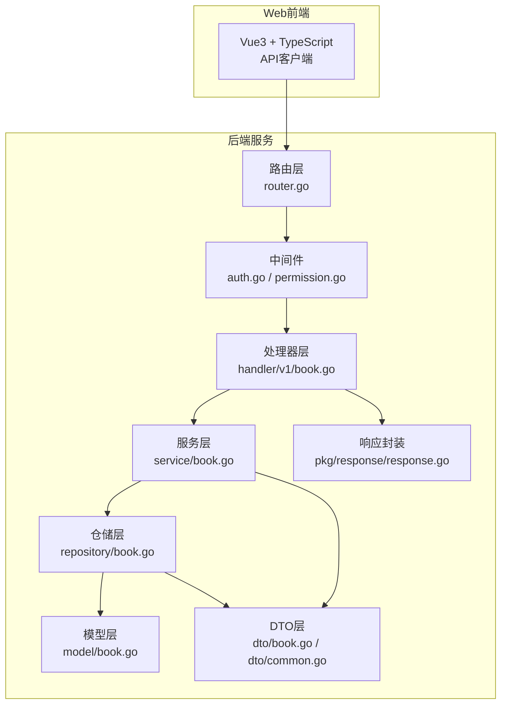
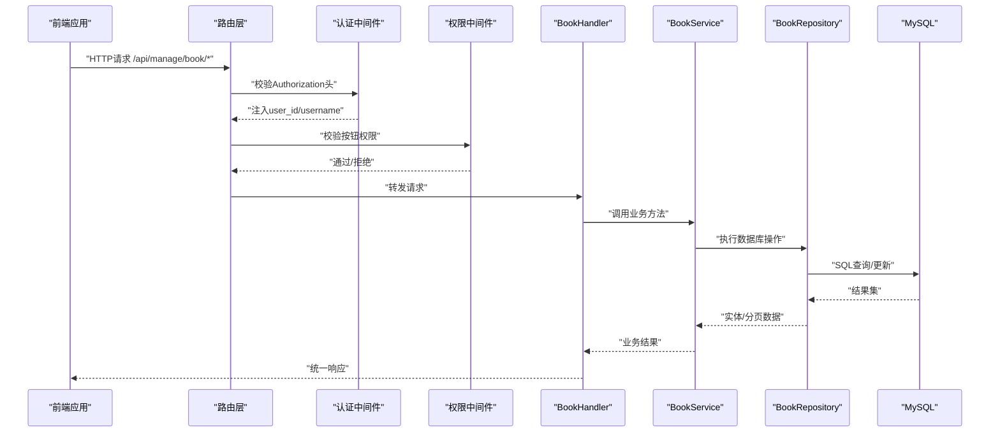
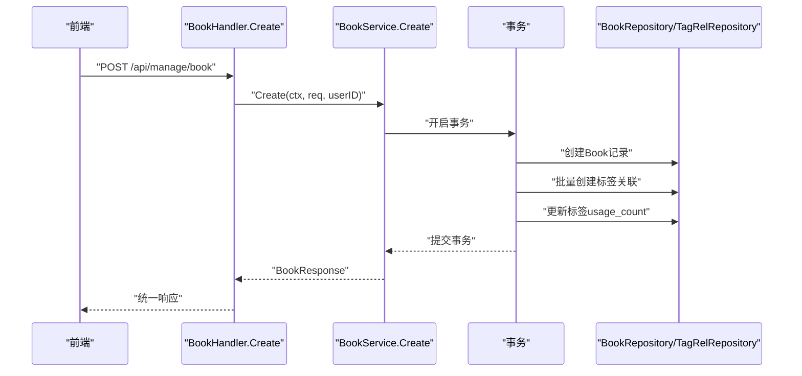
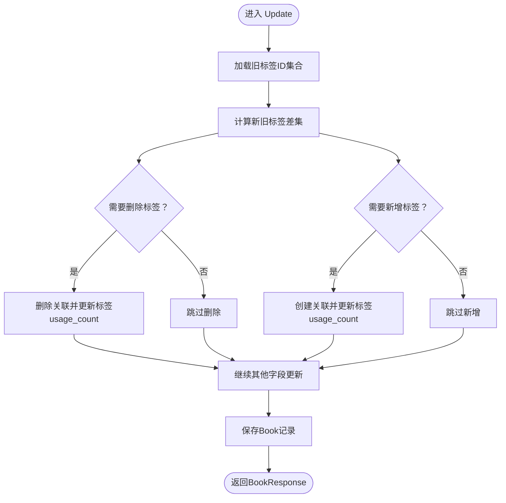
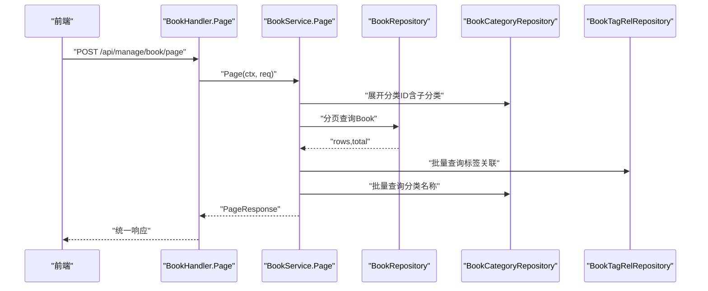
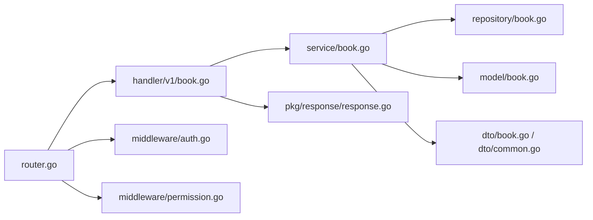

# 电子书基础管理API

<cite>
**本文档引用的文件**
- [main.go](file://app/server/cmd/api/main.go)
- [router.go](file://app/server/internal/router/router.go)
- [auth.go](file://app/server/internal/middleware/auth.go)
- [permission.go](file://app/server/internal/middleware/permission.go)
- [book.go](file://app/server/internal/handler/v1/book.go)
- [book.go](file://app/server/internal/service/book.go)
- [book.go](file://app/server/internal/repository/book.go)
- [book.go](file://app/server/internal/model/book.go)
- [book.go](file://app/server/internal/dto/book.go)
- [common.go](file://app/server/internal/dto/common.go)
- [response.go](file://app/server/pkg/response/response.go)
- [book-manage.ts](file://app/web/src/service/api/book-manage.ts)
- [book-manage.d.ts](file://app/web/src/typings/api/book-manage.d.ts)
- [book_v4.sql](file://app/sql/book_v4.sql)
</cite>

## 目录
1. [简介](#简介)
2. [项目结构](#项目结构)
3. [核心组件](#核心组件)
4. [架构概览](#架构概览)
5. [详细组件分析](#详细组件分析)
6. [依赖关系分析](#依赖关系分析)
7. [性能考虑](#性能考虑)
8. [故障排除指南](#故障排除指南)
9. [结论](#结论)
10. [附录](#附录)

## 简介
本文件为电子书基础管理API的完整技术文档，覆盖电子书的增删改查、状态管理、权限控制与批量操作支持。文档基于实际代码实现，详细说明了请求参数、响应格式、数据验证规则，并提供前后端交互的最佳实践与常见错误处理。

## 项目结构
后端采用Go语言与Gin框架，遵循分层架构：路由层负责HTTP路由与中间件装配；处理器层承接请求并调用服务层；服务层封装业务逻辑；仓储层负责数据持久化；DTO与模型定义数据结构；响应封装统一返回格式；中间件提供认证与权限控制。

**图表来源**
- [router.go:15-206](file://app/server/internal/router/router.go#L15-L206)
- [auth.go:12-41](file://app/server/internal/middleware/auth.go#L12-L41)
- [permission.go:10-53](file://app/server/internal/middleware/permission.go#L10-L53)
- [book.go:15-180](file://app/server/internal/handler/v1/book.go#L15-L180)
- [book.go:21-339](file://app/server/internal/service/book.go#L21-L339)
- [book.go:12-169](file://app/server/internal/repository/book.go#L12-L169)
- [book.go:40-70](file://app/server/internal/model/book.go#L40-L70)
- [book.go:5-53](file://app/server/internal/dto/book.go#L5-L53)
- [common.go:3-52](file://app/server/internal/dto/common.go#L3-L52)
- [response.go:9-37](file://app/server/pkg/response/response.go#L9-L37)

**章节来源**
- [main.go:30-85](file://app/server/cmd/api/main.go#L30-L85)
- [router.go:15-206](file://app/server/internal/router/router.go#L15-L206)

## 核心组件
- 路由与中间件：统一装配认证与按钮级权限中间件，保护管理接口。
- 处理器(BookHandler)：暴露REST接口，负责参数解析、调用服务层并返回统一响应。
- 服务层(BookService)：实现业务规则，如标签与分类校验、事务处理、状态转换。
- 仓储层(BookRepository)：构建复杂查询条件，支持分页、范围查询与关联查询。
- DTO与模型：定义请求/响应结构与枚举常量，确保前后端一致。
- 统一响应：标准化返回码与消息，便于前端统一处理。

**章节来源**
- [book.go:15-180](file://app/server/internal/handler/v1/book.go#L15-L180)
- [book.go:21-339](file://app/server/internal/service/book.go#L21-L339)
- [book.go:12-169](file://app/server/internal/repository/book.go#L12-L169)
- [book.go:5-53](file://app/server/internal/dto/book.go#L5-L53)
- [response.go:9-37](file://app/server/pkg/response/response.go#L9-L37)

## 架构概览
以下序列图展示从浏览器到数据库的完整调用链路，包括认证、权限校验、业务处理与数据持久化。

**图表来源**
- [router.go:78-174](file://app/server/internal/router/router.go#L78-L174)
- [auth.go:12-41](file://app/server/internal/middleware/auth.go#L12-L41)
- [permission.go:10-53](file://app/server/internal/middleware/permission.go#L10-L53)
- [book.go:23-180](file://app/server/internal/handler/v1/book.go#L23-L180)
- [book.go:45-316](file://app/server/internal/service/book.go#L45-L316)
- [book.go:40-84](file://app/server/internal/repository/book.go#L40-L84)

## 详细组件分析

### 1. 接口总览与权限控制
- 所有管理接口均位于 `/api/manage` 路径下，需登录态。
- 写操作（新增/修改/删除）还需对应按钮权限，如 `book:create`、`book:update`、`book:delete`。
- 只读接口（如分页列表、详情）仅需登录态，不进行按钮级校验。

**章节来源**
- [router.go:94-174](file://app/server/internal/router/router.go#L94-L174)

### 2. 电子书创建接口
- 方法与路径：POST `/api/manage/book`
- 权限：需要按钮权限 `book:create`
- 请求体：BookRequest（见“请求参数”小节）
- 成功响应：BookResponse（包含标签ID、标签详情、分类名称）
- 失败场景：
  - 参数校验失败：返回统一错误码与错误信息
  - 分类不存在：映射为业务错误码
  - 标签无效：映射为业务错误码
  - 数据库异常：映射为系统错误码

**图表来源**
- [book.go:45-116](file://app/server/internal/service/book.go#L45-L116)
- [book.go:118-208](file://app/server/internal/service/book.go#L118-L208)
- [book.go:20-38](file://app/server/internal/repository/book.go#L20-L38)
- [book.go:132-137](file://app/server/internal/repository/book.go#L132-L137)

**章节来源**
- [book.go:45-66](file://app/server/internal/handler/v1/book.go#L45-L66)
- [book.go:45-116](file://app/server/internal/service/book.go#L45-L116)
- [book.go:5-16](file://app/server/internal/dto/book.go#L5-L16)

### 3. 电子书更新接口
- 方法与路径：PUT `/api/manage/book/{id}`
- 权限：需要按钮权限 `book:update`
- 路径参数：id（书籍ID）
- 请求体：BookRequest
- 特殊处理：标签变更采用差集计算，仅对新增/删除的标签进行操作，避免全量替换。

**图表来源**
- [book.go:118-208](file://app/server/internal/service/book.go#L118-L208)
- [book.go:153-202](file://app/server/internal/service/book.go#L153-L202)
- [book.go:118-137](file://app/server/internal/repository/book.go#L118-L137)

**章节来源**
- [book.go:68-95](file://app/server/internal/handler/v1/book.go#L68-L95)
- [book.go:118-208](file://app/server/internal/service/book.go#L118-L208)

### 4. 电子书删除接口
- 方法与路径：DELETE `/api/manage/book/{id}`
- 权限：需要按钮权限 `book:delete`
- 行为：删除书籍及其标签关联，并回滚标签usage_count。

**章节来源**
- [book.go:97-116](file://app/server/internal/handler/v1/book.go#L97-L116)
- [book.go:210-234](file://app/server/internal/service/book.go#L210-L234)

### 5. 电子书详情接口
- 方法与路径：GET `/api/manage/book/{id}`
- 权限：仅需登录态
- 返回：BookResponse，包含标签ID、标签详情、分类名称。

**章节来源**
- [book.go:23-43](file://app/server/internal/handler/v1/book.go#L23-L43)
- [book.go:236-256](file://app/server/internal/service/book.go#L236-L256)

### 6. 电子书分页列表接口
- 方法与路径：POST `/api/manage/book/page`
- 权限：仅需登录态
- 请求体：BookSearch（支持标题/作者/分类/状态/可见性/连载状态/标签/字数范围/更新时间范围等）
- 返回：分页响应（records、current、size、total）

**图表来源**
- [book.go:118-139](file://app/server/internal/service/book.go#L118-L139)
- [book.go:258-306](file://app/server/internal/service/book.go#L258-L306)
- [book.go:40-84](file://app/server/internal/repository/book.go#L40-L84)

**章节来源**
- [book.go:118-139](file://app/server/internal/handler/v1/book.go#L118-L139)
- [book.go:258-306](file://app/server/internal/service/book.go#L258-L306)

### 7. 电子书状态更新接口
- 方法与路径：PUT `/api/manage/book/{id}/status`
- 权限：需要按钮权限 `book:update`
- 请求体：BookUpdateStatusRequest（status枚举：1-已上架 2-下架 3-审核中 4-审核拒绝）
- 行为：更新书籍状态字段。

**章节来源**
- [book.go:141-167](file://app/server/internal/handler/v1/book.go#L141-L167)
- [book.go:308-316](file://app/server/internal/service/book.go#L308-L316)

### 8. 请求参数与响应格式

#### 8.1 请求参数
- BookRequest（创建/更新）
  - title：必填，最大长度255
  - author：最大长度128
  - cover：封面URL（可空）
  - intro：简介（可空）
  - categoryId：分类ID（可空）
  - language：语言，默认"zh-CN"
  - serialStatus：连载状态，取值1/2/3
  - visibility：可见性，取值1/2/3
  - tagIds：标签ID数组

- BookUpdateStatusRequest
  - status：必填，取值1/2/3/4

- BookSearch（分页）
  - 继承PageRequest（current、size、keyword）
  - title、author：模糊匹配
  - categoryId：父分类ID（内部展开为包含子分类的ID列表）
  - status、visibility、serialStatus：精确匹配
  - tagId：通过标签关联过滤
  - minWords、maxWords：字数范围（单位万字）
  - updateTimeFrom、updateTimeTo：更新时间范围

**章节来源**
- [book.go:5-16](file://app/server/internal/dto/book.go#L5-L16)
- [book.go:18-21](file://app/server/internal/dto/book.go#L18-L21)
- [book.go:23-38](file://app/server/internal/dto/book.go#L23-L38)
- [common.go:3-23](file://app/server/internal/dto/common.go#L3-L23)

#### 8.2 响应格式
- 统一响应结构：code、message、data
- 成功：code=0，message="success"
- 失败：code为业务/系统错误码，message为错误描述

**章节来源**
- [response.go:9-37](file://app/server/pkg/response/response.go#L9-L37)

### 9. 数据模型与枚举
- Book模型字段：标题、作者、封面、简介、分类ID、语言、连载状态、可见性、主文件ID、章节数、字数、聚合状态、评分、评分人数、所有者ID、部门ID、状态等。
- 枚举类型：
  - SerialStatus：1-连载中 2-已完结 3-断更
  - Visibility：1-公开 2-私有 3-部门内
  - AggregateStatus：1-单文件 2-聚合中 3-聚合完成
  - BookStatus：1-已上架 2-下架 3-审核中 4-审核拒绝

**章节来源**
- [book.go:40-70](file://app/server/internal/model/book.go#L40-L70)

### 10. 权限控制机制
- 认证中间件：校验Authorization头格式与JWT有效性，注入user_id与username。
- 按钮权限中间件：根据用户ID加载其按钮权限集合，校验目标操作是否具备相应权限。
- 路由装配：写操作路由使用RequireButton中间件，只读路由不校验按钮权限。

**章节来源**
- [auth.go:12-41](file://app/server/internal/middleware/auth.go#L12-L41)
- [permission.go:10-53](file://app/server/internal/middleware/permission.go#L10-L53)
- [router.go:94-174](file://app/server/internal/router/router.go#L94-L174)

### 11. 前后端交互与最佳实践
- 前端API封装：位于book-manage.ts，提供分页、详情、创建、更新、删除、状态更新等方法。
- 类型定义：book-manage.d.ts提供Book、BookRequest、BookSearchParams、BookUpdateStatusRequest等类型，确保前后端一致。
- 最佳实践：
  - 使用分页查询时，合理设置current与size，避免过大页码与页大小。
  - 创建/更新时，确保传入合法的枚举值与非空约束字段。
  - 状态更新仅在必要时调用，避免频繁变更导致的业务混乱。
  - 错误处理：统一捕获code非0的情况，提示用户或引导重试。

**章节来源**
- [book-manage.ts:116-166](file://app/web/src/service/api/book-manage.ts#L116-L166)
- [book-manage.d.ts:64-119](file://app/web/src/typings/api/book-manage.d.ts#L64-L119)

## 依赖关系分析

**图表来源**
- [router.go:15-206](file://app/server/internal/router/router.go#L15-L206)
- [book.go:15-180](file://app/server/internal/handler/v1/book.go#L15-L180)
- [book.go:21-339](file://app/server/internal/service/book.go#L21-L339)
- [book.go:12-169](file://app/server/internal/repository/book.go#L12-L169)
- [book.go:5-53](file://app/server/internal/dto/book.go#L5-L53)
- [common.go:3-52](file://app/server/internal/dto/common.go#L3-L52)
- [response.go:9-37](file://app/server/pkg/response/response.go#L9-L37)
- [auth.go:12-41](file://app/server/internal/middleware/auth.go#L12-L41)
- [permission.go:10-53](file://app/server/internal/middleware/permission.go#L10-L53)

**章节来源**
- [router.go:15-206](file://app/server/internal/router/router.go#L15-L206)
- [book.go:15-180](file://app/server/internal/handler/v1/book.go#L15-L180)
- [book.go:21-339](file://app/server/internal/service/book.go#L21-L339)

## 性能考虑
- 分页查询：Repository层按条件拼接SQL并使用COUNT统计总数，建议合理设置分页大小与索引。
- 标签变更：服务层通过差集计算减少数据库写操作，避免全量替换。
- 批量查询：分页时一次性拉取标签与分类映射，降低多次查询成本。
- 权限校验：当前每次请求查询用户按钮权限，建议在高并发场景引入缓存以提升性能。

## 故障排除指南
- 认证失败：检查Authorization头格式是否为Bearer Token，Token是否有效。
- 权限不足：确认用户是否拥有对应按钮权限（如book:create）。
- 参数校验失败：检查请求体字段是否满足DTO绑定规则（如必填、长度、枚举值）。
- 业务错误：如分类不存在、标签无效，需修正输入后再试。
- 数据库异常：查看服务层事务执行日志，定位具体SQL与错误原因。

**章节来源**
- [auth.go:12-41](file://app/server/internal/middleware/auth.go#L12-L41)
- [permission.go:10-53](file://app/server/internal/middleware/permission.go#L10-L53)
- [book.go:169-179](file://app/server/internal/handler/v1/book.go#L169-L179)
- [book.go:45-116](file://app/server/internal/service/book.go#L45-L116)

## 结论
本电子书基础管理API提供了完善的增删改查能力与状态管理，结合认证与按钮级权限控制，确保系统安全可控。通过统一的响应格式与严谨的参数校验，前后端协作更加顺畅。建议在生产环境中进一步优化权限缓存与查询索引，以提升整体性能与稳定性。

## 附录

### A. 数据库表结构（与电子书相关）
- book：存储电子书基本信息与状态字段
- book_tag_rel：书籍与标签的多对多关联表
- book_tag：标签表，包含usage_count用于统计使用次数

**章节来源**
- [book_v4.sql:18-38](file://app/sql/book_v4.sql#L18-L38)
- [book_v4.sql:44-58](file://app/sql/book_v4.sql#L44-L58)
- [book_v4.sql:116-139](file://app/sql/book_v4.sql#L116-L139)