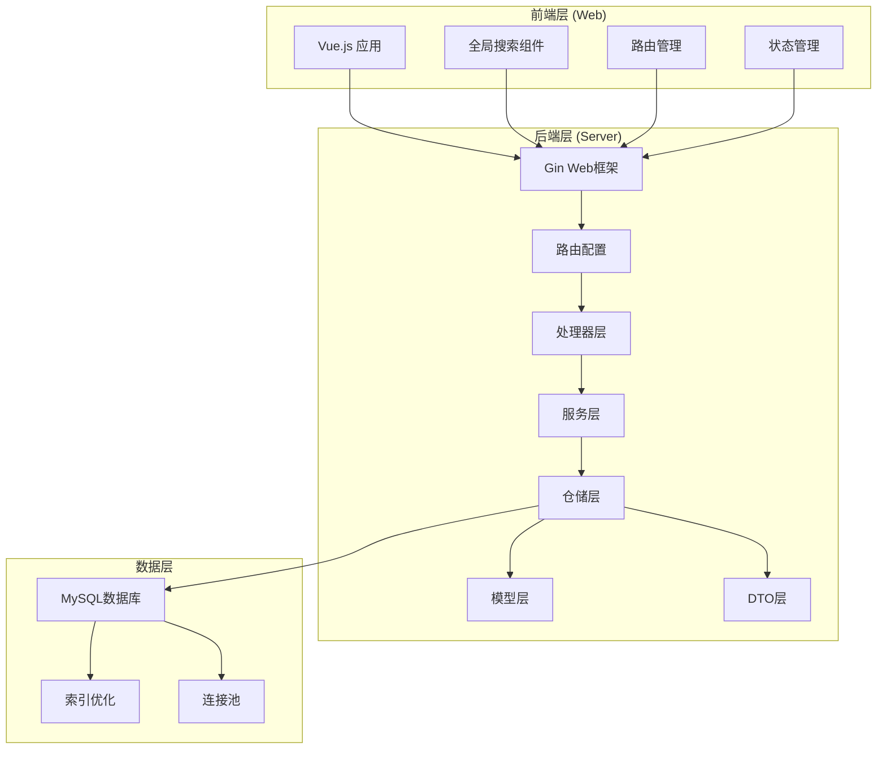
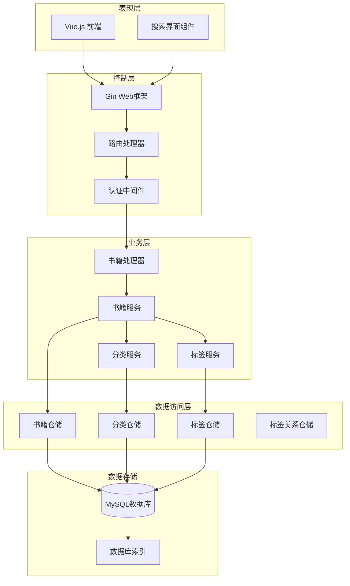
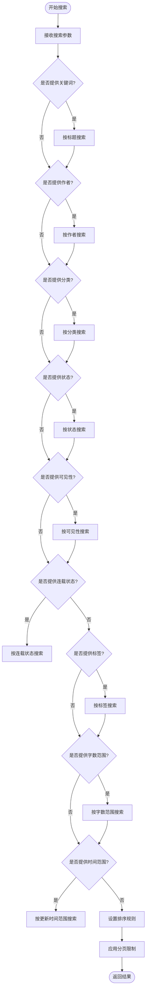
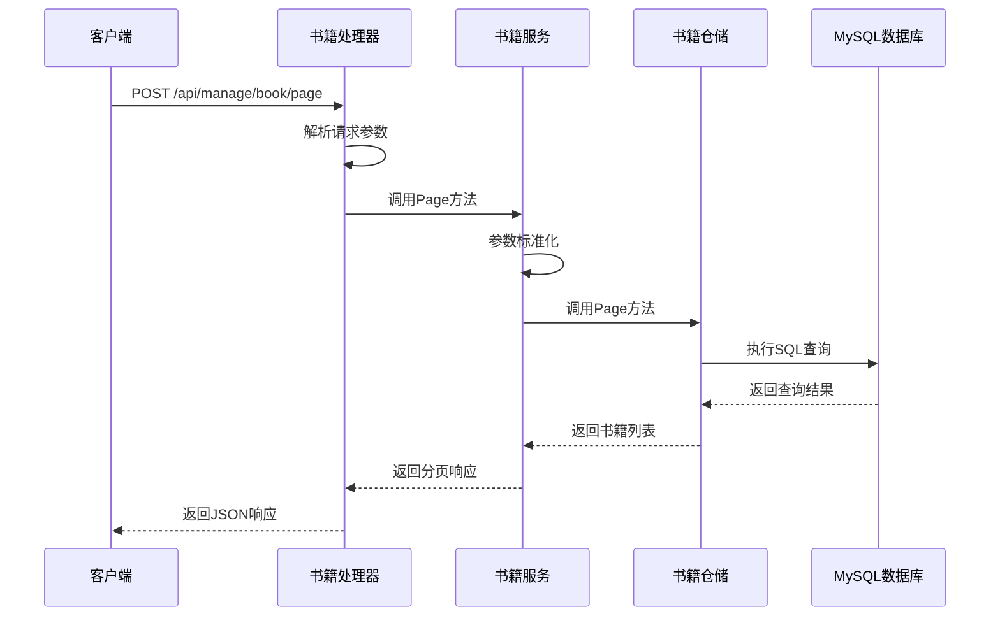
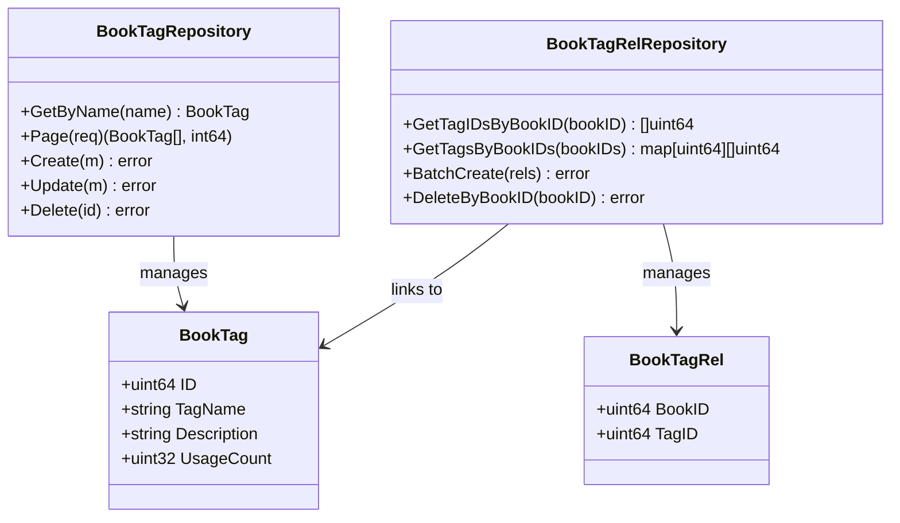
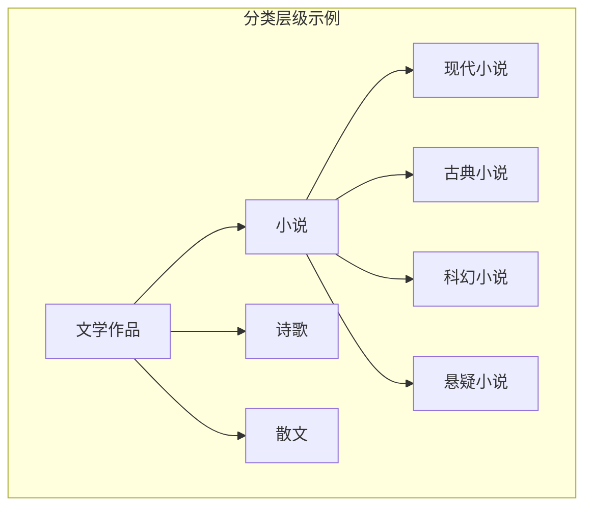
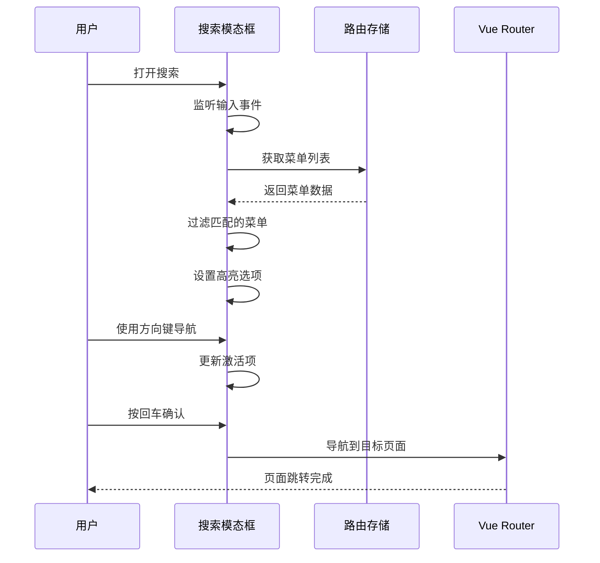
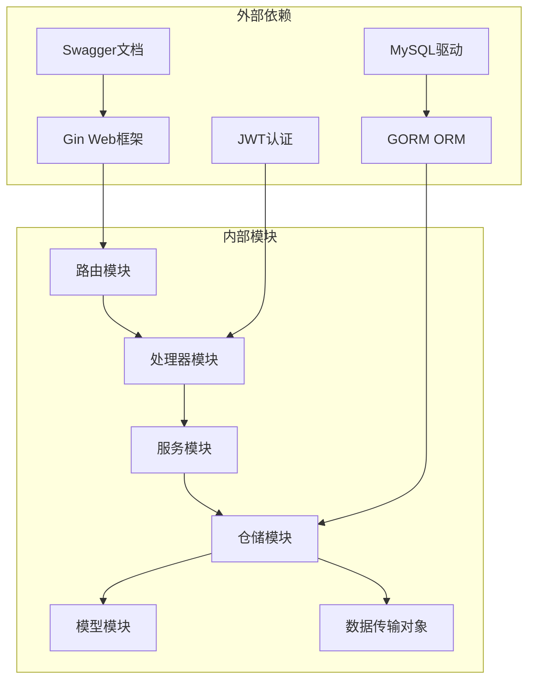
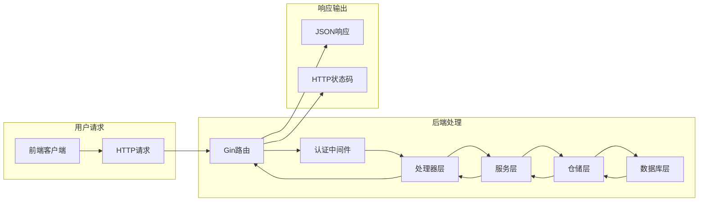
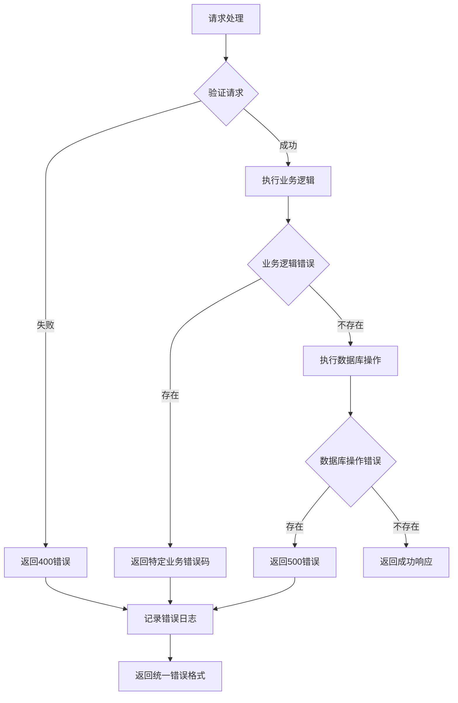

# 电子书搜索过滤API

<cite>
**本文档引用的文件**
- [main.go](file://app/server/cmd/api/main.go)
- [router.go](file://app/server/internal/router/router.go)
- [book.go](file://app/server/internal/handler/v1/book.go)
- [book.go](file://app/server/internal/service/book.go)
- [book.go](file://app/server/internal/repository/book.go)
- [book_category.go](file://app/server/internal/repository/book_category.go)
- [book_tag.go](file://app/server/internal/repository/book_tag.go)
- [book.go](file://app/server/internal/model/book.go)
- [book_category.go](file://app/server/internal/model/book_category.go)
- [book_tag.go](file://app/server/internal/model/book_tag.go)
- [book.go](file://app/server/internal/dto/book.go)
- [common.go](file://app/server/internal/dto/common.go)
- [search-modal.vue](file://app/web/src/layouts/modules/global-search/components/search-modal.vue)
</cite>

## 目录
1. [简介](#简介)
2. [项目结构](#项目结构)
3. [核心组件](#核心组件)
4. [架构概览](#架构概览)
5. [详细组件分析](#详细组件分析)
6. [依赖关系分析](#依赖关系分析)
7. [性能考虑](#性能考虑)
8. [故障排除指南](#故障排除指南)
9. [结论](#结论)
10. [附录](#附录)

## 简介
本项目是一个基于Go语言和Vue.js构建的电子书管理系统，提供了完整的电子书搜索过滤API。该系统支持全文搜索、条件过滤、智能推荐、热门搜索等功能，涵盖了关键词搜索、作者搜索、分类筛选、标签过滤、时间范围查询等多种查询方式。

系统采用经典的三层架构设计（Handler-Service-Repository），通过Gin框架提供RESTful API服务，使用GORM进行数据库操作，并通过Swagger提供API文档自动生成。前端采用Vue.js + TypeScript构建，提供了现代化的用户界面和交互体验。

## 项目结构
项目采用模块化组织方式，主要分为以下层次：

**图表来源**
- [main.go:30-85](file://app/server/cmd/api/main.go#L30-L85)
- [router.go:15-206](file://app/server/internal/router/router.go#L15-L206)

**章节来源**
- [main.go:1-85](file://app/server/cmd/api/main.go#L1-L85)
- [router.go:15-206](file://app/server/internal/router/router.go#L15-L206)

## 核心组件
系统的核心组件包括：

### 1. API入口点
- **应用启动器**: 负责加载配置、初始化数据库连接、设置JWT认证和日志系统
- **路由配置**: 定义所有API端点，包括公开接口和受保护的管理接口

### 2. 业务处理层
- **书籍处理器**: 处理书籍相关的所有API请求
- **书籍服务**: 实现业务逻辑，包括搜索、过滤、分页等功能
- **仓储层**: 提供数据访问接口，封装数据库操作

### 3. 数据模型层
- **书籍模型**: 定义书籍实体结构和字段约束
- **分类模型**: 管理书籍分类体系
- **标签模型**: 实现标签系统和使用统计

### 4. 前端搜索组件
- **全局搜索模态框**: 提供快捷搜索功能
- **搜索结果展示**: 动态显示搜索结果
- **键盘导航**: 支持键盘快捷键操作

**章节来源**
- [book.go:15-180](file://app/server/internal/handler/v1/book.go#L15-L180)
- [book.go:21-43](file://app/server/internal/service/book.go#L21-L43)
- [book.go:12-18](file://app/server/internal/repository/book.go#L12-L18)

## 架构概览
系统采用分层架构设计，确保关注点分离和代码可维护性：

**图表来源**
- [router.go:15-206](file://app/server/internal/router/router.go#L15-L206)
- [book.go:15-180](file://app/server/internal/handler/v1/book.go#L15-L180)
- [book.go:21-43](file://app/server/internal/service/book.go#L21-L43)

## 详细组件分析

### 书籍搜索API组件

#### API端点定义
系统提供了完整的书籍搜索过滤API：

| 端点 | 方法 | 描述 | 权限 |
|------|------|------|------|
| `/api/manage/book/:id` | GET | 获取书籍详情 | BearerAuth |
| `/api/manage/book` | POST | 创建新书籍 | BearerAuth + button:create |
| `/api/manage/book/:id` | PUT | 更新书籍信息 | BearerAuth + button:update |
| `/api/manage/book/:id` | DELETE | 删除书籍 | BearerAuth + button:delete |
| `/api/manage/book/page` | POST | 书籍分页列表 | BearerAuth |

#### 搜索参数详解
书籍搜索支持多种过滤条件：

**图表来源**
- [book.go:258-306](file://app/server/internal/service/book.go#L258-L306)
- [book.go:40-84](file://app/server/internal/repository/book.go#L40-L84)

#### 搜索功能实现

##### 全文搜索实现
系统支持基于LIKE操作符的模糊搜索，适用于标题和作者字段：

**图表来源**
- [book.go:127-139](file://app/server/internal/handler/v1/book.go#L127-L139)
- [book.go:258-306](file://app/server/internal/service/book.go#L258-L306)
- [book.go:40-84](file://app/server/internal/repository/book.go#L40-L84)

##### 条件过滤实现
系统支持多维度的条件过滤，包括：

| 过滤类型 | 字段 | 实现方式 | 性能影响 |
|----------|------|----------|----------|
| 关键词搜索 | title, author | LIKE '%keyword%' | 中等 |
| 分类筛选 | category_id | IN (子分类ID列表) | 低 |
| 标签过滤 | tag_id | 子查询关联 | 中等 |
| 状态过滤 | status | 精确匹配 | 低 |
| 可见性过滤 | visibility | 精确匹配 | 低 |
| 连载状态 | serial_status | 精确匹配 | 低 |
| 字数范围 | total_words | 范围查询 | 低 |
| 时间范围 | update_time | 范围查询 | 低 |

##### 智能推荐功能
系统通过标签使用统计实现智能推荐：

**图表来源**
- [book_tag.go:12-62](file://app/server/internal/repository/book_tag.go#L12-L62)
- [book.go:63-70](file://app/server/internal/model/book.go#L63-L70)

**章节来源**
- [book.go:127-139](file://app/server/internal/handler/v1/book.go#L127-L139)
- [book.go:258-306](file://app/server/internal/service/book.go#L258-L306)
- [book.go:40-84](file://app/server/internal/repository/book.go#L40-L84)

### 分类管理组件

#### 分类层级结构
系统支持多级分类管理，通过祖先路径实现层级关系：

**图表来源**
- [book_category.go:55-77](file://app/server/internal/repository/book_category.go#L55-L77)
- [book_category.go:135-148](file://app/server/internal/repository/book_category.go#L135-L148)

#### 分类搜索实现
系统提供热门分类查询和分类树形结构：

| 功能 | 端点 | 描述 |
|------|------|------|
| 热门分类 | GET /api/book-category/hot | 获取所有热门分类 |
| 分类树 | GET /api/manage/book-category/tree | 获取分类树形结构 |
| 分类详情 | GET /api/manage/book-category/:id | 获取分类详情 |
| 分类分页 | POST /api/manage/book-category/page | 分页查询分类 |

**章节来源**
- [book_category.go:110-149](file://app/server/internal/repository/book_category.go#L110-L149)

### 前端搜索组件

#### 全局搜索实现
前端提供了便捷的全局搜索功能：

**图表来源**
- [search-modal.vue:27-87](file://app/web/src/layouts/modules/global-search/components/search-modal.vue#L27-L87)

#### 搜索功能特性
- **防抖搜索**: 输入延迟300ms触发搜索，减少不必要的请求
- **键盘导航**: 支持Esc、Enter、上下箭头键操作
- **响应式设计**: 支持移动端和桌面端
- **国际化支持**: 支持多语言搜索提示

**章节来源**
- [search-modal.vue:1-124](file://app/web/src/layouts/modules/global-search/components/search-modal.vue#L1-L124)

## 依赖关系分析

### 后端依赖图
系统采用清晰的依赖注入模式：

**图表来源**
- [main.go:3-19](file://app/server/cmd/api/main.go#L3-L19)
- [router.go:35-77](file://app/server/internal/router/router.go#L35-L77)

### 数据流分析
系统的数据流遵循标准的MVC模式：

**图表来源**
- [router.go:78-202](file://app/server/internal/router/router.go#L78-L202)
- [book.go:15-180](file://app/server/internal/handler/v1/book.go#L15-L180)

**章节来源**
- [router.go:35-77](file://app/server/internal/router/router.go#L35-L77)
- [main.go:34-65](file://app/server/cmd/api/main.go#L34-L65)

## 性能考虑

### 数据库优化策略
1. **索引优化**
   - 书籍表的category_id字段建立索引
   - 书籍标签关系表的复合唯一索引
   - 分类表的parent_id和sort_order字段索引

2. **查询优化**
   - 使用IN查询替代多次查询
   - 通过预加载减少N+1查询问题
   - 合理使用LIMIT和OFFSET进行分页

3. **连接池管理**
   - 配置最大空闲连接数和最大打开连接数
   - 合理设置连接超时时间

### 缓存策略
1. **分类缓存**
   - 热门分类数据缓存
   - 分类树形结构缓存

2. **标签缓存**
   - 标签使用统计缓存
   - 标签关联关系缓存

### 性能监控
1. **慢查询监控**
   - 记录执行时间超过阈值的查询
   - 分析查询计划和索引使用情况

2. **内存使用监控**
   - 监控GORM连接池使用情况
   - 跟踪内存分配和垃圾回收

## 故障排除指南

### 常见错误处理
系统实现了完善的错误处理机制：

**图表来源**
- [book.go:169-179](file://app/server/internal/handler/v1/book.go#L169-L179)

### 错误码定义

| 错误码 | 业务含义 | 原因 |
|--------|----------|------|
| 1001 | 请求参数错误 | 参数验证失败 |
| 3001 | 书籍不存在 | 查询不到对应书籍 |
| 3002 | 标签或分类无效 | 标签ID或分类ID不存在 |
| 5001 | 服务器内部错误 | 未知服务器错误 |
| 5002 | 数据库操作失败 | SQL执行错误 |

### 调试技巧
1. **日志分析**
   - 启用详细日志记录
   - 分析请求响应时间和错误堆栈

2. **数据库查询分析**
   - 使用EXPLAIN分析SQL执行计划
   - 监控慢查询日志

3. **性能分析**
   - 使用pprof分析CPU和内存使用
   - 监控Gin路由处理时间

**章节来源**
- [book.go:169-179](file://app/server/internal/handler/v1/book.go#L169-L179)

## 结论
本电子书搜索过滤API系统提供了完整而强大的搜索功能，具有以下特点：

1. **功能完整性**: 支持多种搜索方式和过滤条件
2. **架构清晰**: 采用分层架构，职责明确
3. **性能优化**: 通过索引、缓存和连接池优化
4. **用户体验**: 前后端配合，提供流畅的搜索体验
5. **可扩展性**: 模块化设计，易于功能扩展

系统在实际部署中需要重点关注数据库索引优化、缓存策略和性能监控，以确保在高并发场景下的稳定运行。

## 附录

### API使用示例
系统提供了完整的API文档，可通过Swagger界面查看和测试：

1. **启动服务**: `go run app/server/cmd/api/main.go`
2. **访问文档**: 浏览器访问 `http://localhost:8080/swagger/index.html`
3. **测试接口**: 在Swagger界面直接测试各种搜索功能

### 配置说明
系统支持通过YAML配置文件进行配置管理，包括数据库连接、JWT密钥、日志级别等参数。

### 开发指南
1. **环境要求**: Go 1.19+, MySQL 5.7+
2. **依赖安装**: `go mod tidy`
3. **数据库初始化**: `go run app/server/cmd/api/main.go -seed`
4. **启动开发**: `go run app/server/cmd/api/main.go`