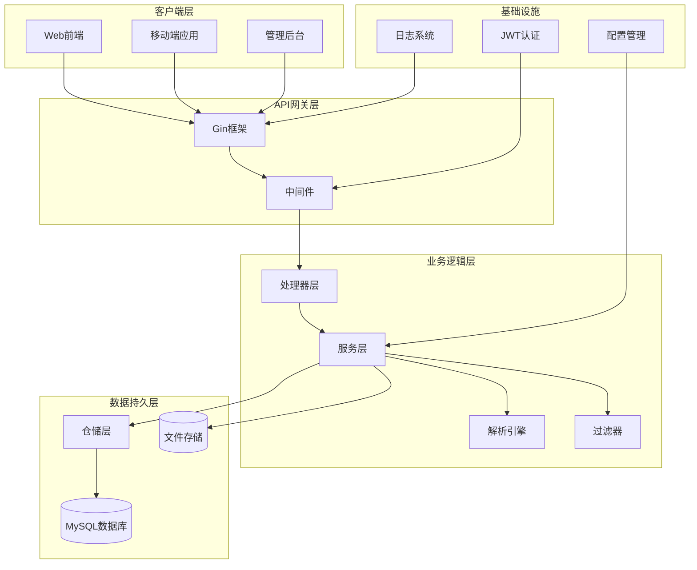
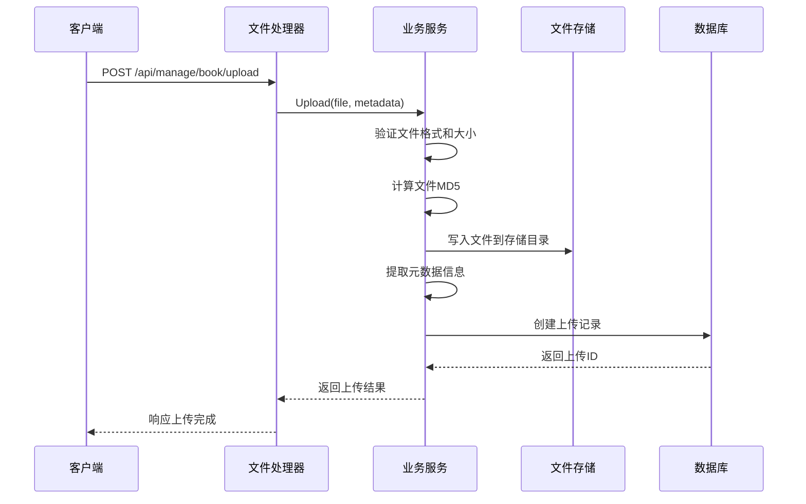
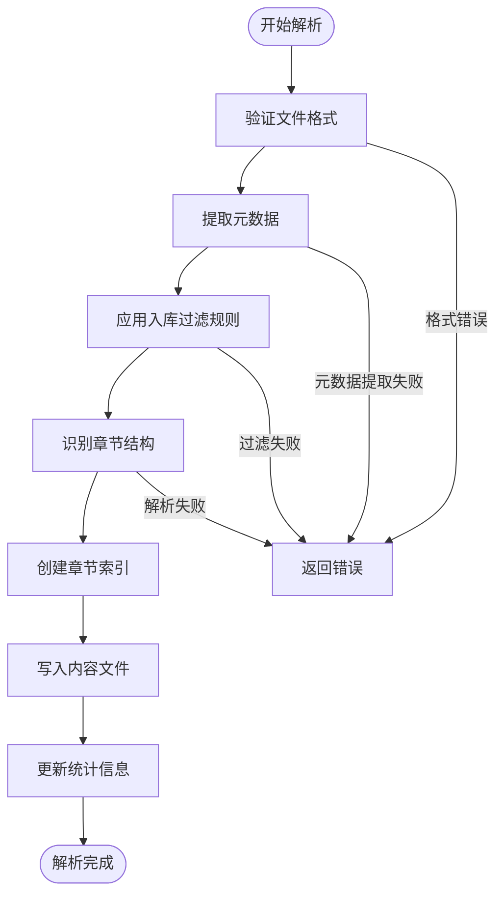
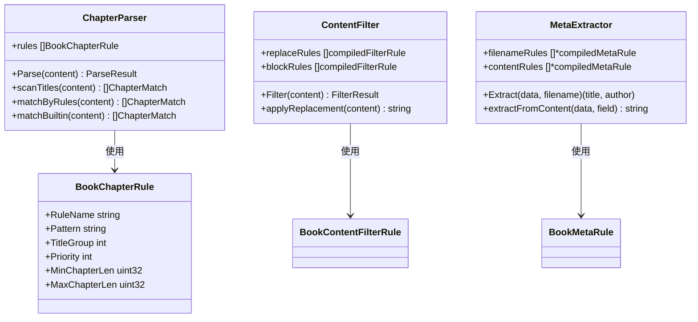
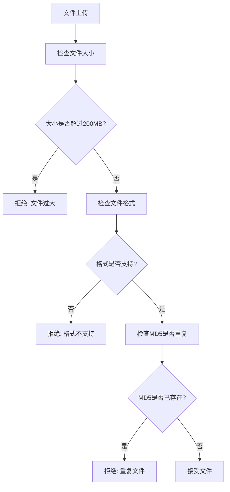
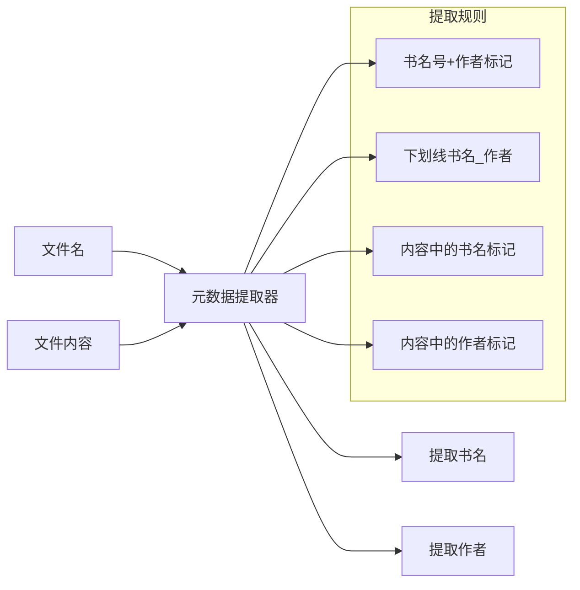
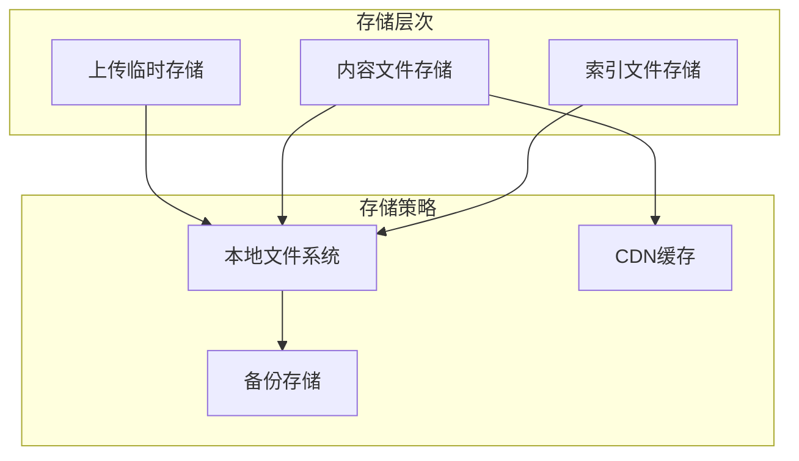
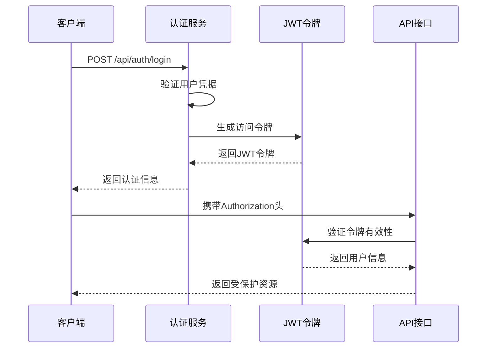
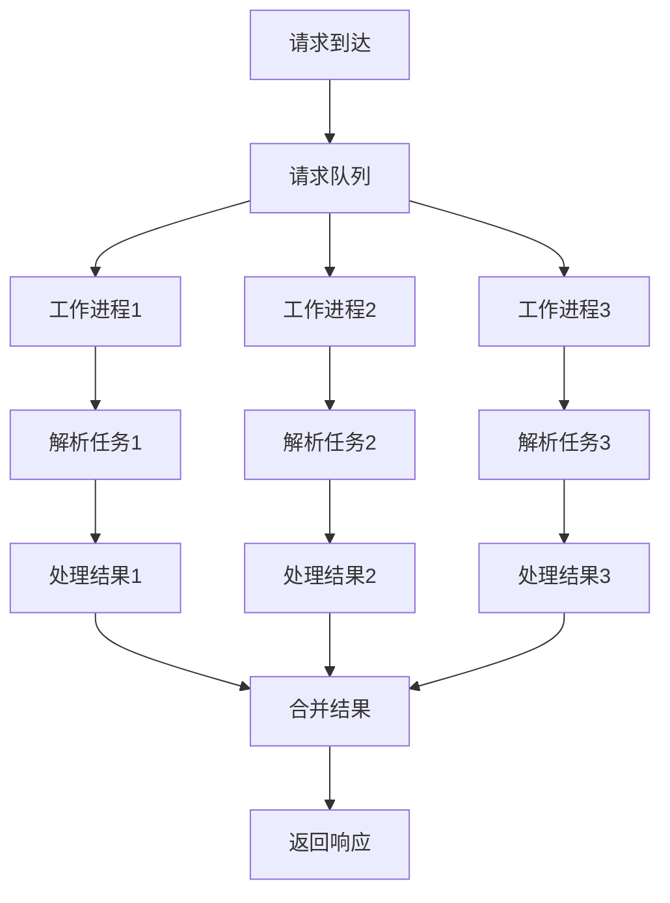

# 电子书文件管理API

<cite>
**本文档引用的文件**
- [main.go](file://app/server/cmd/api/main.go)
- [router.go](file://app/server/internal/router/router.go)
- [book_file.go](file://app/server/internal/handler/v1/book_file.go)
- [book_file_service.go](file://app/server/internal/service/book_file.go)
- [book_parser.go](file://app/server/internal/service/book_parser.go)
- [meta_extractor.go](file://app/server/internal/service/meta_extractor.go)
- [book_file_model.go](file://app/server/internal/model/book_file.go)
- [book_file_dto.go](file://app/server/internal/dto/book_file.go)
- [book_file_repository.go](file://app/server/internal/repository/book_file.go)
- [config.example.yaml](file://app/server/configs/config.example.yaml)
- [book_v4.sql](file://app/sql/book_v4.sql)
- [swagger.yaml](file://app/server/docs/swagger.yaml)
</cite>

## 目录
1. [项目概述](#项目概述)
2. [系统架构](#系统架构)
3. [核心功能模块](#核心功能模块)
4. [API接口详解](#api接口详解)
5. [文件格式支持](#文件格式支持)
6. [文件解析引擎](#文件解析引擎)
7. [存储策略](#存储策略)
8. [安全防护](#安全防护)
9. [性能优化](#性能优化)
10. [部署配置](#部署配置)
11. [故障排查](#故障排查)
12. [总结](#总结)

## 项目概述

Boread是一个基于Go语言开发的小说阅读平台后端系统，专注于电子书文件的管理与处理。该系统提供了完整的电子书文件生命周期管理能力，包括文件上传、解析、章节识别、内容过滤等功能。

### 主要特性

- **多格式支持**：支持TXT、EPUB、MOBI、PDF等多种电子书格式
- **智能解析**：自动识别章节结构，提取元数据信息
- **内容过滤**：支持入库和出库两个阶段的内容净化
- **权限控制**：基于角色的细粒度访问控制
- **扩展性设计**：模块化的架构便于功能扩展

## 系统架构



**图表来源**
- [main.go:30-85](file://app/server/cmd/api/main.go#L30-L85)
- [router.go:15-206](file://app/server/internal/router/router.go#L15-L206)

## 核心功能模块

### 1. 文件上传管理

文件上传是整个电子书管理系统的核心入口，负责接收用户上传的电子书文件并进行初步处理。



**图表来源**
- [book_file.go:29-52](file://app/server/internal/handler/v1/book_file.go#L29-L52)
- [book_file_service.go:82-153](file://app/server/internal/service/book_file.go#L82-L153)

### 2. 文件解析引擎

系统采用双阶段解析策略，确保电子书内容的准确性和完整性。



**图表来源**
- [book_file_service.go:155-292](file://app/server/internal/service/book_file.go#L155-L292)
- [book_parser.go:55-108](file://app/server/internal/service/book_parser.go#L55-L108)

### 3. 章节识别系统

章节识别是电子书解析的核心功能，支持多种识别规则和算法。



**图表来源**
- [book_parser.go:45-53](file://app/server/internal/service/book_parser.go#L45-L53)
- [book_parser.go:235-271](file://app/server/internal/service/book_parser.go#L235-L271)
- [meta_extractor.go:13-23](file://app/server/internal/service/meta_extractor.go#L13-L23)

**章节来源**
- [book_file_service.go:43-78](file://app/server/internal/service/book_file.go#L43-L78)
- [book_parser.go:15-22](file://app/server/internal/service/book_parser.go#L15-L22)

## API接口详解

### 文件上传接口

#### 接口定义
- **路径**: `/api/manage/book/upload`
- **方法**: POST
- **认证**: 需要Bearer Token
- **权限**: book:create

#### 请求参数
| 参数名 | 类型 | 必填 | 描述 |
|--------|------|------|------|
| file | file | 是 | 电子书文件 (支持txt/epub/mobi/pdf) |

#### 响应数据
```json
{
  "code": 200,
  "message": "操作成功",
  "data": {
    "uploadId": 123,
    "originalName": "example.txt",
    "fileSize": 1048576,
    "sourceFormat": "txt",
    "suggestedTitle": "红楼梦",
    "suggestedAuthor": "曹雪芹",
    "matchedBookId": null,
    "matchedBookTitle": null
  }
}
```

### 确认入库接口

#### 接口定义
- **路径**: `/api/manage/book/confirm-import`
- **方法**: POST
- **认证**: 需要Bearer Token
- **权限**: book:create

#### 请求参数
```json
{
  "uploadId": 123,
  "title": "红楼梦",
  "author": "曹雪芹"
}
```

#### 响应数据
```json
{
  "code": 200,
  "message": "操作成功",
  "data": {
    "uploadId": 123,
    "bookId": 456,
    "bookTitle": "红楼梦",
    "bookAuthor": "曹雪芹",
    "chapterCount": 120,
    "parseStatus": "ParseSuccess"
  }
}
```

### 扫描入库接口

#### 接口定义
- **路径**: `/api/manage/book/scan`
- **方法**: POST
- **认证**: 需要Bearer Token
- **权限**: book:create

#### 功能说明
批量扫描所有待处理的上传任务，自动完成文件解析和入库。

### 章节内容读取接口

#### 接口定义
- **路径**: `/api/manage/book/{id}/chapter/{chapterNo}`
- **方法**: GET
- **认证**: 需要Bearer Token

#### 请求参数
| 参数名 | 类型 | 必填 | 描述 |
|--------|------|------|------|
| id | uint64 | 是 | 书籍ID |
| chapterNo | uint32 | 是 | 章节序号 |

#### 响应数据
```json
{
  "code": 200,
  "message": "操作成功",
  "data": {
    "bookChapter": {
      "id": 789,
      "bookId": 456,
      "chapterNo": 1,
      "title": "第一回",
      "byteOffset": 0,
      "byteLength": 1024
    },
    "content": "这是第一章的内容..."
  }
}
```

**章节来源**
- [book_file.go:29-187](file://app/server/internal/handler/v1/book_file.go#L29-L187)
- [book_file_dto.go:7-40](file://app/server/internal/dto/book_file.go#L7-L40)

## 文件格式支持

### 支持的文件格式

系统当前支持以下电子书格式：

| 格式 | 扩展名 | 描述 | 特殊处理 |
|------|--------|------|----------|
| 文本文件 | txt | 纯文本格式 | 直接读取，支持编码检测 |
| EPUB电子书 | epub | 标准电子书格式 | 需要epub解析库 |
| MOBI电子书 | mobi | Mobipocket格式 | 需要mobi解析库 |
| PDF文档 | pdf | Adobe PDF格式 | 需要PDF解析库 |

### 文件验证机制



**图表来源**
- [book_file_service.go:84-101](file://app/server/internal/service/book_file.go#L84-L101)
- [book_parser.go:363-371](file://app/server/internal/service/book_parser.go#L363-L371)

**章节来源**
- [book_file_service.go:24-34](file://app/server/internal/service/book_file.go#L24-L34)
- [book_parser.go:363-371](file://app/server/internal/service/book_parser.go#L363-L371)

## 文件解析引擎

### 章节识别算法

系统采用多层次的章节识别策略：

1. **规则匹配优先**：使用配置的正则表达式规则
2. **内置规则回退**：支持常见的章节格式识别
3. **智能分割**：根据章节边界自动分割内容

### 内容过滤系统

系统提供两阶段的内容过滤机制：

#### 入库过滤 (Input Stage)
- 在文件解析前进行内容净化
- 移除敏感词汇和不当内容
- 统一文本格式

#### 出库过滤 (Output Stage)
- 在章节内容输出时进行二次过滤
- 支持实时内容审查

### 元数据提取

系统支持从文件名和内容中提取元数据：



**图表来源**
- [meta_extractor.go:77-111](file://app/server/internal/service/meta_extractor.go#L77-L111)
- [meta_extractor.go:113-153](file://app/server/internal/service/meta_extractor.go#L113-L153)

**章节来源**
- [book_parser.go:15-22](file://app/server/internal/service/book_parser.go#L15-L22)
- [meta_extractor.go:13-23](file://app/server/internal/service/meta_extractor.go#L13-L23)

## 存储策略

### 文件存储架构



### 存储配置

系统采用分层存储策略：

1. **临时存储**：上传的原始文件保存在临时目录
2. **内容存储**：解析后的标准化内容文件
3. **索引存储**：章节索引和元数据信息

### 文件组织结构

```
storage/
├── books/
│   ├── md5_原始文件名
│   ├── content_书籍ID.txt
│   └── thumbnails/
└── temp/
    └── upload_temp/
```

**章节来源**
- [book_file_service.go:36-41](file://app/server/internal/service/book_file.go#L36-L41)
- [book_file_service.go:103-111](file://app/server/internal/service/book_file.go#L103-L111)

## 安全防护

### 认证授权

系统采用JWT（JSON Web Token）进行身份认证：



**图表来源**
- [main.go:42](file://app/server/cmd/api/main.go#L42)
- [router.go:85-91](file://app/server/internal/router/router.go#L85-L91)

### 权限控制

系统实现基于角色的权限控制（RBAC）：

- **按钮级别权限**：细粒度的功能按钮权限
- **菜单权限**：页面访问权限控制
- **数据范围权限**：支持部门数据范围限制

### 安全措施

1. **文件上传安全**：文件类型验证、大小限制、重复检测
2. **SQL注入防护**：使用GORM ORM防止SQL注入
3. **XSS防护**：内容过滤和HTML转义
4. **CSRF防护**：跨站请求伪造防护

**章节来源**
- [router.go:94-201](file://app/server/internal/router/router.go#L94-L201)
- [book_file_service.go:24-34](file://app/server/internal/service/book_file.go#L24-L34)

## 性能优化

### 缓存策略

系统采用多层缓存机制：

1. **Redis缓存**：热点数据缓存
2. **文件系统缓存**：静态资源缓存
3. **数据库查询缓存**：常用查询结果缓存

### 并发处理



### 数据库优化

1. **索引优化**：为常用查询字段建立索引
2. **连接池**：配置合适的数据库连接池大小
3. **查询优化**：避免N+1查询问题
4. **分页查询**：大数据量场景使用分页

## 部署配置

### 环境配置

系统支持通过配置文件进行环境配置：

```yaml
server:
  port: 8080
  mode: debug

database:
  driver: mysql
  host: 127.0.0.1
  port: 3306
  username: your_db_user
  password: your_db_password
  dbname: boread
  max_idle_conns: 10
  max_open_conns: 100

jwt:
  secret: change-me-to-a-random-secret
  expire: 7200

log:
  level: info
  file: logs/boread.log
```

### 数据库初始化

系统提供数据库迁移脚本，支持版本升级：

```bash
# 初始化数据库
mysql -u username -p boread < app/sql/book_v4.sql

# 查看数据库状态
mysqlshow -u username -p boread
```

### 启动方式

```bash
# 开发模式启动
go run app/server/cmd/api/main.go

# 生产模式启动
./boread-server

# 数据库种子初始化
go run app/server/cmd/api/main.go -seed
```

**章节来源**
- [config.example.yaml:1-21](file://app/server/configs/config.example.yaml#L1-L21)
- [book_v4.sql:12-140](file://app/sql/book_v4.sql#L12-L140)

## 故障排查

### 常见问题

#### 文件上传失败

**可能原因**：
1. 文件格式不支持
2. 文件大小超过限制
3. 磁盘空间不足
4. 权限配置错误

**解决方案**：
1. 检查文件格式是否在支持列表中
2. 确认文件大小不超过200MB限制
3. 检查存储目录权限
4. 查看系统日志获取详细错误信息

#### 章节解析异常

**可能原因**：
1. 文件编码问题
2. 章节格式不符合规范
3. 正则表达式配置错误
4. 内存不足

**解决方案**：
1. 检查文件编码格式
2. 验证章节标题格式
3. 调整正则表达式规则
4. 增加系统内存配置

### 日志分析

系统提供详细的日志记录：

```bash
# 查看应用日志
tail -f logs/boread.log

# 查看错误日志
grep ERROR logs/boread.log

# 查看特定时间段的日志
grep "2024-01-01" logs/boread.log
```

### 性能监控

```bash
# 监控CPU使用率
top -p $(pgrep boread-server)

# 监控内存使用
htop

# 监控网络连接
netstat -an | grep :8080

# 监控磁盘使用
df -h
```

## 总结

Boread电子书文件管理API提供了一个完整、高效、安全的电子书处理解决方案。系统具有以下优势：

### 技术优势

1. **模块化设计**：清晰的分层架构，便于维护和扩展
2. **高性能处理**：支持并发处理和缓存优化
3. **安全性保障**：完善的认证授权和安全防护机制
4. **可扩展性**：灵活的插件机制和配置管理

### 功能特色

1. **多格式支持**：全面支持主流电子书格式
2. **智能解析**：先进的章节识别和元数据提取
3. **内容过滤**：两级内容净化机制
4. **权限控制**：细粒度的RBAC权限管理

### 应用价值

该系统适用于各种电子书平台、在线阅读网站和数字图书馆项目，为企业和个人用户提供专业的电子书管理解决方案。通过标准化的API接口和丰富的功能特性，Boread能够满足不同规模和需求的电子书管理应用场景。