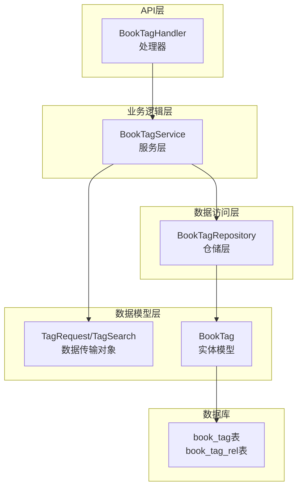
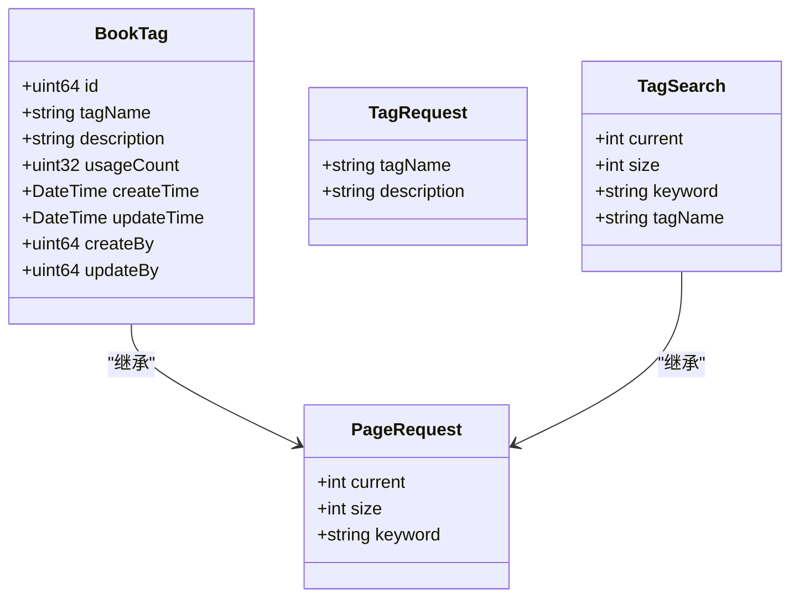
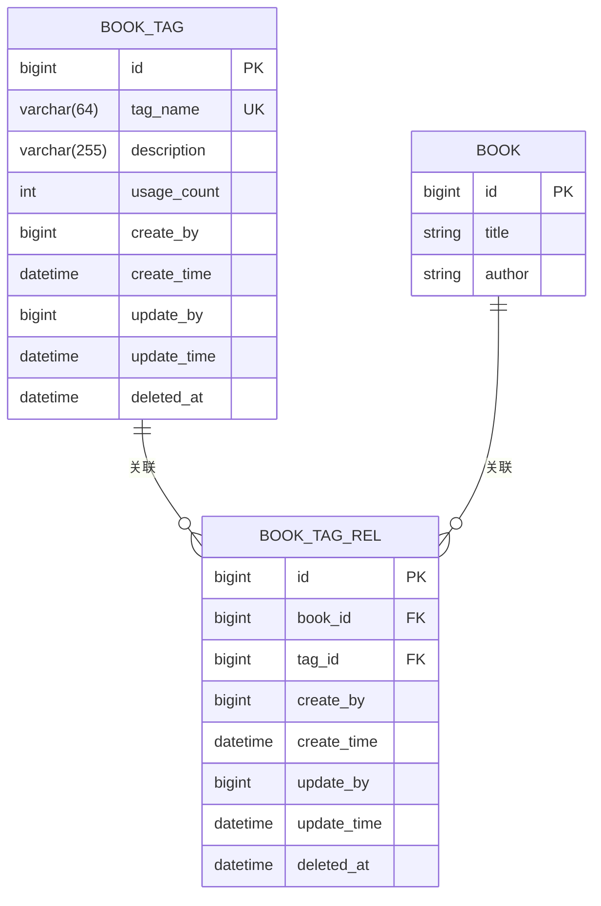
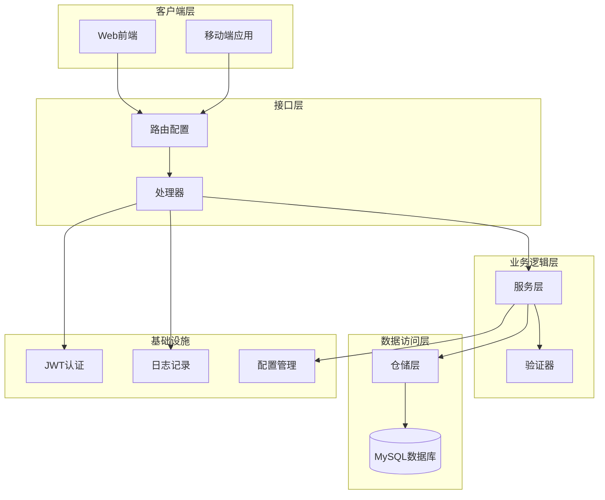
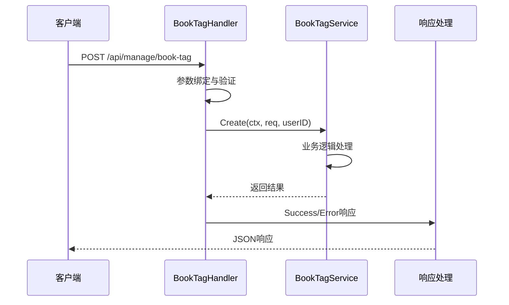
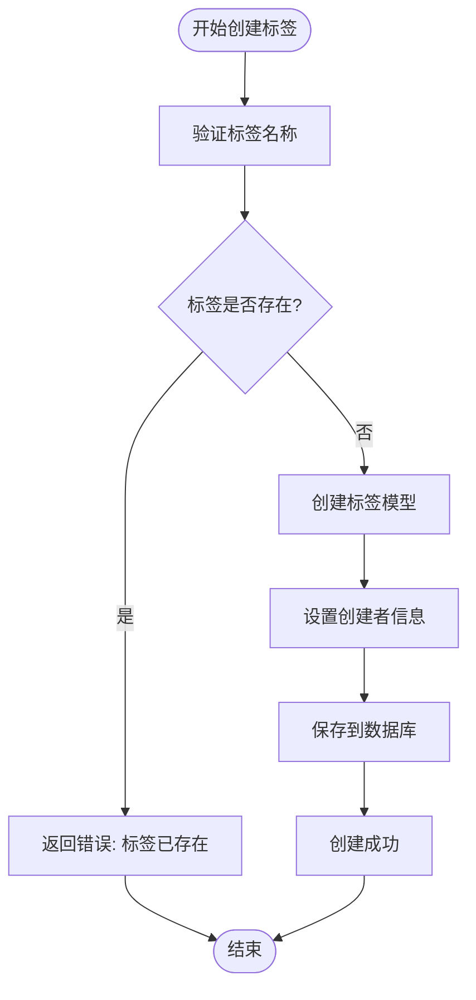
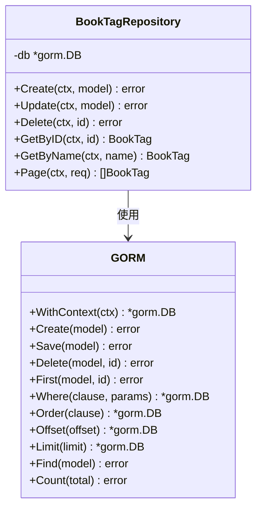
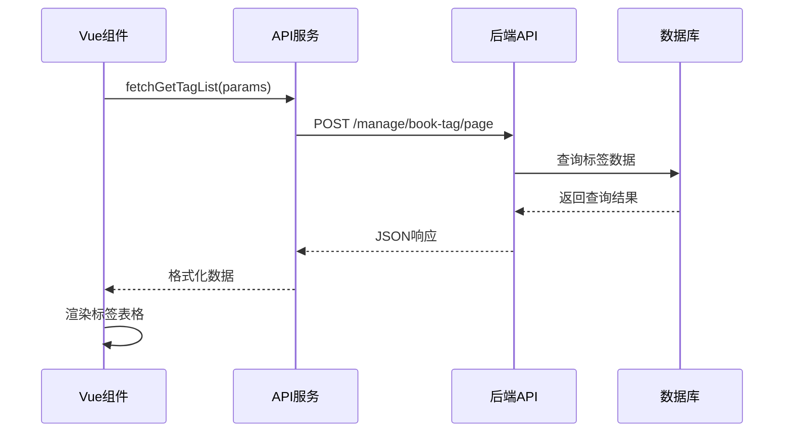
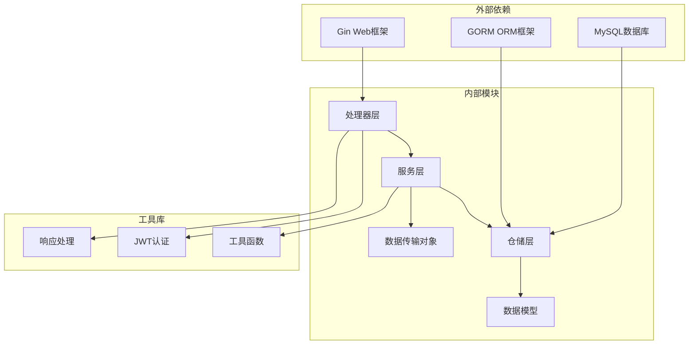

# 电子书标签管理API

<cite>
**本文档引用的文件**
- [app/server/internal/handler/v1/book_tag.go](file://app/server/internal/handler/v1/book_tag.go)
- [app/server/internal/service/book_tag.go](file://app/server/internal/service/book_tag.go)
- [app/server/internal/repository/book_tag.go](file://app/server/internal/repository/book_tag.go)
- [app/server/internal/dto/book_tag.go](file://app/server/internal/dto/book_tag.go)
- [app/server/internal/model/book_tag.go](file://app/server/internal/model/book_tag.go)
- [app/server/internal/router/router.go](file://app/server/internal/router/router.go)
- [app/server/internal/dto/common.go](file://app/server/internal/dto/common.go)
- [app/server/internal/service/book.go](file://app/server/internal/service/book.go)
- [app/sql/book_v1.sql](file://app/sql/book_v1.sql)
- [app/web/src/service/api/book-manage.ts](file://app/web/src/service/api/book-manage.ts)
- [app/web/src/views/admin/library/book-tag/index.vue](file://app/web/src/views/admin/library/book-tag/index.vue)
</cite>

## 目录
1. [简介](#简介)
2. [项目结构](#项目结构)
3. [核心组件](#核心组件)
4. [架构概览](#架构概览)
5. [详细组件分析](#详细组件分析)
6. [依赖关系分析](#依赖关系分析)
7. [性能考虑](#性能考虑)
8. [故障排除指南](#故障排除指南)
9. [结论](#结论)
10. [附录](#附录)

## 简介

电子书标签管理API是Boread电子书管理系统的核心功能模块之一，负责管理电子书的标签系统。该模块实现了完整的标签生命周期管理，包括标签的创建、修改、删除、查询等基础功能，以及标签与电子书的多对多关联关系管理。

本API采用经典的三层架构设计（Handler-Service-Repository），通过Gin框架提供RESTful接口，并使用GORM进行数据库操作。标签系统支持标签去重、标签统计、标签云展示等高级特性，为电子书的分类管理和检索提供了强大的支持。

## 项目结构

电子书标签管理API在项目中的组织结构如下：



**图表来源**
- [app/server/internal/handler/v1/book_tag.go:1-147](file://app/server/internal/handler/v1/book_tag.go#L1-L147)
- [app/server/internal/service/book_tag.go:1-85](file://app/server/internal/service/book_tag.go#L1-L85)
- [app/server/internal/repository/book_tag.go:1-62](file://app/server/internal/repository/book_tag.go#L1-L62)

**章节来源**
- [app/server/internal/handler/v1/book_tag.go:1-147](file://app/server/internal/handler/v1/book_tag.go#L1-L147)
- [app/server/internal/service/book_tag.go:1-85](file://app/server/internal/service/book_tag.go#L1-L85)
- [app/server/internal/repository/book_tag.go:1-62](file://app/server/internal/repository/book_tag.go#L1-L62)

## 核心组件

### 数据模型

标签系统的核心数据模型由以下关键组件构成：



**图表来源**
- [app/server/internal/model/book_tag.go:1-11](file://app/server/internal/model/book_tag.go#L1-L11)
- [app/server/internal/dto/book_tag.go:1-11](file://app/server/internal/dto/book_tag.go#L1-L11)
- [app/server/internal/dto/common.go:1-52](file://app/server/internal/dto/common.go#L1-L52)

### 数据库设计

标签系统采用两表设计模式，实现标签与电子书的多对多关联关系：



**图表来源**
- [app/sql/book_v1.sql:60-76](file://app/sql/book_v1.sql#L60-L76)
- [app/sql/book_v1.sql:120-136](file://app/sql/book_v1.sql#L120-L136)

**章节来源**
- [app/server/internal/model/book_tag.go:1-11](file://app/server/internal/model/book_tag.go#L1-L11)
- [app/server/internal/dto/book_tag.go:1-11](file://app/server/internal/dto/book_tag.go#L1-L11)
- [app/sql/book_v1.sql:60-76](file://app/sql/book_v1.sql#L60-L76)

## 架构概览

电子书标签管理API采用经典的MVC架构模式，通过清晰的分层设计实现关注点分离：



**图表来源**
- [app/server/internal/router/router.go:15-206](file://app/server/internal/router/router.go#L15-L206)
- [app/server/internal/handler/v1/book_tag.go:1-147](file://app/server/internal/handler/v1/book_tag.go#L1-L147)

### 授权与安全

系统采用基于JWT的认证机制，所有管理接口都需要有效的认证令牌。路由配置中明确区分了公开接口和受保护接口：

- **公开接口**：如健康检查、热门分类列表等无需认证
- **受保护接口**：所有管理操作都需要Bearer Token认证
- **按钮级权限**：针对具体的管理操作（创建、更新、删除）设置细粒度权限控制

**章节来源**
- [app/server/internal/router/router.go:15-206](file://app/server/internal/router/router.go#L15-L206)

## 详细组件分析

### 处理器层（Handler）

处理器层负责HTTP请求的接收、参数验证和响应格式化：



**图表来源**
- [app/server/internal/handler/v1/book_tag.go:68-89](file://app/server/internal/handler/v1/book_tag.go#L68-L89)

#### 核心API接口

系统提供以下主要API接口：

| 方法 | 路径 | 权限 | 功能描述 |
|------|------|------|----------|
| GET | /api/manage/book-tag/:id | book-tag:get | 获取标签详情 |
| POST | /api/manage/book-tag/page | book-tag:get | 标签分页查询 |
| POST | /api/manage/book-tag | book-tag:create | 创建新标签 |
| PUT | /api/manage/book-tag/:id | book-tag:update | 更新标签信息 |
| DELETE | /api/manage/book-tag/:id | book-tag:delete | 删除标签 |

**章节来源**
- [app/server/internal/handler/v1/book_tag.go:23-147](file://app/server/internal/handler/v1/book_tag.go#L23-L147)
- [app/server/internal/router/router.go:160-166](file://app/server/internal/router/router.go#L160-L166)

### 服务层（Service）

服务层实现核心业务逻辑，包括数据验证、业务规则检查和事务管理：



**图表来源**
- [app/server/internal/service/book_tag.go:26-37](file://app/server/internal/service/book_tag.go#L26-L37)

#### 业务规则实现

服务层实现了以下关键业务规则：

1. **标签名称唯一性约束**：防止重复标签的创建
2. **标签更新验证**：确保更新时不会破坏唯一性约束
3. **错误处理机制**：提供清晰的错误信息和状态码映射
4. **用户上下文管理**：自动记录操作用户的ID信息

**章节来源**
- [app/server/internal/service/book_tag.go:14-85](file://app/server/internal/service/book_tag.go#L14-L85)

### 仓储层（Repository）

仓储层负责数据持久化操作，提供统一的数据访问接口：



**图表来源**
- [app/server/internal/repository/book_tag.go:12-62](file://app/server/internal/repository/book_tag.go#L12-L62)

#### 数据访问优化

仓储层实现了以下优化策略：

1. **条件查询优化**：根据搜索条件动态构建查询语句
2. **排序策略**：优先按使用次数降序，然后按ID升序排列
3. **分页处理**：支持高效的分页查询
4. **索引利用**：合理使用数据库索引提高查询性能

**章节来源**
- [app/server/internal/repository/book_tag.go:48-62](file://app/server/internal/repository/book_tag.go#L48-L62)

### 前端集成

前端通过专门的API服务与后端进行交互：



**图表来源**
- [app/web/src/service/api/book-manage.ts:71-78](file://app/web/src/service/api/book-manage.ts#L71-L78)
- [app/web/src/views/admin/library/book-tag/index.vue:19-41](file://app/web/src/views/admin/library/book-tag/index.vue#L19-L41)

**章节来源**
- [app/web/src/service/api/book-manage.ts:71-112](file://app/web/src/service/api/book-manage.ts#L71-L112)
- [app/web/src/views/admin/library/book-tag/index.vue:19-41](file://app/web/src/views/admin/library/book-tag/index.vue#L19-L41)

## 依赖关系分析

电子书标签管理API的依赖关系呈现清晰的层次化结构：



**图表来源**
- [app/server/internal/handler/v1/book_tag.go:1-147](file://app/server/internal/handler/v1/book_tag.go#L1-L147)
- [app/server/internal/service/book_tag.go:1-85](file://app/server/internal/service/book_tag.go#L1-L85)
- [app/server/internal/repository/book_tag.go:1-62](file://app/server/internal/repository/book_tag.go#L1-L62)

### 组件耦合度分析

系统采用了低耦合的设计原则：

- **处理器与服务层**：通过接口抽象实现松耦合
- **服务层与仓储层**：通过依赖注入实现可测试性
- **数据模型与业务逻辑**：清晰分离关注点
- **前端与后端**：通过标准化API实现解耦

**章节来源**
- [app/server/internal/router/router.go:35-77](file://app/server/internal/router/router.go#L35-L77)

## 性能考虑

### 数据库性能优化

1. **索引策略**：
   - 标签名称建立唯一索引，确保数据完整性
   - 软删除字段建立索引，支持高效查询
   - 关联表建立复合索引，优化多表连接

2. **查询优化**：
   - 分页查询使用LIMIT和OFFSET，避免全表扫描
   - 排序基于索引字段，减少排序开销
   - 条件查询使用适当的WHERE子句

3. **缓存策略**：
   - 热门标签使用内存缓存
   - 频繁访问的标签详情建立缓存层

### 业务性能优化

1. **批量操作**：
   - 支持批量标签创建和更新
   - 事务内批量处理，减少数据库往返

2. **并发控制**：
   - 标签名称唯一性检查使用数据库约束
   - 事务保证数据一致性

3. **资源管理**：
   - 连接池管理数据库连接
   - 内存池优化临时对象分配

## 故障排除指南

### 常见错误及解决方案

| 错误类型 | 错误码 | 描述 | 解决方案 |
|----------|--------|------|----------|
| 参数验证错误 | 1001 | 请求参数无效 | 检查请求格式和必填字段 |
| 标签不存在 | 3001 | 标签ID不存在 | 确认标签ID的有效性 |
| 标签已存在 | 3001 | 标签名重复 | 修改标签名称或使用其他标签 |
| 数据库错误 | 5001 | 服务器内部错误 | 检查数据库连接和SQL语句 |

### 调试建议

1. **启用详细日志**：在开发环境中开启详细的请求日志
2. **数据库监控**：监控慢查询和高负载操作
3. **性能分析**：使用性能分析工具识别瓶颈
4. **单元测试**：编写全面的单元测试覆盖边界情况

**章节来源**
- [app/server/internal/handler/v1/book_tag.go:141-147](file://app/server/internal/handler/v1/book_tag.go#L141-L147)

## 结论

电子书标签管理API通过清晰的架构设计和完善的业务逻辑，为Boread电子书管理系统提供了强大而灵活的标签管理能力。系统采用现代化的技术栈和最佳实践，具有良好的可扩展性和维护性。

主要特点包括：
- 完整的标签生命周期管理
- 强大的多对多关联关系支持  
- 高效的查询和统计功能
- 完善的错误处理和安全机制
- 良好的前后端集成体验

该API为电子书的分类、检索和管理奠定了坚实的基础，能够满足不同规模应用的需求。

## 附录

### API使用示例

#### 创建标签
```javascript
// 前端调用示例
await fetchCreateTag({
  tagName: "科幻小说",
  description: "科幻类电子书标签"
});
```

#### 查询标签列表
```javascript
// 分页查询
await fetchGetTagList({
  current: 1,
  size: 10,
  tagName: "科幻"
});
```

#### 更新标签
```javascript
// 更新标签信息
await fetchUpdateTag(1, {
  tagName: "科幻文学",
  description: "更新后的科幻类标签"
});
```

#### 删除标签
```javascript
// 删除指定标签
await fetchDeleteTag(1);
```

**章节来源**
- [app/web/src/service/api/book-manage.ts:88-112](file://app/web/src/service/api/book-manage.ts#L88-L112)

### 数据库迁移脚本

标签系统的数据库结构定义在book_v1.sql文件中，包含以下关键表结构：

- **book_tag表**：存储标签基本信息和统计字段
- **book_tag_rel表**：存储标签与电子书的关联关系
- **索引设计**：优化查询性能的关键索引

**章节来源**
- [app/sql/book_v1.sql:60-76](file://app/sql/book_v1.sql#L60-L76)
- [app/sql/book_v1.sql:120-136](file://app/sql/book_v1.sql#L120-L136)