# 电子书管理API

<cite>
**本文档引用的文件**
- [main.go](file://app/server/cmd/api/main.go)
- [router.go](file://app/server/internal/router/router.go)
- [book.go](file://app/server/internal/handler/v1/book.go)
- [book_file.go](file://app/server/internal/handler/v1/book_file.go)
- [book_category.go](file://app/server/internal/handler/v1/book_category.go)
- [book_tag.go](file://app/server/internal/handler/v1/book_tag.go)
- [book_chapter_rule.go](file://app/server/internal/handler/v1/book_chapter_rule.go)
- [book_social.go](file://app/server/internal/handler/v1/book_social.go)
- [book_reader.go](file://app/server/internal/handler/v1/book_reader.go)
- [book_read_stats.go](file://app/server/internal/handler/v1/book_read_stats.go)
- [book.go](file://app/server/internal/service/book.go)
- [book_file.go](file://app/server/internal/service/book_file.go)
- [book_category.go](file://app/server/internal/service/book_category.go)
- [book_tag.go](file://app/server/internal/service/book_tag.go)
- [book_chapter_rule.go](file://app/server/internal/service/book_chapter_rule.go)
- [book_social.go](file://app/server/internal/service/book_social.go)
- [book_reader.go](file://app/server/internal/service/book_reader.go)
- [book_read_stats.go](file://app/server/internal/service/book_read_stats.go)
- [book.go](file://app/server/internal/repository/book.go)
- [book_file.go](file://app/server/internal/repository/book_file.go)
- [book_category.go](file://app/server/internal/repository/book_category.go)
- [book_tag.go](file://app/server/internal/repository/book_tag.go)
- [book_chapter_rule.go](file://app/server/internal/repository/book_chapter_rule.go)
- [book_social.go](file://app/server/internal/repository/book_social.go)
- [book_reader.go](file://app/server/internal/repository/book_reader.go)
- [book_read_stats.go](file://app/server/internal/repository/book_read_stats.go)
- [book.go](file://app/server/internal/model/book.go)
- [book_file.go](file://app/server/internal/model/book_file.go)
- [book_category.go](file://app/server/internal/model/book_category.go)
- [book_tag.go](file://app/server/internal/model/book_tag.go)
- [book_chapter_rule.go](file://app/server/internal/model/book_chapter_rule.go)
- [book_social.go](file://app/server/internal/model/book_social.go)
- [book_reader.go](file://app/server/internal/model/book_reader.go)
- [book_read_stats.go](file://app/server/internal/model/book_read_stats.go)
- [swagger.yaml](file://app/server/docs/swagger.yaml)
- [book_v2.sql](file://app/sql/book_v2.sql)
- [book_v3.sql](file://app/sql/book_v3.sql)
- [book_v4.sql](file://app/sql/book_v4.sql)
- [system-manage.sql](file://app/sql/system-manage.sql)
</cite>

## 目录
1. [简介](#简介)
2. [项目结构](#项目结构)
3. [核心组件](#核心组件)
4. [架构总览](#架构总览)
5. [详细组件分析](#详细组件分析)
6. [依赖关系分析](#依赖关系分析)
7. [性能考虑](#性能考虑)
8. [故障排除指南](#故障排除指南)
9. [结论](#结论)
10. [附录](#附录)

## 简介
本项目为小说阅读平台的后端API，围绕电子书管理构建，提供完整的电子书增删改查、分类管理、标签管理、文件上传下载、章节解析、规则配置、批量扫描入库、章节规则管理、社交功能和阅读进度管理等功能。系统采用Go语言开发，基于Gin框架，使用GORM进行数据库访问，并通过Swagger生成在线API文档。

## 项目结构
后端采用典型的三层架构设计，分为Handler层、Service层和Repository层，配合Model层的数据模型定义：

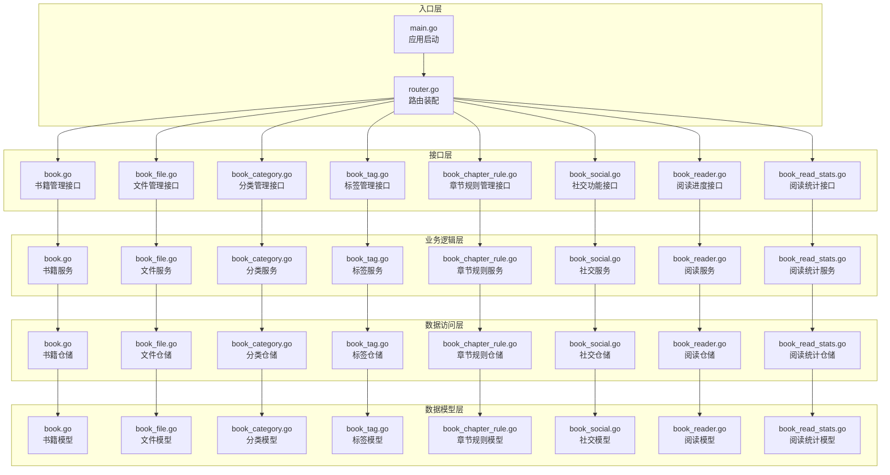

**图表来源**
- [main.go:30-84](file://app/server/cmd/api/main.go#L30-L84)
- [router.go:20-205](file://app/server/internal/router/router.go#L20-L205)

**章节来源**
- [main.go:30-84](file://app/server/cmd/api/main.go#L30-L84)
- [router.go:20-205](file://app/server/internal/router/router.go#L20-L205)

## 核心组件
系统围绕七个核心模块构建：书籍管理、文件管理、分类管理、标签管理、章节规则管理、社交功能和阅读进度管理。每个模块都遵循统一的CRUD接口规范，并提供了丰富的查询和过滤功能。

### 数据模型概览
系统采用清晰的数据模型设计，支持电子书的元数据管理、文件存储、章节索引、规则配置、社交互动和阅读统计：

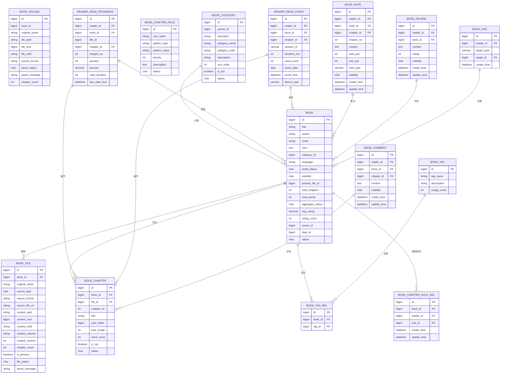

**图表来源**
- [book.go:40-70](file://app/server/internal/model/book.go#L40-L70)
- [book_file.go:24-94](file://app/server/internal/model/book_file.go#L24-L94)
- [book_category.go:1-120](file://app/server/internal/model/book_category.go#L1-L120)
- [book_tag.go:1-80](file://app/server/internal/model/book_tag.go#L1-L80)
- [book_chapter_rule.go:1-120](file://app/server/internal/model/book_chapter_rule.go#L1-L120)
- [book_reader.go:1-120](file://app/server/internal/model/book_reader.go#L1-L120)
- [book_social.go:1-200](file://app/server/internal/model/book_social.go#L1-L200)

**章节来源**
- [book.go:40-70](file://app/server/internal/model/book.go#L40-L70)
- [book_file.go:24-94](file://app/server/internal/model/book_file.go#L24-L94)
- [book_category.go:1-120](file://app/server/internal/model/book_category.go#L1-L120)
- [book_tag.go:1-80](file://app/server/internal/model/book_tag.go#L1-L80)
- [book_chapter_rule.go:1-120](file://app/server/internal/model/book_chapter_rule.go#L1-L120)
- [book_reader.go:1-120](file://app/server/internal/model/book_reader.go#L1-L120)
- [book_social.go:1-200](file://app/server/internal/model/book_social.go#L1-L200)

## 架构总览
系统采用RESTful API设计，结合中间件实现安全控制和日志记录。路由按照功能模块进行组织，支持公开接口和受保护的管理接口。

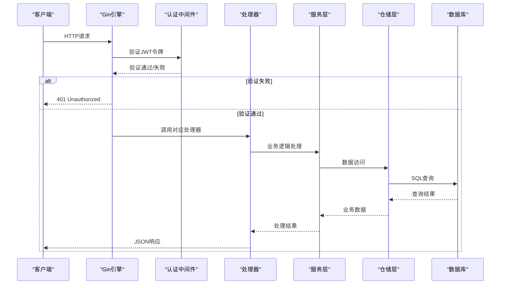

**图表来源**
- [router.go:20-205](file://app/server/internal/router/router.go#L20-L205)
- [main.go:30-84](file://app/server/cmd/api/main.go#L30-L84)

**章节来源**
- [router.go:20-205](file://app/server/internal/router/router.go#L20-L205)
- [main.go:30-84](file://app/server/cmd/api/main.go#L30-L84)

## 详细组件分析

### 书籍管理模块
书籍管理模块提供完整的电子书生命周期管理，包括基本信息维护、状态控制、标签关联和分类管理。

#### 书籍CRUD接口
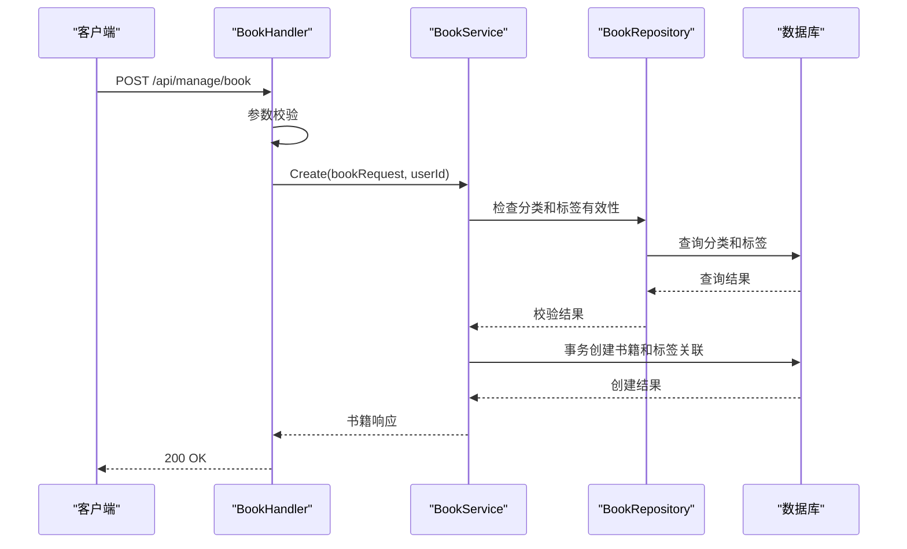

**图表来源**
- [book.go:45-116](file://app/server/internal/service/book.go#L45-L116)
- [book.go:54-95](file://app/server/internal/handler/v1/book.go#L54-L95)

#### 书籍搜索与分页
系统支持多维度的书籍搜索和分页查询，包括标题、作者、分类、状态、可见性和字数范围等条件。

**章节来源**
- [book.go:23-38](file://app/server/internal/dto/book.go#L23-L38)
- [book.go:258-306](file://app/server/internal/service/book.go#L258-L306)
- [book.go:127-139](file://app/server/internal/handler/v1/book.go#L127-L139)

### 文件管理模块
文件管理模块负责电子书文件的上传、解析、章节识别和内容管理。

#### 文件上传与解析流程

**图表来源**
- [book_file.go:82-153](file://app/server/internal/service/book_file.go#L82-L153)
- [book_file.go:155-292](file://app/server/internal/service/book_file.go#L155-L292)

#### 支持的文件格式
系统支持多种电子书格式，包括纯文本、EPUB、MOBI和PDF格式，每种格式都有相应的处理策略和解析规则。

**章节来源**
- [book_file.go:82-153](file://app/server/internal/service/book_file.go#L82-L153)
- [book_file.go:155-292](file://app/server/internal/service/book_file.go#L155-L292)

### 分类管理模块
分类管理模块提供树形结构的分类体系，支持多级分类和热门分类标记。

#### 分类树形结构
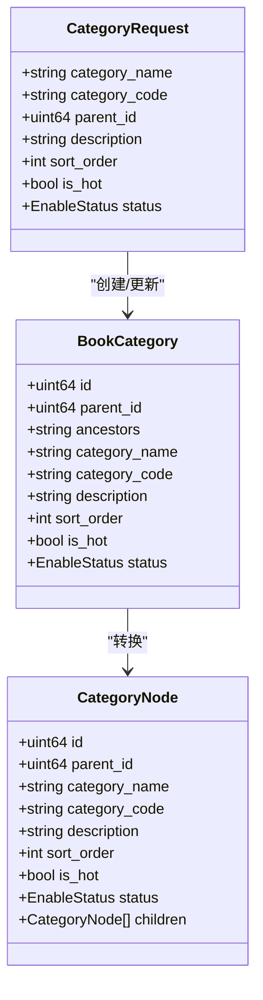

**图表来源**
- [book_category.go:1-120](file://app/server/internal/model/book_category.go#L1-L120)
- [book_category.go:131-172](file://app/server/internal/service/book_category.go#L131-L172)

**章节来源**
- [book_category.go:131-172](file://app/server/internal/service/book_category.go#L131-L172)
- [book_category.go:174-235](file://app/server/internal/service/book_category.go#L174-L235)

### 标签管理模块
标签管理模块提供灵活的标签系统，支持标签的创建、更新、删除和查询。

**章节来源**
- [book_tag.go:26-56](file://app/server/internal/service/book_tag.go#L26-L56)
- [book_tag.go:77-84](file://app/server/internal/service/book_tag.go#L77-L84)

### 章节规则管理模块
章节规则管理模块提供灵活的章节识别规则配置，支持自定义正则表达式和优先级设置，为不同格式的电子书提供精确的章节解析能力。

#### 章节规则CRUD接口
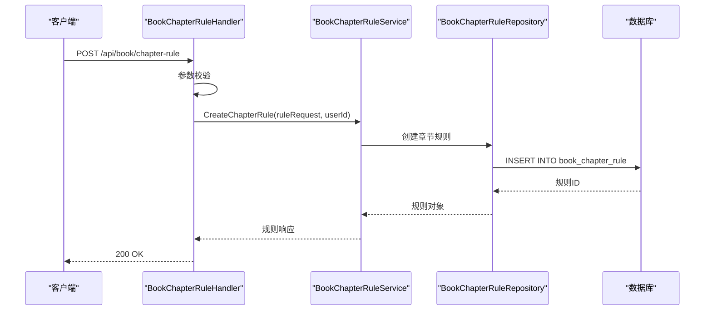

**图表来源**
- [book_chapter_rule.go:30-42](file://app/server/internal/handler/v1/book_chapter_rule.go#L30-L42)
- [book_chapter_rule.go:21-40](file://app/server/internal/service/book_chapter_rule.go#L21-L40)

#### 书籍规则绑定流程
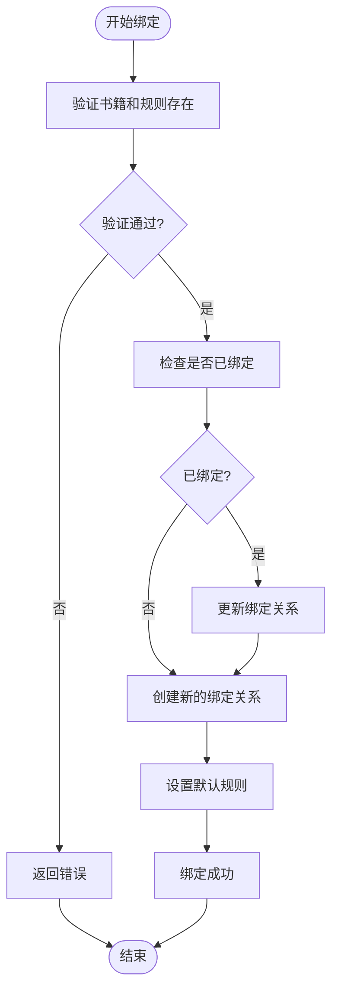

**图表来源**
- [book_chapter_rule.go:148-160](file://app/server/internal/handler/v1/book_chapter_rule.go#L148-L160)
- [book_chapter_rule.go:139-160](file://app/server/internal/service/book_chapter_rule.go#L139-L160)

**章节来源**
- [book_chapter_rule.go:21-40](file://app/server/internal/service/book_chapter_rule.go#L21-L40)
- [book_chapter_rule.go:139-160](file://app/server/internal/service/book_chapter_rule.go#L139-L160)

### 社交功能模块
社交功能模块提供完整的读者互动功能，包括笔记/划线、书评、章节评论和点赞系统。

#### 笔记/划线管理流程
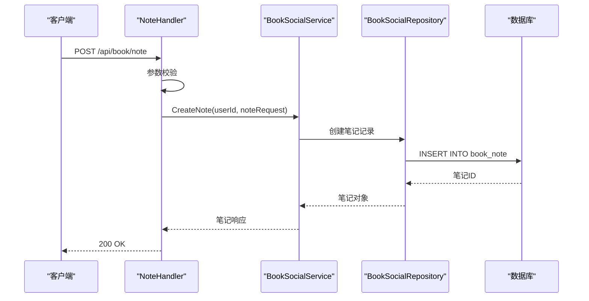

**图表来源**
- [book_social.go:23-44](file://app/server/internal/handler/v1/book_social.go#L23-L44)
- [book_social.go:167-169](file://app/server/internal/handler/v1/book_social.go#L167-L169)

#### 书评和评论管理
系统支持读者对书籍的评价和对特定章节的讨论，提供公开和私密两种可见性模式。

**章节来源**
- [book_social.go:167-169](file://app/server/internal/handler/v1/book_social.go#L167-L169)
- [book_social.go:402-404](file://app/server/internal/handler/v1/book_social.go#L402-404)

### 阅读进度管理模块
阅读进度管理模块提供精确的阅读进度跟踪和事件上报功能，支持会话管理和统计数据聚合。

#### 阅读进度上报流程
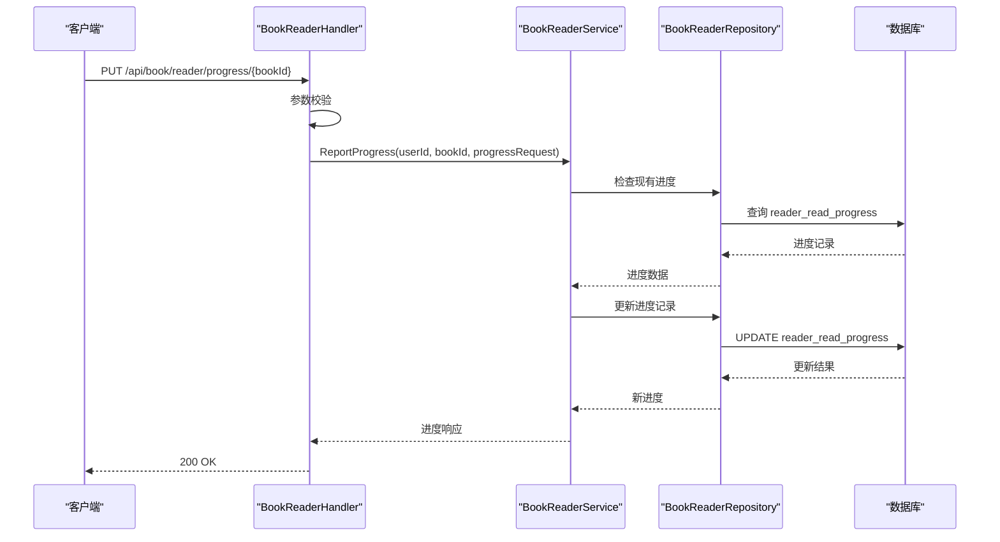

**图表来源**
- [book_reader.go:24-51](file://app/server/internal/handler/v1/book_reader.go#L24-L51)
- [book_reader.go:34-51](file://app/server/internal/service/book_reader.go#L34-L51)

#### 阅读事件上报流程
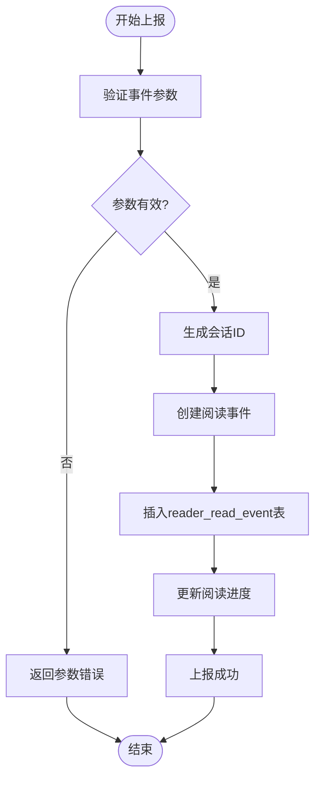

**图表来源**
- [book_reader.go:77-97](file://app/server/internal/handler/v1/book_reader.go#L77-L97)
- [book_reader.go:76-97](file://app/server/internal/service/book_reader.go#L76-L97)

**章节来源**
- [book_reader.go:34-51](file://app/server/internal/service/book_reader.go#L34-L51)
- [book_reader.go:76-97](file://app/server/internal/service/book_reader.go#L76-L97)

### 阅读统计模块
阅读统计模块提供多维度的阅读数据分析，支持按日、按书和总量的统计查询。

**章节来源**
- [book_read_stats.go:31-43](file://app/server/internal/service/book_read_stats.go#L31-L43)
- [book_read_stats.go:54-66](file://app/server/internal/service/book_read_stats.go#L54-L66)
- [book_read_stats.go:75-82](file://app/server/internal/service/book_read_stats.go#L75-L82)

## 依赖关系分析
系统采用清晰的分层架构，各层之间通过接口进行解耦，避免了循环依赖问题。

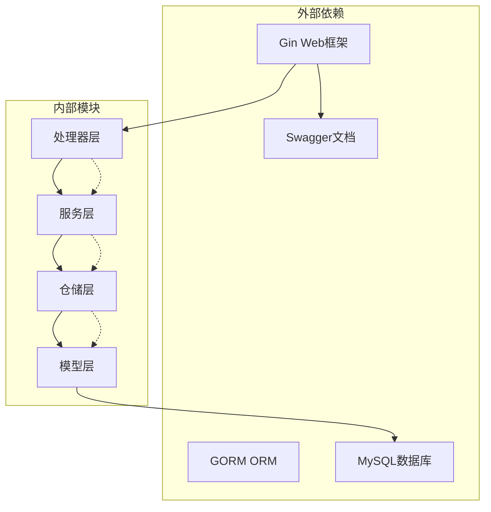

**图表来源**
- [router.go:3-13](file://app/server/internal/router/router.go#L3-L13)
- [main.go:3-19](file://app/server/cmd/api/main.go#L3-L19)

**章节来源**
- [router.go:3-13](file://app/server/internal/router/router.go#L3-L13)
- [main.go:3-19](file://app/server/cmd/api/main.go#L3-L19)

## 性能考虑
系统在设计时充分考虑了性能优化，采用了多种策略来提升响应速度和资源利用率：

### 缓存策略
- **分类树缓存**: 分类树结构相对稳定，可考虑在内存中缓存热点分类数据
- **标签预加载**: 在书籍列表查询时批量预加载标签信息，减少N+1查询
- **章节内容缓存**: 对热门章节内容进行缓存，降低重复读取成本
- **规则缓存**: 章节规则按书籍缓存，减少规则匹配开销
- **社交数据缓存**: 热门笔记和书评进行缓存，提升社交功能响应速度

### 数据库优化
- **索引设计**: 为常用查询字段建立合适的索引，如category_id、status、update_time、reader_id、book_id等
- **批量操作**: 使用批量插入和批量查询减少数据库往返次数
- **连接池配置**: 合理配置数据库连接池大小，平衡并发和资源消耗
- **分区表**: 阅读事件表按日期分区，提升大数据量查询性能

### 文件存储优化
- **分块存储**: 大文件采用分块存储策略，支持断点续传
- **压缩存储**: 对文本内容进行压缩存储，节省磁盘空间
- **CDN集成**: 支持将静态资源托管到CDN，提升全球访问速度

## 故障排除指南
系统提供了完善的错误处理机制和日志记录，便于问题诊断和解决。

### 常见错误类型
| 错误代码 | 错误类型 | 描述 | 解决方案 |
|---------|---------|------|---------|
| 1001 | 参数验证错误 | 请求参数格式不正确 | 检查请求格式和必填字段 |
| 1002 | 文件处理错误 | 文件大小超限或格式不支持 | 确认文件类型和大小限制 |
| 3001 | 业务逻辑错误 | 记录不存在或状态异常 | 检查业务逻辑和数据一致性 |
| 3002 | 关联数据错误 | 分类或标签无效 | 验证关联数据的有效性 |
| 3003 | 规则冲突错误 | 章节规则绑定冲突 | 检查规则唯一性和绑定关系 |
| 3004 | 社交权限错误 | 无权操作他人内容 | 验证用户权限和内容所有权 |
| 3005 | 进度同步错误 | 阅读进度不一致 | 检查客户端上报频率和服务器处理 |
| 5001 | 系统内部错误 | 服务器内部异常 | 查看服务器日志和堆栈信息 |

### 日志记录
系统采用结构化日志记录，包含请求ID、用户信息、操作时间和执行结果等关键信息，便于审计和问题追踪。

**章节来源**
- [book.go:169-179](file://app/server/internal/handler/v1/book.go#L169-L179)
- [book_file.go:527-543](file://app/server/internal/handler/v1/book_file.go#L527-L543)

## 结论
boread项目的电子书管理API设计合理，架构清晰，功能完整。系统支持多种电子书格式，提供了从文件上传到章节解析的完整工作流，同时新增的章节规则管理、社交功能和阅读进度管理模块进一步增强了平台的交互性和用户体验。通过合理的分层设计和错误处理机制，确保了系统的稳定性和可靠性。

## 附录

### API接口列表
系统提供以下主要API接口：

#### 书籍管理接口
- `POST /api/manage/book` - 创建书籍
- `PUT /api/manage/book/{id}` - 更新书籍
- `DELETE /api/manage/book/{id}` - 删除书籍
- `GET /api/manage/book/{id}` - 获取书籍详情
- `POST /api/manage/book/page` - 书籍分页查询

#### 文件管理接口
- `POST /api/manage/book/upload` - 文件上传
- `POST /api/manage/book/confirm-import` - 确认入库
- `POST /api/manage/book/scan` - 批量扫描入库
- `POST /api/manage/book/scan-path` - 扫描本地路径
- `GET /api/manage/book/{id}/chapter/{chapterNo}` - 读取章节内容

#### 分类管理接口
- `POST /api/manage/book-category` - 创建分类
- `PUT /api/manage/book-category/{id}` - 更新分类
- `DELETE /api/manage/book-category/{id}` - 删除分类
- `GET /api/manage/book-category/tree` - 获取分类树
- `POST /api/manage/book-category/page` - 分类分页查询

#### 标签管理接口
- `POST /api/manage/book-tag` - 创建标签
- `PUT /api/manage/book-tag/{id}` - 更新标签
- `DELETE /api/manage/book-tag/{id}` - 删除标签
- `POST /api/manage/book-tag/page` - 标签分页查询

#### 章节规则管理接口
- `POST /api/book/chapter-rule` - 创建章节规则
- `PUT /api/book/chapter-rule/{id}` - 更新章节规则
- `DELETE /api/book/chapter-rule/{id}` - 删除章节规则
- `GET /api/book/chapter-rule/{id}` - 获取章节规则详情
- `POST /api/book/chapter-rule/page` - 章节规则分页查询
- `POST /api/book/chapter-rule/bind` - 绑定章节规则到书籍
- `DELETE /api/book/chapter-rule/bind/{bookId}` - 解绑书籍的章节规则
- `GET /api/book/chapter-rule/bind/{bookId}` - 获取书籍绑定的章节规则

#### 社交功能接口
- `POST /api/book/note` - 创建笔记/划线
- `PUT /api/book/note/{id}` - 更新笔记/划线
- `DELETE /api/book/note/{id}` - 删除笔记/划线
- `GET /api/book/note/{id}` - 获取笔记详情
- `POST /api/book/note/page` - 笔记分页查询
- `GET /api/book/note/book/{bookId}` - 获取某本书的公开笔记
- `POST /api/book/review` - 创建书评
- `PUT /api/book/review/{id}` - 更新书评
- `DELETE /api/book/review/{id}` - 删除书评
- `GET /api/book/review/{id}` - 获取书评详情
- `POST /api/book/review/page` - 书评分页查询
- `POST /api/book/comment` - 创建章节评论
- `DELETE /api/book/comment/{id}` - 删除章节评论
- `GET /api/book/comment/{id}` - 获取评论详情
- `POST /api/book/comment/page` - 评论分页查询
- `POST /api/book/like/toggle` - 切换点赞
- `POST /api/book/like/status` - 批量查询点赞状态
- `GET /api/book/like/count/{targetType}/{targetId}` - 查询点赞数

#### 阅读进度接口
- `PUT /api/book/reader/progress/{bookId}` - 上报阅读进度
- `GET /api/book/reader/progress/{bookId}` - 获取阅读进度
- `POST /api/book/reader/read-event` - 上报阅读事件

#### 阅读统计接口
- `POST /api/book/read-stats/daily` - 按日阅读统计
- `POST /api/book/read-stats/books` - 按书阅读统计
- `GET /api/book/read-stats/total` - 总阅读统计

### 数据库表结构
系统包含以下核心数据表：
- `book`: 书籍主表
- `book_file`: 书籍文件表
- `book_chapter`: 章节索引表
- `book_category`: 分类表
- `book_tag`: 标签表
- `book_tag_rel`: 标签关联表
- `book_upload`: 上传任务表
- `book_chapter_rule`: 章节规则表
- `book_chapter_rule_rel`: 书籍规则关联表
- `reader_read_progress`: 阅读进度表
- `reader_read_event`: 阅读事件表
- `book_note`: 笔记表
- `book_review`: 书评表
- `book_comment`: 评论表
- `book_like`: 点赞表

**章节来源**
- [swagger.yaml:1-200](file://app/server/docs/swagger.yaml#L1-L200)
- [book_v2.sql:138-157](file://app/sql/book_v2.sql#L138-L157)
- [book_v3.sql:40-56](file://app/sql/book_v3.sql#L40-L56)
- [book_v4.sql:87-126](file://app/sql/book_v4.sql#L87-L126)
- [system-manage.sql](file://app/sql/system-manage.sql)