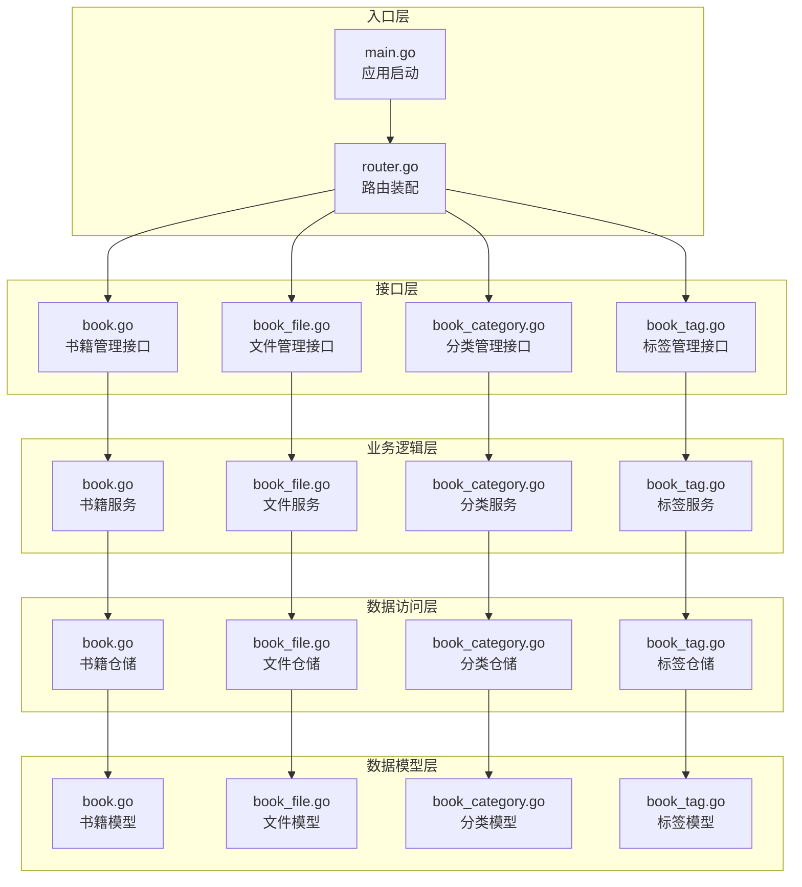
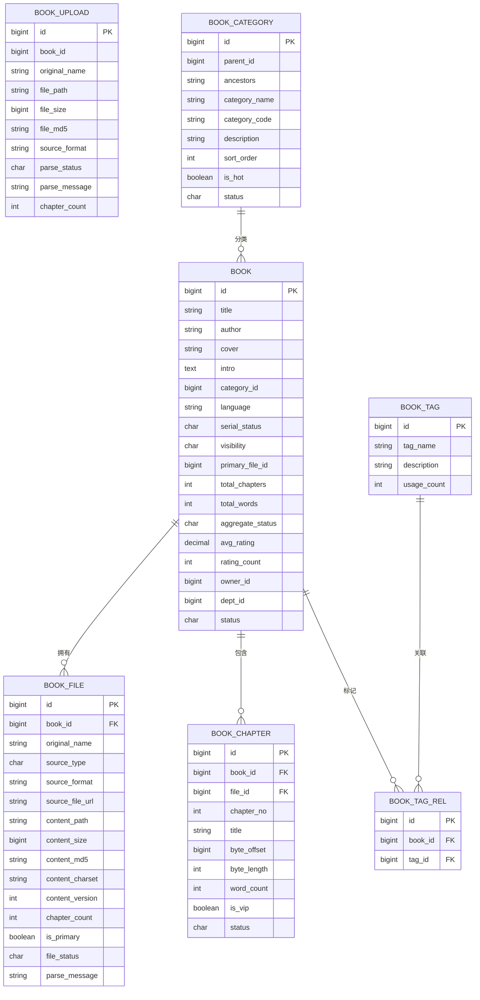
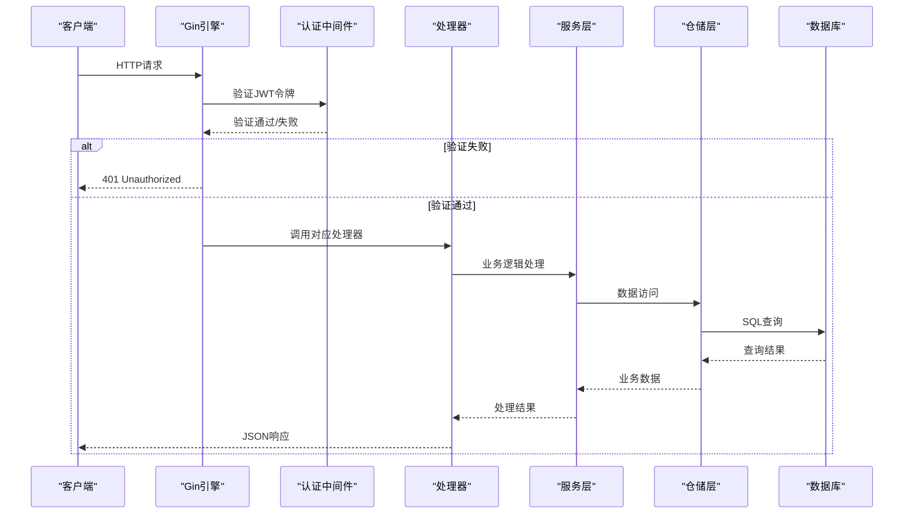
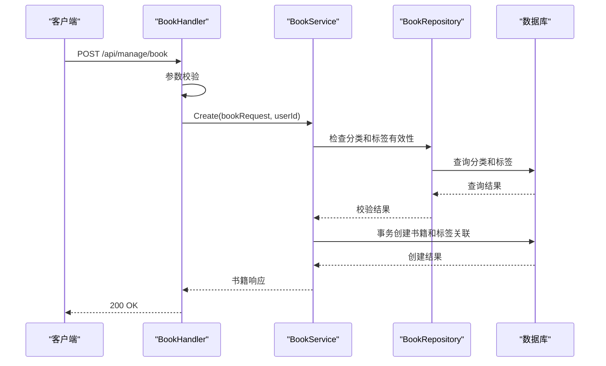
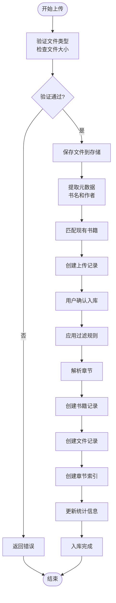
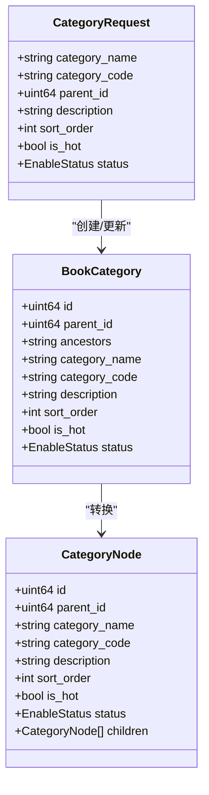
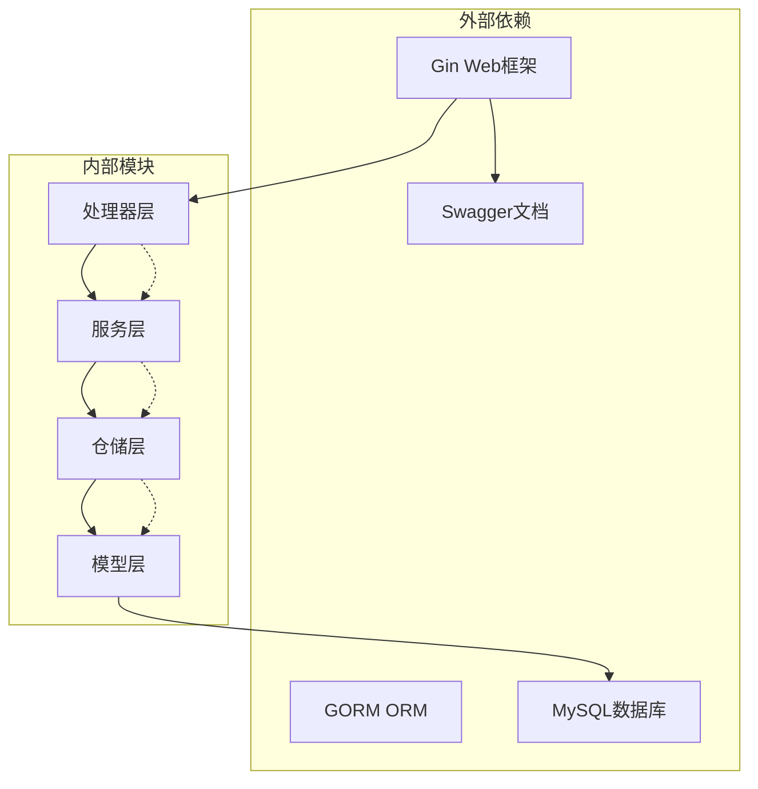

# 电子书管理API

<cite>
**本文档引用的文件**
- [main.go](file://app/server/cmd/api/main.go)
- [router.go](file://app/server/internal/router/router.go)
- [book.go](file://app/server/internal/handler/v1/book.go)
- [book_file.go](file://app/server/internal/handler/v1/book_file.go)
- [book_category.go](file://app/server/internal/handler/v1/book_category.go)
- [book_tag.go](file://app/server/internal/handler/v1/book_tag.go)
- [book.go](file://app/server/internal/service/book.go)
- [book_file.go](file://app/server/internal/service/book_file.go)
- [book_category.go](file://app/server/internal/service/book_category.go)
- [book_tag.go](file://app/server/internal/service/book_tag.go)
- [book.go](file://app/server/internal/repository/book.go)
- [book_file.go](file://app/server/internal/repository/book_file.go)
- [book_category.go](file://app/server/internal/repository/book_category.go)
- [book_tag.go](file://app/server/internal/repository/book_tag.go)
- [book.go](file://app/server/internal/model/book.go)
- [book_file.go](file://app/server/internal/model/book_file.go)
- [book_category.go](file://app/server/internal/model/book_category.go)
- [book_tag.go](file://app/server/internal/model/book_tag.go)
- [swagger.yaml](file://app/server/docs/swagger.yaml)
- [book_v4.sql](file://app/sql/book_v4.sql)
- [system-manage.sql](file://app/sql/system-manage.sql)
</cite>

## 目录
1. [简介](#简介)
2. [项目结构](#项目结构)
3. [核心组件](#核心组件)
4. [架构总览](#架构总览)
5. [详细组件分析](#详细组件分析)
6. [依赖关系分析](#依赖关系分析)
7. [性能考虑](#性能考虑)
8. [故障排除指南](#故障排除指南)
9. [结论](#结论)
10. [附录](#附录)

## 简介
本项目为小说阅读平台的后端API，围绕电子书管理构建，提供完整的电子书增删改查、分类管理、标签管理、文件上传下载、章节解析、规则配置、批量扫描入库等功能。系统采用Go语言开发，基于Gin框架，使用GORM进行数据库访问，并通过Swagger生成在线API文档。

## 项目结构
后端采用典型的三层架构设计，分为Handler层、Service层和Repository层，配合Model层的数据模型定义：

**图表来源**
- [main.go:30-84](file://app/server/cmd/api/main.go#L30-L84)
- [router.go:20-205](file://app/server/internal/router/router.go#L20-L205)

**章节来源**
- [main.go:30-84](file://app/server/cmd/api/main.go#L30-L84)
- [router.go:20-205](file://app/server/internal/router/router.go#L20-L205)

## 核心组件
系统围绕四个核心模块构建：书籍管理、文件管理、分类管理和标签管理。每个模块都遵循统一的CRUD接口规范，并提供了丰富的查询和过滤功能。

### 数据模型概览
系统采用清晰的数据模型设计，支持电子书的元数据管理、文件存储、章节索引和规则配置：

**图表来源**
- [book.go:40-70](file://app/server/internal/model/book.go#L40-L70)
- [book_file.go:24-94](file://app/server/internal/model/book_file.go#L24-L94)
- [book_category.go:1-120](file://app/server/internal/model/book_category.go#L1-L120)
- [book_tag.go:1-80](file://app/server/internal/model/book_tag.go#L1-L80)

**章节来源**
- [book.go:40-70](file://app/server/internal/model/book.go#L40-L70)
- [book_file.go:24-94](file://app/server/internal/model/book_file.go#L24-L94)
- [book_category.go:1-120](file://app/server/internal/model/book_category.go#L1-L120)
- [book_tag.go:1-80](file://app/server/internal/model/book_tag.go#L1-L80)

## 架构总览
系统采用RESTful API设计，结合中间件实现安全控制和日志记录。路由按照功能模块进行组织，支持公开接口和受保护的管理接口。

**图表来源**
- [router.go:20-205](file://app/server/internal/router/router.go#L20-L205)
- [main.go:30-84](file://app/server/cmd/api/main.go#L30-L84)

**章节来源**
- [router.go:20-205](file://app/server/internal/router/router.go#L20-L205)
- [main.go:30-84](file://app/server/cmd/api/main.go#L30-L84)

## 详细组件分析

### 书籍管理模块
书籍管理模块提供完整的电子书生命周期管理，包括基本信息维护、状态控制、标签关联和分类管理。

#### 书籍CRUD接口

**图表来源**
- [book.go:45-116](file://app/server/internal/service/book.go#L45-L116)
- [book.go:54-95](file://app/server/internal/handler/v1/book.go#L54-L95)

#### 书籍搜索与分页
系统支持多维度的书籍搜索和分页查询，包括标题、作者、分类、状态、可见性和字数范围等条件。

**章节来源**
- [book.go:23-38](file://app/server/internal/dto/book.go#L23-L38)
- [book.go:258-306](file://app/server/internal/service/book.go#L258-L306)
- [book.go:127-139](file://app/server/internal/handler/v1/book.go#L127-L139)

### 文件管理模块
文件管理模块负责电子书文件的上传、解析、章节识别和内容管理。

#### 文件上传与解析流程

**图表来源**
- [book_file.go:82-153](file://app/server/internal/service/book_file.go#L82-L153)
- [book_file.go:155-292](file://app/server/internal/service/book_file.go#L155-L292)

#### 支持的文件格式
系统支持多种电子书格式，包括纯文本、EPUB、MOBI和PDF格式，每种格式都有相应的处理策略和解析规则。

**章节来源**
- [book_file.go:82-153](file://app/server/internal/service/book_file.go#L82-L153)
- [book_file.go:155-292](file://app/server/internal/service/book_file.go#L155-L292)

### 分类管理模块
分类管理模块提供树形结构的分类体系，支持多级分类和热门分类标记。

#### 分类树形结构

**图表来源**
- [book_category.go:1-120](file://app/server/internal/model/book_category.go#L1-L120)
- [book_category.go:131-172](file://app/server/internal/service/book_category.go#L131-L172)

**章节来源**
- [book_category.go:131-172](file://app/server/internal/service/book_category.go#L131-L172)
- [book_category.go:174-235](file://app/server/internal/service/book_category.go#L174-L235)

### 标签管理模块
标签管理模块提供灵活的标签系统，支持标签的创建、更新、删除和查询。

**章节来源**
- [book_tag.go:26-56](file://app/server/internal/service/book_tag.go#L26-L56)
- [book_tag.go:77-84](file://app/server/internal/service/book_tag.go#L77-L84)

## 依赖关系分析
系统采用清晰的分层架构，各层之间通过接口进行解耦，避免了循环依赖问题。

**图表来源**
- [router.go:3-13](file://app/server/internal/router/router.go#L3-L13)
- [main.go:3-19](file://app/server/cmd/api/main.go#L3-L19)

**章节来源**
- [router.go:3-13](file://app/server/internal/router/router.go#L3-L13)
- [main.go:3-19](file://app/server/cmd/api/main.go#L3-L19)

## 性能考虑
系统在设计时充分考虑了性能优化，采用了多种策略来提升响应速度和资源利用率：

### 缓存策略
- **分类树缓存**: 分类树结构相对稳定，可考虑在内存中缓存热点分类数据
- **标签预加载**: 在书籍列表查询时批量预加载标签信息，减少N+1查询
- **章节内容缓存**: 对热门章节内容进行缓存，降低重复读取成本

### 数据库优化
- **索引设计**: 为常用查询字段建立合适的索引，如category_id、status、update_time等
- **批量操作**: 使用批量插入和批量查询减少数据库往返次数
- **连接池配置**: 合理配置数据库连接池大小，平衡并发和资源消耗

### 文件存储优化
- **分块存储**: 大文件采用分块存储策略，支持断点续传
- **压缩存储**: 对文本内容进行压缩存储，节省磁盘空间
- **CDN集成**: 支持将静态资源托管到CDN，提升全球访问速度

## 故障排除指南
系统提供了完善的错误处理机制和日志记录，便于问题诊断和解决。

### 常见错误类型
| 错误代码 | 错误类型 | 描述 | 解决方案 |
|---------|---------|------|---------|
| 1001 | 参数验证错误 | 请求参数格式不正确 | 检查请求格式和必填字段 |
| 1002 | 文件处理错误 | 文件大小超限或格式不支持 | 确认文件类型和大小限制 |
| 3001 | 业务逻辑错误 | 记录不存在或状态异常 | 检查业务逻辑和数据一致性 |
| 3002 | 关联数据错误 | 分类或标签无效 | 验证关联数据的有效性 |
| 5001 | 系统内部错误 | 服务器内部异常 | 查看服务器日志和堆栈信息 |

### 日志记录
系统采用结构化日志记录，包含请求ID、用户信息、操作时间和执行结果等关键信息，便于审计和问题追踪。

**章节来源**
- [book.go:169-179](file://app/server/internal/handler/v1/book.go#L169-L179)
- [book_file.go:527-543](file://app/server/internal/handler/v1/book_file.go#L527-L543)

## 结论
boread项目的电子书管理API设计合理，架构清晰，功能完整。系统支持多种电子书格式，提供了从文件上传到章节解析的完整工作流，同时具备良好的扩展性和性能表现。通过合理的分层设计和错误处理机制，确保了系统的稳定性和可靠性。

## 附录

### API接口列表
系统提供以下主要API接口：

#### 书籍管理接口
- `POST /api/manage/book` - 创建书籍
- `PUT /api/manage/book/{id}` - 更新书籍
- `DELETE /api/manage/book/{id}` - 删除书籍
- `GET /api/manage/book/{id}` - 获取书籍详情
- `POST /api/manage/book/page` - 书籍分页查询

#### 文件管理接口
- `POST /api/manage/book/upload` - 文件上传
- `POST /api/manage/book/confirm-import` - 确认入库
- `POST /api/manage/book/scan` - 批量扫描入库
- `POST /api/manage/book/scan-path` - 扫描本地路径
- `GET /api/manage/book/{id}/chapter/{chapterNo}` - 读取章节内容

#### 分类管理接口
- `POST /api/manage/book-category` - 创建分类
- `PUT /api/manage/book-category/{id}` - 更新分类
- `DELETE /api/manage/book-category/{id}` - 删除分类
- `GET /api/manage/book-category/tree` - 获取分类树
- `POST /api/manage/book-category/page` - 分类分页查询

#### 标签管理接口
- `POST /api/manage/book-tag` - 创建标签
- `PUT /api/manage/book-tag/{id}` - 更新标签
- `DELETE /api/manage/book-tag/{id}` - 删除标签
- `POST /api/manage/book-tag/page` - 标签分页查询

### 数据库表结构
系统包含以下核心数据表：
- `book`: 书籍主表
- `book_file`: 书籍文件表
- `book_chapter`: 章节索引表
- `book_category`: 分类表
- `book_tag`: 标签表
- `book_tag_rel`: 标签关联表
- `book_upload`: 上传任务表

**章节来源**
- [swagger.yaml:1-200](file://app/server/docs/swagger.yaml#L1-L200)
- [book_v4.sql](file://app/sql/book_v4.sql)
- [system-manage.sql](file://app/sql/system-manage.sql)