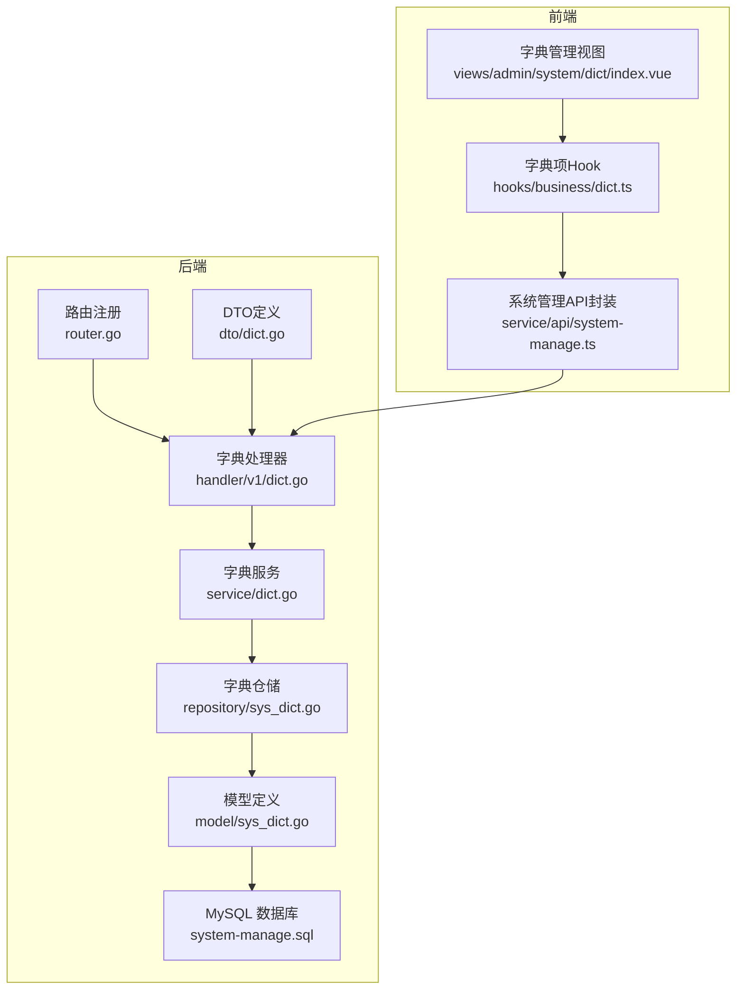
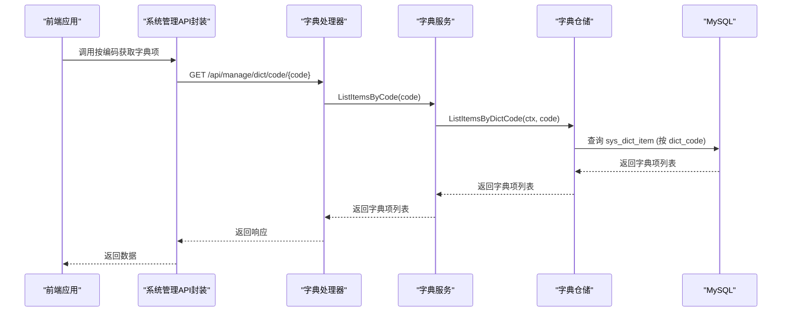
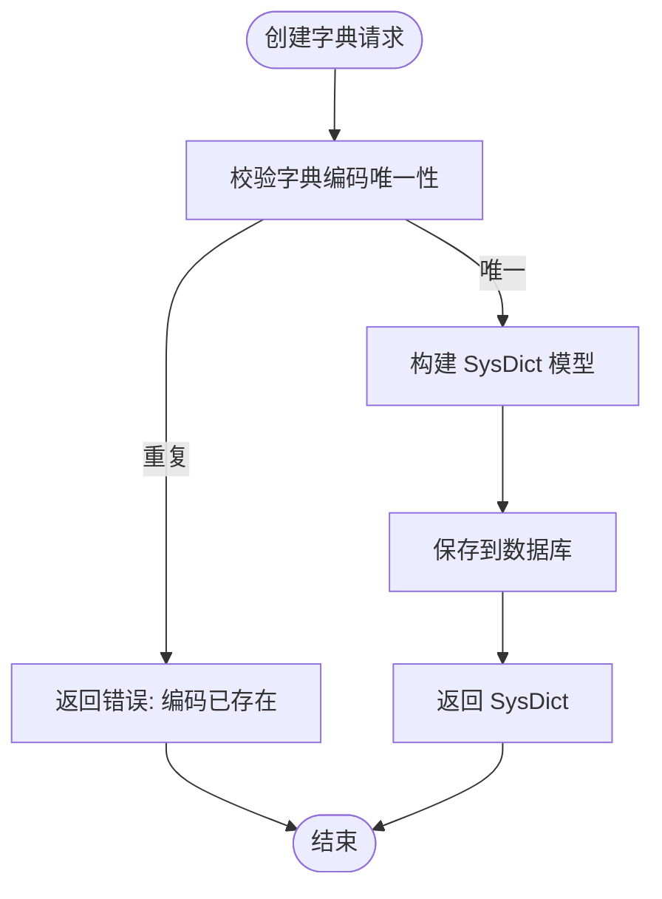
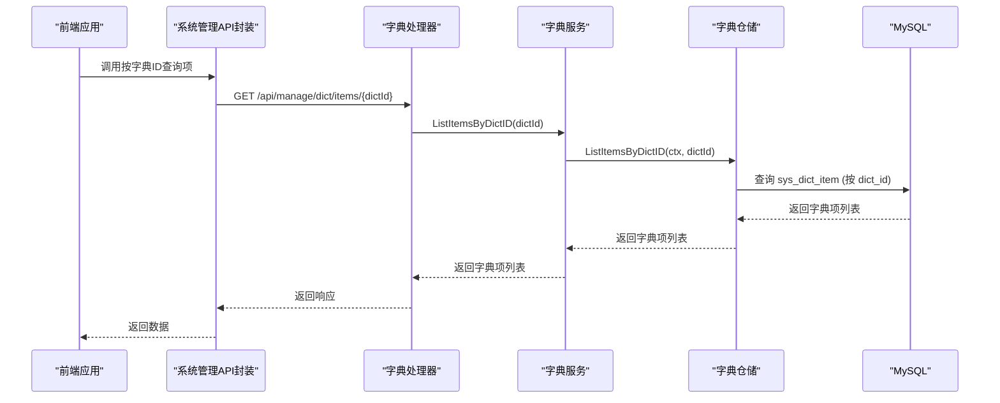
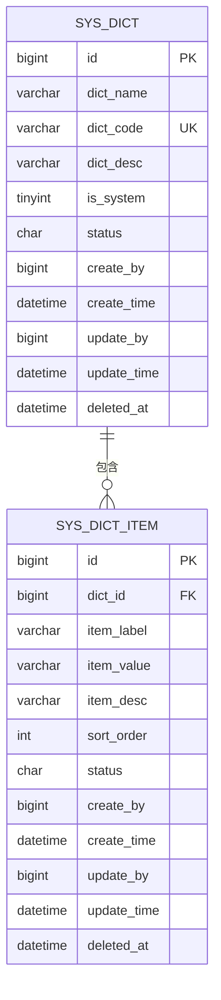
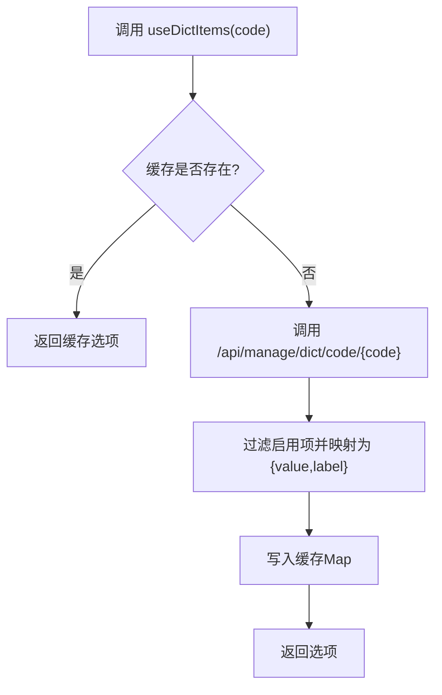
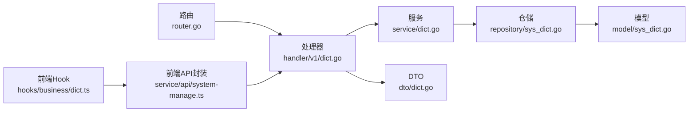

# 字典管理API

<cite>
**本文档引用的文件**
- [app/server/internal/handler/v1/dict.go](file://app/server/internal/handler/v1/dict.go)
- [app/server/internal/service/dict.go](file://app/server/internal/service/dict.go)
- [app/server/internal/repository/sys_dict.go](file://app/server/internal/repository/sys_dict.go)
- [app/server/internal/model/sys_dict.go](file://app/server/internal/model/sys_dict.go)
- [app/server/internal/dto/dict.go](file://app/server/internal/dto/dict.go)
- [app/server/internal/router/router.go](file://app/server/internal/router/router.go)
- [app/server/docs/swagger.json](file://app/server/docs/swagger.json)
- [app/sql/system-manage.sql](file://app/sql/system-manage.sql)
- [app/web/src/hooks/business/dict.ts](file://app/web/src/hooks/business/dict.ts)
- [app/web/src/service/api/system-manage.ts](file://app/web/src/service/api/system-manage.ts)
- [app/web/src/views/admin/system/dict/index.vue](file://app/web/src/views/admin/system/dict/index.vue)
</cite>

## 目录
1. [简介](#简介)
2. [项目结构](#项目结构)
3. [核心组件](#核心组件)
4. [架构总览](#架构总览)
5. [详细组件分析](#详细组件分析)
6. [依赖关系分析](#依赖关系分析)
7. [性能考虑](#性能考虑)
8. [故障排查指南](#故障排查指南)
9. [结论](#结论)
10. [附录](#附录)

## 简介
本文件面向字典管理API的使用者与维护者，系统化阐述系统配置项管理、数据字典维护、字典分类管理等核心功能。文档覆盖字典类型CRUD、字典项增删改查、字典项排序调整、启用禁用控制等接口，并解释前端字典缓存机制、高频接口设计思路以及多语言支持在前端层面的应用。同时提供API调用示例与性能优化建议，帮助快速集成与稳定运行。

## 项目结构
后端采用Go+Gin微服务架构，按职责分层组织：Handler（HTTP入口）、Service（业务逻辑）、Repository（数据访问）、Model/DTO（数据模型与传输对象）。前端Vue生态通过Alova/Axios封装HTTP请求，提供字典项的本地缓存与多语言展示能力。

**图表来源**
- [app/server/internal/router/router.go:136-146](file://app/server/internal/router/router.go#L136-L146)
- [app/server/internal/handler/v1/dict.go:29-274](file://app/server/internal/handler/v1/dict.go#L29-L274)
- [app/server/internal/service/dict.go:17-157](file://app/server/internal/service/dict.go#L17-L157)
- [app/server/internal/repository/sys_dict.go:12-105](file://app/server/internal/repository/sys_dict.go#L12-L105)
- [app/server/internal/model/sys_dict.go:3-26](file://app/server/internal/model/sys_dict.go#L3-L26)
- [app/server/internal/dto/dict.go:5-34](file://app/server/internal/dto/dict.go#L5-L34)
- [app/sql/system-manage.sql:285-331](file://app/sql/system-manage.sql#L285-L331)
- [app/web/src/service/api/system-manage.ts:331-436](file://app/web/src/service/api/system-manage.ts#L331-L436)
- [app/web/src/hooks/business/dict.ts:6-40](file://app/web/src/hooks/business/dict.ts#L6-L40)

**章节来源**
- [app/server/internal/router/router.go:136-146](file://app/server/internal/router/router.go#L136-L146)
- [app/server/internal/handler/v1/dict.go:29-274](file://app/server/internal/handler/v1/dict.go#L29-L274)
- [app/server/internal/service/dict.go:17-157](file://app/server/internal/service/dict.go#L17-L157)
- [app/server/internal/repository/sys_dict.go:12-105](file://app/server/internal/repository/sys_dict.go#L12-L105)
- [app/server/internal/model/sys_dict.go:3-26](file://app/server/internal/model/sys_dict.go#L3-L26)
- [app/server/internal/dto/dict.go:5-34](file://app/server/internal/dto/dict.go#L5-L34)
- [app/sql/system-manage.sql:285-331](file://app/sql/system-manage.sql#L285-L331)
- [app/web/src/service/api/system-manage.ts:331-436](file://app/web/src/service/api/system-manage.ts#L331-L436)
- [app/web/src/hooks/business/dict.ts:6-40](file://app/web/src/hooks/business/dict.ts#L6-L40)

## 核心组件
- 字典分类（sys_dict）：包含字典名称、编码、描述、系统内置标记、状态、创建/更新信息等。
- 字典项（sys_dict_item）：包含所属字典ID、显示标签、实际值、描述、排序、状态、创建/更新信息等。
- DTO：DictRequest/DictSearch、DictItemRequest/DictItemSearch，用于请求参数校验与分页。
- Handler：暴露REST接口，处理HTTP请求与响应。
- Service：封装业务规则（如字典编码唯一性、系统内置字典保护、启用/禁用状态控制）。
- Repository：封装数据库查询与分页逻辑。
- 前端Hook：useDictItems提供字典项按编码拉取与本地缓存能力。

**章节来源**
- [app/server/internal/model/sys_dict.go:3-26](file://app/server/internal/model/sys_dict.go#L3-L26)
- [app/server/internal/dto/dict.go:5-34](file://app/server/internal/dto/dict.go#L5-L34)
- [app/server/internal/handler/v1/dict.go:29-274](file://app/server/internal/handler/v1/dict.go#L29-L274)
- [app/server/internal/service/dict.go:17-157](file://app/server/internal/service/dict.go#L17-L157)
- [app/server/internal/repository/sys_dict.go:12-105](file://app/server/internal/repository/sys_dict.go#L12-L105)
- [app/web/src/hooks/business/dict.ts:6-40](file://app/web/src/hooks/business/dict.ts#L6-L40)

## 架构总览
后端采用经典的分层架构，Handler负责HTTP协议适配，Service负责业务编排，Repository负责数据持久化；前端通过API封装与Hook实现高频接口缓存与UI渲染。

**图表来源**
- [app/server/internal/handler/v1/dict.go:169-189](file://app/server/internal/handler/v1/dict.go#L169-L189)
- [app/server/internal/service/dict.go:155-157](file://app/server/internal/service/dict.go#L155-L157)
- [app/server/internal/repository/sys_dict.go:98-105](file://app/server/internal/repository/sys_dict.go#L98-L105)
- [app/web/src/service/api/system-manage.ts:387-393](file://app/web/src/service/api/system-manage.ts#L387-L393)

**章节来源**
- [app/server/internal/handler/v1/dict.go:169-189](file://app/server/internal/handler/v1/dict.go#L169-L189)
- [app/server/internal/service/dict.go:155-157](file://app/server/internal/service/dict.go#L155-L157)
- [app/server/internal/repository/sys_dict.go:98-105](file://app/server/internal/repository/sys_dict.go#L98-L105)
- [app/web/src/service/api/system-manage.ts:387-393](file://app/web/src/service/api/system-manage.ts#L387-L393)

## 详细组件分析

### 字典分类管理
- 创建字典：POST /api/manage/dict
  - 请求体：DictRequest（字典名称、编码、描述、状态）
  - 业务规则：字典编码唯一；默认启用；系统内置字典不可修改编码
  - 响应：SysDict
- 更新字典：PUT /api/manage/dict/{id}
  - 请求体：DictRequest
  - 业务规则：系统内置字典不可修改编码；编码变更需唯一性校验
  - 响应：SysDict
- 删除字典：DELETE /api/manage/dict/{id}
  - 业务规则：系统内置字典不可删除
  - 响应：无内容
- 字典分页：POST /api/manage/dict/page
  - 请求体：DictSearch（支持按名称、编码、状态筛选）
  - 响应：分页结果（records、current、size、total）
- 获取字典详情：GET /api/manage/dict/{id}
  - 响应：SysDict

**图表来源**
- [app/server/internal/service/dict.go:25-47](file://app/server/internal/service/dict.go#L25-L47)
- [app/server/internal/repository/sys_dict.go:40-46](file://app/server/internal/repository/sys_dict.go#L40-L46)

**章节来源**
- [app/server/internal/handler/v1/dict.go:74-145](file://app/server/internal/handler/v1/dict.go#L74-L145)
- [app/server/internal/service/dict.go:25-86](file://app/server/internal/service/dict.go#L25-L86)
- [app/server/internal/repository/sys_dict.go:20-46](file://app/server/internal/repository/sys_dict.go#L20-L46)
- [app/server/docs/swagger.json:1295-1426](file://app/server/docs/swagger.json#L1295-L1426)

### 字典项管理
- 创建字典项：POST /api/manage/dict/item
  - 请求体：DictItemRequest（所属字典ID、标签、值、描述、排序、状态）
  - 响应：SysDictItem
- 更新字典项：PUT /api/manage/dict/item/{id}
  - 请求体：DictItemRequest
  - 响应：SysDictItem
- 删除字典项：DELETE /api/manage/dict/item/{id}
  - 响应：无内容
- 按字典ID查询项：GET /api/manage/dict/items/{dictId}
  - 响应：SysDictItem 数组（按排序升序）
- 按字典编码查询项：GET /api/manage/dict/code/{code}
  - 响应：SysDictItem 数组（按排序升序）

**图表来源**
- [app/server/internal/handler/v1/dict.go:147-189](file://app/server/internal/handler/v1/dict.go#L147-L189)
- [app/server/internal/service/dict.go:151-157](file://app/server/internal/service/dict.go#L151-L157)
- [app/server/internal/repository/sys_dict.go:92-105](file://app/server/internal/repository/sys_dict.go#L92-L105)
- [app/web/src/service/api/system-manage.ts:379-393](file://app/web/src/service/api/system-manage.ts#L379-L393)

**章节来源**
- [app/server/internal/handler/v1/dict.go:147-262](file://app/server/internal/handler/v1/dict.go#L147-L262)
- [app/server/internal/service/dict.go:103-157](file://app/server/internal/service/dict.go#L103-L157)
- [app/server/internal/repository/sys_dict.go:72-105](file://app/server/internal/repository/sys_dict.go#L72-L105)
- [app/server/docs/swagger.json:1225-1277](file://app/server/docs/swagger.json#L1225-L1277)

### 数据模型与索引
- sys_dict：字典分类表，唯一索引为 dict_code + 软删函数索引，确保编码唯一且可重建。
- sys_dict_item：字典项表，唯一索引为 (dict_id, item_value) + 软删函数索引，保证同一字典下值唯一。
- 排序：字典项按 sort_order 升序排列，支持排序调整。

**图表来源**
- [app/sql/system-manage.sql:285-331](file://app/sql/system-manage.sql#L285-L331)
- [app/server/internal/model/sys_dict.go:3-26](file://app/server/internal/model/sys_dict.go#L3-L26)

**章节来源**
- [app/sql/system-manage.sql:285-331](file://app/sql/system-manage.sql#L285-L331)
- [app/server/internal/model/sys_dict.go:3-26](file://app/server/internal/model/sys_dict.go#L3-L26)

### 前端字典缓存与多语言
- useDictItems Hook：按字典编码拉取字典项，过滤启用状态，构建 {value, label} 选项并缓存至内存Map，避免重复请求。
- 多语言支持：前端通过i18n框架加载不同语言包，但字典项的标签（itemLabel）来自后端，前端不直接进行翻译；若需多语言标签，可在后端扩展或前端二次处理。

**图表来源**
- [app/web/src/hooks/business/dict.ts:20-35](file://app/web/src/hooks/business/dict.ts#L20-L35)
- [app/web/src/service/api/system-manage.ts:387-393](file://app/web/src/service/api/system-manage.ts#L387-L393)

**章节来源**
- [app/web/src/hooks/business/dict.ts:6-40](file://app/web/src/hooks/business/dict.ts#L6-L40)
- [app/web/src/service/api/system-manage.ts:387-393](file://app/web/src/service/api/system-manage.ts#L387-L393)

## 依赖关系分析
- 路由层：router.go 将 /api/manage/dict* 路由绑定到 DictHandler，受登录态与按钮级鉴权保护。
- 处理器层：DictHandler 将HTTP请求转换为DTO，调用Service执行业务逻辑，返回统一响应格式。
- 服务层：DictService 负责业务规则与跨表校验（如字典编码唯一、系统内置字典保护）。
- 仓储层：SysDictRepository 提供分页、条件查询、字典项按ID/编码查询等。
- 模型层：SysDict/SysDictItem 定义表结构与字段约束。
- 前端：API封装与Hook解耦UI与网络层，提升复用性与可测试性。

**图表来源**
- [app/server/internal/router/router.go:136-146](file://app/server/internal/router/router.go#L136-L146)
- [app/server/internal/handler/v1/dict.go:21-27](file://app/server/internal/handler/v1/dict.go#L21-L27)
- [app/server/internal/service/dict.go:17-23](file://app/server/internal/service/dict.go#L17-L23)
- [app/server/internal/repository/sys_dict.go:12-18](file://app/server/internal/repository/sys_dict.go#L12-L18)
- [app/server/internal/model/sys_dict.go:3-11](file://app/server/internal/model/sys_dict.go#L3-L11)
- [app/server/internal/dto/dict.go:5-11](file://app/server/internal/dto/dict.go#L5-L11)
- [app/web/src/service/api/system-manage.ts:331-436](file://app/web/src/service/api/system-manage.ts#L331-L436)
- [app/web/src/hooks/business/dict.ts:6-40](file://app/web/src/hooks/business/dict.ts#L6-L40)

**章节来源**
- [app/server/internal/router/router.go:136-146](file://app/server/internal/router/router.go#L136-L146)
- [app/server/internal/handler/v1/dict.go:21-27](file://app/server/internal/handler/v1/dict.go#L21-L27)
- [app/server/internal/service/dict.go:17-23](file://app/server/internal/service/dict.go#L17-L23)
- [app/server/internal/repository/sys_dict.go:12-18](file://app/server/internal/repository/sys_dict.go#L12-L18)
- [app/server/internal/model/sys_dict.go:3-11](file://app/server/internal/model/sys_dict.go#L3-L11)
- [app/server/internal/dto/dict.go:5-11](file://app/server/internal/dto/dict.go#L5-L11)
- [app/web/src/service/api/system-manage.ts:331-436](file://app/web/src/service/api/system-manage.ts#L331-L436)
- [app/web/src/hooks/business/dict.ts:6-40](file://app/web/src/hooks/business/dict.ts#L6-L40)

## 性能考虑
- 高频接口优化
  - 按字典编码拉取字典项（/api/manage/dict/code/{code}）为前端高频接口，建议结合前端Hook缓存，减少重复请求。
  - 字典项查询按 dict_id + sort_order 排序，数据库具备索引支持，查询效率较高。
- 分页与搜索
  - 字典分页接口支持按名称、编码、状态筛选，建议在前端合理设置分页大小与关键词长度，避免超长模糊匹配导致的性能问题。
- 数据库索引
  - sys_dict.dict_code + 软删函数索引确保编码唯一性与可重建；sys_dict_item.(dict_id, item_value) + 软删函数索引确保同一字典下值唯一。
- 前端缓存
  - 使用内存Map缓存字典项，命中率高；建议在页面切换或字典数据变更时主动清理缓存，确保数据一致性。

[本节为通用性能建议，不直接分析具体文件]

## 故障排查指南
- 常见错误码映射
  - 字典编码已存在：3001
  - 系统内置字典不可操作：3002
  - 服务器内部错误：5001
- 排查步骤
  - 确认请求参数：字典编码唯一、字典项值在同一字典内唯一。
  - 检查系统内置标记：对 is_system=true 的字典禁止修改编码与删除。
  - 核对状态字段：启用/禁用状态使用统一枚举，确保传入正确值。
  - 前端缓存问题：若出现数据不一致，尝试清除Hook缓存或刷新页面。

**章节来源**
- [app/server/internal/handler/v1/dict.go:264-273](file://app/server/internal/handler/v1/dict.go#L264-L273)
- [app/server/internal/service/dict.go:12-15](file://app/server/internal/service/dict.go#L12-L15)
- [app/web/src/hooks/business/dict.ts:20-35](file://app/web/src/hooks/business/dict.ts#L20-L35)

## 结论
字典管理API以清晰的分层架构实现了字典分类与字典项的完整生命周期管理，配合前端Hook缓存与高频接口设计，满足了后台管理系统对字典数据的高效使用需求。通过严格的业务规则与数据库索引约束，保障了数据一致性与查询性能。建议在生产环境中结合缓存策略与合理的分页配置，持续优化用户体验与系统稳定性。

[本节为总结性内容，不直接分析具体文件]

## 附录

### API调用示例（路径参考）
- 创建字典
  - 方法：POST
  - 路径：/api/manage/dict
  - 请求体：DictRequest
  - 参考：[app/server/docs/swagger.json:1379-1400](file://app/server/docs/swagger.json#L1379-L1400)
- 更新字典
  - 方法：PUT
  - 路径：/api/manage/dict/{id}
  - 请求体：DictRequest
  - 参考：[app/server/docs/swagger.json:1382-1400](file://app/server/docs/swagger.json#L1382-L1400)
- 删除字典
  - 方法：DELETE
  - 路径：/api/manage/dict/{id}
  - 参考：[app/server/docs/swagger.json:1440-1441](file://app/server/docs/swagger.json#L1440-L1441)
- 字典分页
  - 方法：POST
  - 路径：/api/manage/dict/page
  - 请求体：DictSearch
  - 参考：[app/server/docs/swagger.json:1295-1296](file://app/server/docs/swagger.json#L1295-L1296)
- 按字典ID查询项
  - 方法：GET
  - 路径：/api/manage/dict/items/{dictId}
  - 参考：[app/server/docs/swagger.json:1238-1247](file://app/server/docs/swagger.json#L1238-L1247)
- 按字典编码查询项
  - 方法：GET
  - 路径：/api/manage/dict/code/{code}
  - 参考：[app/server/docs/swagger.json:170-175](file://app/server/docs/swagger.json#L170-L175)
- 创建字典项
  - 方法：POST
  - 路径：/api/manage/dict/item
  - 请求体：DictItemRequest
  - 参考：[app/server/docs/swagger.json:192-198](file://app/server/docs/swagger.json#L192-L198)
- 更新字典项
  - 方法：PUT
  - 路径：/api/manage/dict/item/{id}
  - 请求体：DictItemRequest
  - 参考：[app/server/docs/swagger.json:215-222](file://app/server/docs/swagger.json#L215-L222)
- 删除字典项
  - 方法：DELETE
  - 路径：/api/manage/dict/item/{id}
  - 参考：[app/server/docs/swagger.json:244-248](file://app/server/docs/swagger.json#L244-L248)

**章节来源**
- [app/server/docs/swagger.json:1225-1441](file://app/server/docs/swagger.json#L1225-L1441)