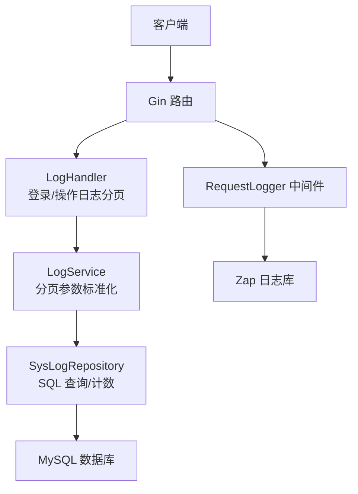
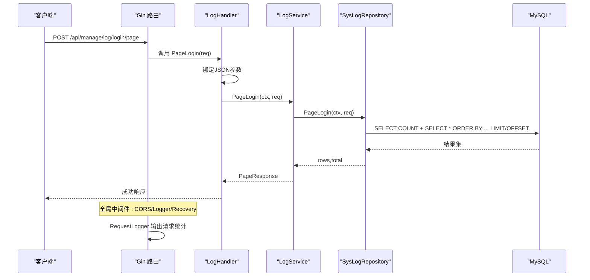
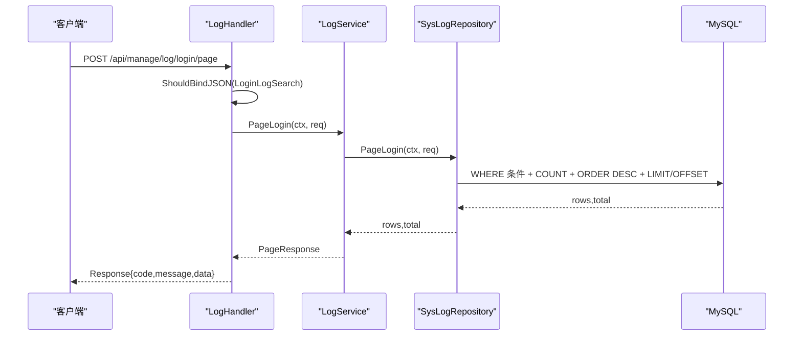
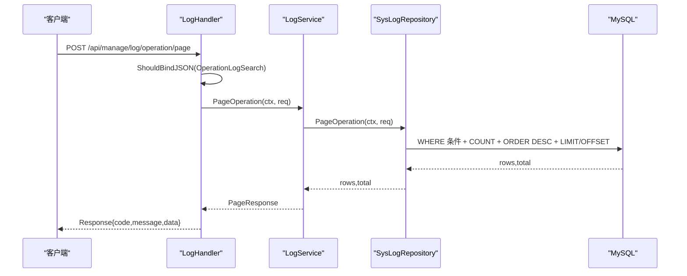
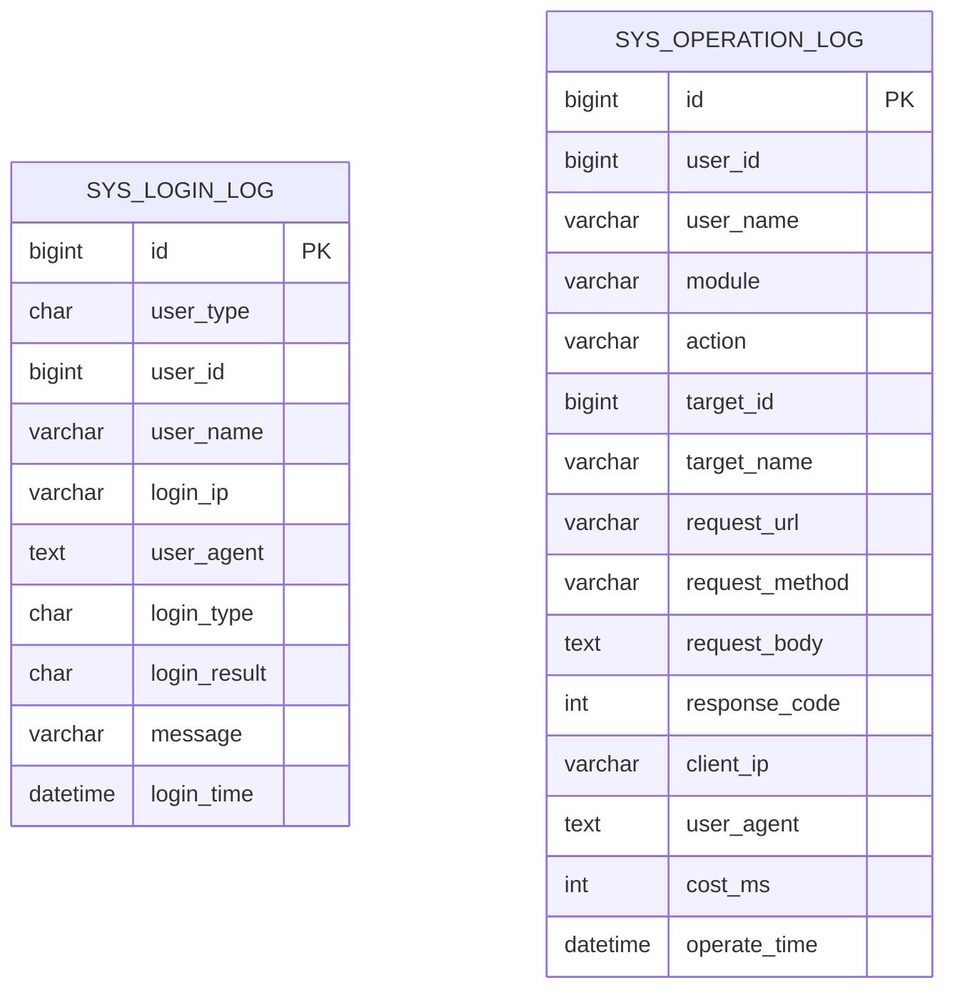
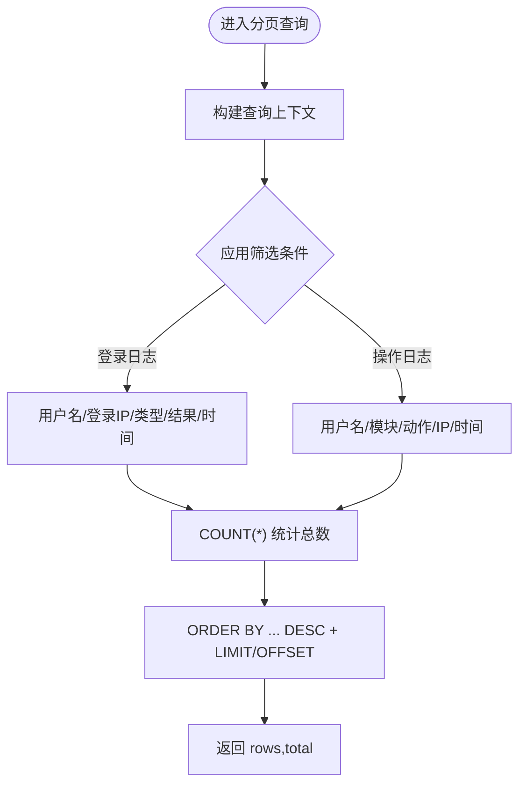
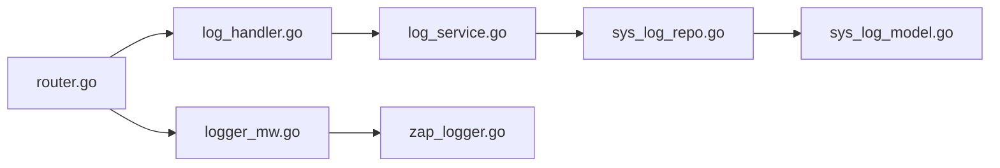

# 日志管理API

<cite>
**本文引用的文件**
- [main.go](file://app/server/cmd/api/main.go)
- [router.go](file://app/server/internal/router/router.go)
- [log_handler.go](file://app/server/internal/handler/v1/log.go)
- [log_service.go](file://app/server/internal/service/log.go)
- [sys_log_repo.go](file://app/server/internal/repository/sys_log.go)
- [sys_log_model.go](file://app/server/internal/model/sys_log.go)
- [log_dto.go](file://app/server/internal/dto/log.go)
- [common_dto.go](file://app/server/internal/dto/common.go)
- [logger_mw.go](file://app/server/internal/middleware/logger.go)
- [zap_logger.go](file://app/server/pkg/logger/logger.go)
- [config.yaml](file://app/server/configs/config.example.yaml)
- [system_manage_sql.go](file://app/sql/system-manage.sql)
</cite>

## 目录
1. [简介](#简介)
2. [项目结构](#项目结构)
3. [核心组件](#核心组件)
4. [架构总览](#架构总览)
5. [详细组件分析](#详细组件分析)
6. [依赖分析](#依赖分析)
7. [性能考量](#性能考量)
8. [故障排查指南](#故障排查指南)
9. [结论](#结论)
10. [附录](#附录)

## 简介
本文件面向系统日志API，覆盖登录日志与操作日志的审计能力，包括：
- 审计接口：登录日志分页、操作日志分页
- 查询与筛选：按用户、IP、时间、模块、动作等条件过滤
- 管理操作：分页查询、导出（建议）、清理（建议）
- 安全与性能：日志级别、敏感信息脱敏、索引优化、连接池
- 高级功能：日志聚合统计、访问模式识别、安全事件预警（建议）
- 运维配置：日志存储策略、保留周期、备份恢复（建议）

## 项目结构
围绕日志管理的后端代码采用典型的分层架构：
- 路由层：注册“/api/manage/log/login/page”和“/api/manage/log/operation/page”
- 处理器层：接收请求、绑定参数、调用服务层
- 服务层：标准化分页参数、调用仓储层
- 仓储层：基于GORM构建查询条件、执行分页与计数
- 模型层：定义登录日志与操作日志的数据结构
- DTO层：定义分页请求、分页响应、登录/操作日志查询参数
- 中间件：全局请求日志中间件
- 日志库：基于Zap的生产级日志初始化与输出

图表来源
- [router.go:148-150](file://app/server/internal/router/router.go#L148-L150)
- [log_handler.go:19-63](file://app/server/internal/handler/v1/log.go#L19-L63)
- [log_service.go:18-34](file://app/server/internal/service/log.go#L18-L34)
- [sys_log_repo.go:21-82](file://app/server/internal/repository/sys_log.go#L21-L82)
- [logger_mw.go:10-28](file://app/server/internal/middleware/logger.go#L10-L28)
- [zap_logger.go:13-38](file://app/server/pkg/logger/logger.go#L13-L38)

章节来源
- [router.go:148-150](file://app/server/internal/router/router.go#L148-L150)
- [log_handler.go:19-63](file://app/server/internal/handler/v1/log.go#L19-L63)
- [log_service.go:18-34](file://app/server/internal/service/log.go#L18-L34)
- [sys_log_repo.go:21-82](file://app/server/internal/repository/sys_log.go#L21-L82)
- [logger_mw.go:10-28](file://app/server/internal/middleware/logger.go#L10-L28)
- [zap_logger.go:13-38](file://app/server/pkg/logger/logger.go#L13-L38)

## 核心组件
- 路由注册
  - 登录日志分页：POST /api/manage/log/login/page
  - 操作日志分页：POST /api/manage/log/operation/page
- 处理器
  - 绑定JSON请求体为登录/操作日志查询DTO
  - 调用服务层获取分页结果
  - 使用统一响应封装返回
- 服务层
  - 对分页请求进行Normalize，默认current=1、size=10
  - 调用仓储层执行分页查询与总数统计
- 仓储层
  - 动态拼接WHERE条件（用户名、IP、时间范围、模块、动作等）
  - 先Count再查询，保证分页一致性
  - 按时间倒序排序
- 模型层
  - 登录日志：包含用户类型、用户ID/名、登录IP、UA、登录类型/结果、消息、时间
  - 操作日志：包含用户ID/名、模块、动作、目标ID/名、请求URL/方法、请求体（建议脱敏）、响应码、客户端IP、UA、耗时、时间
- DTO层
  - 通用分页请求/响应
  - 登录日志搜索：用户名、登录IP、登录类型、登录结果、起止时间
  - 操作日志搜索：用户名、模块、动作、客户端IP、起止时间
- 中间件与日志
  - RequestLogger中间件输出请求状态码、耗时、方法、路径
  - Zap日志库支持控制台与文件输出，支持不同日志级别

章节来源
- [router.go:148-150](file://app/server/internal/router/router.go#L148-L150)
- [log_handler.go:19-63](file://app/server/internal/handler/v1/log.go#L19-L63)
- [log_service.go:18-34](file://app/server/internal/service/log.go#L18-L34)
- [sys_log_repo.go:21-82](file://app/server/internal/repository/sys_log.go#L21-L82)
- [sys_log_model.go:29-64](file://app/server/internal/model/sys_log.go#L29-L64)
- [log_dto.go:5-25](file://app/server/internal/dto/log.go#L5-L25)
- [common_dto.go:3-41](file://app/server/internal/dto/common.go#L3-L41)
- [logger_mw.go:10-28](file://app/server/internal/middleware/logger.go#L10-L28)
- [zap_logger.go:13-38](file://app/server/pkg/logger/logger.go#L13-L38)

## 架构总览
下图展示从客户端到数据库的完整调用链路，以及中间件与日志库的集成。

图表来源
- [router.go:148-150](file://app/server/internal/router/router.go#L148-L150)
- [log_handler.go:28-40](file://app/server/internal/handler/v1/log.go#L28-L40)
- [log_service.go:18-24](file://app/server/internal/service/log.go#L18-L24)
- [sys_log_repo.go:21-49](file://app/server/internal/repository/sys_log.go#L21-L49)
- [logger_mw.go:10-28](file://app/server/internal/middleware/logger.go#L10-L28)

## 详细组件分析

### 登录日志分页接口
- 接口定义
  - 方法：POST
  - 路径：/api/manage/log/login/page
  - 权限：BearerAuth
  - 请求体：登录日志分页搜索DTO（用户名、登录IP、登录类型、登录结果、起止时间）
  - 返回：分页响应（records、current、size、total）
- 处理流程
  - 绑定请求体并校验
  - 调用服务层进行分页参数标准化
  - 仓储层动态拼接WHERE条件并执行分页查询
  - 返回分页结果

图表来源
- [log_handler.go:28-40](file://app/server/internal/handler/v1/log.go#L28-L40)
- [log_service.go:18-24](file://app/server/internal/service/log.go#L18-L24)
- [sys_log_repo.go:21-49](file://app/server/internal/repository/sys_log.go#L21-L49)

章节来源
- [log_handler.go:19-40](file://app/server/internal/handler/v1/log.go#L19-L40)
- [log_service.go:18-24](file://app/server/internal/service/log.go#L18-L24)
- [sys_log_repo.go:21-49](file://app/server/internal/repository/sys_log.go#L21-L49)

### 操作日志分页接口
- 接口定义
  - 方法：POST
  - 路径：/api/manage/log/operation/page
  - 权限：BearerAuth
  - 请求体：操作日志分页搜索DTO（用户名、模块、动作、客户端IP、起止时间）
  - 返回：分页响应（records、current、size、total）
- 处理流程
  - 绑定请求体并校验
  - 调用服务层进行分页参数标准化
  - 仓储层动态拼接WHERE条件并执行分页查询
  - 返回分页结果

图表来源
- [log_handler.go:51-63](file://app/server/internal/handler/v1/log.go#L51-L63)
- [log_service.go:27-34](file://app/server/internal/service/log.go#L27-L34)
- [sys_log_repo.go:52-82](file://app/server/internal/repository/sys_log.go#L52-L82)

章节来源
- [log_handler.go:42-63](file://app/server/internal/handler/v1/log.go#L42-L63)
- [log_service.go:27-34](file://app/server/internal/service/log.go#L27-L34)
- [sys_log_repo.go:52-82](file://app/server/internal/repository/sys_log.go#L52-L82)

### 数据模型与表结构
- 登录日志表（sys_login_log）
  - 字段：用户类型、用户ID/名、登录IP、UA、登录类型/结果、消息、登录时间
  - 索引：按用户+时间倒序、用户名、登录时间倒序
- 操作日志表（sys_operation_log）
  - 字段：用户ID/名、模块、动作、目标ID/名、请求URL/方法、请求体（建议脱敏）、响应码、客户端IP、UA、耗时、操作时间
  - 索引：按用户+时间倒序、模块+动作、目标ID、操作时间倒序

图表来源
- [sys_log_model.go:29-64](file://app/server/internal/model/sys_log.go#L29-L64)
- [system_manage_sql.go:237-283](file://app/sql/system-manage.sql#L237-L283)

章节来源
- [sys_log_model.go:29-64](file://app/server/internal/model/sys_log.go#L29-L64)
- [system_manage_sql.go:237-283](file://app/sql/system-manage.sql#L237-L283)

### 查询与筛选逻辑
- 登录日志筛选
  - 用户名模糊匹配
  - 登录IP模糊匹配
  - 登录类型、登录结果精确匹配
  - 登录时间范围过滤
  - 结果按登录时间降序，分页取数
- 操作日志筛选
  - 用户名模糊匹配
  - 模块、动作精确匹配
  - 客户端IP模糊匹配
  - 操作时间范围过滤
  - 结果按操作时间降序，分页取数

图表来源
- [sys_log_repo.go:21-49](file://app/server/internal/repository/sys_log.go#L21-L49)
- [sys_log_repo.go:52-82](file://app/server/internal/repository/sys_log.go#L52-L82)

章节来源
- [sys_log_repo.go:21-49](file://app/server/internal/repository/sys_log.go#L21-L49)
- [sys_log_repo.go:52-82](file://app/server/internal/repository/sys_log.go#L52-L82)

### 分页与响应封装
- 通用分页请求
  - current默认1，size默认10
  - Offset计算：(current-1)*size
- 分页响应
  - 返回records、current、size、total
- 错误处理
  - 请求体绑定失败返回错误码1001
  - 服务层/仓储层错误返回错误码5001

章节来源
- [common_dto.go:3-41](file://app/server/internal/dto/common.go#L3-L41)
- [log_handler.go:28-40](file://app/server/internal/handler/v1/log.go#L28-L40)
- [log_handler.go:51-63](file://app/server/internal/handler/v1/log.go#L51-L63)
- [log_service.go:18-34](file://app/server/internal/service/log.go#L18-L34)

### 敏感信息脱敏与安全
- 操作日志请求体建议在中间件层进行脱敏（如密码、令牌）后再入库
- 日志库支持控制台与文件输出，便于生产环境集中收集与分级

章节来源
- [system_manage_sql.go:259](file://app/sql/system-manage.sql#L259)
- [zap_logger.go:13-38](file://app/server/pkg/logger/logger.go#L13-L38)

### 日志级别与中间件
- RequestLogger中间件输出状态码、耗时、方法、路径
- Zap日志库支持debug/info/warn/error级别切换

章节来源
- [logger_mw.go:10-28](file://app/server/internal/middleware/logger.go#L10-L28)
- [zap_logger.go:40-52](file://app/server/pkg/logger/logger.go#L40-L52)

## 依赖分析
- 路由层依赖处理器层
- 处理器层依赖服务层
- 服务层依赖仓储层
- 仓储层依赖GORM与数据库
- 路由层依赖中间件（CORS、请求日志、恢复）
- 日志库独立于业务层，供中间件与应用启动阶段使用

图表来源
- [router.go:65-72](file://app/server/internal/router/router.go#L65-L72)
- [log_handler.go:11-17](file://app/server/internal/handler/v1/log.go#L11-L17)
- [log_service.go:10-16](file://app/server/internal/service/log.go#L10-L16)
- [sys_log_repo.go:12-18](file://app/server/internal/repository/sys_log.go#L12-L18)
- [sys_log_model.go:1-2](file://app/server/internal/model/sys_log.go#L1-L2)
- [logger_mw.go:10-28](file://app/server/internal/middleware/logger.go#L10-L28)
- [zap_logger.go:13-38](file://app/server/pkg/logger/logger.go#L13-L38)

章节来源
- [router.go:65-72](file://app/server/internal/router/router.go#L65-L72)
- [log_handler.go:11-17](file://app/server/internal/handler/v1/log.go#L11-L17)
- [log_service.go:10-16](file://app/server/internal/service/log.go#L10-L16)
- [sys_log_repo.go:12-18](file://app/server/internal/repository/sys_log.go#L12-L18)
- [sys_log_model.go:1-2](file://app/server/internal/model/sys_log.go#L1-L2)
- [logger_mw.go:10-28](file://app/server/internal/middleware/logger.go#L10-L28)
- [zap_logger.go:13-38](file://app/server/pkg/logger/logger.go#L13-L38)

## 性能考量
- 查询性能
  - 登录日志与操作日志均建立按时间倒序的复合索引，满足高频“按用户/时间倒序查询”
  - 分页先COUNT后查询，避免数据不一致
- 数据库连接
  - 启动时设置最大空闲连接数与最大打开连接数，降低连接抖动
- 日志性能
  - RequestLogger中间件仅输出必要字段，避免阻塞
  - Zap日志库采用tee合并多个输出源，兼顾控制台与文件

章节来源
- [system_manage_sql.go:250-253](file://app/sql/system-manage.sql#L250-L253)
- [system_manage_sql.go:279-282](file://app/sql/system-manage.sql#L279-L282)
- [main.go:63-64](file://app/server/cmd/api/main.go#L63-L64)
- [logger_mw.go:10-28](file://app/server/internal/middleware/logger.go#L10-L28)
- [zap_logger.go:13-38](file://app/server/pkg/logger/logger.go#L13-L38)

## 故障排查指南
- 常见错误码
  - 1001：请求体绑定失败（参数格式错误）
  - 5001：服务层/仓储层内部错误（数据库异常、SQL执行失败）
- 排查步骤
  - 检查请求体字段与DTO定义是否一致
  - 查看服务层/仓储层返回的错误信息
  - 检查数据库连接配置与连接池参数
  - 检查日志级别与输出路径，确认Zap初始化是否成功
- 建议
  - 在中间件层增加统一异常捕获与日志记录
  - 对敏感字段在入库前进行脱敏处理

章节来源
- [log_handler.go:28-40](file://app/server/internal/handler/v1/log.go#L28-L40)
- [log_handler.go:51-63](file://app/server/internal/handler/v1/log.go#L51-L63)
- [main.go:34-40](file://app/server/cmd/api/main.go#L34-L40)
- [zap_logger.go:13-38](file://app/server/pkg/logger/logger.go#L13-L38)

## 结论
本系统日志API提供了完善的登录与操作日志审计能力，具备良好的扩展性与性能基础。建议在现有基础上完善导出与清理机制、强化敏感信息脱敏、引入日志聚合与安全事件预警，并制定日志保留与备份策略，以满足合规与运维需求。

## 附录

### API定义与使用示例
- 登录日志分页
  - 方法：POST
  - 路径：/api/manage/log/login/page
  - 请求体字段：current、size、keyword、userName、loginIp、loginType、loginResult、startTime、endTime
  - 返回：records（数组）、current、size、total
- 操作日志分页
  - 方法：POST
  - 路径：/api/manage/log/operation/page
  - 请求体字段：current、size、keyword、userName、module、action、clientIp、startTime、endTime
  - 返回：records（数组）、current、size、total

章节来源
- [router.go:148-150](file://app/server/internal/router/router.go#L148-L150)
- [log_dto.go:5-25](file://app/server/internal/dto/log.go#L5-L25)
- [common_dto.go:25-41](file://app/server/internal/dto/common.go#L25-L41)

### 配置说明
- 服务器端口、模式
- 数据库连接参数（主机、端口、用户名、密码、库名、连接池）
- JWT密钥与过期时间
- 日志级别与文件路径

章节来源
- [config.yaml:1-21](file://app/server/configs/config.example.yaml#L1-L21)
- [main.go:34-40](file://app/server/cmd/api/main.go#L34-L40)