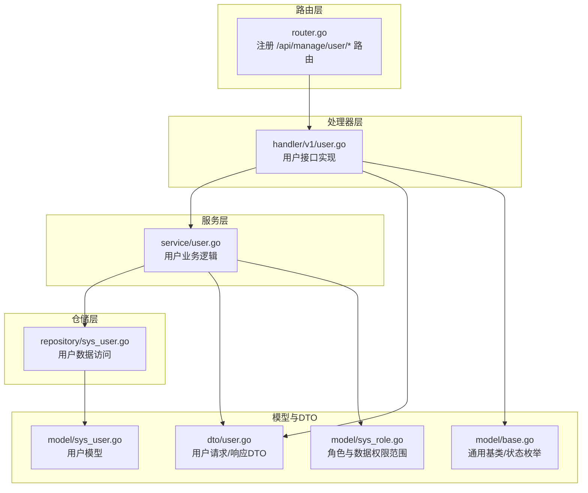
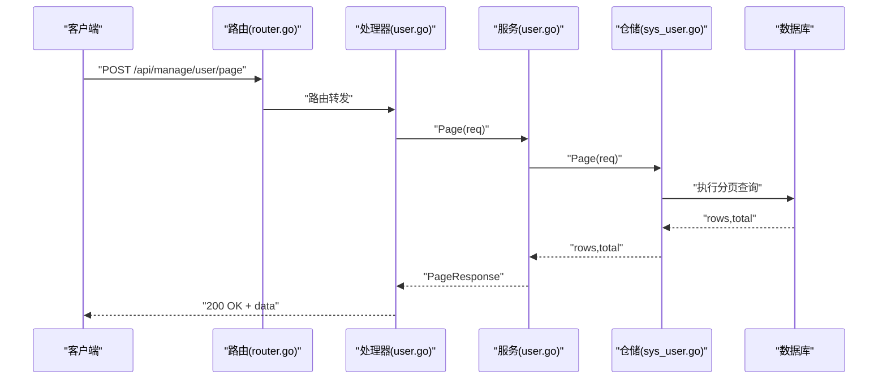
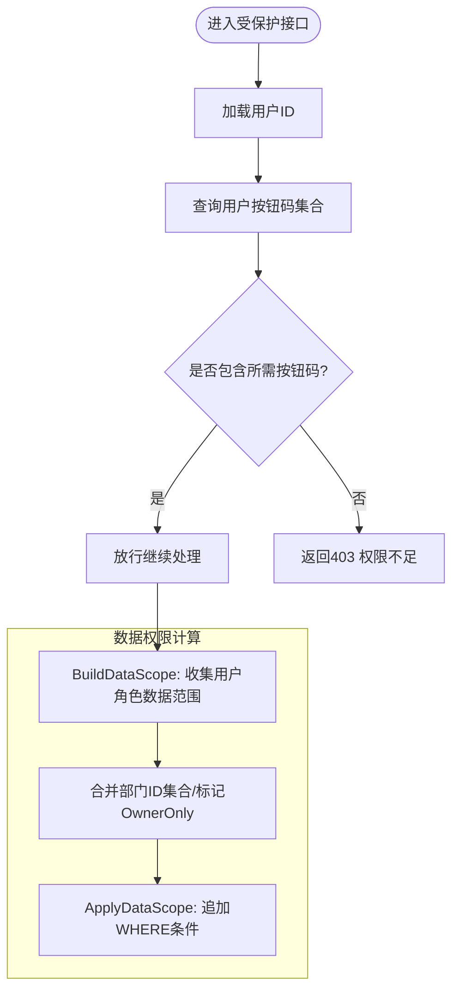
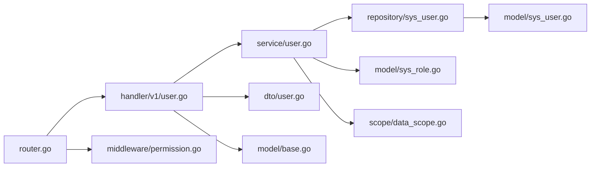

# 用户管理API

<cite>
**本文档引用的文件**
- [app\server\internal\handler\v1\user.go](file://app/server/internal/handler/v1/user.go)
- [app\server\internal\dto\user.go](file://app/server/internal/dto/user.go)
- [app\server\internal\model\sys_user.go](file://app/server/internal/model/sys_user.go)
- [app\server\internal\model\sys_role.go](file://app/server/internal/model/sys_role.go)
- [app\server\internal\model\base.go](file://app/server/internal/model/base.go)
- [app\server\internal\service\user.go](file://app/server/internal/service/user.go)
- [app\server\internal\repository\sys_user.go](file://app/server/internal/repository/sys_user.go)
- [app\server\internal\router\router.go](file://app/server/internal/router/router.go)
- [app\server\internal\middleware\permission.go](file://app/server/internal/middleware/permission.go)
- [app\server\internal\scope\data_scope.go](file://app/server/internal/scope/data_scope.go)
- [app\server\docs\swagger.json](file://app/server/docs/swagger.json)
- [app\web\src\service\api\system-manage.ts](file://app/web/src/service/api/system-manage.ts)
- [app\web\src\typings\api\system-manage.d.ts](file://app/web/src/typings/api/system-manage.d.ts)
</cite>

## 目录
1. [简介](#简介)
2. [项目结构](#项目结构)
3. [核心组件](#核心组件)
4. [架构总览](#架构总览)
5. [详细组件分析](#详细组件分析)
6. [依赖关系分析](#依赖关系分析)
7. [性能考虑](#性能考虑)
8. [故障排查指南](#故障排查指南)
9. [结论](#结论)
10. [附录](#附录)

## 简介
本文件为用户管理API的权威技术文档，覆盖用户CRUD、状态管理、密码重置、搜索过滤、权限继承、数据权限控制、用户锁定策略等安全特性，并提供完整的请求/响应格式、错误码说明、分页查询参数以及前后端对接示例。读者可据此完成用户导入导出、批量操作、用户详情查看等高级功能的集成。

## 项目结构
用户管理模块位于服务端Go工程中，采用典型的分层架构：路由层负责HTTP路由注册与鉴权；处理器层承接请求并调用服务层；服务层编排业务逻辑；仓储层封装数据库访问；DTO与模型层定义数据结构与约束。

图表来源
- [app\server\internal\router\router.go:117-123](file://app/server/internal/router/router.go#L117-L123)
- [app\server\internal\handler\v1\user.go:18-24](file://app/server/internal/handler/v1/user.go#L18-L24)
- [app\server\internal\service\user.go:19-25](file://app/server/internal/service/user.go#L19-L25)
- [app\server\internal\repository\sys_user.go:12-19](file://app/server/internal/repository/sys_user.go#L12-L19)
- [app\server\internal\model\sys_user.go:5-25](file://app/server/internal/model/sys_user.go#L5-L25)
- [app\server\internal\dto\user.go:5-59](file://app/server/internal/dto/user.go#L5-L59)
- [app\server\internal\model\base.go:12-29](file://app/server/internal/model/base.go#L12-L29)
- [app\server\internal\model\sys_role.go:14-26](file://app/server/internal/model/sys_role.go#L14-L26)

章节来源
- [app\server\internal\router\router.go:117-123](file://app/server/internal/router/router.go#L117-L123)
- [app\server\internal\handler\v1\user.go:18-24](file://app/server/internal/handler/v1/user.go#L18-L24)

## 核心组件
- 路由与鉴权
  - 用户管理路由统一挂载于 /api/manage/user，受登录态保护；新增/编辑/删除/重置密码等写操作进一步受按钮级权限校验。
- 处理器
  - 提供分页、详情、创建、更新、删除、重置密码等接口，负责参数绑定、错误映射与响应封装。
- 服务层
  - 实现用户创建（含密码加密）、更新、删除、分页查询、重置密码（清除锁定）等业务逻辑。
- 仓储层
  - 提供用户CRUD、分页查询、角色关联替换、登录成功/失败计数与锁定等数据访问方法。
- 模型与DTO
  - 定义用户表结构、角色关联、启用/禁用状态枚举、用户请求/响应DTO与分页请求/响应结构。
- 权限与数据范围
  - 按钮级权限中间件校验操作按钮码；数据权限作用域根据用户角色计算并应用到查询。

章节来源
- [app\server\internal\router\router.go:117-123](file://app/server/internal/router/router.go#L117-L123)
- [app\server\internal\handler\v1\user.go:26-170](file://app/server/internal/handler/v1/user.go#L26-L170)
- [app\server\internal\service\user.go:27-139](file://app/server/internal/service/user.go#L27-L139)
- [app\server\internal\repository\sys_user.go:150-196](file://app/server/internal/repository/sys_user.go#L150-L196)
- [app\server\internal\model\sys_user.go:5-36](file://app/server/internal/model/sys_user.go#L5-L36)
- [app\server\internal\dto\user.go:5-59](file://app/server/internal/dto/user.go#L5-L59)
- [app\server\internal\model\base.go:23-29](file://app/server/internal/model/base.go#L23-L29)
- [app\server\internal\middleware\permission.go:10-52](file://app/server/internal/middleware/permission.go#L10-L52)
- [app\server\internal\scope\data_scope.go:22-95](file://app/server/internal/scope/data_scope.go#L22-L95)

## 架构总览
用户管理API遵循“路由-处理器-服务-仓储-模型”的清晰分层，配合按钮级权限中间件与数据权限作用域，确保接口安全与数据隔离。

图表来源
- [app\server\internal\router\router.go:119](file://app/server/internal/router/router.go#L119)
- [app\server\internal\handler\v1\user.go:35-46](file://app/server/internal/handler/v1/user.go#L35-L46)
- [app\server\internal\service\user.go:111-124](file://app/server/internal/service/user.go#L111-L124)
- [app\server\internal\repository\sys_user.go:150-179](file://app/server/internal/repository/sys_user.go#L150-L179)

## 详细组件分析

### 用户数据模型与字段定义
- 用户表(sys_user)
  - 关键字段：用户名、密码（加密存储）、昵称、性别、手机号、邮箱、头像、状态、最后登录时间/IP、密码更新时间、密码错误次数、锁定截止时间、版本号等。
  - 状态：启用/禁用（字符串枚举）。
- 角色与数据权限
  - 用户-角色关联表，角色包含数据权限范围（全部/自定义部门/本部门/本部门及子部门/仅本人）。
- 通用基类
  - 主键、创建/更新人、创建/更新时间、软删除字段。

章节来源
- [app\server\internal\model\sys_user.go:5-36](file://app/server/internal/model/sys_user.go#L5-L36)
- [app\server\internal\model\sys_role.go:14-26](file://app/server/internal/model/sys_role.go#L14-L26)
- [app\server\internal\model\base.go:12-29](file://app/server/internal/model/base.go#L12-L29)

### 用户请求/响应DTO与验证规则
- 创建请求(UserCreateRequest)
  - 必填：用户名、密码、状态（为空时默认启用）
  - 可选：部门ID、昵称、性别、手机、邮箱、头像、角色ID集合
  - 验证：用户名长度、密码长度、性别枚举、邮箱格式
- 更新请求(UserUpdateRequest)
  - 与创建类似，但不包含密码字段
- 搜索请求(UserSearch)
  - 继承分页请求，支持按用户名、昵称、手机号、邮箱、性别、状态过滤
- 重置密码请求(UserResetPwdRequest)
  - 必填：新密码（长度限制）
- 输出对象(UserVO)
  - 包含用户基本信息与角色编码集合

章节来源
- [app\server\internal\dto\user.go:5-59](file://app/server/internal/dto/user.go#L5-L59)
- [app\server\internal\dto\common.go:3-52](file://app/server/internal/dto/common.go#L3-L52)

### 用户CRUD接口
- GET /api/manage/user/{id}
  - 功能：获取用户详情
  - 鉴权：登录态
  - 响应：用户模型
- POST /api/manage/user/page
  - 功能：用户分页查询（支持多字段模糊/精确过滤）
  - 鉴权：登录态
  - 响应：分页结果（记录+总数+当前页+每页大小）
- POST /api/manage/user
  - 功能：新增用户（同时设置角色）
  - 鉴权：登录态 + 按钮: user:create
  - 响应：新增用户模型
- PUT /api/manage/user/{id}
  - 功能：编辑用户（同时更新角色）
  - 鉴权：登录态 + 按钮: user:update
  - 响应：更新后的用户模型
- DELETE /api/manage/user/{id}
  - 功能：删除用户
  - 鉴权：登录态 + 按钮: user:delete
  - 响应：空
- PUT /api/manage/user/{id}/reset-password
  - 功能：重置密码（清除锁定状态）
  - 鉴权：登录态 + 按钮: user:reset_pwd
  - 响应：空

章节来源
- [app\server\internal\router\router.go:117-123](file://app/server/internal/router/router.go#L117-L123)
- [app\server\internal\handler\v1\user.go:26-170](file://app/server/internal/handler/v1/user.go#L26-L170)

### 用户状态管理与安全特性
- 启用/禁用状态
  - 使用EnableStatus枚举（启用/禁用），默认启用
- 用户锁定策略
  - 登录失败计数与锁定截止时间字段，登录成功清零计数并解锁
- 密码重置
  - 重置密码接口会清除锁定状态并更新密码更新时间

章节来源
- [app\server\internal\model\sys_user.go:10-22](file://app/server/internal/model/sys_user.go#L10-L22)
- [app\server\internal\repository\sys_user.go:39-64](file://app/server/internal/repository/sys_user.go#L39-L64)
- [app\server\internal\service\user.go:126-139](file://app/server/internal/service/user.go#L126-L139)

### 权限继承机制与数据权限控制
- 权限继承
  - 用户通过角色获得菜单与按钮权限；按钮级权限中间件基于用户按钮码集合进行校验
- 数据权限范围
  - 依据用户角色的数据范围（全部/自定义部门/本部门/本部门及子部门/仅本人）计算可访问的数据范围，并在查询时应用GORM Scope进行过滤

图表来源
- [app\server\internal\middleware\permission.go:10-52](file://app/server/internal/middleware/permission.go#L10-L52)
- [app\server\internal\scope\data_scope.go:22-95](file://app/server/internal/scope/data_scope.go#L22-L95)

章节来源
- [app\server\internal\middleware\permission.go:10-52](file://app/server/internal/middleware/permission.go#L10-L52)
- [app\server\internal\scope\data_scope.go:115-135](file://app/server/internal/scope/data_scope.go#L115-L135)

### 分页查询参数与搜索过滤
- 分页参数
  - current（当前页，默认1）、size（每页条数，默认10）
- 搜索过滤
  - 支持按用户名（模糊）、昵称（模糊）、手机号（模糊）、邮箱（模糊）、性别、状态进行过滤
- 响应结构
  - records（数据列表）、current、size、total

章节来源
- [app\server\internal\dto\common.go:3-52](file://app/server/internal/dto/common.go#L3-L52)
- [app\server\internal\repository\sys_user.go:150-179](file://app/server/internal/repository/sys_user.go#L150-L179)

### 请求/响应格式与错误码
- 通用响应
  - code（整型错误码）、message（字符串）、data（任意对象）
- 用户接口错误码
  - 参数绑定失败：1001
  - 用户名已存在：3001
  - 业务异常/内部错误：5001
- Swagger定义
  - 用户模型、搜索模型、重置密码模型、分页响应等均有明确的JSON Schema定义

章节来源
- [app\server\internal\handler\v1\user.go:37-43](file://app/server/internal/handler/v1/user.go#L37-L43)
- [app\server\internal\handler\v1\user.go:82-89](file://app/server/internal/handler/v1/user.go#L82-L89)
- [app\server\internal\handler\v1\user.go:105-118](file://app/server/internal/handler/v1/user.go#L105-L118)
- [app\server\internal\handler\v1\user.go:132-141](file://app/server/internal/handler/v1/user.go#L132-L141)
- [app\server\internal\handler\v1\user.go:160-168](file://app/server/internal/handler/v1/user.go#L160-L168)
- [app\server\docs\swagger.json:3585-3597](file://app/server/docs/swagger.json#L3585-L3597)
- [app\server\docs\swagger.json:3598-3629](file://app/server/docs/swagger.json#L3598-L3629)

### 前后端对接示例
- 前端TS接口定义
  - 用户分页、详情、创建、更新、删除、重置密码等接口均在system-manage.ts中定义
- 前端类型声明
  - 用户模型、搜索参数、分页响应等类型在system-manage.d.ts中声明
- 前端调用示例
  - 用户分页：fetchGetUserList(params)
  - 用户详情：fetchGetUser(id)
  - 新增用户：fetchCreateUser(data)
  - 编辑用户：fetchUpdateUser(id, data)
  - 删除用户：fetchDeleteUser(id)
  - 重置密码：fetchResetUserPassword(id, password)

章节来源
- [app\web\src\service\api\system-manage.ts:112-174](file://app/web/src/service/api/system-manage.ts#L112-L174)
- [app\web\src\typings\api\system-manage.d.ts:56-89](file://app/web/src/typings/api/system-manage.d.ts#L56-L89)

## 依赖关系分析
用户管理模块的依赖关系如下：

图表来源
- [app\server\internal\router\router.go:69](file://app/server/internal/router/router.go#L69)
- [app\server\internal\handler\v1\user.go:18-24](file://app/server/internal/handler/v1/user.go#L18-L24)
- [app\server\internal\service\user.go:19-25](file://app/server/internal/service/user.go#L19-L25)
- [app\server\internal\repository\sys_user.go:12-19](file://app/server/internal/repository/sys_user.go#L12-L19)
- [app\server\internal\model\sys_user.go:5-25](file://app/server/internal/model/sys_user.go#L5-L25)
- [app\server\internal\model\sys_role.go:14-26](file://app/server/internal/model/sys_role.go#L14-L26)
- [app\server\internal\dto\user.go:5-59](file://app/server/internal/dto/user.go#L5-L59)
- [app\server\internal\model\base.go:12-29](file://app/server/internal/model/base.go#L12-L29)
- [app\server\internal\middleware\permission.go:20](file://app/server/internal/middleware/permission.go#L20)
- [app\server\internal\scope\data_scope.go:24](file://app/server/internal/scope/data_scope.go#L24)

章节来源
- [app\server\internal\router\router.go:69](file://app/server/internal/router/router.go#L69)

## 性能考虑
- 按钮权限校验
  - 当前每次请求都会查询用户按钮码集合，建议在高并发场景引入缓存（如Redis）降低DB压力
- 分页查询
  - 建议为常用过滤字段建立合适索引，避免全表扫描
- 角色与菜单查询
  - 角色-菜单/按钮关联查询涉及多表连接，建议在业务高峰期评估缓存策略

## 故障排查指南
- 常见错误码
  - 1001：参数绑定失败（请求体格式/字段缺失/校验失败）
  - 3001：用户名已存在
  - 5001：业务异常/内部错误
- 排查步骤
  - 检查请求头Authorization是否正确携带令牌
  - 确认按钮权限是否具备（user:create/user:update/user:delete/user:reset_pwd）
  - 核对请求体字段类型与长度约束
  - 查看服务端日志定位具体错误位置

章节来源
- [app\server\internal\handler\v1\user.go:37-43](file://app/server/internal/handler/v1/user.go#L37-L43)
- [app\server\internal\handler\v1\user.go:82-89](file://app/server/internal/handler/v1/user.go#L82-L89)
- [app\server\internal\handler\v1\user.go:105-118](file://app/server/internal/handler/v1/user.go#L105-L118)
- [app\server\internal\handler\v1\user.go:132-141](file://app/server/internal/handler/v1/user.go#L132-L141)
- [app\server\internal\handler\v1\user.go:160-168](file://app/server/internal/handler/v1/user.go#L160-L168)

## 结论
用户管理API提供了完善的用户生命周期管理能力，结合按钮级权限与数据权限作用域，能够满足企业级后台对安全与合规的要求。通过清晰的分层设计与标准的请求/响应规范，便于前后端协作与后续扩展。

## 附录

### API清单与示例
- 用户分页
  - 方法：POST
  - 路径：/api/manage/user/page
  - 请求体：UserSearch（支持current、size、关键字与多字段过滤）
  - 响应体：PageResponse（records、current、size、total）
- 用户详情
  - 方法：GET
  - 路径：/api/manage/user/{id}
  - 响应体：SysUser
- 新增用户
  - 方法：POST
  - 路径：/api/manage/user
  - 请求体：UserCreateRequest（含roleIds）
  - 响应体：SysUser
- 编辑用户
  - 方法：PUT
  - 路径：/api/manage/user/{id}
  - 请求体：UserUpdateRequest（含roleIds）
  - 响应体：SysUser
- 删除用户
  - 方法：DELETE
  - 路径：/api/manage/user/{id}
  - 响应体：空
- 重置密码
  - 方法：PUT
  - 路径：/api/manage/user/{id}/reset-password
  - 请求体：UserResetPwdRequest
  - 响应体：空

章节来源
- [app\server\internal\router\router.go:117-123](file://app/server/internal/router/router.go#L117-L123)
- [app\server\internal\handler\v1\user.go:26-170](file://app/server/internal/handler/v1/user.go#L26-L170)
- [app\server\docs\swagger.json:3585-3597](file://app/server/docs/swagger.json#L3585-L3597)
- [app\server\docs\swagger.json:3598-3629](file://app/server/docs/swagger.json#L3598-L3629)