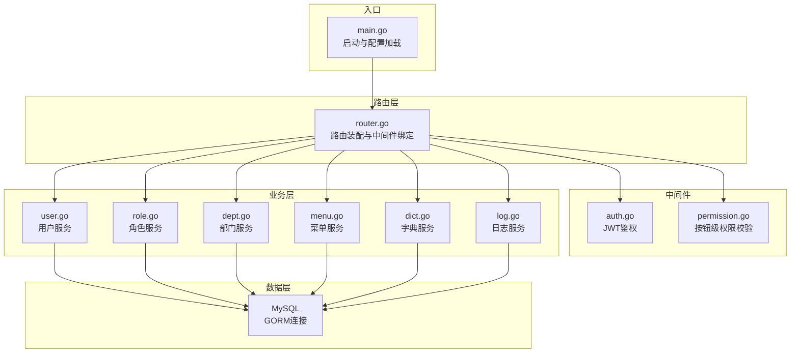
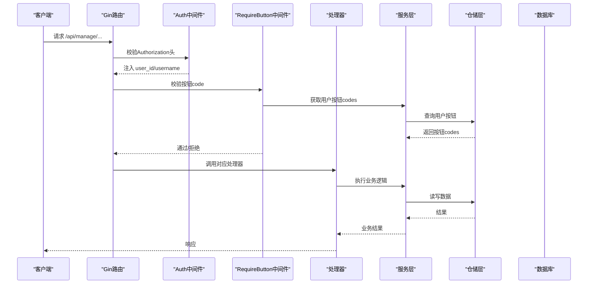
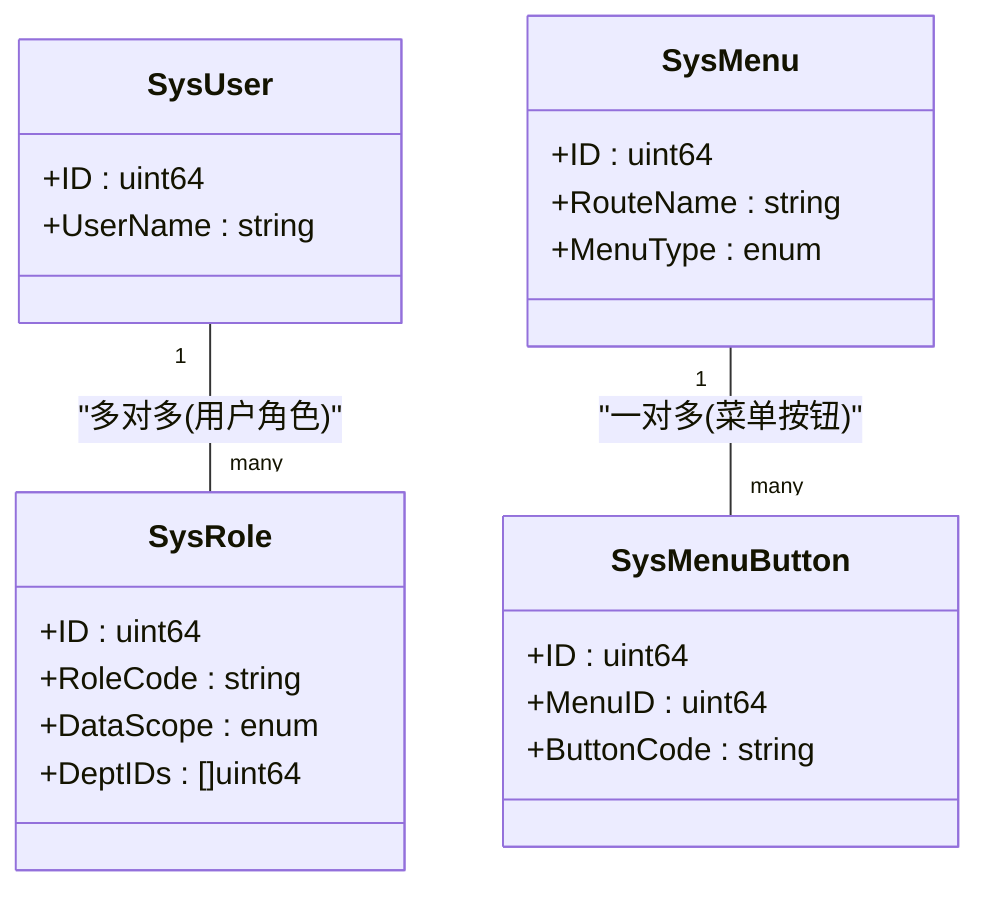
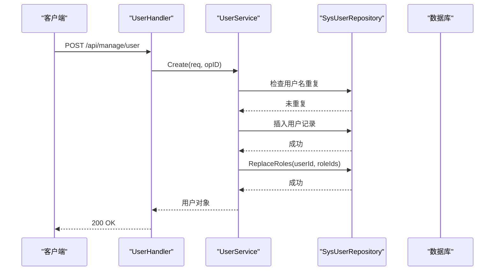
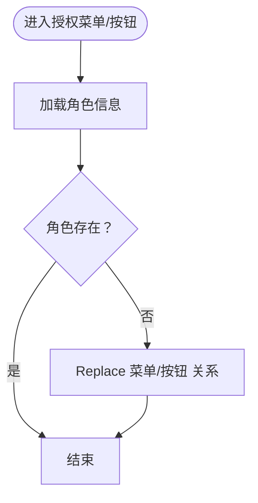
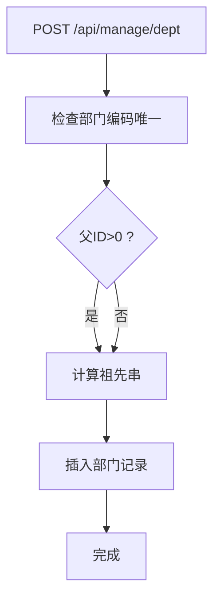
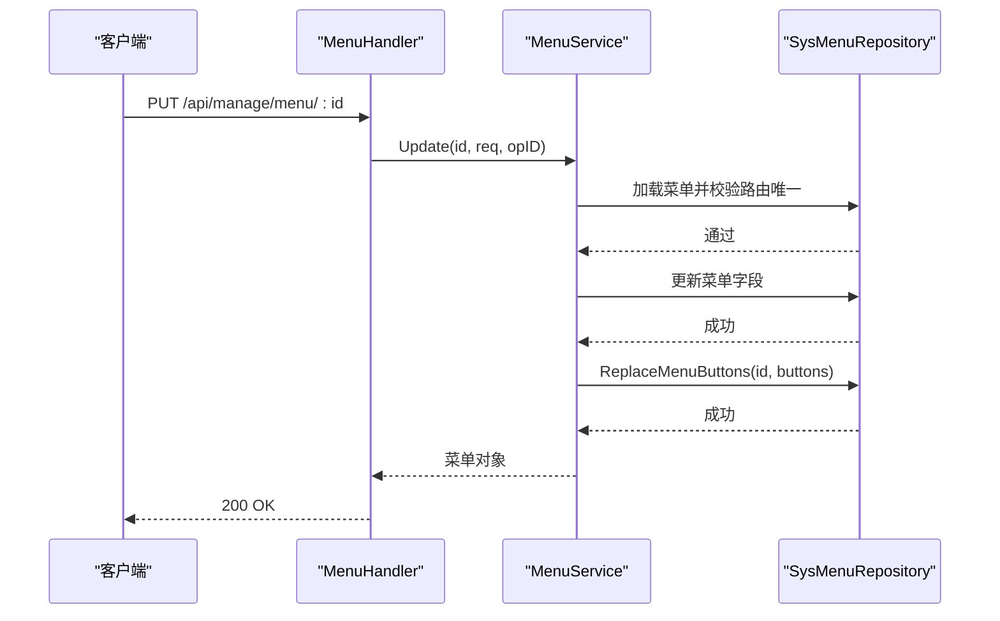
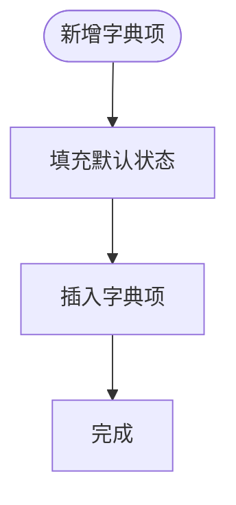
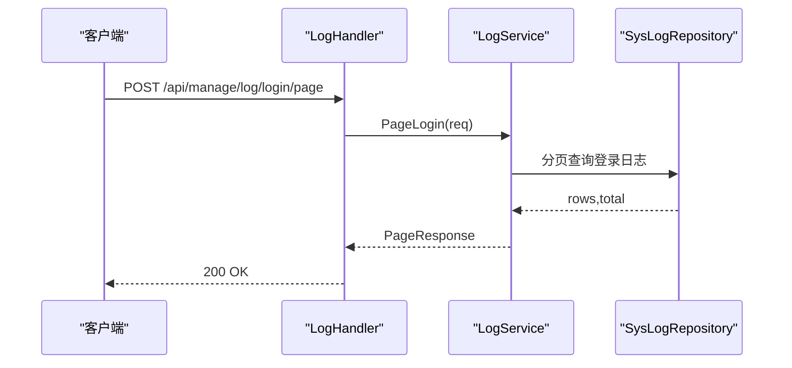
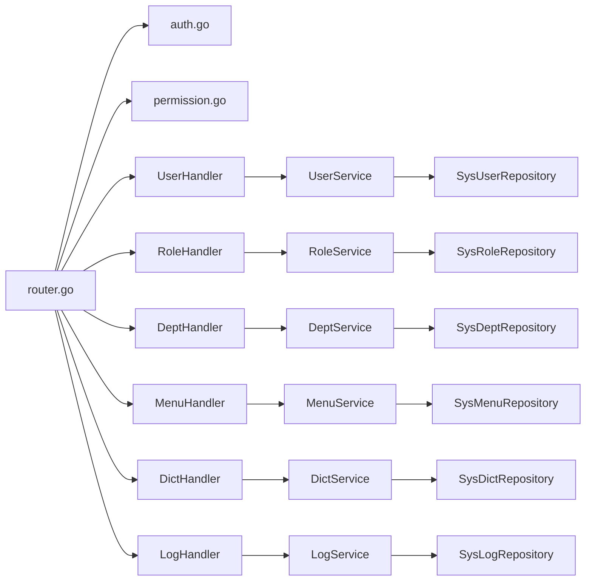

# 系统管理API

<cite>
**本文引用的文件**
- [main.go](file://app/server/cmd/api/main.go)
- [router.go](file://app/server/internal/router/router.go)
- [auth.go](file://app/server/internal/middleware/auth.go)
- [permission.go](file://app/server/internal/middleware/permission.go)
- [user.go](file://app/server/internal/dto/user.go)
- [role.go](file://app/server/internal/dto/role.go)
- [dept.go](file://app/server/internal/dto/dept.go)
- [menu.go](file://app/server/internal/dto/menu.go)
- [dict.go](file://app/server/internal/dto/dict.go)
- [log.go](file://app/server/internal/dto/log.go)
- [user.go](file://app/server/internal/service/user.go)
- [role.go](file://app/server/internal/service/role.go)
- [dept.go](file://app/server/internal/service/dept.go)
- [menu.go](file://app/server/internal/service/menu.go)
- [dict.go](file://app/server/internal/service/dict.go)
- [log.go](file://app/server/internal/service/log.go)
</cite>

## 目录
1. [简介](#简介)
2. [项目结构](#项目结构)
3. [核心组件](#核心组件)
4. [架构总览](#架构总览)
5. [详细组件分析](#详细组件分析)
6. [依赖分析](#依赖分析)
7. [性能考虑](#性能考虑)
8. [故障排查指南](#故障排查指南)
9. [结论](#结论)
10. [附录](#附录)

## 简介
本文件面向boread项目的系统管理API，覆盖用户管理、角色权限、部门管理、菜单配置、字典管理、系统日志等后台管理能力。文档重点阐述RBAC权限模型实现、数据权限控制、操作审计日志与系统配置管理，并提供完整的CRUD与批量处理接口说明、权限分配流程、系统架构设计、数据一致性保障与安全防护策略，以及管理员操作指南与API集成示例。

## 项目结构
后端采用Go语言与Gin框架，按“Handler-Service-Repository-Model”分层组织；数据库使用GORM；路由在统一入口装配，管理类接口置于“/api/manage”路径组，并通过中间件实现鉴权与按钮级权限控制。

图表来源
- [main.go:30-84](file://app/server/cmd/api/main.go#L30-L84)
- [router.go:20-205](file://app/server/internal/router/router.go#L20-L205)
- [auth.go:12-40](file://app/server/internal/middleware/auth.go#L12-L40)
- [permission.go:10-52](file://app/server/internal/middleware/permission.go#L10-L52)

章节来源
- [main.go:30-84](file://app/server/cmd/api/main.go#L30-L84)
- [router.go:20-205](file://app/server/internal/router/router.go#L20-L205)

## 核心组件
- 路由与中间件：统一装配管理接口，登录态与按钮级权限中间件贯穿所有受保护接口。
- DTO层：定义各模块请求/响应结构体，确保前后端契约一致。
- Service层：封装业务规则、事务边界与数据权限控制。
- 数据库：GORM驱动MySQL，提供基础CRUD与复杂查询。

章节来源
- [router.go:78-201](file://app/server/internal/router/router.go#L78-L201)
- [auth.go:12-40](file://app/server/internal/middleware/auth.go#L12-L40)
- [permission.go:10-52](file://app/server/internal/middleware/permission.go#L10-L52)

## 架构总览
系统采用“路由-中间件-处理器-服务-仓储-模型”的清晰分层，管理接口遵循以下设计原则：
- 所有写操作均受按钮级权限保护；
- 只读接口仅需登录态；
- /api/auth/*不参与管理模块的按钮鉴权；
- 权限校验基于用户持有的按钮codes集合。

图表来源
- [router.go:94-201](file://app/server/internal/router/router.go#L94-L201)
- [auth.go:12-40](file://app/server/internal/middleware/auth.go#L12-L40)
- [permission.go:10-52](file://app/server/internal/middleware/permission.go#L10-L52)

## 详细组件分析

### RBAC权限模型与数据权限
- 角色维度：角色具备数据范围（全部、本部门、本部门及子部门、指定部门、自定义）与授权菜单/按钮集合。
- 用户维度：用户可绑定多个角色，按钮权限为角色按钮权限的并集。
- 数据权限：通过角色的数据范围与部门层级计算，结合仓储查询条件实现数据可见性控制（具体实现位于仓储层与服务层组合处）。

图表来源
- [role.go:5-14](file://app/server/internal/dto/role.go#L5-L14)
- [menu.go:29-34](file://app/server/internal/dto/menu.go#L29-L34)

章节来源
- [role.go:5-14](file://app/server/internal/dto/role.go#L5-L14)
- [menu.go:29-34](file://app/server/internal/dto/menu.go#L29-L34)

### 用户管理API
- 接口概览
  - GET /api/manage/user/:id
  - POST /api/manage/user/page
  - POST /api/manage/user
  - PUT /api/manage/user/:id
  - DELETE /api/manage/user/:id
  - PUT /api/manage/user/:id/reset-password
- 关键点
  - 创建/更新时支持批量角色替换；
  - 密码加密存储；
  - 分页查询时批量补全角色编码用于输出。

图表来源
- [router.go:117-124](file://app/server/internal/router/router.go#L117-L124)
- [user.go:27-69](file://app/server/internal/service/user.go#L27-L69)

章节来源
- [router.go:117-124](file://app/server/internal/router/router.go#L117-L124)
- [user.go:27-69](file://app/server/internal/service/user.go#L27-L69)
- [user.go:19-29](file://app/server/internal/dto/user.go#L19-L29)

### 角色管理API
- 接口概览
  - GET /api/manage/role/all
  - GET /api/manage/role/:id
  - POST /api/manage/role/page
  - GET /api/manage/role/:id/menus
  - GET /api/manage/role/:id/buttons
  - POST /api/manage/role
  - PUT /api/manage/role/:id
  - DELETE /api/manage/role/:id
  - PUT /api/manage/role/:id/menus
  - PUT /api/manage/role/:id/buttons
- 关键点
  - 支持数据范围与自定义部门授权；
  - 授权菜单/按钮采用“替换式”批量更新；
  - 系统内置角色不可删除/不可修改路由名。

图表来源
- [router.go:105-116](file://app/server/internal/router/router.go#L105-L116)
- [role.go:129-143](file://app/server/internal/service/role.go#L129-L143)

章节来源
- [router.go:105-116](file://app/server/internal/router/router.go#L105-L116)
- [role.go:129-143](file://app/server/internal/service/role.go#L129-L143)
- [role.go:5-14](file://app/server/internal/dto/role.go#L5-L14)

### 部门管理API
- 接口概览
  - GET /api/manage/dept/tree
  - GET /api/manage/dept/:id
  - POST /api/manage/dept/page
  - POST /api/manage/dept
  - PUT /api/manage/dept/:id
  - DELETE /api/manage/dept/:id
- 关键点
  - 树形结构支持层级查询与父子关系重算；
  - 删除前检查是否存在子部门与用户；
  - 分页以顶级部门为单位，再展开子部门树。

图表来源
- [router.go:97-104](file://app/server/internal/router/router.go#L97-L104)
- [dept.go:31-66](file://app/server/internal/service/dept.go#L31-L66)

章节来源
- [router.go:97-104](file://app/server/internal/router/router.go#L97-L104)
- [dept.go:31-66](file://app/server/internal/service/dept.go#L31-L66)
- [dept.go:5-13](file://app/server/internal/dto/dept.go#L5-L13)

### 菜单配置API
- 接口概览
  - GET /api/manage/menu/tree
  - GET /api/manage/menu/:id
  - POST /api/manage/menu/page
  - POST /api/manage/menu
  - PUT /api/manage/menu/:id
  - DELETE /api/manage/menu/:id
  - GET /api/manage/menu/buttons/:menuId
  - POST /api/manage/menu/button
  - DELETE /api/manage/menu/button/:id
- 关键点
  - 菜单树构建包含按钮集合；
  - 路由名唯一且系统内置菜单不可修改路由名；
  - 支持菜单按钮的增删改与批量替换。

图表来源
- [router.go:125-135](file://app/server/internal/router/router.go#L125-L135)
- [menu.go:82-143](file://app/server/internal/service/menu.go#L82-L143)

章节来源
- [router.go:125-135](file://app/server/internal/router/router.go#L125-L135)
- [menu.go:82-143](file://app/server/internal/service/menu.go#L82-L143)
- [menu.go:5-27](file://app/server/internal/dto/menu.go#L5-L27)

### 字典管理API
- 接口概览
  - GET /api/manage/dict/:id
  - POST /api/manage/dict/page
  - POST /api/manage/dict
  - PUT /api/manage/dict/:id
  - DELETE /api/manage/dict/:id
  - GET /api/manage/dict/items/:dictId
  - GET /api/manage/dict/code/:code
  - POST /api/manage/dict/item
  - PUT /api/manage/dict/item/:id
  - DELETE /api/manage/dict/item/:id
- 关键点
  - 字典编码唯一，系统内置字典不可操作；
  - 支持按字典编码快速获取字典项列表；
  - 字典项支持排序与状态管理。

图表来源
- [router.go:136-147](file://app/server/internal/router/router.go#L136-L147)
- [dict.go:103-124](file://app/server/internal/service/dict.go#L103-L124)

章节来源
- [router.go:136-147](file://app/server/internal/router/router.go#L136-L147)
- [dict.go:103-124](file://app/server/internal/service/dict.go#L103-L124)
- [dict.go:21-29](file://app/server/internal/dto/dict.go#L21-L29)

### 系统日志API
- 接口概览
  - POST /api/manage/log/login/page
  - POST /api/manage/log/operation/page
- 关键点
  - 登录日志与操作日志分页查询；
  - 支持按时间区间、用户、IP等条件过滤。

图表来源
- [router.go:148-151](file://app/server/internal/router/router.go#L148-L151)
- [log.go:18-25](file://app/server/internal/service/log.go#L18-L25)

章节来源
- [router.go:148-151](file://app/server/internal/router/router.go#L148-L151)
- [log.go:18-25](file://app/server/internal/service/log.go#L18-L25)
- [log.go:5-14](file://app/server/internal/dto/log.go#L5-L14)

## 依赖分析
- 组件耦合
  - 路由层依赖中间件与各处理器；
  - 处理器依赖服务层；
  - 服务层依赖仓储层；
  - 仓储层依赖GORM与数据库。
- 安全与权限
  - JWT中间件负责解析与注入用户上下文；
  - 按钮级中间件基于用户按钮codes进行细粒度授权；
  - 管理接口组统一受保护，公开接口除外。

图表来源
- [router.go:65-77](file://app/server/internal/router/router.go#L65-L77)
- [auth.go:12-40](file://app/server/internal/middleware/auth.go#L12-L40)
- [permission.go:10-52](file://app/server/internal/middleware/permission.go#L10-L52)

章节来源
- [router.go:65-77](file://app/server/internal/router/router.go#L65-L77)

## 性能考虑
- 按钮权限校验当前为“每次请求查DB”，中间件注释提示可在后续引入缓存（如sync.Map/Redis）以降低DB压力，但建议先确认真实性能瓶颈后再优化。
- 部门与菜单树构建采用层级查询与节点映射，限制最大层级避免深层递归导致的性能问题。
- 分页查询优先以顶级节点为起点展开，减少一次性全量查询。

章节来源
- [permission.go:17-19](file://app/server/internal/middleware/permission.go#L17-L19)
- [dept.go:214-248](file://app/server/internal/service/dept.go#L214-L248)
- [menu.go:204-279](file://app/server/internal/service/menu.go#L204-L279)

## 故障排查指南
- 认证失败
  - 现象：返回授权头缺失或令牌无效错误。
  - 排查：确认请求头格式为“Bearer {token}”，令牌未过期。
- 权限不足
  - 现象：返回按钮code权限拒绝。
  - 排查：确认用户所属角色是否已授权相应按钮code。
- 业务约束错误
  - 用户名/部门编码/字典编码重复：检查唯一性约束。
  - 存在子部门/用户：删除前清理关联数据。
  - 系统内置资源：不可删除/不可修改关键字段。
- 日志查询异常
  - 现象：分页查询无结果或字段不匹配。
  - 排查：确认查询参数（时间区间、状态、关键字）是否正确。

章节来源
- [auth.go:16-34](file://app/server/internal/middleware/auth.go#L16-L34)
- [permission.go:22-51](file://app/server/internal/middleware/permission.go#L22-L51)
- [user.go:28-30](file://app/server/internal/service/user.go#L28-L30)
- [dept.go:114-126](file://app/server/internal/service/dept.go#L114-L126)
- [dict.go:77-86](file://app/server/internal/service/dict.go#L77-L86)

## 结论
boread系统管理API以清晰的分层架构与严格的中间件控制实现了完善的RBAC权限体系与数据权限边界。通过树形结构的菜单与部门管理、灵活的字典与日志查询、以及细粒度的按钮级授权，满足后台管理的多样化需求。建议在高并发场景下对按钮权限校验引入缓存优化，并持续完善审计与监控能力。

## 附录

### 管理员操作指南
- 登录与获取菜单
  - 使用登录接口获取令牌；
  - 调用获取用户信息与菜单接口，确认权限范围。
- 用户与角色
  - 先创建角色并授权菜单/按钮；
  - 再创建用户并分配角色，重置密码后即可登录。
- 部门与菜单
  - 先维护部门树，再配置菜单与按钮；
  - 注意路由名唯一性与系统内置菜单限制。
- 字典与日志
  - 按需创建字典与字典项，支持按编码快速取数；
  - 定期查看登录与操作日志，定位问题与审计行为。

章节来源
- [router.go:80-91](file://app/server/internal/router/router.go#L80-L91)
- [router.go:105-116](file://app/server/internal/router/router.go#L105-L116)
- [router.go:125-135](file://app/server/internal/router/router.go#L125-L135)
- [router.go:136-147](file://app/server/internal/router/router.go#L136-L147)
- [router.go:148-151](file://app/server/internal/router/router.go#L148-L151)