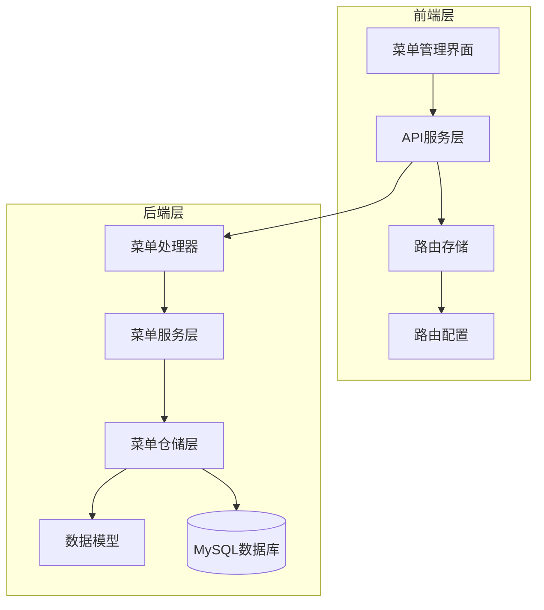
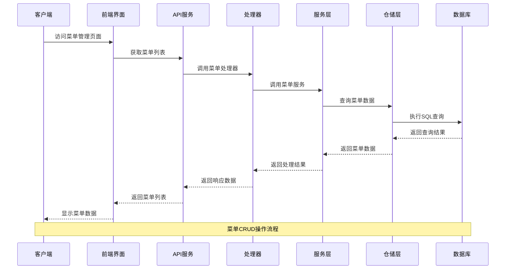
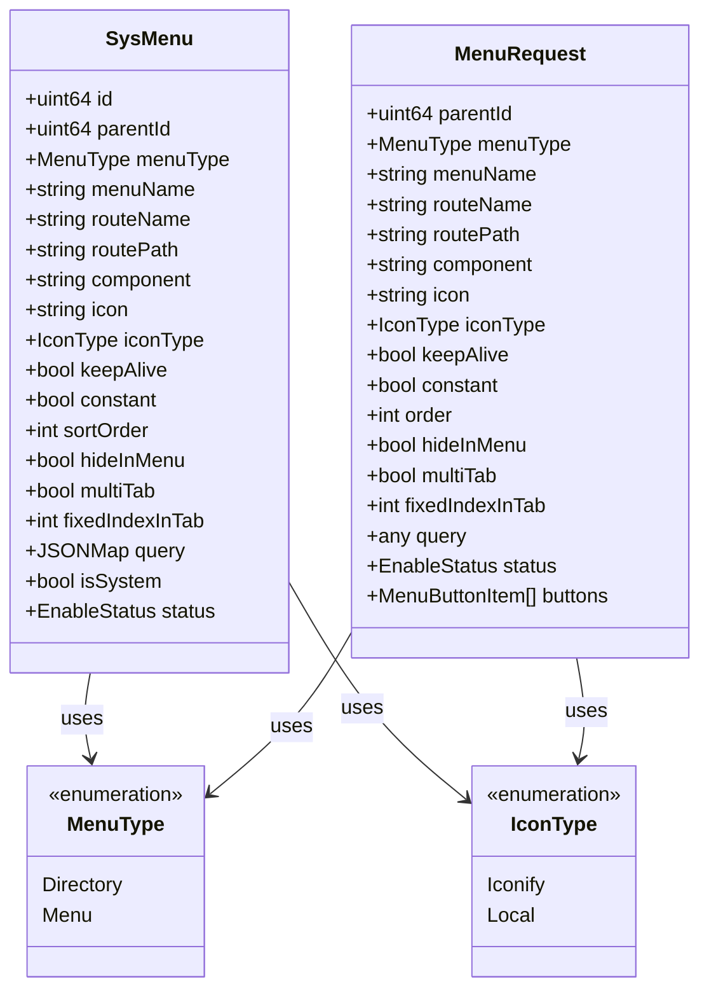
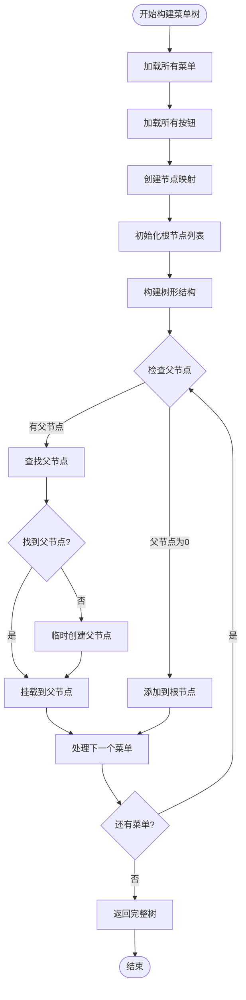
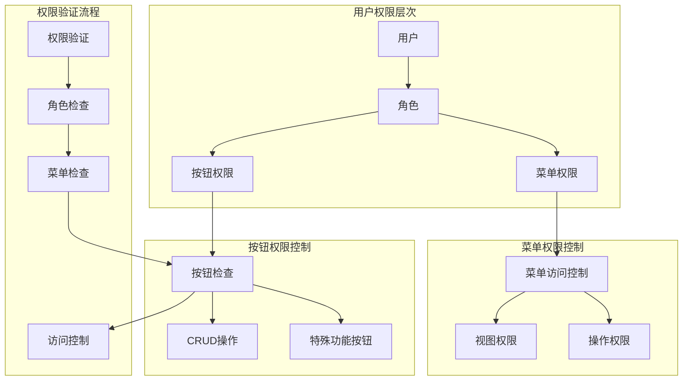
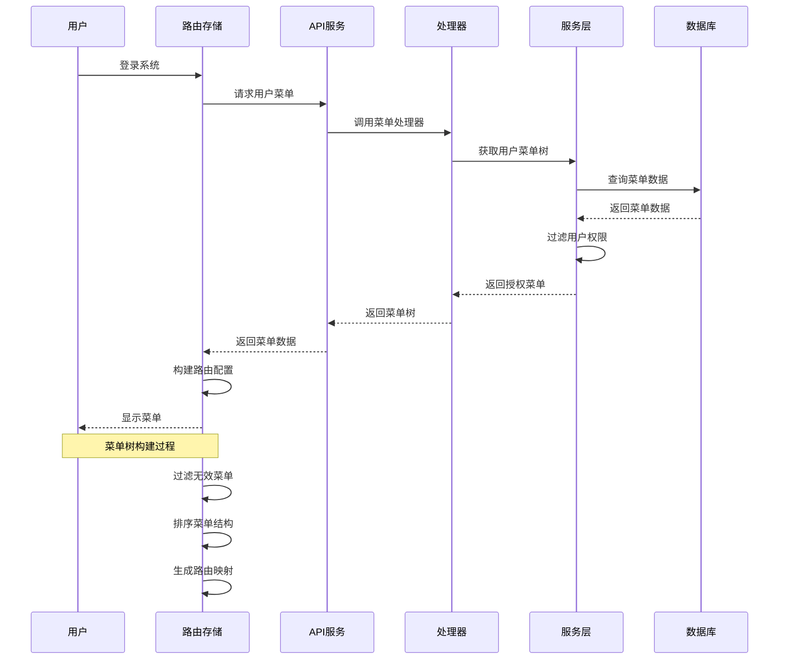
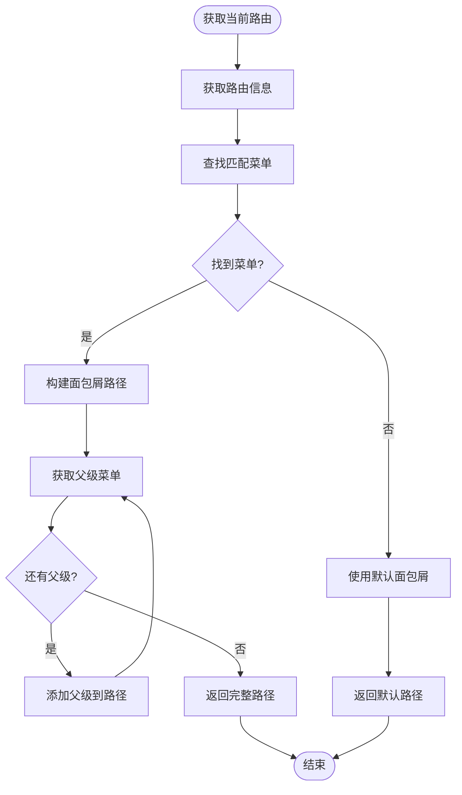
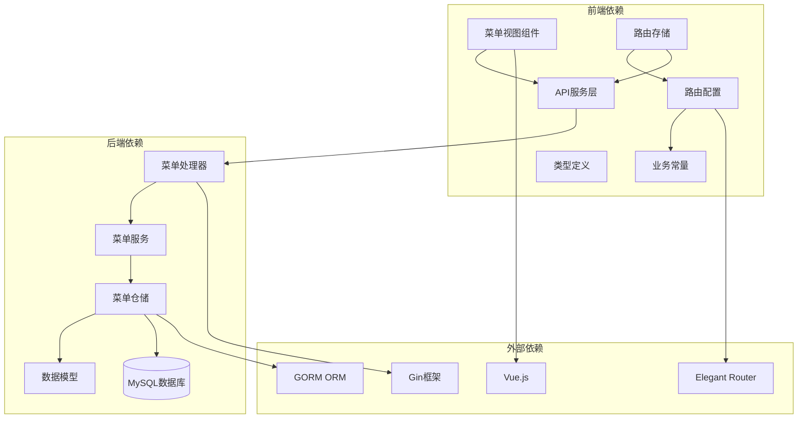

# 菜单管理API

<cite>
**本文档引用的文件**
- [menu.go](file://app/server/internal/dto/menu.go)
- [menu.go](file://app/server/internal/handler/v1/menu.go)
- [sys_menu.go](file://app/server/internal/model/sys_menu.go)
- [menu.go](file://app/server/internal/service/menu.go)
- [sys_menu.go](file://app/server/internal/repository/sys_menu.go)
- [system-manage.sql](file://app/sql/system-manage.sql)
- [index.ts](file://app/web/src/views/admin/system/menu/index.vue)
- [menu-operate-modal.vue](file://app/web/src/views/admin/system/menu/modules/menu-operate-modal.vue)
- [system-manage.ts](file://app/web/src/service/api/system-manage.ts)
- [index.ts](file://app/web/src/store/modules/route/index.ts)
- [routes.ts](file://app/web/src/router/elegant/routes.ts)
- [shared.ts](file://app/web/src/views/admin/system/menu/modules/shared.ts)
- [business.ts](file://app/web/src/constants/business.ts)
- [system-manage.d.ts](file://app/web/src/typings/api/system-manage.d.ts)
</cite>

## 目录
1. [简介](#简介)
2. [项目结构](#项目结构)
3. [核心组件](#核心组件)
4. [架构概览](#架构概览)
5. [详细组件分析](#详细组件分析)
6. [依赖分析](#依赖分析)
7. [性能考虑](#性能考虑)
8. [故障排除指南](#故障排除指南)
9. [结论](#结论)
10. [附录](#附录)

## 简介

菜单管理API是Boread管理系统的核心功能模块，负责管理系统的菜单结构、路由配置和权限控制。该模块实现了完整的菜单生命周期管理，包括创建、编辑、删除、排序、显示隐藏等操作，并提供了动态菜单加载和面包屑导航生成功能。

系统采用前后端分离架构，后端使用Go语言和Gin框架构建RESTful API，前端使用Vue.js和TypeScript开发用户界面。菜单管理功能支持多种菜单类型（目录、菜单、按钮），并集成了权限控制系统。

## 项目结构

菜单管理功能涉及前后端多个层次的组件协作：



**图表来源**
- [index.ts:1-252](file://app/web/src/views/admin/system/menu/index.vue#L1-L252)
- [system-manage.ts:176-270](file://app/web/src/service/api/system-manage.ts#L176-L270)
- [menu.go:1-248](file://app/server/internal/handler/v1/menu.go#L1-L248)

**章节来源**
- [index.ts:1-252](file://app/web/src/views/admin/system/menu/index.vue#L1-L252)
- [system-manage.ts:176-270](file://app/web/src/service/api/system-manage.ts#L176-L270)
- [menu.go:1-248](file://app/server/internal/handler/v1/menu.go#L1-L248)

## 核心组件

### 后端核心组件

#### 数据传输对象（DTO）
菜单管理API使用专门的数据传输对象来处理请求和响应数据：

- **MenuRequest**: 菜单创建/更新请求对象，包含菜单的基本属性如父级ID、菜单类型、名称、路由配置等
- **MenuSearch**: 菜单分页搜索参数
- **MenuNode**: 菜单节点对象，支持树形结构展示
- **MenuButtonRequest**: 菜单按钮请求对象

#### 数据模型
系统使用GORM ORM框架管理数据持久化：

- **SysMenu**: 菜单实体模型，包含菜单的所有属性
- **MenuType**: 菜单类型枚举（目录、菜单）
- **IconType**: 图标类型枚举（Iconify、本地图标）

#### 服务层
菜单服务层提供业务逻辑处理：

- **Tree方法**: 构建完整的菜单树结构
- **Page方法**: 实现分页查询功能
- **Create/Update/Delete**: 菜单的CRUD操作
- **按钮管理**: 支持菜单按钮的增删改查

**章节来源**
- [menu.go:1-56](file://app/server/internal/dto/menu.go#L1-L56)
- [sys_menu.go:1-45](file://app/server/internal/model/sys_menu.go#L1-L45)
- [menu.go:1-304](file://app/server/internal/service/menu.go#L1-L304)

### 前端核心组件

#### 菜单管理界面
前端提供了完整的菜单管理界面，包括：

- **菜单列表**: 支持分页、搜索、批量操作
- **菜单操作模态框**: 提供菜单创建、编辑、删除功能
- **按钮管理**: 支持菜单按钮的增删改查

#### API服务层
封装了所有菜单相关的API调用：

- **菜单列表获取**: 支持分页查询
- **菜单树获取**: 获取完整的菜单树结构
- **菜单CRUD操作**: 创建、更新、删除菜单
- **按钮管理**: 菜单按钮的增删改查

**章节来源**
- [index.ts:1-252](file://app/web/src/views/admin/system/menu/index.vue#L1-L252)
- [menu-operate-modal.vue:1-441](file://app/web/src/views/admin/system/menu/modules/menu-operate-modal.vue#L1-L441)
- [system-manage.ts:176-270](file://app/web/src/service/api/system-manage.ts#L176-L270)

## 架构概览

菜单管理API采用经典的三层架构设计，确保了良好的代码组织和职责分离：



**图表来源**
- [menu.go:29-73](file://app/server/internal/handler/v1/menu.go#L29-L73)
- [menu.go:26-80](file://app/server/internal/service/menu.go#L26-L80)
- [sys_menu.go:48-52](file://app/server/internal/repository/sys_menu.go#L48-L52)

**章节来源**
- [menu.go:1-248](file://app/server/internal/handler/v1/menu.go#L1-L248)
- [menu.go:1-304](file://app/server/internal/service/menu.go#L1-L304)
- [sys_menu.go:1-166](file://app/server/internal/repository/sys_menu.go#L1-L166)

## 详细组件分析

### 菜单类型管理

系统支持三种主要的菜单类型，每种类型都有特定的用途和配置选项：



**图表来源**
- [sys_menu.go:19-42](file://app/server/internal/model/sys_menu.go#L19-L42)
- [menu.go:5-27](file://app/server/internal/dto/menu.go#L5-L27)

#### 目录类型（MenuTypeDir）
目录类型用于创建菜单分组，不直接对应具体的页面路由。目录类型的特点包括：

- **路由配置**: 目录本身不包含路由路径
- **显示控制**: 可以设置是否在菜单中显示
- **层级作用**: 用于组织和分组其他菜单项
- **权限继承**: 子菜单通常继承父目录的权限设置

#### 菜单类型（MenuTypeMenu）
菜单类型对应具体的页面路由，具有完整的路由配置：

- **路由名称**: 唯一标识路由的字符串
- **路由路径**: 页面的实际访问路径
- **组件配置**: 指定页面组件的布局和视图
- **页面属性**: 支持多标签页、缓存、国际化等配置

**章节来源**
- [sys_menu.go:3-17](file://app/server/internal/model/sys_menu.go#L3-L17)
- [menu.go:5-27](file://app/server/internal/dto/menu.go#L5-L27)

### 菜单树形结构管理

系统实现了高效的菜单树形结构管理，支持多级嵌套和动态加载：



**图表来源**
- [menu.go:165-202](file://app/server/internal/service/menu.go#L165-L202)

#### 树形结构特点
- **层级深度**: 支持最多10级菜单嵌套
- **排序机制**: 按照sort_order字段进行排序
- **父子关系**: 通过parent_id字段维护父子关系
- **按钮集成**: 每个菜单节点可以关联多个按钮

#### 性能优化
- **单次查询**: 通过一次查询获取所有菜单和按钮数据
- **内存映射**: 使用哈希表快速定位节点
- **延迟加载**: 子菜单按需加载，减少内存占用

**章节来源**
- [menu.go:165-202](file://app/server/internal/service/menu.go#L165-L202)
- [sys_menu.go:48-52](file://app/server/internal/repository/sys_menu.go#L48-L52)

### 权限控制机制

系统实现了基于RBAC（基于角色的访问控制）的权限管理体系：



**图表来源**
- [system-manage.sql:203-228](file://app/sql/system-manage.sql#L203-L228)

#### 菜单权限验证
- **路由名称验证**: 确保菜单对应的路由存在
- **系统内置保护**: 防止修改系统内置菜单
- **父子关系检查**: 确保菜单层级关系有效
- **状态控制**: 支持启用/禁用菜单

#### 按钮权限管理
- **按钮编码**: 每个按钮都有唯一的编码标识
- **权限绑定**: 按钮权限与角色关联
- **动态控制**: 支持运行时权限变更

**章节来源**
- [menu.go:12-16](file://app/server/internal/service/menu.go#L12-L16)
- [system-manage.sql:184-200](file://app/sql/system-manage.sql#L184-L200)

### 动态菜单加载

系统支持动态菜单加载，根据用户权限实时生成菜单树：



**图表来源**
- [index.ts:240-262](file://app/web/src/store/modules/route/index.ts#L240-L262)

#### 动态加载优势
- **权限安全**: 仅显示用户有权访问的菜单
- **性能优化**: 按需加载，减少初始负载
- **实时更新**: 权限变更后立即生效
- **个性化**: 不同角色显示不同的菜单结构

#### 菜单过滤机制
- **角色过滤**: 根据用户角色过滤菜单
- **状态过滤**: 仅显示启用状态的菜单
- **权限验证**: 确保菜单路由存在且有效
- **层级控制**: 控制菜单显示层级

**章节来源**
- [index.ts:240-262](file://app/web/src/store/modules/route/index.ts#L240-L262)
- [system-manage.ts:187-193](file://app/web/src/service/api/system-manage.ts#L187-L193)

### 面包屑导航生成

系统自动根据当前路由生成面包屑导航：



**图表来源**
- [index.ts:157-158](file://app/web/src/store/modules/route/index.ts#L157-L158)

#### 面包屑生成规则
- **路由匹配**: 根据当前路由名称查找对应菜单
- **层级遍历**: 递归查找父级菜单构建完整路径
- **国际化支持**: 支持多语言菜单标题显示
- **动态更新**: 路由变化时自动更新面包屑

**章节来源**
- [index.ts:157-158](file://app/web/src/store/modules/route/index.ts#L157-L158)

## 依赖分析

菜单管理API的依赖关系体现了清晰的分层架构：



**图表来源**
- [menu.go:1-13](file://app/server/internal/handler/v1/menu.go#L1-L13)
- [index.ts:1-13](file://app/web/src/views/admin/system/menu/index.vue#L1-L13)

### 前端依赖关系
- **组件依赖**: 视图组件依赖API服务和路由存储
- **类型依赖**: TypeScript类型定义提供编译时检查
- **常量依赖**: 业务常量提供统一的配置管理
- **路由依赖**: Elegant Router提供路由配置和转换

### 后端依赖关系
- **框架依赖**: Gin提供HTTP请求处理能力
- **ORM依赖**: GORM简化数据库操作
- **模型依赖**: 数据模型定义数据库结构
- **仓储依赖**: 仓储层抽象数据库访问

**章节来源**
- [menu.go:1-13](file://app/server/internal/handler/v1/menu.go#L1-L13)
- [index.ts:1-13](file://app/web/src/views/admin/system/menu/index.vue#L1-L13)

## 性能考虑

### 数据库优化
- **索引设计**: 菜单表使用复合索引优化查询性能
- **查询优化**: 采用一次性查询获取菜单和按钮数据
- **连接池**: 使用连接池管理数据库连接
- **事务处理**: 按钮批量更新使用事务保证数据一致性

### 缓存策略
- **内存缓存**: 菜单树结构在内存中缓存
- **路由缓存**: 已生成的路由配置进行缓存
- **权限缓存**: 用户权限信息进行短期缓存

### 前端性能优化
- **虚拟滚动**: 大列表使用虚拟滚动提升渲染性能
- **懒加载**: 菜单图标和组件按需加载
- **防抖处理**: 搜索和筛选操作使用防抖优化
- **组件复用**: 通过组件复用减少DOM节点

## 故障排除指南

### 常见问题及解决方案

#### 菜单路由冲突
**问题描述**: 新增菜单时提示路由名称已存在
**解决方法**: 
1. 检查现有菜单的routeName是否重复
2. 修改菜单名称或路由配置
3. 确保路由名称的唯一性

#### 菜单删除失败
**问题描述**: 删除菜单时报错提示存在子菜单
**解决方法**:
1. 先删除所有子菜单
2. 或者调整菜单层级关系
3. 确保菜单树结构的完整性

#### 权限验证失败
**问题描述**: 用户无法访问某些菜单
**解决方法**:
1. 检查用户角色配置
2. 验证菜单权限设置
3. 确认按钮权限绑定

**章节来源**
- [menu.go:236-247](file://app/server/internal/handler/v1/menu.go#L236-L247)
- [menu.go:12-16](file://app/server/internal/service/menu.go#L12-L16)

### 错误码说明

| 错误码 | 错误类型 | 描述 |
|--------|----------|------|
| 3001 | 路由已存在 | 菜单路由名称重复 |
| 3002 | 系统内置 | 试图修改系统内置菜单 |
| 3003 | 存在子菜单 | 菜单仍有子级无法删除 |

**章节来源**
- [menu.go:236-247](file://app/server/internal/handler/v1/menu.go#L236-L247)

## 结论

菜单管理API提供了完整的菜单生命周期管理功能，具有以下特点：

1. **完整的功能覆盖**: 支持菜单的创建、编辑、删除、排序等所有操作
2. **灵活的权限控制**: 基于RBAC的权限体系，支持细粒度的权限管理
3. **高效的性能表现**: 通过树形结构管理和缓存机制优化性能
4. **良好的用户体验**: 动态菜单加载和面包屑导航提升用户体验
5. **清晰的架构设计**: 分层架构确保代码的可维护性和可扩展性

该系统为Boread管理平台提供了强大的菜单管理能力，能够满足复杂的企业级应用需求。

## 附录

### API使用示例

#### 获取菜单列表
```typescript
// 前端调用示例
const params = {
  current: 1,
  size: 10,
  menuName: null,
  status: null
};

const response = await fetchGetMenuList(params);
```

#### 创建菜单
```typescript
// 前端调用示例
const menuData = {
  parentId: 0,
  menuType: '1',
  menuName: '测试菜单',
  routeName: 'test_menu',
  routePath: '/test/menu',
  icon: 'test-icon',
  iconType: '1',
  status: '1'
};

const response = await fetchCreateMenu(menuData);
```

#### 更新菜单
```typescript
// 前端调用示例
const response = await fetchUpdateMenu(menuId, updatedData);
```

#### 删除菜单
```typescript
// 前端调用示例
const response = await fetchDeleteMenu(menuId);
```

### 数据库表结构

系统使用以下核心表结构：

| 表名 | 描述 | 主要字段 |
|------|------|----------|
| sys_menu | 菜单表 | id, parent_id, menu_type, menu_name, route_name, route_path, icon, icon_type, status |
| sys_menu_button | 菜单按钮表 | id, menu_id, button_code, button_desc |
| sys_role_menu | 角色菜单关联表 | id, role_id, menu_id |
| sys_role_button | 角色按钮关联表 | id, role_id, button_id |

**章节来源**
- [system-manage.sql:149-200](file://app/sql/system-manage.sql#L149-L200)