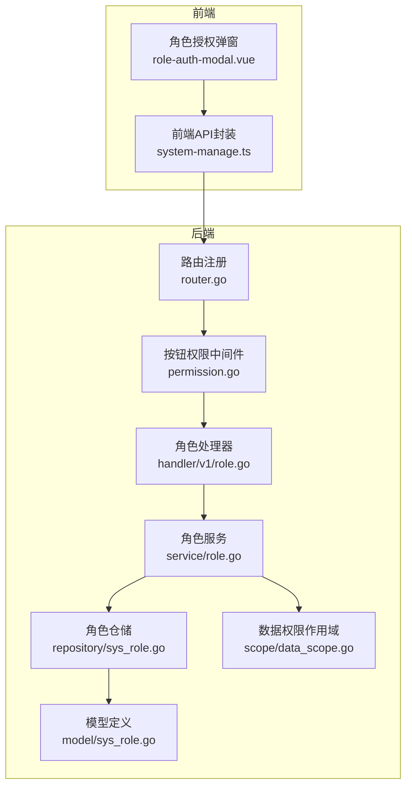
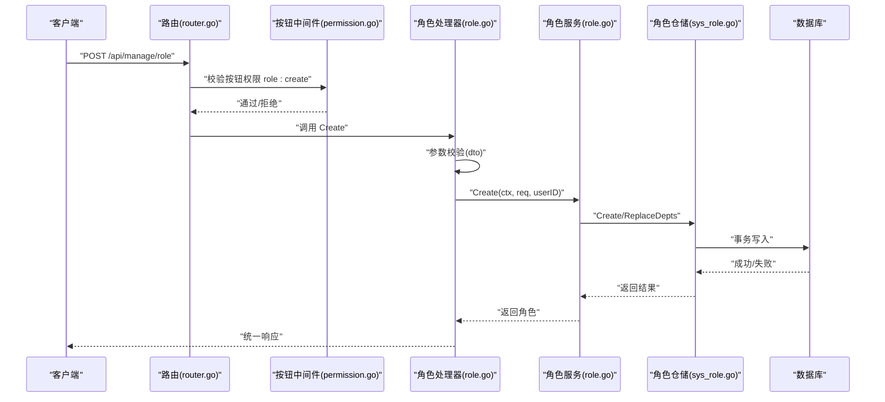
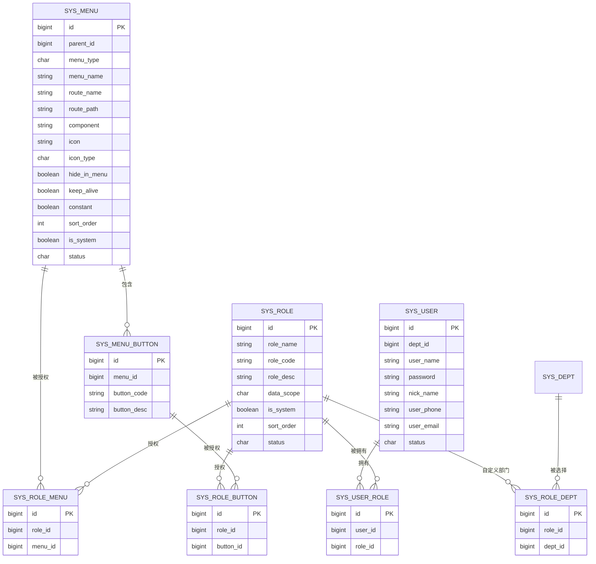
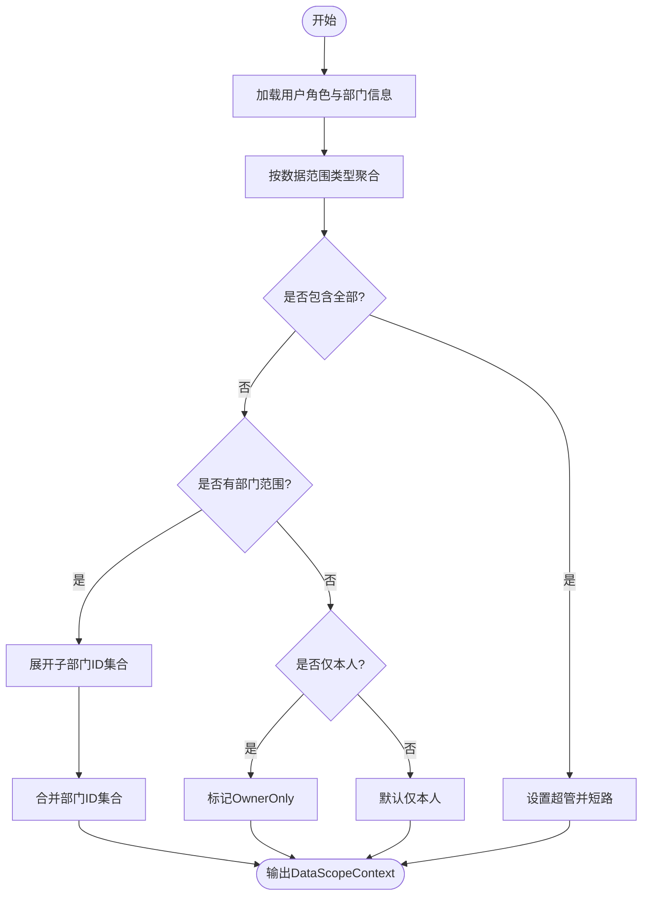
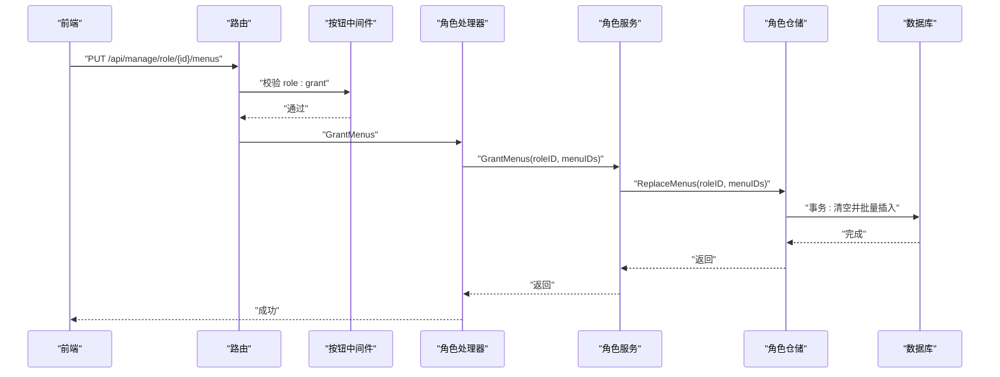
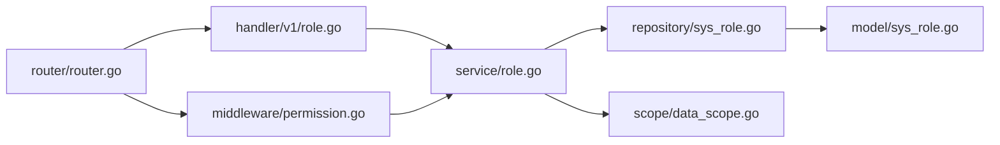

# 角色管理API

<cite>
**本文档引用的文件**
- [role.go](file://app/server/internal/dto/role.go)
- [role.go](file://app/server/internal/handler/v1/role.go)
- [role.go](file://app/server/internal/service/role.go)
- [sys_role.go](file://app/server/internal/model/sys_role.go)
- [sys_menu.go](file://app/server/internal/model/sys_menu.go)
- [sys_button.go](file://app/server/internal/model/sys_button.go)
- [sys_user.go](file://app/server/internal/model/sys_user.go)
- [sys_role.go](file://app/server/internal/repository/sys_role.go)
- [data_scope.go](file://app/server/internal/scope/data_scope.go)
- [router.go](file://app/server/internal/router/router.go)
- [permission.go](file://app/server/internal/middleware/permission.go)
- [system-manage.ts](file://app/web/src/service/api/system-manage.ts)
- [role-auth-modal.vue](file://app/web/src/views/admin/system/role/modules/role-auth-modal.vue)
- [system-manage.d.ts](file://app/web/src/typings/api/system-manage.d.ts)
</cite>

## 目录
1. [简介](#简介)
2. [项目结构](#项目结构)
3. [核心组件](#核心组件)
4. [架构总览](#架构总览)
5. [详细组件分析](#详细组件分析)
6. [依赖关系分析](#依赖关系分析)
7. [性能考量](#性能考量)
8. [故障排查指南](#故障排查指南)
9. [结论](#结论)
10. [附录](#附录)

## 简介
本文件为角色管理API的完整技术文档，覆盖角色的创建、修改、删除、查询等核心功能，并深入解析角色权限分配机制（菜单权限与按钮权限）、数据权限设置（五种数据范围策略）、角色状态管理、角色与用户的关联关系、角色与菜单/按钮的映射关系。同时提供角色授权流程的序列图、数据权限计算的流程图以及前后端交互示例，帮助开发者快速理解并正确使用角色管理能力。

## 项目结构
角色管理模块遵循典型的三层架构：Handler（HTTP接口层）→ Service（业务服务层）→ Repository（数据访问层），配合中间件实现按钮级权限控制与数据权限作用域。

图表来源
- [router.go:105-115](file://app/server/internal/router/router.go#L105-L115)
- [permission.go:10-20](file://app/server/internal/middleware/permission.go#L10-L20)
- [role.go:18-24](file://app/server/internal/handler/v1/role.go#L18-L24)
- [role.go:18-24](file://app/server/internal/service/role.go#L18-L24)
- [sys_role.go:12-18](file://app/server/internal/repository/sys_role.go#L12-L18)
- [sys_role.go:14-26](file://app/server/internal/model/sys_role.go#L14-L26)
- [data_scope.go:11-20](file://app/server/internal/scope/data_scope.go#L11-L20)

章节来源
- [router.go:105-115](file://app/server/internal/router/router.go#L105-L115)
- [permission.go:10-20](file://app/server/internal/middleware/permission.go#L10-L20)
- [role.go:18-24](file://app/server/internal/handler/v1/role.go#L18-L24)
- [role.go:18-24](file://app/server/internal/service/role.go#L18-L24)
- [sys_role.go:12-18](file://app/server/internal/repository/sys_role.go#L12-L18)
- [sys_role.go:14-26](file://app/server/internal/model/sys_role.go#L14-L26)
- [data_scope.go:11-20](file://app/server/internal/scope/data_scope.go#L11-L20)

## 核心组件
- DTO层：定义请求/响应结构，包括角色创建/更新、角色搜索、菜单授权、按钮授权、简要角色列表等。
- Handler层：暴露REST接口，负责参数校验、错误映射与统一响应。
- Service层：实现业务逻辑，包括角色生命周期管理、授权变更、数据权限范围计算入口。
- Repository层：封装数据库操作，支持事务性替换授权关系。
- Model层：定义角色、菜单、按钮、用户及关联表结构。
- Scope层：提供数据权限上下文构建与GORM作用域应用。
- Middleware层：提供按钮级权限中间件，保护写操作。
- Router层：装配路由与中间件，声明各接口的按钮权限码。

章节来源
- [role.go:5-39](file://app/server/internal/dto/role.go#L5-L39)
- [role.go:26-271](file://app/server/internal/handler/v1/role.go#L26-L271)
- [role.go:12-151](file://app/server/internal/service/role.go#L12-L151)
- [sys_role.go:14-36](file://app/server/internal/model/sys_role.go#L14-L36)
- [sys_menu.go:19-42](file://app/server/internal/model/sys_menu.go#L19-L42)
- [sys_button.go:22-40](file://app/server/internal/model/sys_button.go#L22-L40)
- [sys_user.go:27-35](file://app/server/internal/model/sys_user.go#L27-L35)
- [sys_role.go:77-150](file://app/server/internal/repository/sys_role.go#L77-L150)
- [data_scope.go:22-134](file://app/server/internal/scope/data_scope.go#L22-L134)
- [router.go:105-115](file://app/server/internal/router/router.go#L105-L115)
- [permission.go:20-51](file://app/server/internal/middleware/permission.go#L20-L51)

## 架构总览
角色管理API采用“路由 → 中间件 → 处理器 → 服务 → 仓储 → 模型”的标准调用链，写操作通过RequireButton中间件进行按钮级权限校验；读操作仅需登录态，不强制按钮校验。

图表来源
- [router.go:111-111](file://app/server/internal/router/router.go#L111-L111)
- [permission.go:20-51](file://app/server/internal/middleware/permission.go#L20-L51)
- [role.go:96-107](file://app/server/internal/handler/v1/role.go#L96-L107)
- [role.go:26-52](file://app/server/internal/service/role.go#L26-L52)
- [sys_role.go:20-26](file://app/server/internal/repository/sys_role.go#L20-L26)
- [sys_role.go:111-126](file://app/server/internal/repository/sys_role.go#L111-L126)

## 详细组件分析

### 角色核心接口
- 分页查询：POST /api/manage/role/page
- 角色详情：GET /api/manage/role/{id}
- 全量角色（下拉）：GET /api/manage/role/all
- 创建角色：POST /api/manage/role（按钮：role:create）
- 更新角色：PUT /api/manage/role/{id}（按钮：role:update）
- 删除角色：DELETE /api/manage/role/{id}（按钮：role:delete）

章节来源
- [role.go:26-85](file://app/server/internal/handler/v1/role.go#L26-L85)
- [router.go:106-113](file://app/server/internal/router/router.go#L106-L113)
- [system-manage.ts:11-71](file://app/web/src/service/api/system-manage.ts#L11-L71)

### 角色授权接口
- 获取角色菜单IDs：GET /api/manage/role/{id}/menus
- 授权菜单：PUT /api/manage/role/{id}/menus（按钮：role:grant）
- 获取角色按钮IDs：GET /api/manage/role/{id}/buttons
- 授权按钮：PUT /api/manage/role/{id}/buttons（按钮：role:grant）

章节来源
- [role.go:160-258](file://app/server/internal/handler/v1/role.go#L160-L258)
- [router.go:109-115](file://app/server/internal/router/router.go#L109-L115)
- [system-manage.ts:73-108](file://app/web/src/service/api/system-manage.ts#L73-L108)

### 数据模型与关联关系

图表来源
- [sys_role.go:14-36](file://app/server/internal/model/sys_role.go#L14-L36)
- [sys_user.go:27-35](file://app/server/internal/model/sys_user.go#L27-L35)
- [sys_menu.go:19-42](file://app/server/internal/model/sys_menu.go#L19-L42)
- [sys_button.go:22-40](file://app/server/internal/model/sys_button.go#L22-L40)

章节来源
- [sys_role.go:14-36](file://app/server/internal/model/sys_role.go#L14-L36)
- [sys_user.go:27-35](file://app/server/internal/model/sys_user.go#L27-L35)
- [sys_menu.go:19-42](file://app/server/internal/model/sys_menu.go#L19-L42)
- [sys_button.go:22-40](file://app/server/internal/model/sys_button.go#L22-L40)

### 数据权限范围与继承规则
- 数据范围枚举：全部、自定义部门、本部门、本部门及子部门、仅本人。
- 上下文构建：根据用户的所有角色聚合数据范围，支持超管短路、部门范围合并、仅本人兜底。
- 作用域应用：在业务查询中通过ApplyDataScope自动追加WHERE条件，确保数据可见性。

图表来源
- [data_scope.go:22-94](file://app/server/internal/scope/data_scope.go#L22-L94)
- [data_scope.go:115-134](file://app/server/internal/scope/data_scope.go#L115-L134)

章节来源
- [sys_role.go:3-12](file://app/server/internal/model/sys_role.go#L3-L12)
- [data_scope.go:22-94](file://app/server/internal/scope/data_scope.go#L22-L94)
- [data_scope.go:115-134](file://app/server/internal/scope/data_scope.go#L115-L134)

### 角色授权流程（菜单/按钮）

图表来源
- [router.go:114-114](file://app/server/internal/router/router.go#L114-L114)
- [permission.go:20-51](file://app/server/internal/middleware/permission.go#L20-L51)
- [role.go:170-185](file://app/server/internal/handler/v1/role.go#L170-L185)
- [role.go:129-135](file://app/server/internal/service/role.go#L129-L135)
- [sys_role.go:77-92](file://app/server/internal/repository/sys_role.go#L77-L92)

章节来源
- [role.go:160-214](file://app/server/internal/handler/v1/role.go#L160-L214)
- [role.go:129-151](file://app/server/internal/service/role.go#L129-L151)
- [sys_role.go:77-109](file://app/server/internal/repository/sys_role.go#L77-L109)

### 角色与用户关联
- 角色与用户通过sys_user_role建立多对多关系。
- 删除角色前会检查是否存在用户关联，避免破坏完整性。

章节来源
- [sys_user.go:27-35](file://app/server/internal/model/sys_user.go#L27-L35)
- [sys_role.go:144-150](file://app/server/internal/repository/sys_role.go#L144-L150)
- [role.go:88-102](file://app/server/internal/service/role.go#L88-L102)

### 角色状态管理与系统内置角色
- 支持启用/禁用状态；系统内置角色不可修改编码且不可删除。
- 创建/更新时若未指定状态，默认启用。

章节来源
- [sys_role.go:14-26](file://app/server/internal/model/sys_role.go#L14-L26)
- [role.go:26-86](file://app/server/internal/service/role.go#L26-L86)

### 前后端API调用示例
- 获取角色分页列表：POST /manage/role/page
- 创建角色：POST /manage/role（携带dataScope与可选deptIds）
- 授权菜单：PUT /manage/role/{id}/menus（body: { menuIds: [...] }）
- 授权按钮：PUT /manage/role/{id}/buttons（body: { buttonIds: [...] }）
- 获取角色菜单IDs：GET /manage/role/{id}/menus
- 获取角色按钮IDs：GET /manage/role/{id}/buttons

章节来源
- [system-manage.ts:11-108](file://app/web/src/service/api/system-manage.ts#L11-L108)
- [system-manage.d.ts:24-46](file://app/web/src/typings/api/system-manage.d.ts#L24-L46)
- [system-manage.d.ts:191-208](file://app/web/src/typings/api/system-manage.d.ts#L191-L208)

### 前端授权界面集成
- 角色授权弹窗通过获取菜单树与当前角色的菜单/按钮授权ID，构建勾选项并提交授权请求。
- 支持树形展开、全选/反选、按钮级授权。

章节来源
- [role-auth-modal.vue:142-167](file://app/web/src/views/admin/system/role/modules/role-auth-modal.vue#L142-L167)
- [system-manage.ts:188-202](file://app/web/src/service/api/system-manage.ts#L188-L202)

## 依赖关系分析
- Handler依赖Service；Service依赖Repository；Repository依赖Model与GORM。
- 路由层通过RequireButton中间件为写操作注入按钮级鉴权。
- 数据权限通过Scope层在Service层构建上下文，在Repository层应用到具体查询。

图表来源
- [role.go:18-24](file://app/server/internal/handler/v1/role.go#L18-L24)
- [role.go:18-24](file://app/server/internal/service/role.go#L18-L24)
- [sys_role.go:12-18](file://app/server/internal/repository/sys_role.go#L12-L18)
- [sys_role.go:14-26](file://app/server/internal/model/sys_role.go#L14-L26)
- [data_scope.go:11-20](file://app/server/internal/scope/data_scope.go#L11-L20)
- [router.go:105-115](file://app/server/internal/router/router.go#L105-L115)
- [permission.go:20-51](file://app/server/internal/middleware/permission.go#L20-L51)

章节来源
- [router.go:105-115](file://app/server/internal/router/router.go#L105-L115)
- [permission.go:20-51](file://app/server/internal/middleware/permission.go#L20-L51)
- [role.go:18-24](file://app/server/internal/handler/v1/role.go#L18-L24)
- [role.go:18-24](file://app/server/internal/service/role.go#L18-L24)
- [sys_role.go:12-18](file://app/server/internal/repository/sys_role.go#L12-L18)
- [sys_role.go:14-26](file://app/server/internal/model/sys_role.go#L14-L26)
- [data_scope.go:11-20](file://app/server/internal/scope/data_scope.go#L11-L20)

## 性能考量
- 按钮级权限中间件当前每次请求均查询用户按钮集合，建议在高并发场景引入缓存（如sync.Map或Redis）以降低DB压力。
- 数据权限上下文构建涉及多角色聚合与子部门展开，建议对部门树查询结果进行缓存或分页处理。
- 批量授权接口（菜单/按钮）使用事务批量写入，避免部分失败导致的状态不一致。

## 故障排查指南
- 参数校验失败：Handler对JSON参数进行绑定校验，错误码1001；检查请求体格式与字段长度约束。
- 角色编码重复：服务层检测到重复编码返回3001；请更换唯一roleCode。
- 系统内置角色：尝试修改系统内置角色编码或删除内置角色返回3002；内置角色不可更改或删除。
- 角色仍有用户：删除角色前需解除用户关联，否则返回3003；请先清理用户角色关系。
- 权限不足：按钮级中间件校验失败返回2005；确认当前用户具备对应按钮权限码。

章节来源
- [role.go:36-46](file://app/server/internal/handler/v1/role.go#L36-L46)
- [role.go:260-271](file://app/server/internal/handler/v1/role.go#L260-L271)
- [role.go:12-16](file://app/server/internal/service/role.go#L12-L16)
- [permission.go:20-51](file://app/server/internal/middleware/permission.go#L20-L51)

## 结论
角色管理API提供了完善的角色生命周期管理与权限体系：基于DTO的标准化请求/响应、基于按钮码的细粒度写操作保护、基于数据范围策略的动态数据权限控制，以及清晰的菜单/按钮授权接口。结合前端授权弹窗，可高效完成角色与权限的配置与维护。

## 附录
- 角色数据范围枚举值：1（全部）、2（自定义部门）、3（本部门）、4（本部门及子部门）、5（仅本人）。
- 按钮权限码：role:create、role:update、role:delete、role:grant。
- 常用接口路径与方法：
  - POST /api/manage/role/page
  - GET /api/manage/role/all
  - GET /api/manage/role/{id}
  - POST /api/manage/role
  - PUT /api/manage/role/{id}
  - DELETE /api/manage/role/{id}
  - GET /api/manage/role/{id}/menus
  - PUT /api/manage/role/{id}/menus
  - GET /api/manage/role/{id}/buttons
  - PUT /api/manage/role/{id}/buttons