# 部门管理API

<cite>
**本文档引用的文件**
- [app/server/internal/handler/v1/dept.go](file://app/server/internal/handler/v1/dept.go)
- [app/server/internal/service/dept.go](file://app/server/internal/service/dept.go)
- [app/server/internal/repository/sys_dept.go](file://app/server/internal/repository/sys_dept.go)
- [app/server/internal/model/sys_dept.go](file://app/server/internal/model/sys_dept.go)
- [app/server/internal/model/sys_user.go](file://app/server/internal/model/sys_user.go)
- [app/server/internal/dto/dept.go](file://app/server/internal/dto/dept.go)
- [app/server/internal/dto/common.go](file://app/server/internal/dto/common.go)
- [app/server/internal/scope/data_scope.go](file://app/server/internal/scope/data_scope.go)
- [app/server/internal/router/router.go](file://app/server/internal/router/router.go)
- [app/web/src/service/api/system-manage.ts](file://app/web/src/service/api/system-manage.ts)
- [app/web/src/typings/api/system-manage.d.ts](file://app/web/src/typings/api/system-manage.d.ts)
</cite>

## 目录
1. [简介](#简介)
2. [项目结构](#项目结构)
3. [核心组件](#核心组件)
4. [架构概览](#架构概览)
5. [详细组件分析](#详细组件分析)
6. [依赖关系分析](#依赖关系分析)
7. [性能考虑](#性能考虑)
8. [故障排除指南](#故障排除指南)
9. [结论](#结论)
10. [附录](#附录)

## 简介
本文档详细介绍了部门管理API的设计与实现，涵盖组织架构树形结构管理、部门层级关系维护、部门成员管理等核心功能。系统采用经典的三层架构设计（Handler-Service-Repository），通过祖先链（ancestors）实现高效的树形结构查询，支持部门的创建、移动、合并、删除等操作，以及部门信息查询、排序调整、状态控制等功能。

## 项目结构
部门管理模块位于Go服务端的内部包结构中，采用清晰的分层架构：

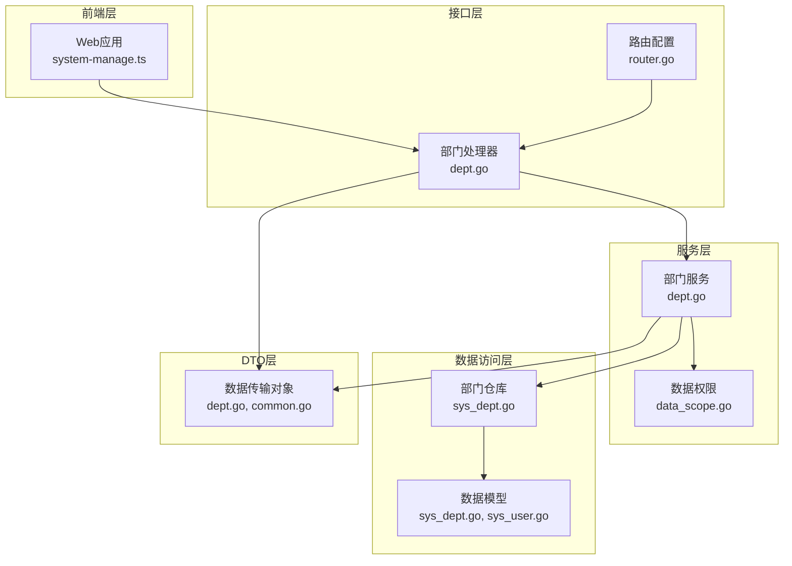

**图表来源**
- [app/server/internal/handler/v1/dept.go:1-187](file://app/server/internal/handler/v1/dept.go#L1-L187)
- [app/server/internal/service/dept.go:1-251](file://app/server/internal/service/dept.go#L1-L251)
- [app/server/internal/repository/sys_dept.go:1-124](file://app/server/internal/repository/sys_dept.go#L1-L124)

**章节来源**
- [app/server/internal/handler/v1/dept.go:1-187](file://app/server/internal/handler/v1/dept.go#L1-L187)
- [app/server/internal/service/dept.go:1-251](file://app/server/internal/service/dept.go#L1-L251)
- [app/server/internal/repository/sys_dept.go:1-124](file://app/server/internal/repository/sys_dept.go#L1-L124)

## 核心组件
部门管理API包含以下核心组件：

### 数据模型
- **SysDept**: 部门实体，包含父级ID、祖先链、部门名称、编码、负责人、排序、状态等字段
- **SysUser**: 用户实体，包含部门ID关联字段，用于部门成员管理

### 数据传输对象
- **DeptRequest**: 部门创建/更新请求参数
- **DeptSearch**: 部门搜索查询参数
- **DeptNode**: 部门树节点结构

### 业务服务
- **DeptService**: 部门业务逻辑处理，包括树构建、分页查询、权限验证等

**章节来源**
- [app/server/internal/model/sys_dept.go:1-16](file://app/server/internal/model/sys_dept.go#L1-L16)
- [app/server/internal/model/sys_user.go:1-36](file://app/server/internal/model/sys_user.go#L1-L36)
- [app/server/internal/dto/dept.go:1-34](file://app/server/internal/dto/dept.go#L1-L34)
- [app/server/internal/service/dept.go:22-28](file://app/server/internal/service/dept.go#L22-L28)

## 架构概览
部门管理API采用经典的MVC架构模式，通过中间件实现权限控制和数据权限过滤：

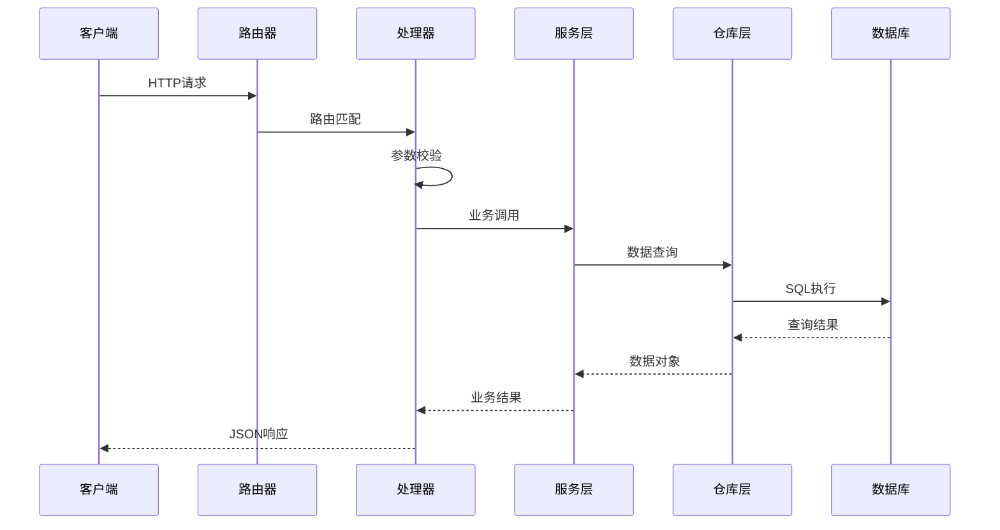

**图表来源**
- [app/server/internal/router/router.go:94-103](file://app/server/internal/router/router.go#L94-L103)
- [app/server/internal/handler/v1/dept.go:26-186](file://app/server/internal/handler/v1/dept.go#L26-L186)

## 详细组件分析

### 部门树构建算法
系统采用祖先链（ancestors）机制实现高效的树形结构管理：

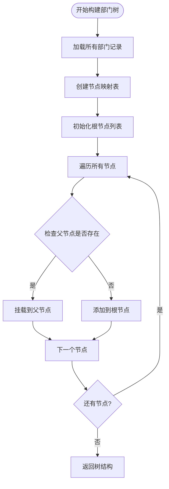

**图表来源**
- [app/server/internal/service/dept.go:149-175](file://app/server/internal/service/dept.go#L149-L175)

#### 树构建算法复杂度分析
- **时间复杂度**: O(n)，其中n为部门数量
- **空间复杂度**: O(n)，用于节点映射和根节点列表
- **查询优化**: 通过祖先链实现O(1)的父子关系判断

### 部门分页查询机制
系统支持两种分页查询模式：

1. **树形分页**: 基于顶级部门的层级分页
2. **列表分页**: 平级部门列表分页

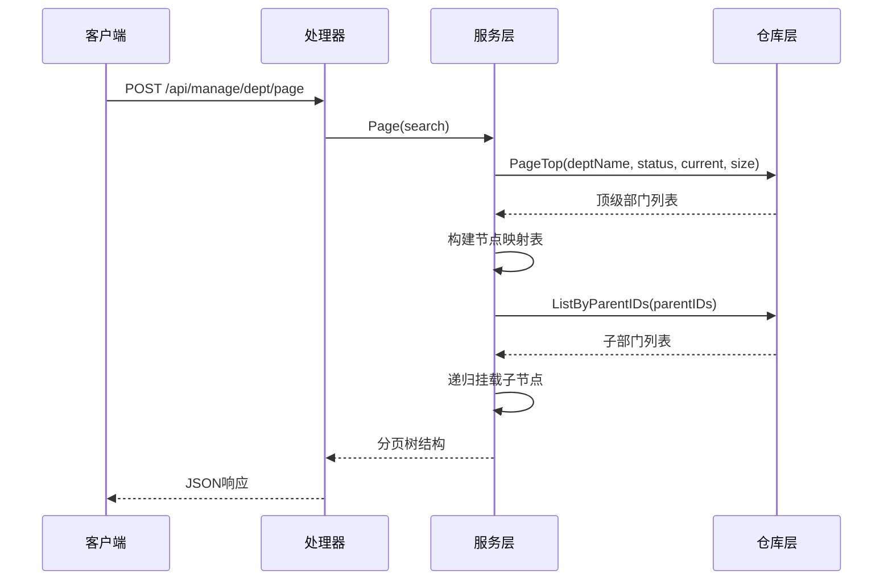

**图表来源**
- [app/server/internal/service/dept.go:177-250](file://app/server/internal/service/dept.go#L177-L250)
- [app/server/internal/repository/sys_dept.go:80-104](file://app/server/internal/repository/sys_dept.go#L80-L104)

### 部门权限控制机制
系统通过数据权限上下文实现精细化的部门数据权限控制：

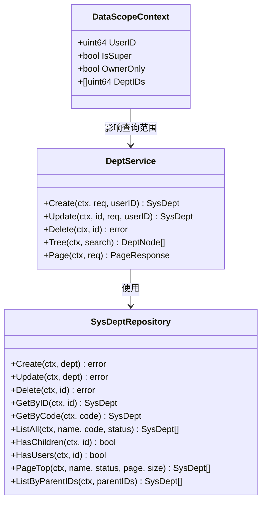

**图表来源**
- [app/server/internal/scope/data_scope.go:11-95](file://app/server/internal/scope/data_scope.go#L11-L95)
- [app/server/internal/service/dept.go:22-28](file://app/server/internal/service/dept.go#L22-L28)

### 部门操作接口详解

#### 创建部门
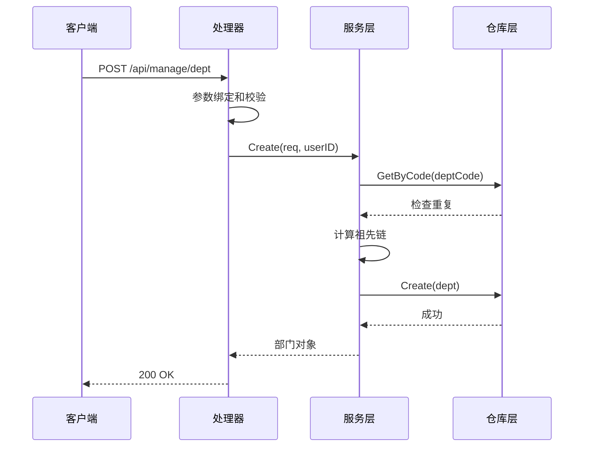

**图表来源**
- [app/server/internal/handler/v1/dept.go:102-123](file://app/server/internal/handler/v1/dept.go#L102-L123)
- [app/server/internal/service/dept.go:30-66](file://app/server/internal/service/dept.go#L30-L66)

#### 移动部门
部门移动涉及祖先链的重新计算和子部门的级联更新：

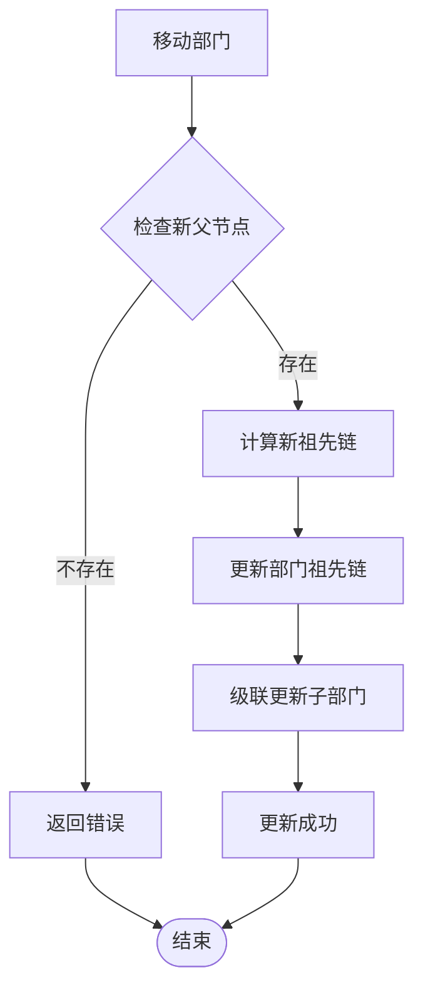

**图表来源**
- [app/server/internal/service/dept.go:68-111](file://app/server/internal/service/dept.go#L68-L111)

#### 删除部门
删除操作包含严格的约束检查：

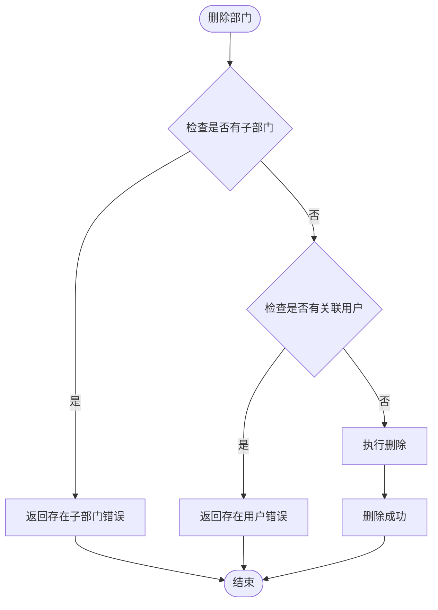

**图表来源**
- [app/server/internal/service/dept.go:113-126](file://app/server/internal/service/dept.go#L113-L126)
- [app/server/internal/repository/sys_dept.go:66-78](file://app/server/internal/repository/sys_dept.go#L66-L78)

**章节来源**
- [app/server/internal/handler/v1/dept.go:26-186](file://app/server/internal/handler/v1/dept.go#L26-L186)
- [app/server/internal/service/dept.go:30-250](file://app/server/internal/service/dept.go#L30-L250)
- [app/server/internal/repository/sys_dept.go:19-124](file://app/server/internal/repository/sys_dept.go#L19-L124)

## 依赖关系分析

### 组件耦合度分析
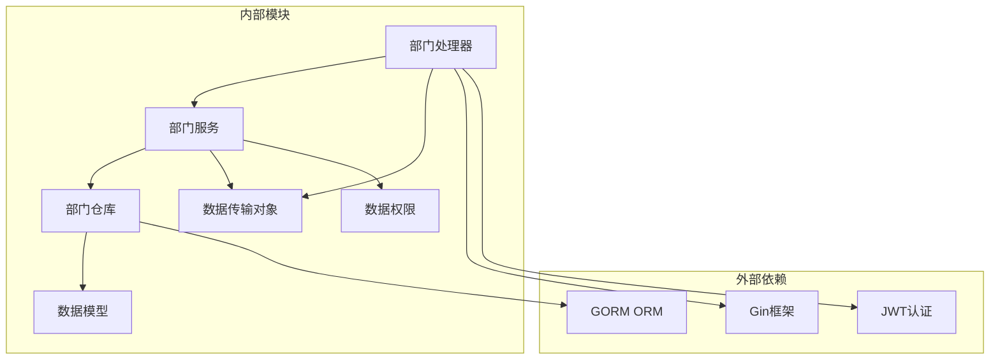

**图表来源**
- [app/server/internal/router/router.go:35-77](file://app/server/internal/router/router.go#L35-L77)
- [app/server/internal/handler/v1/dept.go:3-13](file://app/server/internal/handler/v1/dept.go#L3-L13)

### 数据权限继承机制
系统通过数据权限上下文实现部门数据的自动继承：

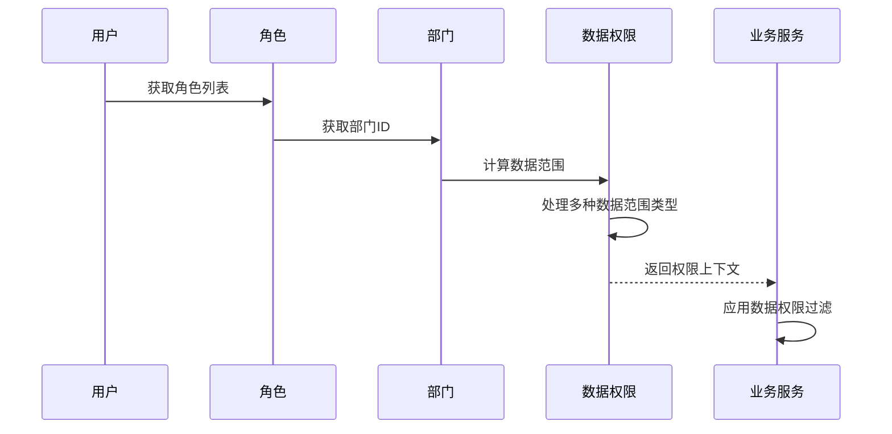

**图表来源**
- [app/server/internal/scope/data_scope.go:22-95](file://app/server/internal/scope/data_scope.go#L22-L95)

**章节来源**
- [app/server/internal/scope/data_scope.go:1-135](file://app/server/internal/scope/data_scope.go#L1-L135)
- [app/server/internal/router/router.go:94-103](file://app/server/internal/router/router.go#L94-L103)

## 性能考虑
基于祖先链的树形结构查询具有以下性能特点：

### 查询性能优化
- **祖先链索引**: 通过字符串前缀匹配实现O(1)的父子关系判断
- **批量查询**: 使用IN子句进行批量子部门查询，减少数据库往返
- **分页策略**: 顶级部门优先查询，避免全表扫描

### 内存使用优化
- **延迟构建**: 树节点按需构建，避免不必要的内存占用
- **映射表复用**: 使用哈希表实现O(1)的节点查找
- **递归深度限制**: 最大支持10级部门层级，防止栈溢出

### 并发安全
- **事务隔离**: 关键操作使用数据库事务保证数据一致性
- **锁机制**: 部门编码唯一性检查使用数据库约束
- **幂等性**: 部分操作支持重复执行而不产生副作用

## 故障排除指南

### 常见错误类型
1. **部门编码冲突**: 创建/更新时部门编码重复
2. **父部门不存在**: 指定的父部门ID无效
3. **存在子部门**: 尝试删除仍有子部门的部门
4. **部门下有用户**: 尝试删除仍有用户的部门

### 错误处理流程
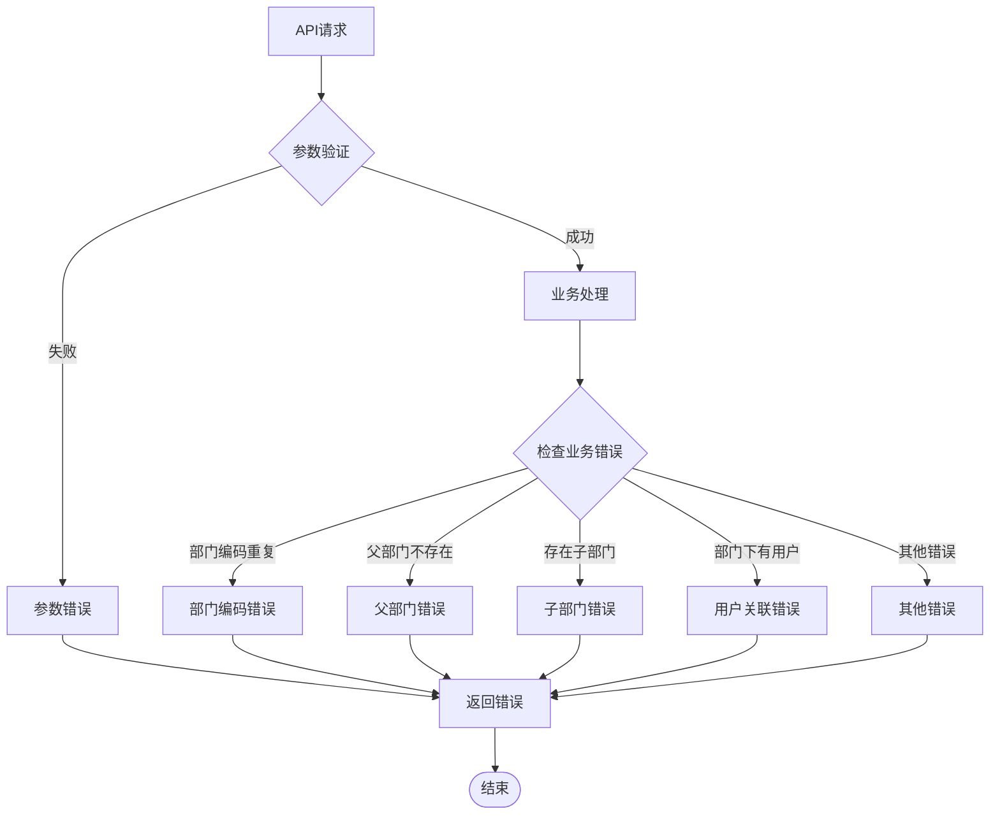

**图表来源**
- [app/server/internal/handler/v1/dept.go:175-186](file://app/server/internal/handler/v1/dept.go#L175-L186)
- [app/server/internal/service/dept.go:15-20](file://app/server/internal/service/dept.go#L15-L20)

**章节来源**
- [app/server/internal/handler/v1/dept.go:175-186](file://app/server/internal/handler/v1/dept.go#L175-L186)
- [app/server/internal/service/dept.go:15-20](file://app/server/internal/service/dept.go#L15-L20)

## 结论
部门管理API通过精心设计的架构实现了高效、可靠的组织架构管理功能。系统的核心优势包括：

1. **高效的树形结构**: 基于祖先链的查询机制提供了优秀的性能表现
2. **完善的权限控制**: 数据权限上下文确保了数据访问的安全性
3. **健壮的业务逻辑**: 严格的约束检查保证了数据完整性
4. **清晰的分层架构**: 明确的职责分离便于维护和扩展

该系统为后续的功能扩展（如部门合并、批量操作等）提供了良好的基础。

## 附录

### API使用示例

#### 基本CRUD操作
```typescript
// 创建部门
await fetchCreateDept({
  parentId: 0,
  deptName: "技术部",
  deptCode: "TECH",
  leader: "张三",
  sortOrder: 1,
  status: "1"
});

// 获取部门树
const deptTree = await fetchGetDeptTree({
  deptName: "技术",
  status: "1"
});

// 更新部门
await fetchUpdateDept(1, {
  parentId: 0,
  deptName: "技术开发部",
  deptCode: "TECH_DEV",
  leader: "李四",
  sortOrder: 2,
  status: "1"
});

// 删除部门
await fetchDeleteDept(1);
```

#### 分页查询示例
```typescript
// 部门分页查询
const deptList = await fetchGetDeptList({
  current: 1,
  size: 10,
  deptName: "技术",
  status: "1"
});
```

**章节来源**
- [app/web/src/service/api/system-manage.ts:270-330](file://app/web/src/service/api/system-manage.ts#L270-L330)
- [app/web/src/typings/api/system-manage.d.ts:91-114](file://app/web/src/typings/api/system-manage.d.ts#L91-L114)

### 最佳实践建议

1. **数据一致性**: 始终使用事务处理部门移动等复杂操作
2. **性能优化**: 对频繁查询的部门树建立适当的数据库索引
3. **权限控制**: 确保所有数据访问都经过数据权限上下文过滤
4. **错误处理**: 客户端应该妥善处理各种业务错误场景
5. **监控告警**: 建立部门操作的日志记录和异常监控机制