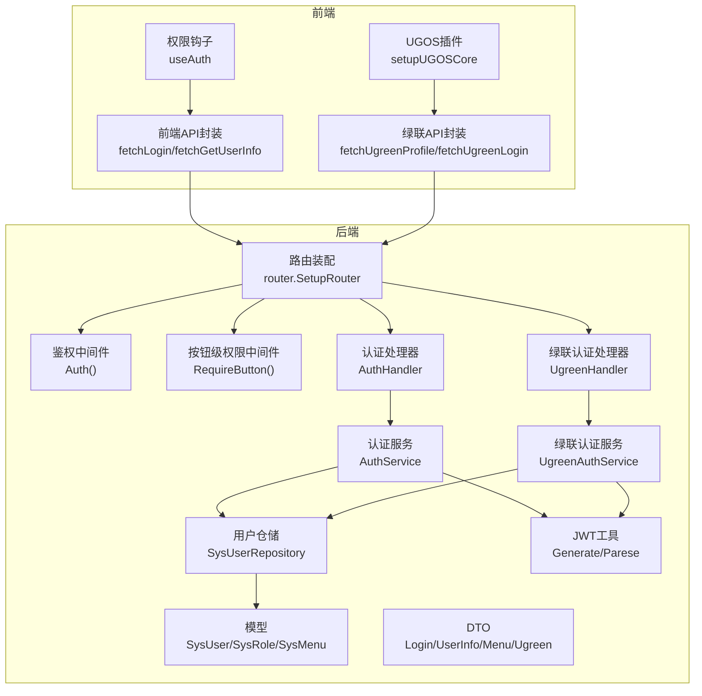
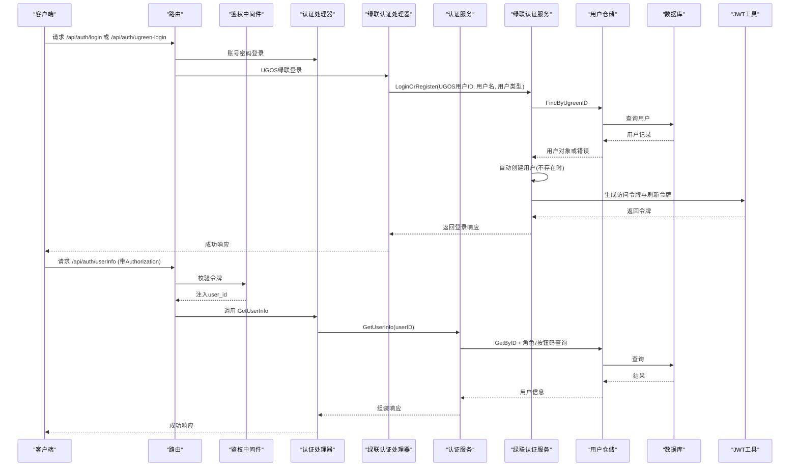
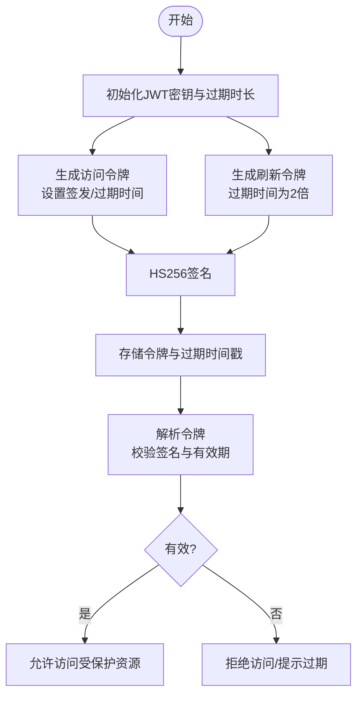
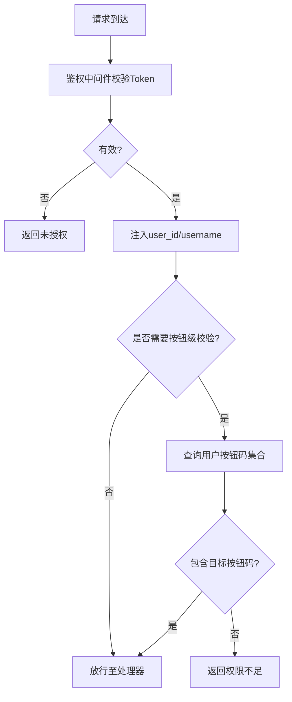
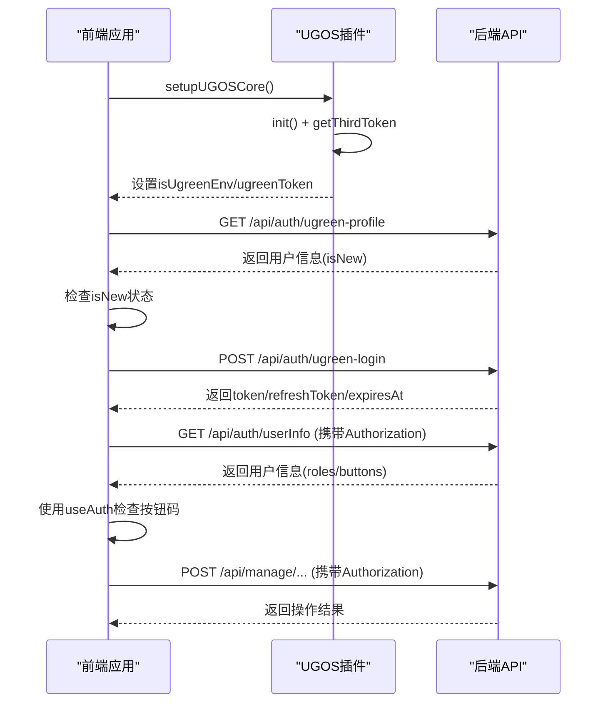
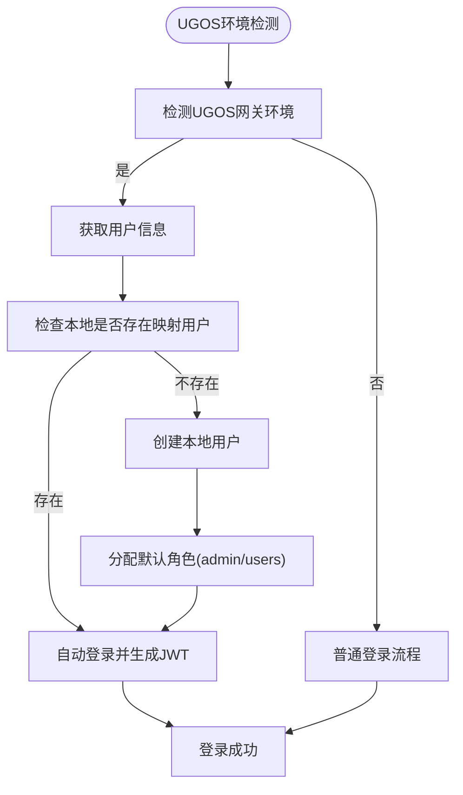
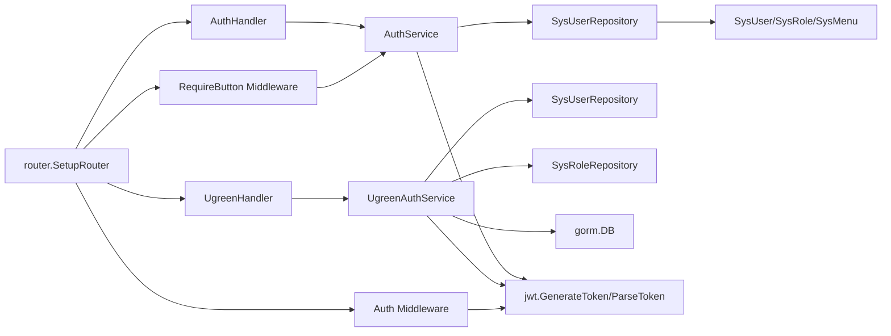

# 认证授权API

<cite>
**本文引用的文件**
- [app/server/cmd/api/main.go](file://app/server/cmd/api/main.go)
- [app/server/pkg/config/config.go](file://app/server/pkg/config/config.go)
- [app/server/pkg/jwt/jwt.go](file://app/server/pkg/jwt/jwt.go)
- [app/server/internal/middleware/auth.go](file://app/server/internal/middleware/auth.go)
- [app/server/internal/middleware/permission.go](file://app/server/internal/middleware/permission.go)
- [app/server/internal/router/router.go](file://app/server/internal/router/router.go)
- [app/server/internal/handler/v1/auth.go](file://app/server/internal/handler/v1/auth.go)
- [app/server/internal/handler/v1/ugreen.go](file://app/server/internal/handler/v1/ugreen.go)
- [app/server/internal/service/auth.go](file://app/server/internal/service/auth.go)
- [app/server/internal/service/ugreen_auth.go](file://app/server/internal/service/ugreen_auth.go)
- [app/server/internal/dto/auth.go](file://app/server/internal/dto/auth.go)
- [app/server/internal/dto/ugreen.go](file://app/server/internal/dto/ugreen.go)
- [app/server/internal/repository/sys_user.go](file://app/server/internal/repository/sys_user.go)
- [app/server/internal/model/sys_user.go](file://app/server/internal/model/sys_user.go)
- [app/server/internal/model/sys_role.go](file://app/server/internal/model/sys_role.go)
- [app/server/internal/model/sys_menu.go](file://app/server/internal/model/sys_menu.go)
- [app/server/internal/code/code.go](file://app/server/internal/code/code.go)
- [app/sql/book_v5.sql](file://app/sql/book_v5.sql)
- [app/web/src/service/api/auth.ts](file://app/web/src/service/api/auth.ts)
- [app/web/src/service/api/ugreen.ts](file://app/web/src/service/api/ugreen.ts)
- [app/web/src/hooks/business/auth.ts](file://app/web/src/hooks/business/auth.ts)
- [app/web/src/plugins/ugreen.ts](file://app/web/src/plugins/ugreen.ts)
- [app/web/src/views/_builtin/login/modules/ugreen-login.vue](file://app/web/src/views/_builtin/login/modules/ugreen-login.vue)
</cite>

## 更新摘要
**所做更改**
- 新增UGOS/NAS集成认证接口文档章节
- 添加绿联用户信息获取和登录接口说明
- 更新认证API接口定义，包含UGOS认证相关接口
- 新增UGOS环境检测和自动登录流程
- 更新数据库迁移说明，包含ugreen_user_id字段
- 新增前端UGOS插件集成指南

## 目录
1. [简介](#简介)
2. [项目结构](#项目结构)
3. [核心组件](#核心组件)
4. [架构总览](#架构总览)
5. [详细组件分析](#详细组件分析)
6. [UGOS/NAS集成认证](#ugosnas集成认证)
7. [依赖分析](#依赖分析)
8. [性能考虑](#性能考虑)
9. [故障排查指南](#故障排查指南)
10. [结论](#结论)
11. [附录](#附录)

## 简介
本文件面向boread项目的认证授权API，覆盖登录、当前用户信息、当前用户菜单树、当前用户按钮码集合等接口；详述JWT令牌生成与验证机制、权限校验流程、会话管理策略；提供请求参数、响应格式、错误处理示例；解释角色与按钮码权限范围、访问控制策略与安全最佳实践，并给出前端集成指南。

**更新** 新增UGOS/NAS集成认证支持，包括绿联用户信息获取和自动登录功能。

## 项目结构
后端采用Go语言Gin框架，按层次化组织：路由装配、中间件、处理器、服务层、仓储层、模型与DTO、JWT工具、配置加载等。前端使用Vue3 + TypeScript，通过统一请求封装调用后端API。



**图表来源**
- [app/server/internal/router/router.go:120-135](file://app/server/internal/router/router.go#L120-L135)
- [app/server/internal/handler/v1/ugreen.go:15-22](file://app/server/internal/handler/v1/ugreen.go#L15-L22)
- [app/server/internal/service/ugreen_auth.go:18-27](file://app/server/internal/service/ugreen_auth.go#L18-L27)

**章节来源**
- [app/server/internal/router/router.go:120-135](file://app/server/internal/router/router.go#L120-L135)
- [app/server/cmd/api/main.go:30-85](file://app/server/cmd/api/main.go#L30-L85)

## 核心组件
- 路由与中间件
  - 路由装配：公开接口（如登录、UGOS认证）与受保护接口（userInfo、menu、buttons）分组，受登录态中间件保护；管理接口按按钮码进行二次鉴权。
  - 鉴权中间件：解析Authorization头中的Bearer Token，校验有效性并将user_id/username注入上下文。
  - 按钮级权限中间件：基于用户角色聚合的按钮码集合，校验是否具备目标按钮码，否则返回403。
- 认证处理器
  - 登录：绑定请求体、调用服务层执行校验与风控、记录登录日志、签发访问令牌与刷新令牌。
  - 当前用户信息：返回用户ID、用户名、角色、按钮码集合。
  - 当前用户菜单树：按角色聚合菜单，构建树形结构并返回首页路由名。
  - 当前用户按钮码集合：返回用户具备的按钮码集合。
  - **绿联认证**：处理UGOS系统网关注入的用户信息，自动创建本地用户并签发JWT令牌。
- 认证服务
  - 登录流程：查询用户、状态与锁定检查、密码校验（bcrypt）、错误计数与锁定、更新登录成功信息、签发JWT与刷新JWT、写登录日志。
  - 权限数据：根据用户ID查询角色编码/ID、按钮码集合、菜单集合并构建树。
  - **绿联认证服务**：按UGOS用户ID查找本地映射用户，不存在则自动创建，分配默认角色，生成JWT令牌。
- 仓储与模型
  - 用户仓储：按用户名/ID查询、登录成功更新、错误计数自增、账号锁定、角色与按钮码查询、菜单查询、UGOS用户ID查询等。
  - 模型：用户、角色、菜单等核心实体。
- DTO
  - 登录请求/响应、用户信息、菜单树响应、**绿联认证相关DTO**等结构。
- JWT工具
  - 初始化密钥与过期时长；生成访问令牌与刷新令牌；解析令牌并校验有效性。
- 配置
  - 服务器、数据库、JWT、日志、元数据提取规则等配置项。

**章节来源**
- [app/server/internal/router/router.go:120-135](file://app/server/internal/router/router.go#L120-L135)
- [app/server/internal/middleware/auth.go:12-41](file://app/server/internal/middleware/auth.go#L12-L41)
- [app/server/internal/middleware/permission.go:10-53](file://app/server/internal/middleware/permission.go#L10-L53)
- [app/server/internal/handler/v1/auth.go:14-142](file://app/server/internal/handler/v1/auth.go#L14-L142)
- [app/server/internal/handler/v1/ugreen.go:24-94](file://app/server/internal/handler/v1/ugreen.go#L24-L94)
- [app/server/internal/service/auth.go:31-248](file://app/server/internal/service/auth.go#L31-L248)
- [app/server/internal/service/ugreen_auth.go:29-140](file://app/server/internal/service/ugreen_auth.go#L29-L140)
- [app/server/internal/repository/sys_user.go:12-197](file://app/server/internal/repository/sys_user.go#L12-L197)
- [app/server/internal/model/sys_user.go:5-36](file://app/server/internal/model/sys_user.go#L5-L36)
- [app/server/internal/model/sys_role.go:14-36](file://app/server/internal/model/sys_role.go#L14-L36)
- [app/server/internal/model/sys_menu.go:19-45](file://app/server/internal/model/sys_menu.go#L19-L45)
- [app/server/internal/dto/auth.go:3-57](file://app/server/internal/dto/auth.go#L3-L57)
- [app/server/internal/dto/ugreen.go:1-23](file://app/server/internal/dto/ugreen.go#L1-L23)
- [app/server/pkg/jwt/jwt.go:10-72](file://app/server/pkg/jwt/jwt.go#L10-L72)
- [app/server/pkg/config/config.go:9-66](file://app/server/pkg/config/config.go#L9-L66)

## 架构总览
后端启动时加载配置，初始化JWT、数据库连接，装配路由与中间件；请求进入后依次经过CORS、日志、鉴权中间件，再进入具体处理器；处理器调用服务层，服务层通过仓储访问数据库，最终返回响应。



**图表来源**
- [app/server/internal/router/router.go:120-135](file://app/server/internal/router/router.go#L120-L135)
- [app/server/internal/middleware/auth.go:13-40](file://app/server/internal/middleware/auth.go#L13-L40)
- [app/server/internal/handler/v1/ugreen.go:71-94](file://app/server/internal/handler/v1/ugreen.go#L71-L94)
- [app/server/internal/service/ugreen_auth.go:29-71](file://app/server/internal/service/ugreen_auth.go#L29-L71)
- [app/server/internal/service/auth.go:42-95](file://app/server/internal/service/auth.go#L42-L95)
- [app/server/internal/repository/sys_user.go:21-49](file://app/server/internal/repository/sys_user.go#L21-L49)
- [app/server/pkg/jwt/jwt.go:24-55](file://app/server/pkg/jwt/jwt.go#L24-L55)

## 详细组件分析

### 认证API接口定义
- 登录
  - 方法与路径：POST /api/auth/login
  - 安全性：无
  - 请求体
    - username: 字符串，必填，长度3~64
    - password: 字符串，必填，长度6~128
  - 响应体
    - token: 字符串，访问令牌
    - refreshToken: 字符串，刷新令牌
    - expiresAt: 整数，访问令牌过期时间戳
    - refreshExpiresAt: 整数，刷新令牌过期时间戳
  - 错误码
    - 2001: 用户名或密码错误
    - 2003: 账号已禁用
    - 2004: 账号已锁定，请稍后再试
    - 5001: 登录失败
- 当前登录用户信息
  - 方法与路径：GET /api/auth/userInfo
  - 安全性：BearerAuth
  - 响应体
    - userId: 字符串，用户ID
    - userName: 字符串，用户名
    - roles: 字符串数组，角色编码集合
    - buttons: 字符串数组，按钮码集合
- 当前用户菜单树
  - 方法与路径：GET /api/auth/menu
  - 安全性：BearerAuth
  - 响应体
    - routes: 菜单树数组
    - home: 字符串，首页路由名
- 当前用户按钮码集合
  - 方法与路径：GET /api/auth/buttons
  - 安全性：BearerAuth
  - 响应体
    - 字符串数组，按钮码集合

**更新** 新增UGOS/NAS集成认证接口：

- 绿联用户信息获取
  - 方法与路径：GET /api/auth/ugreen-profile
  - 安全性：无（需要UGOS网关环境）
  - 请求头
    - Ugreen-User-ID: 绿联用户ID
    - Ugreen-User-Name: 绿联用户名
    - Ugreen-User-Type: 绿联用户类型 (admin/users)
  - 响应体
    - userId: 字符串，绿联用户ID
    - userName: 字符串，绿联用户名
    - userType: 字符串，绿联用户类型
    - isNew: 布尔值，是否为新用户
  - 错误码
    - 166: 绿联认证失败
- 绿联NAS登录
  - 方法与路径：POST /api/auth/ugreen-login
  - 安全性：无（需要UGOS网关环境）
  - 请求头
    - Ugreen-User-ID: 绿联用户ID
    - Ugreen-User-Name: 绿联用户名
    - Ugreen-User-Type: 绿联用户类型 (admin/users)
  - 响应体
    - token: 字符串，访问令牌
    - refreshToken: 字符串，刷新令牌
    - expiresAt: 整数，访问令牌过期时间戳
    - refreshExpiresAt: 整数，刷新令牌过期时间戳
  - 错误码
    - 166: 绿联认证失败

**章节来源**
- [app/server/internal/handler/v1/auth.go:23-122](file://app/server/internal/handler/v1/auth.go#L23-L122)
- [app/server/internal/handler/v1/ugreen.go:24-94](file://app/server/internal/handler/v1/ugreen.go#L24-L94)
- [app/server/internal/dto/auth.go:3-57](file://app/server/internal/dto/auth.go#L3-L57)
- [app/server/internal/dto/ugreen.go:1-23](file://app/server/internal/dto/ugreen.go#L1-L23)

### JWT令牌生成与验证机制
- 初始化
  - 从配置加载JWT密钥与过期秒数，初始化全局变量。
- 生成
  - 访问令牌：设置签发时间与过期时间，使用HS256签名。
  - 刷新令牌：过期时间为访问令牌的两倍。
- 解析
  - 使用相同密钥与HS256算法解析，校验签名与有效期，返回声明。
- 使用
  - 登录成功后返回访问令牌与刷新令牌；后续受保护接口需在Authorization头中携带Bearer Token。



**图表来源**
- [app/server/pkg/jwt/jwt.go:19-72](file://app/server/pkg/jwt/jwt.go#L19-L72)
- [app/server/cmd/api/main.go:42](file://app/server/cmd/api/main.go#L42)

**章节来源**
- [app/server/pkg/jwt/jwt.go:19-72](file://app/server/pkg/jwt/jwt.go#L19-L72)
- [app/server/cmd/api/main.go:42](file://app/server/cmd/api/main.go#L42)

### 权限校验流程
- 登录态校验
  - 鉴权中间件从Authorization头解析Bearer Token，校验失败直接返回未授权。
  - 校验通过后将user_id与username注入上下文，供后续处理器使用。
- 按钮级权限校验
  - 按钮级中间件从上下文取出user_id，查询用户具备的按钮码集合。
  - 若目标按钮码存在于集合中，则放行；否则返回权限不足。
- 菜单与按钮数据来源
  - 用户角色编码/ID、按钮码集合、菜单集合均来自仓储层查询，按角色聚合后返回给前端。



**图表来源**
- [app/server/internal/middleware/auth.go:13-40](file://app/server/internal/middleware/auth.go#L13-L40)
- [app/server/internal/middleware/permission.go:20-52](file://app/server/internal/middleware/permission.go#L20-L52)
- [app/server/internal/service/auth.go:97-134](file://app/server/internal/service/auth.go#L97-L134)
- [app/server/internal/repository/sys_user.go:66-103](file://app/server/internal/repository/sys_user.go#L66-L103)

**章节来源**
- [app/server/internal/middleware/auth.go:13-40](file://app/server/internal/middleware/auth.go#L13-L40)
- [app/server/internal/middleware/permission.go:20-52](file://app/server/internal/middleware/permission.go#L20-L52)
- [app/server/internal/service/auth.go:97-134](file://app/server/internal/service/auth.go#L97-L134)
- [app/server/internal/repository/sys_user.go:66-103](file://app/server/internal/repository/sys_user.go#L66-L103)

### 会话管理策略
- 登录态
  - 采用Bearer Token方式，前端在请求头携带Authorization: Bearer <token>。
- 密码错误风控
  - 密码错误次数达到阈值后，账户被锁定一段时间；登录成功后清零错误计数。
- 登录日志
  - 记录登录结果、IP、UA、消息等，便于审计与追踪。
- 刷新令牌
  - 后端返回刷新令牌，前端预留刷新接口；当前MVP阶段通过userInfo触发重新登录态校验。
- **UGOS会话管理**
  - UGOS环境下的用户通过网关自动认证，无需密码；系统自动创建本地映射用户并生成JWT令牌。

**章节来源**
- [app/server/internal/service/auth.go:19-29](file://app/server/internal/service/auth.go#L19-L29)
- [app/server/internal/service/auth.go:42-95](file://app/server/internal/service/auth.go#L42-L95)
- [app/server/internal/repository/sys_user.go:40-64](file://app/server/internal/repository/sys_user.go#L40-L64)
- [app/server/internal/service/auth.go:234-247](file://app/server/internal/service/auth.go#L234-L247)
- [app/server/internal/service/ugreen_auth.go:29-71](file://app/server/internal/service/ugreen_auth.go#L29-L71)
- [app/web/src/service/api/auth.ts:26-40](file://app/web/src/service/api/auth.ts#L26-L40)

### 角色与权限范围
- 角色
  - 角色包含角色名称、角色编码、数据权限范围、排序、状态等。
  - 数据权限范围枚举：全部、自定义部门、本部门、本部门及子部门、仅本人。
- 按钮码
  - 按钮码用于细粒度权限控制，如"dept:create"、"role:grant"等。
- 菜单
  - 菜单类型分为目录与菜单；支持图标、多标签页、国际化键、外链等元信息。
- 权限聚合
  - 用户具备多个角色，系统按角色聚合按钮码与可见菜单，构建树形菜单与按钮码集合返回前端。
- **UGOS角色映射**
  - admin类型用户映射为SUPER_ADMIN角色
  - users类型用户映射为USERS角色

**章节来源**
- [app/server/internal/model/sys_role.go:14-36](file://app/server/internal/model/sys_role.go#L14-L36)
- [app/server/internal/model/sys_menu.go:19-45](file://app/server/internal/model/sys_menu.go#L19-L45)
- [app/server/internal/service/auth.go:136-163](file://app/server/internal/service/auth.go#L136-L163)
- [app/server/internal/repository/sys_user.go:66-120](file://app/server/internal/repository/sys_user.go#L66-L120)
- [app/server/internal/service/ugreen_auth.go:114-130](file://app/server/internal/service/ugreen_auth.go#L114-L130)

### 安全最佳实践
- 强密码与加密
  - 密码使用bcrypt哈希存储，登录时比对哈希。
- 风控与锁定
  - 密码错误超过阈值自动锁定，降低暴力破解风险。
- 传输安全
  - 建议在生产环境使用HTTPS，避免令牌在传输中泄露。
- 最小权限
  - 管理接口按按钮码进行二次鉴权，遵循最小权限原则。
- 日志审计
  - 登录日志记录关键信息，便于问题追踪与安全审计。
- **UGOS安全**
  - UGOS认证仅在网关环境下有效，网关负责用户身份验证
  - 系统自动为新用户设置默认密码，建议首次登录强制修改密码

**章节来源**
- [app/server/internal/service/auth.go:62-70](file://app/server/internal/service/auth.go#L62-L70)
- [app/server/internal/service/auth.go:234-247](file://app/server/internal/service/auth.go#L234-L247)
- [app/server/internal/service/ugreen_auth.go:99-102](file://app/server/internal/service/ugreen_auth.go#L99-L102)

### 前端集成指南
- 登录
  - 调用登录接口，传入用户名与密码；保存返回的访问令牌与刷新令牌。
- 请求头
  - 对受保护接口，在Authorization头中添加Bearer <token>。
- 权限校验
  - 使用权限钩子检查按钮码，动态控制UI元素显示与交互。
- 刷新令牌
  - 当前MVP阶段通过userInfo触发重新登录态校验；后续可实现独立刷新接口。
- **UGOS集成**
  - 使用setupUGOSCore初始化UGOS桥接，自动获取third_token
  - 通过fetchUgreenProfile获取用户信息，确认是否为新用户
  - 调用fetchUgreenLogin完成自动登录



**图表来源**
- [app/web/src/plugins/ugreen.ts:13-41](file://app/web/src/plugins/ugreen.ts#L13-L41)
- [app/web/src/service/api/ugreen.ts:1-18](file://app/web/src/service/api/ugreen.ts#L1-L18)
- [app/web/src/views/_builtin/login/modules/ugreen-login.vue:31-44](file://app/web/src/views/_builtin/login/modules/ugreen-login.vue#L31-L44)

**章节来源**
- [app/web/src/service/api/auth.ts:1-51](file://app/web/src/service/api/auth.ts#L1-L51)
- [app/web/src/service/api/ugreen.ts:1-18](file://app/web/src/service/api/ugreen.ts#L1-L18)
- [app/web/src/hooks/business/auth.ts:1-22](file://app/web/src/hooks/business/auth.ts#L1-L22)
- [app/web/src/plugins/ugreen.ts:1-42](file://app/web/src/plugins/ugreen.ts#L1-L42)
- [app/web/src/views/_builtin/login/modules/ugreen-login.vue:1-130](file://app/web/src/views/_builtin/login/modules/ugreen-login.vue#L1-L130)

## UGOS/NAS集成认证

### 系统概述
boread项目新增了对UGOS（绿联操作系统）和NAS设备的认证集成，允许在UGOS网关环境下实现免密登录。该功能通过网关自动注入的用户信息完成认证，无需用户输入密码。

### 核心组件
- **UGOS网关环境检测**
  - 前端通过setupUGOSCore检测是否运行在UGOS环境中
  - 支持3秒超时机制，确保非UGOS环境下的快速降级
- **绿联认证处理器**
  - Profile接口：获取UGOS注入的用户信息
  - Login接口：完成绿联用户的登录或自动注册
- **绿联认证服务**
  - 按UGOS用户ID查找本地映射用户
  - 自动创建新用户并分配默认角色
  - 生成JWT令牌并返回给前端

### 认证流程


**图表来源**
- [app/web/src/plugins/ugreen.ts:13-41](file://app/web/src/plugins/ugreen.ts#L13-L41)
- [app/server/internal/handler/v1/ugreen.go:31-94](file://app/server/internal/handler/v1/ugreen.go#L31-L94)
- [app/server/internal/service/ugreen_auth.go:29-140](file://app/server/internal/service/ugreen_auth.go#L29-L140)

### 数据库迁移
系统需要对sys_user表进行扩展以支持UGOS用户ID映射：

```sql
-- 1. sys_user 新增 ugreen_user_id 字段
ALTER TABLE sys_user
    ADD COLUMN ugreen_user_id VARCHAR(64) DEFAULT NULL COMMENT '绿联NAS用户ID' AFTER avatar;

CREATE INDEX idx_sys_user_ugreen_user_id ON sys_user(ugreen_user_id);
```

**章节来源**
- [app/sql/book_v5.sql:1-16](file://app/sql/book_v5.sql#L1-L16)
- [app/server/internal/service/ugreen_auth.go:103-109](file://app/server/internal/service/ugreen_auth.go#L103-L109)

### 错误处理
- UgreenAuthFailed (166): 绿联认证失败，通常发生在非UGOS环境或网关注入信息缺失
- 缺少UGOS用户ID: 网关环境检测失败，返回"not in ugos gateway environment"
- 用户映射失败: 数据库操作异常导致认证失败

**章节来源**
- [app/server/internal/code/code.go:165-167](file://app/server/internal/code/code.go#L165-L167)
- [app/server/internal/handler/v1/ugreen.go:36-38](file://app/server/internal/handler/v1/ugreen.go#L36-L38)
- [app/server/internal/handler/v1/ugreen.go:76-78](file://app/server/internal/handler/v1/ugreen.go#L76-L78)

## 依赖分析
- 组件耦合
  - 路由装配集中注入各层依赖，处理器依赖服务层，服务层依赖仓储与JWT工具。
  - 中间件依赖JWT工具与响应封装。
  - **新增** UgreenHandler依赖UgreenAuthService，UgreenAuthService依赖用户仓储、角色仓储和数据库连接。
- 外部依赖
  - Gin框架、GORM ORM、golang-jwt、bcrypt、@ugreen-nas/core等。
- 循环依赖
  - 代码结构清晰，未见循环依赖迹象。



**图表来源**
- [app/server/internal/router/router.go:120-135](file://app/server/internal/router/router.go#L120-L135)
- [app/server/internal/handler/v1/ugreen.go:15-22](file://app/server/internal/handler/v1/ugreen.go#L15-L22)
- [app/server/internal/service/ugreen_auth.go:18-27](file://app/server/internal/service/ugreen_auth.go#L18-L27)

**章节来源**
- [app/server/internal/router/router.go:120-135](file://app/server/internal/router/router.go#L120-L135)

## 性能考虑
- 按钮码查询
  - 当前每次请求均查询数据库，建议引入缓存（如sync.Map或Redis）以减少DB压力。
- 登录日志
  - 写入日志不影响主流程，但建议异步化或批量写入以降低延迟。
- 密码哈希
  - bcrypt成本较高，建议结合缓存与合理的过期策略平衡安全与性能。
- **UGOS认证优化**
  - UGOS用户认证为无状态操作，建议在网关层进行用户信息缓存
  - 自动创建用户操作可异步化，避免阻塞认证流程

## 故障排查指南
- 未携带Authorization或格式不正确
  - 鉴权中间件会返回未授权错误；检查请求头格式是否为Bearer <token>。
- 令牌无效或已过期
  - 解析令牌失败会返回无效或过期提示；检查令牌是否正确、是否在有效期内。
- 用户不存在或密码错误
  - 登录接口会返回对应错误码；检查用户名与密码是否正确。
- 账号被禁用或锁定
  - 登录接口会返回相应错误；联系管理员或等待解锁。
- 权限不足
  - 按钮级中间件会返回权限不足；确认用户角色与按钮码是否具备目标操作权限。
- **UGOS认证问题**
  - 网关环境检测失败：检查是否在UGOS网关内运行
  - 用户信息获取失败：确认网关是否正确注入Ugreen-*系列头部
  - 自动登录失败：检查数据库连接和用户创建流程

**章节来源**
- [app/server/internal/middleware/auth.go:13-40](file://app/server/internal/middleware/auth.go#L13-L40)
- [app/server/internal/handler/v1/auth.go:42-55](file://app/server/internal/handler/v1/auth.go#L42-L55)
- [app/server/internal/service/auth.go:24-29](file://app/server/internal/service/auth.go#L24-L29)
- [app/server/internal/middleware/permission.go:20-52](file://app/server/internal/middleware/permission.go#L20-L52)
- [app/server/internal/handler/v1/ugreen.go:36-38](file://app/server/internal/handler/v1/ugreen.go#L36-L38)
- [app/web/src/plugins/ugreen.ts:13-41](file://app/web/src/plugins/ugreen.ts#L13-L41)

## 结论
boread认证授权体系以JWT为核心，结合登录态中间件与按钮级权限中间件，形成"登录态+细粒度权限"的双重保障。新增的UGOS/NAS集成认证进一步扩展了系统的适用场景，通过网关自动认证实现免密登录。服务层负责业务逻辑与风控，仓储层抽象数据访问，前端通过统一API封装与权限钩子完成集成。建议在生产环境中强化令牌安全、引入权限缓存与异步日志，并完善刷新令牌流程。

## 附录
- 配置项
  - server.port: 服务监听端口
  - jwt.secret: JWT签名密钥
  - jwt.expire: 访问令牌过期间秒数
  - database.*: 数据库连接参数
  - log.level: 日志级别
  - log.file: 日志文件路径
- 启动流程
  - 加载配置 → 初始化日志 → 初始化JWT → 连接数据库 → 路由装配 → 启动服务
- **UGOS集成配置**
  - UGOS网关环境检测超时：3000ms
  - 自动登录流程：Profile → Login → UserInfo
  - 默认角色映射：admin → SUPER_ADMIN, users → USERS

**章节来源**
- [app/server/pkg/config/config.go:9-66](file://app/server/pkg/config/config.go#L9-L66)
- [app/server/cmd/api/main.go:34-84](file://app/server/cmd/api/main.go#L34-L84)
- [app/web/src/plugins/ugreen.ts:6-7](file://app/web/src/plugins/ugreen.ts#L6-L7)
- [app/server/internal/service/ugreen_auth.go:114-130](file://app/server/internal/service/ugreen_auth.go#L114-L130)