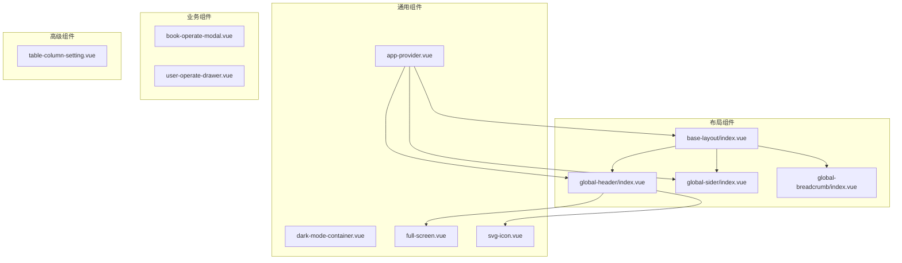
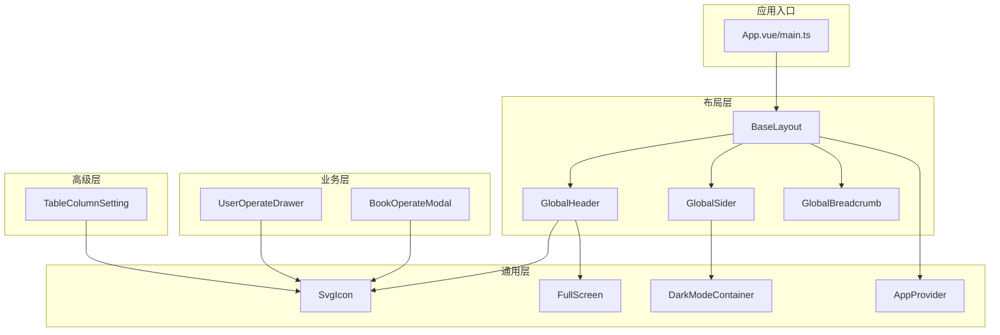
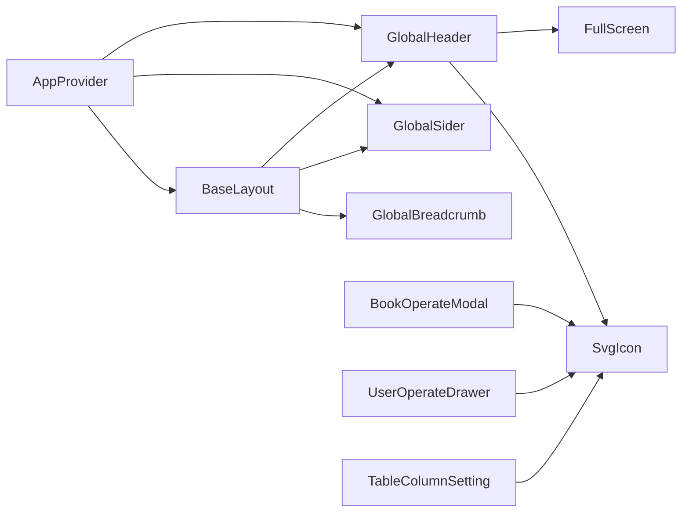

# UI组件库

<cite>
**本文引用的文件**
- [book-card.vue](file://app/web/src/components/book-card.vue)
- [book-filter.vue](file://app/web/src/components/book-filter.vue)
- [app-provider.vue](file://app/web/src/components/common/app-provider.vue)
- [dark-mode-container.vue](file://app/web/src/components/common/dark-mode-container.vue)
- [full-screen.vue](file://app/web/src/components/common/full-screen.vue)
- [svg-icon.vue](file://app/web/src/components/custom/svg-icon.vue)
- [base-layout/index.vue](file://app/web/src/layouts/base-layout/index.vue)
- [global-header/index.vue](file://app/web/src/layouts/modules/global-header/index.vue)
- [global-sider/index.vue](file://app/web/src/layouts/modules/global-sider/index.vue)
- [global-breadcrumb/index.vue](file://app/web/src/layouts/modules/global-breadcrumb/index.vue)
- [table-column-setting.vue](file://app/web/src/components/advanced/table-column-setting.vue)
- [book-operate-modal.vue](file://app/web/src/views/admin/library/book/modules/book-operate-modal.vue)
- [user-operate-drawer.vue](file://app/web/src/views/admin/system/user/modules/user-operate-drawer.vue)
- [settings.ts](file://app/web/src/theme/settings.ts)
</cite>

## 目录
1. [简介](#简介)
2. [项目结构](#项目结构)
3. [核心组件](#核心组件)
4. [架构总览](#架构总览)
5. [详细组件分析](#详细组件分析)
6. [依赖关系分析](#依赖关系分析)
7. [性能考量](#性能考量)
8. [故障排查指南](#故障排查指南)
9. [结论](#结论)
10. [附录](#附录)

## 简介
本文件为 boread 项目的 UI 组件库文档，聚焦于自定义组件的设计理念、使用规范与属性配置，覆盖布局组件（头部、侧边栏、面包屑等）、业务组件（图书卡片、筛选器、操作模态框等）、通用组件（按钮图标、图标、表格列设置等）。文档同时阐述样式定制、主题适配、响应式设计，并给出组件组合模式、事件处理机制与状态管理集成方式，以及使用示例、最佳实践与性能优化建议。

## 项目结构
UI 组件主要分布在以下目录：
- 布局层：layouts 下的全局头部、侧边栏、面包屑、基础布局等
- 业务组件：views 下各模块的操作模态框与抽屉
- 通用组件：components 下的 common、custom、advanced 等
- 主题与样式：theme 下的主题设置与变量

图表来源
- [base-layout/index.vue:1-163](file://app/web/src/layouts/base-layout/index.vue#L1-L163)
- [global-header/index.vue:1-61](file://app/web/src/layouts/modules/global-header/index.vue#L1-L61)
- [global-sider/index.vue:1-37](file://app/web/src/layouts/modules/global-sider/index.vue#L1-L37)
- [global-breadcrumb/index.vue:1-48](file://app/web/src/layouts/modules/global-breadcrumb/index.vue#L1-L48)
- [app-provider.vue:1-40](file://app/web/src/components/common/app-provider.vue#L1-L40)
- [full-screen.vue:1-23](file://app/web/src/components/common/full-screen.vue#L1-L23)
- [svg-icon.vue:1-55](file://app/web/src/components/custom/svg-icon.vue#L1-L55)
- [book-operate-modal.vue:1-290](file://app/web/src/views/admin/library/book/modules/book-operate-modal.vue#L1-L290)
- [user-operate-drawer.vue:1-174](file://app/web/src/views/admin/system/user/modules/user-operate-drawer.vue#L1-L174)
- [table-column-setting.vue:1-118](file://app/web/src/components/advanced/table-column-setting.vue#L1-L118)

章节来源
- [base-layout/index.vue:1-163](file://app/web/src/layouts/base-layout/index.vue#L1-L163)
- [global-header/index.vue:1-61](file://app/web/src/layouts/modules/global-header/index.vue#L1-L61)
- [global-sider/index.vue:1-37](file://app/web/src/layouts/modules/global-sider/index.vue#L1-L37)
- [global-breadcrumb/index.vue:1-48](file://app/web/src/layouts/modules/global-breadcrumb/index.vue#L1-L48)
- [app-provider.vue:1-40](file://app/web/src/components/common/app-provider.vue#L1-L40)
- [full-screen.vue:1-23](file://app/web/src/components/common/full-screen.vue#L1-L23)
- [svg-icon.vue:1-55](file://app/web/src/components/custom/svg-icon.vue#L1-L55)
- [book-operate-modal.vue:1-290](file://app/web/src/views/admin/library/book/modules/book-operate-modal.vue#L1-L290)
- [user-operate-drawer.vue:1-174](file://app/web/src/views/admin/system/user/modules/user-operate-drawer.vue#L1-L174)
- [table-column-setting.vue:1-118](file://app/web/src/components/advanced/table-column-setting.vue#L1-L118)

## 核心组件
- 布局组件：负责页面骨架与导航组织，包括基础布局、全局头部、侧边栏、面包屑等
- 业务组件：面向具体业务场景的弹窗与抽屉，如图书操作模态框、用户操作抽屉
- 通用组件：提供通用能力，如图标封装、全屏切换、暗色容器、应用上下文提供者等
- 高级组件：增强表格体验，如列设置与拖拽排序

章节来源
- [base-layout/index.vue:1-163](file://app/web/src/layouts/base-layout/index.vue#L1-L163)
- [global-header/index.vue:1-61](file://app/web/src/layouts/modules/global-header/index.vue#L1-L61)
- [global-sider/index.vue:1-37](file://app/web/src/layouts/modules/global-sider/index.vue#L1-L37)
- [global-breadcrumb/index.vue:1-48](file://app/web/src/layouts/modules/global-breadcrumb/index.vue#L1-L48)
- [book-operate-modal.vue:1-290](file://app/web/src/views/admin/library/book/modules/book-operate-modal.vue#L1-L290)
- [user-operate-drawer.vue:1-174](file://app/web/src/views/admin/system/user/modules/user-operate-drawer.vue#L1-L174)
- [table-column-setting.vue:1-118](file://app/web/src/components/advanced/table-column-setting.vue#L1-L118)
- [app-provider.vue:1-40](file://app/web/src/components/common/app-provider.vue#L1-L40)
- [full-screen.vue:1-23](file://app/web/src/components/common/full-screen.vue#L1-L23)
- [svg-icon.vue:1-55](file://app/web/src/components/custom/svg-icon.vue#L1-L55)

## 架构总览
整体采用“布局 + 业务 + 通用 + 高级”的分层设计，通过 Store 与 Hooks 提供状态与行为支撑，Naive UI 作为基础 UI 库，统一交互体验。

图表来源
- [base-layout/index.vue:1-163](file://app/web/src/layouts/base-layout/index.vue#L1-L163)
- [global-header/index.vue:1-61](file://app/web/src/layouts/modules/global-header/index.vue#L1-L61)
- [global-sider/index.vue:1-37](file://app/web/src/layouts/modules/global-sider/index.vue#L1-L37)
- [global-breadcrumb/index.vue:1-48](file://app/web/src/layouts/modules/global-breadcrumb/index.vue#L1-L48)
- [book-operate-modal.vue:1-290](file://app/web/src/views/admin/library/book/modules/book-operate-modal.vue#L1-L290)
- [user-operate-drawer.vue:1-174](file://app/web/src/views/admin/system/user/modules/user-operate-drawer.vue#L1-L174)
- [table-column-setting.vue:1-118](file://app/web/src/components/advanced/table-column-setting.vue#L1-L118)
- [svg-icon.vue:1-55](file://app/web/src/components/custom/svg-icon.vue#L1-L55)
- [full-screen.vue:1-23](file://app/web/src/components/common/full-screen.vue#L1-L23)
- [dark-mode-container.vue:1-18](file://app/web/src/components/common/dark-mode-container.vue#L1-L18)
- [app-provider.vue:1-40](file://app/web/src/components/common/app-provider.vue#L1-L40)

## 详细组件分析

### 布局组件

#### 基础布局 BaseLayout
- 职责：整合头部、侧边栏、内容区、页签、页脚与主题抽屉，统一滚动模式与尺寸控制
- 关键点：
  - 动态计算布局模式（垂直/水平/混合）
  - 根据主题配置动态决定侧边栏宽度、折叠宽度与是否固定顶部/页签
  - 暴露插槽以注入全局菜单、内容与页脚
- 使用建议：
  - 在路由根视图中包裹该布局，避免重复配置
  - 结合主题设置调整 header/sider/footer/tab 的可见性与尺寸

章节来源
- [base-layout/index.vue:1-163](file://app/web/src/layouts/base-layout/index.vue#L1-L163)

#### 全局头部 GlobalHeader
- 职责：承载 Logo、菜单切换器、面包屑、搜索、多语言、主题切换、用户头像等
- 关键点：
  - 根据布局模式动态显示 Logo、菜单与菜单切换器
  - 条件渲染面包屑与全局搜索
  - 集成全屏切换、语言切换、主题方案切换
- 使用建议：
  - 通过主题设置控制头部高度、面包屑可见性与图标显示
  - 保持与全局菜单联动，确保移动端体验一致

章节来源
- [global-header/index.vue:1-61](file://app/web/src/layouts/modules/global-header/index.vue#L1-L61)

#### 侧边栏 GlobalSider
- 职责：在垂直布局下展示 Logo 与菜单；支持根据主题设置决定是否反色
- 关键点：
  - 根据布局模式与主题反色策略决定容器反色
  - 仅在垂直布局下显示 Logo
- 使用建议：
  - 与全局菜单配合使用，保证菜单项在不同布局下的可读性

章节来源
- [global-sider/index.vue:1-37](file://app/web/src/layouts/modules/global-sider/index.vue#L1-L37)

#### 面包屑 GlobalBreadcrumb
- 职责：基于路由生成面包屑，支持下拉选择与点击跳转
- 关键点：
  - 使用可复用模板组件定义面包屑内容
  - 支持图标显示与下拉选项
- 使用建议：
  - 与路由配置配合，确保面包屑层级正确
  - 对长标题进行截断或省略处理

章节来源
- [global-breadcrumb/index.vue:1-48](file://app/web/src/layouts/modules/global-breadcrumb/index.vue#L1-L48)

### 通用组件

#### 应用上下文提供者 AppProvider
- 职责：在全局注册并挂载 Naive UI 的 LoadingBar、Dialog、Message、Notification
- 关键点：
  - 通过 Providers 包裹应用，使全局可通过 window.$xxx 调用
- 使用建议：
  - 在应用根节点引入，确保全局弹窗与消息可用

章节来源
- [app-provider.vue:1-40](file://app/web/src/components/common/app-provider.vue#L1-L40)

#### 暗色容器 DarkModeContainer
- 职责：提供统一的背景与文字颜色过渡，支持反转模式
- 关键点：
  - 通过类名控制背景与文字色，支持反转模式
- 使用建议：
  - 在需要适配深色主题的区域使用，注意与主题变量协同

章节来源
- [dark-mode-container.vue:1-18](file://app/web/src/components/common/dark-mode-container.vue#L1-L18)

#### 全屏切换 FullScreen
- 职责：封装全屏/退出全屏图标按钮
- 关键点：
  - 根据当前全屏状态切换图标
- 使用建议：
  - 与全局头部集成，提升用户体验

章节来源
- [full-screen.vue:1-23](file://app/web/src/components/common/full-screen.vue#L1-L23)

#### SVG 图标 SvgIcon
- 职责：统一图标渲染，优先本地 SVG，其次 Iconify 图标
- 关键点：
  - 支持本地 SVG 与远程图标
  - 透传类名与内联样式
- 使用建议：
  - 本地图标需按约定命名并配置前缀
  - 注意图标大小与颜色继承

章节来源
- [svg-icon.vue:1-55](file://app/web/src/components/custom/svg-icon.vue#L1-L55)

### 业务组件

#### 图书操作模态框 BookOperateModal
- 职责：新增/编辑图书的表单弹窗，包含分类树、标签列表、字幕状态与可见性等
- 关键点：
  - 表单校验规则与国际化文案
  - 加载分类树与标签列表，支持懒加载
  - 成功/失败提示与提交后回调
- 使用建议：
  - 在打开时重置表单并加载数据
  - 合理设置表单字段与校验规则

章节来源
- [book-operate-modal.vue:1-290](file://app/web/src/views/admin/library/book/modules/book-operate-modal.vue#L1-L290)

#### 用户操作抽屉 UserOperateDrawer
- 职责：系统用户新增/编辑的右侧抽屉，包含角色选择与状态管理
- 关键点：
  - 角色选项动态加载
  - 表单校验与提交流程
- 使用建议：
  - 抽屉宽度固定，适合中等复杂度表单
  - 与权限系统结合，限制可选角色

章节来源
- [user-operate-drawer.vue:1-174](file://app/web/src/views/admin/system/user/modules/user-operate-drawer.vue#L1-L174)

### 高级组件

#### 表格列设置 TableColumnSetting
- 职责：对表格列进行勾选、固定与拖拽排序
- 关键点：
  - 支持全选、半选状态
  - 列固定状态循环切换
  - 拖拽排序动画与过滤不可拖拽项
- 使用建议：
  - 与表格组件配合，提升列可见性与布局灵活性

章节来源
- [table-column-setting.vue:1-118](file://app/web/src/components/advanced/table-column-setting.vue#L1-L118)

### 业务组件：图书卡片与筛选器

#### 图书卡片 BookCard
- 职责：展示图书封面与基本信息，支持占位渐变背景与状态标签
- 关键点：
  - 封面加载失败回退到渐变背景与标题/作者展示
  - 根据连载状态映射标签类型与文本
  - 支持点击事件透出
- 使用建议：
  - 在列表/网格中批量渲染，注意懒加载与占位优化

章节来源
- [book-card.vue:1-122](file://app/web/src/components/book-card.vue#L1-L122)

#### 图书筛选器 BookFilter
- 职责：提供分类、状态、字数、标签、更新时间等维度的筛选
- 关键点：
  - 使用受控值与双向事件更新筛选参数
  - 国际化文案与多选/单选切换
- 使用建议：
  - 与后端分页查询配合，及时触发变更事件

章节来源
- [book-filter.vue:1-139](file://app/web/src/components/book-filter.vue#L1-L139)

## 依赖关系分析

图表来源
- [base-layout/index.vue:1-163](file://app/web/src/layouts/base-layout/index.vue#L1-L163)
- [global-header/index.vue:1-61](file://app/web/src/layouts/modules/global-header/index.vue#L1-L61)
- [global-sider/index.vue:1-37](file://app/web/src/layouts/modules/global-sider/index.vue#L1-L37)
- [global-breadcrumb/index.vue:1-48](file://app/web/src/layouts/modules/global-breadcrumb/index.vue#L1-L48)
- [app-provider.vue:1-40](file://app/web/src/components/common/app-provider.vue#L1-L40)
- [full-screen.vue:1-23](file://app/web/src/components/common/full-screen.vue#L1-L23)
- [svg-icon.vue:1-55](file://app/web/src/components/custom/svg-icon.vue#L1-L55)
- [book-operate-modal.vue:1-290](file://app/web/src/views/admin/library/book/modules/book-operate-modal.vue#L1-L290)
- [user-operate-drawer.vue:1-174](file://app/web/src/views/admin/system/user/modules/user-operate-drawer.vue#L1-L174)
- [table-column-setting.vue:1-118](file://app/web/src/components/advanced/table-column-setting.vue#L1-L118)

## 性能考量
- 图片懒加载与占位优化：图书卡片在封面加载失败时使用渐变背景与标题/作者占位，减少空白区域与重排
- 异步组件与动态导入：基础布局对菜单组件使用异步加载，降低首屏体积
- 表单与请求节流：模态框与抽屉在打开时才加载远端数据，避免不必要的网络开销
- 列设置拖拽动画：使用轻量动画提升交互反馈，同时避免过度消耗资源
- 主题与样式缓存：通过主题设置集中管理颜色与尺寸，减少重复计算

## 故障排查指南
- 图标不显示
  - 检查本地 SVG 前缀与命名是否符合约定
  - 若使用 Iconify，请确认网络与图标名称
- 全局弹窗无效
  - 确认已在根节点引入应用上下文提供者
- 表单校验不生效
  - 检查表单规则与路径是否匹配
  - 确保在打开时恢复验证状态
- 面包屑不跳转
  - 检查路由键与下拉选项配置
- 深色模式异常
  - 检查暗色容器的反转模式与主题变量

章节来源
- [svg-icon.vue:1-55](file://app/web/src/components/custom/svg-icon.vue#L1-L55)
- [app-provider.vue:1-40](file://app/web/src/components/common/app-provider.vue#L1-L40)
- [book-operate-modal.vue:1-290](file://app/web/src/views/admin/library/book/modules/book-operate-modal.vue#L1-L290)
- [user-operate-drawer.vue:1-174](file://app/web/src/views/admin/system/user/modules/user-operate-drawer.vue#L1-L174)
- [global-breadcrumb/index.vue:1-48](file://app/web/src/layouts/modules/global-breadcrumb/index.vue#L1-L48)
- [dark-mode-container.vue:1-18](file://app/web/src/components/common/dark-mode-container.vue#L1-L18)

## 结论
boread 的 UI 组件库以布局为核心、业务为驱动、通用能力为基础、高级功能为补充，形成清晰的分层体系。通过主题设置与暗色容器实现一致的视觉体验，借助 Naive UI 提供稳定的交互基座。建议在实际开发中遵循组件职责边界、统一事件与状态管理、合理使用异步加载与缓存策略，持续优化性能与可维护性。

## 附录

### 组件使用示例与最佳实践
- 布局层
  - 在路由根视图中引入基础布局，按需开启页签、固定头部与侧边栏
  - 头部组件与面包屑联动，确保移动端与桌面端一致体验
- 业务层
  - 模态框与抽屉在打开时才加载远端数据，提交后统一提示并回调
  - 表单校验与国际化文案分离，便于扩展
- 通用层
  - 图标组件统一入口，本地优先，减少外部依赖
  - 暗色容器用于需要适配深色主题的区域
- 高级层
  - 列设置组件与表格联动，提供灵活的列可见性与排序

### 主题适配与样式定制
- 主题设置集中管理：颜色、尺寸、动画、布局等均在主题设置中定义
- 暗色与浅色：通过主题方案与容器反转实现深浅适配
- 响应式：结合布局模式与屏幕尺寸，自动调整侧边栏宽度与可见性

章节来源
- [settings.ts:1-97](file://app/web/src/theme/settings.ts#L1-L97)