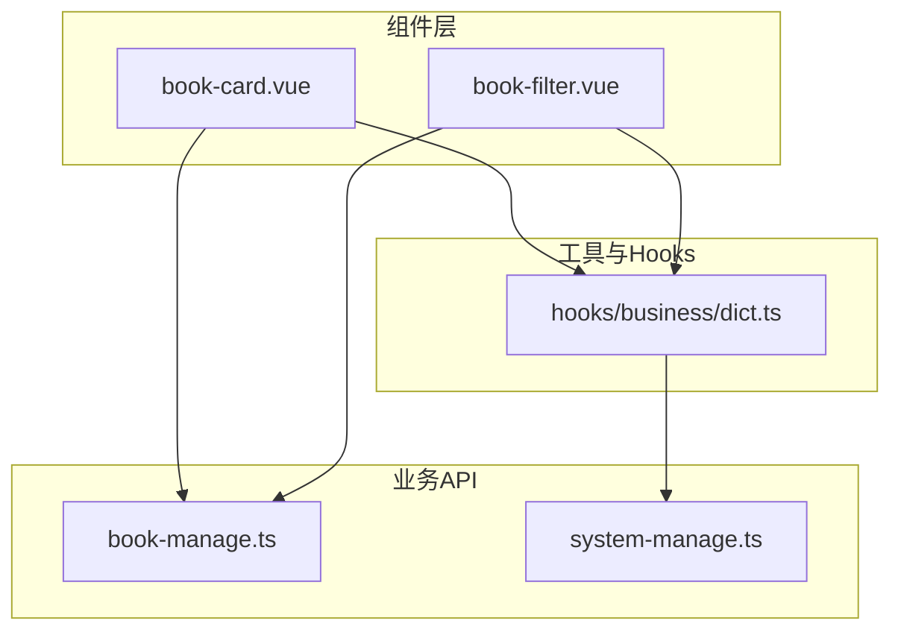
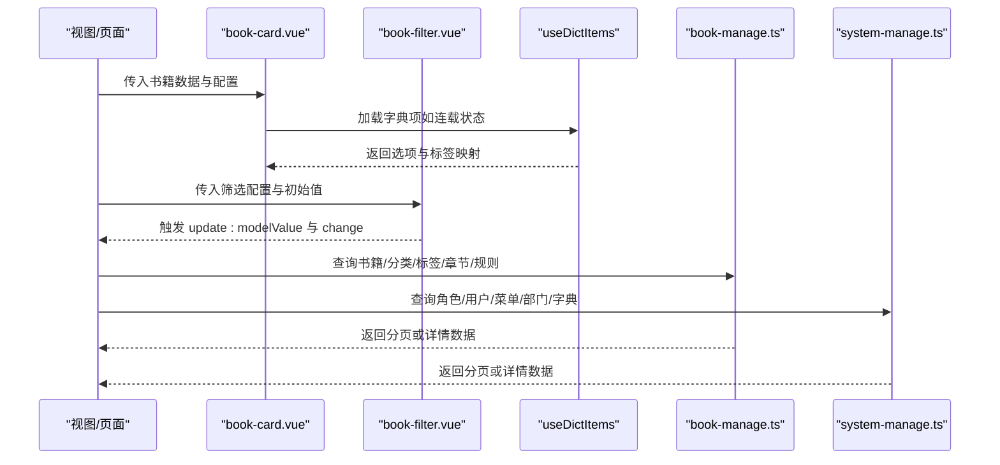
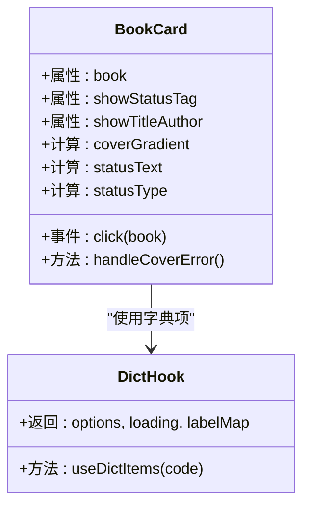
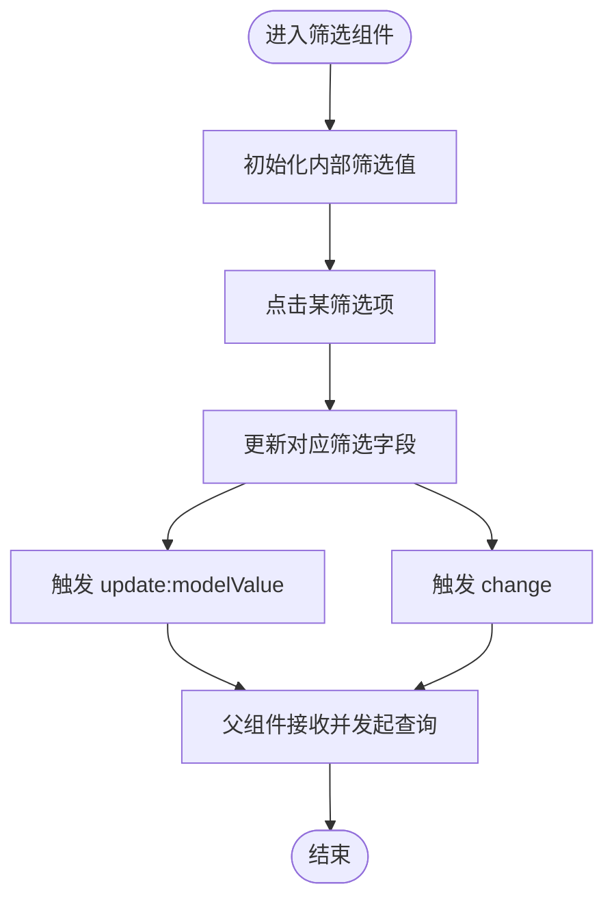
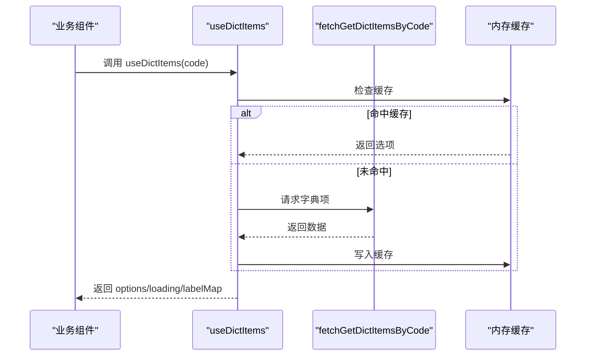
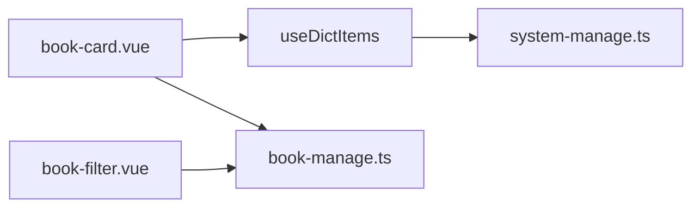

# 业务组件

<cite>
**本文引用的文件**
- [book-card.vue](file://app/web/src/components/book-card.vue)
- [book-filter.vue](file://app/web/src/components/book-filter.vue)
- [dict.ts](file://app/web/src/hooks/business/dict.ts)
- [book-manage.ts](file://app/web/src/service/api/book-manage.ts)
- [system-manage.ts](file://app/web/src/service/api/system-manage.ts)
</cite>

## 目录
1. [简介](#简介)
2. [项目结构](#项目结构)
3. [核心组件](#核心组件)
4. [架构总览](#架构总览)
5. [详细组件分析](#详细组件分析)
6. [依赖关系分析](#依赖关系分析)
7. [性能考量](#性能考量)
8. [故障排查指南](#故障排查指南)
9. [结论](#结论)
10. [附录](#附录)

## 简介
本文件聚焦 boread 项目的业务组件，围绕“图书”“系统管理”“字典管理”“规则管理”“标签管理”等模块，系统梳理组件设计思路、实现细节与交互流程。重点覆盖以下组件：
- 图书相关：book-card、book-filter、book-operate-modal、book-upload-modal、book-scan-modal、book-chapter-modal
- 系统管理：user-operate-drawer、role-operate-drawer、role-auth-modal、dept-operate-modal、dict-operate-modal、menu-operate-modal
- 字典管理：dict-item-operate-modal、dict-search
- 规则管理：chapter-rule-operate-modal、filter-rule-operate-modal
- 标签管理：tag-operate-modal

同时，文档阐述组件的业务逻辑、权限控制、表单验证、数据持久化策略，以及组件间交互模式、状态同步与错误处理机制，并提供使用示例、集成方案与扩展建议。

## 项目结构
前端采用 Vue 3 + Vite 架构，业务组件主要位于 src/components 与各视图模块的 modules 中；API 定义集中在 src/service/api 下，按业务域拆分（如 book-manage.ts、system-manage.ts）。字典项通过 hooks/dict.ts 提供统一加载与缓存能力。

图表来源
- [book-card.vue:1-122](file://app/web/src/components/book-card.vue#L1-L122)
- [book-filter.vue:1-139](file://app/web/src/components/book-filter.vue#L1-L139)
- [dict.ts:1-41](file://app/web/src/hooks/business/dict.ts#L1-L41)
- [book-manage.ts:1-380](file://app/web/src/service/api/book-manage.ts#L1-L380)
- [system-manage.ts:1-457](file://app/web/src/service/api/system-manage.ts#L1-L457)

章节来源
- [book-card.vue:1-122](file://app/web/src/components/book-card.vue#L1-L122)
- [book-filter.vue:1-139](file://app/web/src/components/book-filter.vue#L1-L139)
- [dict.ts:1-41](file://app/web/src/hooks/business/dict.ts#L1-L41)
- [book-manage.ts:1-380](file://app/web/src/service/api/book-manage.ts#L1-L380)
- [system-manage.ts:1-457](file://app/web/src/service/api/system-manage.ts#L1-L457)

## 核心组件
本节对关键业务组件进行概览性说明，后续章节深入到每个组件的具体实现与交互。

- 图书卡片组件（book-card）
  - 功能：展示书籍封面、标题、作者、连载状态标签；支持点击事件透传。
  - 特性：无封面时生成基于标题哈希的渐变占位背景；状态标签根据连载状态映射为不同主题色。
  - 数据来源：字典项“book_serial_status”用于状态标签文案映射。

- 图书筛选组件（book-filter）
  - 功能：多维度筛选（分类、连载状态、字数区间、标签、更新时间），支持筛选条件变更事件。
  - 特性：内部维护筛选值并双向触发 update:modelValue 与 change 事件，便于父组件监听与联动。

章节来源
- [book-card.vue:6-70](file://app/web/src/components/book-card.vue#L6-L70)
- [book-filter.vue:5-44](file://app/web/src/components/book-filter.vue#L5-L44)
- [dict.ts:8-39](file://app/web/src/hooks/business/dict.ts#L8-L39)

## 架构总览
业务组件与后端 API 的调用关系如下：

图表来源
- [book-card.vue:1-122](file://app/web/src/components/book-card.vue#L1-L122)
- [book-filter.vue:1-139](file://app/web/src/components/book-filter.vue#L1-L139)
- [dict.ts:1-41](file://app/web/src/hooks/business/dict.ts#L1-L41)
- [book-manage.ts:1-380](file://app/web/src/service/api/book-manage.ts#L1-L380)
- [system-manage.ts:1-457](file://app/web/src/service/api/system-manage.ts#L1-L457)

## 详细组件分析

### 图书卡片组件（book-card）
- 设计要点
  - 使用组合式 API 管理属性与事件，支持点击透传书籍对象。
  - 无封面时以标题哈希计算渐变背景，提升视觉一致性与可用性。
  - 基于字典项映射连载状态标签文本与颜色，增强语义表达。
- 关键行为
  - 点击事件：emit("click", book)，便于父组件打开详情或操作面板。
  - 封面加载失败回退：设置标志位并渲染占位背景。
- 数据绑定
  - 输入属性：book、showStatusTag、showTitleAuthor。
  - 输出事件：click。
- 性能与体验
  - 渐变背景计算在计算属性中完成，避免重复计算。
  - 图片懒加载与缩放过渡提升交互流畅度。

图表来源
- [book-card.vue:1-122](file://app/web/src/components/book-card.vue#L1-L122)
- [dict.ts:8-39](file://app/web/src/hooks/business/dict.ts#L8-L39)

章节来源
- [book-card.vue:6-70](file://app/web/src/components/book-card.vue#L6-L70)
- [dict.ts:8-39](file://app/web/src/hooks/business/dict.ts#L8-L39)

### 图书筛选组件（book-filter）
- 设计要点
  - 多维度筛选项：分类、连载状态、字数区间、标签、更新时间。
  - 内部使用 reactive 维护筛选值，统一通过 update:modelValue 与 change 事件向外广播。
- 关键行为
  - 点击筛选项切换对应字段值，实时触发变更通知。
  - 支持国际化文案（$t）与深色模式样式适配。
- 数据绑定
  - 输入属性：config（选项配置）、modelValue（初始筛选值）。
  - 输出事件：update:modelValue、change。
- 交互模式
  - 父组件监听 change 事件执行查询刷新，或结合防抖优化请求频率。

图表来源
- [book-filter.vue:27-44](file://app/web/src/components/book-filter.vue#L27-L44)

章节来源
- [book-filter.vue:5-44](file://app/web/src/components/book-filter.vue#L5-L44)

### 字典项加载 Hook（useDictItems）
- 设计要点
  - 以 code 为键缓存字典项，避免重复请求。
  - 自动过滤状态为启用的条目，转换为 SelectOption[] 结构。
  - 提供 labelMap 计算属性，便于组件直接映射状态码到标签文本。
- 性能与复用
  - 缓存命中优先，减少网络请求与转换成本。
  - 适用于多组件共享同一字典码的场景（如连载状态、性别、状态等）。

图表来源
- [dict.ts:20-35](file://app/web/src/hooks/business/dict.ts#L20-L35)
- [system-manage.ts:387-393](file://app/web/src/service/api/system-manage.ts#L387-L393)

章节来源
- [dict.ts:1-41](file://app/web/src/hooks/business/dict.ts#L1-L41)
- [system-manage.ts:387-393](file://app/web/src/service/api/system-manage.ts#L387-L393)

### 图书相关 API（book-manage.ts）
- 主要能力
  - 分类：树形/分页/详情/新增/编辑/删除；热门分类（公开接口）。
  - 标签：分页/详情/新增/编辑/删除。
  - 书籍：分页/详情/新增/编辑/删除/上下架状态更新。
  - 上传与扫描：文件上传、确认入库、扫描路径/全量扫描/按ID扫描、上传记录与文件记录分页。
  - 章节：分页/列表（不分页）/内容读取/重新识别章节。
  - 规则：章节识别规则与内容净化规则的分页/详情/新增/编辑/删除。
- 数据模型
  - 通用分页响应结构：records、current、size、total。
  - 请求/响应 DTO 与业务实体在 app/server/internal/dto 下定义（前端通过 API 文件对接）。
- 权限与安全
  - 管理端接口均受鉴权与权限中间件保护；公开接口（如热门分类、公开书籍详情、公开章节列表）无需登录。

章节来源
- [book-manage.ts:1-380](file://app/web/src/service/api/book-manage.ts#L1-L380)

### 系统管理 API（system-manage.ts）
- 主要能力
  - 角色：分页/全量/详情/新增/编辑/删除；授权菜单/按钮。
  - 用户：分页/详情/新增/编辑/删除；重置密码。
  - 菜单：分页/树形/详情/新增/编辑/删除；按菜单查按钮、新增/删除按钮。
  - 部门：树形/分页/详情/新增/编辑/删除。
  - 字典：分页/详情/新增/编辑/删除；按字典 ID/Code 查询项；新增/编辑/删除项。
  - 日志：登录日志/操作日志分页。
- 数据模型
  - 通用分页响应结构与角色/用户/菜单/部门/字典实体在 app/server/internal/dto 下定义。
- 权限与安全
  - 管理端接口受鉴权与权限中间件保护；菜单组件 key 列表由前端路由枚举提供。

章节来源
- [system-manage.ts:1-457](file://app/web/src/service/api/system-manage.ts#L1-L457)

## 依赖关系分析
- 组件与 Hook
  - book-card 依赖 useDictItems 获取字典项，实现状态标签文案与颜色映射。
  - book-filter 通过事件向上广播筛选值，父组件负责发起 API 查询。
- 组件与 API
  - 两类 API 文件分别承载“图书管理”与“系统管理”的后端接口，组件通过它们进行数据读写。
- 缓存与性能
  - useDictItems 内置缓存，降低重复请求与转换成本。
  - 图书卡片的渐变背景计算在组件内完成，避免外部依赖。

图表来源
- [book-card.vue:1-122](file://app/web/src/components/book-card.vue#L1-L122)
- [book-filter.vue:1-139](file://app/web/src/components/book-filter.vue#L1-L139)
- [dict.ts:1-41](file://app/web/src/hooks/business/dict.ts#L1-L41)
- [book-manage.ts:1-380](file://app/web/src/service/api/book-manage.ts#L1-L380)
- [system-manage.ts:1-457](file://app/web/src/service/api/system-manage.ts#L1-L457)

章节来源
- [book-card.vue:1-122](file://app/web/src/components/book-card.vue#L1-L122)
- [book-filter.vue:1-139](file://app/web/src/components/book-filter.vue#L1-L139)
- [dict.ts:1-41](file://app/web/src/hooks/business/dict.ts#L1-L41)
- [book-manage.ts:1-380](file://app/web/src/service/api/book-manage.ts#L1-L380)
- [system-manage.ts:1-457](file://app/web/src/service/api/system-manage.ts#L1-L457)

## 性能考量
- 组件渲染
  - 图书卡片使用懒加载与过渡动画，提升滚动与交互体验。
  - 渐变背景计算在计算属性中完成，避免重复计算。
- 数据加载
  - useDictItems 提供缓存，减少重复请求与转换。
  - 父组件在筛选变更时可结合防抖/节流，降低频繁请求带来的压力。
- 网络传输
  - 分页接口统一返回 records/current/size/total，便于前端做增量加载与缓存策略。

## 故障排查指南
- 字典项不显示或为空
  - 检查字典码是否正确；确认后端字典项状态为启用。
  - 查看 useDictItems 的缓存与加载逻辑是否正常。
- 筛选无效或未触发查询
  - 确认父组件是否监听 change 事件并发起查询。
  - 检查 update:modelValue 是否被正确接收与传递。
- 上传/扫描异常
  - 检查文件大小限制、格式要求与后端上传接口配置。
  - 关注进度回调与错误提示，必要时增加重试与降级策略。
- 权限不足
  - 确认用户角色与菜单/按钮授权是否完整。
  - 检查后端中间件是否正确拦截未授权访问。

章节来源
- [dict.ts:20-35](file://app/web/src/hooks/business/dict.ts#L20-L35)
- [book-filter.vue:39-43](file://app/web/src/components/book-filter.vue#L39-L43)
- [book-manage.ts:170-211](file://app/web/src/service/api/book-manage.ts#L170-L211)
- [system-manage.ts:73-108](file://app/web/src/service/api/system-manage.ts#L73-L108)

## 结论
本文件从组件设计、数据流、API 调用、权限与性能等多个维度，系统梳理了 boread 项目中的业务组件。通过统一的字典项加载 Hook 与清晰的 API 分层，组件具备良好的可复用性与可维护性。建议在实际集成中：
- 明确筛选与分页的联动策略，结合防抖与缓存优化请求频率。
- 在权限较严的场景下，确保角色授权与菜单/按钮授权一致。
- 对上传/扫描等耗时操作提供明确的进度反馈与错误提示。

## 附录
- 组件使用示例（概念性说明）
  - 图书卡片：在列表页传入书籍数据与开关参数，监听点击事件打开详情或操作面板。
  - 图书筛选：传入配置与初始值，监听 change 事件发起分页查询。
  - 字典项：在组件中调用 useDictItems(code)，使用 labelMap 映射状态码。
- 集成方案
  - 将 API 文件作为唯一数据源，组件仅负责 UI 与交互。
  - 在父组件中集中处理分页、筛选、权限校验与错误提示。
- 扩展指南
  - 新增字典码：在后端新增字典项并在前端通过 useDictItems(code) 使用。
  - 新增筛选维度：在 book-filter 中添加配置与事件，父组件扩展查询参数。
  - 新增业务模块：参考现有 API 文件命名与分页结构，保持前后端契约一致。