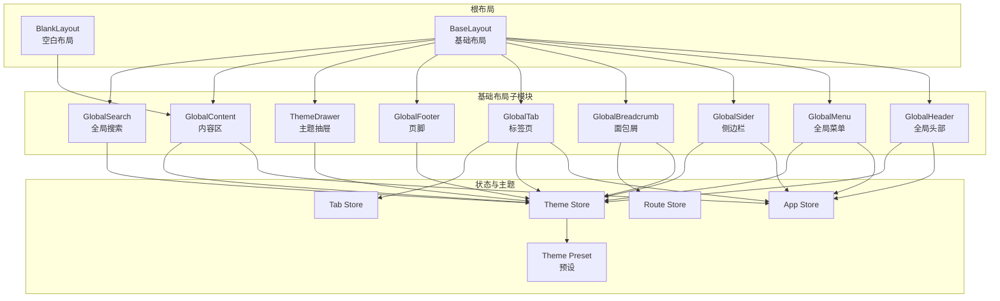
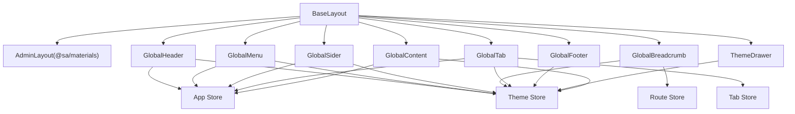
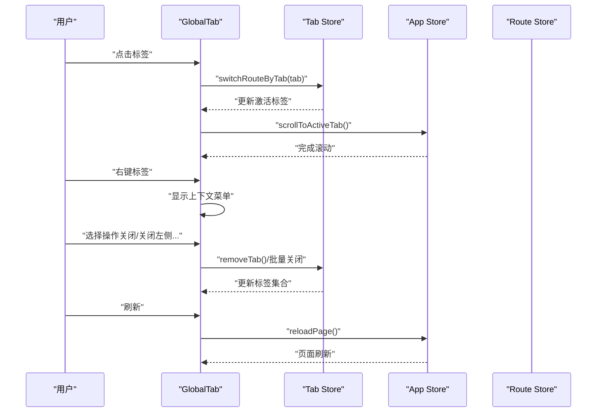
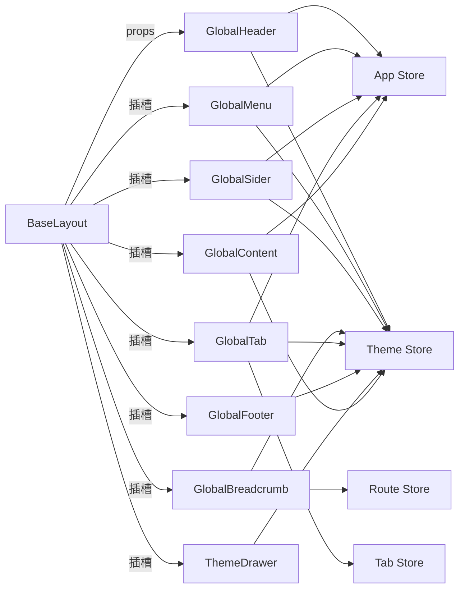

# 布局组件

<cite>
**本文引用的文件**
- [base-layout/index.vue](file://app/web/src/layouts/base-layout/index.vue)
- [blank-layout/index.vue](file://app/web/src/layouts/blank-layout/index.vue)
- [global-header/index.vue](file://app/web/src/layouts/modules/global-header/index.vue)
- [global-menu/index.vue](file://app/web/src/layouts/modules/global-menu/index.vue)
- [global-sider/index.vue](file://app/web/src/layouts/modules/global-sider/index.vue)
- [global-footer/index.vue](file://app/web/src/layouts/modules/global-footer/index.vue)
- [global-breadcrumb/index.vue](file://app/web/src/layouts/modules/global-breadcrumb/index.vue)
- [global-tab/index.vue](file://app/web/src/layouts/modules/global-tab/index.vue)
- [theme-drawer/index.vue](file://app/web/src/layouts/modules/theme-drawer/index.vue)
- [global-search/index.vue](file://app/web/src/layouts/modules/global-search/index.vue)
- [global-content/index.vue](file://app/web/src/layouts/modules/global-content/index.vue)
- [context/index.ts](file://app/web/src/layouts/modules/global-menu/context/index.ts)
- [index.ts](file://app/web/src/store/modules/app/index.ts)
- [index.ts](file://app/web/src/store/modules/theme/index.ts)
- [index.ts](file://app/web/src/store/modules/route/index.ts)
- [index.ts](file://app/web/src/store/modules/tab/index.ts)
- [settings.ts](file://app/web/src/theme/settings.ts)
- [vars.ts](file://app/web/src/theme/vars.ts)
- [preset/default.json](file://app/web/src/theme/preset/default.json)
- [preset/dark.json](file://app/web/src/theme/preset/dark.json)
- [preset/compact.json](file://app/web/src/theme/preset/compact.json)
- [preset/azir.json](file://app/web/src/theme/preset/azir.json)
</cite>

## 目录
1. [简介](#简介)
2. [项目结构](#项目结构)
3. [核心组件](#核心组件)
4. [架构总览](#架构总览)
5. [详细组件分析](#详细组件分析)
6. [依赖分析](#依赖分析)
7. [性能考虑](#性能考虑)
8. [故障排查指南](#故障排查指南)
9. [结论](#结论)
10. [附录](#附录)

## 简介
本文件系统性梳理 boread 项目的布局组件体系，围绕基础布局与空白布局两大根布局，以及全局头部、全局菜单、侧边栏、页脚、面包屑导航、标签页、主题抽屉、全局搜索等模块展开，阐述设计理念、实现原理、配置项、使用方式、组件协作关系、数据流与状态管理，并给出布局切换、响应式适配、主题定制的实践方案与最佳实践。

## 项目结构
布局相关代码主要位于前端工程的 src/layouts 目录下，采用“根布局 + 模块化子组件”的组织方式：
- 根布局：base-layout 与 blank-layout
- 子模块：global-header、global-menu、global-sider、global-footer、global-breadcrumb、global-tab、theme-drawer、global-search、global-content
- 状态管理：通过 app、theme、route、tab 四个 store 协同控制布局行为与外观
- 主题系统：settings、vars、preset 提供主题变量与预设

图表来源
- [base-layout/index.vue:1-163](file://app/web/src/layouts/base-layout/index.vue#L1-L163)
- [blank-layout/index.vue:1-14](file://app/web/src/layouts/blank-layout/index.vue#L1-L14)
- [global-header/index.vue:1-61](file://app/web/src/layouts/modules/global-header/index.vue#L1-L61)
- [global-menu/index.vue:1-41](file://app/web/src/layouts/modules/global-menu/index.vue#L1-L41)
- [global-sider/index.vue:1-37](file://app/web/src/layouts/modules/global-sider/index.vue#L1-L37)
- [global-footer/index.vue:1-16](file://app/web/src/layouts/modules/global-footer/index.vue#L1-L16)
- [global-breadcrumb/index.vue:1-48](file://app/web/src/layouts/modules/global-breadcrumb/index.vue#L1-L48)
- [global-tab/index.vue:1-234](file://app/web/src/layouts/modules/global-tab/index.vue#L1-L234)
- [theme-drawer/index.vue](file://app/web/src/layouts/modules/theme-drawer/index.vue)
- [global-search/index.vue](file://app/web/src/layouts/modules/global-search/index.vue)
- [global-content/index.vue](file://app/web/src/layouts/modules/global-content/index.vue)
- [index.ts](file://app/web/src/store/modules/app/index.ts)
- [index.ts](file://app/web/src/store/modules/theme/index.ts)
- [index.ts](file://app/web/src/store/modules/route/index.ts)
- [index.ts](file://app/web/src/store/modules/tab/index.ts)
- [settings.ts](file://app/web/src/theme/settings.ts)
- [vars.ts](file://app/web/src/theme/vars.ts)
- [preset/default.json](file://app/web/src/theme/preset/default.json)
- [preset/dark.json](file://app/web/src/theme/preset/dark.json)
- [preset/compact.json](file://app/web/src/theme/preset/compact.json)
- [preset/azir.json](file://app/web/src/theme/preset/azir.json)

章节来源
- [base-layout/index.vue:1-163](file://app/web/src/layouts/base-layout/index.vue#L1-L163)
- [blank-layout/index.vue:1-14](file://app/web/src/layouts/blank-layout/index.vue#L1-L14)

## 核心组件
- 基础布局（BaseLayout）
  - 职责：整合全局头部、侧边栏、菜单、标签页、内容区、页脚与主题抽屉；根据主题布局模式动态渲染不同菜单形态；统一处理滚动容器、固定顶部/底部、尺寸与可见性。
  - 关键点：基于主题 store 的布局模式选择具体菜单组件；计算侧边栏宽度与折叠宽度；透传滚动容器 ID、滚动模式、移动端标记、全屏内容标记等。
- 空白布局（BlankLayout）
  - 职责：最小化布局容器，仅承载内容区，关闭内边距，适合全屏页面或无头部/侧边栏场景。
- 全局头部（GlobalHeader）
  - 职责：集成 Logo、菜单切换器、菜单占位、面包屑、全局搜索、全屏、多语言、明暗主题切换、用户头像等。
  - 关键点：根据主题配置决定是否显示 Logo、菜单与菜单切换器；在非移动端展示面包屑；按需渲染搜索与多语言开关。
- 全局菜单（GlobalMenu）
  - 职责：根据当前布局模式动态选择并渲染对应菜单组件（垂直、水平、混合、上下/左右组合等）。
  - 关键点：通过映射表将布局模式映射到具体菜单组件；移动端垂直模式强制重渲染以修复交互问题。
- 侧边栏（GlobalSider）
  - 职责：在垂直布局下展示 Logo 与菜单区域；根据主题配置决定是否反色（深浅主题+模式组合）。
  - 关键点：在非垂直模式下隐藏 Logo 并调整菜单容器高度；结合头部高度设置 Logo 尺寸。
- 面包屑（GlobalBreadcrumb）
  - 职责：基于路由生成面包屑，支持下拉跳转与图标显示。
  - 关键点：复用模板组件定义面包屑内容；根据路由存储的面包屑列表渲染；点击下拉项触发路由跳转。
- 标签页（GlobalTab）
  - 职责：维护页面标签集合，支持拖动切换、右键上下文菜单、中键关闭、自动滚动至激活标签、刷新与全屏。
  - 关键点：BetterScroll 实现横向滚动；根据主题模式渲染不同样式；禁用保留标签的关闭能力；右键上下文菜单与禁用项逻辑。
- 页脚（GlobalFooter）
  - 职责：版权信息展示，支持暗色容器包裹。
- 主题抽屉（ThemeDrawer）
  - 职责：提供外观、通用、布局、预设等设置面板，支持主题颜色、圆角、明暗模式、布局模式、侧边栏/头部/页脚/内容区等配置。
- 全局搜索（GlobalSearch）
  - 职责：提供全局搜索入口与结果面板，按主题配置启用。
- 内容区（GlobalContent）
  - 职责：承载页面主体内容，支持是否显示内边距、滚动与全屏模式下的布局适配。

章节来源
- [base-layout/index.vue:1-163](file://app/web/src/layouts/base-layout/index.vue#L1-L163)
- [blank-layout/index.vue:1-14](file://app/web/src/layouts/blank-layout/index.vue#L1-L14)
- [global-header/index.vue:1-61](file://app/web/src/layouts/modules/global-header/index.vue#L1-L61)
- [global-menu/index.vue:1-41](file://app/web/src/layouts/modules/global-menu/index.vue#L1-L41)
- [global-sider/index.vue:1-37](file://app/web/src/layouts/modules/global-sider/index.vue#L1-L37)
- [global-footer/index.vue:1-16](file://app/web/src/layouts/modules/global-footer/index.vue#L1-L16)
- [global-breadcrumb/index.vue:1-48](file://app/web/src/layouts/modules/global-breadcrumb/index.vue#L1-L48)
- [global-tab/index.vue:1-234](file://app/web/src/layouts/modules/global-tab/index.vue#L1-L234)
- [theme-drawer/index.vue](file://app/web/src/layouts/modules/theme-drawer/index.vue)
- [global-search/index.vue](file://app/web/src/layouts/modules/global-search/index.vue)
- [global-content/index.vue](file://app/web/src/layouts/modules/global-content/index.vue)

## 架构总览
整体采用“根布局聚合 + 子模块解耦 + 状态驱动”的架构。根布局根据主题布局模式与应用状态动态装配各子模块；子模块之间通过 props 与事件进行有限交互；状态由四个 store 统一管理，主题系统提供预设与变量。

图表来源
- [base-layout/index.vue:1-163](file://app/web/src/layouts/base-layout/index.vue#L1-L163)
- [global-header/index.vue:1-61](file://app/web/src/layouts/modules/global-header/index.vue#L1-L61)
- [global-menu/index.vue:1-41](file://app/web/src/layouts/modules/global-menu/index.vue#L1-L41)
- [global-sider/index.vue:1-37](file://app/web/src/layouts/modules/global-sider/index.vue#L1-L37)
- [global-breadcrumb/index.vue:1-48](file://app/web/src/layouts/modules/global-breadcrumb/index.vue#L1-L48)
- [global-tab/index.vue:1-234](file://app/web/src/layouts/modules/global-tab/index.vue#L1-L234)
- [global-footer/index.vue:1-16](file://app/web/src/layouts/modules/global-footer/index.vue#L1-L16)
- [theme-drawer/index.vue](file://app/web/src/layouts/modules/theme-drawer/index.vue)
- [global-search/index.vue](file://app/web/src/layouts/modules/global-search/index.vue)
- [global-content/index.vue](file://app/web/src/layouts/modules/global-content/index.vue)
- [index.ts](file://app/web/src/store/modules/app/index.ts)
- [index.ts](file://app/web/src/store/modules/theme/index.ts)
- [index.ts](file://app/web/src/store/modules/route/index.ts)
- [index.ts](file://app/web/src/store/modules/tab/index.ts)

## 详细组件分析

### 基础布局（BaseLayout）
- 设计理念
  - 以“模式即组件”为核心：根据主题布局模式动态选择菜单组件，避免条件分支污染单文件。
  - 以“状态即配置”为原则：头部显示策略、侧边栏可见性、宽度计算均来自主题与应用状态。
  - 以“容器即边界”为约束：通过 AdminLayout 定义滚动容器、固定策略与尺寸边界。
- 关键实现
  - 布局模式判定：依据主题 store 的布局模式字符串判断 vertical/horizontal 及混合模式。
  - 头部属性派生：根据模式映射 showLogo/showMenu/showMenuToggler，部分模式下受首级菜单是否有子菜单影响。
  - 侧边栏宽度计算：综合主题宽度、折叠宽度、混合模式附加宽度、固定混合侧栏时的子菜单宽度。
  - 异步菜单加载：菜单组件异步加载，减少首屏体积。
- 数据流
  - 输入：主题 store（布局模式、滚动模式、头部/侧边栏/页脚/标签配置）、应用 store（移动端标记、全屏内容、侧栏折叠、内容可横向滚动）。
  - 输出：向 AdminLayout 传递尺寸、可见性、固定策略与滚动容器 ID；向子模块传递 props。
- 性能
  - 异步组件按需加载菜单；移动端垂直模式强制重渲染以修复交互；BetterScroll 仅在标签页启用横向滚动。

章节来源
- [base-layout/index.vue:1-163](file://app/web/src/layouts/base-layout/index.vue#L1-L163)

### 空白布局（BlankLayout）
- 设计理念：极简容器，去除一切装饰元素，仅承载内容区。
- 使用场景：登录页、公告页、全屏展示页等。
- 关键点：关闭内容区内边距，避免多余留白。

章节来源
- [blank-layout/index.vue:1-14](file://app/web/src/layouts/blank-layout/index.vue#L1-L14)

### 全局头部（GlobalHeader）
- 功能特性
  - 条件渲染 Logo、菜单切换器、菜单占位、面包屑。
  - 全局搜索、全屏、多语言、明暗主题切换、用户头像。
- 配置选项
  - showLogo、showMenuToggler、showMenu（由主题与布局模式共同决定）。
- 使用方法
  - 在基础布局的 header 插槽中注入；根据模式动态绑定属性。
- 交互流程
  - 菜单切换器点击切换侧栏折叠状态；搜索/全屏/多语言/主题切换/头像点击触发相应动作。

章节来源
- [global-header/index.vue:1-61](file://app/web/src/layouts/modules/global-header/index.vue#L1-L61)

### 全局菜单（GlobalMenu）
- 功能特性
  - 根据布局模式动态选择菜单组件，覆盖垂直、水平、混合与上下/左右组合模式。
  - 移动端垂直模式强制重渲染，解决菜单交互异常。
- 配置选项
  - 通过主题 store 的布局模式决定渲染哪个菜单。
- 使用方法
  - 在基础布局中直接引入，无需额外参数。
- 组件关系
  - 与上下文提供者配合，向混合模式菜单传递二级/子级菜单数据与首级菜单是否有子菜单的状态。

章节来源
- [global-menu/index.vue:1-41](file://app/web/src/layouts/modules/global-menu/index.vue#L1-L41)
- [context/index.ts](file://app/web/src/layouts/modules/global-menu/context/index.ts)

### 侧边栏（GlobalSider）
- 功能特性
  - 在垂直模式下显示 Logo 与菜单区域；根据主题配置决定是否反色。
  - 非垂直模式下隐藏 Logo 并调整菜单容器高度。
- 配置选项
  - 是否显示 Logo、菜单容器类名（含 Logo 时为 flex-1-hidden，否则为 h-full）。
- 使用方法
  - 在基础布局的 sider 插槽中注入；与头部高度联动设置 Logo 尺寸。

章节来源
- [global-sider/index.vue:1-37](file://app/web/src/layouts/modules/global-sider/index.vue#L1-L37)

### 面包屑（GlobalBreadcrumb）
- 功能特性
  - 基于路由生成面包屑；支持下拉跳转与图标显示。
  - 可配置是否显示图标与是否可见。
- 配置选项
  - 主题 store 中的面包屑可见性与图标显示。
- 使用方法
  - 在头部或需要的位置渲染；在移动端通常不显示面包屑。

章节来源
- [global-breadcrumb/index.vue:1-48](file://app/web/src/layouts/modules/global-breadcrumb/index.vue#L1-L48)

### 标签页（GlobalTab）
- 功能特性
  - 维护标签集合，支持拖动切换、右键上下文菜单、中键关闭、自动滚动至激活标签、刷新与全屏。
  - 支持多种标签样式（chrome/slider 等），与主题颜色联动。
- 配置选项
  - 主题 store 中的标签模式、是否可见、高度、是否允许中键关闭等。
- 使用方法
  - 在基础布局的 tab 插槽中注入；初始化时根据当前路由添加标签。
- 交互流程
  - 切换标签触发路由切换；右键弹出上下文菜单；中键关闭非保留标签；自动滚动至激活标签。

图表来源
- [global-tab/index.vue:1-234](file://app/web/src/layouts/modules/global-tab/index.vue#L1-L234)
- [index.ts](file://app/web/src/store/modules/tab/index.ts)
- [index.ts](file://app/web/src/store/modules/app/index.ts)
- [index.ts](file://app/web/src/store/modules/route/index.ts)

章节来源
- [global-tab/index.vue:1-234](file://app/web/src/layouts/modules/global-tab/index.vue#L1-L234)

### 页脚（GlobalFooter）
- 功能特性
  - 展示版权信息，支持暗色容器包裹。
- 使用方法
  - 在基础布局的 footer 插槽中注入；由主题 store 控制可见性与固定位置。

章节来源
- [global-footer/index.vue:1-16](file://app/web/src/layouts/modules/global-footer/index.vue#L1-L16)

### 主题抽屉（ThemeDrawer）
- 功能特性
  - 提供外观、通用、布局、预设等设置面板，支持主题颜色、圆角、明暗模式、布局模式、侧边栏/头部/页脚/内容区等配置。
- 使用方法
  - 在基础布局中注入；与主题 store 协同工作，实时更新主题变量与预设。

章节来源
- [theme-drawer/index.vue](file://app/web/src/layouts/modules/theme-drawer/index.vue)

### 全局搜索（GlobalSearch）
- 功能特性
  - 提供全局搜索入口与结果面板，按主题配置启用。
- 使用方法
  - 在头部按需渲染；与全局搜索功能模块协同工作。

章节来源
- [global-search/index.vue](file://app/web/src/layouts/modules/global-search/index.vue)

### 内容区（GlobalContent）
- 功能特性
  - 承载页面主体内容，支持是否显示内边距、滚动与全屏模式下的布局适配。
- 使用方法
  - 在基础布局中注入；在空白布局中作为唯一子节点。

章节来源
- [global-content/index.vue](file://app/web/src/layouts/modules/global-content/index.vue)

## 依赖分析
- 组件耦合
  - BaseLayout 对各子模块存在强依赖，但通过插槽与 props 解耦；子模块间低耦合，通过状态 store 间接通信。
  - GlobalMenu 与上下文提供者存在直接依赖，用于混合模式菜单的数据传递。
- 状态依赖
  - App Store：移动端标记、全屏内容、侧栏折叠、页面刷新标志、内容横向滚动。
  - Theme Store：布局模式、滚动模式、头部/侧边栏/页脚/标签配置、主题方案与颜色。
  - Route Store：路由元信息与面包屑数据。
  - Tab Store：标签集合、激活标签、标签保留策略。
- 外部依赖
  - @sa/materials 的 AdminLayout 与 PageTab 提供布局容器与标签渲染能力。
  - VueUse 提供全屏、滚动边界检测等工具。
  - Naive UI 提供 Breadcrumb、Dropdown、Button 等组件。

图表来源
- [base-layout/index.vue:1-163](file://app/web/src/layouts/base-layout/index.vue#L1-L163)
- [global-header/index.vue:1-61](file://app/web/src/layouts/modules/global-header/index.vue#L1-L61)
- [global-menu/index.vue:1-41](file://app/web/src/layouts/modules/global-menu/index.vue#L1-L41)
- [global-sider/index.vue:1-37](file://app/web/src/layouts/modules/global-sider/index.vue#L1-L37)
- [global-breadcrumb/index.vue:1-48](file://app/web/src/layouts/modules/global-breadcrumb/index.vue#L1-L48)
- [global-tab/index.vue:1-234](file://app/web/src/layouts/modules/global-tab/index.vue#L1-L234)
- [global-footer/index.vue:1-16](file://app/web/src/layouts/modules/global-footer/index.vue#L1-L16)
- [theme-drawer/index.vue](file://app/web/src/layouts/modules/theme-drawer/index.vue)
- [global-search/index.vue](file://app/web/src/layouts/modules/global-search/index.vue)
- [global-content/index.vue](file://app/web/src/layouts/modules/global-content/index.vue)
- [index.ts](file://app/web/src/store/modules/app/index.ts)
- [index.ts](file://app/web/src/store/modules/theme/index.ts)
- [index.ts](file://app/web/src/store/modules/route/index.ts)
- [index.ts](file://app/web/src/store/modules/tab/index.ts)

章节来源
- [base-layout/index.vue:1-163](file://app/web/src/layouts/base-layout/index.vue#L1-L163)
- [global-menu/index.vue:1-41](file://app/web/src/layouts/modules/global-menu/index.vue#L1-L41)
- [index.ts](file://app/web/src/store/modules/app/index.ts)
- [index.ts](file://app/web/src/store/modules/theme/index.ts)
- [index.ts](file://app/web/src/store/modules/route/index.ts)
- [index.ts](file://app/web/src/store/modules/tab/index.ts)

## 性能考虑
- 按需加载
  - 菜单组件异步加载，降低首屏体积与首次渲染时间。
- 渲染优化
  - 移动端垂直模式强制重渲染，确保菜单交互稳定。
  - 标签页使用 BetterScroll 进行横向滚动，避免布局抖动。
- 状态缓存
  - 通过 store 缓存布局与主题配置，减少重复计算。
- 滚动与尺寸
  - 通过 AdminLayout 的滚动容器与固定策略，避免滚动穿透与布局错位。

## 故障排查指南
- 菜单不显示或显示异常
  - 检查主题 store 的布局模式是否正确；确认 GlobalMenu 的模式映射是否存在对应组件。
  - 移动端垂直模式下，确认是否强制重渲染。
- 侧边栏宽度异常
  - 检查主题 store 的侧边栏宽度、折叠宽度与混合模式附加宽度配置；确认混合侧栏固定与子菜单宽度叠加逻辑。
- 标签页无法滚动或滚动错位
  - 检查 BetterScroll 初始化参数与容器尺寸；确认激活标签定位与滚动目标值计算。
- 面包屑不显示
  - 检查主题 store 中面包屑可见性与图标显示配置；确认路由 store 的面包屑数据是否正确生成。
- 头部元素错位
  - 检查头部属性派生逻辑（Logo/菜单/菜单切换器）与移动端适配；确认与侧边栏宽度联动。

章节来源
- [base-layout/index.vue:1-163](file://app/web/src/layouts/base-layout/index.vue#L1-L163)
- [global-menu/index.vue:1-41](file://app/web/src/layouts/modules/global-menu/index.vue#L1-L41)
- [global-sider/index.vue:1-37](file://app/web/src/layouts/modules/global-sider/index.vue#L1-L37)
- [global-tab/index.vue:1-234](file://app/web/src/layouts/modules/global-tab/index.vue#L1-L234)
- [global-breadcrumb/index.vue:1-48](file://app/web/src/layouts/modules/global-breadcrumb/index.vue#L1-L48)
- [global-header/index.vue:1-61](file://app/web/src/layouts/modules/global-header/index.vue#L1-L61)

## 结论
boread 的布局组件体系以“模式即组件、状态即配置”为核心设计思想，通过根布局聚合与子模块解耦，实现了高度可配置、可扩展且性能友好的布局方案。借助主题系统与多个 store 的协同，布局在不同设备与模式下均能保持一致的用户体验。建议在实际项目中遵循本文档的最佳实践，合理使用异步组件、状态缓存与滚动优化，持续提升性能与稳定性。

## 附录
- 布局切换与响应式适配
  - 通过主题 store 的布局模式字段切换布局模式；移动端通过 App Store 的 isMobile 标记进行差异化渲染。
  - 侧边栏宽度与可见性由 BaseLayout 计算并传递给 AdminLayout；头部属性根据模式映射动态生成。
- 主题定制
  - 通过 Theme Drawer 设置外观、通用、布局与预设；主题变量与预设位于 theme 目录，支持多套预设切换。
- 组合使用示例
  - 基础布局：在路由出口处使用 BaseLayout 包裹，按需开启标签页、侧边栏与页脚。
  - 空白布局：在登录页等场景使用 BlankLayout，仅承载内容区。
  - 自定义头部：在 GlobalHeader 中按需增删搜索、全屏、多语言、主题切换等控件。
  - 自定义菜单：在 GlobalMenu 中新增菜单组件并在模式映射中注册；或通过上下文提供者扩展混合模式数据。

章节来源
- [settings.ts](file://app/web/src/theme/settings.ts)
- [vars.ts](file://app/web/src/theme/vars.ts)
- [preset/default.json](file://app/web/src/theme/preset/default.json)
- [preset/dark.json](file://app/web/src/theme/preset/dark.json)
- [preset/compact.json](file://app/web/src/theme/preset/compact.json)
- [preset/azir.json](file://app/web/src/theme/preset/azir.json)