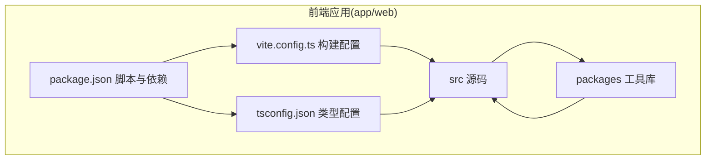
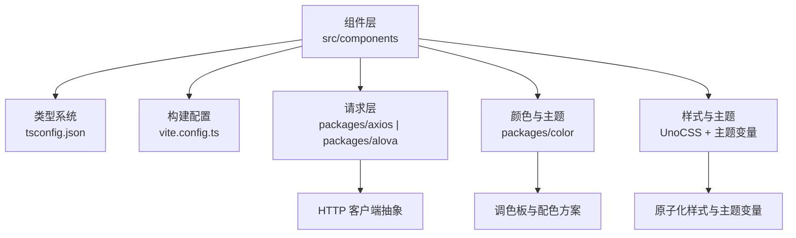
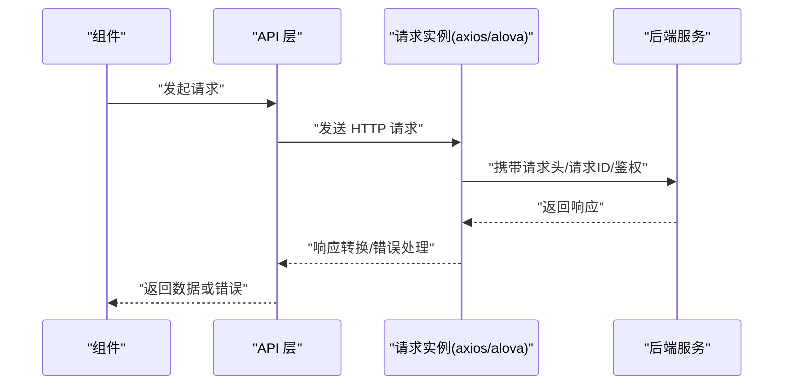
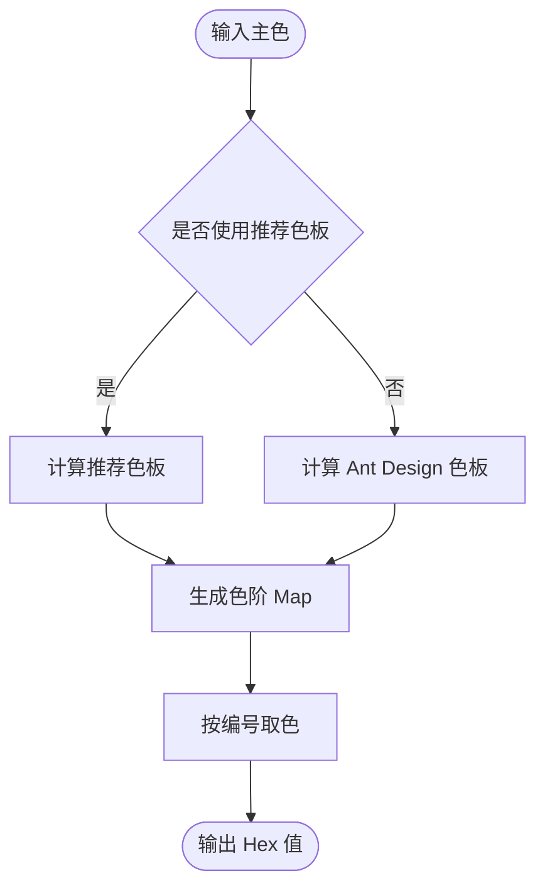
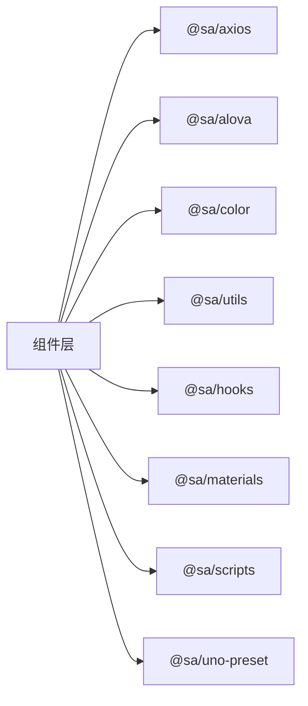

# 组件开发指南

<cite>
**本文引用的文件**
- [package.json](file://app/web/package.json)
- [vite.config.ts](file://app/web/vite.config.ts)
- [tsconfig.json](file://app/web/tsconfig.json)
- [packages/color/src/index.ts](file://app/web/packages/color/src/index.ts)
- [packages/color/src/palette/index.ts](file://app/web/packages/color/src/palette/index.ts)
- [packages/axios/src/index.ts](file://app/web/packages/axios/src/index.ts)
- [packages/alova/src/index.ts](file://app/web/packages/alova/src/index.ts)
</cite>

## 目录
1. [简介](#简介)
2. [项目结构](#项目结构)
3. [核心组件](#核心组件)
4. [架构总览](#架构总览)
5. [详细组件分析](#详细组件分析)
6. [依赖分析](#依赖分析)
7. [性能考虑](#性能考虑)
8. [故障排查指南](#故障排查指南)
9. [结论](#结论)
10. [附录](#附录)

## 简介
本指南面向在 boread 项目中进行组件开发的工程师，系统性地介绍组件设计原则、命名规范、文件组织、TypeScript 类型定义、Props 接口设计、事件处理机制、插槽使用、样式封装等标准流程与最佳实践。同时，结合 packages 目录下的工具库（utils、hooks、materials、axios、alova、color、scripts、uno-preset），给出使用方法与集成方式，并覆盖组件测试策略、文档编写规范、版本管理与发布流程，提供组件开发模板、代码生成脚本与自动化工具配置建议，以及性能优化、内存管理、渲染优化、懒加载实现等工程化实践。

## 项目结构
boread 前端采用 Vite + Vue3 + TypeScript + NaiveUI + UnoCSS 技术栈，组件位于 src/components 下，工具库集中于 packages 目录。构建与开发环境通过 vite.config.ts 配置，TypeScript 编译选项由 tsconfig.json 控制。

图表来源
- [vite.config.ts:1-52](file://app/web/vite.config.ts#L1-L52)
- [tsconfig.json:1-26](file://app/web/tsconfig.json#L1-L26)
- [package.json:1-108](file://app/web/package.json#L1-L108)

章节来源
- [vite.config.ts:1-52](file://app/web/vite.config.ts#L1-L52)
- [tsconfig.json:1-26](file://app/web/tsconfig.json#L1-L26)
- [package.json:1-108](file://app/web/package.json#L1-L108)

## 核心组件
- 设计原则
  - 单一职责：每个组件聚焦一个功能域，避免“上帝组件”。
  - 可复用性：通过 Props、Events、Slots 解耦，支持多场景复用。
  - 可测试性：保持纯函数逻辑与副作用分离，便于单元测试。
  - 可维护性：清晰的命名、稳定的 API、完善的类型约束。
- 命名规范
  - 文件命名：PascalCase.vue（如 BookCard.vue、BookFilter.vue）。
  - 组件导出：默认导出组件对象，必要时提供命名导出（如模块化导出）。
  - 插槽命名：语义化命名，如 header、default、footer；避免使用 HTML 元素名。
- 文件组织
  - 组件文件：src/components/业务域/组件名.vue。
  - 样式：同名 SCSS 或 CSS 文件，或在组件内使用 scoped 样式。
  - 类型：与组件同级的 d.ts 或在 src/typings 中集中管理。
- TypeScript 类型定义
  - Props 使用接口或联合类型定义，严格区分可选与必选属性。
  - Events 使用 emits 定义事件签名，统一事件前缀与数据结构。
  - Slots 使用 Slot 类型描述，明确默认插槽与具名插槽。
- Props 接口设计
  - 必需字段优先，非必需字段使用可选属性。
  - 默认值在组件内部通过 default 或 provide/inject 处理。
  - 对外暴露的 Props 应尽量轻量，避免传递复杂对象。
- 事件处理机制
  - 使用 emits 明确声明事件，避免隐式事件。
  - 事件回调参数应包含上下文信息（如当前值、索引、源事件）。
  - 对高频事件使用防抖/节流，避免重复渲染。
- 插槽使用
  - 提供默认插槽与具名插槽，保持向后兼容。
  - 插槽内容尽量无状态，必要时通过 props 传入。
- 样式封装
  - 优先使用 scoped 样式，避免全局污染。
  - 使用 UnoCSS 原子类与主题变量，统一风格。
  - 避免深度选择器，必要时使用 ::v-deep 并配合明确作用域。

章节来源
- [package.json:1-108](file://app/web/package.json#L1-L108)
- [vite.config.ts:1-52](file://app/web/vite.config.ts#L1-L52)
- [tsconfig.json:1-26](file://app/web/tsconfig.json#L1-L26)

## 架构总览
组件开发围绕以下关键点展开：构建与别名解析、类型系统、请求层抽象、颜色与主题工具、样式原子化与主题变量。

图表来源
- [vite.config.ts:1-52](file://app/web/vite.config.ts#L1-L52)
- [tsconfig.json:1-26](file://app/web/tsconfig.json#L1-L26)
- [packages/axios/src/index.ts:1-180](file://app/web/packages/axios/src/index.ts#L1-L180)
- [packages/alova/src/index.ts:1-78](file://app/web/packages/alova/src/index.ts#L1-L78)
- [packages/color/src/index.ts:1-8](file://app/web/packages/color/src/index.ts#L1-L8)

## 详细组件分析

### 请求层抽象：axios 与 alova
- 设计目标
  - 统一拦截器、重试、错误处理、响应转换。
  - 支持取消请求、请求 ID、并发控制。
- 关键能力
  - 创建请求实例与扁平化请求实例，分别用于不同场景。
  - 自动注入请求 ID，便于日志追踪与问题定位。
  - 后端错误码与错误处理钩子，保证一致的错误体验。
- 使用建议
  - 在服务层封装具体 API，组件仅消费 API 返回的数据。
  - 对长耗时请求启用取消能力，避免内存泄漏。
  - 对频繁请求使用缓存策略或去抖，降低网络压力。

图表来源
- [packages/axios/src/index.ts:107-132](file://app/web/packages/axios/src/index.ts#L107-L132)
- [packages/axios/src/index.ts:142-175](file://app/web/packages/axios/src/index.ts#L142-L175)
- [packages/alova/src/index.ts:11-73](file://app/web/packages/alova/src/index.ts#L11-L73)

章节来源
- [packages/axios/src/index.ts:1-180](file://app/web/packages/axios/src/index.ts#L1-L180)
- [packages/alova/src/index.ts:1-78](file://app/web/packages/alova/src/index.ts#L1-L78)

### 颜色与主题工具：color 包
- 设计目标
  - 提供从主色生成完整色阶的能力，支持推荐色板与 Ant Design 色板。
  - 将颜色映射为 Map，便于按编号快速取色。
- 关键能力
  - 根据主色生成色阶 Map，支持按编号取色。
  - 支持推荐色板与 Ant Design 色板两种策略。
- 使用建议
  - 在主题切换时，优先使用推荐色板以获得更佳的视觉效果。
  - 将色板常量与主题变量结合，统一管理品牌色与功能色。

图表来源
- [packages/color/src/palette/index.ts:13-45](file://app/web/packages/color/src/palette/index.ts#L13-L45)

章节来源
- [packages/color/src/index.ts:1-8](file://app/web/packages/color/src/index.ts#L1-L8)
- [packages/color/src/palette/index.ts:1-46](file://app/web/packages/color/src/palette/index.ts#L1-L46)

### 构建与别名解析
- 别名
  - ~ 指向项目根目录，@ 指向 src 目录，便于跨层级导入。
- 插件与预处理器
  - 通过 setupVitePlugins 注入开发与生产所需插件。
  - SCSS 预设统一引入全局样式，确保组件样式一致性。
- 开发与预览
  - dev 模式默认端口 9527，自动打开浏览器。
  - 预览模式端口 9725，模拟生产环境。

章节来源
- [vite.config.ts:14-50](file://app/web/vite.config.ts#L14-L50)

### 类型系统与路径映射
- 编译选项
  - 严格模式开启，严格空值检查，提升类型安全。
  - JSX 保留，支持 Vue JSX 场景。
- 路径映射
  - @/* 与 ~/* 映射到 src 与根目录，减少相对路径复杂度。
- 类型声明
  - 引入 Vite、Node、图标类型与 Naive UI 的类型声明，增强 IDE 支持。

章节来源
- [tsconfig.json:2-22](file://app/web/tsconfig.json#L2-L22)

## 依赖分析
- 依赖关系
  - 组件层依赖类型系统与构建配置，间接依赖请求层与颜色工具。
  - 请求层与颜色工具作为独立包被组件层引用。
- 脚本与工作流
  - 通过 package.json 的 scripts 统一执行开发、构建、格式化、类型检查、提交校验等任务。
  - 使用 simple-git-hooks 在本地钩子中执行类型检查、代码规范与格式化。

图表来源
- [package.json:46-68](file://app/web/package.json#L46-L68)
- [package.json:72-73](file://app/web/package.json#L72-L73)

章节来源
- [package.json:1-108](file://app/web/package.json#L1-L108)

## 性能考虑
- 渲染优化
  - 使用 v-memo 缓存昂贵的子树，减少不必要的重渲染。
  - 合理拆分组件，避免单个组件过大导致重渲染范围扩大。
- 内存管理
  - 在组件卸载时清理定时器、订阅与事件监听，避免内存泄漏。
  - 对长列表使用虚拟滚动，限制 DOM 节点数量。
- 懒加载
  - 使用动态 import 实现路由级与组件级懒加载，降低首屏体积。
  - 结合占位骨架屏与加载指示器，改善用户体验。
- 请求优化
  - 合并请求、设置合理的超时与重试策略，避免频繁失败重试。
  - 对可缓存数据使用缓存策略，减少重复请求。
- 样式与主题
  - 使用 UnoCSS 原子类减少样式体积，避免重复定义。
  - 主题变量集中管理，避免硬编码颜色与尺寸。

## 故障排查指南
- 常见问题
  - 类型错误：检查 tsconfig.json 的编译选项与路径映射，确保类型声明正确。
  - 构建失败：确认 vite.config.ts 的插件配置与别名设置，检查环境变量。
  - 请求异常：核对 axios/alova 的拦截器与错误处理钩子，关注后端错误码。
  - 样式冲突：检查 scoped 样式与深度选择器使用，避免全局污染。
- 调试建议
  - 使用浏览器开发者工具定位渲染与网络问题。
  - 在组件中添加日志与断点，逐步缩小问题范围。
  - 对请求层增加请求 ID 与时间戳，便于问题追踪。

章节来源
- [packages/axios/src/index.ts:53-85](file://app/web/packages/axios/src/index.ts#L53-L85)
- [packages/alova/src/index.ts:44-69](file://app/web/packages/alova/src/index.ts#L44-L69)

## 结论
本指南从设计原则、文件组织、类型系统、请求层抽象、颜色与主题工具、构建与别名解析等方面，给出了 boread 项目组件开发的标准化流程与最佳实践。结合 packages 目录下的工具库，能够显著提升组件的可复用性、可测试性与可维护性。建议在团队内推广统一的开发模板与自动化工具配置，持续优化性能与用户体验。

## 附录
- 组件开发模板与代码生成脚本
  - 建议在项目根目录提供脚手架命令，自动生成组件文件、类型定义与测试文件。
  - 使用 plop 或类似的模板引擎，结合现有目录结构与命名规范。
- 文档编写规范
  - 组件文档应包含：用途、Props、Events、Slots、插槽示例、使用示例、注意事项。
  - 使用 Markdown 与组件注释相结合，便于生成文档站点。
- 版本管理与发布流程
  - 使用语义化版本号，变更日志记录重大改动。
  - 发布前执行类型检查、代码规范与格式化，确保质量门槛。
- 第三方库集成与自定义 Hook 开发
  - 对第三方库进行薄封装，暴露稳定 API，便于替换与升级。
  - 自定义 Hook 应遵循单一职责，提供清晰的输入输出与副作用说明。