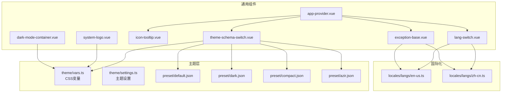

# 通用组件

<cite>
**本文引用的文件**
- [system-logo.vue](file://app/web/src/components/common/system-logo.vue)
- [dark-mode-container.vue](file://app/web/src/components/common/dark-mode-container.vue)
- [full-screen.vue](file://app/web/src/components/common/full-screen.vue)
- [lang-switch.vue](file://app/web/src/components/common/lang-switch.vue)
- [theme-schema-switch.vue](file://app/web/src/components/common/theme-schema-switch.vue)
- [menu-toggler.vue](file://app/web/src/components/common/menu-toggler.vue)
- [reload-button.vue](file://app/web/src/components/common/reload-button.vue)
- [pin-toggler.vue](file://app/web/src/components/common/pin-toggler.vue)
- [icon-tooltip.vue](file://app/web/src/components/common/icon-tooltip.vue)
- [exception-base.vue](file://app/web/src/components/common/exception-base.vue)
- [app-provider.vue](file://app/web/src/components/common/app-provider.vue)
- [button-icon.vue](file://app/web/src/components/custom/button-icon.vue)
- [svg-icon.vue](file://app/web/src/components/custom/svg-icon.vue)
- [better-scroll.vue](file://app/web/src/components/custom/better-scroll.vue)
- [count-to.vue](file://app/web/src/components/custom/count-to.vue)
- [look-forward.vue](file://app/web/src/components/custom/look-forward.vue)
- [soybean-avatar.vue](file://app/web/src/components/custom/soybean-avatar.vue)
- [wave-bg.vue](file://app/web/src/components/custom/wave-bg.vue)
- [table-column-setting.vue](file://app/web/src/components/advanced/table-column-setting.vue)
- [table-header-operation.vue](file://app/web/src/components/advanced/table-header-operation.vue)
- [main.ts](file://app/web/src/main.ts)
- [index.ts](file://app/web/src/plugins/index.ts)
- [en-us.ts](file://app/web/src/locales/langs/en-us.ts)
- [zh-cn.ts](file://app/web/src/locales/langs/zh-cn.ts)
- [global.css](file://app/web/src/styles/css/global.css)
- [global.scss](file://app/web/src/styles/scss/global.scss)
- [vars.ts](file://app/web/src/theme/vars.ts)
- [settings.ts](file://app/web/src/theme/settings.ts)
- [preset/default.json](file://app/web/src/theme/preset/default.json)
- [preset/dark.json](file://app/web/src/theme/preset/dark.json)
- [preset/compact.json](file://app/web/src/theme/preset/compact.json)
- [preset/azir.json](file://app/web/src/theme/preset/azir.json)
</cite>

## 目录
1. [简介](#简介)
2. [项目结构](#项目结构)
3. [核心组件](#核心组件)
4. [架构总览](#架构总览)
5. [详细组件分析](#详细组件分析)
6. [依赖关系分析](#依赖关系分析)
7. [性能考虑](#性能考虑)
8. [故障排查指南](#故障排查指南)
9. [结论](#结论)
10. [附录](#附录)

## 简介
本文件面向boread前端工程中的通用组件，系统梳理并深入解析以下组件群的设计原则与实现方案：
- 系统通用组件：system-logo、dark-mode-container、full-screen、lang-switch、theme-schema-switch、menu-toggler、reload-button、pin-toggler、icon-tooltip、exception-base、app-provider
- 自定义组件：svg-icon、wave-bg、count-to、button-icon、look-forward、soybean-avatar、better-scroll
- 高级表格组件：table-column-setting、table-header-operation

重点覆盖功能特性、属性配置、事件回调、样式定制；阐述可复用性设计、主题适配、国际化支持、无障碍访问；并提供生命周期管理、性能优化、内存泄漏防护建议，以及组合使用模式、最佳实践与扩展开发指南。

## 项目结构
通用组件主要位于 src/components/common、src/components/custom、src/components/advanced 三个目录下，配合插件、主题、国际化与全局样式共同构成组件生态。

```mermaid
graph TB
subgraph "通用组件(common)"
SL["system-logo.vue"]
DMC["dark-mode-container.vue"]
FS["full-screen.vue"]
LS["lang-switch.vue"]
TSS["theme-schema-switch.vue"]
MT["menu-toggler.vue"]
RB["reload-button.vue"]
PT["pin-toggler.vue"]
IT["icon-tooltip.vue"]
EB["exception-base.vue"]
AP["app-provider.vue"]
end
subgraph "自定义组件(custom)"
BI["button-icon.vue"]
SI["svg-icon.vue"]
BS["better-scroll.vue"]
CT["count-to.vue"]
LF["look-forward.vue"]
SA["soybean-avatar.vue"]
WB["wave-bg.vue"]
end
subgraph "高级表格(advanced)"
TCS["table-column-setting.vue"]
THO["table-header-operation.vue"]
end
subgraph "运行时支撑"
MAIN["main.ts"]
PLG["plugins/index.ts"]
LOCALE_EN["locales/langs/en-us.ts"]
LOCALE_ZH["locales/langs/zh-cn.ts"]
THEME_VARS["theme/vars.ts"]
THEME_SETTINGS["theme/settings.ts"]
THEME_PRESET_DEFAULT["theme/preset/default.json"]
THEME_PRESET_DARK["theme/preset/dark.json"]
THEME_PRESET_COMPACT["theme/preset/compact.json"]
THEME_PRESET_AZIR["theme/preset/azir.json"]
GLOBAL_CSS["styles/css/global.css"]
GLOBAL_SCSS["styles/scss/global.scss"]
end
MAIN --> PLG
AP --> BI
AP --> SI
AP --> CT
AP --> LF
AP --> SA
AP --> WB
AP --> BS
AP --> TCS
AP --> THO
SL --> THEME_VARS
DMC --> THEME_VARS
TSS --> THEME_PRESET_DEFAULT
TSS --> THEME_PRESET_DARK
TSS --> THEME_PRESET_COMPACT
TSS --> THEME_PRESET_AZIR
LS --> LOCALE_EN
LS --> LOCALE_ZH
EB --> LOCALE_EN
EB --> LOCALE_ZH
AP --> GLOBAL_CSS
AP --> GLOBAL_SCSS
```

图示来源
- [main.ts](file://app/web/src/main.ts)
- [index.ts](file://app/web/src/plugins/index.ts)
- [system-logo.vue](file://app/web/src/components/common/system-logo.vue)
- [dark-mode-container.vue](file://app/web/src/components/common/dark-mode-container.vue)
- [theme-schema-switch.vue](file://app/web/src/components/common/theme-schema-switch.vue)
- [lang-switch.vue](file://app/web/src/components/common/lang-switch.vue)
- [exception-base.vue](file://app/web/src/components/common/exception-base.vue)
- [app-provider.vue](file://app/web/src/components/common/app-provider.vue)
- [button-icon.vue](file://app/web/src/components/custom/button-icon.vue)
- [svg-icon.vue](file://app/web/src/components/custom/svg-icon.vue)
- [better-scroll.vue](file://app/web/src/components/custom/better-scroll.vue)
- [count-to.vue](file://app/web/src/components/custom/count-to.vue)
- [look-forward.vue](file://app/web/src/components/custom/look-forward.vue)
- [soybean-avatar.vue](file://app/web/src/components/custom/soybean-avatar.vue)
- [wave-bg.vue](file://app/web/src/components/custom/wave-bg.vue)
- [table-column-setting.vue](file://app/web/src/components/advanced/table-column-setting.vue)
- [table-header-operation.vue](file://app/web/src/components/advanced/table-header-operation.vue)
- [en-us.ts](file://app/web/src/locales/langs/en-us.ts)
- [zh-cn.ts](file://app/web/src/locales/langs/zh-cn.ts)
- [vars.ts](file://app/web/src/theme/vars.ts)
- [settings.ts](file://app/web/src/theme/settings.ts)
- [default.json](file://app/web/src/theme/preset/default.json)
- [dark.json](file://app/web/src/theme/preset/dark.json)
- [compact.json](file://app/web/src/theme/preset/compact.json)
- [azir.json](file://app/web/src/theme/preset/azir.json)
- [global.css](file://app/web/src/styles/css/global.css)
- [global.scss](file://app/web/src/styles/scss/global.scss)

章节来源
- [main.ts](file://app/web/src/main.ts)
- [index.ts](file://app/web/src/plugins/index.ts)

## 核心组件
本节对通用组件进行分组与要点概述，便于快速定位与理解职责边界。

- 系统标识与容器
  - system-logo：纯SVG矢量Logo，通过CSS变量映射主题色，保证在亮/暗/自动主题下颜色一致。
  - dark-mode-container：为内容提供统一的背景与文本色过渡容器，支持反色模式。
- 视图与交互
  - full-screen：全屏切换按钮，根据状态显示进入/退出图标，并提供国际化提示。
  - menu-toggler：菜单折叠/展开切换，支持箭头风格与双箭头风格，具备z-index控制。
  - pin-toggler：固定/取消固定切换，带提示文案与层级控制。
  - reload-button：刷新按钮，支持加载旋转动画，提供国际化提示。
- 主题与语言
  - theme-schema-switch：主题模式切换（亮/暗/自动），图标随当前模式变化，支持提示位置配置。
  - lang-switch：多语言切换下拉，支持选项底部间距美化与国际化提示。
- 反馈与异常
  - icon-tooltip：图标+气泡提示，支持自定义触发器与描述内容，校验必要参数。
  - exception-base：403/404/500异常页基础组件，内置返回首页能力。
  - app-provider：Naive UI 全局服务注入器，统一注册 LoadingBar、Dialog、Message、Notification。
- 自定义与高级表格
  - svg-icon、button-icon、wave-bg、count-to、look-forward、soybean-avatar、better-scroll
  - table-column-setting、table-header-operation

章节来源
- [system-logo.vue](file://app/web/src/components/common/system-logo.vue)
- [dark-mode-container.vue](file://app/web/src/components/common/dark-mode-container.vue)
- [full-screen.vue](file://app/web/src/components/common/full-screen.vue)
- [menu-toggler.vue](file://app/web/src/components/common/menu-toggler.vue)
- [pin-toggler.vue](file://app/web/src/components/common/pin-toggler.vue)
- [reload-button.vue](file://app/web/src/components/common/reload-button.vue)
- [theme-schema-switch.vue](file://app/web/src/components/common/theme-schema-switch.vue)
- [lang-switch.vue](file://app/web/src/components/common/lang-switch.vue)
- [icon-tooltip.vue](file://app/web/src/components/common/icon-tooltip.vue)
- [exception-base.vue](file://app/web/src/components/common/exception-base.vue)
- [app-provider.vue](file://app/web/src/components/common/app-provider.vue)

## 架构总览
通用组件围绕“可复用、主题适配、国际化、无障碍”四大目标构建，通过以下方式实现：
- 统一的图标与按钮封装（button-icon、svg-icon）降低耦合
- 主题变量与预设（vars.ts、settings.ts、preset/*.json）驱动视觉一致性
- 国际化（locales/langs/*）与提示文案（$t）贯穿交互组件
- Naive UI Provider（AppProvider）集中管理全局UI反馈

图示来源
- [app-provider.vue](file://app/web/src/components/common/app-provider.vue)
- [theme-schema-switch.vue](file://app/web/src/components/common/theme-schema-switch.vue)
- [lang-switch.vue](file://app/web/src/components/common/lang-switch.vue)
- [icon-tooltip.vue](file://app/web/src/components/common/icon-tooltip.vue)
- [exception-base.vue](file://app/web/src/components/common/exception-base.vue)
- [dark-mode-container.vue](file://app/web/src/components/common/dark-mode-container.vue)
- [system-logo.vue](file://app/web/src/components/common/system-logo.vue)
- [vars.ts](file://app/web/src/theme/vars.ts)
- [settings.ts](file://app/web/src/theme/settings.ts)
- [default.json](file://app/web/src/theme/preset/default.json)
- [dark.json](file://app/web/src/theme/preset/dark.json)
- [compact.json](file://app/web/src/theme/preset/compact.json)
- [azir.json](file://app/web/src/theme/preset/azir.json)
- [en-us.ts](file://app/web/src/locales/langs/en-us.ts)
- [zh-cn.ts](file://app/web/src/locales/langs/zh-cn.ts)

## 详细组件分析

### 系统通用组件

#### system-logo
- 功能特性
  - 使用SVG绘制品牌Logo，内部通过多个路径与线性渐变组合形成多色块效果
  - 通过CSS变量映射主题主色，确保在不同主题下颜色一致
- 属性配置
  - 无外部属性
- 事件回调
  - 无
- 样式定制
  - 基于 --primary-300/400/500/600/700-color 的CSS变量映射
- 可复用性
  - 纯展示组件，适合放置于头部或侧边栏作为品牌标识
- 主题适配
  - 依赖主题变量，自动跟随主题切换
- 国际化
  - 无
- 无障碍
  - 仅图标，无需额外ARIA标签

章节来源
- [system-logo.vue](file://app/web/src/components/common/system-logo.vue)
- [vars.ts](file://app/web/src/theme/vars.ts)

#### dark-mode-container
- 功能特性
  - 提供统一的背景与文本色过渡容器，支持反色模式
- 属性配置
  - inverted: boolean，是否启用反色模式
- 事件回调
  - 无
- 样式定制
  - 通过类名控制背景/文字色与过渡
- 可复用性
  - 适合包裹需要统一主题色的内容区域
- 主题适配
  - 依赖主题变量，支持反色模式
- 国际化
  - 无
- 无障碍
  - 无特殊要求

章节来源
- [dark-mode-container.vue](file://app/web/src/components/common/dark-mode-container.vue)
- [vars.ts](file://app/web/src/theme/vars.ts)

#### full-screen
- 功能特性
  - 切换全屏状态的按钮，根据状态显示不同图标
- 属性配置
  - full: boolean，当前是否处于全屏状态
- 事件回调
  - 无
- 样式定制
  - 图标大小与动画由父组件或样式控制
- 可复用性
  - 适合放置于头部工具区
- 主题适配
  - 依赖按钮与图标组件的主题变量
- 国际化
  - 提示文案来自国际化资源
- 无障碍
  - 通过tooltip提供可读提示

章节来源
- [full-screen.vue](file://app/web/src/components/common/full-screen.vue)
- [button-icon.vue](file://app/web/src/components/custom/button-icon.vue)
- [svg-icon.vue](file://app/web/src/components/custom/svg-icon.vue)
- [en-us.ts](file://app/web/src/locales/langs/en-us.ts)
- [zh-cn.ts](file://app/web/src/locales/langs/zh-cn.ts)

#### lang-switch
- 功能特性
  - 多语言切换下拉菜单，支持选项底部间距美化
- 属性配置
  - lang: App.I18n.LangType，当前语言
  - langOptions: App.I18n.LangOption[]，语言选项列表
  - showTooltip: boolean，默认true，是否显示提示
- 事件回调
  - changeLang(lang: App.I18n.LangType): void
- 样式定制
  - 通过选项props的class添加间距
- 可复用性
  - 适合放置于头部右侧
- 主题适配
  - 依赖按钮与下拉组件的主题变量
- 国际化
  - 提示文案来自国际化资源
- 无障碍
  - 下拉菜单具备键盘导航与ARIA支持（由Naive UI提供）

章节来源
- [lang-switch.vue](file://app/web/src/components/common/lang-switch.vue)
- [button-icon.vue](file://app/web/src/components/custom/button-icon.vue)
- [svg-icon.vue](file://app/web/src/components/custom/svg-icon.vue)
- [en-us.ts](file://app/web/src/locales/langs/en-us.ts)
- [zh-cn.ts](file://app/web/src/locales/langs/zh-cn.ts)

#### theme-schema-switch
- 功能特性
  - 主题模式切换（亮/暗/自动），图标随当前模式变化
- 属性配置
  - themeSchema: UnionKey.ThemeScheme，当前主题模式
  - showTooltip: boolean，默认true，是否显示提示
  - tooltipPlacement: PopoverPlacement，默认bottom
- 事件回调
  - switch(): void
- 样式定制
  - 图标与提示位置可配置
- 可复用性
  - 适合放置于头部右侧
- 主题适配
  - 依赖主题预设与变量
- 国际化
  - 提示文案来自国际化资源
- 无障碍
  - 按钮具备可访问性语义

章节来源
- [theme-schema-switch.vue](file://app/web/src/components/common/theme-schema-switch.vue)
- [button-icon.vue](file://app/web/src/components/custom/button-icon.vue)
- [en-us.ts](file://app/web/src/locales/langs/en-us.ts)
- [zh-cn.ts](file://app/web/src/locales/langs/zh-cn.ts)

#### menu-toggler
- 功能特性
  - 菜单折叠/展开切换，支持箭头风格与双箭头风格
- 属性配置
  - collapsed: boolean，是否已折叠
  - arrowIcon: boolean，默认false，是否使用箭头风格
  - zIndex: number，默认98，层级控制
- 事件回调
  - 无
- 样式定制
  - 通过z-index控制层级
- 可复用性
  - 适合放置于侧边栏或混合布局中
- 主题适配
  - 依赖按钮与图标组件的主题变量
- 国际化
  - 提示文案来自国际化资源
- 无障碍
  - 按钮具备可访问性语义

章节来源
- [menu-toggler.vue](file://app/web/src/components/common/menu-toggler.vue)
- [button-icon.vue](file://app/web/src/components/custom/button-icon.vue)
- [svg-icon.vue](file://app/web/src/components/custom/svg-icon.vue)
- [en-us.ts](file://app/web/src/locales/langs/en-us.ts)
- [zh-cn.ts](file://app/web/src/locales/langs/zh-cn.ts)

#### reload-button
- 功能特性
  - 刷新按钮，支持加载旋转动画
- 属性配置
  - loading: boolean，是否处于加载状态
- 事件回调
  - 无
- 样式定制
  - 通过类名控制旋转动画
- 可复用性
  - 适合放置于页面顶部工具区
- 主题适配
  - 依赖按钮与图标组件的主题变量
- 国际化
  - 提示文案来自国际化资源
- 无障碍
  - 按钮具备可访问性语义

章节来源
- [reload-button.vue](file://app/web/src/components/common/reload-button.vue)
- [button-icon.vue](file://app/web/src/components/custom/button-icon.vue)
- [en-us.ts](file://app/web/src/locales/langs/en-us.ts)
- [zh-cn.ts](file://app/web/src/locales/langs/zh-cn.ts)

#### pin-toggler
- 功能特性
  - 固定/取消固定切换
- 属性配置
  - pin: boolean，是否已固定
- 事件回调
  - 无
- 样式定制
  - z-index默认100
- 可复用性
  - 适合放置于卡片或面板右上角
- 主题适配
  - 依赖按钮与图标组件的主题变量
- 国际化
  - 提示文案来自国际化资源
- 无障碍
  - 按钮具备可访问性语义

章节来源
- [pin-toggler.vue](file://app/web/src/components/common/pin-toggler.vue)
- [button-icon.vue](file://app/web/src/components/custom/button-icon.vue)
- [svg-icon.vue](file://app/web/src/components/custom/svg-icon.vue)
- [en-us.ts](file://app/web/src/locales/langs/en-us.ts)
- [zh-cn.ts](file://app/web/src/locales/langs/zh-cn.ts)

#### icon-tooltip
- 功能特性
  - 图标+气泡提示，支持自定义触发器与描述内容
- 属性配置
  - icon: string，默认帮助图标
  - localIcon: string，默认空
  - desc: string，默认空
  - placement: PopoverPlacement，默认top
- 事件回调
  - 无
- 样式定制
  - 提示位置可配置
- 可复用性
  - 适合为任何元素提供简短说明
- 主题适配
  - 依赖Naive UI组件
- 国际化
  - 描述内容可来自国际化资源
- 无障碍
  - 由Naive UI提供可访问性支持

章节来源
- [icon-tooltip.vue](file://app/web/src/components/common/icon-tooltip.vue)
- [svg-icon.vue](file://app/web/src/components/custom/svg-icon.vue)

#### exception-base
- 功能特性
  - 403/404/500异常页基础组件，内置返回首页能力
- 属性配置
  - type: '403' | '404' | '500'，异常类型
- 事件回调
  - 无
- 样式定制
  - 内置居中布局与尺寸约束
- 可复用性
  - 作为异常页基类，可被业务异常页继承
- 主题适配
  - 依赖Naive UI与主题变量
- 国际化
  - 提示文案来自国际化资源
- 无障碍
  - 返回按钮具备可访问性语义

章节来源
- [exception-base.vue](file://app/web/src/components/common/exception-base.vue)
- [en-us.ts](file://app/web/src/locales/langs/en-us.ts)
- [zh-cn.ts](file://app/web/src/locales/langs/zh-cn.ts)

#### app-provider
- 功能特性
  - Naive UI 全局服务注入器，统一注册 LoadingBar、Dialog、Message、Notification
- 属性配置
  - 无
- 事件回调
  - 无
- 样式定制
  - 无
- 可复用性
  - 应用根节点包裹，确保全局可用
- 主题适配
  - 无直接主题逻辑
- 国际化
  - 无
- 无障碍
  - 无

章节来源
- [app-provider.vue](file://app/web/src/components/common/app-provider.vue)

### 自定义组件

#### svg-icon
- 功能特性
  - 封装图标渲染，支持远程与本地图标
- 属性配置
  - icon: string，远程图标名称
  - localIcon: string，本地图标名称
- 事件回调
  - 无
- 样式定制
  - 通过父级样式控制尺寸与颜色
- 可复用性
  - 作为所有图标的统一入口
- 主题适配
  - 依赖主题变量与图标库
- 国际化
  - 无
- 无障碍
  - 无

章节来源
- [svg-icon.vue](file://app/web/src/components/custom/svg-icon.vue)

#### button-icon
- 功能特性
  - 封装按钮与图标组合，统一交互与提示
- 属性配置
  - icon: string，图标名称
  - tooltip-content: string，提示内容
  - tooltip-placement: PopoverPlacement，提示位置
  - z-index: number，层级控制
- 事件回调
  - 无
- 样式定制
  - 通过类名与z-index控制层级
- 可复用性
  - 作为所有图标按钮的基础封装
- 主题适配
  - 依赖主题变量
- 国际化
  - 提示文案来自国际化资源
- 无障碍
  - 由Naive UI提供可访问性支持

章节来源
- [button-icon.vue](file://app/web/src/components/custom/button-icon.vue)

#### better-scroll
- 功能特性
  - 基于BetterScroll的滚动容器，增强滚动体验
- 属性配置
  - 由BetterScroll实例控制，具体属性参考其API
- 事件回调
  - 由BetterScroll实例控制，具体事件参考其API
- 样式定制
  - 通过容器样式控制尺寸与滚动行为
- 可复用性
  - 适合复杂列表与长内容场景
- 主题适配
  - 依赖滚动条样式与主题变量
- 国际化
  - 无
- 无障碍
  - 由BetterScroll与Naive UI提供可访问性支持

章节来源
- [better-scroll.vue](file://app/web/src/components/custom/better-scroll.vue)

#### count-to
- 功能特性
  - 数字递增动画组件
- 属性配置
  - 由组件自身控制，具体属性参考其实现
- 事件回调
  - 由组件自身控制，具体事件参考其实现
- 样式定制
  - 通过父级样式控制字体与布局
- 可复用性
  - 适合数据统计与展示场景
- 主题适配
  - 依赖主题变量
- 国际化
  - 无
- 无障碍
  - 无

章节来源
- [count-to.vue](file://app/web/src/components/custom/count-to.vue)

#### look-forward
- 功能特性
  - 用于引导或提示的占位组件
- 属性配置
  - 由组件自身控制，具体属性参考其实现
- 事件回调
  - 由组件自身控制，具体事件参考其实现
- 样式定制
  - 通过父级样式控制布局与外观
- 可复用性
  - 适合占位与引导场景
- 主题适配
  - 依赖主题变量
- 国际化
  - 无
- 无障碍
  - 无

章节来源
- [look-forward.vue](file://app/web/src/components/custom/look-forward.vue)

#### soybean-avatar
- 功能特性
  - 用户头像组件，支持占位与加载失败处理
- 属性配置
  - 由组件自身控制，具体属性参考其实现
- 事件回调
  - 由组件自身控制，具体事件参考其实现
- 样式定制
  - 通过父级样式控制尺寸与圆角
- 可复用性
  - 适合用户信息展示场景
- 主题适配
  - 依赖主题变量
- 国际化
  - 无
- 无障碍
  - 由Naive UI提供可访问性支持

章节来源
- [soybean-avatar.vue](file://app/web/src/components/custom/soybean-avatar.vue)

#### wave-bg
- 功能特性
  - 波浪背景装饰组件
- 属性配置
  - 由组件自身控制，具体属性参考其实现
- 事件回调
  - 由组件自身控制，具体事件参考其实现
- 样式定制
  - 通过父级样式控制尺寸与颜色
- 可复用性
  - 适合页面背景装饰
- 主题适配
  - 依赖主题变量
- 国际化
  - 无
- 无障碍
  - 无

章节来源
- [wave-bg.vue](file://app/web/src/components/custom/wave-bg.vue)

### 高级表格组件

#### table-column-setting
- 功能特性
  - 表格列可见性与排序设置
- 属性配置
  - 由组件自身控制，具体属性参考其实现
- 事件回调
  - 由组件自身控制，具体事件参考其实现
- 样式定制
  - 通过父级样式控制弹窗与列表外观
- 可复用性
  - 适合复杂表格场景
- 主题适配
  - 依赖Naive UI与主题变量
- 国际化
  - 依赖国际化资源
- 无障碍
  - 由Naive UI提供可访问性支持

章节来源
- [table-column-setting.vue](file://app/web/src/components/advanced/table-column-setting.vue)

#### table-header-operation
- 功能特性
  - 表头操作区，包含新增、批量删除、刷新等常用操作
- 属性配置
  - 由组件自身控制，具体属性参考其实现
- 事件回调
  - 由组件自身控制，具体事件参考其实现
- 样式定制
  - 通过父级样式控制按钮与布局
- 可复用性
  - 适合数据表格场景
- 主题适配
  - 依赖Naive UI与主题变量
- 国际化
  - 依赖国际化资源
- 无障碍
  - 由Naive UI提供可访问性支持

章节来源
- [table-header-operation.vue](file://app/web/src/components/advanced/table-header-operation.vue)

## 依赖关系分析
通用组件之间的依赖关系如下：

```mermaid
graph TB
AP["app-provider.vue"] --> BI["button-icon.vue"]
AP --> SI["svg-icon.vue"]
AP --> CT["count-to.vue"]
AP --> LF["look-forward.vue"]
AP --> SA["soybean-avatar.vue"]
AP --> WB["wave-bg.vue"]
AP --> BS["better-scroll.vue"]
AP --> TCS["table-column-setting.vue"]
AP --> THO["table-header-operation.vue"]
TSS["theme-schema-switch.vue"] --> PRESET_DEFAULT["preset/default.json"]
TSS --> PRESET_DARK["preset/dark.json"]
TSS --> PRESET_COMPACT["preset/compact.json"]
TSS --> PRESET_AZIR["preset/azir.json"]
LS["lang-switch.vue"] --> EN["locales/langs/en-us.ts"]
LS --> ZH["locales/langs/zh-cn.ts"]
EB["exception-base.vue"] --> EN
EB --> ZH
SL["system-logo.vue"] --> VARS["theme/vars.ts"]
DMC["dark-mode-container.vue"] --> VARS
```

图示来源
- [app-provider.vue](file://app/web/src/components/common/app-provider.vue)
- [button-icon.vue](file://app/web/src/components/custom/button-icon.vue)
- [svg-icon.vue](file://app/web/src/components/custom/svg-icon.vue)
- [count-to.vue](file://app/web/src/components/custom/count-to.vue)
- [look-forward.vue](file://app/web/src/components/custom/look-forward.vue)
- [soybean-avatar.vue](file://app/web/src/components/custom/soybean-avatar.vue)
- [wave-bg.vue](file://app/web/src/components/custom/wave-bg.vue)
- [better-scroll.vue](file://app/web/src/components/custom/better-scroll.vue)
- [table-column-setting.vue](file://app/web/src/components/advanced/table-column-setting.vue)
- [table-header-operation.vue](file://app/web/src/components/advanced/table-header-operation.vue)
- [theme-schema-switch.vue](file://app/web/src/components/common/theme-schema-switch.vue)
- [lang-switch.vue](file://app/web/src/components/common/lang-switch.vue)
- [exception-base.vue](file://app/web/src/components/common/exception-base.vue)
- [system-logo.vue](file://app/web/src/components/common/system-logo.vue)
- [dark-mode-container.vue](file://app/web/src/components/common/dark-mode-container.vue)
- [default.json](file://app/web/src/theme/preset/default.json)
- [dark.json](file://app/web/src/theme/preset/dark.json)
- [compact.json](file://app/web/src/theme/preset/compact.json)
- [azir.json](file://app/web/src/theme/preset/azir.json)
- [en-us.ts](file://app/web/src/locales/langs/en-us.ts)
- [zh-cn.ts](file://app/web/src/locales/langs/zh-cn.ts)
- [vars.ts](file://app/web/src/theme/vars.ts)

## 性能考虑
- 组件懒加载与按需引入
  - 对于非首屏使用的高级表格组件与自定义组件，建议采用动态导入以减少初始包体
- 图标与资源
  - 使用svg-icon按需加载图标，避免一次性引入过多图标资源
- 滚动性能
  - better-scroll在大数据量场景下应合理配置滚动策略与渲染范围
- 主题切换
  - 主题切换时尽量避免强制重排，优先使用CSS变量与预设切换
- 国际化
  - 保持语言包体积可控，按需加载语言资源
- 动画与过渡
  - 合理使用过渡与动画，避免在低端设备上造成卡顿

## 故障排查指南
- 图标不显示
  - 检查svg-icon的icon/localIcon是否正确传入
  - 确认图标库已正确安装与注册
- 主题颜色异常
  - 检查vars.ts中的CSS变量是否正确映射
  - 确认当前主题预设是否生效
- 国际化文案未生效
  - 检查locales/langs下的语言文件是否正确导入
  - 确认$locale与useI18n的使用是否正确
- 提示框不出现
  - 检查icon-tooltip的触发器是否正确传入或存在必要属性
- 全局服务不可用
  - 确认AppProvider是否包裹在应用根节点
  - 检查Naive UI Provider链路是否完整

章节来源
- [svg-icon.vue](file://app/web/src/components/custom/svg-icon.vue)
- [vars.ts](file://app/web/src/theme/vars.ts)
- [default.json](file://app/web/src/theme/preset/default.json)
- [dark.json](file://app/web/src/theme/preset/dark.json)
- [compact.json](file://app/web/src/theme/preset/compact.json)
- [azir.json](file://app/web/src/theme/preset/azir.json)
- [en-us.ts](file://app/web/src/locales/langs/en-us.ts)
- [zh-cn.ts](file://app/web/src/locales/langs/zh-cn.ts)
- [icon-tooltip.vue](file://app/web/src/components/common/icon-tooltip.vue)
- [app-provider.vue](file://app/web/src/components/common/app-provider.vue)

## 结论
boread的通用组件体系以“可复用、主题适配、国际化、无障碍”为核心设计原则，通过统一的图标与按钮封装、主题变量与预设、国际化资源与Provider注入，实现了高内聚低耦合的组件生态。建议在实际业务中遵循本文档的最佳实践与扩展指南，确保组件的可维护性与可扩展性。

## 附录
- 组合使用模式
  - 在页面头部同时使用 lang-switch、theme-schema-switch、full-screen、menu-toggler、reload-button
  - 在内容区域使用 dark-mode-container 包裹需要统一主题色的模块
  - 在异常页使用 exception-base 并结合国际化资源
- 最佳实践
  - 优先使用button-icon与svg-icon统一交互与图标
  - 主题切换时优先使用预设与CSS变量，避免硬编码颜色
  - 国际化文案集中管理，避免散落字符串
- 扩展开发指南
  - 新增组件时遵循现有命名与目录规范
  - 优先使用Naive UI组件，保持一致的交互与样式
  - 为组件提供必要的属性与事件，确保可配置性与可访问性