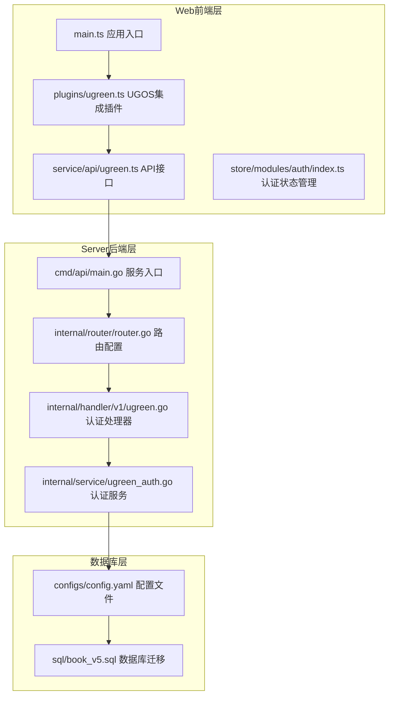
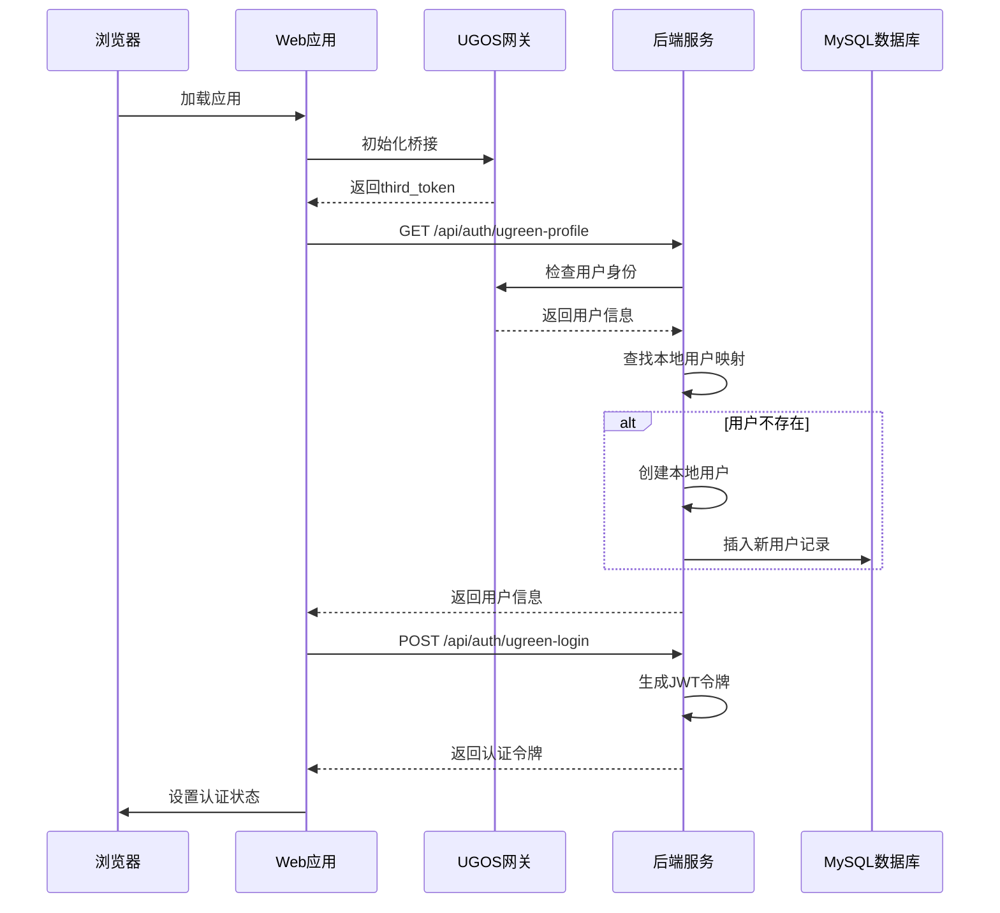
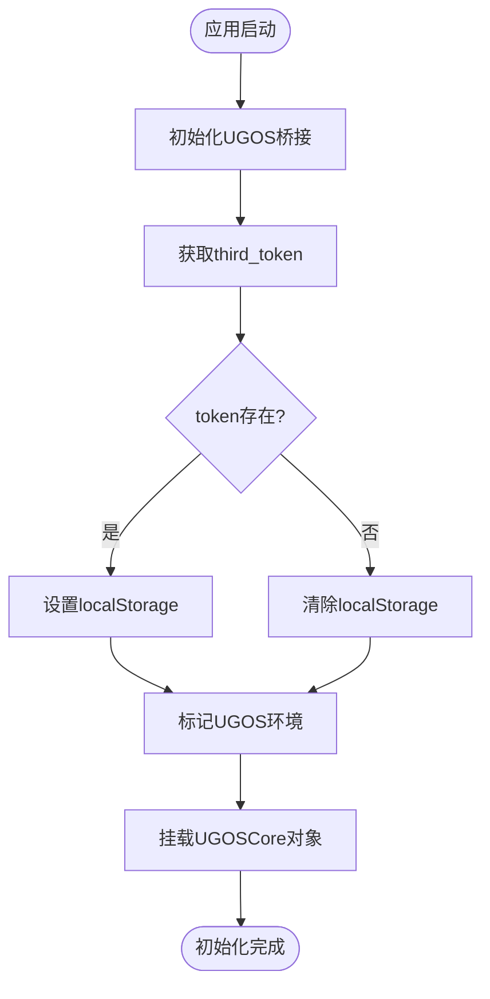
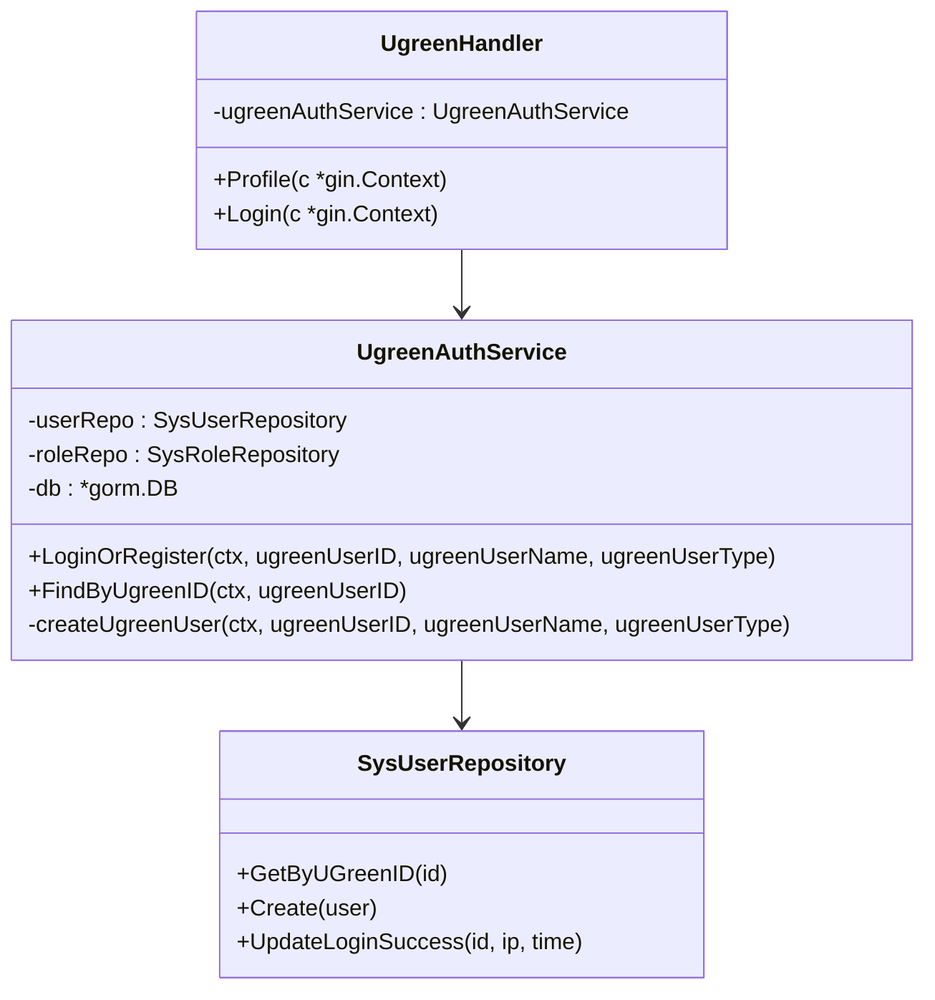
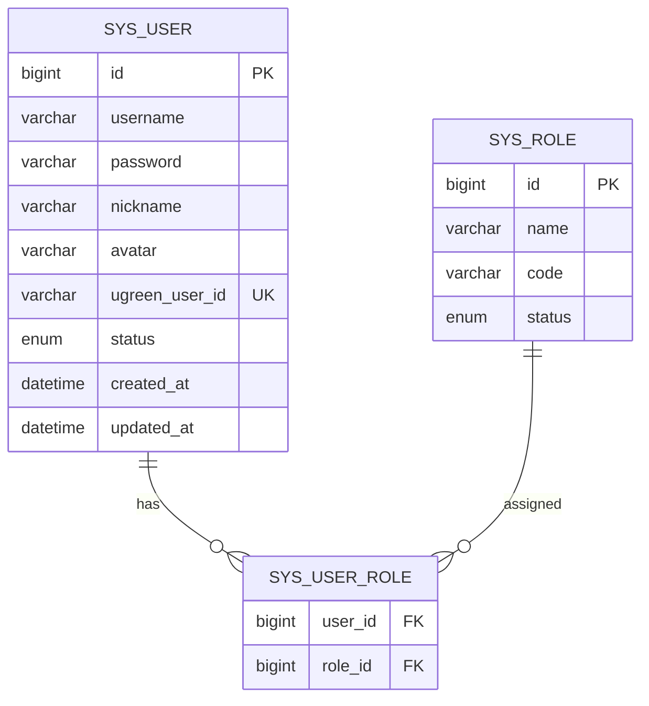

# UGOS/NAS集成

<cite>
**本文档引用的文件**
- [main.go](file://app/server/cmd/api/main.go)
- [router.go](file://app/server/internal/router/router.go)
- [ugreen.go](file://app/server/internal/handler/v1/ugreen.go)
- [ugreen_auth.go](file://app/server/internal/service/ugreen_auth.go)
- [ugreen.ts](file://app/web/src/plugins/ugreen.ts)
- [ugreen.ts](file://app/web/src/service/api/ugreen.ts)
- [config.yaml](file://app/server/configs/config.yaml)
- [config.example.yaml](file://app/server/configs/config.example.yaml)
- [book_v5.sql](file://app/sql/book_v5.sql)
- [index.ts](file://app/web/src/store/modules/auth/index.ts)
- [main.ts](file://app/web/src/main.ts)
</cite>

## 目录
1. [简介](#简介)
2. [项目结构](#项目结构)
3. [核心组件](#核心组件)
4. [架构概览](#架构概览)
5. [详细组件分析](#详细组件分析)
6. [依赖关系分析](#依赖关系分析)
7. [性能考虑](#性能考虑)
8. [故障排除指南](#故障排除指南)
9. [结论](#结论)

## 简介

UGOS/NAS集成本项目是一个专为绿联NAS用户设计的小说管理阅读工具。该项目实现了与绿联操作系统(UGOS)的深度集成，允许用户在绿联NAS环境中无缝访问和管理自己的TXT小说文件。

项目采用前后端分离架构，后端基于Gin框架构建RESTful API，前端使用Soybean-Admin框架开发响应式用户界面。核心创新在于实现了绿联NAS网关认证机制，通过UGOS系统网关自动注入用户身份信息，实现免密登录体验。

## 项目结构

项目采用典型的三层架构设计，分为Web前端、Server后端和SQL数据库三个主要部分：



**图表来源**
- [main.go:1-178](file://app/server/cmd/api/main.go#L1-L178)
- [router.go:1-389](file://app/server/internal/router/router.go#L1-L389)
- [ugreen.ts:1-42](file://app/web/src/plugins/ugreen.ts#L1-L42)

**章节来源**
- [main.go:1-178](file://app/server/cmd/api/main.go#L1-L178)
- [router.go:1-389](file://app/server/internal/router/router.go#L1-L389)

## 核心组件

### 1. UGOS网关集成

项目的核心创新在于实现了与绿联UGOS系统的深度集成。通过UGOS网关，系统能够自动获取当前登录用户的身份信息，包括用户ID、用户名和用户类型。

### 2. 自动认证机制

系统实现了智能的认证流程，能够在检测到UGOS环境时自动完成用户认证，无需用户手动输入凭据。

### 3. 数据库迁移支持

项目包含了专门针对UGOS集成的数据库迁移脚本，扩展了用户表以支持绿联用户ID映射。

**章节来源**
- [ugreen.go:1-95](file://app/server/internal/handler/v1/ugreen.go#L1-L95)
- [ugreen_auth.go:1-140](file://app/server/internal/service/ugreen_auth.go#L1-L140)
- [book_v5.sql:1-14](file://app/sql/book_v5.sql#L1-L14)

## 架构概览

系统采用微服务架构，前后端通过HTTP协议通信，数据库采用MySQL存储。



**图表来源**
- [main.ts:10-42](file://app/web/src/main.ts#L10-L42)
- [ugreen.ts:13-41](file://app/web/src/plugins/ugreen.ts#L13-L41)
- [ugreen.go:24-94](file://app/server/internal/handler/v1/ugreen.go#L24-L94)

## 详细组件分析

### 前端UGOS集成模块

前端通过`setupUGOSCore`函数实现与绿联网关的集成，包含超时控制和错误处理机制。



**图表来源**
- [ugreen.ts:13-41](file://app/web/src/plugins/ugreen.ts#L13-L41)

**章节来源**
- [ugreen.ts:1-42](file://app/web/src/plugins/ugreen.ts#L1-L42)
- [main.ts:25-26](file://app/web/src/main.ts#L25-L26)

### 后端认证处理器

后端实现了专门的UGOS认证处理器，负责处理来自绿联网关的用户身份验证请求。



**图表来源**
- [ugreen.go:15-22](file://app/server/internal/handler/v1/ugreen.go#L15-L22)
- [ugreen_auth.go:18-27](file://app/server/internal/service/ugreen_auth.go#L18-L27)

**章节来源**
- [ugreen.go:1-95](file://app/server/internal/handler/v1/ugreen.go#L1-L95)
- [ugreen_auth.go:1-140](file://app/server/internal/service/ugreen_auth.go#L1-L140)

### 数据库迁移机制

项目通过SQL脚本实现了对用户表的扩展，添加了绿联用户ID字段以支持用户映射。



**图表来源**
- [book_v5.sql:10-13](file://app/sql/book_v5.sql#L10-L13)

**章节来源**
- [book_v5.sql:1-14](file://app/sql/book_v5.sql#L1-L14)

## 依赖关系分析

系统各组件之间的依赖关系清晰明确，遵循依赖倒置原则：

```mermaid
graph TD
subgraph "前端依赖"
A[plugins/ugreen.ts] --> B[@ugreen-nas/core]
A --> C[localStg 本地存储]
D[service/api/ugreen.ts] --> E[request 请求封装]
F[store/modules/auth/index.ts] --> D
end
subgraph "后端依赖"
G[cmd/api/main.go] --> H[internal/router/router.go]
H --> I[internal/handler/v1/ugreen.go]
I --> J[internal/service/ugreen_auth.go]
J --> K[gorm.io/gorm]
J --> L[golang.org/x/crypto/bcrypt]
end
subgraph "配置依赖"
M[configs/config.yaml] --> G
N[configs/config.example.yaml] --> M
end
A --> G
D --> G
J --> M
```

**图表来源**
- [main.go:3-25](file://app/server/cmd/api/main.go#L3-L25)
- [ugreen.ts:2-4](file://app/web/src/plugins/ugreen.ts#L2-L4)

**章节来源**
- [main.go:1-178](file://app/server/cmd/api/main.go#L1-L178)
- [router.go:1-389](file://app/server/internal/router/router.go#L1-L389)

## 性能考虑

### 1. 超时控制
系统实现了严格的超时控制机制，防止在非UGOS环境下长时间等待：

- UGOS初始化超时：3秒
- 数据库连接池优化：最大空闲连接10，最大活跃连接100
- JWT令牌过期时间：2小时

### 2. 缓存策略
- 本地存储用户认证状态
- 前端路由守卫中检查认证状态
- 后端使用GORM日志级别优化

### 3. 错误处理
- 非UGOS环境下的静默降级
- 数据库连接失败的优雅处理
- 认证失败的详细错误反馈

## 故障排除指南

### 常见问题及解决方案

#### 1. UGOS环境检测失败
**症状**：应用无法检测到UGOS环境，无法自动登录
**解决方案**：
- 检查浏览器是否支持WebAssembly
- 确认@ugreen-nas/core包正确安装
- 验证网络连接和跨域设置

#### 2. 认证失败
**症状**：UGOS认证接口返回错误
**排查步骤**：
- 检查UGOS网关是否正常运行
- 验证请求头中是否包含Ugreen-User-ID等必要信息
- 确认后端JWT配置正确

#### 3. 数据库连接问题
**症状**：应用启动时报数据库连接错误
**解决方案**：
- 检查config.yaml中的数据库配置
- 验证MySQL服务状态
- 确认网络连通性

**章节来源**
- [ugreen.ts:6-12](file://app/web/src/plugins/ugreen.ts#L6-L12)
- [config.yaml:1-21](file://app/server/configs/config.yaml#L1-L21)

## 结论

UGOS/NAS集成本项目成功实现了绿联NAS环境下的小说管理阅读功能。通过创新的网关认证机制，用户可以在绿联NAS环境中获得无缝的阅读体验。

### 主要优势

1. **无缝集成**：与UGOS系统深度集成，实现免密登录
2. **用户体验**：自动检测环境并提供相应的功能
3. **技术先进**：采用现代化的前后端分离架构
4. **可扩展性**：模块化设计便于功能扩展

### 技术特色

- 智能环境检测和降级机制
- 完善的错误处理和超时控制
- 清晰的依赖关系和架构设计
- 全面的认证和授权机制

该项目为绿联NAS用户提供了专业的小说管理解决方案，展现了现代Web应用开发的最佳实践。