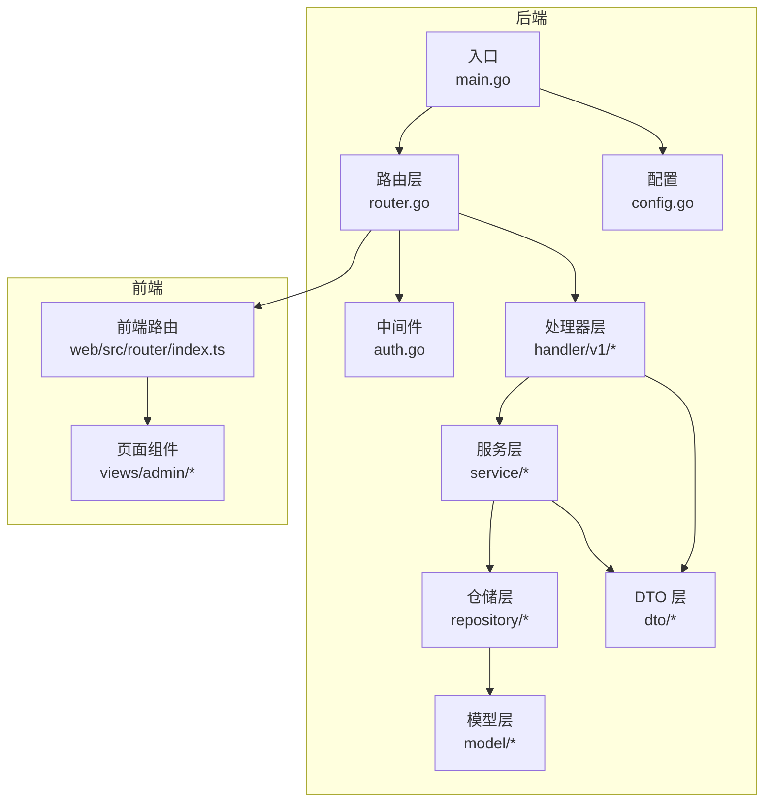
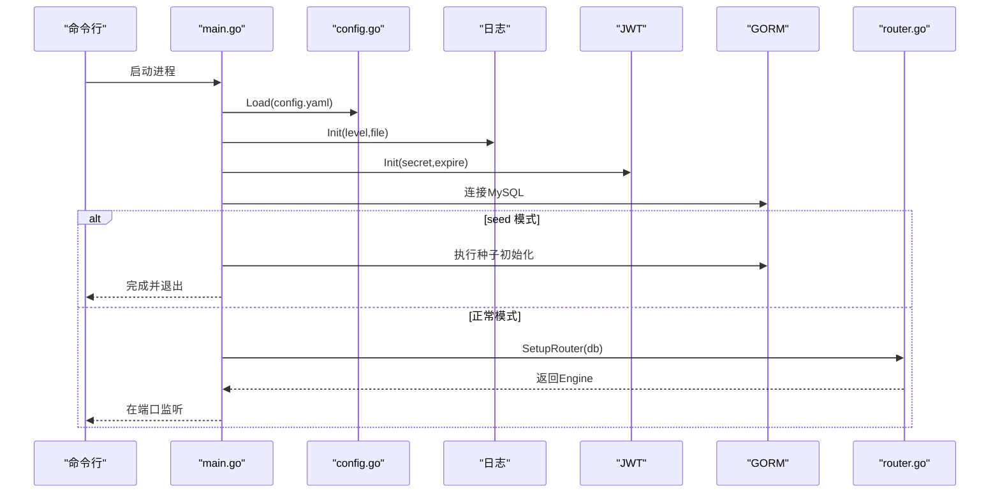
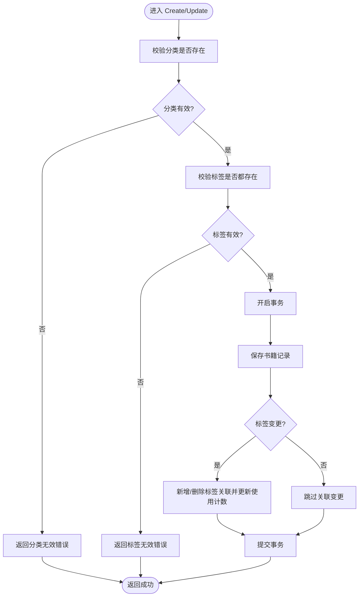
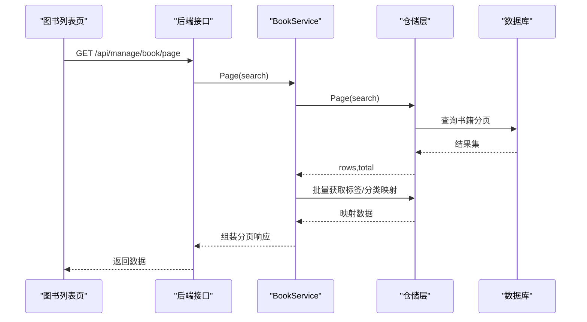
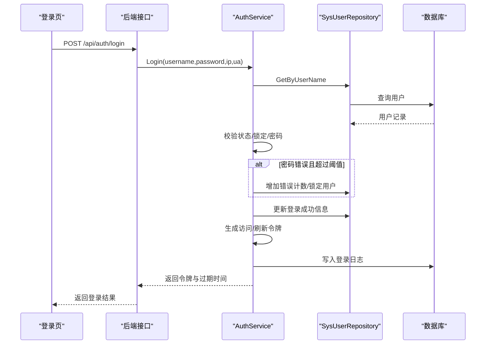
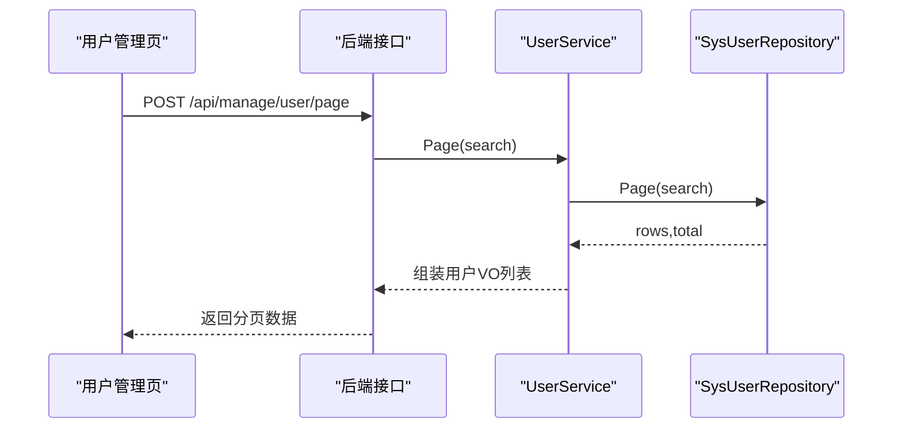
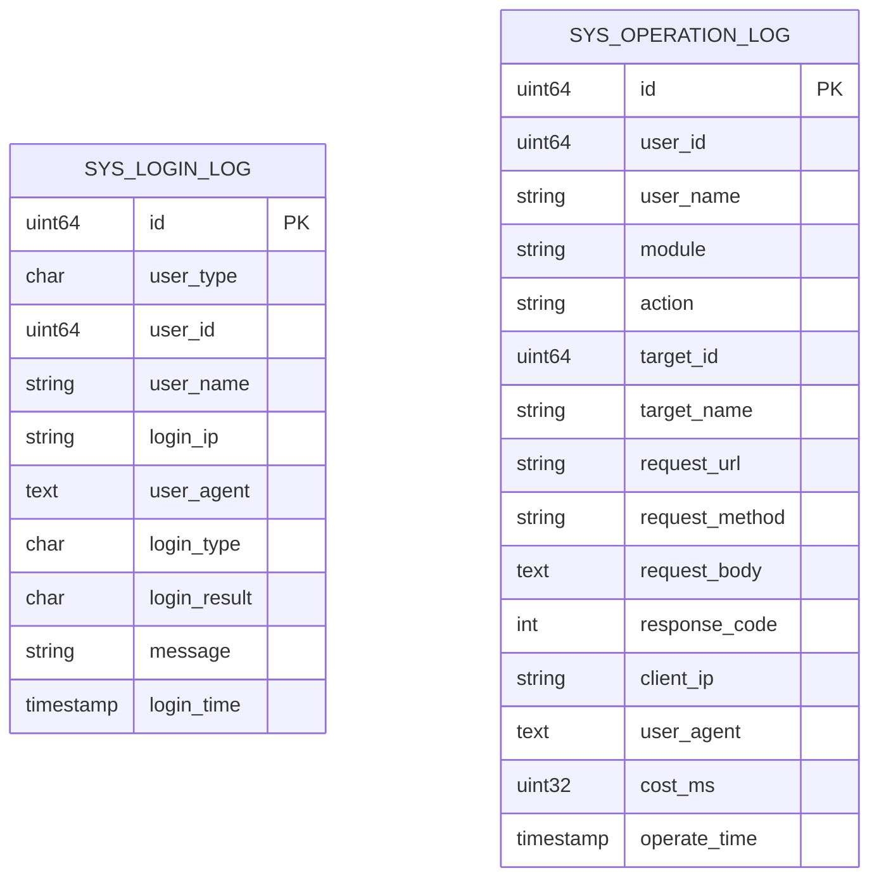
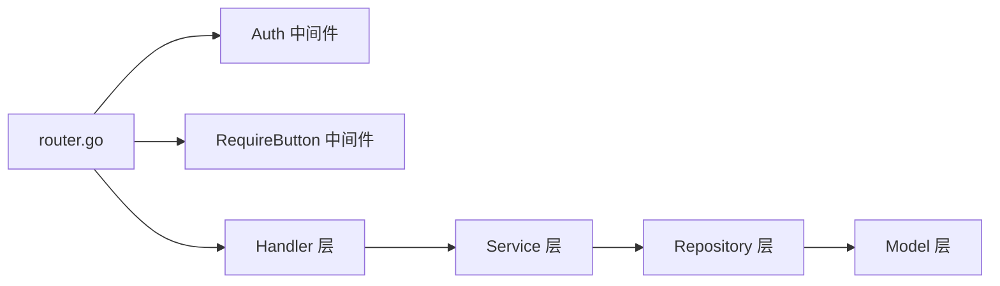

# 业务功能

<cite>
**本文档引用的文件**
- [main.go](file://app/server/cmd/api/main.go)
- [router.go](file://app/server/internal/router/router.go)
- [config.go](file://app/server/pkg/config/config.go)
- [auth.go](file://app/server/internal/middleware/auth.go)
- [auth.go](file://app/server/internal/service/auth.go)
- [book.go](file://app/server/internal/model/book.go)
- [sys_user.go](file://app/server/internal/model/sys_user.go)
- [sys_log.go](file://app/server/internal/model/sys_log.go)
- [book.go](file://app/server/internal/service/book.go)
- [user.go](file://app/server/internal/service/user.go)
- [book.go](file://app/server/internal/handler/v1/book.go)
- [user.go](file://app/server/internal/handler/v1/user.go)
- [book.go](file://app/server/internal/dto/book.go)
- [user.go](file://app/server/internal/dto/user.go)
- [index.ts](file://app/web/src/router/index.ts)
- [book-index.vue](file://app/web/src/views/admin/library/book/index.vue)
- [user-index.vue](file://app/web/src/views/admin/system/user/index.vue)
- [log-index.vue](file://app/web/src/views/admin/system/log/index.vue)
</cite>

## 目录
1. [简介](#简介)
2. [项目结构](#项目结构)
3. [核心组件](#核心组件)
4. [架构总览](#架构总览)
5. [详细组件分析](#详细组件分析)
6. [依赖分析](#依赖分析)
7. [性能考虑](#性能考虑)
8. [故障排查指南](#故障排查指南)
9. [结论](#结论)
10. [附录](#附录)

## 简介
本项目为“小说阅读平台”，后端采用 Go + Gin + GORM 构建，前端采用 Vue3 + Naive UI，提供完整的电子书管理、用户权限管理、系统配置与日志审计能力，并通过 Swagger 提供接口文档。本文档聚焦业务功能，梳理核心模块的设计与实现，包括数据流、业务逻辑、用户交互、模块间关联、一致性保障、异常处理、扩展与集成建议。

## 项目结构
后端以 MVC 分层组织：路由层负责装配路由与中间件；处理器层承接 HTTP 请求并调用服务层；服务层封装业务规则与事务；仓储层负责数据持久化；模型层定义数据结构与枚举；DTO 层承载请求/响应结构；配置与中间件分别负责环境配置与安全控制。前端采用路由守卫与页面组件，对接后端 API。

**图表来源**
- [main.go:30-84](file://app/server/cmd/api/main.go#L30-L84)
- [router.go:20-205](file://app/server/internal/router/router.go#L20-L205)
- [config.go:58-66](file://app/server/pkg/config/config.go#L58-L66)
- [index.ts:20-30](file://app/web/src/router/index.ts#L20-L30)

**章节来源**
- [main.go:30-84](file://app/server/cmd/api/main.go#L30-L84)
- [router.go:20-205](file://app/server/internal/router/router.go#L20-L205)
- [config.go:58-66](file://app/server/pkg/config/config.go#L58-L66)
- [index.ts:20-30](file://app/web/src/router/index.ts#L20-L30)

## 核心组件
- 电子书管理：支持书籍新增/编辑/删除/分页查询/状态更新，关联分类与标签，支持批量扫描与章节解析。
- 用户权限管理：支持用户增删改查、重置密码、角色与按钮授权，菜单树构建与权限渲染。
- 系统配置管理：通过 YAML 配置服务器、数据库、JWT、日志与元数据提取规则。
- 日志审计：记录登录日志与操作日志，支持分页查询与筛选。
- 中间件与安全：JWT 认证、CORS、请求日志、按钮级权限校验。

**章节来源**
- [book.go:45-316](file://app/server/internal/service/book.go#L45-L316)
- [user.go:27-139](file://app/server/internal/service/user.go#L27-L139)
- [auth.go:42-163](file://app/server/internal/service/auth.go#L42-L163)
- [sys_log.go:29-64](file://app/server/internal/model/sys_log.go#L29-L64)
- [auth.go:13-40](file://app/server/internal/middleware/auth.go#L13-L40)
- [config.go:58-66](file://app/server/pkg/config/config.go#L58-L66)

## 架构总览
后端启动流程：加载配置 → 初始化日志与 JWT → 连接数据库 → 若带 seed 参数则执行种子初始化 → 装配路由与中间件 → 启动 HTTP 服务。路由层按模块装配管理接口，统一使用认证中间件；部分公开接口如登录与热门分类不受按钮级鉴权限制。

**图表来源**
- [main.go:34-84](file://app/server/cmd/api/main.go#L34-L84)
- [config.go:58-66](file://app/server/pkg/config/config.go#L58-L66)

**章节来源**
- [main.go:34-84](file://app/server/cmd/api/main.go#L34-L84)
- [router.go:20-205](file://app/server/internal/router/router.go#L20-L205)

## 详细组件分析

### 电子书管理模块
- 数据模型：书籍、标签与标签关联、分类等，定义连载状态、可见性、聚合状态、上架状态等枚举。
- 业务逻辑：
  - 新增/编辑：校验分类与标签有效性，事务内保存书籍与标签关联，维护标签使用计数。
  - 删除：级联删除标签关联并回减标签使用计数。
  - 分页：展开父分类到子分类集合，批量获取标签与分类映射，组装响应。
  - 状态更新：仅更新状态字段与更新人。
- 异常处理：对书籍不存在、标签无效、分类不存在等场景返回特定错误码。

**图表来源**
- [book.go:45-116](file://app/server/internal/service/book.go#L45-L116)
- [book.go:118-208](file://app/server/internal/service/book.go#L118-L208)

**章节来源**
- [book.go:40-70](file://app/server/internal/model/book.go#L40-L70)
- [book.go:45-316](file://app/server/internal/service/book.go#L45-L316)
- [book.go:54-95](file://app/server/internal/handler/v1/book.go#L54-L95)
- [book.go:5-46](file://app/server/internal/dto/book.go#L5-L46)

- 用户交互流程（前端）：图书列表页支持分类树筛选、多条件搜索、批量操作、上传与扫描、章节查看与状态切换；通过模态框/抽屉进行新增/编辑；分页表格与列设置。

**图表来源**
- [book-index.vue:104-111](file://app/web/src/views/admin/library/book/index.vue#L104-L111)
- [book.go:127-139](file://app/server/internal/handler/v1/book.go#L127-L139)
- [book.go:258-306](file://app/server/internal/service/book.go#L258-L306)

**章节来源**
- [book-index.vue:84-111](file://app/web/src/views/admin/library/book/index.vue#L84-L111)
- [book.go:127-139](file://app/server/internal/handler/v1/book.go#L127-L139)
- [book.go:258-306](file://app/server/internal/service/book.go#L258-L306)

### 用户权限管理模块
- 数据模型：用户、用户-角色关联等。
- 业务逻辑：
  - 用户创建：用户名唯一性校验、密码加密、可选角色绑定。
  - 用户更新：支持资料修改与角色替换。
  - 权限体系：基于角色聚合按钮码，构建菜单树（含排序、重定向、图标等元信息）。
  - 登录风控：失败次数阈值与锁定时间，成功后清零并更新最近登录信息，记录登录日志。
- 异常处理：用户不存在、密码错误、禁用、锁定等场景返回对应错误。

**图表来源**
- [auth.go:42-95](file://app/server/internal/service/auth.go#L42-L95)
- [auth.go:13-40](file://app/server/internal/middleware/auth.go#L13-L40)

**章节来源**
- [sys_user.go:6-36](file://app/server/internal/model/sys_user.go#L6-L36)
- [user.go:27-139](file://app/server/internal/service/user.go#L27-L139)
- [auth.go:42-163](file://app/server/internal/service/auth.go#L42-L163)
- [auth.go:80-92](file://app/server/internal/handler/v1/user.go#L80-L92)

- 用户管理界面：支持分页查询、性别/状态标签渲染、批量删除占位、抽屉式新增/编辑弹窗。

**图表来源**
- [user-index.vue:25-32](file://app/web/src/views/admin/system/user/index.vue#L25-L32)
- [user.go:35-47](file://app/server/internal/handler/v1/user.go#L35-L47)
- [user.go:111-124](file://app/server/internal/service/user.go#L111-L124)

**章节来源**
- [user-index.vue:14-33](file://app/web/src/views/admin/system/user/index.vue#L14-L33)
- [user.go:35-47](file://app/server/internal/handler/v1/user.go#L35-L47)
- [user.go:111-124](file://app/server/internal/service/user.go#L111-L124)

### 系统配置管理
- 配置项：服务器端口与模式、数据库连接参数、JWT 密钥与过期时间、日志级别与文件路径、元数据提取规则（正则、优先级等）。
- 加载方式：启动时从 YAML 文件读取并反序列化到全局配置对象。

**章节来源**
- [config.go:58-66](file://app/server/pkg/config/config.go#L58-L66)
- [main.go:34-42](file://app/server/cmd/api/main.go#L34-L42)

### 日志审计模块
- 登录日志：记录用户类型、用户ID/名称、IP、UA、登录类型/结果、消息与时间。
- 操作日志：记录模块、动作、目标ID/名称、请求URL/方法、请求体、响应码、客户端IP、UA、耗时与时间。
- 前端界面：支持登录日志与操作日志双标签页分页展示，支持多维筛选与刷新。

**图表来源**
- [sys_log.go:29-64](file://app/server/internal/model/sys_log.go#L29-L64)

**章节来源**
- [sys_log.go:29-64](file://app/server/internal/model/sys_log.go#L29-L64)
- [log-index.vue:13-33](file://app/web/src/views/admin/system/log/index.vue#L13-L33)

## 依赖分析
- 路由装配：路由层集中注册管理接口，按模块分组并应用认证中间件；按钮级权限通过 RequireButton 中间件在特定路由上启用。
- 中间件链：CORS → 请求日志 → Recovery → 认证 → 按钮鉴权。
- 依赖注入：仓储实例在路由层构造并注入对应服务；服务实例再注入处理器。

**图表来源**
- [router.go:65-201](file://app/server/internal/router/router.go#L65-L201)
- [auth.go:13-40](file://app/server/internal/middleware/auth.go#L13-L40)

**章节来源**
- [router.go:65-201](file://app/server/internal/router/router.go#L65-L201)
- [auth.go:13-40](file://app/server/internal/middleware/auth.go#L13-L40)

## 性能考虑
- 数据库连接池：通过配置设置最大空闲/打开连接数，避免连接争用。
- 分页与批量查询：服务层对标签与分类映射采用批量查询，减少 N+1 查询。
- 事务边界：书籍创建/更新/删除均在事务内执行，确保一致性。
- 前端分页与远程数据源：前端表格使用远程分页，降低一次性传输压力。

**章节来源**
- [main.go:63-64](file://app/server/cmd/api/main.go#L63-L64)
- [book.go:258-306](file://app/server/internal/service/book.go#L258-L306)

## 故障排查指南
- 认证失败：检查 Authorization 头格式与 JWT 有效性；确认用户未被禁用或锁定。
- 书籍相关错误：书籍不存在、标签无效、分类不存在等，根据错误码定位问题。
- 用户相关错误：用户名冲突、密码强度不满足等。
- 登录风控：连续错误达到阈值会触发临时锁定，需等待或管理员重置。

**章节来源**
- [auth.go:13-40](file://app/server/internal/middleware/auth.go#L13-L40)
- [auth.go:24-29](file://app/server/internal/service/auth.go#L24-L29)
- [book.go:15-19](file://app/server/internal/service/book.go#L15-L19)
- [user.go:15-17](file://app/server/internal/service/user.go#L15-L17)

## 结论
本项目通过清晰的分层架构与中间件体系，实现了电子书管理、用户权限、系统配置与日志审计等核心业务。服务层封装了关键业务规则与事务，仓储层屏蔽底层细节，前端通过页面组件与 API 交互，形成高内聚低耦合的系统。建议在后续迭代中进一步完善字段校验、索引优化与缓存策略，持续提升稳定性与性能。

## 附录

### 功能扩展指南
- 新增业务模块：在路由层注册新模块路由，注入对应仓储与服务，编写处理器与 DTO，按需添加按钮权限点。
- 自定义配置：在 YAML 中新增配置项并在配置包中定义结构体与加载逻辑。
- 第三方集成：在服务层引入外部 SDK 或服务，注意事务与错误传播，必要时增加熔断与超时配置。

### 界面原型设计
- 图书管理：分类树、搜索表单、分页表格、操作按钮（新增/编辑/删除/上架/扫描/章节）、模态框与抽屉。
- 用户管理：搜索表单、分页表格、性别/状态标签、抽屉式新增/编辑。
- 日志审计：双标签页（登录/操作），筛选器与刷新按钮。

**章节来源**
- [book-index.vue:276-323](file://app/web/src/views/admin/library/book/index.vue#L276-L323)
- [user-index.vue:166-201](file://app/web/src/views/admin/system/user/index.vue#L166-L201)
- [log-index.vue:144-195](file://app/web/src/views/admin/system/log/index.vue#L144-L195)