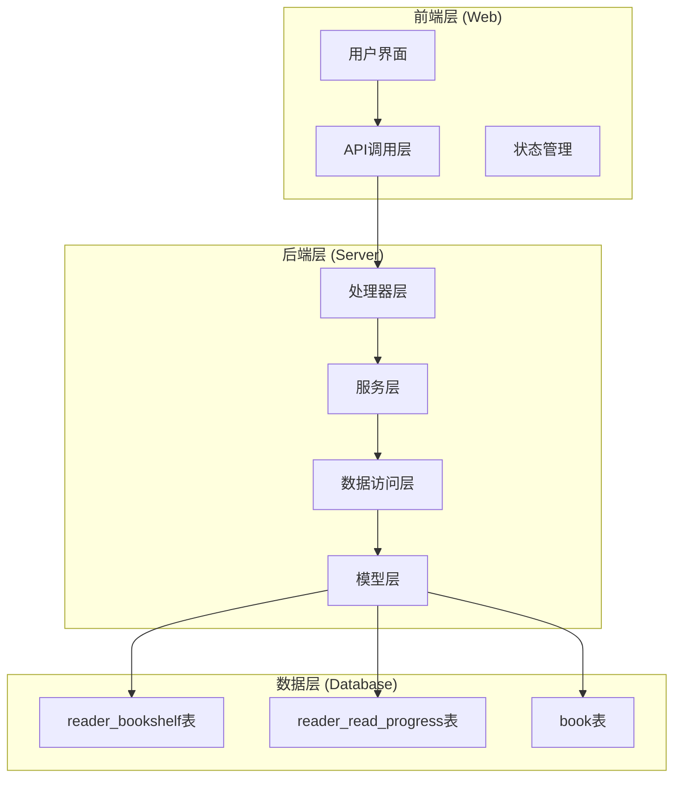
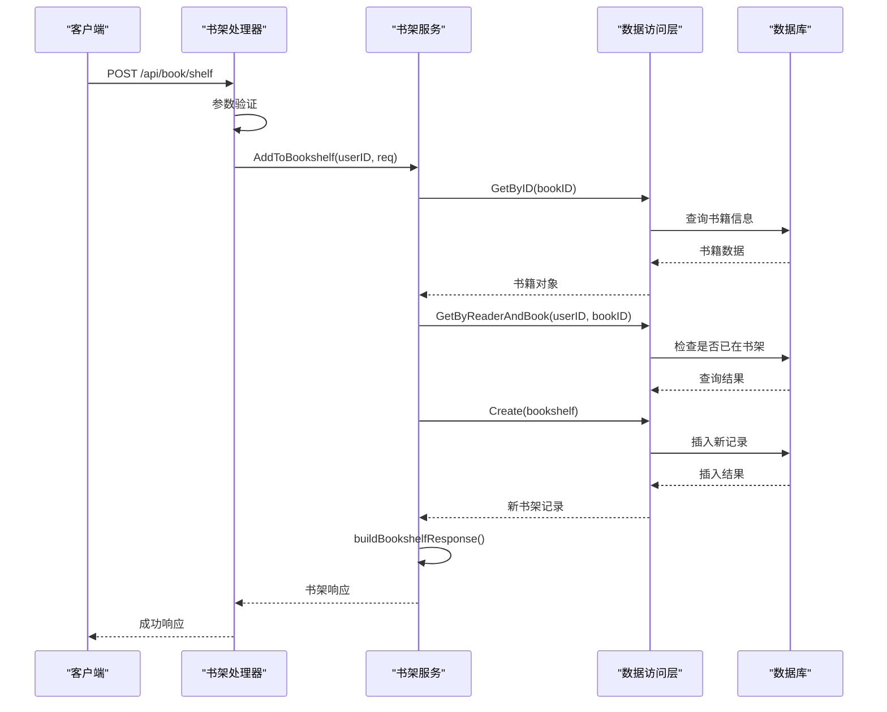
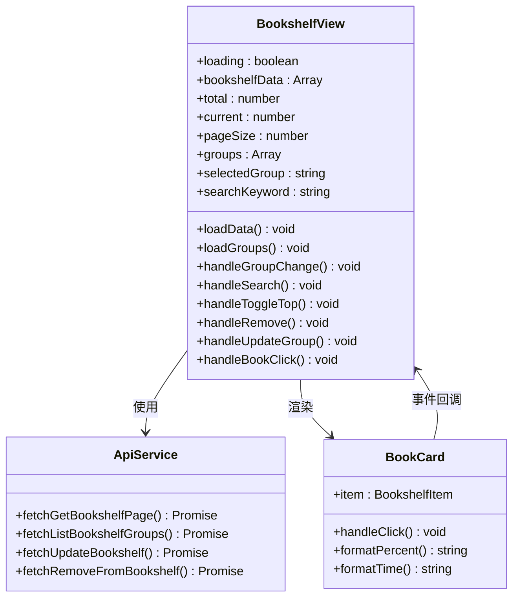
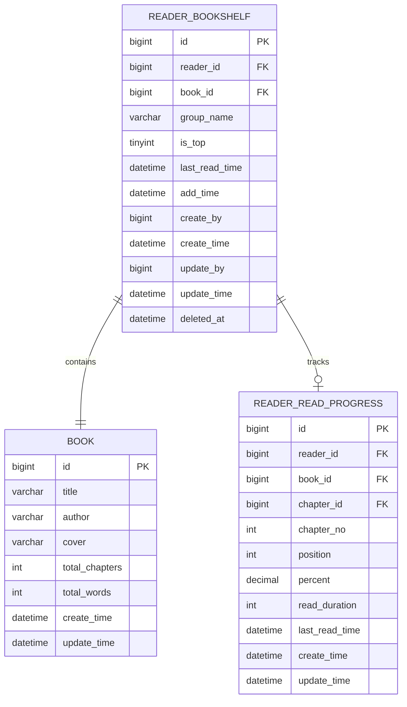
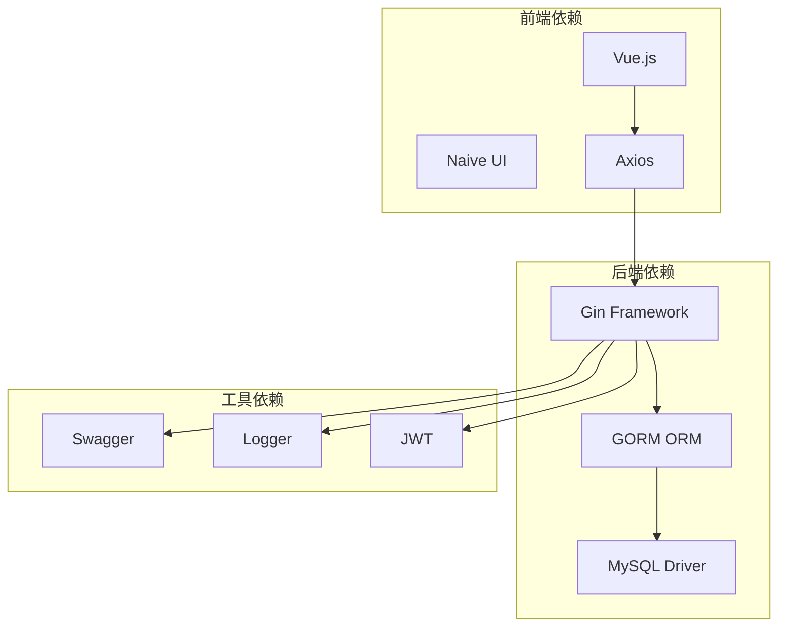

# 书架管理

<cite>
**本文档引用的文件**
- [main.go](file://app/server/cmd/api/main.go)
- [router.go](file://app/server/internal/router/router.go)
- [book_shelf.go](file://app/server/internal/handler/v1/book_shelf.go)
- [book_shelf.go](file://app/server/internal/service/book_shelf.go)
- [book_shelf.go](file://app/server/internal/repository/book_shelf.go)
- [book_shelf.go](file://app/server/internal/model/book_shelf.go)
- [book_shelf.go](file://app/server/internal/dto/book_shelf.go)
- [index.vue](file://app/web/src/views/bookshelf/index.vue)
- [book-manage.ts](file://app/web/src/service/api/book-manage.ts)
- [book-manage.d.ts](file://app/web/src/typings/api/book-manage.d.ts)
- [book_v3.sql](file://app/sql/book_v3.sql)
</cite>

## 目录
1. [简介](#简介)
2. [项目结构](#项目结构)
3. [核心组件](#核心组件)
4. [架构概览](#架构概览)
5. [详细组件分析](#详细组件分析)
6. [依赖关系分析](#依赖关系分析)
7. [性能考虑](#性能考虑)
8. [故障排除指南](#故障排除指南)
9. [结论](#结论)

## 简介

书架管理系统是小说阅读平台的核心功能模块，为用户提供个性化的书籍收藏和管理能力。该系统支持书籍添加到书架、分组管理、置顶功能、阅读进度跟踪以及智能排序等功能。

系统采用前后端分离架构，后端基于Go语言和Gin框架开发，前端使用Vue.js技术栈，通过RESTful API进行数据交互。数据库采用MySQL，使用GORM作为ORM框架。

## 项目结构

书架管理系统的整体架构遵循经典的三层架构模式：

**图表来源**
- [main.go:36-114](file://app/server/cmd/api/main.go#L36-L114)
- [router.go:15-389](file://app/server/internal/router/router.go#L15-L389)

**章节来源**
- [main.go:36-114](file://app/server/cmd/api/main.go#L36-L114)
- [router.go:15-389](file://app/server/internal/router/router.go#L15-L389)

## 核心组件

书架管理系统包含以下核心组件：

### 数据模型层
- **ReaderBookshelf模型**: 定义书架实体结构，包括读者ID、书籍ID、分组名称、置顶状态等字段
- **BookshelfResponse模型**: 书架响应数据结构，包含书籍基本信息和阅读进度

### 服务层
- **ReaderBookshelfService**: 主要的书架业务逻辑处理，包括添加、删除、更新书架操作
- **批量进度处理**: 支持批量获取多个书籍的阅读进度信息

### 数据访问层
- **ReaderBookshelfRepository**: 提供书架数据的CRUD操作
- **分页查询**: 支持按分组和关键词搜索的分页查询功能
- **智能排序**: 按置顶状态、最后阅读时间和添加时间进行排序

**章节来源**
- [book_shelf.go:1-200](file://app/server/internal/service/book_shelf.go#L1-L200)
- [book_shelf.go:1-135](file://app/server/internal/repository/book_shelf.go#L1-L135)
- [book_shelf.go:1-20](file://app/server/internal/model/book_shelf.go#L1-L20)

## 架构概览

书架管理系统的整体架构采用MVC模式和分层架构相结合的设计：

**图表来源**
- [book_shelf.go:30-71](file://app/server/internal/handler/v1/book_shelf.go#L30-L71)
- [book_shelf.go:41-71](file://app/server/internal/service/book_shelf.go#L41-L71)
- [book_shelf.go:22-28](file://app/server/internal/repository/book_shelf.go#L22-L28)

**章节来源**
- [book_shelf.go:30-136](file://app/server/internal/handler/v1/book_shelf.go#L30-L136)
- [book_shelf.go:41-200](file://app/server/internal/service/book_shelf.go#L41-L200)

## 详细组件分析

### 前端组件分析

前端书架页面采用Vue.js开发，提供了完整的书架管理界面：

**图表来源**
- [index.vue:1-366](file://app/web/src/views/bookshelf/index.vue#L1-L366)
- [book-manage.ts:393-434](file://app/web/src/service/api/book-manage.ts#L393-L434)

前端组件的主要功能包括：
- **书架数据展示**: 以网格形式展示用户的书籍收藏
- **分组管理**: 支持创建和管理自定义分组
- **搜索功能**: 支持按分组和关键词搜索书籍
- **操作功能**: 支持置顶、修改分组、移除书籍等操作
- **进度显示**: 实时显示每本书的阅读进度和最后阅读时间

**章节来源**
- [index.vue:1-366](file://app/web/src/views/bookshelf/index.vue#L1-L366)
- [book-manage.ts:393-434](file://app/web/src/service/api/book-manage.ts#L393-L434)

### 后端API分析

后端提供完整的RESTful API接口：

| 接口 | 方法 | 描述 | 权限 |
|------|------|------|------|
| /api/book/shelf | POST | 添加到书架 | 需要登录 |
| /api/book/shelf/{bookId} | DELETE | 从书架移除 | 需要登录 |
| /api/book/shelf/{bookId} | PUT | 更新书架 | 需要登录 |
| /api/book/shelf/page | POST | 书架分页列表 | 需要登录 |
| /api/book/shelf/groups | GET | 获取分组列表 | 需要登录 |

每个API接口都经过严格的参数验证和错误处理，确保系统的稳定性和安全性。

**章节来源**
- [book_shelf.go:21-136](file://app/server/internal/handler/v1/book_shelf.go#L21-L136)
- [router.go:356-365](file://app/server/internal/router/router.go#L356-L365)

### 数据库设计

书架管理系统的数据库设计采用了规范化的表结构：

**图表来源**
- [book_v3.sql:20-39](file://app/sql/book_v3.sql#L20-L39)
- [book_shelf.go:6-14](file://app/server/internal/model/book_shelf.go#L6-L14)

**章节来源**
- [book_v3.sql:20-66](file://app/sql/book_v3.sql#L20-L66)
- [book_shelf.go:6-14](file://app/server/internal/model/book_shelf.go#L6-L14)

## 依赖关系分析

书架管理系统的依赖关系呈现清晰的层次化结构：

**图表来源**
- [main.go:3-25](file://app/server/cmd/api/main.go#L3-L25)
- [router.go:3-13](file://app/server/internal/router/router.go#L3-L13)

系统的关键依赖特性：
- **轻量级框架**: 使用Gin框架实现高性能HTTP服务
- **类型安全**: GORM提供编译时类型检查，减少运行时错误
- **文档集成**: Swagger自动生成API文档
- **日志监控**: 结构化日志记录系统活动

**章节来源**
- [main.go:3-25](file://app/server/cmd/api/main.go#L3-L25)
- [router.go:3-13](file://app/server/internal/router/router.go#L3-L13)

## 性能考虑

书架管理系统在设计时充分考虑了性能优化：

### 数据库优化
- **索引策略**: 在`reader_id`和`book_id`上建立复合索引，支持快速查询
- **查询优化**: 使用JOIN操作减少查询次数，提高数据获取效率
- **缓存策略**: 对常用的书架分组信息进行缓存

### 服务层优化
- **批量操作**: 支持批量获取阅读进度，减少网络往返
- **延迟加载**: 仅在需要时加载书籍的详细信息
- **内存管理**: 合理使用内存池，避免频繁的垃圾回收

### 前端优化
- **虚拟滚动**: 对于大量书籍的情况，使用虚拟滚动技术
- **懒加载**: 图片资源采用懒加载方式
- **状态缓存**: 用户的搜索和分组状态进行本地缓存

## 故障排除指南

### 常见问题及解决方案

**1. 书架数据不同步**
- 检查数据库连接配置
- 验证书架表的索引完整性
- 确认GORM配置正确

**2. API调用失败**
- 检查JWT令牌的有效性
- 验证用户权限认证
- 查看后端日志获取详细错误信息

**3. 前端显示异常**
- 确认API响应格式正确
- 检查网络请求状态
- 验证前端类型定义匹配

**章节来源**
- [book_shelf.go:133-135](file://app/server/internal/handler/v1/book_shelf.go#L133-L135)

## 结论

书架管理系统是一个设计合理、架构清晰的完整解决方案。系统采用现代化的技术栈，具有良好的扩展性和维护性。

### 主要优势
- **模块化设计**: 清晰的分层架构便于维护和扩展
- **性能优化**: 合理的数据库设计和查询优化
- **用户体验**: 前端界面友好，操作流畅
- **技术先进**: 采用最新的开发技术和最佳实践

### 技术特色
- **前后端分离**: 前后端职责明确，开发效率高
- **类型安全**: TypeScript和GORM提供编译时类型检查
- **文档完善**: Swagger自动生成API文档
- **错误处理**: 完善的错误处理和日志记录机制

该系统为小说阅读平台提供了强大的书架管理功能，能够满足用户对个性化书籍管理的需求，同时为未来的功能扩展奠定了坚实的基础。