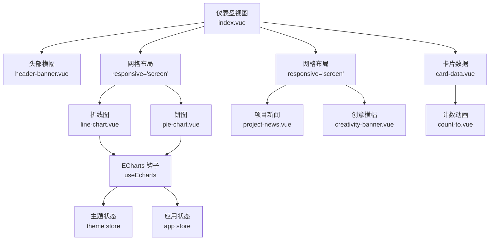
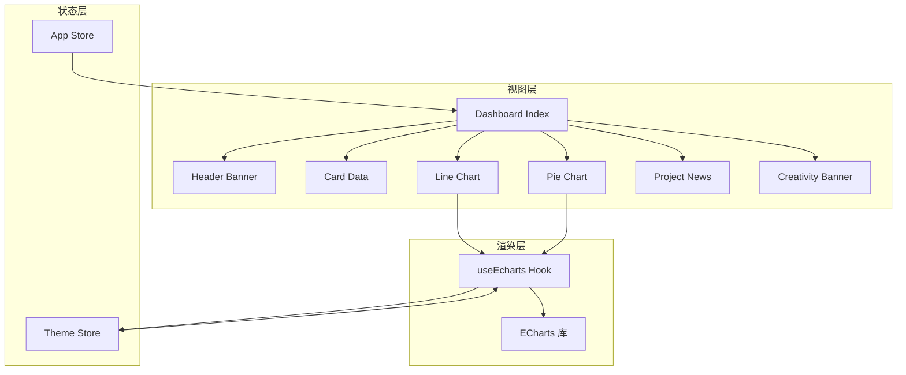
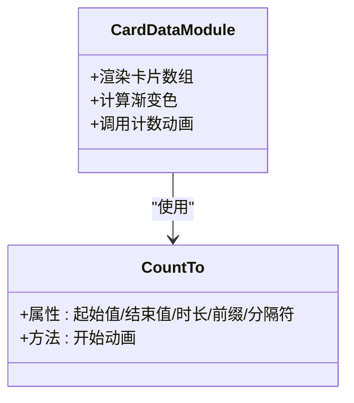
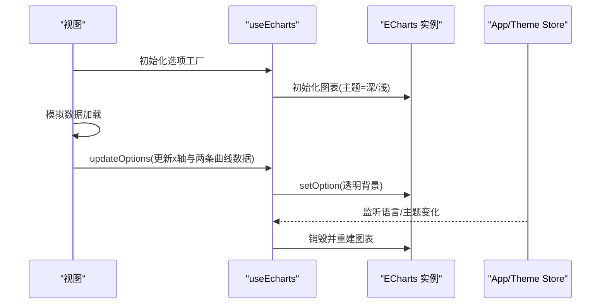
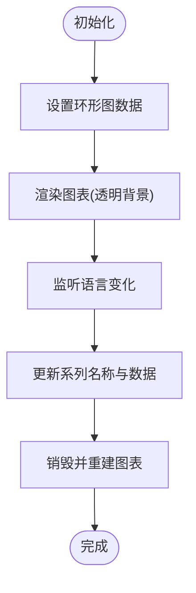
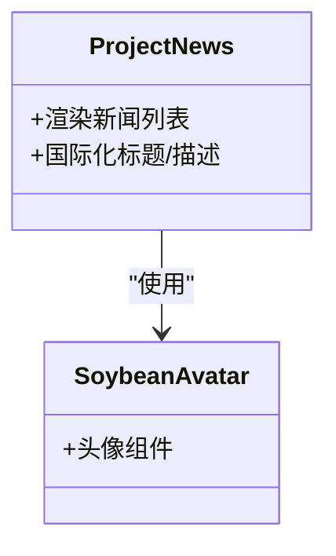
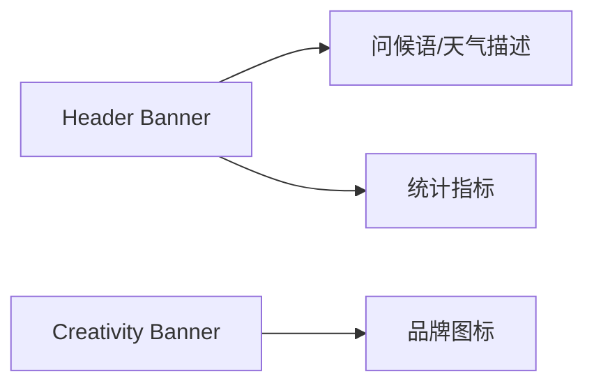
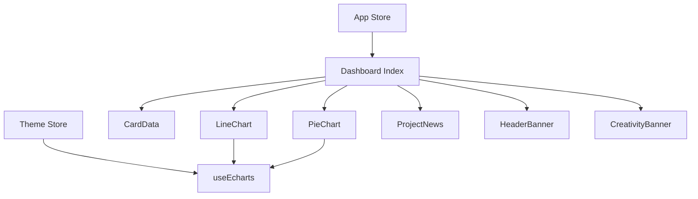

# 仪表盘与统计

<cite>
**本文引用的文件**
- [仪表盘视图 index.vue](file://app/web/src/views/admin/dashboard/index.vue)
- [卡片数据 card-data.vue](file://app/web/src/views/admin/dashboard/modules/card-data.vue)
- [折线图 line-chart.vue](file://app/web/src/views/admin/dashboard/modules/line-chart.vue)
- [饼图 pie-chart.vue](file://app/web/src/views/admin/dashboard/modules/pie-chart.vue)
- [项目新闻 project-news.vue](file://app/web/src/views/admin/dashboard/modules/project-news.vue)
- [头部横幅 header-banner.vue](file://app/web/src/views/admin/dashboard/modules/header-banner.vue)
- [创意横幅 creativity-banner.vue](file://app/web/src/views/admin/dashboard/modules/creativity-banner.vue)
- [ECharts 钩子 echarts.ts](file://app/web/src/hooks/common/echarts.ts)
- [应用状态 app store](file://app/web/src/store/modules/app/index.ts)
- [主题状态 theme store](file://app/web/src/store/modules/theme/index.ts)
- [计数动画 count-to.vue](file://app/web/src/components/custom/count-to.vue)
- [业务工具 book.ts](file://app/web/src/utils/book.ts)
- [内置路由 builtin.ts](file://app/web/src/router/routes/builtin.ts)
- [业务常量 business.ts](file://app/web/src/constants/business.ts)
</cite>

## 目录
1. [简介](#简介)
2. [项目结构](#项目结构)
3. [核心组件](#核心组件)
4. [架构总览](#架构总览)
5. [详细组件分析](#详细组件分析)
6. [依赖关系分析](#依赖关系分析)
7. [性能考量](#性能考量)
8. [故障排查指南](#故障排查指南)
9. [结论](#结论)
10. [附录](#附录)

## 简介
本文件面向“仪表盘与统计分析”模块，系统性梳理数据看板设计、图表可视化、实时数据展示、关键指标统计等核心能力；深入说明卡片式数据展示、折线图趋势分析、饼图占比统计、新闻轮播展示等组件实现；阐述数据采集机制、图表渲染优化、响应式布局适配、交互体验设计；并覆盖数据刷新策略、图表配置管理、主题样式定制等高级功能，最后提供数据分析洞察、报表生成、决策支持的实用指南。

## 项目结构
仪表盘位于后台管理页面，采用模块化组织方式：主视图负责整体布局与网格排版，各子模块封装独立功能（卡片、图表、新闻、横幅），通过 Pinia 状态管理与 ECharts 渲染器协作，实现响应式与多语言支持。

**图表来源**
- [仪表盘视图 index.vue:16-44](file://app/web/src/views/admin/dashboard/index.vue#L16-L44)
- [头部横幅 header-banner.vue:40-62](file://app/web/src/views/admin/dashboard/modules/header-banner.vue#L40-L62)
- [卡片数据 card-data.vue:82-111](file://app/web/src/views/admin/dashboard/modules/card-data.vue#L82-L111)
- [折线图 line-chart.vue:145-149](file://app/web/src/views/admin/dashboard/modules/line-chart.vue#L145-L149)
- [饼图 pie-chart.vue:102-106](file://app/web/src/views/admin/dashboard/modules/pie-chart.vue#L102-L106)
- [项目新闻 project-news.vue:23-36](file://app/web/src/views/admin/dashboard/modules/project-news.vue#L23-L36)
- [创意横幅 creativity-banner.vue:8-13](file://app/web/src/views/admin/dashboard/modules/creativity-banner.vue#L8-L13)
- [ECharts 钩子 echarts.ts:83-230](file://app/web/src/hooks/common/echarts.ts#L83-L230)
- [应用状态 app store:31-32](file://app/web/src/store/modules/app/index.ts#L31-L32)
- [主题状态 theme store:33-39](file://app/web/src/store/modules/theme/index.ts#L33-L39)

**章节来源**
- [仪表盘视图 index.vue:1-46](file://app/web/src/views/admin/dashboard/index.vue#L1-L46)

## 核心组件
- 卡片式数据展示：以渐变背景与图标突出关键指标，使用计数动画组件实现数字滚动效果。
- 折线图趋势分析：双曲线堆叠面积图，支持平滑曲线与区域渐变，展示下载量与注册量趋势。
- 饼图占比统计：环形图展示学习、娱乐、工作、休息等占比，强调可读性与交互高亮。
- 新闻轮播展示：列表形式展示项目动态，配合头像与时间戳，便于快速浏览。
- 头部横幅与创意横幅：提供欢迎信息、统计数据与装饰性横幅，增强用户感知与品牌氛围。

**章节来源**
- [卡片数据 card-data.vue:1-116](file://app/web/src/views/admin/dashboard/modules/card-data.vue#L1-L116)
- [折线图 line-chart.vue:1-153](file://app/web/src/views/admin/dashboard/modules/line-chart.vue#L1-L153)
- [饼图 pie-chart.vue:1-110](file://app/web/src/views/admin/dashboard/modules/pie-chart.vue#L1-L110)
- [项目新闻 project-news.vue:1-41](file://app/web/src/views/admin/dashboard/modules/project-news.vue#L1-L41)
- [头部横幅 header-banner.vue:1-67](file://app/web/src/views/admin/dashboard/modules/header-banner.vue#L1-L67)
- [创意横幅 creativity-banner.vue:1-18](file://app/web/src/views/admin/dashboard/modules/creativity-banner.vue#L1-L18)

## 架构总览
仪表盘采用“视图层 + 组合式模块 + 状态与渲染钩子”的分层架构：
- 视图层：负责布局与模块编排，响应式网格根据屏幕尺寸调整列宽。
- 组合式模块：每个模块自包含数据、样式与交互逻辑，降低耦合度。
- 状态层：应用状态与主题状态驱动布局、语言与主题切换。
- 渲染层：ECharts 钩子统一处理初始化、更新、主题切换与尺寸变化。

**图表来源**
- [仪表盘视图 index.vue:16-44](file://app/web/src/views/admin/dashboard/index.vue#L16-L44)
- [头部横幅 header-banner.vue:40-62](file://app/web/src/views/admin/dashboard/modules/header-banner.vue#L40-L62)
- [卡片数据 card-data.vue:82-111](file://app/web/src/views/admin/dashboard/modules/card-data.vue#L82-L111)
- [折线图 line-chart.vue:145-149](file://app/web/src/views/admin/dashboard/modules/line-chart.vue#L145-L149)
- [饼图 pie-chart.vue:102-106](file://app/web/src/views/admin/dashboard/modules/pie-chart.vue#L102-L106)
- [项目新闻 project-news.vue:23-36](file://app/web/src/views/admin/dashboard/modules/project-news.vue#L23-L36)
- [创意横幅 creativity-banner.vue:8-13](file://app/web/src/views/admin/dashboard/modules/creativity-banner.vue#L8-L13)
- [ECharts 钩子 echarts.ts:83-230](file://app/web/src/hooks/common/echarts.ts#L83-L230)
- [应用状态 app store:31-32](file://app/web/src/store/modules/app/index.ts#L31-L32)
- [主题状态 theme store:33-39](file://app/web/src/store/modules/theme/index.ts#L33-L39)

## 详细组件分析

### 卡片式数据展示（CardData）
- 数据结构：每张卡片包含键名、标题、数值、单位、渐变色与图标，便于统一渲染。
- 渐变背景：通过可复用模板与主题半径变量实现一致的视觉风格。
- 数字动画：使用计数动画组件实现从起始值到目标值的过渡动画，提升观感与注意力引导。
- 响应式网格：在不同断点下自动调整列数，保证移动端与桌面端的可读性。

**图表来源**
- [卡片数据 card-data.vue:10-79](file://app/web/src/views/admin/dashboard/modules/card-data.vue#L10-L79)
- [计数动画 count-to.vue:9-81](file://app/web/src/components/custom/count-to.vue#L9-L81)

**章节来源**
- [卡片数据 card-data.vue:1-116](file://app/web/src/views/admin/dashboard/modules/card-data.vue#L1-L116)
- [计数动画 count-to.vue:1-89](file://app/web/src/components/custom/count-to.vue#L1-L89)

### 折线图趋势分析（LineChart）
- 图表类型：双曲线堆叠面积图，支持平滑曲线与垂直线性渐变填充。
- 数据模拟：初始化时延时加载模拟数据，随后通过选项工厂与更新函数刷新。
- 国际化适配：监听应用语言变更，重新生成图例与系列名称，保持标签一致性。
- 主题联动：主题状态变化触发图表销毁与重建，确保深浅色模式一致的视觉表现。

**图表来源**
- [折线图 line-chart.vue:12-102](file://app/web/src/views/admin/dashboard/modules/line-chart.vue#L12-L102)
- [ECharts 钩子 echarts.ts:83-230](file://app/web/src/hooks/common/echarts.ts#L83-L230)
- [应用状态 app store:52-69](file://app/web/src/store/modules/app/index.ts#L52-L69)
- [主题状态 theme store:33-39](file://app/web/src/store/modules/theme/index.ts#L33-L39)

**章节来源**
- [折线图 line-chart.vue:1-153](file://app/web/src/views/admin/dashboard/modules/line-chart.vue#L1-L153)
- [ECharts 钩子 echarts.ts:1-231](file://app/web/src/hooks/common/echarts.ts#L1-L231)

### 饼图占比统计（PieChart）
- 图表类型：环形图，内外半径可配置，边框与圆角提升层次感。
- 数据模拟：初始化时设置四类占比数据，支持交互高亮显示标签。
- 国际化适配：语言切换时重置系列名称与数据，确保标签本地化正确。
- 主题联动：深浅色模式下统一加载与渲染，避免颜色对比度问题。

**图表来源**
- [饼图 pie-chart.vue:12-51](file://app/web/src/views/admin/dashboard/modules/pie-chart.vue#L12-L51)
- [ECharts 钩子 echarts.ts:146-178](file://app/web/src/hooks/common/echarts.ts#L146-L178)

**章节来源**
- [饼图 pie-chart.vue:1-110](file://app/web/src/views/admin/dashboard/modules/pie-chart.vue#L1-L110)
- [ECharts 钩子 echarts.ts:1-231](file://app/web/src/hooks/common/echarts.ts#L1-L231)

### 项目新闻轮播（ProjectNews）
- 列表展示：以列表项承载新闻内容与时间戳，左侧头像增强识别度。
- 可访问性：提供“更多新闻”链接，便于跳转至详情或扩展阅读。
- 国际化：标题与描述均来自国际化资源，便于多语言部署。

**图表来源**
- [项目新闻 project-news.vue:23-36](file://app/web/src/views/admin/dashboard/modules/project-news.vue#L23-L36)

**章节来源**
- [项目新闻 project-news.vue:1-41](file://app/web/src/views/admin/dashboard/modules/project-news.vue#L1-L41)

### 头部横幅与创意横幅（HeaderBanner & CreativityBanner）
- 头部横幅：左侧展示用户头像与问候语、天气描述，右侧展示项目统计指标，支持响应式间距。
- 创意横幅：装饰性横幅，居中展示品牌图标，适配不同屏幕尺寸。

**图表来源**
- [头部横幅 header-banner.vue:40-62](file://app/web/src/views/admin/dashboard/modules/header-banner.vue#L40-L62)
- [创意横幅 creativity-banner.vue:8-13](file://app/web/src/views/admin/dashboard/modules/creativity-banner.vue#L8-L13)

**章节来源**
- [头部横幅 header-banner.vue:1-67](file://app/web/src/views/admin/dashboard/modules/header-banner.vue#L1-L67)
- [创意横幅 creativity-banner.vue:1-18](file://app/web/src/views/admin/dashboard/modules/creativity-banner.vue#L1-L18)

## 依赖关系分析
- 视图与模块：主视图通过网格布局编排各模块，模块间低耦合，便于独立演进。
- 状态依赖：模块通过应用状态获取语言与断点信息，主题状态驱动图表主题切换。
- 渲染依赖：ECharts 钩子统一封装初始化、更新、销毁与尺寸适配，减少重复代码。
- 国际化依赖：模块标题与标签均来自国际化资源，语言切换时自动更新。

**图表来源**
- [仪表盘视图 index.vue:1-46](file://app/web/src/views/admin/dashboard/index.vue#L1-L46)
- [ECharts 钩子 echarts.ts:83-230](file://app/web/src/hooks/common/echarts.ts#L83-L230)
- [应用状态 app store:52-69](file://app/web/src/store/modules/app/index.ts#L52-L69)
- [主题状态 theme store:33-39](file://app/web/src/store/modules/theme/index.ts#L33-L39)

**章节来源**
- [仪表盘视图 index.vue:1-46](file://app/web/src/views/admin/dashboard/index.vue#L1-L46)
- [ECharts 钩子 echarts.ts:1-231](file://app/web/src/hooks/common/echarts.ts#L1-L231)
- [应用状态 app store:1-167](file://app/web/src/store/modules/app/index.ts#L1-L167)
- [主题状态 theme store:1-303](file://app/web/src/store/modules/theme/index.ts#L1-L303)

## 性能考量
- 图表渲染优化
  - 使用尺寸监听与按需渲染：仅在容器尺寸变化或首次渲染时初始化图表，避免重复初始化。
  - 主题切换时销毁并重建：确保深浅色模式下的渲染一致性，避免缓存导致的颜色不一致。
  - 透明背景与最小化重绘：设置透明背景与延迟加载，减少首屏阻塞。
- 响应式布局
  - 基于断点的网格列数自适应，移动端紧凑布局，桌面端充分利用空间。
  - 移动端自动收起侧边栏与布局切换，减少不必要的渲染开销。
- 动画与交互
  - 计数动画采用过渡库，合理设置时长与缓动，避免卡顿。
  - 图表交互高亮与标签显示控制，减少复杂 DOM 更新。

[本节为通用性能建议，无需特定文件引用]

## 故障排查指南
- 图表不显示或空白
  - 检查容器尺寸是否为零，确认尺寸监听生效后再初始化图表。
  - 确认主题状态变化未导致图表被提前销毁。
  - 参考路径：[ECharts 钩子 echarts.ts:146-178](file://app/web/src/hooks/common/echarts.ts#L146-L178)
- 图表颜色异常（深浅色不一致）
  - 确认主题状态已正确切换，钩子会在主题变化时销毁并重建图表。
  - 参考路径：[ECharts 钩子 echarts.ts:173-178](file://app/web/src/hooks/common/echarts.ts#L173-L178)
- 语言切换后标签未更新
  - 确保监听应用语言变化并调用选项更新函数，重新设置系列名称与数据。
  - 参考路径：[折线图 line-chart.vue:118-128](file://app/web/src/views/admin/dashboard/modules/line-chart.vue#L118-L128)、[饼图 pie-chart.vue:70-85](file://app/web/src/views/admin/dashboard/modules/pie-chart.vue#L70-L85)
- 移动端布局错乱
  - 检查断点与网格配置，确认移动端间距与列数设置符合预期。
  - 参考路径：[仪表盘视图 index.vue:23-42](file://app/web/src/views/admin/dashboard/index.vue#L23-L42)、[应用状态 app store:31-32](file://app/web/src/store/modules/app/index.ts#L31-L32)

**章节来源**
- [ECharts 钩子 echarts.ts:146-178](file://app/web/src/hooks/common/echarts.ts#L146-L178)
- [折线图 line-chart.vue:118-128](file://app/web/src/views/admin/dashboard/modules/line-chart.vue#L118-L128)
- [饼图 pie-chart.vue:70-85](file://app/web/src/views/admin/dashboard/modules/pie-chart.vue#L70-L85)
- [仪表盘视图 index.vue:23-42](file://app/web/src/views/admin/dashboard/index.vue#L23-L42)
- [应用状态 app store:31-32](file://app/web/src/store/modules/app/index.ts#L31-L32)

## 结论
仪表盘模块通过清晰的模块化设计与统一的状态/渲染抽象，实现了稳定的数据看板与可视化能力。卡片、折线图、饼图、新闻与横幅组件协同工作，满足关键指标统计、趋势分析与信息展示需求。借助 ECharts 钩子与主题/语言状态的联动，系统具备良好的可维护性与可扩展性，适合进一步接入真实数据源与报表导出能力。

[本节为总结性内容，无需特定文件引用]

## 附录

### 数据刷新策略
- 定时刷新：结合定时器周期性拉取最新数据并调用图表更新函数。
- 事件驱动：监听路由/标签页切换、语言/主题变化等事件，自动刷新相关模块。
- 手动刷新：提供刷新按钮或快捷键，触发当前模块的数据与图表更新。

[本节为通用实践建议，无需特定文件引用]

### 图表配置管理
- 选项工厂：集中管理图表默认配置，便于统一风格与快速迭代。
- 动态更新：通过更新函数合并新配置，避免全量替换带来的性能损耗。
- 国际化映射：将系列名称与标签文本映射到国际化资源，确保多语言一致性。

[本节为通用实践建议，无需特定文件引用]

### 主题样式定制
- 主题变量：通过主题状态计算主题颜色与令牌，全局注入 CSS 变量。
- 深浅色模式：自动切换深浅色主题，确保图表与组件在不同模式下可读性一致。
- 自定义配色：支持主色与辅助色的推荐色板选择，提升品牌一致性。

**章节来源**
- [主题状态 theme store:47-56](file://app/web/src/store/modules/theme/index.ts#L47-L56)
- [主题状态 theme store:168-176](file://app/web/src/store/modules/theme/index.ts#L168-L176)
- [ECharts 钩子 echarts.ts:150-157](file://app/web/src/hooks/common/echarts.ts#L150-L157)

### 数据分析洞察与报表生成
- 指标体系：围绕访问量、转化率、下载量、注册量等核心指标构建 KPI 面板。
- 趋势解读：结合折线图的堆叠与平滑特性，识别高峰与低谷时段，指导运营策略。
- 结构分析：利用饼图占比发现用户行为分布，优化产品与内容策略。
- 报表输出：将图表与卡片导出为图片或 PDF，用于汇报与归档。

[本节为通用实践建议，无需特定文件引用]