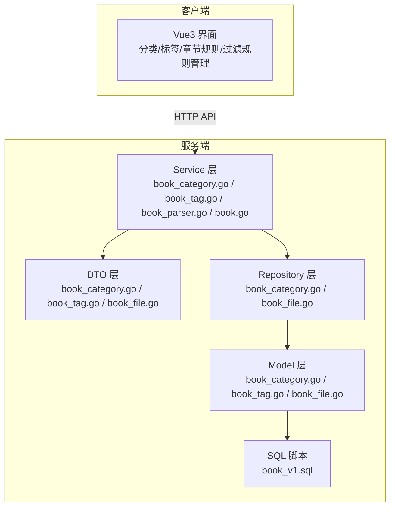
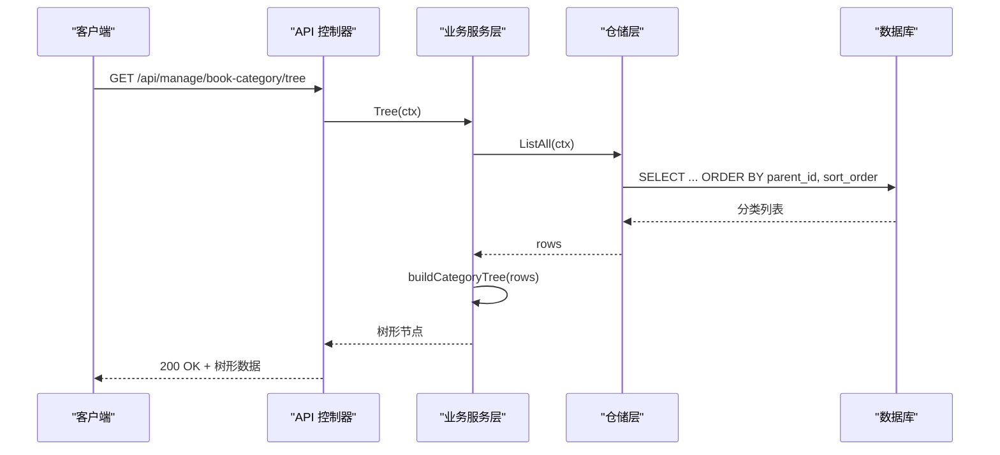
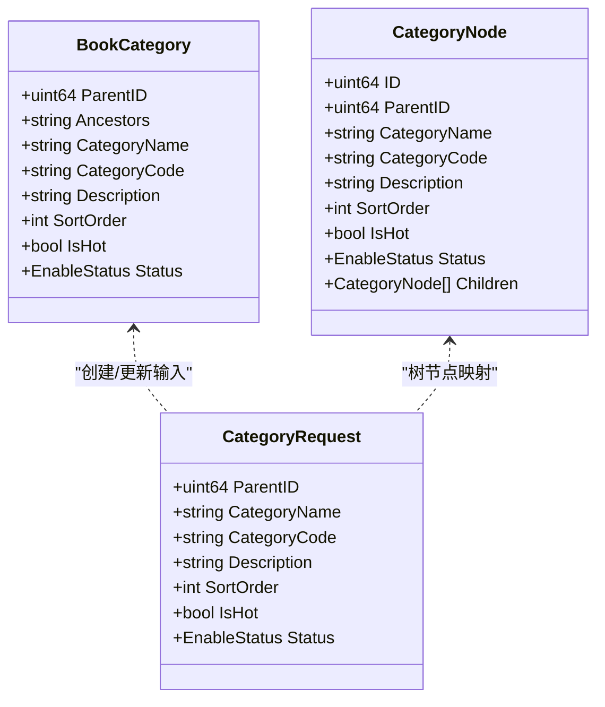
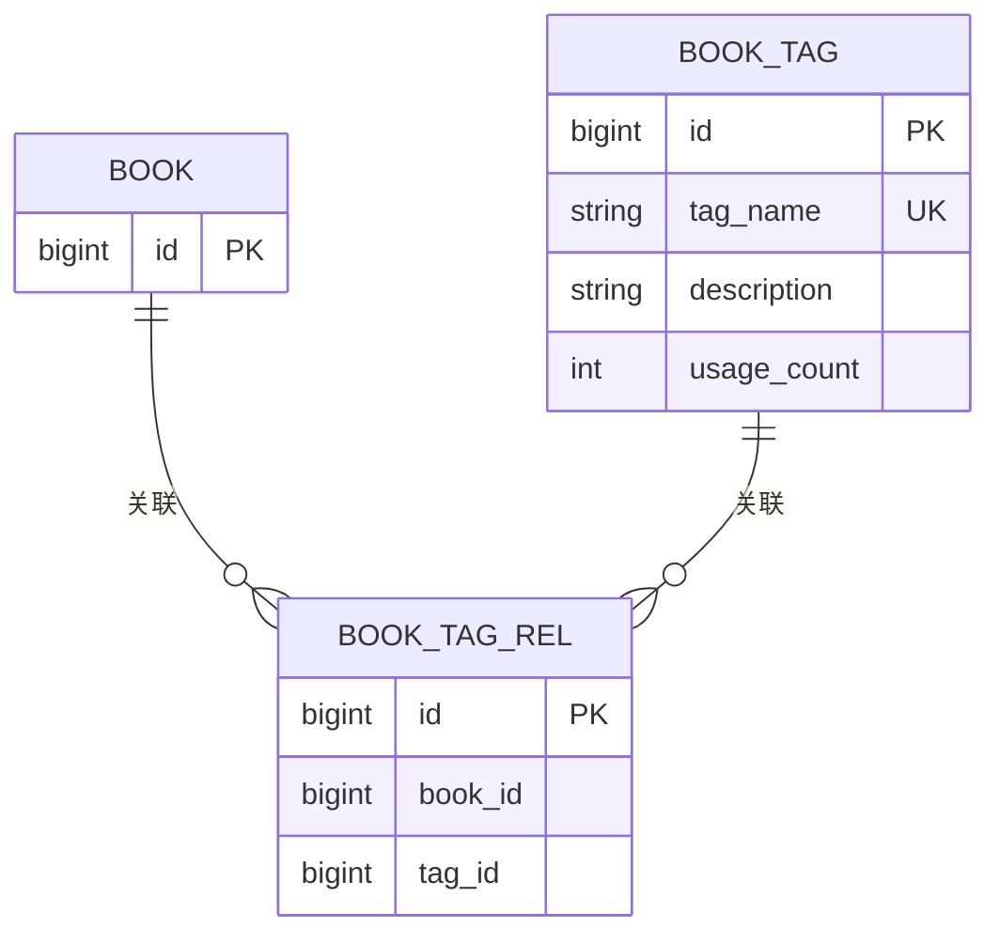
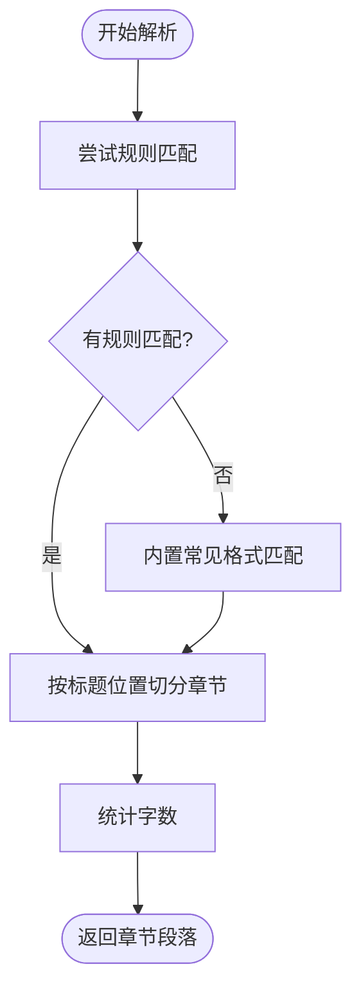
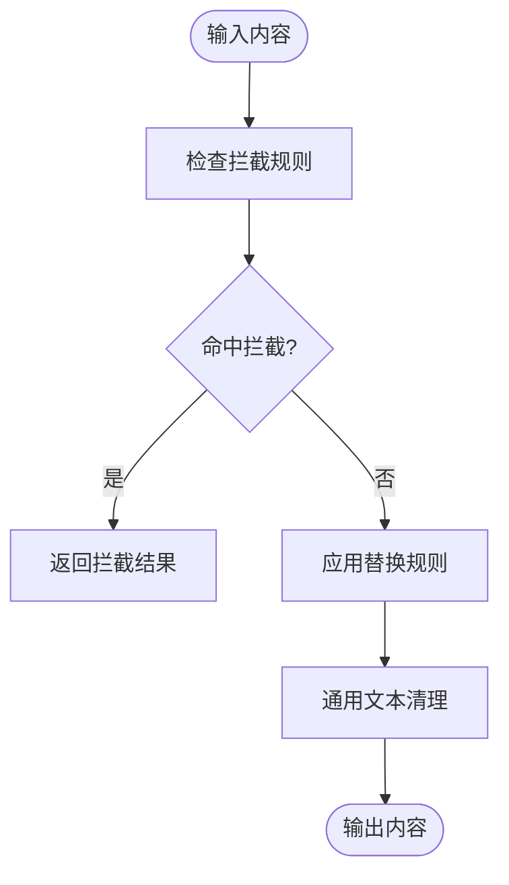
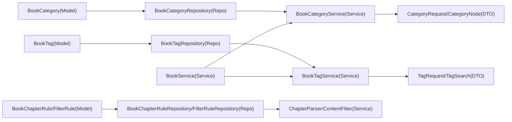

# 内容分类

<cite>
**本文档引用的文件**
- [app/server/internal/model/book_category.go](file://app/server/internal/model/book_category.go)
- [app/server/internal/dto/book_category.go](file://app/server/internal/dto/book_category.go)
- [app/server/internal/service/book_category.go](file://app/server/internal/service/book_category.go)
- [app/server/internal/repository/book_category.go](file://app/server/internal/repository/book_category.go)
- [app/sql/book_v1.sql](file://app/sql/book_v1.sql)
- [app/server/internal/model/book_tag.go](file://app/server/internal/model/book_tag.go)
- [app/server/internal/service/book_tag.go](file://app/server/internal/service/book_tag.go)
- [app/server/internal/model/book_file.go](file://app/server/internal/model/book_file.go)
- [app/server/internal/service/book_parser.go](file://app/server/internal/service/book_parser.go)
- [app/server/internal/repository/book_file.go](file://app/server/internal/repository/book_file.go)
- [app/server/internal/service/book.go](file://app/server/internal/service/book.go)
- [app/server/docs/swagger.json](file://app/server/docs/swagger.json)
</cite>

## 目录
1. [简介](#简介)
2. [项目结构](#项目结构)
3. [核心组件](#核心组件)
4. [架构总览](#架构总览)
5. [详细组件分析](#详细组件分析)
6. [依赖分析](#依赖分析)
7. [性能考虑](#性能考虑)
8. [故障排查指南](#故障排查指南)
9. [结论](#结论)
10. [附录](#附录)

## 简介
本文件面向内容分类系统，围绕图书分类管理、标签体系、章节规则、过滤规则四大功能模块，系统化阐述分类树形结构、标签关联机制、章节解析规则、内容过滤策略，并深入说明分类数据模型、层级关系维护、规则引擎实现与匹配算法优化。同时提供批量分类、智能推荐、规则测试与效果评估等高级能力的实施建议，以及分类准确性提升、规则调优与性能监控的专业指导。

## 项目结构
后端采用 Go 语言与 GORM ORM，遵循分层架构：DTO（请求/响应）、Service（业务逻辑）、Repository（数据访问）、Model（数据模型）。前端使用 Vue3 + Vite，提供分类、标签、章节规则、过滤规则的可视化管理界面。数据库脚本定义了分类、标签、书籍、章节、上传任务及规则表的结构与索引。

图表来源
- [app/server/internal/dto/book_category.go:1-42](file://app/server/internal/dto/book_category.go#L1-L42)
- [app/server/internal/service/book_category.go:1-253](file://app/server/internal/service/book_category.go#L1-L253)
- [app/server/internal/repository/book_category.go:1-149](file://app/server/internal/repository/book_category.go#L1-L149)
- [app/server/internal/model/book_category.go:1-15](file://app/server/internal/model/book_category.go#L1-L15)
- [app/sql/book_v1.sql:1-137](file://app/sql/book_v1.sql#L1-L137)

章节来源
- [app/server/internal/dto/book_category.go:1-42](file://app/server/internal/dto/book_category.go#L1-L42)
- [app/server/internal/service/book_category.go:1-253](file://app/server/internal/service/book_category.go#L1-L253)
- [app/server/internal/repository/book_category.go:1-149](file://app/server/internal/repository/book_category.go#L1-L149)
- [app/server/internal/model/book_category.go:1-15](file://app/server/internal/model/book_category.go#L1-L15)
- [app/sql/book_v1.sql:1-137](file://app/sql/book_v1.sql#L1-L137)

## 核心组件
- 图书分类管理：基于自关联树模型与祖先路径索引，支持树形构建、分页加载、热门分类查询与层级维护。
- 标签体系：标签唯一约束、使用计数冗余字段，支持标签与书籍的多对多关联。
- 章节规则：章节识别规则（正则/内置常见格式），解析器按规则扫描并生成章节偏移段落。
- 过滤规则：关键词/正则匹配，替换/拦截/标记审核动作，入库/出库两个应用阶段。

章节来源
- [app/server/internal/model/book_category.go:1-15](file://app/server/internal/model/book_category.go#L1-L15)
- [app/server/internal/model/book_tag.go:1-11](file://app/server/internal/model/book_tag.go#L1-L11)
- [app/server/internal/model/book_file.go:104-181](file://app/server/internal/model/book_file.go#L104-L181)
- [app/server/internal/service/book_parser.go:1-402](file://app/server/internal/service/book_parser.go#L1-L402)

## 架构总览
系统通过 Swagger 定义接口契约，分类树接口返回树形节点集合；章节规则与过滤规则分别由解析器与过滤器在入库/出库阶段执行；标签与书籍通过关联表进行解耦与统计。

图表来源
- [app/server/docs/swagger.json:283-282](file://app/server/docs/swagger.json#L283-L282)
- [app/server/internal/service/book_category.go:131-137](file://app/server/internal/service/book_category.go#L131-L137)
- [app/server/internal/repository/book_category.go:47-52](file://app/server/internal/repository/book_category.go#L47-L52)

## 详细组件分析

### 图书分类管理
- 数据模型与索引
  - 分类表包含父节点、祖先路径、排序、热门标记与状态字段；通过唯一索引保证分类编码唯一，索引加速父子查询与软删除。
- 服务层逻辑
  - 创建/更新时维护祖先路径与父节点变更；删除前校验是否存在子节点；树形构建按排序输出根与子节点。
  - 分页加载采用“顶级分类分页 + 递归加载子节点”的策略，避免一次性拉取全树。
  - 热门分类查询仅返回启用且热门标记为真。
- DTO 与 API
  - 树节点结构包含名称、编码、描述、排序、状态与子节点数组；Swagger 定义树接口返回 CategoryNode 数组。

图表来源
- [app/server/internal/model/book_category.go:1-15](file://app/server/internal/model/book_category.go#L1-L15)
- [app/server/internal/dto/book_category.go:5-25](file://app/server/internal/dto/book_category.go#L5-L25)

章节来源
- [app/server/internal/model/book_category.go:1-15](file://app/server/internal/model/book_category.go#L1-L15)
- [app/server/internal/dto/book_category.go:1-42](file://app/server/internal/dto/book_category.go#L1-L42)
- [app/server/internal/service/book_category.go:1-253](file://app/server/internal/service/book_category.go#L1-L253)
- [app/server/internal/repository/book_category.go:1-149](file://app/server/internal/repository/book_category.go#L1-L149)
- [app/sql/book_v1.sql:37-57](file://app/sql/book_v1.sql#L37-L57)

### 标签体系
- 数据模型
  - 标签表包含标签名、描述与使用计数；唯一索引保证标签名唯一。
- 服务层逻辑
  - 标签创建/更新前检查唯一性；删除时直接删除；分页查询支持名称筛选。
- 关联关系
  - 书籍与标签通过 book_tag_rel 关联表建立多对多关系，使用计数用于热门排序与展示。

图表来源
- [app/server/internal/model/book_tag.go:1-11](file://app/server/internal/model/book_tag.go#L1-L11)
- [app/server/internal/service/book_tag.go:1-85](file://app/server/internal/service/book_tag.go#L1-L85)
- [app/sql/book_v1.sql:62-76](file://app/sql/book_v1.sql#L62-L76)
- [app/sql/book_v1.sql:120-136](file://app/sql/book_v1.sql#L120-L136)

章节来源
- [app/server/internal/model/book_tag.go:1-11](file://app/server/internal/model/book_tag.go#L1-L11)
- [app/server/internal/service/book_tag.go:1-85](file://app/server/internal/service/book_tag.go#L1-L85)
- [app/sql/book_v1.sql:62-76](file://app/sql/book_v1.sql#L62-L76)
- [app/sql/book_v1.sql:120-136](file://app/sql/book_v1.sql#L120-L136)

### 章节规则与解析引擎
- 规则模型
  - 章节识别规则包含规则名、作用域（全局/单书）、正则模式、标题捕获组、最小/最大章节长度、优先级与状态。
- 解析流程
  - 解析器先尝试规则匹配，若未命中则回退到内置常见格式（中文章节、英文章节、数字编号、卷/部/集前缀、特殊标题等）。
  - 生成章节段落，包含标题、字节偏移、长度与字数统计。
- 仓储与服务
  - 仓储提供规则分页与按优先级/作用域查询；服务层负责规则加载与解析结果组装。

图表来源
- [app/server/internal/service/book_parser.go:55-108](file://app/server/internal/service/book_parser.go#L55-L108)
- [app/server/internal/service/book_parser.go:110-216](file://app/server/internal/service/book_parser.go#L110-L216)
- [app/server/internal/model/book_file.go:104-119](file://app/server/internal/model/book_file.go#L104-L119)
- [app/server/internal/repository/book_file.go:236-270](file://app/server/internal/repository/book_file.go#L236-L270)

章节来源
- [app/server/internal/model/book_file.go:104-119](file://app/server/internal/model/book_file.go#L104-L119)
- [app/server/internal/service/book_parser.go:1-402](file://app/server/internal/service/book_parser.go#L1-L402)
- [app/server/internal/repository/book_file.go:206-270](file://app/server/internal/repository/book_file.go#L206-L270)

### 内容过滤规则与引擎
- 规则模型
  - 包含匹配类型（关键词/正则）、动作（替换/拦截/标记审核）、应用阶段（入库/出库）、严重程度、分类维度与状态。
- 过滤流程
  - 先检查拦截规则，命中则直接拦截；否则依次应用替换规则；最后进行通用文本清理（空白合并、BOM 去除、换行统一）。
- 仓储与服务
  - 仓储提供按阶段/分类/状态查询；服务层负责规则编译与执行。

图表来源
- [app/server/internal/service/book_parser.go:247-299](file://app/server/internal/service/book_parser.go#L247-L299)
- [app/server/internal/model/book_file.go:155-170](file://app/server/internal/model/book_file.go#L155-L170)
- [app/server/internal/repository/book_file.go:302-333](file://app/server/internal/repository/book_file.go#L302-L333)

章节来源
- [app/server/internal/model/book_file.go:155-170](file://app/server/internal/model/book_file.go#L155-L170)
- [app/server/internal/service/book_parser.go:247-299](file://app/server/internal/service/book_parser.go#L247-L299)
- [app/server/internal/repository/book_file.go:272-333](file://app/server/internal/repository/book_file.go#L272-L333)

### 标签关联与书籍聚合
- 标签关联
  - 书籍新增/删除标签时，维护关联表与标签使用计数增减。
- 书籍信息
  - 书籍表聚合标题、作者、分类、语言、连载状态、可见性、评分与字数等信息；主版本文件字段用于默认读取。

章节来源
- [app/server/internal/service/book.go:189-256](file://app/server/internal/service/book.go#L189-L256)
- [app/sql/book_v1.sql:84-117](file://app/sql/book_v1.sql#L84-L117)

## 依赖分析
- 分类模块
  - Model(BookCategory) ← Repository(BookCategoryRepository) ← Service(BookCategoryService) ← DTO(CategoryRequest/CategoryNode)
- 标签模块
  - Model(BookTag) ← Repository(BookTagRepository) ← Service(BookTagService) ← DTO(TagRequest/TagSearch)
- 章节与过滤规则
  - Model(BookChapterRule/BookContentFilterRule) ← Repository(BookChapterRuleRepository/BookContentFilterRuleRepository) ← Service(ChapterParser/ContentFilter)
- 书籍聚合
  - Service(BookService) 依赖标签关联与分类查询以返回带分类名与标签ID的书籍信息

图表来源
- [app/server/internal/model/book_category.go:1-15](file://app/server/internal/model/book_category.go#L1-L15)
- [app/server/internal/repository/book_category.go:11-17](file://app/server/internal/repository/book_category.go#L11-L17)
- [app/server/internal/service/book_category.go:22-28](file://app/server/internal/service/book_category.go#L22-L28)
- [app/server/internal/model/book_tag.go:1-11](file://app/server/internal/model/book_tag.go#L1-L11)
- [app/server/internal/service/book_tag.go:18-24](file://app/server/internal/service/book_tag.go#L18-L24)
- [app/server/internal/model/book_file.go:104-181](file://app/server/internal/model/book_file.go#L104-L181)
- [app/server/internal/repository/book_file.go:208-214](file://app/server/internal/repository/book_file.go#L208-L214)
- [app/server/internal/service/book.go:189-256](file://app/server/internal/service/book.go#L189-L256)

## 性能考虑
- 分类树构建
  - 使用祖先路径与索引减少子树查询成本；树构建阶段按排序输出，避免额外排序开销。
  - 分页加载采用“顶级分页 + 递归加载”，降低单次查询数据量。
- 章节解析
  - 规则匹配优先于内置格式，减少不必要的正则扫描；正则编译缓存于解析器内部，避免重复编译。
  - 扫描器设置大缓冲区，提高长文本扫描效率。
- 内容过滤
  - 拦截规则优先检查，命中即短路；替换规则按顺序应用；通用清理步骤尽量轻量。
- 数据访问
  - 分类/标签/规则查询均使用索引字段（名称、编码、状态、作用域等）；仓储分页查询统一走索引路径。

章节来源
- [app/server/internal/service/book_category.go:139-172](file://app/server/internal/service/book_category.go#L139-L172)
- [app/server/internal/repository/book_category.go:85-108](file://app/server/internal/repository/book_category.go#L85-L108)
- [app/server/internal/service/book_parser.go:110-170](file://app/server/internal/service/book_parser.go#L110-L170)
- [app/server/internal/service/book_parser.go:247-299](file://app/server/internal/service/book_parser.go#L247-L299)

## 故障排查指南
- 分类错误
  - 父分类不存在：创建/更新时若父ID无效会报错；请确认父节点存在且状态正常。
  - 存在子分类不可删除：删除前需确保无子节点；可先迁移或删除子节点后再删除父节点。
  - 分类编码冲突：创建/更新时若编码重复会报错；请更换唯一编码。
- 标签错误
  - 标签名重复：创建/更新时若标签名重复会报错；请更换唯一名称。
- 章节解析异常
  - 无规则匹配：检查规则优先级与正则表达式；可回退至内置格式识别。
  - 章节过短/过长：调整规则中的最小/最大章节长度阈值。
- 过滤规则异常
  - 正则非法：编译失败时跳过该规则；请修正正则语法。
  - 拦截误伤：优先级高的拦截规则可能导致整章拦截；适当降低优先级或细化匹配条件。

章节来源
- [app/server/internal/service/book_category.go:16-20](file://app/server/internal/service/book_category.go#L16-L20)
- [app/server/internal/service/book_tag.go:14-16](file://app/server/internal/service/book_tag.go#L14-L16)
- [app/server/internal/service/book_parser.go:122-136](file://app/server/internal/service/book_parser.go#L122-L136)
- [app/server/internal/service/book_parser.go:247-299](file://app/server/internal/service/book_parser.go#L247-L299)

## 结论
本系统通过清晰的数据模型与分层架构，实现了稳定高效的图书分类、标签、章节规则与内容过滤能力。分类树采用祖先路径与索引优化，解析与过滤引擎具备良好的扩展性与性能表现。建议在实际部署中结合业务场景持续优化规则优先级与阈值，并配合日志与指标监控保障稳定性与准确性。

## 附录
- API 参考
  - 分类树接口：GET /api/manage/book-category/tree，返回 CategoryNode 数组。
- 数据库脚本
  - 分类、标签、书籍、章节、上传任务与规则表结构定义与索引。

章节来源
- [app/server/docs/swagger.json:283-282](file://app/server/docs/swagger.json#L283-L282)
- [app/sql/book_v1.sql:1-137](file://app/sql/book_v1.sql#L1-L137)