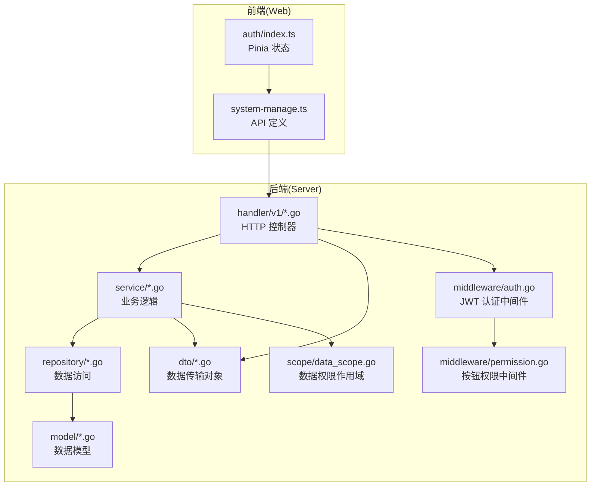
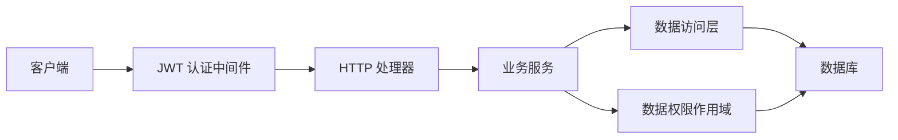
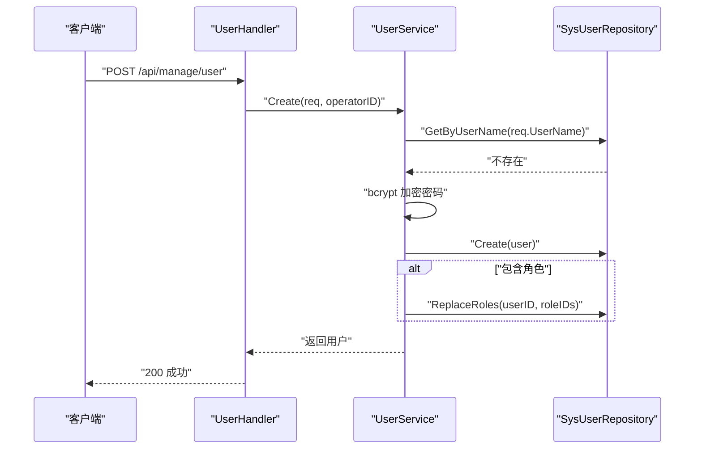
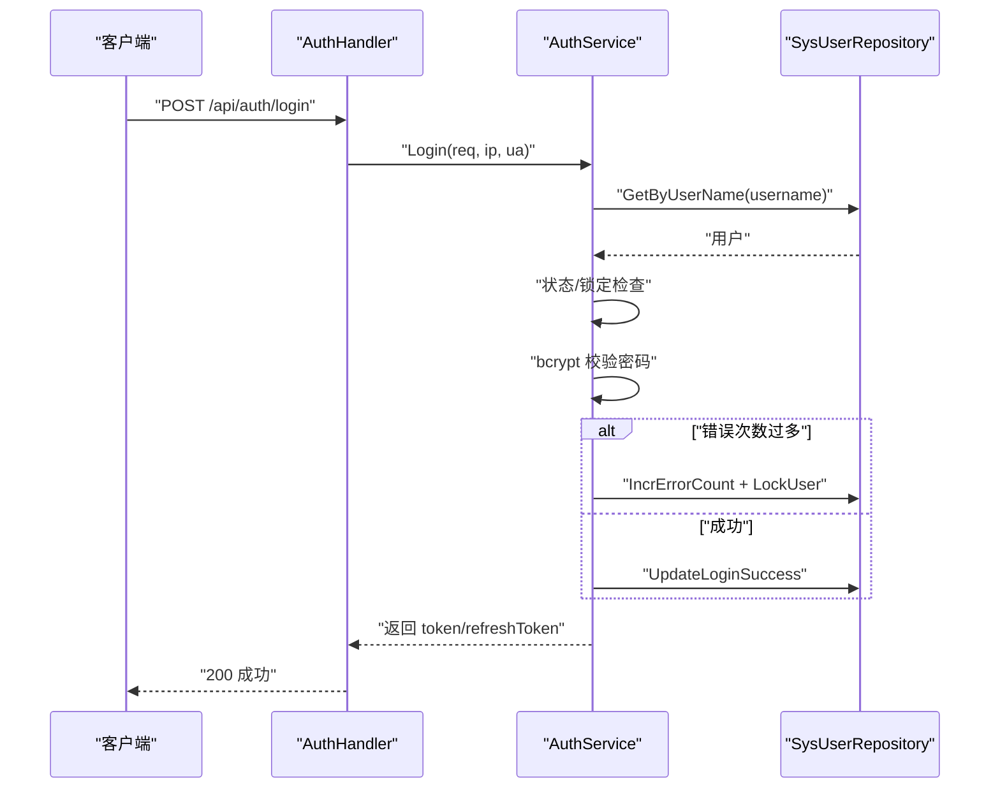
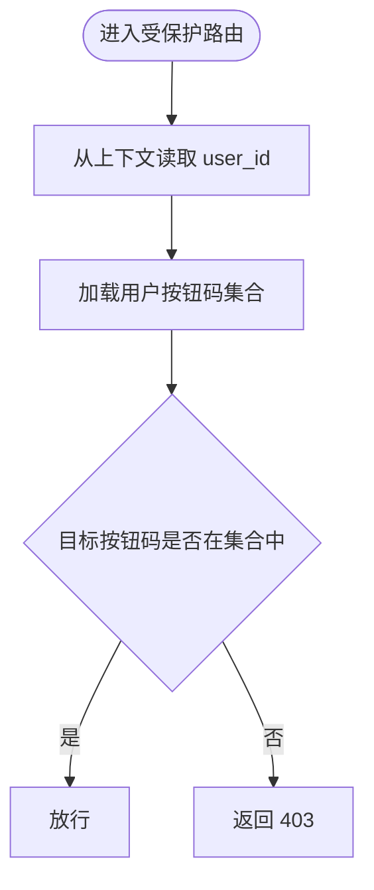
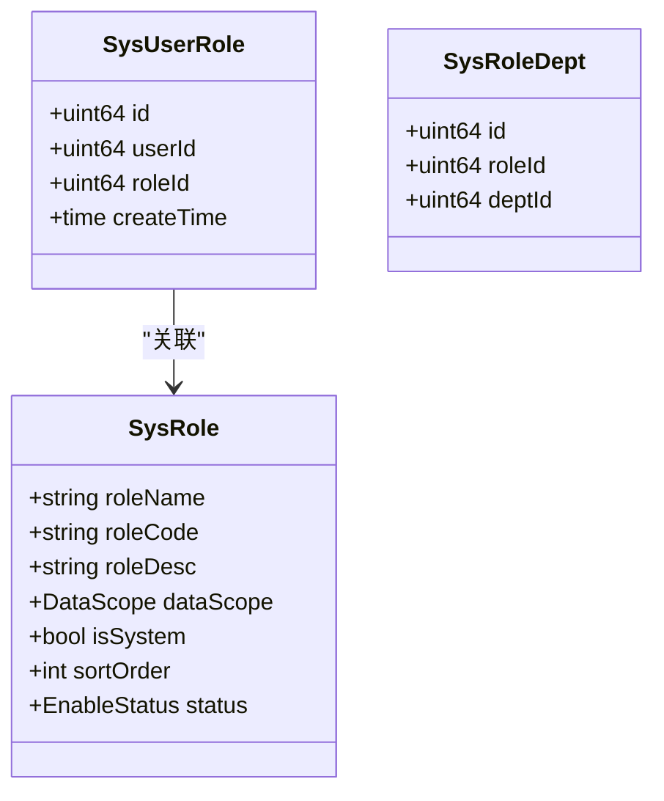
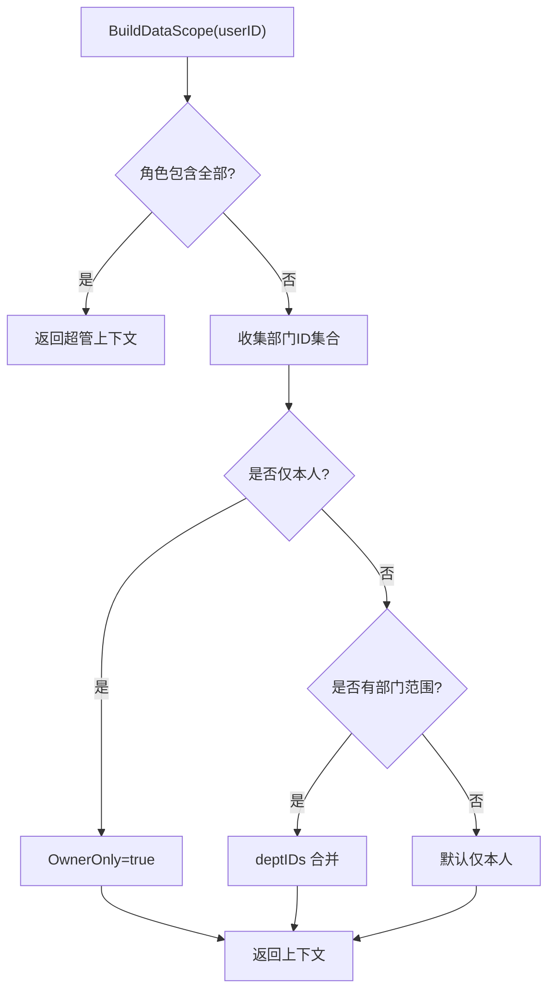
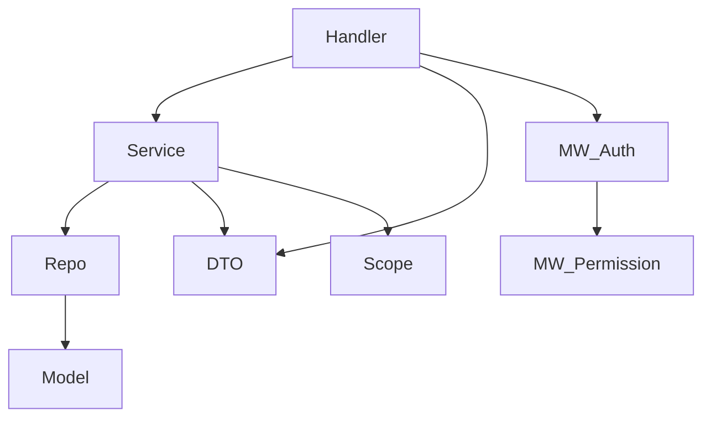

# 用户系统

<cite>
**本文档引用的文件**
- [app/server/internal/dto/user.go](file://app/server/internal/dto/user.go)
- [app/server/internal/dto/auth.go](file://app/server/internal/dto/auth.go)
- [app/server/internal/dto/common.go](file://app/server/internal/dto/common.go)
- [app/server/internal/model/sys_user.go](file://app/server/internal/model/sys_user.go)
- [app/server/internal/model/sys_role.go](file://app/server/internal/model/sys_role.go)
- [app/server/internal/model/base.go](file://app/server/internal/model/base.go)
- [app/server/internal/service/user.go](file://app/server/internal/service/user.go)
- [app/server/internal/service/auth.go](file://app/server/internal/service/auth.go)
- [app/server/internal/repository/sys_user.go](file://app/server/internal/repository/sys_user.go)
- [app/server/internal/handler/v1/user.go](file://app/server/internal/handler/v1/user.go)
- [app/server/internal/handler/v1/auth.go](file://app/server/internal/handler/v1/auth.go)
- [app/server/internal/middleware/auth.go](file://app/server/internal/middleware/auth.go)
- [app/server/internal/middleware/permission.go](file://app/server/internal/middleware/permission.go)
- [app/server/internal/scope/data_scope.go](file://app/server/internal/scope/data_scope.go)
- [app/web/src/service/api/system-manage.ts](file://app/web/src/service/api/system-manage.ts)
- [app/web/src/store/modules/auth/index.ts](file://app/web/src/store/modules/auth/index.ts)
</cite>

## 目录
1. [简介](#简介)
2. [项目结构](#项目结构)
3. [核心组件](#核心组件)
4. [架构总览](#架构总览)
5. [详细组件分析](#详细组件分析)
6. [依赖关系分析](#依赖关系分析)
7. [性能考量](#性能考量)
8. [故障排查指南](#故障排查指南)
9. [结论](#结论)
10. [附录](#附录)

## 简介
本文件面向“用户系统”的全面功能文档，覆盖用户注册、登录认证、权限验证、个人信息管理、角色与权限分配、多租户/数据权限支持、会话管理策略、用户状态与密码安全、验证码机制、第三方登录集成、用户搜索过滤、批量操作、数据导出、用户行为审计与安全监控、异常处理等。文档同时提供代码级架构图与流程图，帮助开发者快速理解与扩展。

## 项目结构
后端采用 Go + Gin + GORM 的分层架构：DTO（输入输出）、Model（数据库映射）、Repository（数据访问）、Service（业务逻辑）、Handler（HTTP 控制器）、Middleware（中间件）、Scope（数据权限）；前端使用 Vue + Pinia + Axios 进行 API 调用与状态管理。

图表来源
- [app/web/src/service/api/system-manage.ts:112-174](file://app/web/src/service/api/system-manage.ts#L112-L174)
- [app/web/src/store/modules/auth/index.ts:99-159](file://app/web/src/store/modules/auth/index.ts#L99-L159)
- [app/server/internal/handler/v1/user.go:26-170](file://app/server/internal/handler/v1/user.go#L26-L170)
- [app/server/internal/handler/v1/auth.go:23-122](file://app/server/internal/handler/v1/auth.go#L23-L122)
- [app/server/internal/service/user.go:19-158](file://app/server/internal/service/user.go#L19-L158)
- [app/server/internal/service/auth.go:31-248](file://app/server/internal/service/auth.go#L31-L248)
- [app/server/internal/repository/sys_user.go:12-197](file://app/server/internal/repository/sys_user.go#L12-L197)
- [app/server/internal/middleware/auth.go:12-41](file://app/server/internal/middleware/auth.go#L12-L41)
- [app/server/internal/middleware/permission.go:10-53](file://app/server/internal/middleware/permission.go#L10-L53)
- [app/server/internal/scope/data_scope.go:11-135](file://app/server/internal/scope/data_scope.go#L11-L135)

章节来源
- [app/server/internal/dto/user.go:5-60](file://app/server/internal/dto/user.go#L5-L60)
- [app/server/internal/dto/auth.go:3-57](file://app/server/internal/dto/auth.go#L3-L57)
- [app/server/internal/dto/common.go:3-52](file://app/server/internal/dto/common.go#L3-L52)
- [app/server/internal/model/sys_user.go:5-36](file://app/server/internal/model/sys_user.go#L5-L36)
- [app/server/internal/model/sys_role.go:14-36](file://app/server/internal/model/sys_role.go#L14-L36)
- [app/server/internal/model/base.go:12-52](file://app/server/internal/model/base.go#L12-L52)
- [app/server/internal/service/user.go:19-158](file://app/server/internal/service/user.go#L19-L158)
- [app/server/internal/service/auth.go:31-248](file://app/server/internal/service/auth.go#L31-L248)
- [app/server/internal/repository/sys_user.go:12-197](file://app/server/internal/repository/sys_user.go#L12-L197)
- [app/server/internal/handler/v1/user.go:18-178](file://app/server/internal/handler/v1/user.go#L18-L178)
- [app/server/internal/handler/v1/auth.go:14-142](file://app/server/internal/handler/v1/auth.go#L14-L142)
- [app/server/internal/middleware/auth.go:12-41](file://app/server/internal/middleware/auth.go#L12-L41)
- [app/server/internal/middleware/permission.go:10-53](file://app/server/internal/middleware/permission.go#L10-L53)
- [app/server/internal/scope/data_scope.go:11-135](file://app/server/internal/scope/data_scope.go#L11-L135)
- [app/web/src/service/api/system-manage.ts:112-174](file://app/web/src/service/api/system-manage.ts#L112-L174)
- [app/web/src/store/modules/auth/index.ts:99-159](file://app/web/src/store/modules/auth/index.ts#L99-L159)

## 核心组件
- 用户模型与角色模型：定义用户、角色、用户-角色关联、角色-部门关联等核心实体。
- 用户服务：负责用户创建、更新、删除、分页查询、重置密码、角色替换等。
- 认证服务：负责登录校验、密码风控、登录成功记录、签发令牌、获取用户信息与菜单树。
- 数据访问层：封装用户、角色、菜单、按钮、登录日志等查询与写入。
- HTTP 处理器：暴露 REST API，绑定 DTO，调用服务层，并返回统一响应。
- 中间件：JWT 认证中间件与按钮级权限中间件。
- 数据权限作用域：根据用户角色与部门范围动态生成查询过滤条件。
- 前端 API 与状态：定义系统管理相关 API，维护登录态与用户信息。

章节来源
- [app/server/internal/model/sys_user.go:5-36](file://app/server/internal/model/sys_user.go#L5-L36)
- [app/server/internal/model/sys_role.go:14-36](file://app/server/internal/model/sys_role.go#L14-L36)
- [app/server/internal/service/user.go:27-158](file://app/server/internal/service/user.go#L27-L158)
- [app/server/internal/service/auth.go:41-248](file://app/server/internal/service/auth.go#L41-L248)
- [app/server/internal/repository/sys_user.go:21-197](file://app/server/internal/repository/sys_user.go#L21-L197)
- [app/server/internal/handler/v1/user.go:26-170](file://app/server/internal/handler/v1/user.go#L26-L170)
- [app/server/internal/handler/v1/auth.go:23-122](file://app/server/internal/handler/v1/auth.go#L23-L122)
- [app/server/internal/middleware/auth.go:12-41](file://app/server/internal/middleware/auth.go#L12-L41)
- [app/server/internal/middleware/permission.go:10-53](file://app/server/internal/middleware/permission.go#L10-L53)
- [app/server/internal/scope/data_scope.go:22-135](file://app/server/internal/scope/data_scope.go#L22-L135)
- [app/web/src/service/api/system-manage.ts:112-174](file://app/web/src/service/api/system-manage.ts#L112-L174)
- [app/web/src/store/modules/auth/index.ts:99-159](file://app/web/src/store/modules/auth/index.ts#L99-L159)

## 架构总览
后端采用清晰的分层与职责分离，Handler 仅负责请求绑定与响应封装；Service 负责业务规则与跨领域协调；Repository 封装数据库操作；Middleware 提供横切能力；Scope 统一数据权限过滤。

图表来源
- [app/server/internal/handler/v1/auth.go:23-122](file://app/server/internal/handler/v1/auth.go#L23-L122)
- [app/server/internal/middleware/auth.go:12-41](file://app/server/internal/middleware/auth.go#L12-L41)
- [app/server/internal/service/auth.go:31-248](file://app/server/internal/service/auth.go#L31-L248)
- [app/server/internal/repository/sys_user.go:12-197](file://app/server/internal/repository/sys_user.go#L12-L197)
- [app/server/internal/scope/data_scope.go:115-135](file://app/server/internal/scope/data_scope.go#L115-L135)

## 详细组件分析

### 用户注册与管理
- 用户创建：校验用户名唯一性，密码加密存储，可选设置状态、部门、性别、电话、邮箱、头像、角色集合。
- 用户更新：支持更新基本信息与状态，角色集合通过替换操作更新。
- 用户删除：软删除或物理删除（取决于具体实现）。
- 用户分页与搜索：支持按用户名、昵称、手机号、邮箱、性别、状态等条件组合查询。
- 重置密码：管理员可重置用户密码，清除锁定状态与错误计数。

图表来源
- [app/server/internal/handler/v1/user.go:71-92](file://app/server/internal/handler/v1/user.go#L71-L92)
- [app/server/internal/service/user.go:27-69](file://app/server/internal/service/user.go#L27-L69)
- [app/server/internal/repository/sys_user.go:134-148](file://app/server/internal/repository/sys_user.go#L134-L148)
- [app/server/internal/repository/sys_user.go:181-196](file://app/server/internal/repository/sys_user.go#L181-L196)

章节来源
- [app/server/internal/dto/user.go:5-29](file://app/server/internal/dto/user.go#L5-L29)
- [app/server/internal/model/sys_user.go:5-36](file://app/server/internal/model/sys_user.go#L5-L36)
- [app/server/internal/service/user.go:27-158](file://app/server/internal/service/user.go#L27-L158)
- [app/server/internal/repository/sys_user.go:150-179](file://app/server/internal/repository/sys_user.go#L150-L179)
- [app/server/internal/handler/v1/user.go:71-170](file://app/server/internal/handler/v1/user.go#L71-L170)

### 登录认证与会话管理
- 登录流程：用户名查找、状态与锁定检查、密码校验（bcrypt）、错误计数与临时锁定、登录成功更新、签发访问令牌与刷新令牌。
- 用户信息与菜单树：按用户角色聚合按钮码与菜单，构建树形路由结构。
- 会话与中间件：JWT 中间件解析 Authorization 头，注入用户标识；按钮级权限中间件按需加载按钮码进行校验。

图表来源
- [app/server/internal/handler/v1/auth.go:23-56](file://app/server/internal/handler/v1/auth.go#L23-L56)
- [app/server/internal/service/auth.go:41-95](file://app/server/internal/service/auth.go#L41-L95)
- [app/server/internal/repository/sys_user.go:39-64](file://app/server/internal/repository/sys_user.go#L39-L64)

章节来源
- [app/server/internal/dto/auth.go:3-23](file://app/server/internal/dto/auth.go#L3-L23)
- [app/server/internal/service/auth.go:41-248](file://app/server/internal/service/auth.go#L41-L248)
- [app/server/internal/handler/v1/auth.go:23-122](file://app/server/internal/handler/v1/auth.go#L23-L122)
- [app/server/internal/middleware/auth.go:12-41](file://app/server/internal/middleware/auth.go#L12-L41)

### 权限验证与按钮级控制
- 按钮码加载：按用户角色聚合按钮码集合。
- 中间件校验：从上下文取 user_id，加载按钮码，匹配目标按钮码，未命中返回 403。
- 菜单树构建：按 parent_id 分组排序，构建树形结构，支持重定向与首页选择。

图表来源
- [app/server/internal/middleware/permission.go:20-53](file://app/server/internal/middleware/permission.go#L20-L53)
- [app/server/internal/service/auth.go:97-134](file://app/server/internal/service/auth.go#L97-L134)

章节来源
- [app/server/internal/middleware/permission.go:10-53](file://app/server/internal/middleware/permission.go#L10-L53)
- [app/server/internal/service/auth.go:97-163](file://app/server/internal/service/auth.go#L97-L163)

### 角色体系与权限分配
- 角色模型：角色名称、编码、描述、数据权限范围、排序、状态、是否系统内置。
- 角色数据范围：全部、自定义部门、本部门、本部门及子部门、仅本人。
- 角色-菜单/按钮授权：通过角色表与中间表维护授权关系，前端按需拉取授权列表。

图表来源
- [app/server/internal/model/sys_role.go:14-36](file://app/server/internal/model/sys_role.go#L14-L36)
- [app/server/internal/repository/sys_user.go:66-88](file://app/server/internal/repository/sys_user.go#L66-L88)
- [app/server/internal/repository/sys_user.go:181-196](file://app/server/internal/repository/sys_user.go#L181-L196)

章节来源
- [app/server/internal/model/sys_role.go:14-36](file://app/server/internal/model/sys_role.go#L14-L36)
- [app/server/internal/repository/sys_user.go:66-130](file://app/server/internal/repository/sys_user.go#L66-L130)

### 多租户与数据权限
- 数据权限上下文：根据用户角色与部门范围计算“可见数据范围”，支持超管、仅本人、部门、部门及子部门、自定义部门等模式。
- 作用域函数：将权限条件注入查询，统一处理业务表 owner_id 与 dept_id。
- 适用场景：图书、章节、标签等业务表可复用该作用域，确保数据隔离与最小可见原则。

图表来源
- [app/server/internal/scope/data_scope.go:22-95](file://app/server/internal/scope/data_scope.go#L22-L95)
- [app/server/internal/scope/data_scope.go:115-135](file://app/server/internal/scope/data_scope.go#L115-L135)

章节来源
- [app/server/internal/scope/data_scope.go:11-135](file://app/server/internal/scope/data_scope.go#L11-L135)

### 用户状态管理与密码安全
- 用户状态：启用/禁用，影响登录校验。
- 密码安全：bcrypt 加密存储；登录错误计数与临时锁定（超过阈值自动锁定一段时间）。
- 登录成功/失败日志：记录 IP、UA、结果与消息，便于审计与风控。

章节来源
- [app/server/internal/model/sys_user.go:10-22](file://app/server/internal/model/sys_user.go#L10-L22)
- [app/server/internal/service/auth.go:19-29](file://app/server/internal/service/auth.go#L19-L29)
- [app/server/internal/service/auth.go:41-95](file://app/server/internal/service/auth.go#L41-L95)
- [app/server/internal/service/auth.go:234-248](file://app/server/internal/service/auth.go#L234-L248)

### 验证码机制
- 仓库中未发现验证码相关实现文件。若需要集成图形验证码或短信验证码，请在认证流程中增加相应中间件与服务层调用，并在登录请求 DTO 中扩展字段与校验规则。

[本节为概念性说明，不直接分析具体文件]

### 第三方登录集成
- 仓库中未发现第三方登录实现。若需接入微信、GitHub 等第三方登录，可在认证服务中新增第三方登录流程，返回统一的登录响应结构，并在前端 store 中完成 token 存储与用户信息初始化。

[本节为概念性说明，不直接分析具体文件]

### 用户搜索过滤、批量操作与数据导出
- 搜索过滤：用户分页接口支持多字段模糊匹配与状态筛选。
- 批量操作：DTO 中提供 IDsRequest，可用于批量删除等操作（需在处理器与服务层补充对应实现）。
- 数据导出：建议在处理器层增加导出接口，将分页查询结果转换为 CSV/Excel 格式返回。

章节来源
- [app/server/internal/dto/common.go:48-52](file://app/server/internal/dto/common.go#L48-L52)
- [app/server/internal/repository/sys_user.go:150-179](file://app/server/internal/repository/sys_user.go#L150-L179)
- [app/web/src/service/api/system-manage.ts:112-174](file://app/web/src/service/api/system-manage.ts#L112-L174)

### 用户行为审计与安全监控
- 登录日志：记录用户类型、用户 ID/名称、IP、UA、登录类型、结果与消息。
- 安全监控：可通过日志分析工具采集登录日志，识别异常登录（频繁错误、不同地域并发登录等）。
- 异常处理：处理器对业务错误映射为明确的错误码与提示，便于前端展示与埋点统计。

章节来源
- [app/server/internal/service/auth.go:234-248](file://app/server/internal/service/auth.go#L234-L248)
- [app/server/internal/handler/v1/auth.go:42-56](file://app/server/internal/handler/v1/auth.go#L42-L56)

## 依赖关系分析
- 组件耦合：Handler 依赖 Service；Service 依赖 Repository；Repository 依赖 Model；Service 与 DTO 解耦；Middleware 与业务解耦。
- 外部依赖：bcrypt（密码加密）、Gin（HTTP）、GORM（ORM）、JWT（令牌）。
- 循环依赖：未见循环导入；各层单向依赖清晰。

图表来源
- [app/server/internal/handler/v1/user.go:18-24](file://app/server/internal/handler/v1/user.go#L18-L24)
- [app/server/internal/handler/v1/auth.go:15-21](file://app/server/internal/handler/v1/auth.go#L15-L21)
- [app/server/internal/service/user.go:19-25](file://app/server/internal/service/user.go#L19-L25)
- [app/server/internal/service/auth.go:32-39](file://app/server/internal/service/auth.go#L32-L39)
- [app/server/internal/middleware/auth.go:12-41](file://app/server/internal/middleware/auth.go#L12-L41)
- [app/server/internal/middleware/permission.go:10-53](file://app/server/internal/middleware/permission.go#L10-L53)
- [app/server/internal/scope/data_scope.go:11-135](file://app/server/internal/scope/data_scope.go#L11-L135)

章节来源
- [app/server/internal/handler/v1/user.go:18-24](file://app/server/internal/handler/v1/user.go#L18-L24)
- [app/server/internal/handler/v1/auth.go:15-21](file://app/server/internal/handler/v1/auth.go#L15-L21)
- [app/server/internal/service/user.go:19-25](file://app/server/internal/service/user.go#L19-L25)
- [app/server/internal/service/auth.go:32-39](file://app/server/internal/service/auth.go#L32-L39)
- [app/server/internal/middleware/auth.go:12-41](file://app/server/internal/middleware/auth.go#L12-L41)
- [app/server/internal/middleware/permission.go:10-53](file://app/server/internal/middleware/permission.go#L10-L53)
- [app/server/internal/scope/data_scope.go:11-135](file://app/server/internal/scope/data_scope.go#L11-L135)

## 性能考量
- 按钮权限中间件当前每次请求均查询用户按钮码，建议引入缓存（如内存或 Redis）降低 DB 压力，结合令牌刷新周期同步缓存。
- 登录错误计数与锁定采用原子更新，避免并发竞争导致的误判。
- 数据权限作用域通过一次性计算上下文并在查询中注入过滤条件，减少分支判断与重复计算。
- 分页查询使用 Count + Limit/Offset，建议对常用过滤字段建立合适索引（如用户名、手机号、邮箱、部门等）。

[本节为通用指导，不直接分析具体文件]

## 故障排查指南
- 401 未授权：检查 Authorization 头格式与 JWT 是否有效。
- 403 权限不足：确认用户按钮码集合是否包含目标按钮码。
- 用户名已存在：创建用户时用户名重复，需更换用户名。
- 用户被禁用/锁定：检查用户状态与锁定截止时间。
- 登录失败：查看登录日志中的原因字段，定位是用户名不存在、密码错误还是账户锁定。

章节来源
- [app/server/internal/handler/v1/auth.go:42-56](file://app/server/internal/handler/v1/auth.go#L42-L56)
- [app/server/internal/handler/v1/user.go:172-178](file://app/server/internal/handler/v1/user.go#L172-L178)
- [app/server/internal/service/auth.go:24-29](file://app/server/internal/service/auth.go#L24-L29)
- [app/server/internal/service/auth.go:234-248](file://app/server/internal/service/auth.go#L234-L248)

## 结论
本用户系统以清晰的分层设计实现了用户注册、登录认证、权限验证、角色与数据权限、会话管理、审计与安全监控等核心能力。通过可扩展的 DTO/Model/Repository/Service/Handler/Middleware/Scope 架构，能够平滑支持多租户、验证码、第三方登录、批量操作与数据导出等后续增强需求。

[本节为总结性内容，不直接分析具体文件]

## 附录

### API 一览（后端）
- 用户分页：POST /api/manage/user/page
- 用户详情：GET /api/manage/user/{id}
- 新增用户：POST /api/manage/user
- 编辑用户：PUT /api/manage/user/{id}
- 删除用户：DELETE /api/manage/user/{id}
- 重置密码：PUT /api/manage/user/{id}/reset-password
- 登录：POST /api/auth/login
- 当前用户信息：GET /api/auth/userInfo
- 当前用户菜单树：GET /api/auth/menu
- 当前用户按钮码：GET /api/auth/buttons

章节来源
- [app/server/internal/handler/v1/user.go:26-170](file://app/server/internal/handler/v1/user.go#L26-L170)
- [app/server/internal/handler/v1/auth.go:23-122](file://app/server/internal/handler/v1/auth.go#L23-L122)
- [app/web/src/service/api/system-manage.ts:112-174](file://app/web/src/service/api/system-manage.ts#L112-L174)