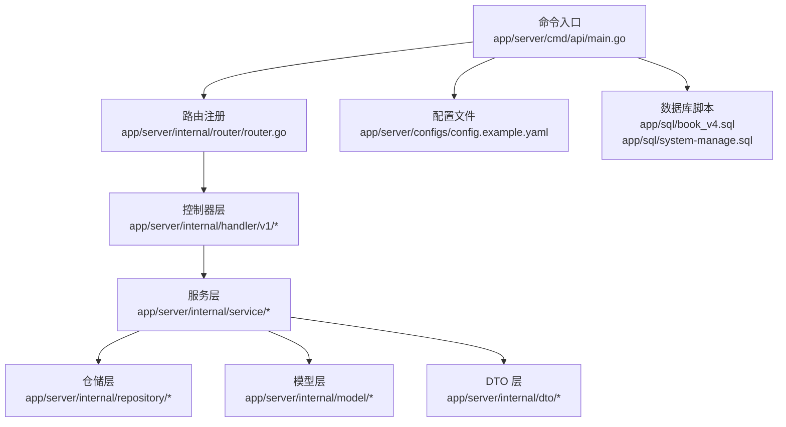
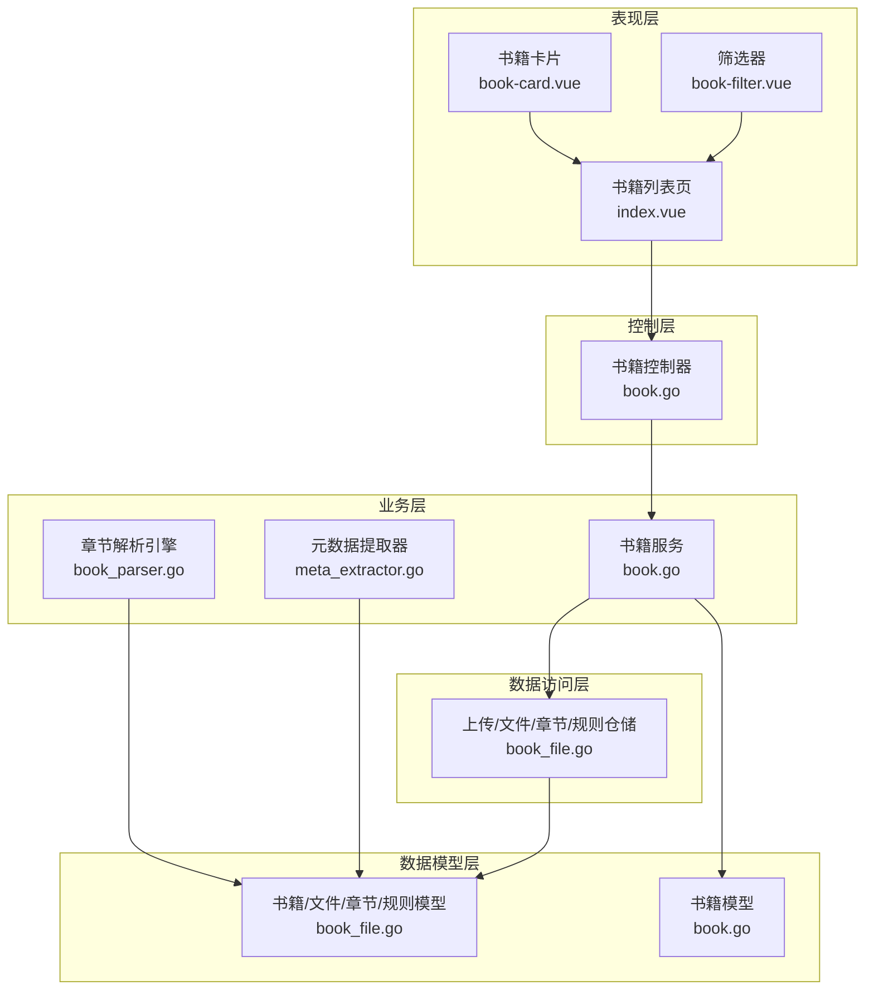
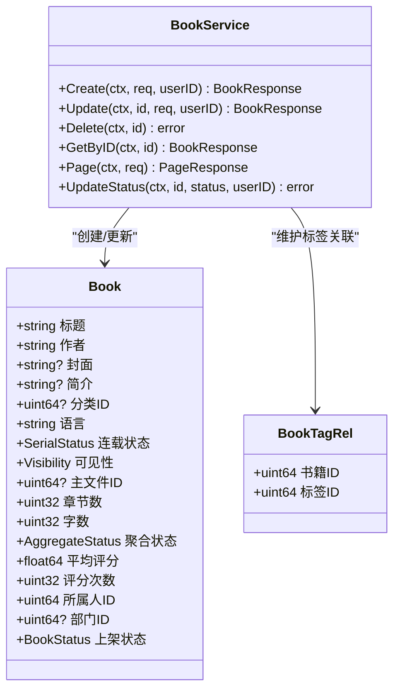
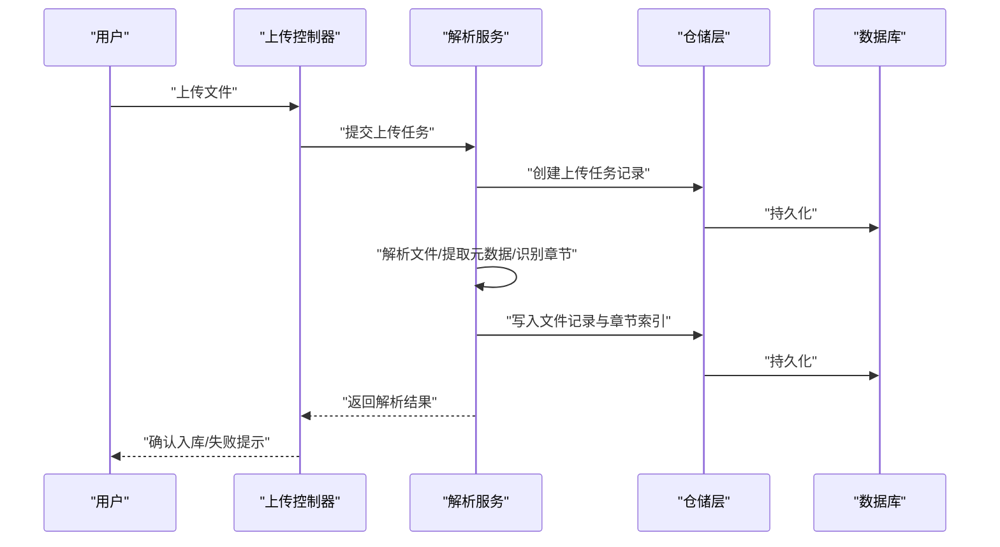
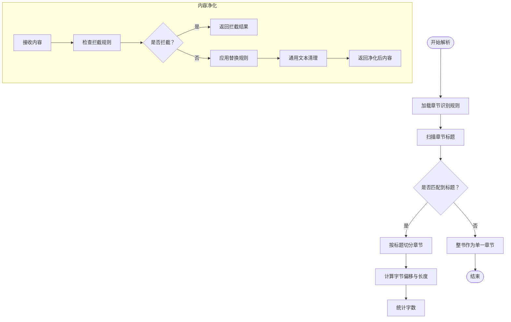
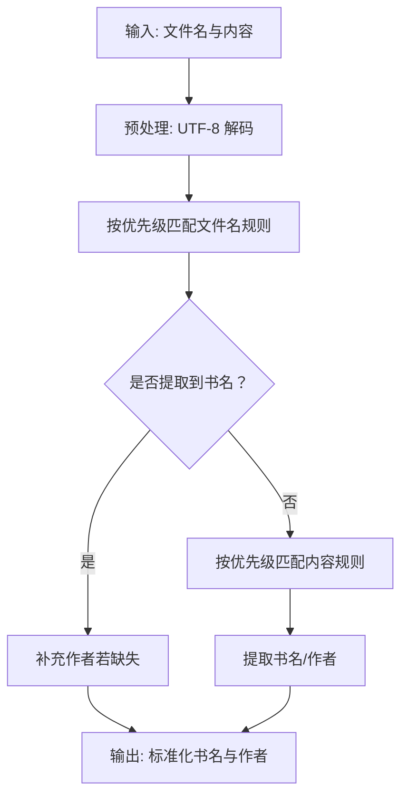
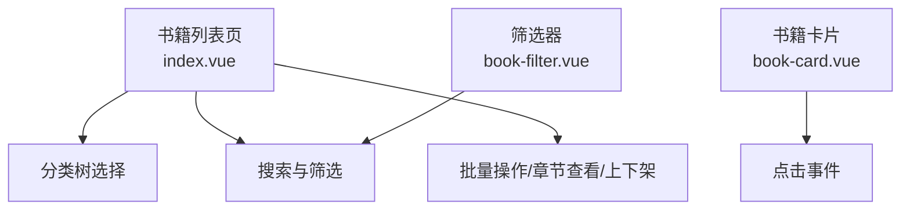
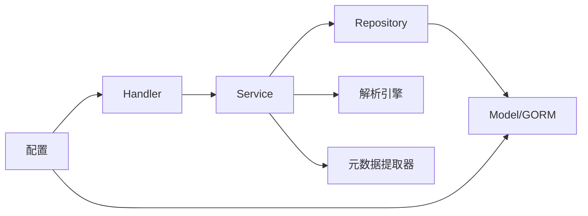

# 电子书管理

<cite>
**本文档引用的文件**
- [main.go](file://app/server/cmd/api/main.go)
- [config.example.yaml](file://app/server/configs/config.example.yaml)
- [router.go](file://app/server/internal/router/router.go)
- [book.go](file://app/server/internal/handler/v1/book.go)
- [book.go](file://app/server/internal/service/book.go)
- [book.go](file://app/server/internal/model/book.go)
- [book_file.go](file://app/server/internal/model/book_file.go)
- [book.go](file://app/server/internal/dto/book.go)
- [book_file.go](file://app/server/internal/dto/book_file.go)
- [book_parser.go](file://app/server/internal/service/book_parser.go)
- [meta_extractor.go](file://app/server/internal/service/meta_extractor.go)
- [book_file.go](file://app/server/internal/repository/book_file.go)
- [index.vue](file://app/web/src/views/admin/library/book/index.vue)
- [book-card.vue](file://app/web/src/components/book-card.vue)
- [book-filter.vue](file://app/web/src/components/book-filter.vue)
- [book_v4.sql](file://app/sql/book_v4.sql)
- [system-manage.sql](file://app/sql/system-manage.sql)
</cite>

## 目录
1. [简介](#简介)
2. [项目结构](#项目结构)
3. [核心组件](#核心组件)
4. [架构总览](#架构总览)
5. [详细组件分析](#详细组件分析)
6. [依赖分析](#依赖分析)
7. [性能考虑](#性能考虑)
8. [故障排查指南](#故障排查指南)
9. [结论](#结论)
10. [附录](#附录)

## 简介
本系统为一个面向小说与长文本的电子书管理系统，提供完整的电子书生命周期管理能力，涵盖上传、解析、元数据提取、章节识别与管理、内容阅读、状态与权限控制、分类与标签体系、搜索与过滤、以及后台扫描入库等能力。系统采用前后端分离架构，后端基于 Go 语言与 Gin 框架，数据库使用 MySQL；前端采用 Vue3 + TypeScript + Naive UI。

## 项目结构
后端服务通过命令入口启动，加载配置、初始化日志与 JWT，连接数据库，并注册路由。业务层分为 DTO、Model、Repository、Service、Handler 五层，职责清晰，便于扩展与维护。数据库结构在 SQL 文件中定义，包含电子书、文件、章节、上传任务、规则等核心表。

**图表来源**
- [main.go:30-84](file://app/server/cmd/api/main.go#L30-L84)
- [router.go](file://app/server/internal/router/router.go)
- [book.go:15-21](file://app/server/internal/handler/v1/book.go#L15-L21)
- [book.go:21-43](file://app/server/internal/service/book.go#L21-L43)
- [book_file.go:14-20](file://app/server/internal/repository/book_file.go#L14-L20)
- [book.go:40-59](file://app/server/internal/model/book.go#L40-L59)
- [book.go:5-16](file://app/server/internal/dto/book.go#L5-L16)
- [config.example.yaml:1-21](file://app/server/configs/config.example.yaml#L1-L21)
- [book_v4.sql](file://app/sql/book_v4.sql)
- [system-manage.sql](file://app/sql/system-manage.sql)

**章节来源**
- [main.go:30-84](file://app/server/cmd/api/main.go#L30-L84)
- [config.example.yaml:1-21](file://app/server/configs/config.example.yaml#L1-L21)

## 核心组件
- 书籍管理：提供书籍新增、编辑、删除、分页查询、状态更新等能力，支持分类与标签关联。
- 文件与章节：支持上传任务跟踪、文件入库、章节索引与内容读取、章节规则与内容净化规则。
- 元数据与解析：内置元数据提取规则与章节识别引擎，支持多种文本格式与常见章节格式。
- 前端展示：提供书籍列表、卡片、筛选器、上传与扫描弹窗等交互组件。

**章节来源**
- [book.go:23-167](file://app/server/internal/handler/v1/book.go#L23-L167)
- [book.go:45-316](file://app/server/internal/service/book.go#L45-L316)
- [book.go:40-59](file://app/server/internal/model/book.go#L40-L59)
- [book_file.go:24-94](file://app/server/internal/model/book_file.go#L24-L94)
- [book_parser.go:55-108](file://app/server/internal/service/book_parser.go#L55-L108)
- [meta_extractor.go:113-153](file://app/server/internal/service/meta_extractor.go#L113-L153)
- [index.vue:84-111](file://app/web/src/views/admin/library/book/index.vue#L84-L111)
- [book-card.vue:9-23](file://app/web/src/components/book-card.vue#L9-L23)
- [book-filter.vue:5-19](file://app/web/src/components/book-filter.vue#L5-L19)

## 架构总览
系统采用典型的分层架构：
- 表现层：前端页面与组件负责用户交互与数据展示。
- 控制层：Gin 路由与 Handler 接收请求，进行参数校验与错误映射。
- 业务层：Service 实现核心业务逻辑，协调仓储与外部工具。
- 数据访问层：Repository 封装数据库操作，提供事务与批量处理能力。
- 数据模型层：Model 定义实体与状态枚举，确保一致性。
- 配置与基础设施：配置文件、日志、JWT 初始化与数据库连接。

**图表来源**
- [index.vue:1-326](file://app/web/src/views/admin/library/book/index.vue#L1-L326)
- [book-card.vue:1-122](file://app/web/src/components/book-card.vue#L1-L122)
- [book-filter.vue:1-139](file://app/web/src/components/book-filter.vue#L1-L139)
- [book.go:15-21](file://app/server/internal/handler/v1/book.go#L15-L21)
- [book.go:21-43](file://app/server/internal/service/book.go#L21-L43)
- [book_parser.go:46-53](file://app/server/internal/service/book_parser.go#L46-L53)
- [meta_extractor.go:14-17](file://app/server/internal/service/meta_extractor.go#L14-L17)
- [book_file.go:14-20](file://app/server/internal/repository/book_file.go#L14-L20)
- [book_file.go:24-94](file://app/server/internal/model/book_file.go#L24-L94)
- [book.go:40-59](file://app/server/internal/model/book.go#L40-L59)

## 详细组件分析

### 书籍管理模块
- 功能要点
  - 新增/编辑：支持标题、作者、封面、简介、分类、语言、连载状态、可见性、标签等字段。
  - 删除：级联删除标签关联与使用计数调整。
  - 分页查询：支持标题、作者、分类、状态、可见性、连载状态、标签、字数区间、更新时间范围等多维过滤。
  - 状态更新：支持上架/下架/审核中/审核拒绝状态切换。
- 数据模型
  - 书籍实体包含标题、作者、封面、简介、分类、语言、连载状态、可见性、主文件、章节总数、字数、聚合状态、评分统计、所属人与部门、上架状态等字段。
  - 标签与书籍为多对多关系，使用中间表维护。
- 事务与一致性
  - 新增/更新标签关联在事务中执行，保证标签使用计数与关联一致性。
  - 分类与标签有效性在创建/更新时校验。

**图表来源**
- [book.go:40-69](file://app/server/internal/model/book.go#L40-L69)
- [book.go:45-316](file://app/server/internal/service/book.go#L45-L316)

**章节来源**
- [book.go:23-167](file://app/server/internal/handler/v1/book.go#L23-L167)
- [book.go:45-316](file://app/server/internal/service/book.go#L45-L316)
- [book.go:40-69](file://app/server/internal/model/book.go#L40-L69)
- [book.go:5-46](file://app/server/internal/dto/book.go#L5-L46)

### 文件与章节管理模块
- 功能要点
  - 上传任务：记录原始文件名、大小、MD5、源格式、解析状态与消息，支持分页查询与按状态拉取。
  - 文件入库：记录书籍ID、原始名、来源类型、内容路径、大小、MD5、字符集、版本、章节数、主文件标识、解析状态与消息。
  - 章节索引：按文件维度建立章节索引，包含章节号、标题、字节偏移、长度、字数、VIP标志与状态。
  - 章节规则与内容净化规则：支持全局或单书覆盖，可配置匹配方式、动作、应用阶段与严重级别。
- 流程概览
  - 上传文件后进入上传任务表，解析完成后写入文件表与章节表。
  - 章节识别优先使用规则，回退内置常见格式；内容净化在入库与出库两个阶段可分别应用。

**图表来源**
- [book_file.go:7-40](file://app/server/internal/dto/book_file.go#L7-L40)
- [book_file.go:80-94](file://app/server/internal/model/book_file.go#L80-L94)
- [book_file.go:22-68](file://app/server/internal/repository/book_file.go#L22-L68)
- [book_parser.go:55-108](file://app/server/internal/service/book_parser.go#L55-L108)
- [meta_extractor.go:113-153](file://app/server/internal/service/meta_extractor.go#L113-L153)

**章节来源**
- [book_file.go:44-96](file://app/server/internal/dto/book_file.go#L44-L96)
- [book_file.go:24-94](file://app/server/internal/model/book_file.go#L24-L94)
- [book_file.go:14-133](file://app/server/internal/repository/book_file.go#L14-L133)

### 章节识别与内容净化引擎
- 章节识别引擎
  - 支持自定义正则规则与内置常见格式识别（中文“第X章”、Chapter X、数字编号、卷/部/集前缀、序言/后记等）。
  - 通过扫描标题行并计算章节内容的字节偏移与长度，输出章节分段结果。
- 内容净化引擎
  - 支持关键词与正则匹配，提供替换、拦截整章、标记审核三种动作。
  - 在入库与出库两个阶段可分别应用，具备通用文本清理能力（空白符压缩、BOM去除、换行符统一）。

**图表来源**
- [book_parser.go:55-108](file://app/server/internal/service/book_parser.go#L55-L108)
- [book_parser.go:172-216](file://app/server/internal/service/book_parser.go#L172-L216)
- [book_parser.go:273-299](file://app/server/internal/service/book_parser.go#L273-L299)
- [book_parser.go:324-353](file://app/server/internal/service/book_parser.go#L324-L353)

**章节来源**
- [book_parser.go:46-216](file://app/server/internal/service/book_parser.go#L46-L216)
- [book_parser.go:235-353](file://app/server/internal/service/book_parser.go#L235-L353)

### 元数据提取模块
- 功能要点
  - 默认规则支持书名号+作者标记、下划线书名_作者、文件名全文作为书名、内容中的书名/作者标记等。
  - 提供优先级与来源（文件名/内容）配置，策略为先文件名后内容补充。
  - 自动解码为 UTF-8 后匹配，避免乱码影响提取效果。
- 使用场景
  - 扫描入库与手动上传时，结合文件名与内容快速建议书名与作者，提升入库效率。

**图表来源**
- [meta_extractor.go:113-153](file://app/server/internal/service/meta_extractor.go#L113-L153)
- [meta_extractor.go:77-111](file://app/server/internal/service/meta_extractor.go#L77-L111)

**章节来源**
- [meta_extractor.go:13-153](file://app/server/internal/service/meta_extractor.go#L13-L153)

### 前端交互组件
- 书籍列表页
  - 支持分类树选择、标题/作者搜索、连载状态与可见性筛选、批量操作、章节查看与上架/下架切换。
- 书籍卡片
  - 支持根据书名哈希生成封面背景、状态标签渲染与点击事件。
- 筛选器
  - 提供分类、连载状态、字数区间、标签、更新时间范围等多维筛选，支持实时联动。

**图表来源**
- [index.vue:84-111](file://app/web/src/views/admin/library/book/index.vue#L84-L111)
- [book-card.vue:25-65](file://app/web/src/components/book-card.vue#L25-L65)
- [book-filter.vue:27-43](file://app/web/src/components/book-filter.vue#L27-L43)

**章节来源**
- [index.vue:1-326](file://app/web/src/views/admin/library/book/index.vue#L1-L326)
- [book-card.vue:1-122](file://app/web/src/components/book-card.vue#L1-L122)
- [book-filter.vue:1-139](file://app/web/src/components/book-filter.vue#L1-L139)

## 依赖分析
- 组件耦合
  - Handler 依赖 Service；Service 依赖 Repository 与 Model；Repository 依赖 Model 与 GORM。
  - 解析与净化引擎独立于业务流程，通过服务层调用，降低耦合度。
- 外部依赖
  - 数据库：MySQL，通过 GORM 访问。
  - 配置：YAML 文件加载，支持日志级别、JWT 密钥与过期时间、数据库连接参数。
  - 前端：Vue3 + Naive UI，组件化复用，API 通过封装的请求模块调用。

**图表来源**
- [book.go:15-21](file://app/server/internal/handler/v1/book.go#L15-L21)
- [book.go:21-43](file://app/server/internal/service/book.go#L21-L43)
- [book_file.go:14-20](file://app/server/internal/repository/book_file.go#L14-L20)
- [book_parser.go:46-53](file://app/server/internal/service/book_parser.go#L46-L53)
- [meta_extractor.go:14-17](file://app/server/internal/service/meta_extractor.go#L14-L17)
- [config.example.yaml:1-21](file://app/server/configs/config.example.yaml#L1-L21)

**章节来源**
- [book.go:15-21](file://app/server/internal/handler/v1/book.go#L15-L21)
- [book.go:21-43](file://app/server/internal/service/book.go#L21-L43)
- [book_file.go:14-20](file://app/server/internal/repository/book_file.go#L14-L20)
- [config.example.yaml:1-21](file://app/server/configs/config.example.yaml#L1-L21)

## 性能考虑
- 数据库连接池
  - 通过配置设置最大空闲与最大打开连接数，避免高并发下的连接瓶颈。
- 批量与分页
  - 仓储层提供分页查询与按状态拉取能力，减少一次性加载大量数据。
- 事务与索引
  - 标签关联与使用计数更新在事务中执行，确保一致性；模型中为常用查询字段建立索引（如分类ID、部门ID、章节号等）。
- 文本处理
  - 解析与净化采用流式扫描与缓冲区优化，避免大文件内存峰值过高。
- 前端渲染
  - 列表采用虚拟滚动与懒加载策略，卡片组件按需渲染状态标签与作者信息。

**章节来源**
- [main.go:59-64](file://app/server/cmd/api/main.go#L59-L64)
- [book_file.go:38-58](file://app/server/internal/repository/book_file.go#L38-L58)
- [book_file.go:40-68](file://app/server/internal/model/book_file.go#L40-L68)
- [book_parser.go:138-170](file://app/server/internal/service/book_parser.go#L138-L170)

## 故障排查指南
- 常见错误与定位
  - 书籍不存在：在查询/更新/删除时出现，检查书籍ID与权限。
  - 标签或分类无效：创建/更新时标签ID或分类ID不在有效集合，检查标签与分类是否存在且启用。
  - 参数绑定错误：请求体格式不正确或必填字段缺失，检查 DTO 绑定与前端表单。
- 日志与配置
  - 日志级别与输出文件在配置中设置，便于定位问题。
  - JWT 密钥与过期时间需正确配置，否则鉴权失败。
- 数据库问题
  - 连接失败：检查主机、端口、用户名、密码与数据库名。
  - SQL 脚本：确保数据库版本与脚本一致，特别是电子书相关表结构。

**章节来源**
- [book.go:169-179](file://app/server/internal/handler/v1/book.go#L169-L179)
- [book.go:15-19](file://app/server/internal/service/book.go#L15-L19)
- [config.example.yaml:1-21](file://app/server/configs/config.example.yaml#L1-L21)
- [main.go:34-57](file://app/server/cmd/api/main.go#L34-L57)

## 结论
本系统围绕电子书生命周期提供了从上传、解析、元数据提取、章节管理到内容阅读的完整能力。通过清晰的分层设计、完善的模型与规则体系、以及前后端协同的交互组件，能够满足中小型团队的电子书管理需求。后续可在以下方面持续优化：引入缓存策略以加速热门书籍与章节读取、完善批量化扫描与导入流程、增强内容净化规则的可视化配置与审计能力。

## 附录
- 数据库脚本
  - 电子书相关表结构与系统管理表结构位于 SQL 目录，部署时请按版本顺序执行。
- 配置说明
  - 服务器端口、数据库连接、JWT 密钥与日志级别均可在配置文件中调整。

**章节来源**
- [book_v4.sql](file://app/sql/book_v4.sql)
- [system-manage.sql](file://app/sql/system-manage.sql)
- [config.example.yaml:1-21](file://app/server/configs/config.example.yaml#L1-L21)