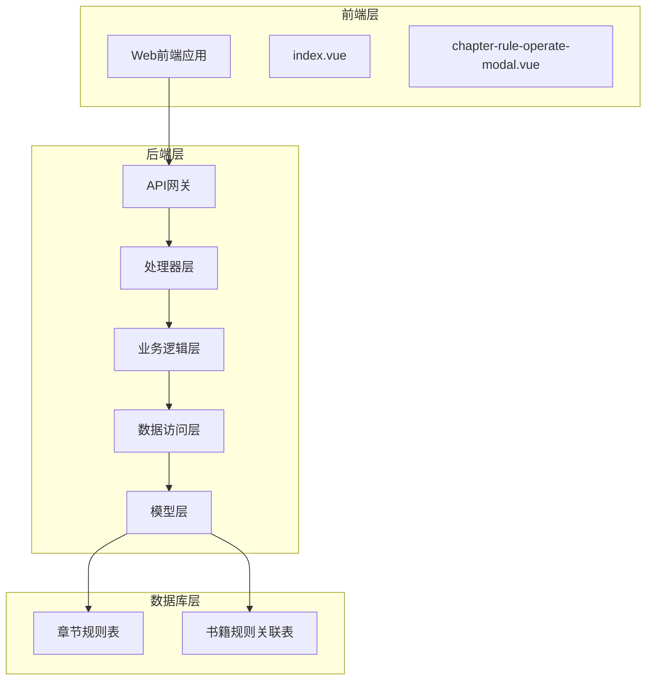
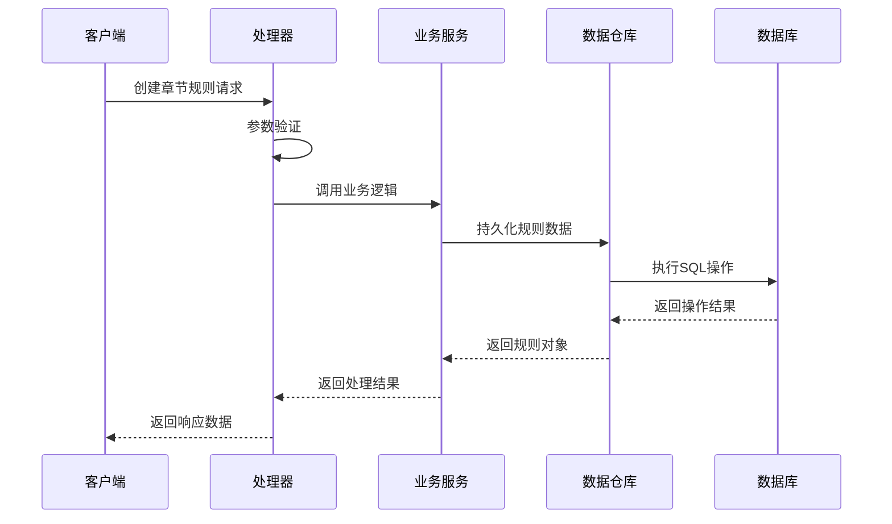
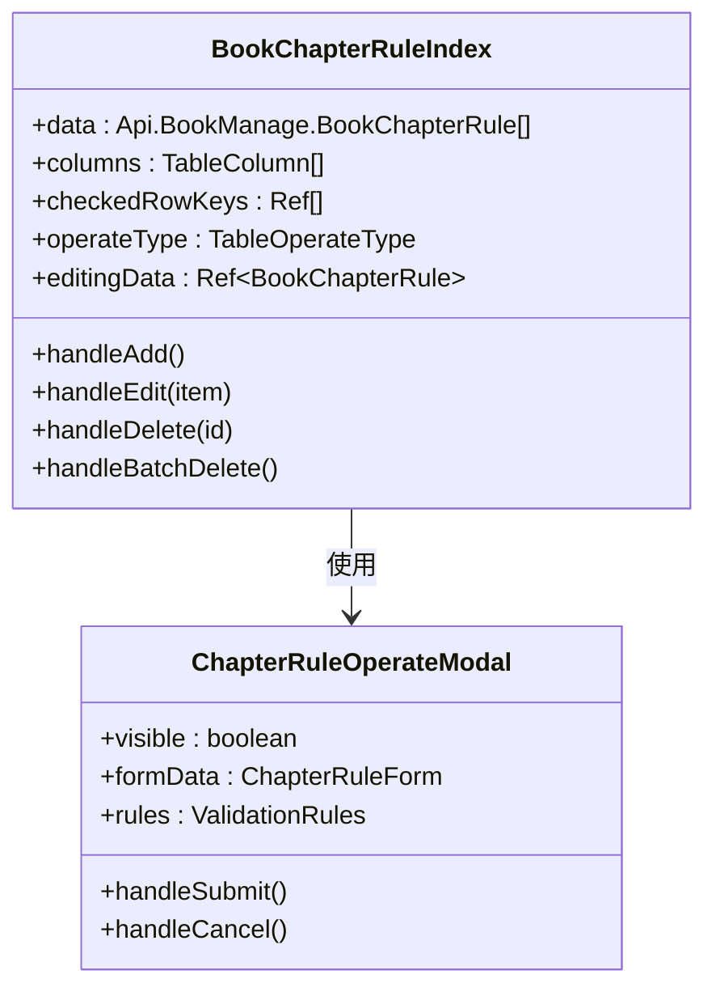
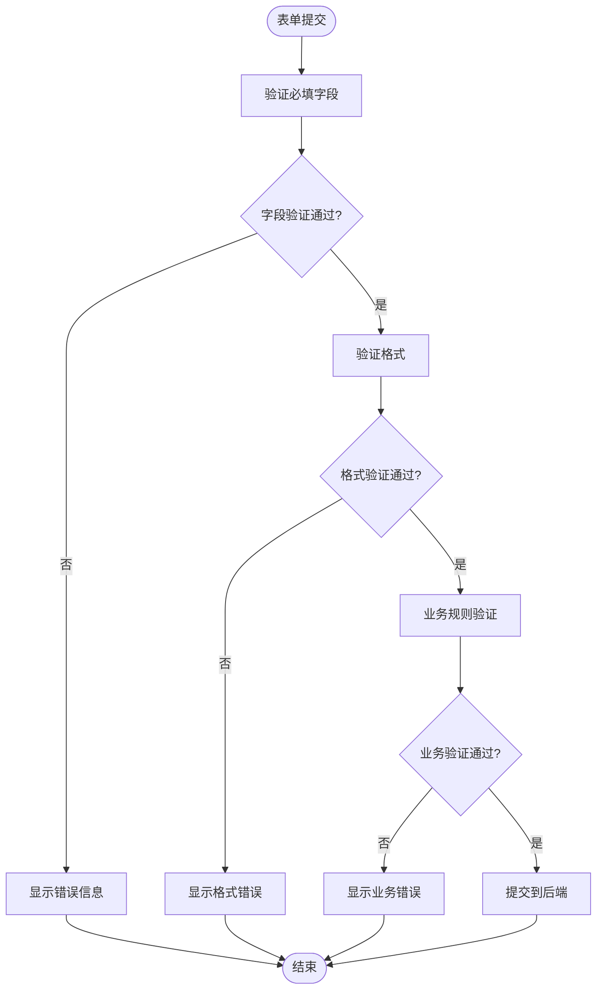
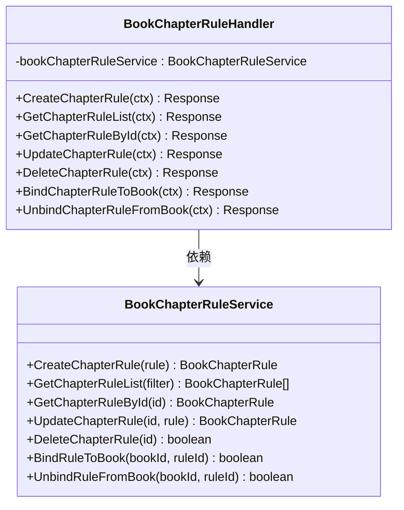
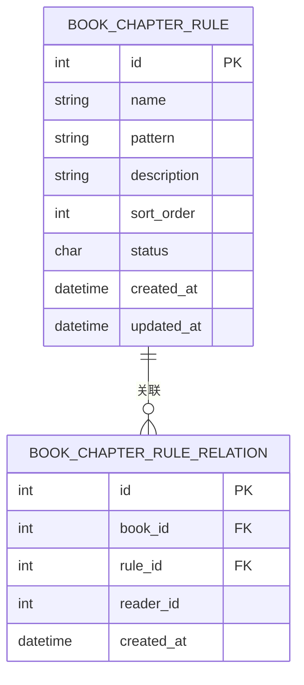
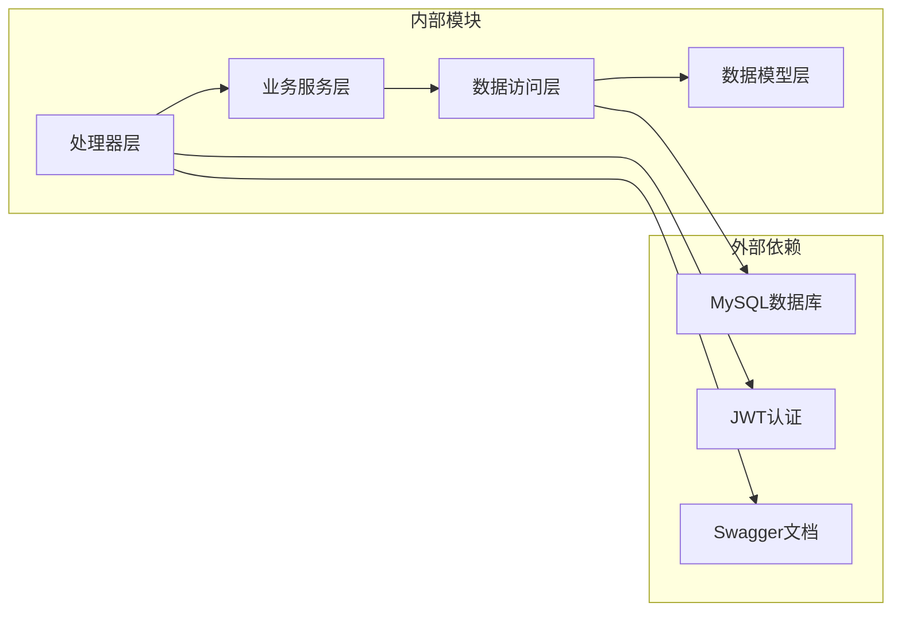

# 章节规则管理

<cite>
**本文档引用的文件**
- [book_chapter_rule.go](file://app/server/internal/dto/book_chapter_rule.go)
- [book_chapter_rule.go](file://app/server/internal/handler/v1/book_chapter_rule.go)
- [book_chapter_rule.go](file://app/server/internal/model/book_chapter_rule.go)
- [book_chapter_rule.go](file://app/server/internal/repository/book_chapter_rule.go)
- [book_chapter_rule.go](file://app/server/internal/service/book_chapter_rule.go)
- [index.vue](file://app/web/src/views/admin/library/book-chapter-rule/index.vue)
- [chapter-rule-operate-modal.vue](file://app/web/src/views/admin/library/book-chapter-rule/modules/chapter-rule-operate-modal.vue)
- [book_v2.sql](file://app/sql/book_v2.sql)
- [docs.go](file://app/server/docs/docs.go)
- [swagger.json](file://app/server/docs/swagger.json)
- [main.go](file://app/server/cmd/api/main.go)
</cite>

## 目录
1. [简介](#简介)
2. [项目结构](#项目结构)
3. [核心组件](#核心组件)
4. [架构概览](#架构概览)
5. [详细组件分析](#详细组件分析)
6. [依赖关系分析](#依赖关系分析)
7. [性能考虑](#性能考虑)
8. [故障排除指南](#故障排除指南)
9. [结论](#结论)

## 简介

章节规则管理是Boread阅读平台中的核心功能模块，负责管理书籍章节识别规则的创建、编辑、删除和绑定操作。该模块通过前后端分离的架构设计，实现了对书籍章节结构的智能识别和解析，为用户提供更好的阅读体验。

本系统采用Go语言开发后端服务，Vue.js构建前端界面，通过RESTful API进行数据交互。章节规则管理功能支持多用户、多书籍的规则管理，并提供了完整的权限控制和数据验证机制。

## 项目结构

章节规则管理模块在项目中采用分层架构设计，主要包含以下层次：

**图表来源**
- [main.go:1-50](file://app/server/cmd/api/main.go#L1-L50)
- [book_chapter_rule.go:1-50](file://app/server/internal/handler/v1/book_chapter_rule.go#L1-L50)

**章节来源**
- [main.go:1-100](file://app/server/cmd/api/main.go#L1-L100)
- [book_chapter_rule.go:1-100](file://app/server/internal/handler/v1/book_chapter_rule.go#L1-L100)

## 核心组件

章节规则管理模块由多个核心组件构成，每个组件都有明确的职责分工：

### 数据传输对象（DTO）
- **ChapterRuleRequest**: 章节规则请求数据结构
- **ChapterRuleResponse**: 章节规则响应数据结构
- **ChapterRuleBindRequest**: 规则绑定请求数据结构
- **ChapterRuleBindResponse**: 规则绑定响应数据结构

### 数据模型
- **BookChapterRule**: 章节规则实体模型
- **BookChapterRuleRelation**: 书籍规则关联模型

### 业务服务
- **BookChapterRuleService**: 章节规则业务逻辑处理
- **ChapterRuleBindingService**: 规则绑定业务逻辑

**章节来源**
- [book_chapter_rule.go:1-200](file://app/server/internal/dto/book_chapter_rule.go#L1-L200)
- [book_chapter_rule.go:1-200](file://app/server/internal/model/book_chapter_rule.go#L1-L200)

## 架构概览

章节规则管理采用经典的MVC架构模式，结合领域驱动设计原则：

**图表来源**
- [book_chapter_rule.go:1-150](file://app/server/internal/handler/v1/book_chapter_rule.go#L1-L150)
- [book_chapter_rule.go:1-200](file://app/server/internal/service/book_chapter_rule.go#L1-L200)

系统架构具有以下特点：
- **分层清晰**: 每一层都有明确的职责边界
- **可扩展性**: 支持新规则类型的添加
- **数据一致性**: 通过事务保证数据完整性
- **安全性**: 基于JWT的认证授权机制

## 详细组件分析

### 前端组件分析

#### 章节规则列表组件
章节规则列表组件提供了完整的CRUD操作界面，包括规则的查看、编辑、删除等功能。

**图表来源**
- [index.vue:1-100](file://app/web/src/views/admin/library/book-chapter-rule/index.vue#L1-L100)
- [chapter-rule-operate-modal.vue:1-150](file://app/web/src/views/admin/library/book-chapter-rule/modules/chapter-rule-operate-modal.vue#L1-L150)

#### 表单验证流程
前端表单采用响应式验证机制，确保数据的完整性和正确性：

**图表来源**
- [chapter-rule-operate-modal.vue:1-200](file://app/web/src/views/admin/library/book-chapter-rule/modules/chapter-rule-operate-modal.vue#L1-L200)

**章节来源**
- [index.vue:1-200](file://app/web/src/views/admin/library/book-chapter-rule/index.vue#L1-L200)
- [chapter-rule-operate-modal.vue:1-250](file://app/web/src/views/admin/library/book-chapter-rule/modules/chapter-rule-operate-modal.vue#L1-L250)

### 后端组件分析

#### 处理器层
处理器层负责HTTP请求的接收和响应的返回，实现业务逻辑与网络通信的分离。

**图表来源**
- [book_chapter_rule.go:1-250](file://app/server/internal/handler/v1/book_chapter_rule.go#L1-L250)
- [book_chapter_rule.go:1-250](file://app/server/internal/service/book_chapter_rule.go#L1-L250)

#### 业务逻辑层
业务逻辑层实现核心的业务规则和流程控制，确保数据的一致性和完整性。

#### 数据访问层
数据访问层提供对数据库的抽象接口，隐藏具体的数据库操作细节。

**章节来源**
- [book_chapter_rule.go:1-300](file://app/server/internal/handler/v1/book_chapter_rule.go#L1-L300)
- [book_chapter_rule.go:1-300](file://app/server/internal/service/book_chapter_rule.go#L1-L300)
- [book_chapter_rule.go:1-200](file://app/server/internal/repository/book_chapter_rule.go#L1-L200)

### 数据模型分析

章节规则管理涉及两个核心数据表：

**图表来源**
- [book_v2.sql:150-160](file://app/sql/book_v2.sql#L150-L160)

**章节来源**
- [book_v2.sql:150-160](file://app/sql/book_v2.sql#L150-L160)

## 依赖关系分析

章节规则管理模块的依赖关系体现了清晰的分层架构：

**图表来源**
- [docs.go:600-900](file://app/server/docs/docs.go#L600-L900)
- [swagger.json:600-900](file://app/server/docs/swagger.json#L600-L900)

**章节来源**
- [docs.go:600-900](file://app/server/docs/docs.go#L600-L900)
- [swagger.json:600-900](file://app/server/docs/swagger.json#L600-L900)

## 性能考虑

章节规则管理模块在设计时充分考虑了性能优化：

### 数据库优化
- **索引策略**: 在book_id和reader_id组合上建立索引，提高查询性能
- **唯一约束**: 防止重复的规则绑定关系
- **外键约束**: 确保数据引用完整性

### 缓存策略
- **规则缓存**: 热门规则可以缓存到内存中
- **用户偏好**: 用户的规则偏好可以缓存减少数据库查询

### 并发控制
- **事务管理**: 使用数据库事务保证操作的原子性
- **锁机制**: 对关键资源使用适当的锁机制

## 故障排除指南

### 常见问题及解决方案

#### 规则绑定失败
**问题描述**: 将规则绑定到书籍时出现错误
**可能原因**:
- 规则已被其他用户绑定
- 书籍不存在或已删除
- 权限不足

**解决步骤**:
1. 检查规则是否已被绑定
2. 验证书籍是否存在
3. 确认用户权限

#### 规则更新冲突
**问题描述**: 更新规则时出现并发冲突
**解决方案**:
- 实施乐观锁机制
- 提供冲突检测和提示
- 支持自动合并策略

#### 性能问题
**问题描述**: 规则查询响应缓慢
**优化建议**:
- 添加适当的数据库索引
- 实现查询结果缓存
- 优化复杂查询语句

**章节来源**
- [book_chapter_rule.go:1-300](file://app/server/internal/service/book_chapter_rule.go#L1-L300)
- [book_chapter_rule.go:1-200](file://app/server/internal/repository/book_chapter_rule.go#L1-L200)

## 结论

章节规则管理模块通过精心设计的架构和实现，为Boread阅读平台提供了强大的书籍章节识别能力。该模块具有以下优势：

1. **架构清晰**: 分层设计使得代码易于维护和扩展
2. **功能完整**: 提供了从创建到绑定的完整生命周期管理
3. **性能优秀**: 通过合理的数据库设计和缓存策略保证了良好的性能
4. **安全可靠**: 基于JWT的认证授权机制确保了系统的安全性

未来可以考虑的功能增强包括：
- 支持更复杂的正则表达式规则
- 实现规则的版本管理和回滚功能
- 添加规则测试和预览功能
- 优化批量操作的性能表现

该模块为整个阅读平台的内容解析和展示奠定了坚实的基础，是系统成功的关键组成部分。