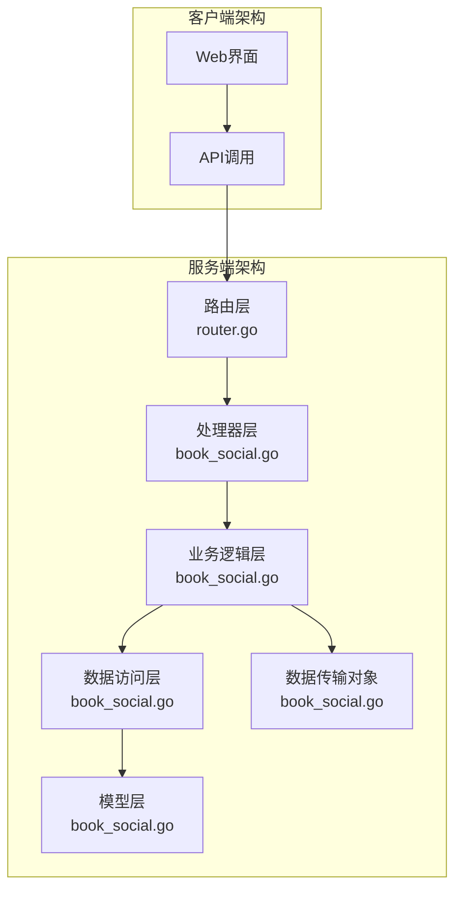
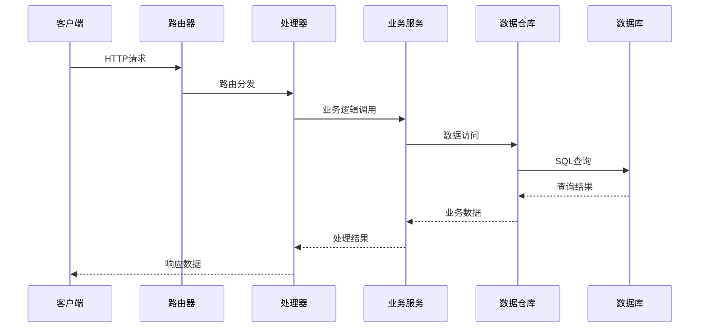
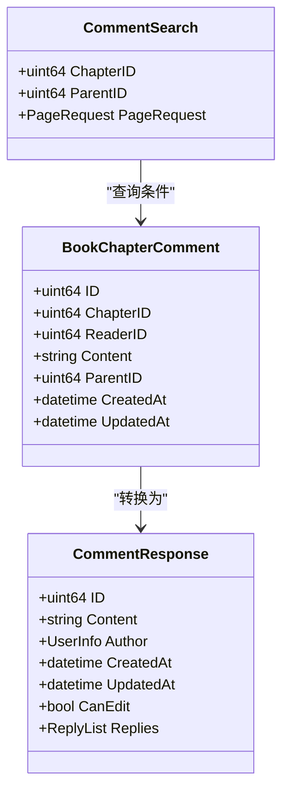
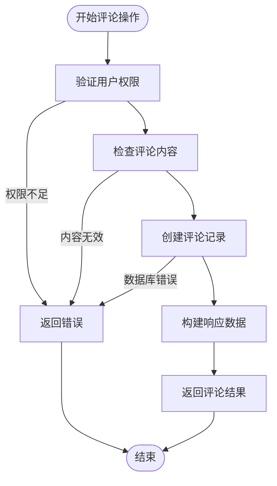
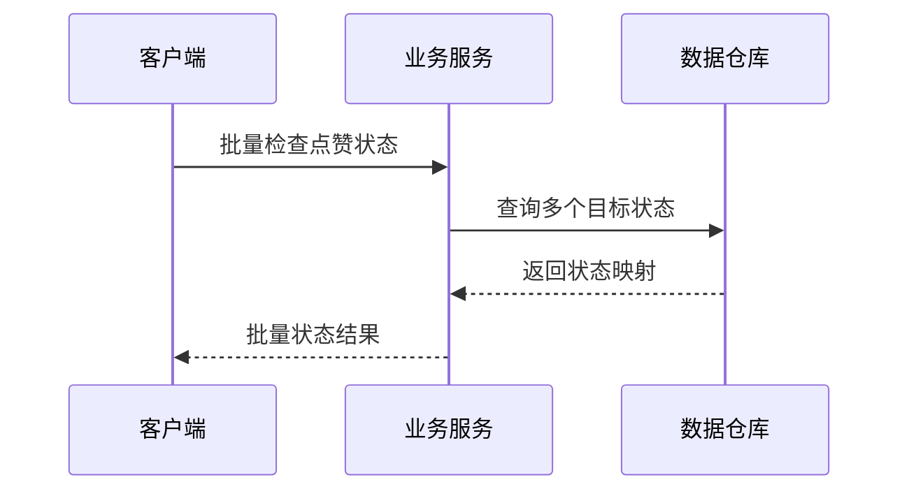
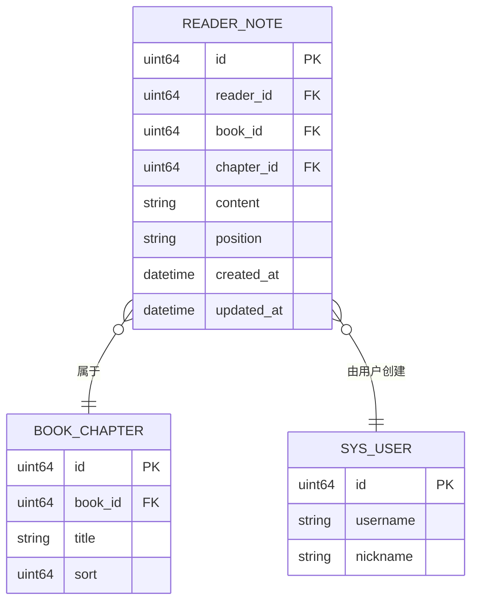
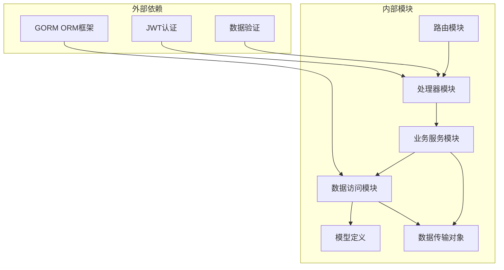

# 社交互动功能

<cite>
**本文档引用的文件**
- [router.go](file://app/server/internal/router/router.go)
- [book_social.go](file://app/server/internal/service/book_social.go)
- [book_social.go](file://app/server/internal/handler/v1/book_social.go)
- [book_social.go](file://app/server/internal/repository/book_social.go)
- [book_social.go](file://app/server/internal/model/book_social.go)
- [book_social.go](file://app/server/internal/dto/book_social.go)
</cite>

## 目录
1. [简介](#简介)
2. [项目结构](#项目结构)
3. [核心组件](#核心组件)
4. [架构概览](#架构概览)
5. [详细组件分析](#详细组件分析)
6. [依赖关系分析](#依赖关系分析)
7. [性能考虑](#性能考虑)
8. [故障排除指南](#故障排除指南)
9. [结论](#结论)

## 简介

社交互动功能是本项目中的重要组成部分，主要包含三个核心模块：评论系统、点赞系统和笔记/划线功能。该功能允许用户对书籍内容进行互动，包括发表评论、点赞支持、添加笔记和划线标记等操作。

系统采用分层架构设计，通过清晰的职责分离实现了高内聚、低耦合的代码结构。每个功能模块都遵循统一的接口规范，确保了系统的可维护性和扩展性。

## 项目结构

社交互动功能在项目中的组织结构如下：



**图表来源**
- [router.go:326-354](file://app/server/internal/router/router.go#L326-L354)
- [book_social.go:1-320](file://app/server/internal/service/book_social.go#L1-L320)

**章节来源**
- [router.go:326-354](file://app/server/internal/router/router.go#L326-L354)

## 核心组件

社交互动功能由以下核心组件构成：

### 1. 路由配置
系统通过RESTful API提供社交互动功能，包含三个主要模块：
- **评论模块**：支持创建、删除、查询评论
- **点赞模块**：支持切换点赞状态、查询点赞数量
- **笔记模块**：支持添加、编辑、删除笔记和划线

### 2. 业务服务层
BookSocialService作为核心业务服务，协调各个子模块的工作，提供统一的接口给上层调用。

### 3. 数据访问层
通过专门的Repository实现数据持久化操作，确保数据的一致性和完整性。

**章节来源**
- [book_social.go:15-46](file://app/server/internal/service/book_social.go#L15-L46)
- [router.go:326-354](file://app/server/internal/router/router.go#L326-L354)

## 架构概览

社交互动功能采用经典的MVC架构模式，结合领域驱动设计原则：



**图表来源**
- [book_social.go:290-318](file://app/server/internal/service/book_social.go#L290-L318)
- [book_social.go](file://app/server/internal/repository/book_social.go)

## 详细组件分析

### 评论系统

评论系统提供了完整的CRUD操作，支持分页查询和父子评论结构。

#### 数据模型设计



**图表来源**
- [book_social.go](file://app/server/internal/model/book_social.go)
- [book_social.go](file://app/server/internal/dto/book_social.go)

#### 核心功能流程



**图表来源**
- [book_social.go:244-258](file://app/server/internal/service/book_social.go#L244-L258)

**章节来源**
- [book_social.go:244-286](file://app/server/internal/service/book_social.go#L244-L286)

### 点赞系统

点赞系统实现了灵活的多目标点赞机制，支持对不同类型的对象进行点赞操作。

#### 点赞状态管理

```mermaid
stateDiagram-v2
[*] --> 未点赞
未点赞 --> 已点赞 : ToggleLike()
已点赞 --> 未点赞 : ToggleLike()
state 已点赞 {
[*] --> 计数+1
计数+1 --> [*]
}
state 未点赞 {
[*] --> 计数-1
计数-1 --> [*]
}
```

**图表来源**
- [book_social.go:290-318](file://app/server/internal/service/book_social.go#L290-L318)

#### 批量操作支持

系统支持批量检查多个目标的点赞状态，提高API调用效率：



**图表来源**
- [book_social.go:302-314](file://app/server/internal/service/book_social.go#L302-L314)

**章节来源**
- [book_social.go:288-318](file://app/server/internal/service/book_social.go#L288-L318)

### 笔记/划线系统

笔记和划线功能提供了丰富的文本标注能力，支持精确的位置标记和内容管理。

#### 笔记数据结构



**图表来源**
- [book_social.go](file://app/server/internal/model/book_social.go)

**章节来源**
- [book_social.go:1-320](file://app/server/internal/service/book_social.go#L1-L320)

## 依赖关系分析

社交互动功能的依赖关系呈现清晰的层次结构：



**图表来源**
- [book_social.go:3-13](file://app/server/internal/service/book_social.go#L3-L13)
- [router.go:326-354](file://app/server/internal/router/router.go#L326-L354)

**章节来源**
- [book_social.go:3-13](file://app/server/internal/service/book_social.go#L3-L13)

## 性能考虑

### 数据库优化策略

1. **索引优化**：为常用查询字段建立适当索引，如评论的章节ID、点赞的目标类型和ID组合索引
2. **分页查询**：实现高效的分页查询机制，避免大数据集的全表扫描
3. **批量操作**：支持批量点赞状态检查，减少数据库连接开销

### 缓存策略

建议实现多级缓存：
- **Redis缓存**：缓存热门内容和频繁访问的数据
- **本地缓存**：使用LRU算法缓存最近访问的评论和点赞数据

### 异步处理

对于耗时操作（如统计计算）可以考虑异步处理，避免阻塞主线程。

## 故障排除指南

### 常见问题及解决方案

1. **权限验证失败**
   - 检查用户登录状态
   - 验证JWT令牌有效性
   - 确认用户权限级别

2. **数据一致性问题**
   - 实现事务处理确保数据完整性
   - 添加适当的并发控制机制
   - 使用乐观锁防止数据冲突

3. **性能问题**
   - 分析慢查询日志
   - 优化数据库索引
   - 实施缓存策略

**章节来源**
- [book_social.go:260-262](file://app/server/internal/service/book_social.go#L260-L262)

## 结论

社交互动功能通过精心设计的分层架构和清晰的职责分离，成功实现了评论、点赞、笔记等核心功能。系统具有良好的扩展性和维护性，为用户提供了丰富的社交互动体验。

未来可以考虑的功能增强包括：
- 实时消息推送
- 更丰富的互动形式（如分享、收藏）
- 智能推荐系统
- 社交关系网络

通过持续的优化和改进，社交互动功能将继续为用户提供优质的阅读体验。