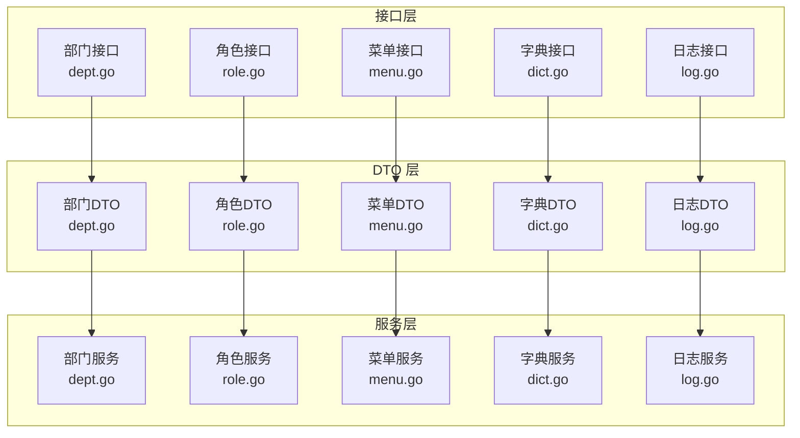
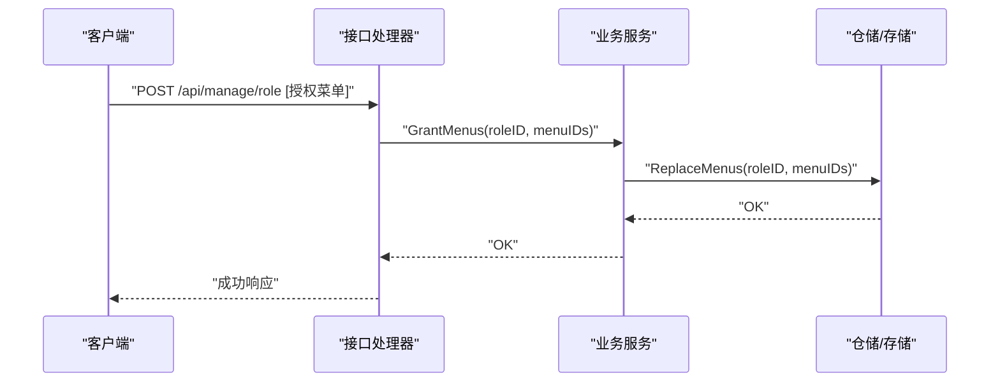
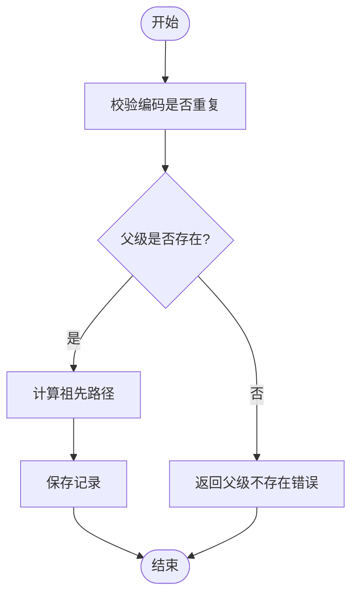
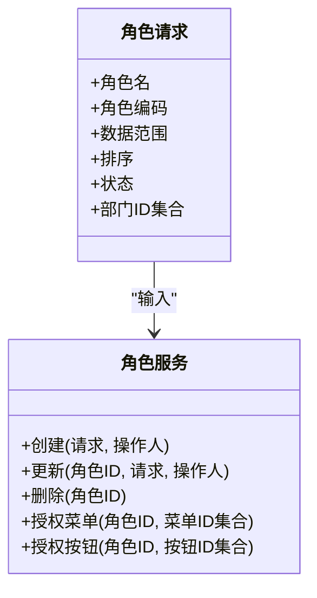
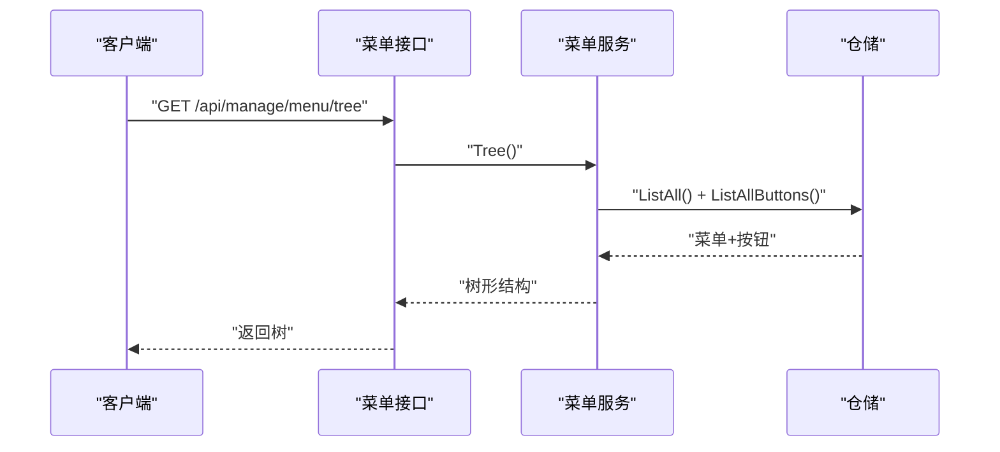
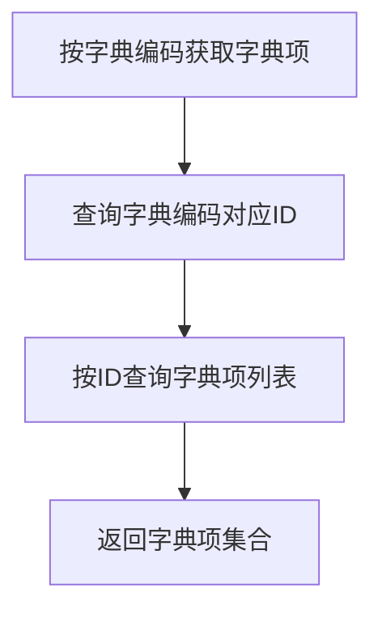
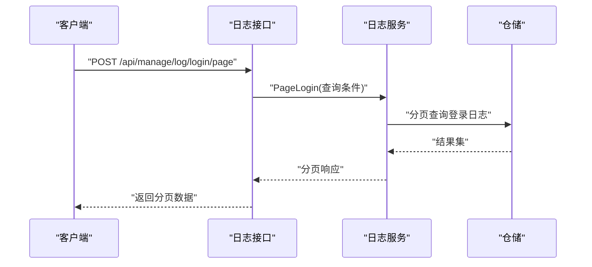
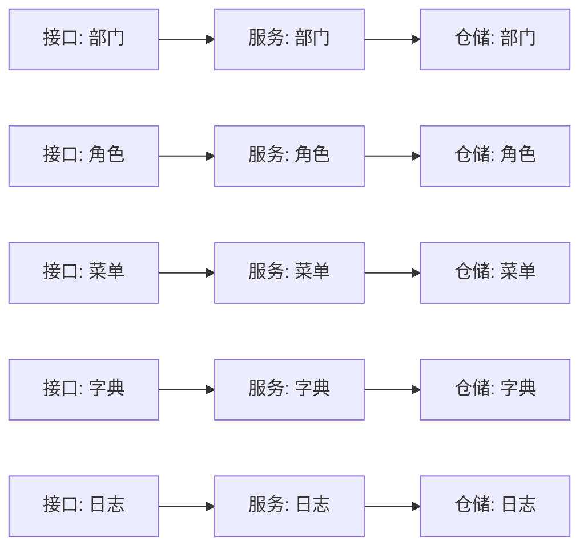

# 系统管理

<cite>
**本文档引用的文件**
- [app/server/internal/handler/v1/dept.go](file://app/server/internal/handler/v1/dept.go)
- [app/server/internal/handler/v1/role.go](file://app/server/internal/handler/v1/role.go)
- [app/server/internal/handler/v1/menu.go](file://app/server/internal/handler/v1/menu.go)
- [app/server/internal/handler/v1/dict.go](file://app/server/internal/handler/v1/dict.go)
- [app/server/internal/handler/v1/log.go](file://app/server/internal/handler/v1/log.go)
- [app/server/internal/dto/dept.go](file://app/server/internal/dto/dept.go)
- [app/server/internal/dto/role.go](file://app/server/internal/dto/role.go)
- [app/server/internal/dto/menu.go](file://app/server/internal/dto/menu.go)
- [app/server/internal/dto/dict.go](file://app/server/internal/dto/dict.go)
- [app/server/internal/dto/log.go](file://app/server/internal/dto/log.go)
- [app/server/internal/service/dept.go](file://app/server/internal/service/dept.go)
- [app/server/internal/service/role.go](file://app/server/internal/service/role.go)
- [app/server/internal/service/menu.go](file://app/server/internal/service/menu.go)
- [app/server/internal/service/dict.go](file://app/server/internal/service/dict.go)
- [app/server/internal/service/log.go](file://app/server/internal/service/log.go)
</cite>

## 目录
1. [简介](#简介)
2. [项目结构](#项目结构)
3. [核心组件](#核心组件)
4. [架构总览](#架构总览)
5. [详细组件分析](#详细组件分析)
6. [依赖分析](#依赖分析)
7. [性能考虑](#性能考虑)
8. [故障排查指南](#故障排查指南)
9. [结论](#结论)
10. [附录](#附录)

## 简介
本文件面向“系统管理”模块，系统性梳理组织架构管理、角色权限管理、菜单资源配置、字典数据管理、系统日志审计等核心能力，覆盖数据模型、处理流程、权限与菜单结构、以及运维相关的能力边界与最佳实践。文档以代码为依据，结合接口与服务层实现，帮助读者快速理解并高效使用该模块。

## 项目结构
系统管理模块在后端采用典型的分层架构：HTTP 处理器（Handler）负责接收请求、参数校验与响应封装；DTO 定义请求/响应结构；Service 提供业务逻辑与规则校验；Model/Repository 则承载数据模型与持久化细节。前端通过统一的系统管理 API 进行交互。

图表来源
- [app/server/internal/handler/v1/dept.go:18-187](file://app/server/internal/handler/v1/dept.go#L18-L187)
- [app/server/internal/handler/v1/role.go:18-272](file://app/server/internal/handler/v1/role.go#L18-L272)
- [app/server/internal/handler/v1/menu.go:21-248](file://app/server/internal/handler/v1/menu.go#L21-L248)
- [app/server/internal/handler/v1/dict.go:21-274](file://app/server/internal/handler/v1/dict.go#L21-L274)
- [app/server/internal/handler/v1/log.go:11-64](file://app/server/internal/handler/v1/log.go#L11-L64)
- [app/server/internal/dto/dept.go:5-34](file://app/server/internal/dto/dept.go#L5-L34)
- [app/server/internal/dto/role.go:5-40](file://app/server/internal/dto/role.go#L5-L40)
- [app/server/internal/dto/menu.go:5-56](file://app/server/internal/dto/menu.go#L5-L56)
- [app/server/internal/dto/dict.go:5-35](file://app/server/internal/dto/dict.go#L5-L35)
- [app/server/internal/dto/log.go:5-26](file://app/server/internal/dto/log.go#L5-L26)
- [app/server/internal/service/dept.go:22-251](file://app/server/internal/service/dept.go#L22-L251)
- [app/server/internal/service/role.go:18-152](file://app/server/internal/service/role.go#L18-L152)
- [app/server/internal/service/menu.go:18-304](file://app/server/internal/service/menu.go#L18-L304)
- [app/server/internal/service/dict.go:17-158](file://app/server/internal/service/dict.go#L17-L158)
- [app/server/internal/service/log.go:10-35](file://app/server/internal/service/log.go#L10-L35)

章节来源
- [app/server/internal/handler/v1/dept.go:1-187](file://app/server/internal/handler/v1/dept.go#L1-L187)
- [app/server/internal/handler/v1/role.go:1-272](file://app/server/internal/handler/v1/role.go#L1-L272)
- [app/server/internal/handler/v1/menu.go:1-248](file://app/server/internal/handler/v1/menu.go#L1-L248)
- [app/server/internal/handler/v1/dict.go:1-274](file://app/server/internal/handler/v1/dict.go#L1-L274)
- [app/server/internal/handler/v1/log.go:1-64](file://app/server/internal/handler/v1/log.go#L1-L64)

## 核心组件
- 组织架构管理（部门）
  - 支持树形结构展示与分页，父子关系通过祖先路径维护；提供新增、修改、删除、详情、树与分页列表等接口。
- 角色权限管理
  - 支持角色基础信息与数据范围配置；提供角色授权菜单与按钮能力；支持全量角色下拉。
- 菜单资源配置
  - 支持菜单树与分页列表；支持按钮级资源；提供路由唯一性约束与系统内置菜单保护。
- 字典数据管理
  - 支持字典分类与字典项的增删改查；提供按编码拉取字典项能力；支持系统内置字典保护。
- 系统日志审计
  - 支持登录日志与操作日志分页查询，便于审计与问题定位。

章节来源
- [app/server/internal/handler/v1/dept.go:26-187](file://app/server/internal/handler/v1/dept.go#L26-L187)
- [app/server/internal/handler/v1/role.go:26-272](file://app/server/internal/handler/v1/role.go#L26-L272)
- [app/server/internal/handler/v1/menu.go:29-248](file://app/server/internal/handler/v1/menu.go#L29-L248)
- [app/server/internal/handler/v1/dict.go:29-274](file://app/server/internal/handler/v1/dict.go#L29-L274)
- [app/server/internal/handler/v1/log.go:19-64](file://app/server/internal/handler/v1/log.go#L19-L64)

## 架构总览
系统管理模块遵循“接口-数据传输对象-服务-仓储”的分层设计，接口层负责鉴权与参数绑定，服务层实现业务规则与跨表操作，仓储层负责数据访问。

图表来源
- [app/server/internal/handler/v1/role.go:160-186](file://app/server/internal/handler/v1/role.go#L160-L186)
- [app/server/internal/service/role.go:129-135](file://app/server/internal/service/role.go#L129-L135)

## 详细组件分析

### 组织架构管理（部门）
- 数据模型与请求体
  - 请求体包含父级ID、部门名称、编码、负责人、排序、状态等；树节点包含子节点集合。
- 关键流程
  - 新增/更新时进行编码重复校验与父级存在性校验；更新时若变更父级则重算祖先路径。
  - 删除前校验是否存在子部门或关联用户。
  - 树构建基于祖先路径与父子ID映射，支持多级树生成。
- 分页与树形展示
  - 分页以顶级部门为起点，逐层拉取子部门并挂载，限制最大层级防止异常数据导致性能问题。

图表来源
- [app/server/internal/service/dept.go:30-66](file://app/server/internal/service/dept.go#L30-L66)
- [app/server/internal/service/dept.go:68-111](file://app/server/internal/service/dept.go#L68-L111)

章节来源
- [app/server/internal/dto/dept.go:5-34](file://app/server/internal/dto/dept.go#L5-L34)
- [app/server/internal/service/dept.go:15-251](file://app/server/internal/service/dept.go#L15-L251)
- [app/server/internal/handler/v1/dept.go:26-187](file://app/server/internal/handler/v1/dept.go#L26-L187)

### 角色权限管理
- 角色模型与数据范围
  - 角色包含角色名、编码、描述、数据范围、排序、状态等；数据范围支持全局/本部门/本部门及子部门/自定义部门集等。
- 权限授权
  - 支持授权菜单与按钮；授权前会校验角色存在性；菜单授权通过替换关联表实现。
- 角色保护
  - 系统内置角色禁止删除与修改特定字段；删除前校验是否存在关联用户。

图表来源
- [app/server/internal/dto/role.go:5-14](file://app/server/internal/dto/role.go#L5-L14)
- [app/server/internal/service/role.go:26-152](file://app/server/internal/service/role.go#L26-L152)

章节来源
- [app/server/internal/dto/role.go:5-40](file://app/server/internal/dto/role.go#L5-L40)
- [app/server/internal/service/role.go:12-152](file://app/server/internal/service/role.go#L12-L152)
- [app/server/internal/handler/v1/role.go:26-272](file://app/server/internal/handler/v1/role.go#L26-L272)

### 菜单资源配置
- 菜单模型
  - 支持目录/页面两种类型；包含路由名、路径、组件、图标、国际化键、缓存、常量路由、隐藏、多标签页、固定索引、查询参数、状态等；支持按钮级资源。
- 路由唯一性与系统保护
  - 路由名唯一；系统内置菜单禁止删除与修改路由名；删除前校验是否存在子菜单。
- 菜单树与分页
  - 菜单树同时聚合按钮；分页以顶级菜单为起点逐层拉取并挂载，按钮按菜单分组返回。

图表来源
- [app/server/internal/handler/v1/menu.go:59-73](file://app/server/internal/handler/v1/menu.go#L59-L73)
- [app/server/internal/service/menu.go:165-202](file://app/server/internal/service/menu.go#L165-L202)

章节来源
- [app/server/internal/dto/menu.go:5-56](file://app/server/internal/dto/menu.go#L5-L56)
- [app/server/internal/service/menu.go:12-304](file://app/server/internal/service/menu.go#L12-L304)
- [app/server/internal/handler/v1/menu.go:29-248](file://app/server/internal/handler/v1/menu.go#L29-L248)

### 字典数据管理
- 字典与字典项
  - 字典支持名称、编码、描述、状态；字典项支持标签、值、描述、排序、状态；提供按字典ID与字典编码拉取字典项。
- 系统保护
  - 字典编码唯一；系统内置字典禁止修改编码；删除不进行级联校验。
- 高频接口
  - 按字典编码拉取字典项接口用于前端高频使用。

图表来源
- [app/server/internal/handler/v1/dict.go:169-189](file://app/server/internal/handler/v1/dict.go#L169-L189)
- [app/server/internal/service/dict.go:155-157](file://app/server/internal/service/dict.go#L155-L157)

章节来源
- [app/server/internal/dto/dict.go:5-35](file://app/server/internal/dto/dict.go#L5-L35)
- [app/server/internal/service/dict.go:12-158](file://app/server/internal/service/dict.go#L12-L158)
- [app/server/internal/handler/v1/dict.go:29-274](file://app/server/internal/handler/v1/dict.go#L29-L274)

### 系统日志审计
- 登录日志与操作日志
  - 支持按用户名、登录IP、登录类型、结果、时间范围等条件分页查询；接口分别提供登录日志与操作日志分页。
- 使用场景
  - 安全审计、异常登录追踪、操作轨迹回溯。

图表来源
- [app/server/internal/handler/v1/log.go:19-40](file://app/server/internal/handler/v1/log.go#L19-L40)
- [app/server/internal/service/log.go:18-25](file://app/server/internal/service/log.go#L18-L25)

章节来源
- [app/server/internal/dto/log.go:5-26](file://app/server/internal/dto/log.go#L5-L26)
- [app/server/internal/service/log.go:10-35](file://app/server/internal/service/log.go#L10-L35)
- [app/server/internal/handler/v1/log.go:19-64](file://app/server/internal/handler/v1/log.go#L19-L64)

## 依赖分析
- 组件耦合
  - 接口层仅依赖 DTO 与服务层；服务层依赖仓储层；整体呈现清晰的单向依赖。
- 关键依赖链
  - 部门：接口 -> DTO -> 服务 -> 仓储；树构建依赖节点映射与父子关系。
  - 角色：接口 -> DTO -> 服务 -> 仓储；授权通过替换关联表实现。
  - 菜单：接口 -> DTO -> 服务 -> 仓储；树构建聚合按钮。
  - 字典：接口 -> DTO -> 服务 -> 仓储；高频接口按编码查询。
  - 日志：接口 -> DTO -> 服务 -> 仓储；分页查询。

图表来源
- [app/server/internal/handler/v1/dept.go:18-24](file://app/server/internal/handler/v1/dept.go#L18-L24)
- [app/server/internal/handler/v1/role.go:18-24](file://app/server/internal/handler/v1/role.go#L18-L24)
- [app/server/internal/handler/v1/menu.go:21-27](file://app/server/internal/handler/v1/menu.go#L21-L27)
- [app/server/internal/handler/v1/dict.go:21-27](file://app/server/internal/handler/v1/dict.go#L21-L27)
- [app/server/internal/handler/v1/log.go:11-17](file://app/server/internal/handler/v1/log.go#L11-L17)
- [app/server/internal/service/dept.go:22-28](file://app/server/internal/service/dept.go#L22-L28)
- [app/server/internal/service/role.go:18-24](file://app/server/internal/service/role.go#L18-L24)
- [app/server/internal/service/menu.go:18-24](file://app/server/internal/service/menu.go#L18-L24)
- [app/server/internal/service/dict.go:17-23](file://app/server/internal/service/dict.go#L17-L23)
- [app/server/internal/service/log.go:10-16](file://app/server/internal/service/log.go#L10-L16)

## 性能考虑
- 树构建与分页
  - 部门与菜单均采用“顶级分页 + 多级拉取”的方式，限制最大层级（如10级）以避免深层级导致的性能问题。
- 查询优化
  - 菜单树构建时先查询全部菜单与按钮，再按菜单ID分组，减少多次查询。
  - 字典高频接口按编码查询，建议在数据库层面建立字典编码索引。
- 缓存策略
  - 建议对高频字典项（如按编码查询）增加应用层缓存，降低数据库压力；注意缓存失效与一致性。
- 分页参数
  - 接口层对分页大小做了默认与上限控制，避免过大分页影响性能。

章节来源
- [app/server/internal/service/dept.go:214-248](file://app/server/internal/service/dept.go#L214-L248)
- [app/server/internal/service/menu.go:246-277](file://app/server/internal/service/menu.go#L246-L277)
- [app/server/internal/handler/v1/dept.go:42-50](file://app/server/internal/handler/v1/dept.go#L42-L50)
- [app/server/internal/handler/v1/menu.go:44-50](file://app/server/internal/handler/v1/menu.go#L44-L50)

## 故障排查指南
- 常见错误与定位
  - 部门：编码重复、父级不存在、存在子部门、存在用户关联。
  - 角色：编码重复、系统内置角色不可操作、角色下仍有用户。
  - 菜单：路由名重复、系统内置菜单不可操作、存在子菜单。
  - 字典：编码重复、系统内置字典不可操作。
- 排查步骤
  - 确认请求参数与业务规则（如系统内置保护、唯一性约束）。
  - 查看接口层映射函数，确认错误码与提示信息。
  - 结合服务层日志与仓储层SQL执行情况定位问题。

章节来源
- [app/server/internal/service/dept.go:15-20](file://app/server/internal/service/dept.go#L15-L20)
- [app/server/internal/service/role.go:12-16](file://app/server/internal/service/role.go#L12-L16)
- [app/server/internal/service/menu.go:12-16](file://app/server/internal/service/menu.go#L12-L16)
- [app/server/internal/service/dict.go:12-15](file://app/server/internal/service/dict.go#L12-L15)
- [app/server/internal/handler/v1/dept.go:175-186](file://app/server/internal/handler/v1/dept.go#L175-L186)
- [app/server/internal/handler/v1/role.go:260-271](file://app/server/internal/handler/v1/role.go#L260-L271)
- [app/server/internal/handler/v1/menu.go:236-247](file://app/server/internal/handler/v1/menu.go#L236-L247)
- [app/server/internal/handler/v1/dict.go:264-273](file://app/server/internal/handler/v1/dict.go#L264-L273)

## 结论
系统管理模块围绕组织、角色、菜单、字典与日志五大领域提供了完整的增删改查与授权能力，接口层统一鉴权与参数校验，服务层实现业务规则与跨表操作，具备良好的扩展性与可维护性。建议在生产环境中配合缓存、索引与分页策略，确保高并发下的稳定性与性能表现。

## 附录
- 批量导入导出与备份恢复
  - 当前代码未体现专门的批量导入导出与备份恢复接口；如需实现，可在现有DTO与服务层基础上扩展API与工具层，结合数据库事务与异步任务实现。
- 系统监控与告警
  - 可在中间件层或服务层埋点关键指标（如接口耗时、错误率、授权命中率），结合日志服务统一采集与告警。
- 参数配置与安全加固
  - 建议在配置层集中管理分页默认值、缓存过期策略、系统内置标识等；在接口层强化参数校验与白名单控制，避免越权与注入风险。