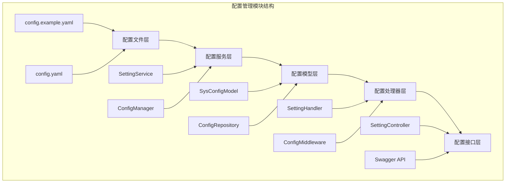
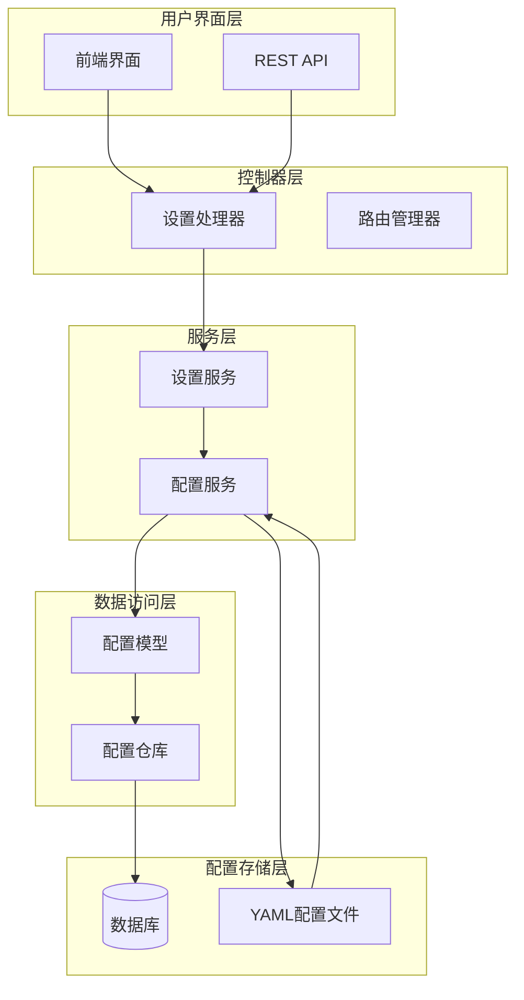
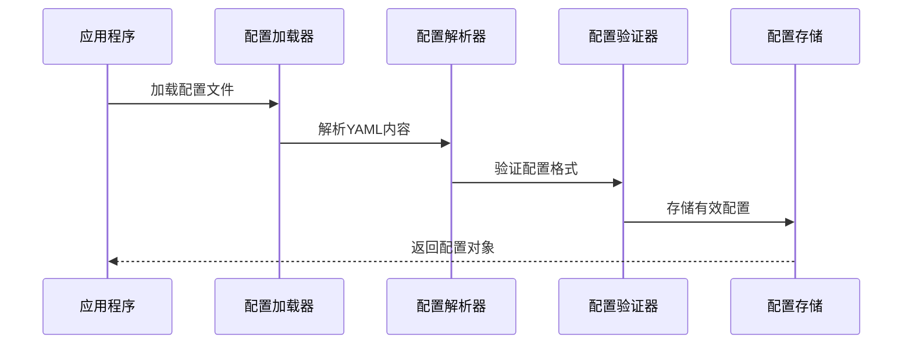
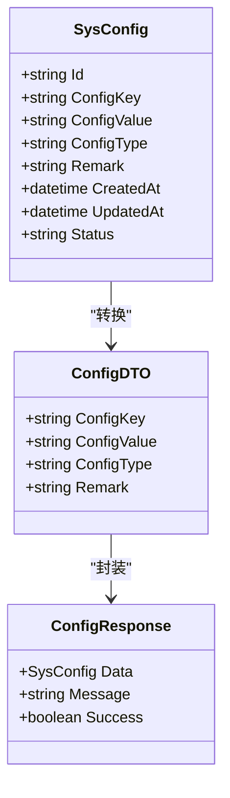
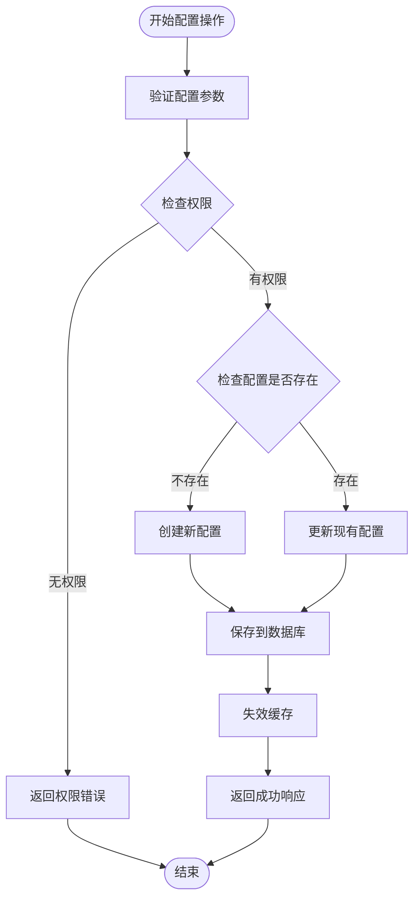
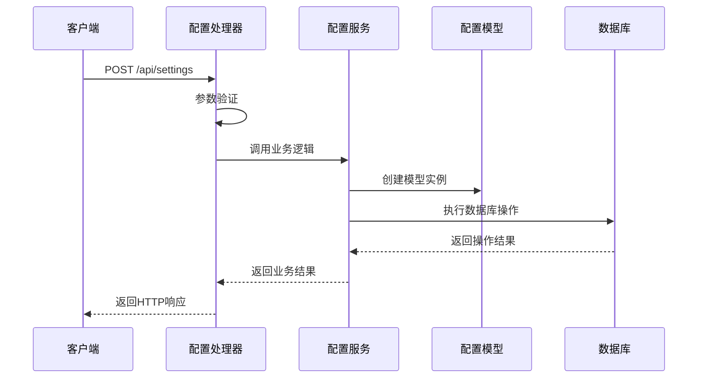
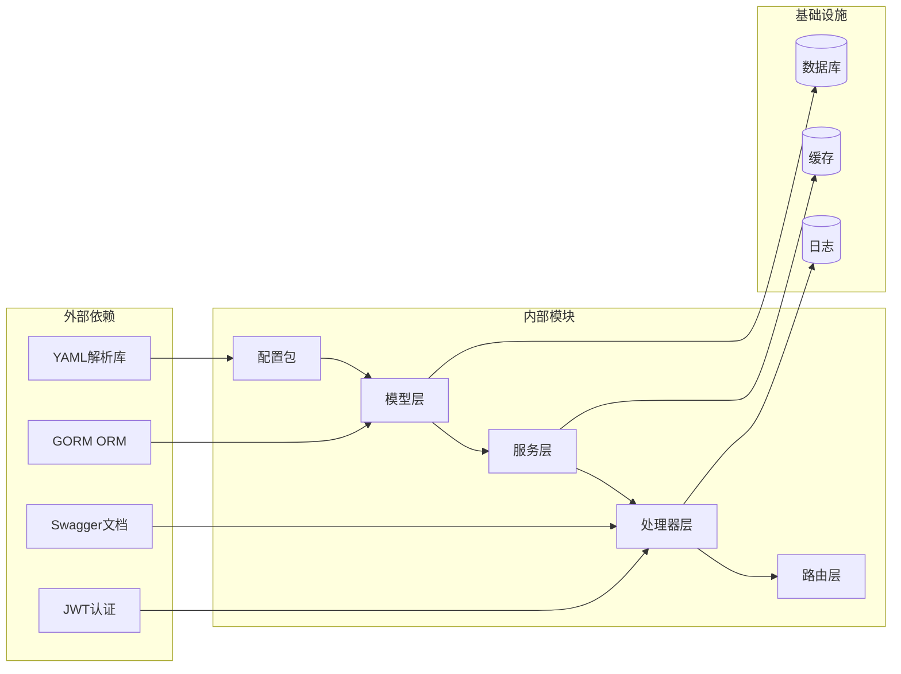

# 系统配置管理

<cite>
**本文档引用的文件**
- [config.go](file://app/server/pkg/config/config.go)
- [config.example.yaml](file://app/server/configs/config.example.yaml)
- [config.yaml](file://app/server/configs/config.yaml)
- [sys_config.go](file://app/server/internal/model/sys_config.go)
- [setting.go](file://app/server/internal/dto/setting.go)
- [setting.go](file://app/server/internal/handler/v1/setting.go)
- [setting.go](file://app/server/internal/service/setting.go)
- [router.go](file://app/server/internal/router/router.go)
- [main.go](file://app/server/cmd/api/main.go)
- [swagger.yaml](file://app/server/docs/swagger.yaml)
</cite>

## 目录
1. [简介](#简介)
2. [项目结构](#项目结构)
3. [核心组件](#核心组件)
4. [架构概览](#架构概览)
5. [详细组件分析](#详细组件分析)
6. [依赖关系分析](#依赖关系分析)
7. [性能考虑](#性能考虑)
8. [故障排除指南](#故障排除指南)
9. [结论](#结论)

## 简介

系统配置管理是 boread 项目中的一个关键模块，负责管理系统运行时的各种配置参数。该模块采用分层架构设计，结合 YAML 配置文件、数据库持久化存储和 API 接口，为整个应用提供灵活的配置管理能力。

配置管理模块主要包含以下功能特性：
- 多环境配置支持（开发、测试、生产）
- 动态配置更新和热重载
- 配置项分类管理和权限控制
- 配置数据的增删改查操作
- 配置项的验证和约束检查

## 项目结构

系统配置管理模块在项目中采用清晰的分层结构组织：

**图表来源**
- [config.go:1-200](file://app/server/pkg/config/config.go#L1-L200)
- [sys_config.go:1-150](file://app/server/internal/model/sys_config.go#L1-L150)

**章节来源**
- [config.go:1-200](file://app/server/pkg/config/config.go#L1-L200)
- [config.example.yaml:1-100](file://app/server/configs/config.example.yaml#L1-L100)
- [config.yaml:1-100](file://app/server/configs/config.yaml#L1-L100)

## 核心组件

系统配置管理模块的核心组件包括配置加载器、配置服务、配置模型和配置处理器四个主要层次。

### 配置加载器
配置加载器负责从 YAML 文件中读取配置信息，并将其转换为应用程序可使用的数据结构。它支持多种配置格式和环境变量替换功能。

### 配置服务
配置服务提供配置项的业务逻辑处理，包括配置的创建、更新、删除和查询操作。它还负责配置项的验证和约束检查。

### 配置模型
配置模型定义了配置项的数据结构和数据库映射关系，确保配置数据的一致性和完整性。

### 配置处理器
配置处理器负责处理来自客户端的配置请求，执行相应的业务逻辑并将结果返回给调用方。

**章节来源**
- [config.go:1-200](file://app/server/pkg/config/config.go#L1-L200)
- [sys_config.go:1-150](file://app/server/internal/model/sys_config.go#L1-L150)
- [setting.go:1-200](file://app/server/internal/service/setting.go#L1-L200)

## 架构概览

系统配置管理采用分层架构设计，确保各层之间的职责分离和松耦合：

**图表来源**
- [setting.go:1-150](file://app/server/internal/handler/v1/setting.go#L1-L150)
- [setting.go:1-200](file://app/server/internal/service/setting.go#L1-L200)
- [sys_config.go:1-150](file://app/server/internal/model/sys_config.go#L1-L150)

## 详细组件分析

### 配置文件管理

配置文件管理是系统配置的基础，采用 YAML 格式存储配置信息。系统提供了示例配置文件和实际配置文件两种类型。

#### 配置文件结构
配置文件采用层次化的键值对结构，支持嵌套配置和数组配置。每个配置项都有明确的类型定义和默认值。

#### 配置文件加载流程

**图表来源**
- [config.go:1-200](file://app/server/pkg/config/config.go#L1-L200)
- [config.example.yaml:1-100](file://app/server/configs/config.example.yaml#L1-L100)

### 配置模型设计

配置模型定义了配置项在数据库中的存储结构，采用标准化的设计模式确保数据的一致性。

**图表来源**
- [sys_config.go:1-150](file://app/server/internal/model/sys_config.go#L1-L150)
- [setting.go:1-100](file://app/server/internal/dto/setting.go#L1-L100)

### 配置服务实现

配置服务提供了完整的 CRUD 操作和业务逻辑处理，包括配置项的验证、权限检查和事务管理。

#### 配置服务流程

**图表来源**
- [setting.go:1-200](file://app/server/internal/service/setting.go#L1-L200)
- [sys_config.go:1-150](file://app/server/internal/model/sys_config.go#L1-L150)

**章节来源**
- [sys_config.go:1-150](file://app/server/internal/model/sys_config.go#L1-L150)
- [setting.go:1-100](file://app/server/internal/dto/setting.go#L1-L100)
- [setting.go:1-150](file://app/server/internal/handler/v1/setting.go#L1-L150)
- [setting.go:1-200](file://app/server/internal/service/setting.go#L1-L200)

### 配置处理器

配置处理器负责处理来自客户端的配置请求，执行相应的业务逻辑并将结果返回给调用方。

#### API 请求处理流程

**图表来源**
- [setting.go:1-150](file://app/server/internal/handler/v1/setting.go#L1-L150)
- [setting.go:1-200](file://app/server/internal/service/setting.go#L1-L200)

**章节来源**
- [setting.go:1-150](file://app/server/internal/handler/v1/setting.go#L1-L150)
- [setting.go:1-200](file://app/server/internal/service/setting.go#L1-L200)

## 依赖关系分析

系统配置管理模块的依赖关系体现了清晰的分层架构和职责分离：

**图表来源**
- [config.go:1-200](file://app/server/pkg/config/config.go#L1-L200)
- [sys_config.go:1-150](file://app/server/internal/model/sys_config.go#L1-L150)
- [setting.go:1-200](file://app/server/internal/service/setting.go#L1-L200)

**章节来源**
- [config.go:1-200](file://app/server/pkg/config/config.go#L1-L200)
- [sys_config.go:1-150](file://app/server/internal/model/sys_config.go#L1-L150)
- [setting.go:1-200](file://app/server/internal/service/setting.go#L1-L200)

## 性能考虑

系统配置管理模块在设计时充分考虑了性能优化和资源管理：

### 缓存策略
- 使用多级缓存机制减少数据库查询次数
- 支持配置项的热更新和缓存失效
- 实现缓存预加载和批量加载功能

### 连接池管理
- 数据库连接池的合理配置和监控
- 连接超时和重试机制
- 连接泄漏检测和防护

### 并发控制
- 配置更新的并发控制和锁机制
- 读写分离策略
- 事务管理和回滚机制

## 故障排除指南

### 常见问题及解决方案

#### 配置文件加载失败
**问题描述**: 应用启动时无法加载配置文件
**可能原因**:
- 配置文件路径不正确
- YAML 格式语法错误
- 权限不足无法读取文件

**解决步骤**:
1. 检查配置文件路径是否正确
2. 验证 YAML 格式的语法正确性
3. 确认应用程序具有文件读取权限

#### 数据库连接异常
**问题描述**: 配置数据无法保存到数据库
**可能原因**:
- 数据库连接字符串错误
- 数据库服务不可用
- 权限不足

**解决步骤**:
1. 验证数据库连接配置
2. 检查数据库服务状态
3. 确认数据库用户权限

#### API 接口错误
**问题描述**: 配置管理 API 返回错误
**可能原因**:
- 请求参数验证失败
- 权限认证失败
- 业务逻辑异常

**解决步骤**:
1. 检查 API 请求格式和参数
2. 验证用户权限和认证状态
3. 查看服务器日志获取详细错误信息

**章节来源**
- [config.go:1-200](file://app/server/pkg/config/config.go#L1-L200)
- [setting.go:1-200](file://app/server/internal/service/setting.go#L1-L200)

## 结论

系统配置管理模块通过清晰的分层架构、完善的配置文件管理和强大的 API 接口，为 boread 项目提供了灵活可靠的配置管理能力。该模块不仅支持基本的配置 CRUD 操作，还具备动态配置更新、权限控制和缓存优化等高级特性。

模块的主要优势包括：
- **可扩展性**: 支持新的配置项类型和业务场景
- **安全性**: 完善的权限控制和数据验证
- **性能**: 多级缓存和连接池优化
- **易用性**: 清晰的 API 接口和错误处理

未来可以进一步优化的方向包括：增强配置版本管理、添加配置审计日志、实现配置模板功能等。