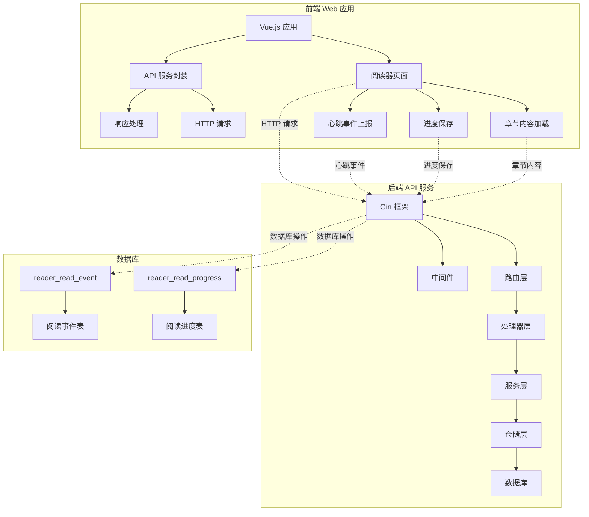
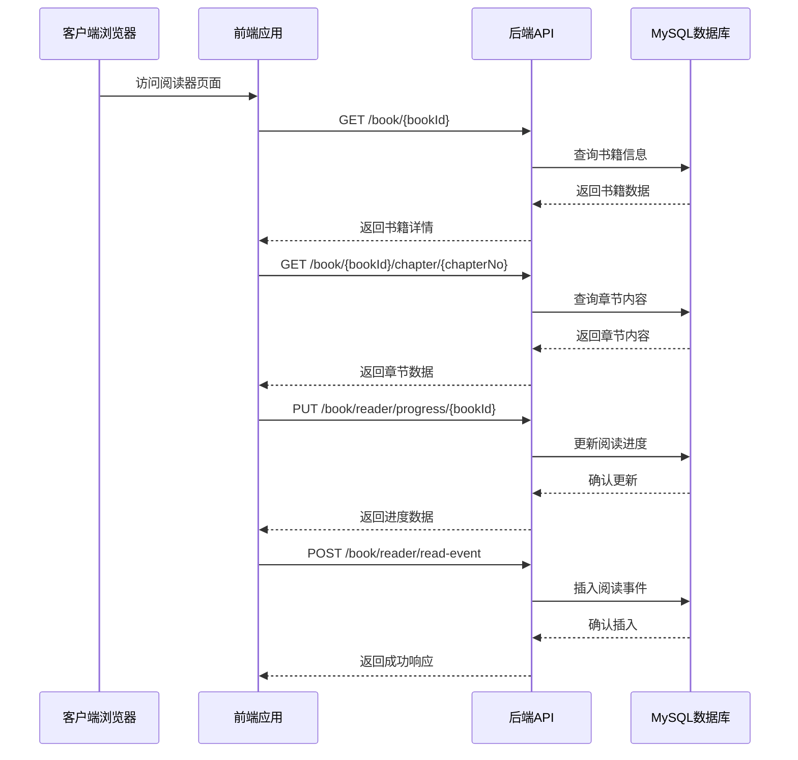
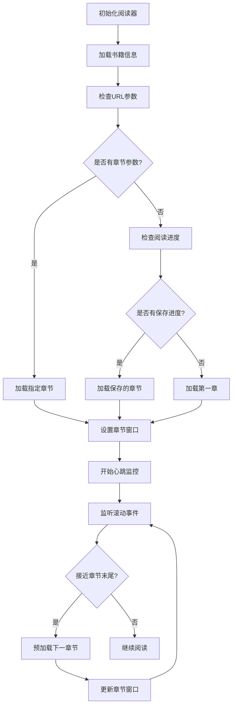
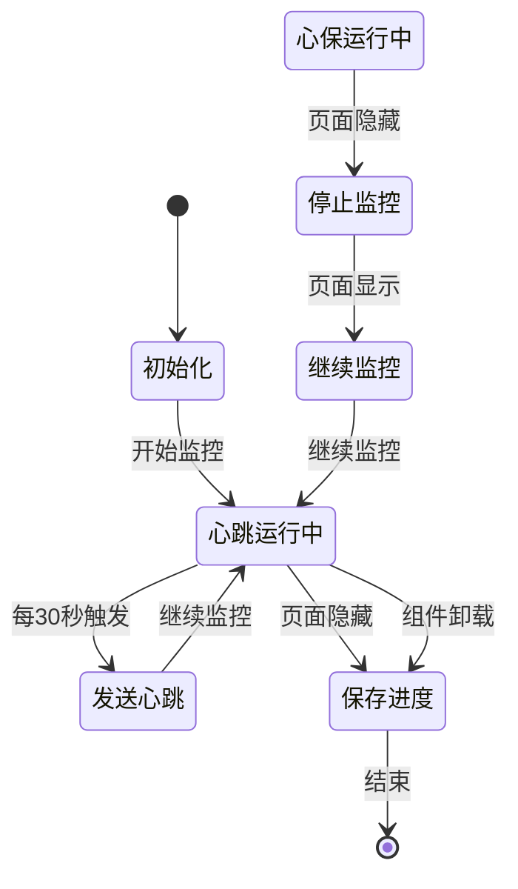
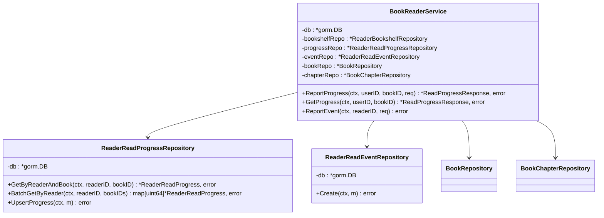
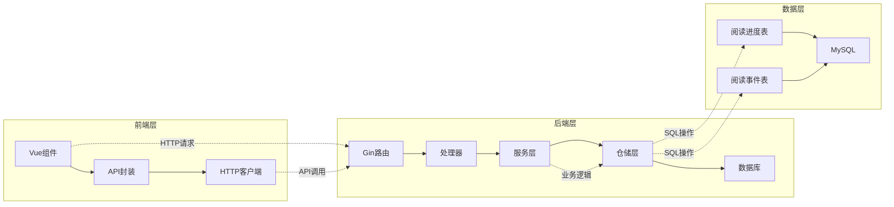

# 阅读进度追踪

<cite>
**本文档引用的文件**
- [main.go](file://app/server/cmd/api/main.go)
- [index.vue](file://app/web/src/views/book-reader/index.vue)
- [book_reader.go](file://app/server/internal/service/book_reader.go)
- [book_reader.go](file://app/server/internal/repository/book_reader.go)
- [book_reader.go](file://app/server/internal/model/book_reader.go)
- [book_reader.go](file://app/server/internal/dto/book_reader.go)
- [book_reader.go](file://app/server/internal/handler/v1/book_reader.go)
- [book-manage.ts](file://app/web/src/service/api/book-manage.ts)
- [router.go](file://app/server/internal/router/router.go)
- [base.go](file://app/server/internal/model/base.go)
- [book_v3.sql](file://app/sql/book_v3.sql)
- [book_v4.sql](file://app/sql/book_v4.sql)
</cite>

## 目录
1. [简介](#简介)
2. [项目结构](#项目结构)
3. [核心组件](#核心组件)
4. [架构概览](#架构概览)
5. [详细组件分析](#详细组件分析)
6. [依赖关系分析](#依赖关系分析)
7. [性能考虑](#性能考虑)
8. [故障排除指南](#故障排除指南)
9. [结论](#结论)

## 简介

阅读进度追踪是小说阅读平台的核心功能模块，负责记录用户的阅读行为、进度和统计数据。该系统采用前后端分离架构，前端使用Vue.js构建响应式的阅读界面，后端基于Go语言和Gin框架提供RESTful API服务。

系统主要包含两个核心功能：
- **阅读进度追踪**：记录用户在不同书籍中的阅读位置、进度百分比和阅读时长
- **阅读事件监控**：实时收集用户的阅读行为数据，包括心跳事件、设备类型和阅读时长

## 项目结构

该项目采用典型的三层架构设计，分为前端Web应用和后端API服务两大部分：

**图表来源**
- [main.go:36-114](file://app/server/cmd/api/main.go#L36-L114)
- [router.go:15-389](file://app/server/internal/router/router.go#L15-L389)

**章节来源**
- [main.go:1-178](file://app/server/cmd/api/main.go#L1-L178)
- [router.go:15-389](file://app/server/internal/router/router.go#L15-L389)

## 核心组件

### 前端组件

前端阅读器组件位于 `app/web/src/views/book-reader/index.vue`，实现了完整的阅读体验：

- **章节窗口管理**：动态加载和显示连续的章节内容
- **进度追踪**：自动保存当前阅读进度到服务器
- **心跳监控**：定期上报阅读事件，统计阅读时长
- **响应式设计**：支持桌面端和移动端的不同交互方式

### 后端服务组件

后端采用分层架构，包含以下核心组件：

- **处理器层**：处理HTTP请求和响应
- **服务层**：实现业务逻辑和数据处理
- **仓储层**：负责数据库操作
- **模型层**：定义数据结构和数据库映射

**章节来源**
- [index.vue:1-756](file://app/web/src/views/book-reader/index.vue#L1-L756)
- [book_reader.go:16-133](file://app/server/internal/service/book_reader.go#L16-L133)

## 架构概览

系统采用微服务架构，前后端分离的设计模式：

**图表来源**
- [index.vue:218-248](file://app/web/src/views/book-reader/index.vue#L218-L248)
- [book_reader.go:24-97](file://app/server/internal/handler/v1/book_reader.go#L24-L97)

**章节来源**
- [book_reader.go:16-133](file://app/server/internal/service/book_reader.go#L16-L133)
- [book_reader.go:13-86](file://app/server/internal/repository/book_reader.go#L13-L86)

## 详细组件分析

### 前端阅读器组件

前端阅读器组件实现了复杂的阅读体验，包含以下关键功能：

#### 章节窗口管理系统

组件使用滑动窗口的方式动态加载章节内容：

**图表来源**
- [index.vue:81-92](file://app/web/src/views/book-reader/index.vue#L81-L92)
- [index.vue:173-186](file://app/web/src/views/book-reader/index.vue#L173-L186)

#### 进度保存机制

系统实现了智能的进度保存策略：

- **自动保存**：当用户切换到新的章节时自动保存进度
- **手动保存**：在组件卸载时保存当前进度
- **URL同步**：更新URL参数以反映当前阅读位置

#### 心跳事件监控

系统通过定时器实现阅读行为监控：

**图表来源**
- [index.vue:298-318](file://app/web/src/views/book-reader/index.vue#L298-L318)
- [index.vue:320-339](file://app/web/src/views/book-reader/index.vue#L320-L339)

**章节来源**
- [index.vue:192-216](file://app/web/src/views/book-reader/index.vue#L192-L216)
- [index.vue:256-339](file://app/web/src/views/book-reader/index.vue#L256-L339)

### 后端服务层

后端服务层实现了完整的阅读进度追踪业务逻辑：

#### 服务架构设计

**图表来源**
- [book_reader.go:16-42](file://app/server/internal/service/book_reader.go#L16-L42)
- [book_reader.go:13-19](file://app/server/internal/repository/book_reader.go#L13-L19)

#### 数据模型设计

系统使用两个核心数据表来存储阅读信息：

**阅读进度表 (reader_read_progress)**：
- 唯一索引：reader_id + book_id
- 自动更新：last_read_time
- 增量更新：read_duration

**阅读事件表 (reader_read_event)**：
- 纯追加日志表
- 按日期分区：event_date
- 设备类型：支持web和mobile

**章节来源**
- [book_reader.go:5-17](file://app/server/internal/model/book_reader.go#L5-L17)
- [book_reader.go:21-36](file://app/server/internal/model/book_reader.go#L21-L36)

### API 接口设计

系统提供了完整的RESTful API接口：

#### 进度追踪接口

| 方法 | 路径 | 功能描述 |
|------|------|----------|
| PUT | /api/book/reader/progress/{bookId} | 上报阅读进度 |
| GET | /api/book/reader/progress/{bookId} | 获取阅读进度 |

#### 阅读事件接口

| 方法 | 路径 | 功能描述 |
|------|------|----------|
| POST | /api/book/reader/read-event | 上报阅读事件 |

**章节来源**
- [book_reader.go:24-97](file://app/server/internal/handler/v1/book_reader.go#L24-L97)
- [router.go:367-375](file://app/server/internal/router/router.go#L367-L375)

## 依赖关系分析

系统各层之间的依赖关系清晰明确：

**图表来源**
- [router.go:40-67](file://app/server/internal/router/router.go#L40-L67)
- [book_reader.go:13-86](file://app/server/internal/repository/book_reader.go#L13-L86)

**章节来源**
- [main.go:102-102](file://app/server/cmd/api/main.go#L102-L102)
- [router.go:84-84](file://app/server/internal/router/router.go#L84-L84)

## 性能考虑

### 前端性能优化

1. **懒加载策略**：只加载当前窗口的章节内容，减少内存占用
2. **Intersection Observer**：使用现代浏览器API实现高效的滚动检测
3. **防抖处理**：避免频繁的进度保存操作
4. **缓存机制**：利用浏览器缓存减少重复请求

### 后端性能优化

1. **数据库优化**：
   - 为reader_id和book_id建立联合索引
   - 使用ON DUPLICATE KEY UPDATE实现高效更新
   - 按日期分区存储阅读事件

2. **连接池管理**：
   - 配置最大连接数和空闲连接数
   - 合理设置连接超时时间

3. **缓存策略**：
   - 预加载常用数据
   - 使用Redis缓存热点数据

## 故障排除指南

### 常见问题及解决方案

#### 前端问题

1. **章节加载失败**
   - 检查网络连接状态
   - 验证书籍ID和章节号的有效性
   - 查看浏览器控制台错误信息

2. **进度保存异常**
   - 确认用户已登录
   - 检查API响应状态码
   - 验证权限配置

#### 后端问题

1. **数据库连接失败**
   - 检查数据库配置参数
   - 验证MySQL服务状态
   - 查看连接池配置

2. **API响应超时**
   - 检查慢查询日志
   - 优化数据库索引
   - 调整超时参数

**章节来源**
- [book_reader.go:46-92](file://app/server/internal/service/book_reader.go#L46-L92)
- [book_reader.go:105-132](file://app/server/internal/service/book_reader.go#L105-L132)

## 结论

阅读进度追踪系统通过精心设计的前后端架构，实现了高效、可靠的阅读行为追踪功能。系统的主要优势包括：

1. **完整的功能覆盖**：从章节加载到进度保存，从心跳监控到数据分析
2. **良好的用户体验**：流畅的阅读体验和智能的进度恢复机制
3. **可扩展的架构**：清晰的分层设计便于功能扩展和维护
4. **高性能设计**：前后端都采用了多种优化策略确保系统性能

该系统为小说阅读平台提供了坚实的技术基础，能够支持大规模用户并发访问和海量数据存储需求。