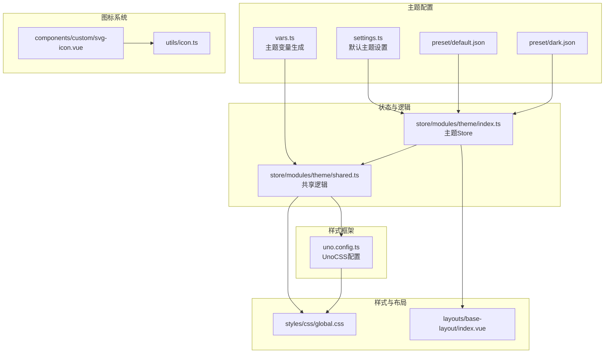
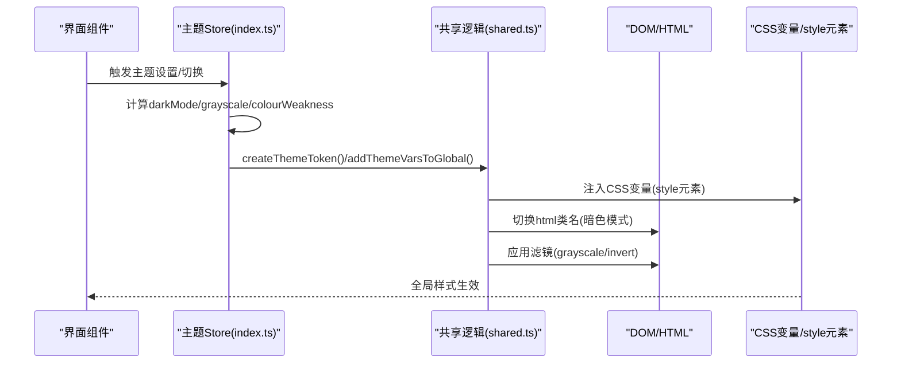
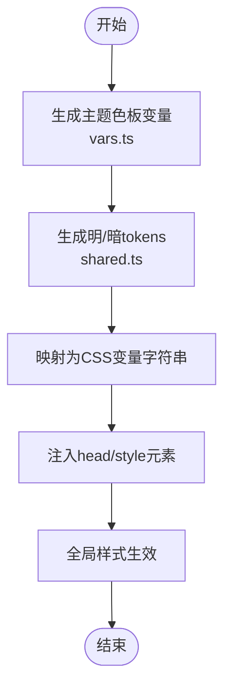
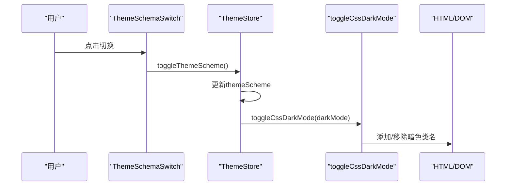
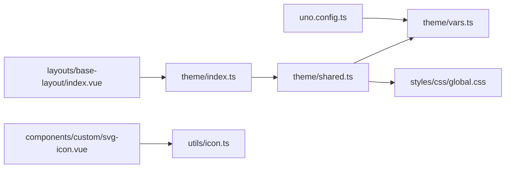

# UI与主题

<cite>
**本文引用的文件**
- [settings.ts](file://app/web/src/theme/settings.ts)
- [vars.ts](file://app/web/src/theme/vars.ts)
- [shared.ts](file://app/web/src/store/modules/theme/shared.ts)
- [index.ts](file://app/web/src/store/modules/theme/index.ts)
- [dark-mode-container.vue](file://app/web/src/components/common/dark-mode-container.vue)
- [theme-schema-switch.vue](file://app/web/src/components/common/theme-schema-switch.vue)
- [default.json](file://app/web/src/theme/preset/default.json)
- [dark.json](file://app/web/src/theme/preset/dark.json)
- [global.css](file://app/web/src/styles/css/global.css)
- [index.vue](file://app/web/src/layouts/base-layout/index.vue)
- [uno.config.ts](file://app/web/uno.config.ts)
- [svg-icon.vue](file://app/web/src/components/custom/svg-icon.vue)
- [icon.ts](file://app/web/src/utils/icon.ts)
</cite>

## 目录
1. [简介](#简介)
2. [项目结构](#项目结构)
3. [核心组件](#核心组件)
4. [架构总览](#架构总览)
5. [详细组件分析](#详细组件分析)
6. [依赖关系分析](#依赖关系分析)
7. [性能考量](#性能考量)
8. [故障排查指南](#故障排查指南)
9. [结论](#结论)
10. [附录](#附录)

## 简介
本文件系统性阐述前端UI与主题系统的设计与实现，覆盖主题变量定义、CSS-in-JS动态注入、暗色模式与辅助视觉模式、UnoCSS原子化样式与主题集成、自定义组件样式与响应式布局、图标系统与颜色体系、字体排版规范、主题切换机制、动态样式调试与扩展建议，并给出性能优化策略与最佳实践。

## 项目结构
UI与主题系统主要分布在以下模块：
- 主题配置与变量：theme/settings.ts、theme/vars.ts、theme/preset/*.json
- 主题状态管理：store/modules/theme/index.ts、store/modules/theme/shared.ts
- 样式与布局：styles/css/global.css、layouts/base-layout/index.vue
- UnoCSS配置：uno.config.ts
- 图标系统：components/custom/svg-icon.vue、utils/icon.ts
- 常用组件：components/common/dark-mode-container.vue、components/common/theme-schema-switch.vue

图表来源
- [settings.ts:1-97](file://app/web/src/theme/settings.ts#L1-L97)
- [vars.ts:1-36](file://app/web/src/theme/vars.ts#L1-L36)
- [shared.ts:1-267](file://app/web/src/store/modules/theme/shared.ts#L1-L267)
- [index.ts:1-303](file://app/web/src/store/modules/theme/index.ts#L1-L303)
- [global.css:1-16](file://app/web/src/styles/css/global.css#L1-L16)
- [index.vue:1-163](file://app/web/src/layouts/base-layout/index.vue#L1-L163)
- [uno.config.ts:1-27](file://app/web/uno.config.ts#L1-L27)
- [svg-icon.vue:1-55](file://app/web/src/components/custom/svg-icon.vue#L1-L55)
- [icon.ts:1-10](file://app/web/src/utils/icon.ts#L1-L10)

章节来源
- [settings.ts:1-97](file://app/web/src/theme/settings.ts#L1-L97)
- [vars.ts:1-36](file://app/web/src/theme/vars.ts#L1-L36)
- [shared.ts:1-267](file://app/web/src/store/modules/theme/shared.ts#L1-L267)
- [index.ts:1-303](file://app/web/src/store/modules/theme/index.ts#L1-L303)
- [global.css:1-16](file://app/web/src/styles/css/global.css#L1-L16)
- [index.vue:1-163](file://app/web/src/layouts/base-layout/index.vue#L1-L163)
- [uno.config.ts:1-27](file://app/web/uno.config.ts#L1-L27)
- [svg-icon.vue:1-55](file://app/web/src/components/custom/svg-icon.vue#L1-L55)
- [icon.ts:1-10](file://app/web/src/utils/icon.ts#L1-L10)

## 核心组件
- 主题设置与预设：提供默认主题设置、可覆盖的生产环境主题设置、轻/暗两套tokens颜色与阴影基元。
- 主题变量与CSS变量：通过vars.ts生成主题色板变量，再由shared.ts将tokens映射为CSS变量注入到<head>。
- 主题Store：集中管理主题方案(light/dark/auto)、颜色、布局、水印等，监听变更并同步至DOM类名与CSS变量。
- 布局与容器：基础布局组件根据主题设置渲染头部、侧边、标签页、页脚；暗色容器按需反转背景文本对比度。
- UnoCSS集成：在unocss主题中挂载vars.ts生成的主题变量，支持原子化样式与暗色模式class开关。
- 图标系统：统一SVG图标组件，支持Iconify与本地SVG符号两种来源。

章节来源
- [settings.ts:1-97](file://app/web/src/theme/settings.ts#L1-L97)
- [vars.ts:1-36](file://app/web/src/theme/vars.ts#L1-L36)
- [shared.ts:1-267](file://app/web/src/store/modules/theme/shared.ts#L1-L267)
- [index.ts:1-303](file://app/web/src/store/modules/theme/index.ts#L1-L303)
- [dark-mode-container.vue:1-18](file://app/web/src/components/common/dark-mode-container.vue#L1-L18)
- [uno.config.ts:1-27](file://app/web/uno.config.ts#L1-L27)
- [svg-icon.vue:1-55](file://app/web/src/components/custom/svg-icon.vue#L1-L55)

## 架构总览
主题系统采用“配置-变量-状态-注入-渲染”的分层架构：
- 配置层：settings.ts与preset/*.json定义主题基元与默认值。
- 变量层：vars.ts生成主题色板变量，供CSS变量映射使用。
- 状态层：theme store计算darkMode/grayscale/colourWeakness等状态，驱动UI与样式。
- 注入层：shared.ts将tokens映射为CSS变量并注入到<head>，同时切换html类名以启用暗色模式。
- 渲染层：全局样式global.css读取CSS变量；UnoCSS读取主题变量；布局与组件消费变量。

图表来源
- [index.ts:1-303](file://app/web/src/store/modules/theme/index.ts#L1-L303)
- [shared.ts:1-267](file://app/web/src/store/modules/theme/shared.ts#L1-L267)
- [global.css:1-16](file://app/web/src/styles/css/global.css#L1-L16)

## 详细组件分析

### 主题变量与CSS-in-JS注入
- 变量生成：vars.ts遍历主色与辅助色键，结合色阶生成完整的色板变量对象，再拼接colors与boxShadow两类CSS变量。
- 注入策略：shared.ts将tokens映射为CSS变量字符串，分别写入:root与html.{DARK_CLASS}作用域，形成明/暗两套变量集。
- 动态更新：theme store在颜色或设置变化时重新生成tokens并注入，确保运行期可动态切换。

图表来源
- [vars.ts:1-36](file://app/web/src/theme/vars.ts#L1-L36)
- [shared.ts:107-168](file://app/web/src/store/modules/theme/shared.ts#L107-L168)

章节来源
- [vars.ts:1-36](file://app/web/src/theme/vars.ts#L1-L36)
- [shared.ts:107-168](file://app/web/src/store/modules/theme/shared.ts#L107-L168)

### 暗色模式与辅助视觉模式
- 暗色模式：theme store基于用户设置与系统偏好计算darkMode，通过toggleCssDarkMode切换html类名，配合CSS变量实现全站暗色。
- 辅助视觉模式：toggleAuxiliaryColorModes将grayscale/colourWeakness映射为CSS滤镜，实时影响页面色彩与对比度。
- 交互入口：theme-schema-switch组件提供light/dark/auto三态切换按钮，触发store的toggleThemeScheme。

图表来源
- [theme-schema-switch.vue:1-57](file://app/web/src/components/common/theme-schema-switch.vue#L1-L57)
- [index.ts:124-135](file://app/web/src/store/modules/theme/index.ts#L124-L135)
- [shared.ts:175-183](file://app/web/src/store/modules/theme/shared.ts#L175-L183)

章节来源
- [index.ts:33-56](file://app/web/src/store/modules/theme/index.ts#L33-L56)
- [shared.ts:175-196](file://app/web/src/store/modules/theme/shared.ts#L175-L196)
- [theme-schema-switch.vue:1-57](file://app/web/src/components/common/theme-schema-switch.vue#L1-L57)

### UnoCSS原子化样式与主题集成
- 主题变量挂载：uno.config.ts将themeVars挂载到unocss主题，使原子类可直接使用主题变量（如圆角、阴影、颜色）。
- 字体尺寸：在unocss主题中定义了图标字号别名，便于在原子类中统一控制图标大小。
- 暗色模式：unocss wind3预设支持class开关暗色模式，与html类名保持一致。

章节来源
- [uno.config.ts:1-27](file://app/web/uno.config.ts#L1-L27)
- [vars.ts:20-36](file://app/web/src/theme/vars.ts#L20-L36)

### 自定义组件样式与响应式设计
- 暗色容器：dark-mode-container根据inverted属性在容器内反转背景与文本色，提升对比度。
- 基础布局：base-layout根据主题设置动态决定布局模式、侧栏宽度、头部/页脚可见性等，适配移动端与混合布局场景。
- 全局样式：global.css读取CSS变量作为全局文本色，保证主题切换后文字颜色自动更新。

章节来源
- [dark-mode-container.vue:1-18](file://app/web/src/components/common/dark-mode-container.vue#L1-L18)
- [index.vue:1-163](file://app/web/src/layouts/base-layout/index.vue#L1-L163)
- [global.css:1-16](file://app/web/src/styles/css/global.css#L1-L16)

### 图标系统与颜色体系
- 统一图标组件：svg-icon支持Iconify图标与本地SVG符号，优先渲染本地图标，具备class/style透传能力。
- 本地图标枚举：utils/icon.ts通过glob收集本地SVG图标名称，便于构建期或运行期注册。
- 颜色体系：settings.ts定义主色与info/success/warning/error四类语义色，vars.ts生成完整色板，shared.ts将其映射为CSS变量。

章节来源
- [svg-icon.vue:1-55](file://app/web/src/components/custom/svg-icon.vue#L1-L55)
- [icon.ts:1-10](file://app/web/src/utils/icon.ts#L1-L10)
- [settings.ts:1-97](file://app/web/src/theme/settings.ts#L1-L97)
- [vars.ts:1-36](file://app/web/src/theme/vars.ts#L1-L36)

### 字体排版规范
- 字号别名：UnoCSS主题中定义了图标相关字号别名，便于在原子类中统一控制图标尺寸。
- 文本色：global.css将html文本色绑定到--base-text-color，随主题切换自动更新。

章节来源
- [uno.config.ts:13-19](file://app/web/uno.config.ts#L13-L19)
- [global.css:14-15](file://app/web/src/styles/css/global.css#L14-L15)

### 主题切换机制与持久化
- 初始化：initThemeSettings从localStorage合并默认与覆盖设置，支持版本化覆盖标记。
- 切换与缓存：theme store监听darkMode/grayscale/colourWeakness变化，即时调用注入与类名切换，并持久化到localStorage。
- 生产环境覆盖：通过overrideThemeSettings与覆盖标志位实现新版本发布时的可控主题覆盖。

章节来源
- [shared.ts:10-33](file://app/web/src/store/modules/theme/shared.ts#L10-L33)
- [index.ts:225-237](file://app/web/src/store/modules/theme/index.ts#L225-L237)
- [settings.ts:91-97](file://app/web/src/theme/settings.ts#L91-L97)

### 动态样式注入与调试
- 注入位置：通过创建或复用id为theme-vars的style元素，向<head>注入CSS变量，避免重复创建。
- 调试建议：可在浏览器开发者工具Elements面板查看head中的style元素，确认变量是否正确注入；在Console中检查html类名是否包含暗色类。

章节来源
- [shared.ts:143-168](file://app/web/src/store/modules/theme/shared.ts#L143-L168)

## 依赖关系分析
- 主题Store依赖：依赖@vueuse/core提供的系统偏好检测、颜色工具与存储工具；依赖shared.ts提供的tokens生成、CSS变量注入与NaiveUI主题生成。
- UnoCSS依赖：依赖presetSoybeanAdmin与wind3，主题变量通过themeVars注入。
- 布局依赖：基础布局组件依赖主题Store的布局模式、高度、可见性等设置。
- 图标依赖：svg-icon依赖Iconify与本地SVG符号，本地图标名称由utils/icon.ts枚举。

图表来源
- [index.ts:1-16](file://app/web/src/store/modules/theme/index.ts#L1-L16)
- [shared.ts:1-9](file://app/web/src/store/modules/theme/shared.ts#L1-L9)
- [vars.ts:1-36](file://app/web/src/theme/vars.ts#L1-L36)
- [global.css:1-16](file://app/web/src/styles/css/global.css#L1-L16)
- [uno.config.ts:1-27](file://app/web/uno.config.ts#L1-L27)
- [index.vue:1-163](file://app/web/src/layouts/base-layout/index.vue#L1-L163)
- [svg-icon.vue:1-55](file://app/web/src/components/custom/svg-icon.vue#L1-L55)
- [icon.ts:1-10](file://app/web/src/utils/icon.ts#L1-L10)

## 性能考量
- CSS变量注入：仅在主题设置或颜色变化时注入，避免频繁DOM操作；通过复用style元素减少节点创建。
- 滤镜应用：grayscale/colourWeakness通过单个style属性组合应用，开销较低。
- UnoCSS：内容排除node_modules与dist，减少扫描范围；主题变量挂载于unocss主题，避免重复计算。
- 布局计算：侧栏宽度与混合模式计算在computed中进行，按需重算，避免不必要的重绘。

## 故障排查指南
- 暗色模式不生效
  - 检查html类名是否包含暗色类；确认toggleCssDarkMode是否被调用。
  - 确认CSS变量是否注入成功，head中是否存在id为theme-vars的style元素。
- 颜色未更新
  - 确认theme store的themeColors是否变化；检查setupThemeVarsToGlobal是否执行。
  - 检查CSS变量映射函数getCssVarByTokens是否正确生成变量字符串。
- 图标不显示
  - 若使用本地SVG，确认本地图标名称已在utils/icon.ts中枚举；确认symbolId拼接是否正确。
  - 若使用Iconify，确认icon属性格式是否符合Iconify要求。
- UnoCSS变量无效
  - 确认vars.ts生成的变量已挂载到unocss主题；确认暗色模式class开关与unocss wind3预设一致。

章节来源
- [shared.ts:175-196](file://app/web/src/store/modules/theme/shared.ts#L175-L196)
- [shared.ts:143-168](file://app/web/src/store/modules/theme/shared.ts#L143-L168)
- [svg-icon.vue:29-41](file://app/web/src/components/custom/svg-icon.vue#L29-L41)
- [uno.config.ts:11-25](file://app/web/uno.config.ts#L11-L25)

## 结论
该主题系统通过“配置-变量-状态-注入-渲染”的清晰分层，实现了灵活的主题定制、暗色模式与辅助视觉模式、UnoCSS原子化样式的无缝集成，以及完善的动态样式注入与调试手段。配合布局与组件层的变量消费，整体具备良好的可扩展性与维护性。

## 附录
- 主题预设
  - 默认预设与暗色预设均包含完整的主题方案、布局、页面动画、头部/标签/侧栏/页脚、水印等配置。
- 最佳实践
  - 使用vars.ts生成的变量命名约定，避免硬编码颜色值。
  - 在组件中优先使用UnoCSS原子类与CSS变量，减少额外样式文件。
  - 将主题切换与持久化逻辑集中在store中，确保一致性。
  - 对于复杂组件，使用scoped样式并结合CSS变量，避免样式污染。

章节来源
- [default.json:1-92](file://app/web/src/theme/preset/default.json#L1-L92)
- [dark.json:1-92](file://app/web/src/theme/preset/dark.json#L1-L92)