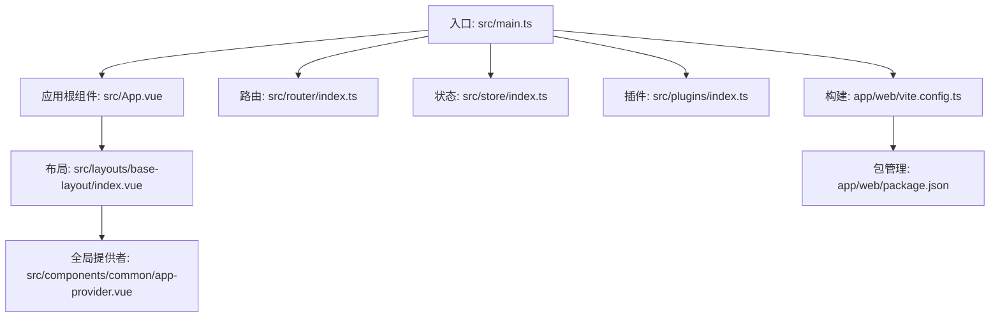
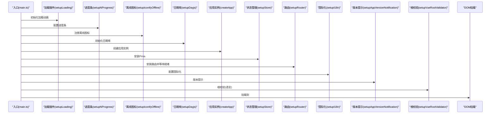
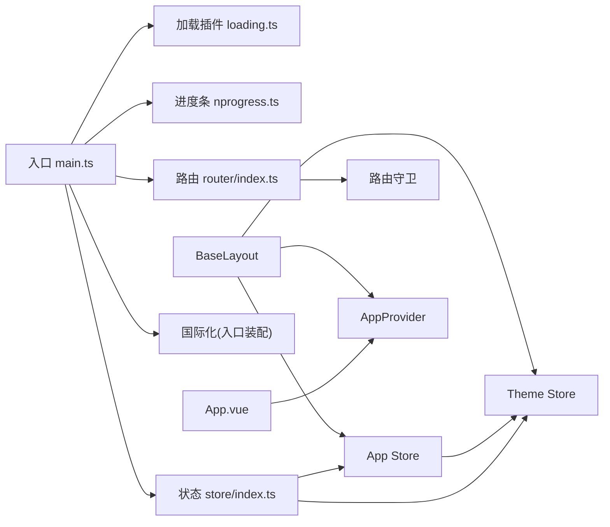

# Vue3框架基础

<cite>
**本文引用的文件**
- [vite.config.ts](file://app/web/vite.config.ts)
- [main.ts](file://app/web/src/main.ts)
- [package.json](file://app/web/package.json)
- [App.vue](file://app/web/src/App.vue)
- [router/index.ts](file://app/web/src/router/index.ts)
- [store/index.ts](file://app/web/src/store/index.ts)
- [plugins/index.ts](file://app/web/src/plugins/index.ts)
- [components/common/app-provider.vue](file://app/web/src/components/common/app-provider.vue)
- [layouts/base-layout/index.vue](file://app/web/src/layouts/base-layout/index.vue)
- [hooks/common/form.ts](file://app/web/src/hooks/common/form.ts)
- [store/modules/app/index.ts](file://app/web/src/store/modules/app/index.ts)
- [store/modules/theme/index.ts](file://app/web/src/store/modules/theme/index.ts)
- [plugins/loading.ts](file://app/web/src/plugins/loading.ts)
- [plugins/nprogress.ts](file://app/web/src/plugins/nprogress.ts)
</cite>

## 目录
1. [引言](#引言)
2. [项目结构](#项目结构)
3. [核心组件](#核心组件)
4. [架构总览](#架构总览)
5. [详细组件分析](#详细组件分析)
6. [依赖关系分析](#依赖关系分析)
7. [性能考虑](#性能考虑)
8. [故障排查指南](#故障排查指南)
9. [结论](#结论)
10. [附录](#附录)

## 引言
本文件面向希望系统掌握Vue3 Composition API与现代前端工程化实践的开发者，结合仓库中的真实实现，从应用入口、响应式系统、生命周期钩子、路由与状态管理、插件体系、构建工具配置与优化等方面进行深入讲解，并提供可直接参考的代码路径与可视化图示，帮助快速落地常见开发场景。

## 项目结构
该前端项目采用Vue3 + Vite7 + TypeScript + Pinia + NaiveUI + UnoCSS的组合，目录组织以功能域划分（如store、router、hooks、components、layouts），入口文件集中于src/main.ts，构建配置集中在vite.config.ts，包管理与脚本在package.json中定义。

图表来源
- [main.ts:1-37](file://app/web/src/main.ts#L1-L37)
- [App.vue:1-59](file://app/web/src/App.vue#L1-L59)
- [router/index.ts:1-31](file://app/web/src/router/index.ts#L1-L31)
- [store/index.ts:1-13](file://app/web/src/store/index.ts#L1-L13)
- [plugins/index.ts:1-6](file://app/web/src/plugins/index.ts#L1-L6)
- [layouts/base-layout/index.vue:1-163](file://app/web/src/layouts/base-layout/index.vue#L1-L163)
- [components/common/app-provider.vue:1-40](file://app/web/src/components/common/app-provider.vue#L1-L40)
- [vite.config.ts:1-52](file://app/web/vite.config.ts#L1-L52)
- [package.json:1-108](file://app/web/package.json#L1-L108)

章节来源
- [main.ts:1-37](file://app/web/src/main.ts#L1-L37)
- [vite.config.ts:1-52](file://app/web/vite.config.ts#L1-L52)
- [package.json:1-108](file://app/web/package.json#L1-L108)

## 核心组件
- 应用入口与初始化流程：在入口文件中按顺序完成加载器、进度条、离线图标、日期库、应用实例创建、状态管理、路由、国际化、版本提示与根校验等初始化步骤，最后挂载到DOM。
- 响应式与Composition API：广泛使用ref、computed、watch、effectScope、onScopeDispose、nextTick、toValue等API；配合@vueuse/core提供的响应式工具函数，实现跨组件共享状态与副作用管理。
- 状态管理：基于Pinia，通过模块化store组织业务域（如app、theme、route、tab），统一管理主题、语言、布局、标签页等全局状态。
- 路由：支持hash/history/memory三种历史记录模式，动态守卫与路由就绪处理确保导航安全与性能。
- 插件体系：集中导出与管理各类插件（加载动画、进度条、图标、日期、应用通知等），通过setup函数在入口处统一装配。
- 构建与开发：Vite配置提供别名、CSS预处理器、代理、构建参数、define注入等能力，支持多环境与生产优化。

章节来源
- [main.ts:10-37](file://app/web/src/main.ts#L10-L37)
- [store/modules/app/index.ts:14-167](file://app/web/src/store/modules/app/index.ts#L14-L167)
- [store/modules/theme/index.ts:19-303](file://app/web/src/store/modules/theme/index.ts#L19-L303)
- [router/index.ts:12-31](file://app/web/src/router/index.ts#L12-L31)
- [plugins/index.ts:1-6](file://app/web/src/plugins/index.ts#L1-L6)

## 架构总览
下图展示了从应用启动到页面渲染的关键调用链路，包括插件装配、状态初始化、路由挂载与国际化配置。

图表来源
- [main.ts:10-37](file://app/web/src/main.ts#L10-L37)
- [plugins/loading.ts:8-58](file://app/web/src/plugins/loading.ts#L8-L58)
- [plugins/nprogress.ts:4-9](file://app/web/src/plugins/nprogress.ts#L4-L9)

章节来源
- [main.ts:10-37](file://app/web/src/main.ts#L10-L37)

## 详细组件分析

### 组件A：应用入口与初始化（main.ts）
- 初始化顺序与职责
  - 加载动画：在应用根节点插入自定义加载界面，设置CSS变量与主题类。
  - 进度条：配置NProgress行为并挂载至window。
  - 离线图标：注册Iconify离线资源。
  - 日期库：初始化dayjs本地化。
  - 应用实例：创建Vue应用并安装插件。
  - 状态管理：创建并安装Pinia，启用重置插件。
  - 路由：安装路由并等待路由就绪。
  - 国际化：配置i18n。
  - 版本提示：应用版本通知。
  - 根校验：对过渡根元素进行语言校验。
  - 挂载：最终挂载到#app。
- 关键点
  - 异步初始化保证各插件与路由的正确顺序。
  - 将国际化语言传递给根校验，确保过渡动画的语言一致性。

章节来源
- [main.ts:10-37](file://app/web/src/main.ts#L10-L37)
- [plugins/loading.ts:8-58](file://app/web/src/plugins/loading.ts#L8-L58)
- [plugins/nprogress.ts:4-9](file://app/web/src/plugins/nprogress.ts#L4-L9)

### 组件B：应用根组件与主题提供（App.vue）
- 功能要点
  - 使用NaiveUI的NConfigProvider统一配置主题、语言与日期语言。
  - 计算属性根据主题store决定暗色主题与语言配置。
  - 包裹AppProvider，为全局对话框、消息、通知、加载条提供上下文。
  - 条件渲染水印组件，内容来自主题store的配置。
- 响应式与依赖
  - 依赖useAppStore与useThemeStore，体现Composition API在根组件的应用。

章节来源
- [App.vue:1-59](file://app/web/src/App.vue#L1-L59)
- [store/modules/app/index.ts:14-167](file://app/web/src/store/modules/app/index.ts#L14-L167)
- [store/modules/theme/index.ts:19-303](file://app/web/src/store/modules/theme/index.ts#L19-L303)

### 组件C：布局系统与依赖注入（base-layout/index.vue）
- 功能要点
  - 基于AdminLayout实现多种布局模式（垂直/水平/混合/混合+侧栏/混合+顶部等）。
  - 通过provideMixMenuContext与多个模块（头部、侧边、标签、菜单、内容、页脚、主题抽屉）协作。
  - 使用computed动态计算头部显示、侧边宽度、是否固定等属性。
  - 异步加载菜单组件，降低首屏负载。
- 依赖注入
  - 通过provide/inject模式向子组件注入菜单上下文，实现布局与菜单的解耦。

章节来源
- [layouts/base-layout/index.vue:1-163](file://app/web/src/layouts/base-layout/index.vue#L1-L163)

### 组件D：全局提供者（app-provider.vue）
- 功能要点
  - 在AppProvider内部注册NaiveUI的LoadingBar、Dialog、Message、Notification上下文。
  - 通过defineComponent与defineAsyncComponent在运行时注入到window对象，便于全局调用。
- 依赖注入
  - 为全局组件提供一致的UI交互上下文，避免重复引入。

章节来源
- [components/common/app-provider.vue:1-40](file://app/web/src/components/common/app-provider.vue#L1-L40)

### 组件E：表单规则与验证Hook（hooks/common/form.ts）
- 功能要点
  - 提供常用正则规则与必填规则工厂方法。
  - 支持确认密码异步校验。
  - 封装NaiveUI表单实例的校验与恢复逻辑。
- 响应式与类型
  - 使用ref与toValue处理表单引用与值，结合i18n实现国际化错误信息。

章节来源
- [hooks/common/form.ts:1-98](file://app/web/src/hooks/common/form.ts#L1-L98)

### 组件F：应用状态（store/modules/app/index.ts）
- 功能要点
  - 使用effectScope隔离副作用，配合onScopeDispose清理。
  - 响应式断点判断移动端布局，自动切换主题与折叠侧边栏。
  - 监听语言变化，更新标题、菜单与标签页，并同步dayjs语言。
  - 提供页面重载、全屏、内容横向滚动、侧边栏折叠、混合侧边固定等控制方法。
- 生命周期与副作用
  - 在init阶段完成语言本地化初始化。
  - 在beforeunload事件中持久化混合侧边固定状态。

章节来源
- [store/modules/app/index.ts:14-167](file://app/web/src/store/modules/app/index.ts#L14-L167)

### 组件G：主题状态（store/modules/theme/index.ts）
- 功能要点
  - 主题方案（亮/暗/跟随系统）、灰度模式、色弱模式。
  - 主题色彩生成与NaiveUI主题覆盖。
  - 水印内容动态生成（用户名/时间/文本）。
  - 将主题变量注入全局CSS变量，支持暗色模式切换与辅助视觉模式。
- 响应式与副作用
  - 监听主题颜色变化，实时更新CSS变量与存储。
  - 控制水印计时器的启停，仅在可见且启用时间时运行。

章节来源
- [store/modules/theme/index.ts:19-303](file://app/web/src/store/modules/theme/index.ts#L19-L303)

### 组件H：路由与守卫（router/index.ts）
- 功能要点
  - 支持hash/history/memory三种历史记录模式，可通过环境变量切换。
  - 创建内置路由并应用路由守卫，等待路由就绪后返回。
- 全局配置
  - 历史记录模式与基础路径从import.meta.env读取。

章节来源
- [router/index.ts:12-31](file://app/web/src/router/index.ts#L12-L31)

### 组件I：状态管理（store/index.ts）
- 功能要点
  - 创建Pinia实例并安装resetSetupStore插件，便于在开发时重置store状态。
  - 将store注册到应用实例。

章节来源
- [store/index.ts:1-13](file://app/web/src/store/index.ts#L1-L13)

### 组件J：插件系统（plugins/index.ts）
- 功能要点
  - 统一导出加载动画、进度条、图标、日期、应用通知等插件，便于入口集中装配。

章节来源
- [plugins/index.ts:1-6](file://app/web/src/plugins/index.ts#L1-L6)

### 组件K：加载动画插件（plugins/loading.ts）
- 功能要点
  - 从本地存储读取主题色与暗色模式，生成CSS变量与SVG渐变。
  - 在应用根节点插入自定义加载界面，包含旋转四角点阵与品牌Logo。
  - 通过工具函数切换HTML类名，实现暗色模式初始态。

章节来源
- [plugins/loading.ts:8-58](file://app/web/src/plugins/loading.ts#L8-L58)

### 组件L：进度条插件（plugins/nprogress.ts）
- 功能要点
  - 配置NProgress动画曲线与速度，并挂载到window对象，便于全局调用。

章节来源
- [plugins/nprogress.ts:4-9](file://app/web/src/plugins/nprogress.ts#L4-L9)

### 组件M：构建配置（vite.config.ts）
- 功能要点
  - 别名配置：~指向项目根，@指向src目录。
  - CSS预处理：SCSS modern-compiler与全局样式注入。
  - 插件：通过setupVitePlugins集中装配。
  - 服务器：host/port/open/proxy配置，开发代理开关。
  - 构建：压缩报告关闭、SourceMap按环境变量控制、CommonJS选项。
  - define：向代码注入构建时间常量。
- 环境变量
  - VITE_BASE_URL、VITE_SOURCE_MAP等。

章节来源
- [vite.config.ts:1-52](file://app/web/vite.config.ts#L1-L52)

### 组件N：包管理与脚本（package.json）
- 功能要点
  - 依赖：Vue3、Pinia、Vue Router、NaiveUI、dayjs、nprogress、@vueuse/core等。
  - 开发依赖：Vite、Vue插件、UnoCSS、ESLint、TypeScript等。
  - 脚本：dev/build/preview/typecheck/lint等常用命令。
  - 引擎要求：Node与pnpm版本约束。

章节来源
- [package.json:1-108](file://app/web/package.json#L1-L108)

## 依赖关系分析
- 入口依赖
  - main.ts依赖所有插件与子系统初始化函数，形成清晰的装配顺序。
- 组件依赖
  - App.vue依赖store模块与AppProvider。
  - BaseLayout依赖多个布局模块与菜单上下文。
  - Hooks提供表单规则与验证能力，被业务组件复用。
- 状态依赖
  - App与Theme store相互影响（语言切换影响菜单与标签、暗色模式影响全局CSS变量）。
- 路由依赖
  - 路由守卫依赖路由实例与状态store，确保导航安全。
- 构建依赖
  - Vite配置依赖插件工厂与代理工厂，实现开发体验与构建优化。

图表来源
- [main.ts:10-37](file://app/web/src/main.ts#L10-L37)
- [store/index.ts:1-13](file://app/web/src/store/index.ts#L1-L13)
- [router/index.ts:12-31](file://app/web/src/router/index.ts#L12-L31)
- [store/modules/app/index.ts:14-167](file://app/web/src/store/modules/app/index.ts#L14-L167)
- [store/modules/theme/index.ts:19-303](file://app/web/src/store/modules/theme/index.ts#L19-L303)
- [components/common/app-provider.vue:1-40](file://app/web/src/components/common/app-provider.vue#L1-L40)
- [layouts/base-layout/index.vue:1-163](file://app/web/src/layouts/base-layout/index.vue#L1-L163)

章节来源
- [main.ts:10-37](file://app/web/src/main.ts#L10-L37)
- [store/index.ts:1-13](file://app/web/src/store/index.ts#L1-L13)
- [router/index.ts:12-31](file://app/web/src/router/index.ts#L12-L31)

## 性能考虑
- 路由与组件
  - 路由等待就绪再挂载，避免白屏与重复渲染。
  - 布局中的菜单组件采用异步加载，减少首屏体积。
- 状态管理
  - 使用effectScope隔离副作用，避免内存泄漏；在scope销毁时清理。
  - 主题变量注入全局CSS变量，减少重复计算与样式抖动。
- 构建优化
  - Vite按需开启SourceMap，生产关闭压缩报告，平衡调试与体积。
  - 通过插件工厂集中管理插件，便于按需启用与优化。
- 响应式与计算
  - 大量使用computed与watch，配合immediate与去抖策略，降低不必要更新。

## 故障排查指南
- 加载动画未生效
  - 检查加载插件是否在入口中调用，确认根节点#app存在。
  - 参考路径：[plugins/loading.ts:8-58](file://app/web/src/plugins/loading.ts#L8-L58)
- 路由跳转无效果或白屏
  - 确认路由已安装并等待就绪后再挂载应用。
  - 参考路径：[router/index.ts:25-31](file://app/web/src/router/index.ts#L25-L31)
- 国际化文案不显示或语言不生效
  - 检查语言切换逻辑与标题更新流程，确认i18n已正确初始化。
  - 参考路径：[store/modules/app/index.ts:116-129](file://app/web/src/store/modules/app/index.ts#L116-L129)
- 主题切换无效
  - 检查CSS变量注入与暗色模式切换逻辑，确认watch监听生效。
  - 参考路径：[store/modules/theme/index.ts:240-277](file://app/web/src/store/modules/theme/index.ts#L240-L277)
- 进度条不显示
  - 确认NProgress已配置并挂载至window，业务中正确调用。
  - 参考路径：[plugins/nprogress.ts:4-9](file://app/web/src/plugins/nprogress.ts#L4-L9)

章节来源
- [plugins/loading.ts:8-58](file://app/web/src/plugins/loading.ts#L8-L58)
- [router/index.ts:25-31](file://app/web/src/router/index.ts#L25-L31)
- [store/modules/app/index.ts:116-129](file://app/web/src/store/modules/app/index.ts#L116-L129)
- [store/modules/theme/index.ts:240-277](file://app/web/src/store/modules/theme/index.ts#L240-L277)
- [plugins/nprogress.ts:4-9](file://app/web/src/plugins/nprogress.ts#L4-L9)

## 结论
本项目以Vue3 Composition API为核心，结合Pinia、Vue Router、NaiveUI与Vite，形成了高内聚、低耦合的前端架构。通过入口集中装配、store模块化管理、布局与菜单解耦、插件化扩展以及完善的构建配置，能够高效支撑复杂中后台应用的开发与维护。建议在实际项目中遵循本文档的初始化顺序、响应式使用规范与插件开发最佳实践，以获得更佳的开发体验与运行性能。

## 附录
- 常见开发场景参考路径
  - 页面级表单校验与提交：[hooks/common/form.ts:81-98](file://app/web/src/hooks/common/form.ts#L81-L98)
  - 布局切换与移动端适配：[store/modules/app/index.ts:84-130](file://app/web/src/store/modules/app/index.ts#L84-L130)
  - 主题动态切换与水印控制：[store/modules/theme/index.ts:240-277](file://app/web/src/store/modules/theme/index.ts#L240-L277)
  - 路由守卫与导航拦截：[router/index.ts:12-31](file://app/web/src/router/index.ts#L12-L31)
  - 应用根组件国际化与主题：[App.vue:16-40](file://app/web/src/App.vue#L16-L40)