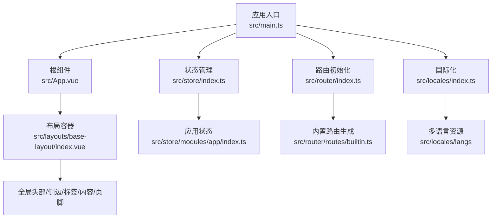
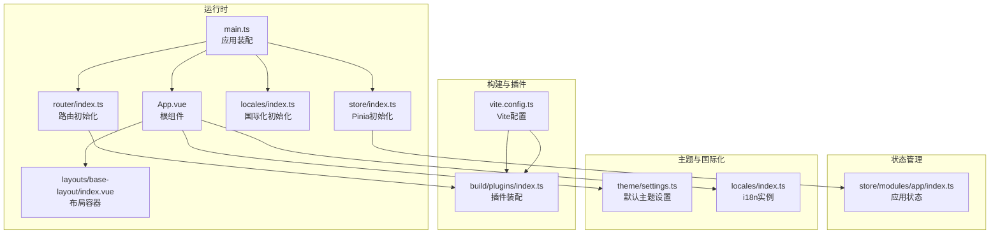
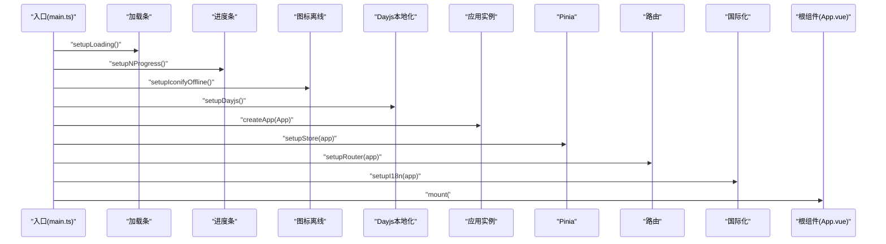
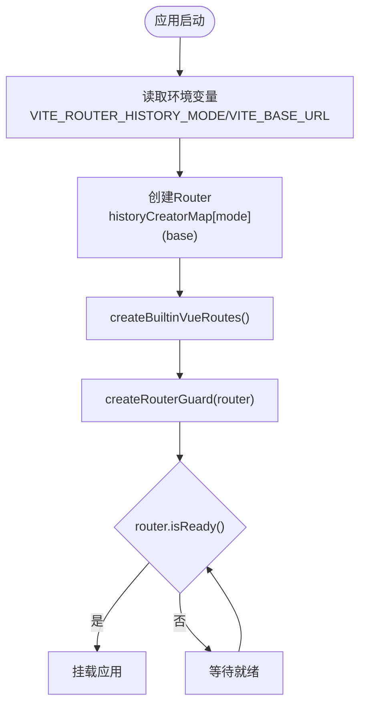
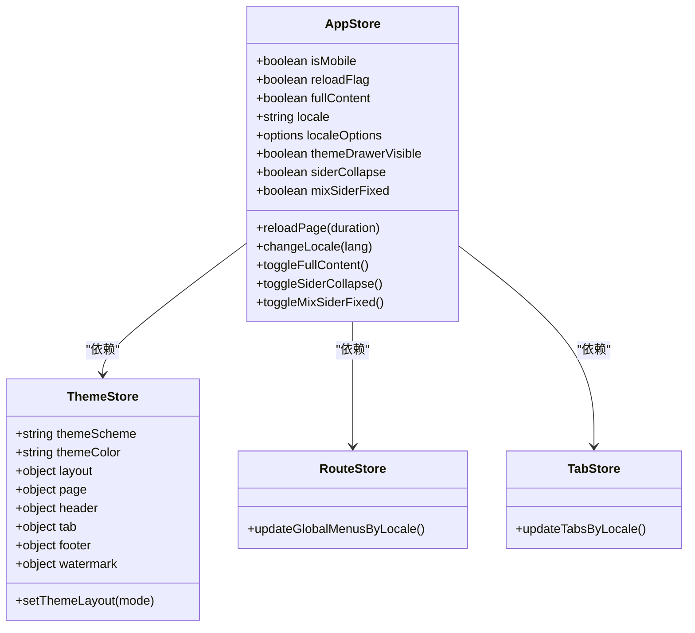
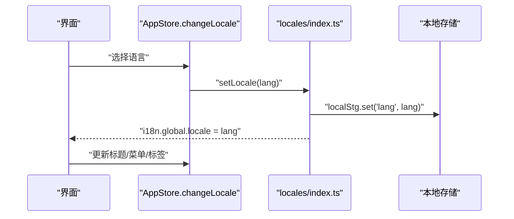
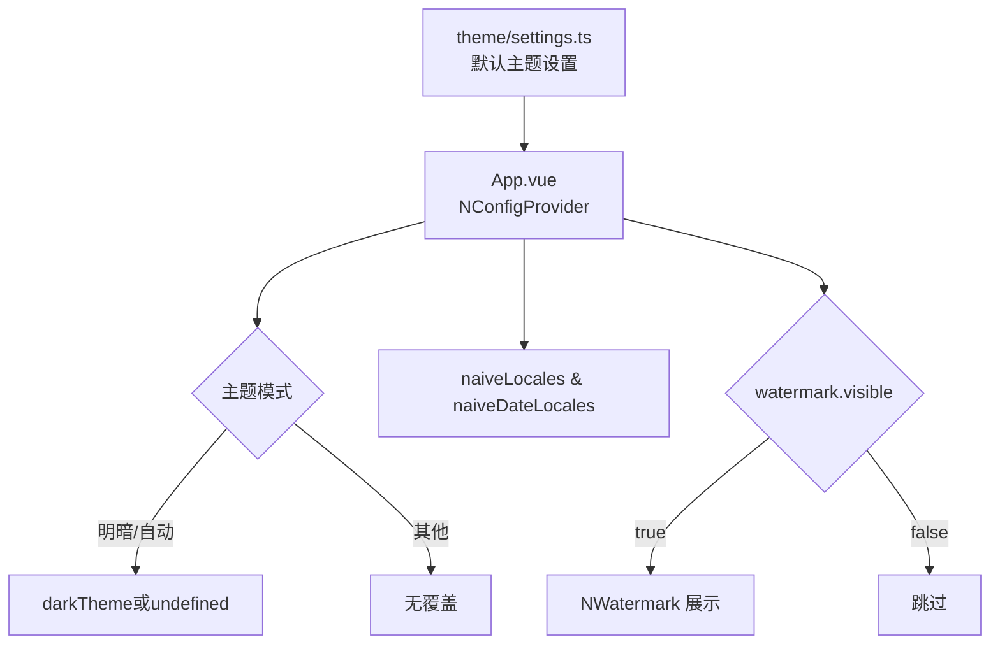
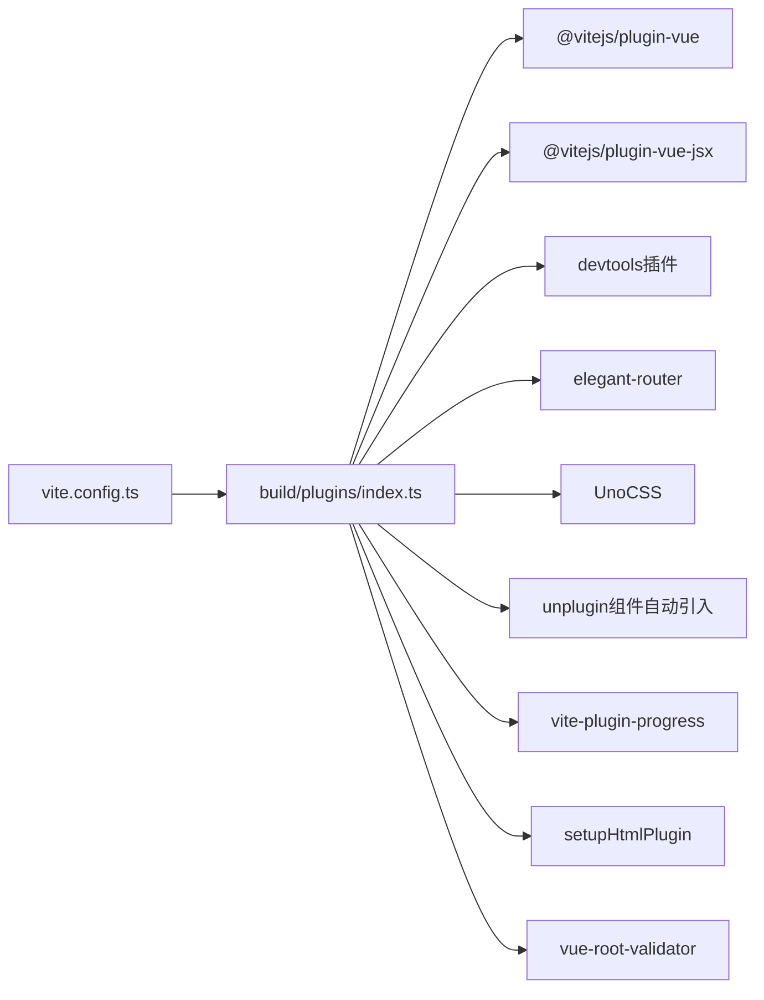
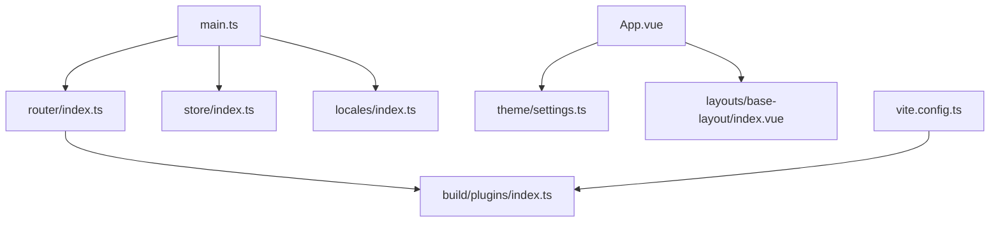

# 前端开发

<cite>
**本文引用的文件**
- [package.json](file://app/web/package.json)
- [vite.config.ts](file://app/web/vite.config.ts)
- [tsconfig.json](file://app/web/tsconfig.json)
- [main.ts](file://app/web/src/main.ts)
- [App.vue](file://app/web/src/App.vue)
- [router/index.ts](file://app/web/src/router/index.ts)
- [store/index.ts](file://app/web/src/store/index.ts)
- [locales/index.ts](file://app/web/src/locales/index.ts)
- [theme/settings.ts](file://app/web/src/theme/settings.ts)
- [build/plugins/index.ts](file://app/web/build/plugins/index.ts)
- [layouts/base-layout/index.vue](file://app/web/src/layouts/base-layout/index.vue)
- [store/modules/app/index.ts](file://app/web/src/store/modules/app/index.ts)
- [components/common/app-provider.vue](file://app/web/src/components/common/app-provider.vue)
- [plugins/index.ts](file://app/web/src/plugins/index.ts)
- [constants/app.ts](file://app/web/src/constants/app.ts)
</cite>

## 目录
1. [简介](#简介)
2. [项目结构](#项目结构)
3. [核心组件](#核心组件)
4. [架构总览](#架构总览)
5. [详细组件分析](#详细组件分析)
6. [依赖关系分析](#依赖关系分析)
7. [性能考虑](#性能考虑)
8. [故障排查指南](#故障排查指南)
9. [结论](#结论)
10. [附录](#附录)

## 简介
本指南面向boread前端团队，系统梳理基于Vue3 + Vite + TypeScript的现代前端技术栈在本项目中的落地方式与最佳实践。内容涵盖：项目目录结构、组件设计模式、状态管理（Pinia）、路由配置策略、UI组件库与主题定制、国际化实现、构建流程、开发调试技巧、性能优化策略、代码规范与Git工作流、CI配置要点以及常见开发场景的解决方案。

## 项目结构
前端工程位于 app/web 目录，采用模块化与分层组织方式：
- 根配置：package.json、vite.config.ts、tsconfig.json
- 应用入口：src/main.ts、src/App.vue
- 路由与守卫：src/router
- 状态管理：src/store
- 国际化：src/locales
- 主题与样式：src/theme、src/styles
- 布局与页面：src/layouts、src/views
- 组件库与工具：src/components、src/utils、src/hooks
- 插件体系：src/plugins
- 构建插件：build/plugins

图表来源
- [main.ts:1-37](file://app/web/src/main.ts#L1-L37)
- [App.vue:1-59](file://app/web/src/App.vue#L1-L59)
- [store/index.ts:1-13](file://app/web/src/store/index.ts#L1-L13)
- [router/index.ts:1-31](file://app/web/src/router/index.ts#L1-L31)
- [layouts/base-layout/index.vue:1-163](file://app/web/src/layouts/base-layout/index.vue#L1-L163)
- [store/modules/app/index.ts:1-167](file://app/web/src/store/modules/app/index.ts#L1-L167)

章节来源
- [package.json:1-108](file://app/web/package.json#L1-L108)
- [vite.config.ts:1-52](file://app/web/vite.config.ts#L1-L52)
- [tsconfig.json:1-26](file://app/web/tsconfig.json#L1-L26)

## 核心组件
- 应用启动与装配：在应用入口中统一注册加载条、进度条、图标离线、日历、国际化、版本提示等插件，并挂载Pinia、路由与i18n。
- 根组件与主题：根组件通过Naive UI的NConfigProvider注入主题、语言与水印；主题开关与水印内容来自主题存储。
- 布局容器：基于AdminLayout封装的BaseLayout，按主题布局模式动态渲染头部、侧边、标签、内容区与页脚，并支持混合布局宽度计算。
- 应用状态：Pinia模块化管理国际化、移动端适配、全屏内容、侧边栏折叠、混合布局固定等全局状态。
- 插件体系：集中导出与注册各类插件，包括加载条、进度条、图标离线、Dayjs本地化、应用上下文提供器等。

章节来源
- [main.ts:1-37](file://app/web/src/main.ts#L1-L37)
- [App.vue:1-59](file://app/web/src/App.vue#L1-L59)
- [layouts/base-layout/index.vue:1-163](file://app/web/src/layouts/base-layout/index.vue#L1-L163)
- [store/modules/app/index.ts:1-167](file://app/web/src/store/modules/app/index.ts#L1-L167)
- [components/common/app-provider.vue:1-40](file://app/web/src/components/common/app-provider.vue#L1-L40)
- [plugins/index.ts:1-6](file://app/web/src/plugins/index.ts#L1-L6)

## 架构总览
整体架构围绕“入口装配—状态—路由—布局—视图”的层次展开，配合Vite插件链路与UnoCSS原子化样式，形成可扩展的主题与国际化体系。

图表来源
- [main.ts:1-37](file://app/web/src/main.ts#L1-L37)
- [router/index.ts:1-31](file://app/web/src/router/index.ts#L1-L31)
- [store/index.ts:1-13](file://app/web/src/store/index.ts#L1-L13)
- [locales/index.ts:1-33](file://app/web/src/locales/index.ts#L1-L33)
- [App.vue:1-59](file://app/web/src/App.vue#L1-L59)
- [layouts/base-layout/index.vue:1-163](file://app/web/src/layouts/base-layout/index.vue#L1-L163)
- [store/modules/app/index.ts:1-167](file://app/web/src/store/modules/app/index.ts#L1-L167)
- [vite.config.ts:1-52](file://app/web/vite.config.ts#L1-L52)
- [build/plugins/index.ts:1-27](file://app/web/build/plugins/index.ts#L1-L27)
- [theme/settings.ts:1-97](file://app/web/src/theme/settings.ts#L1-L97)

## 详细组件分析

### 应用入口与装配流程
- 入口函数顺序执行：加载条、进度条、图标离线、Dayjs、创建应用实例、安装Pinia、安装路由、安装国际化、版本通知、Vue过渡校验。
- 根组件通过Naive UI提供器注入主题、语言与日期语言，同时根据主题开关渲染全局水印。

图表来源
- [main.ts:10-36](file://app/web/src/main.ts#L10-L36)
- [App.vue:44-55](file://app/web/src/App.vue#L44-L55)

章节来源
- [main.ts:1-37](file://app/web/src/main.ts#L1-L37)
- [App.vue:1-59](file://app/web/src/App.vue#L1-L59)

### 路由配置与守卫
- 历史模式由环境变量控制，支持hash/history/memory三种模式，默认使用环境变量指定的模式。
- 内置路由通过路由生成器创建，路由守卫负责权限、进度条与标题更新。
- 路由就绪后才进行挂载，确保导航安全。

图表来源
- [router/index.ts:12-30](file://app/web/src/router/index.ts#L12-L30)

章节来源
- [router/index.ts:1-31](file://app/web/src/router/index.ts#L1-L31)

### 状态管理（Pinia）与应用状态
- Pinia在入口处初始化并注册重置插件，随后在各模块中按功能域拆分状态。
- 应用状态模块负责国际化切换、移动端断点监听、标题更新、菜单与标签国际化更新、混合布局固定等。

图表来源
- [store/modules/app/index.ts:14-166](file://app/web/src/store/modules/app/index.ts#L14-L166)

章节来源
- [store/index.ts:1-13](file://app/web/src/store/index.ts#L1-L13)
- [store/modules/app/index.ts:1-167](file://app/web/src/store/modules/app/index.ts#L1-L167)

### 国际化（i18n）
- 使用vue-i18n创建i18n实例，语言持久化到本地存储，回退语言为英语。
- 提供切换语言方法与当前语言查询方法，并同步HTML语言属性。
- Naive UI的语言与日期语言随应用语言动态切换。

图表来源
- [locales/index.ts:24-28](file://app/web/src/locales/index.ts#L24-L28)
- [store/modules/app/index.ts:116-129](file://app/web/src/store/modules/app/index.ts#L116-L129)

章节来源
- [locales/index.ts:1-33](file://app/web/src/locales/index.ts#L1-L33)
- [constants/app.ts:1-72](file://app/web/src/constants/app.ts#L1-L72)

### 主题与布局
- 默认主题设置集中于主题设置文件，包含外观、颜色、布局、页面动画、头部、标签、侧边、页脚、水印等。
- 布局容器根据主题布局模式动态决定头部显示、侧边可见性与宽度，并支持混合布局的子菜单宽度叠加。
- 根组件通过Naive UI提供器注入主题覆盖与语言配置，水印开关与内容来自主题存储。

图表来源
- [theme/settings.ts:2-89](file://app/web/src/theme/settings.ts#L2-L89)
- [App.vue:16-40](file://app/web/src/App.vue#L16-L40)
- [layouts/base-layout/index.vue:25-116](file://app/web/src/layouts/base-layout/index.vue#L25-L116)

章节来源
- [theme/settings.ts:1-97](file://app/web/src/theme/settings.ts#L1-L97)
- [layouts/base-layout/index.vue:1-163](file://app/web/src/layouts/base-layout/index.vue#L1-L163)
- [App.vue:1-59](file://app/web/src/App.vue#L1-L59)

### 插件体系与构建插件
- 插件集中导出与注册，包括加载条、进度条、图标离线、Dayjs、应用上下文提供器等。
- Vite插件链包含Vue、JSX、Elegant Router、UnoCSS、Unplugin组件自动引入、HTML插件、Vue过渡校验等。
- 构建时支持源码映射开关、CommonJS兼容选项与构建时间注入。

图表来源
- [vite.config.ts:30-30](file://app/web/vite.config.ts#L30-L30)
- [build/plugins/index.ts:12-26](file://app/web/build/plugins/index.ts#L12-L26)

章节来源
- [plugins/index.ts:1-6](file://app/web/src/plugins/index.ts#L1-L6)
- [vite.config.ts:1-52](file://app/web/vite.config.ts#L1-L52)
- [build/plugins/index.ts:1-27](file://app/web/build/plugins/index.ts#L1-L27)

## 依赖关系分析
- 入口对插件、状态、路由、国际化的依赖清晰且集中，便于扩展与替换。
- 布局容器对主题与应用状态存在强依赖，体现“主题驱动布局”的设计理念。
- 构建阶段通过插件链路完成代码转换、样式处理与资源优化，减少手写配置成本。

图表来源
- [main.ts:1-37](file://app/web/src/main.ts#L1-L37)
- [router/index.ts:1-31](file://app/web/src/router/index.ts#L1-L31)
- [store/index.ts:1-13](file://app/web/src/store/index.ts#L1-L13)
- [locales/index.ts:1-33](file://app/web/src/locales/index.ts#L1-L33)
- [App.vue:1-59](file://app/web/src/App.vue#L1-L59)
- [layouts/base-layout/index.vue:1-163](file://app/web/src/layouts/base-layout/index.vue#L1-L163)
- [vite.config.ts:1-52](file://app/web/vite.config.ts#L1-L52)
- [build/plugins/index.ts:1-27](file://app/web/build/plugins/index.ts#L1-L27)

章节来源
- [package.json:46-68](file://app/web/package.json#L46-L68)
- [package.json:69-97](file://app/web/package.json#L69-L97)

## 性能考虑
- 源码映射：可通过环境变量开启/关闭，生产构建建议关闭以减小包体与提升加载速度。
- 构建体积：默认不输出压缩报告，如需分析可临时开启。
- 进度条与过渡校验：开发阶段启用以提升体验，生产可按需裁剪。
- 图标与样式：使用UnoCSS原子化与图标离线策略，减少运行时开销。
- 移动端适配：通过断点监听自动切换布局与折叠侧边，降低复杂度。

章节来源
- [vite.config.ts:43-49](file://app/web/vite.config.ts#L43-L49)
- [store/modules/app/index.ts:32-114](file://app/web/src/store/modules/app/index.ts#L32-L114)

## 故障排查指南
- 路由未生效：确认路由历史模式与基础路径配置正确，检查路由守卫是否阻塞。
- 国际化不生效：检查本地存储语言键值、i18n实例locale与HTML语言属性是否同步。
- 主题异常：检查主题设置文件与根组件NConfigProvider注入项，确认水印开关与主题覆盖。
- 构建失败：核对Vite插件链与环境变量，查看源码映射与CommonJS兼容配置。
- 开发调试：启用Vue Devtools插件与过渡校验，结合浏览器网络面板与控制台定位问题。

章节来源
- [router/index.ts:12-30](file://app/web/src/router/index.ts#L12-L30)
- [locales/index.ts:24-28](file://app/web/src/locales/index.ts#L24-L28)
- [App.vue:16-40](file://app/web/src/App.vue#L16-L40)
- [vite.config.ts:30-30](file://app/web/vite.config.ts#L30-L30)
- [build/plugins/index.ts:16-22](file://app/web/build/plugins/index.ts#L16-L22)

## 结论
本项目以Vue3 + Vite + TypeScript为核心，结合Pinia状态管理、Elegant Router路由、Naive UI组件库与UnoCSS样式体系，形成了高内聚、低耦合、可扩展的前端架构。通过统一的入口装配、主题与国际化策略、完善的插件链与构建配置，能够高效支撑业务迭代与性能优化。

## 附录

### 代码规范与Git工作流
- 代码格式化与静态检查：通过脚本统一执行格式化与Lint修复。
- Git钩子：在提交前自动执行类型检查、Lint、格式化与diff校验，保证提交质量。
- 提交信息：遵循仓库规则，保持提交信息清晰可追溯。

章节来源
- [package.json:37-44](file://app/web/package.json#L37-L44)
- [package.json:98-101](file://app/web/package.json#L98-L101)

### 构建与预览
- 开发模式：支持测试与生产模式切换，内置代理与热更新。
- 预览模式：本地预览构建产物，便于验证生产行为。
- 生产构建：按环境变量控制源码映射与CommonJS兼容选项。

章节来源
- [package.json:29-44](file://app/web/package.json#L29-L44)
- [vite.config.ts:34-42](file://app/web/vite.config.ts#L34-L42)

### TypeScript与路径别名
- 编译目标与模块解析：ESNext、bundler，严格空值检查与类型声明。
- 路径别名：@指向src，~指向项目根，便于跨层级引用。

章节来源
- [tsconfig.json:2-22](file://app/web/tsconfig.json#L2-L22)