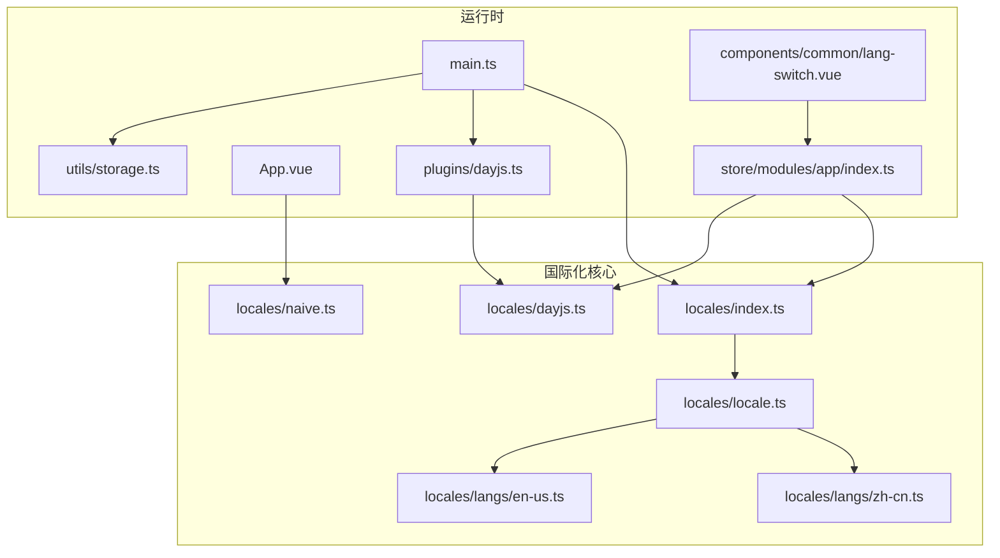
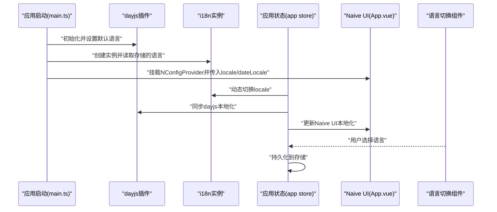
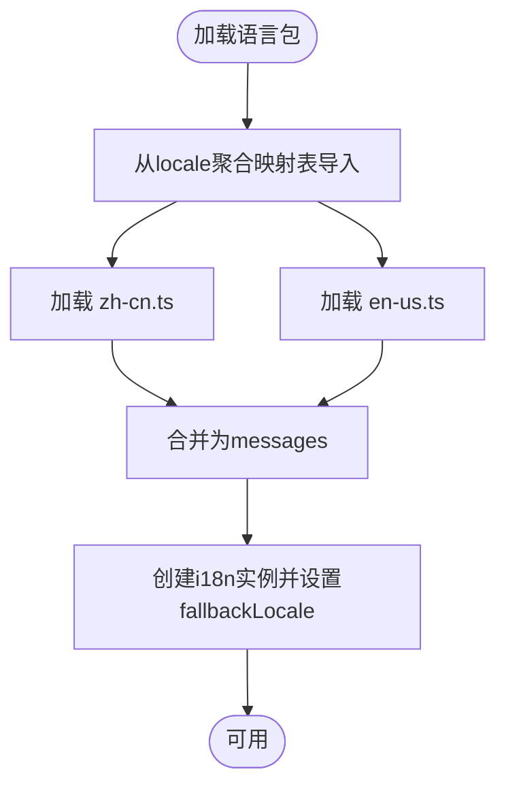
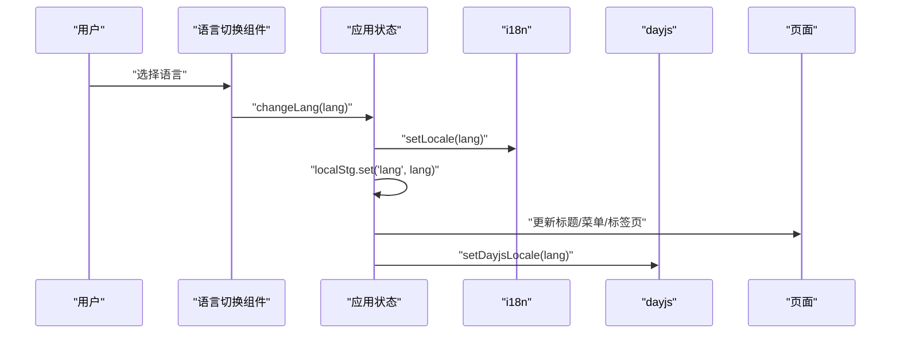
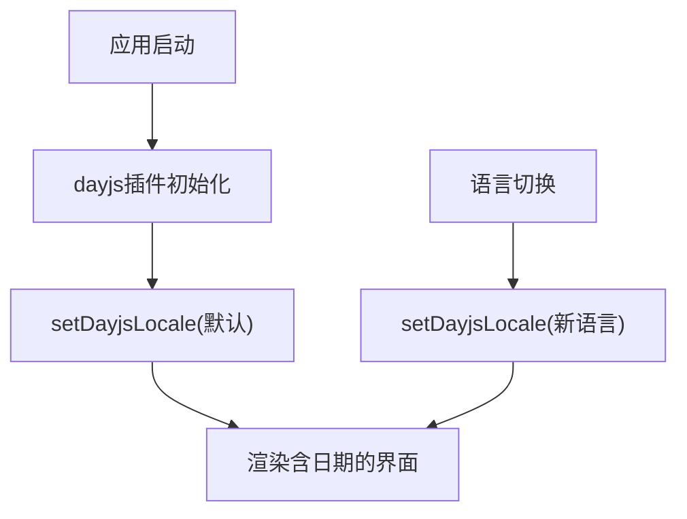
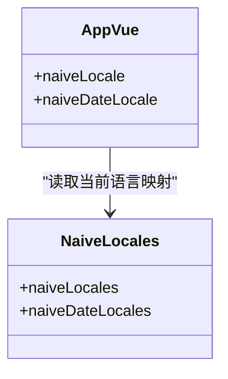
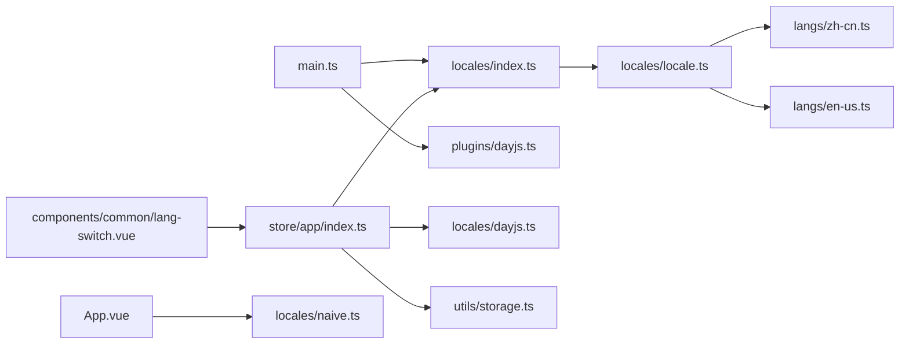

# 国际化

<cite>
**本文引用的文件**
- [locales/index.ts](file://app/web/src/locales/index.ts)
- [locales/locale.ts](file://app/web/src/locales/locale.ts)
- [locales/naive.ts](file://app/web/src/locales/naive.ts)
- [locales/dayjs.ts](file://app/web/src/locales/dayjs.ts)
- [locales/langs/zh-cn.ts](file://app/web/src/locales/langs/zh-cn.ts)
- [locales/langs/en-us.ts](file://app/web/src/locales/langs/en-us.ts)
- [components/common/lang-switch.vue](file://app/web/src/components/common/lang-switch.vue)
- [utils/storage.ts](file://app/web/src/utils/storage.ts)
- [store/modules/app/index.ts](file://app/web/src/store/modules/app/index.ts)
- [main.ts](file://app/web/src/main.ts)
- [plugins/dayjs.ts](file://app/web/src/plugins/dayjs.ts)
- [App.vue](file://app/web/src/App.vue)
</cite>

## 目录
1. [简介](#简介)
2. [项目结构](#项目结构)
3. [核心组件](#核心组件)
4. [架构总览](#架构总览)
5. [详细组件分析](#详细组件分析)
6. [依赖分析](#依赖分析)
7. [性能考虑](#性能考虑)
8. [故障排查指南](#故障排查指南)
9. [结论](#结论)
10. [附录](#附录)

## 简介
本文件系统性梳理前端国际化体系，涵盖多语言配置、翻译文件组织、动态语言切换、日期与数字格式化、Naive UI 组件本地化、语言检测与存储、以及本地化最佳实践与常见问题。目标是帮助开发者快速理解并扩展国际化能力。

## 项目结构
国际化相关代码集中在前端 Web 工程的 locales、store、plugins、App.vue 与通用组件中，形成“插件初始化 → 存储读取 → 动态切换 → UI 适配”的闭环。

**图表来源**
- [locales/index.ts:1-33](file://app/web/src/locales/index.ts#L1-L33)
- [locales/locale.ts:1-10](file://app/web/src/locales/locale.ts#L1-L10)
- [locales/naive.ts:1-13](file://app/web/src/locales/naive.ts#L1-L13)
- [locales/dayjs.ts:1-21](file://app/web/src/locales/dayjs.ts#L1-L21)
- [locales/langs/zh-cn.ts:1-836](file://app/web/src/locales/langs/zh-cn.ts#L1-L836)
- [locales/langs/en-us.ts:1-834](file://app/web/src/locales/langs/en-us.ts#L1-L834)
- [main.ts:1-37](file://app/web/src/main.ts#L1-L37)
- [store/modules/app/index.ts:1-167](file://app/web/src/store/modules/app/index.ts#L1-L167)
- [components/common/lang-switch.vue:1-62](file://app/web/src/components/common/lang-switch.vue#L1-L62)
- [plugins/dayjs.ts:1-9](file://app/web/src/plugins/dayjs.ts#L1-L9)
- [utils/storage.ts:1-10](file://app/web/src/utils/storage.ts#L1-L10)
- [App.vue:1-59](file://app/web/src/App.vue#L1-L59)

**章节来源**
- [locales/index.ts:1-33](file://app/web/src/locales/index.ts#L1-L33)
- [locales/locale.ts:1-10](file://app/web/src/locales/locale.ts#L1-L10)
- [locales/naive.ts:1-13](file://app/web/src/locales/naive.ts#L1-L13)
- [locales/dayjs.ts:1-21](file://app/web/src/locales/dayjs.ts#L1-L21)
- [locales/langs/zh-cn.ts:1-836](file://app/web/src/locales/langs/zh-cn.ts#L1-L836)
- [locales/langs/en-us.ts:1-834](file://app/web/src/locales/langs/en-us.ts#L1-L834)
- [main.ts:1-37](file://app/web/src/main.ts#L1-L37)
- [store/modules/app/index.ts:1-167](file://app/web/src/store/modules/app/index.ts#L1-L167)
- [components/common/lang-switch.vue:1-62](file://app/web/src/components/common/lang-switch.vue#L1-L62)
- [plugins/dayjs.ts:1-9](file://app/web/src/plugins/dayjs.ts#L1-L9)
- [utils/storage.ts:1-10](file://app/web/src/utils/storage.ts#L1-L10)
- [App.vue:1-59](file://app/web/src/App.vue#L1-L59)

## 核心组件
- vue-i18n 插件与实例：负责翻译键值映射、动态切换语言、回退语言等。
- 语言包聚合：按语言拆分文件，统一导出映射表。
- Naive UI 本地化：提供 UI 组件文案与日期本地化。
- dayjs 本地化：提供日期格式化与本地化。
- 应用级语言状态：集中管理当前语言、语言选项、切换逻辑。
- 语言切换组件：提供下拉选择与事件回调。
- 存储封装：提供本地持久化读写，用于保存语言偏好。

**章节来源**
- [locales/index.ts:1-33](file://app/web/src/locales/index.ts#L1-L33)
- [locales/locale.ts:1-10](file://app/web/src/locales/locale.ts#L1-L10)
- [locales/naive.ts:1-13](file://app/web/src/locales/naive.ts#L1-L13)
- [locales/dayjs.ts:1-21](file://app/web/src/locales/dayjs.ts#L1-L21)
- [store/modules/app/index.ts:1-167](file://app/web/src/store/modules/app/index.ts#L1-L167)
- [components/common/lang-switch.vue:1-62](file://app/web/src/components/common/lang-switch.vue#L1-L62)
- [utils/storage.ts:1-10](file://app/web/src/utils/storage.ts#L1-L10)

## 架构总览
国际化从应用启动开始，依次完成以下步骤：
- 初始化 dayjs 本地化
- 创建并挂载 i18n 实例
- 从存储读取语言偏好，设置 HTML lang 属性
- 将当前语言注入 Naive UI 的 locale/dateLocale
- 响应式地监听语言变化，更新标题、菜单、标签页与 dayjs

**图表来源**
- [main.ts:10-37](file://app/web/src/main.ts#L10-L37)
- [plugins/dayjs.ts:1-9](file://app/web/src/plugins/dayjs.ts#L1-L9)
- [locales/index.ts:6-28](file://app/web/src/locales/index.ts#L6-L28)
- [store/modules/app/index.ts:65-129](file://app/web/src/store/modules/app/index.ts#L65-L129)
- [App.vue:18-24](file://app/web/src/App.vue#L18-L24)
- [components/common/lang-switch.vue:46-48](file://app/web/src/components/common/lang-switch.vue#L46-L48)

## 详细组件分析

### 多语言配置与翻译文件组织
- 语言包拆分：按语言独立文件存放，便于维护与审阅。
- 聚合导出：通过映射表统一导出，供 i18n 使用。
- 键命名规范：采用层级结构（如 common、page、admin 等），提升可读性与可维护性。
- 回退策略：i18n 回退语言为英文，保证缺失键值时仍可显示。

**图表来源**
- [locales/locale.ts:1-10](file://app/web/src/locales/locale.ts#L1-L10)
- [locales/index.ts:6-11](file://app/web/src/locales/index.ts#L6-L11)
- [locales/langs/zh-cn.ts:1-836](file://app/web/src/locales/langs/zh-cn.ts#L1-L836)
- [locales/langs/en-us.ts:1-834](file://app/web/src/locales/langs/en-us.ts#L1-L834)

**章节来源**
- [locales/locale.ts:1-10](file://app/web/src/locales/locale.ts#L1-L10)
- [locales/index.ts:6-11](file://app/web/src/locales/index.ts#L6-L11)
- [locales/langs/zh-cn.ts:1-836](file://app/web/src/locales/langs/zh-cn.ts#L1-L836)
- [locales/langs/en-us.ts:1-834](file://app/web/src/locales/langs/en-us.ts#L1-L834)

### 动态语言切换
- 切换入口：应用状态集中管理语言与选项，并提供变更方法。
- 存储持久化：每次切换后写入存储，重启后恢复。
- 文档语言属性：切换时同步设置 HTML 的 lang 属性，利于无障碍与搜索引擎。
- 副作用联动：切换时更新标题、菜单、标签页，并同步 dayjs 本地化。

**图表来源**
- [store/modules/app/index.ts:52-69](file://app/web/src/store/modules/app/index.ts#L52-L69)
- [store/modules/app/index.ts:116-129](file://app/web/src/store/modules/app/index.ts#L116-L129)
- [locales/index.ts:24-28](file://app/web/src/locales/index.ts#L24-L28)
- [locales/dayjs.ts:11-20](file://app/web/src/locales/dayjs.ts#L11-L20)

**章节来源**
- [store/modules/app/index.ts:52-69](file://app/web/src/store/modules/app/index.ts#L52-L69)
- [store/modules/app/index.ts:116-129](file://app/web/src/store/modules/app/index.ts#L116-L129)
- [locales/index.ts:24-28](file://app/web/src/locales/index.ts#L24-L28)
- [locales/dayjs.ts:11-20](file://app/web/src/locales/dayjs.ts#L11-L20)

### 日期时间格式化与数字格式化
- 日期：通过 dayjs 本地化实现，初始化与切换时同步设置。
- 数字/货币：当前仓库未见专门的数字/货币格式化实现；建议在需要时引入 Intl.NumberFormat 或第三方库并在 i18n 上下文中统一管理。

**图表来源**
- [plugins/dayjs.ts:1-9](file://app/web/src/plugins/dayjs.ts#L1-L9)
- [locales/dayjs.ts:11-20](file://app/web/src/locales/dayjs.ts#L11-L20)

**章节来源**
- [plugins/dayjs.ts:1-9](file://app/web/src/plugins/dayjs.ts#L1-L9)
- [locales/dayjs.ts:11-20](file://app/web/src/locales/dayjs.ts#L11-L20)

### Naive UI 组件的本地化支持
- UI 本地化：通过 NConfigProvider 的 locale 与 dateLocale 注入当前语言的 UI 文案与日期本地化。
- 语言映射：提供 naiveLocales 与 naiveDateLocales 映射，按应用语言动态选择。

**图表来源**
- [App.vue:18-24](file://app/web/src/App.vue#L18-L24)
- [locales/naive.ts:4-12](file://app/web/src/locales/naive.ts#L4-L12)

**章节来源**
- [App.vue:18-24](file://app/web/src/App.vue#L18-L24)
- [locales/naive.ts:4-12](file://app/web/src/locales/naive.ts#L4-L12)

### 文本提取与翻译维护流程
- 语言包结构清晰，便于自动化提取与翻译校对。
- 建议流程：
  - 使用工具提取键值（如基于目录遍历与 JSON Schema 的脚本）
  - 导出为翻译清单（如 CSV/Excel）
  - 分发给译者，按语言文件回填
  - 校验缺失键值，确保 fallback 生效
  - 发布前进行回归测试

（本节为概念性说明，不直接分析具体文件）

### 语言检测、区域设置与 RTL 支持
- 语言检测：应用启动时从存储读取语言偏好，若无则使用默认语言。
- 区域设置：当前未见显式的地区细分（如 zh-CN vs zh-Hans），建议在需要时扩展语言键以支持更细粒度区域。
- RTL 支持：当前未见 RTL 相关实现；如需支持，可在 HTML lang 与 UI 方向属性上配合处理，并在样式层面适配。

**章节来源**
- [locales/index.ts:7](file://app/web/src/locales/index.ts#L7)
- [store/modules/app/index.ts:52](file://app/web/src/store/modules/app/index.ts#L52)

## 依赖分析
- 入口依赖：main.ts 依赖 i18n 与 dayjs 插件初始化。
- 状态依赖：应用状态依赖 i18n 与 dayjs 设置，并驱动 UI 更新。
- 组件依赖：App.vue 依赖 Naive UI 本地化映射；语言切换组件依赖应用状态。
- 存储依赖：i18n 与应用状态均依赖存储封装以持久化语言偏好。

**图表来源**
- [main.ts:10-25](file://app/web/src/main.ts#L10-L25)
- [locales/index.ts:1-33](file://app/web/src/locales/index.ts#L1-L33)
- [locales/locale.ts:1-10](file://app/web/src/locales/locale.ts#L1-L10)
- [locales/dayjs.ts:1-21](file://app/web/src/locales/dayjs.ts#L1-L21)
- [locales/naive.ts:1-13](file://app/web/src/locales/naive.ts#L1-L13)
- [store/modules/app/index.ts:1-167](file://app/web/src/store/modules/app/index.ts#L1-L167)
- [components/common/lang-switch.vue:1-62](file://app/web/src/components/common/lang-switch.vue#L1-L62)
- [utils/storage.ts:1-10](file://app/web/src/utils/storage.ts#L1-L10)

**章节来源**
- [main.ts:10-25](file://app/web/src/main.ts#L10-L25)
- [locales/index.ts:1-33](file://app/web/src/locales/index.ts#L1-L33)
- [locales/locale.ts:1-10](file://app/web/src/locales/locale.ts#L1-L10)
- [locales/dayjs.ts:1-21](file://app/web/src/locales/dayjs.ts#L1-L21)
- [locales/naive.ts:1-13](file://app/web/src/locales/naive.ts#L1-L13)
- [store/modules/app/index.ts:1-167](file://app/web/src/store/modules/app/index.ts#L1-L167)
- [components/common/lang-switch.vue:1-62](file://app/web/src/components/common/lang-switch.vue#L1-L62)
- [utils/storage.ts:1-10](file://app/web/src/utils/storage.ts#L1-L10)

## 性能考虑
- 语言包按语言拆分，避免一次性加载过多文本。
- 切换语言时仅更新响应式状态与相关副作用，避免全量重渲染。
- dayjs 本地化按需设置，减少重复初始化成本。
- 建议：对大型语言包进行懒加载或分块，进一步降低首屏体积。

（本节提供一般性指导，不直接分析具体文件）

## 故障排查指南
- 切换语言后 UI 文案未更新
  - 检查是否调用了设置语言函数并同步更新了 HTML lang 属性。
  - 确认应用状态监听是否生效，以及标题/菜单/标签页更新逻辑是否执行。
- 日期未按语言格式化
  - 确认 dayjs 插件已初始化且 setDayjsLocale 已被调用。
- Naive UI 文案未随语言变化
  - 确认 NConfigProvider 的 locale/dateLocale 是否正确绑定到当前语言映射。
- 语言偏好未持久化
  - 检查存储封装与写入逻辑，确认 key 名称一致。

**章节来源**
- [locales/index.ts:24-28](file://app/web/src/locales/index.ts#L24-L28)
- [store/modules/app/index.ts:116-129](file://app/web/src/store/modules/app/index.ts#L116-L129)
- [locales/dayjs.ts:11-20](file://app/web/src/locales/dayjs.ts#L11-L20)
- [App.vue:18-24](file://app/web/src/App.vue#L18-L24)
- [utils/storage.ts:1-10](file://app/web/src/utils/storage.ts#L1-L10)

## 结论
该国际化方案以 vue-i18n 为核心，结合 dayjs 与 Naive UI 的本地化映射，实现了从初始化、持久化到动态切换的完整链路。语言包结构清晰，易于扩展与维护。建议后续在数字/货币格式化、区域细分与 RTL 支持方面进一步完善，以满足更复杂的国际化需求。

## 附录
- 术语
  - i18n：国际化（internationalization 的首尾字母 i 与 n 之间的 18 个字母）
  - fallback：回退语言
  - RTL：从右到左（Right-To-Left）
- 参考实现位置
  - i18n 实例与设置：locales/index.ts
  - 语言包聚合：locales/locale.ts
  - 语言包示例：locales/langs/zh-cn.ts、locales/langs/en-us.ts
  - Naive UI 本地化映射：locales/naive.ts
  - dayjs 本地化：locales/dayjs.ts、plugins/dayjs.ts
  - 应用状态与切换：store/modules/app/index.ts
  - 语言切换组件：components/common/lang-switch.vue
  - 存储封装：utils/storage.ts
  - 应用入口：main.ts
  - UI 根节点注入：App.vue