# 构建与部署

<cite>
**本文引用的文件**
- [vite.config.ts](file://app/web/vite.config.ts)
- [package.json](file://app/web/package.json)
- [.env](file://app/web/.env)
- [tsconfig.json](file://app/web/tsconfig.json)
- [项目配置 project.yaml](file://project.yaml)
</cite>

## 目录
1. [简介](#简介)
2. [项目结构](#项目结构)
3. [核心组件](#核心组件)
4. [架构总览](#架构总览)
5. [详细组件分析](#详细组件分析)
6. [依赖关系分析](#依赖关系分析)
7. [性能考量](#性能考量)
8. [故障排查指南](#故障排查指南)
9. [结论](#结论)
10. [附录](#附录)

## 简介
本指南面向前端构建与部署，围绕当前仓库中的前端工程（Vite + Vue3 + TypeScript）展开，系统讲解以下主题：
- Vite 配置优化与打包策略
- 资源压缩与产物体积监控
- 环境变量管理、条件编译与运行时注入
- CDN 配置思路与静态资源分发
- Docker 容器化与多架构支持
- CI/CD 流水线与自动化部署
- 性能监控、缓存策略与版本管理
- 生产环境优化、安全配置与监控告警

本指南在不直接粘贴代码的前提下，通过“章节来源”定位到具体实现文件与行号，帮助读者快速定位到实际配置。

## 项目结构
前端工程位于 app/web 目录，采用 Vite 作为构建工具，使用 TypeScript 开发，包管理器为 pnpm。核心构建与运行脚本集中在 package.json 的 scripts 字段；运行时配置由 .env 文件提供；构建入口与插件扩展在 vite.config.ts 中定义；类型与路径别名在 tsconfig.json 中声明。

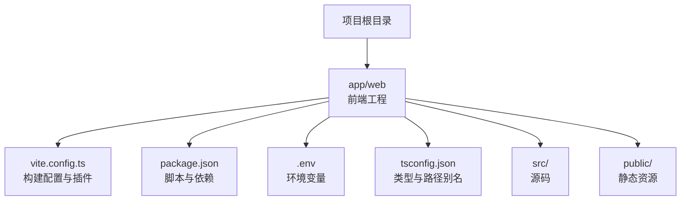

图表来源
- [vite.config.ts:1-52](file://app/web/vite.config.ts#L1-L52)
- [package.json:1-108](file://app/web/package.json#L1-L108)
- [.env:1-61](file://app/web/.env#L1-L61)
- [tsconfig.json:1-26](file://app/web/tsconfig.json#L1-L26)

章节来源
- [vite.config.ts:1-52](file://app/web/vite.config.ts#L1-L52)
- [package.json:1-108](file://app/web/package.json#L1-L108)
- [.env:1-61](file://app/web/.env#L1-L61)
- [tsconfig.json:1-26](file://app/web/tsconfig.json#L1-L26)

## 核心组件
- 构建配置与插件：通过 vite.config.ts 统一加载环境变量、设置别名、CSS 预处理、代理、define 注入与构建参数，并调用统一的插件装配函数。
- 运行时环境变量：通过 .env 提供应用基础路径、路由模式、服务端返回码约定、存储前缀等配置项。
- 类型与路径别名：tsconfig.json 声明路径映射与严格类型选项，确保开发体验与构建稳定性。
- 包管理与脚本：package.json 定义开发、预览、构建与测试模式的命令，以及各类开发工具链集成。

章节来源
- [vite.config.ts:7-51](file://app/web/vite.config.ts#L7-L51)
- [.env:1-61](file://app/web/.env#L1-L61)
- [tsconfig.json:1-26](file://app/web/tsconfig.json#L1-L26)
- [package.json:29-44](file://app/web/package.json#L29-L44)

## 架构总览
下图展示了从开发到生产的典型流程：本地开发（Vite Dev Server）、构建（Vite Build）、产物预览（Vite Preview），以及最终部署到服务器或容器镜像的过程。

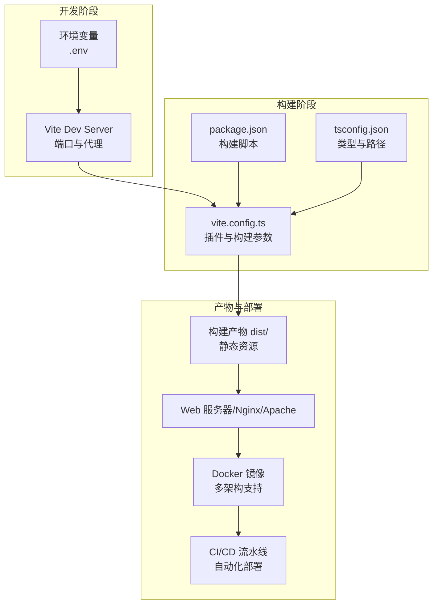

图表来源
- [vite.config.ts:34-49](file://app/web/vite.config.ts#L34-L49)
- [package.json:29-44](file://app/web/package.json#L29-L44)
- [tsconfig.json:1-26](file://app/web/tsconfig.json#L1-L26)
- [项目配置 project.yaml:1-30](file://project.yaml#L1-L30)

## 详细组件分析

### Vite 配置与优化
- 基础路径与别名：通过 base 与 resolve.alias 设置应用的基础路径与模块别名，提升导入便捷性与部署灵活性。
- CSS 预处理：启用 SCSS 并注入全局样式，减少重复引入。
- 插件体系：集中通过 setupVitePlugins(viteEnv, buildTime) 装配插件，便于扩展与维护。
- define 注入：向运行时注入构建时间常量，用于日志、诊断与版本标识。
- 服务器与预览：开发服务器监听 0.0.0.0，端口可配置；预览端口独立，避免冲突。
- 构建参数：关闭默认压缩体积报告，按需开启 SourceMap，调整 CommonJS 处理策略。

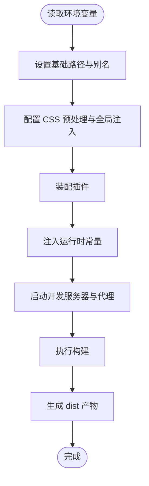

图表来源
- [vite.config.ts:14-49](file://app/web/vite.config.ts#L14-L49)

章节来源
- [vite.config.ts:7-51](file://app/web/vite.config.ts#L7-L51)

### 环境变量管理与条件编译
- 环境变量来源：开发与测试模式通过 .env 提供，如基础路径、图标前缀、路由模式、后端返回码约定、存储前缀、是否启用代理与 SourceMap 等。
- 条件编译：通过 define 注入常量与环境变量判断，实现不同环境下的差异化行为（例如是否自动检测更新、是否显示代理日志等）。
- 运行时访问：在代码中以 import.meta.env 访问 Vite 注入的变量，确保仅暴露必要信息。

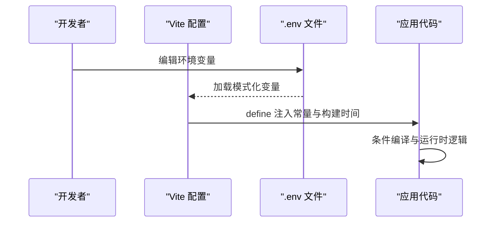

图表来源
- [vite.config.ts:8-33](file://app/web/vite.config.ts#L8-L33)
- [.env:1-61](file://app/web/.env#L1-L61)

章节来源
- [vite.config.ts:8-33](file://app/web/vite.config.ts#L8-L33)
- [.env:1-61](file://app/web/.env#L1-L61)

### 打包策略与资源压缩
- 构建命令：通过 package.json 的 scripts 定义 prod/test 模式构建，分别对应不同的环境变量与产物特性。
- 产物体积监控：构建配置中关闭默认压缩体积报告，建议结合体积分析插件或后续 CI 步骤进行可视化分析。
- SourceMap：根据 VITE_SOURCE_MAP 控制是否生成，便于生产问题定位但会增加体积与泄露风险。
- 压缩与混淆：建议在 CI 中引入压缩与混淆策略（如 Terser、SWC 等），并在 Nginx 层启用 gzip/br 压缩。

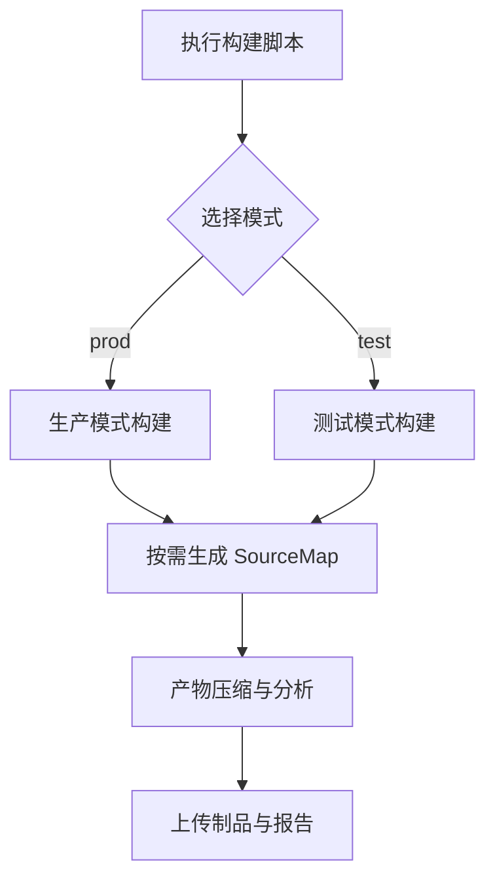

图表来源
- [package.json:30-31](file://app/web/package.json#L30-L31)
- [vite.config.ts:43-49](file://app/web/vite.config.ts#L43-L49)

章节来源
- [package.json:29-44](file://app/web/package.json#L29-L44)
- [vite.config.ts:43-49](file://app/web/vite.config.ts#L43-L49)

### CDN 配置与静态资源分发
- 基础路径：通过 VITE_BASE_URL 控制应用基础路径，配合 CDN 域名可实现静态资源分离与加速。
- 资源指纹：建议在 CI 中为产物添加哈希后缀，结合浏览器缓存策略实现长效缓存。
- 分发策略：将 dist 产物托管至 CDN 或对象存储，Nginx 反代指向 CDN 域名，确保跨域与缓存头正确。

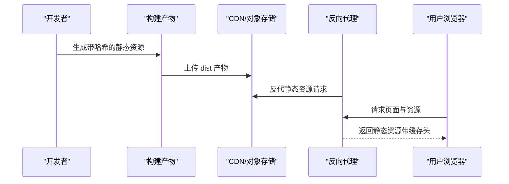

图表来源
- [.env](file://app/web/.env#L3)
- [vite.config.ts](file://app/web/vite.config.ts#L15)

### Docker 容器化与多架构支持
- 项目配置：项目配置文件声明了支持的架构（amd64/arm64）与启动命令，适合容器化部署。
- 镜像策略：建议将构建产物复制到 Nginx 静态站点目录，使用多阶段构建减少镜像体积。
- 多架构：利用 Docker 构建多架构镜像，结合项目配置中的架构列表进行分发。

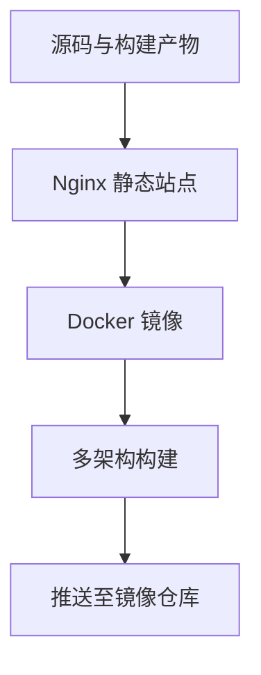

图表来源
- [项目配置 project.yaml:4-11](file://project.yaml#L4-L11)

章节来源
- [项目配置 project.yaml:1-30](file://project.yaml#L1-L30)

### CI/CD 流水线与自动化部署
- 触发方式：可通过 Git 标签、分支保护或 Pull Request 合并触发流水线。
- 关键步骤：安装依赖、类型检查、代码质量检查、构建、产物上传、镜像构建与推送、目标环境部署。
- 环境隔离：区分 develop/test/prod 环境，使用不同 .env.* 文件或环境变量覆盖。
- 自动化发布：结合版本号与变更日志，实现灰度发布与回滚。

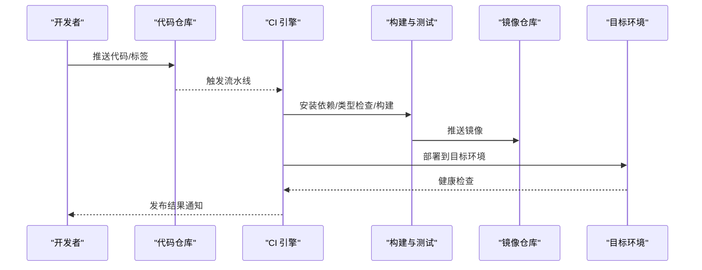

图表来源
- [package.json:39-44](file://app/web/package.json#L39-L44)
- [项目配置 project.yaml:1-30](file://project.yaml#L1-L30)

### 性能监控、缓存策略与版本管理
- 性能监控：在应用中集成前端性能指标采集（如 FCP/LCP/TBT 等），结合埋点平台进行趋势分析。
- 缓存策略：静态资源使用强缓存（长 TTL），HTML 使用协商缓存；通过 CDN 缓存头与 ETag/Last-Modified 实现高效缓存。
- 版本管理：构建时注入构建时间与版本号，产物命名带哈希，便于回溯与灰度发布。

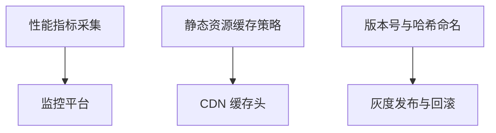

图表来源
- [vite.config.ts:31-33](file://app/web/vite.config.ts#L31-L33)
- [package.json](file://app/web/package.json#L3)

### 安全配置与监控告警
- 安全头：在 Nginx 中配置 CSP、HSTS、X-Frame-Options 等安全头，限制脚本来源与点击劫持。
- 密钥与敏感信息：仅通过环境变量注入，不在客户端代码中硬编码；生产环境禁用 SourceMap。
- 监控告警：对 5xx 错误率、响应时间、缓存命中率与健康检查失败进行告警。

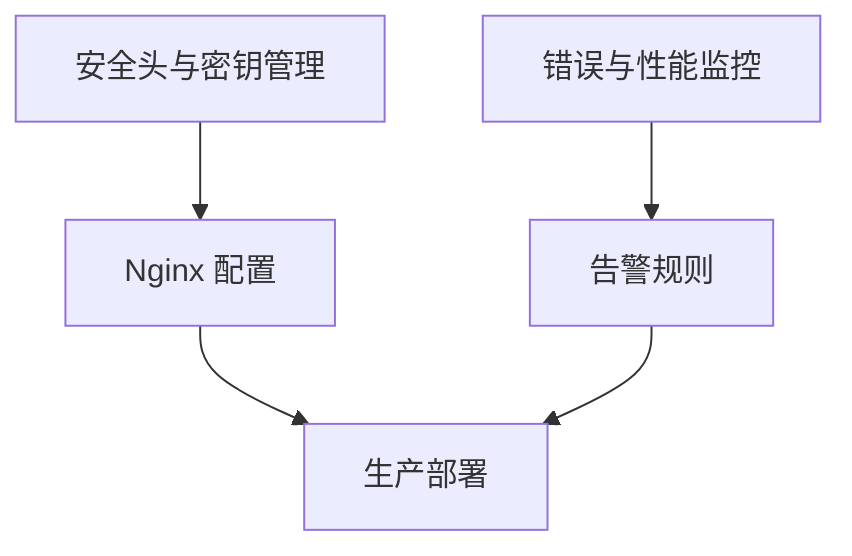

图表来源
- [.env:46-60](file://app/web/.env#L46-L60)
- [vite.config.ts](file://app/web/vite.config.ts#L45)

## 依赖关系分析
- 构建入口：vite.config.ts 作为唯一入口，加载环境变量、装配插件、设置 define 与服务器/构建参数。
- 运行时依赖：package.json 中的 dependencies 与 devDependencies 明确了框架、UI、工具链与构建插件的版本范围。
- 类型与路径：tsconfig.json 的路径别名与严格类型选项保证了开发期的类型安全与导入一致性。

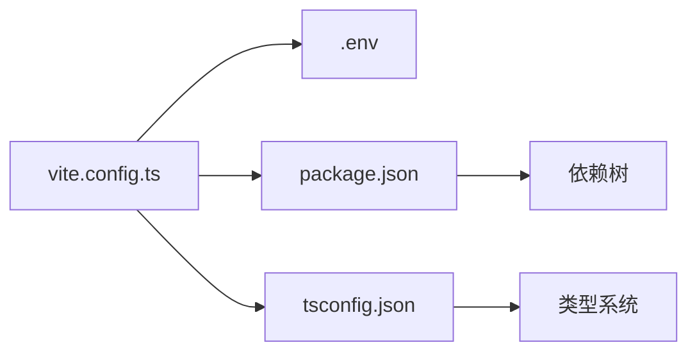

图表来源
- [vite.config.ts:1-52](file://app/web/vite.config.ts#L1-L52)
- [package.json:46-96](file://app/web/package.json#L46-L96)
- [tsconfig.json:1-26](file://app/web/tsconfig.json#L1-L26)

章节来源
- [vite.config.ts:1-52](file://app/web/vite.config.ts#L1-L52)
- [package.json:46-96](file://app/web/package.json#L46-L96)
- [tsconfig.json:1-26](file://app/web/tsconfig.json#L1-L26)

## 性能考量
- 构建体积：关闭默认压缩体积报告，建议在 CI 中引入体积分析与阈值告警。
- 资源加载：启用 CDN 与静态资源强缓存，减少首屏加载时间。
- 运行时性能：避免在 define 中注入过大对象；合理拆分第三方库，结合动态导入与懒加载。
- SourceMap：生产环境谨慎开启，平衡调试能力与安全风险。

章节来源
- [vite.config.ts:43-49](file://app/web/vite.config.ts#L43-L49)
- [.env:46-47](file://app/web/.env#L46-L47)

## 故障排查指南
- 代理问题：确认 .env 中的代理开关与代理日志开关，检查代理规则与后端接口可达性。
- 路由模式：若使用 history 模式，需确保服务器正确回退到 index.html，避免刷新 404。
- 资源 404：核对 VITE_BASE_URL 与实际部署路径一致，检查静态资源是否随产物一起上传。
- 构建失败：优先查看构建日志中的类型检查与 ESLint 报错，修复后再继续流水线。

章节来源
- [.env:25-60](file://app/web/.env#L25-L60)
- [vite.config.ts:34-42](file://app/web/vite.config.ts#L34-L42)

## 结论
本指南基于现有配置文件，梳理了前端构建与部署的关键环节：从 Vite 配置优化、环境变量管理，到打包策略、CDN 分发、Docker 容器化与 CI/CD 自动化部署。建议在现有基础上补充 CI 中的体积分析、安全扫描与灰度发布机制，并完善 Nginx 的缓存与安全头配置，以达到生产级的稳定性与可观测性。

## 附录
- 常用脚本参考
  - 开发：[package.json](file://app/web/package.json#L35)
  - 预览：[package.json](file://app/web/package.json#L41)
  - 构建（生产）：[package.json](file://app/web/package.json#L30)
  - 构建（测试）：[package.json](file://app/web/package.json#L31)
- 关键配置参考
  - 基础路径与别名：[vite.config.ts:15-21](file://app/web/vite.config.ts#L15-L21)
  - CSS 预处理与全局注入：[vite.config.ts:22-29](file://app/web/vite.config.ts#L22-L29)
  - 插件与 define 注入：[vite.config.ts:30-33](file://app/web/vite.config.ts#L30-L33)
  - 服务器与预览端口：[vite.config.ts:34-42](file://app/web/vite.config.ts#L34-L42)
  - 构建参数：[vite.config.ts:43-49](file://app/web/vite.config.ts#L43-L49)
  - 环境变量示例：[.env:1-61](file://app/web/.env#L1-L61)
  - 类型与路径别名：[tsconfig.json:9-12](file://app/web/tsconfig.json#L9-L12)
  - 项目配置与多架构：[项目配置 project.yaml:4-11](file://project.yaml#L4-L11)