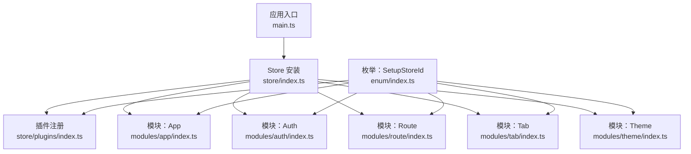
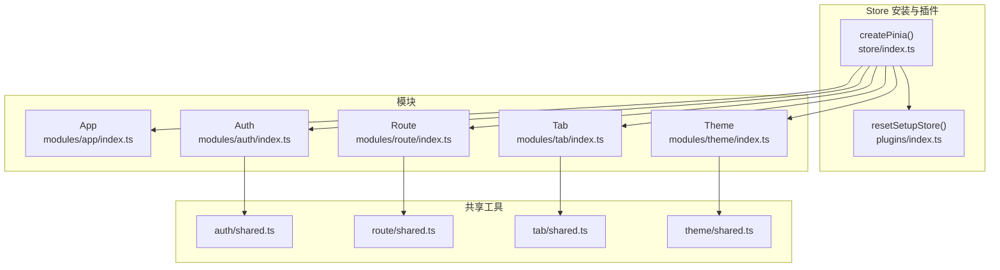
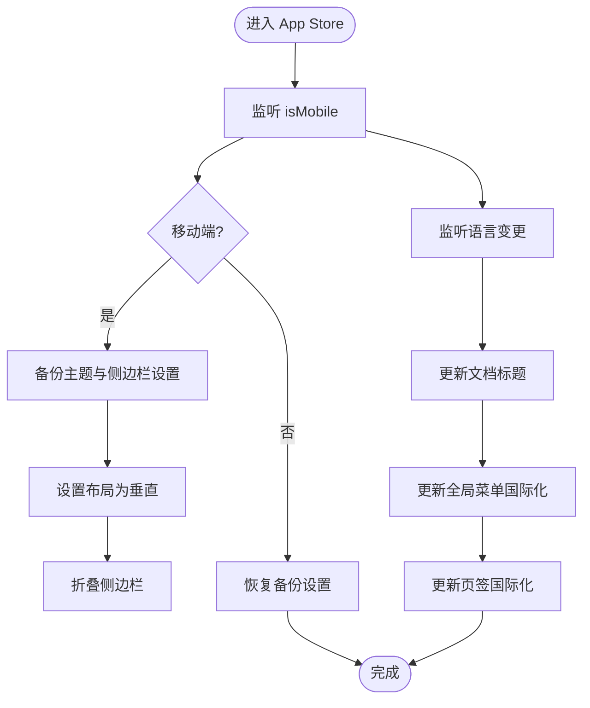
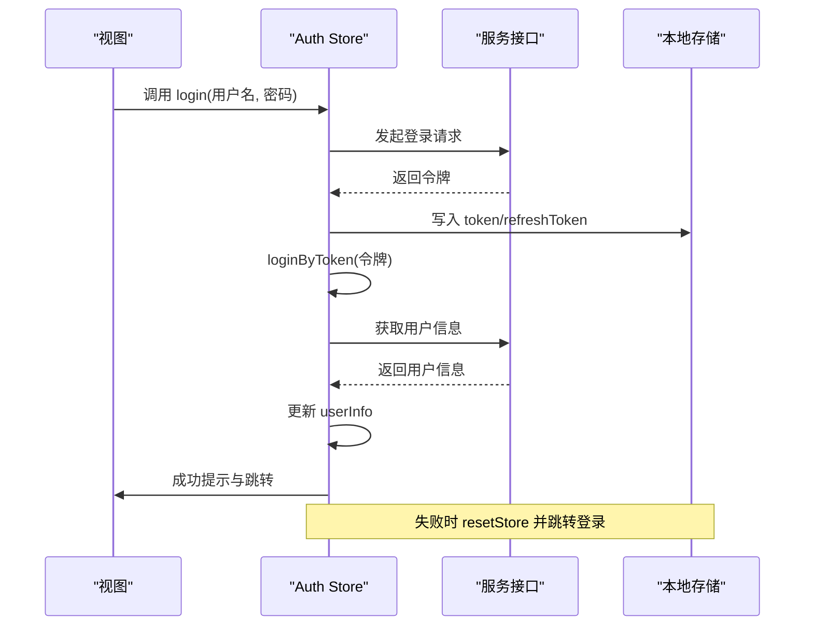
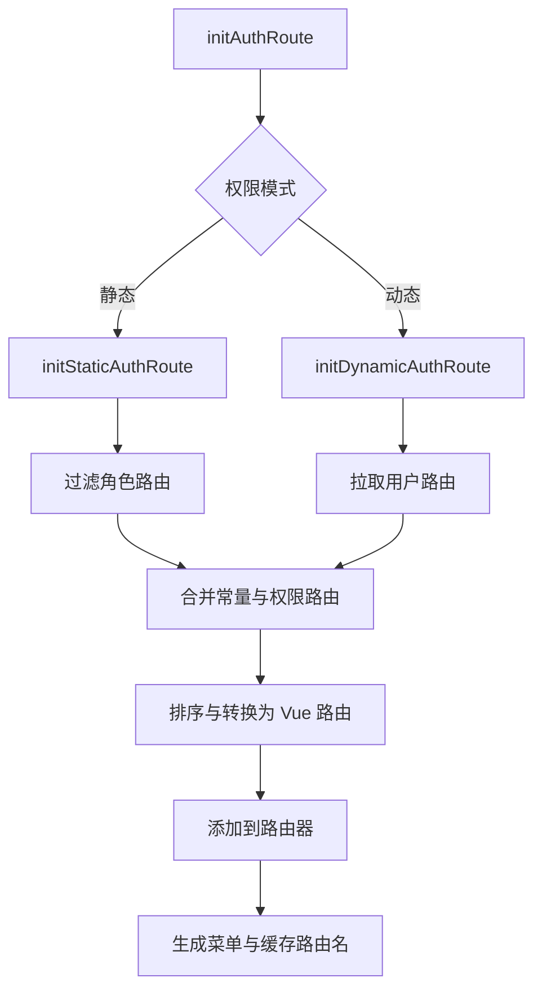
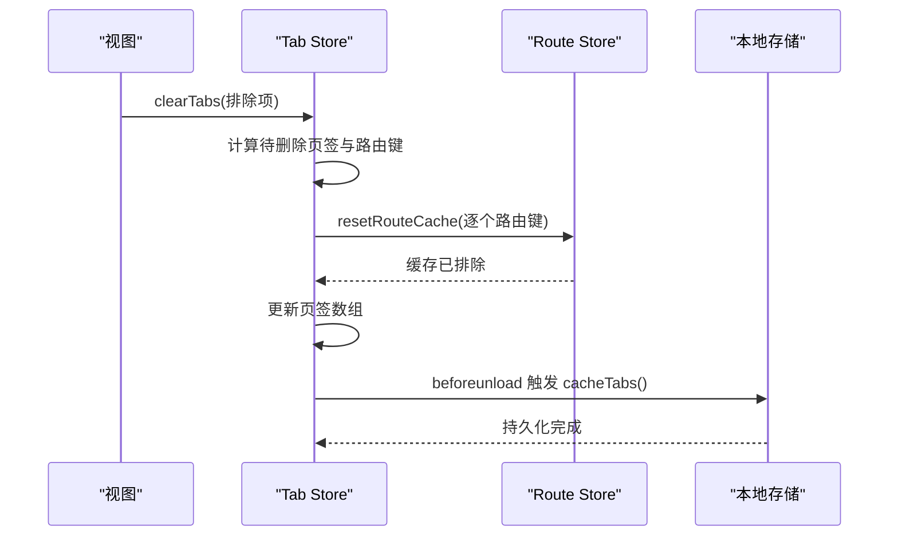
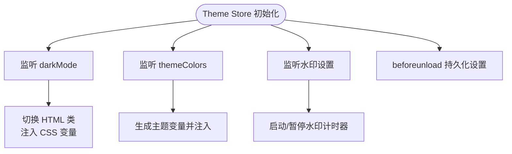
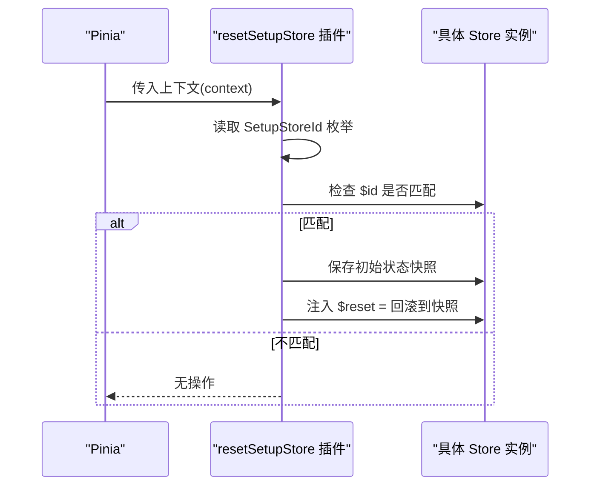
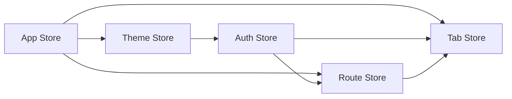

# 状态管理

<cite>
**本文引用的文件**
- [store/index.ts](file://app/web/src/store/index.ts)
- [store/plugins/index.ts](file://app/web/src/store/plugins/index.ts)
- [store/modules/app/index.ts](file://app/web/src/store/modules/app/index.ts)
- [store/modules/auth/index.ts](file://app/web/src/store/modules/auth/index.ts)
- [store/modules/route/index.ts](file://app/web/src/store/modules/route/index.ts)
- [store/modules/tab/index.ts](file://app/web/src/store/modules/tab/index.ts)
- [store/modules/theme/index.ts](file://app/web/src/store/modules/theme/index.ts)
- [enum/index.ts](file://app/web/src/enum/index.ts)
- [store/modules/auth/shared.ts](file://app/web/src/store/modules/auth/shared.ts)
- [store/modules/route/shared.ts](file://app/web/src/store/modules/route/shared.ts)
- [store/modules/tab/shared.ts](file://app/web/src/store/modules/tab/shared.ts)
- [store/modules/theme/shared.ts](file://app/web/src/store/modules/theme/shared.ts)
</cite>

## 目录
1. [引言](#引言)
2. [项目结构](#项目结构)
3. [核心组件](#核心组件)
4. [架构总览](#架构总览)
5. [详细组件分析](#详细组件分析)
6. [依赖关系分析](#依赖关系分析)
7. [性能考量](#性能考量)
8. [故障排查指南](#故障排查指南)
9. [结论](#结论)
10. [附录](#附录)

## 引言
本文件系统性梳理本项目的 Pinia 状态管理方案，围绕 Store 模块化设计、状态定义、Action 处理与 Getter 计算属性展开；同时覆盖模块间数据共享、持久化存储、插件机制、状态同步策略、异步操作与错误状态管理、调试与性能监控、以及复杂业务场景下的状态管理实践路径。目标是帮助开发者快速理解并高效扩展状态层。

## 项目结构
本项目采用“按功能域划分”的模块化组织方式，Store 层位于 app/web/src/store 下，每个功能域一个模块（如 app、auth、route、tab、theme），并通过统一入口进行安装与初始化。插件集中于 plugins 目录，枚举统一定义 Store 的标识符，便于统一管理与重置。

图表来源
- [store/index.ts:1-13](file://app/web/src/store/index.ts#L1-L13)
- [store/plugins/index.ts:1-23](file://app/web/src/store/plugins/index.ts#L1-L23)
- [store/modules/app/index.ts:1-167](file://app/web/src/store/modules/app/index.ts#L1-L167)
- [store/modules/auth/index.ts:1-185](file://app/web/src/store/modules/auth/index.ts#L1-L185)
- [store/modules/route/index.ts:1-387](file://app/web/src/store/modules/route/index.ts#L1-L387)
- [store/modules/tab/index.ts:1-386](file://app/web/src/store/modules/tab/index.ts#L1-L386)
- [store/modules/theme/index.ts:1-303](file://app/web/src/store/modules/theme/index.ts#L1-L303)
- [enum/index.ts:1-8](file://app/web/src/enum/index.ts#L1-L8)

章节来源
- [store/index.ts:1-13](file://app/web/src/store/index.ts#L1-L13)
- [enum/index.ts:1-8](file://app/web/src/enum/index.ts#L1-L8)

## 核心组件
- Store 安装与插件
  - 在应用启动时创建并安装 Pinia，并注册自定义插件以支持“setup 语法”风格 Store 的状态重置能力。
  - 插件通过遍历 SetupStoreId 枚举，对匹配的 Store 注入 $reset 能力，实现按需重置。
- 枚举与标识
  - SetupStoreId 统一声明各模块的 Store 标识，确保插件识别与后续扩展的一致性。
- 模块职责
  - App：布局、国际化、标题、移动端适配、主题抽屉等全局行为协调。
  - Auth：登录、令牌与用户信息管理、登出与重置流程、跨会话用户切换处理。
  - Route：常量路由与权限路由的加载、菜单生成、面包屑、缓存路由名、根路由重定向更新。
  - Tab：多页签生命周期、固定/移动、标签国际化、缓存与恢复、路由切换与缓存失效。
  - Theme：主题方案、颜色体系、水印、NaiveUI 主题覆盖、CSS 变量注入、暗色模式与辅助视觉模式。

章节来源
- [store/index.ts:1-13](file://app/web/src/store/index.ts#L1-L13)
- [store/plugins/index.ts:1-23](file://app/web/src/store/plugins/index.ts#L1-L23)
- [enum/index.ts:1-8](file://app/web/src/enum/index.ts#L1-L8)
- [store/modules/app/index.ts:1-167](file://app/web/src/store/modules/app/index.ts#L1-L167)
- [store/modules/auth/index.ts:1-185](file://app/web/src/store/modules/auth/index.ts#L1-L185)
- [store/modules/route/index.ts:1-387](file://app/web/src/store/modules/route/index.ts#L1-L387)
- [store/modules/tab/index.ts:1-386](file://app/web/src/store/modules/tab/index.ts#L1-L386)
- [store/modules/theme/index.ts:1-303](file://app/web/src/store/modules/theme/index.ts#L1-L303)

## 架构总览
Pinia Store 采用“模块化 + 插件化”的架构：
- 模块间通过 defineStore 返回的响应式状态与方法协作，避免直接耦合。
- 插件统一处理重置逻辑，减少重复代码。
- 共享工具函数集中在各模块的 shared 文件中，保证算法复用与边界清晰。

图表来源
- [store/index.ts:1-13](file://app/web/src/store/index.ts#L1-L13)
- [store/plugins/index.ts:1-23](file://app/web/src/store/plugins/index.ts#L1-L23)
- [store/modules/app/index.ts:1-167](file://app/web/src/store/modules/app/index.ts#L1-L167)
- [store/modules/auth/index.ts:1-185](file://app/web/src/store/modules/auth/index.ts#L1-L185)
- [store/modules/route/index.ts:1-387](file://app/web/src/store/modules/route/index.ts#L1-L387)
- [store/modules/tab/index.ts:1-386](file://app/web/src/store/modules/tab/index.ts#L1-L386)
- [store/modules/theme/index.ts:1-303](file://app/web/src/store/modules/theme/index.ts#L1-L303)
- [store/modules/auth/shared.ts:1-13](file://app/web/src/store/modules/auth/shared.ts#L1-L13)
- [store/modules/route/shared.ts:1-336](file://app/web/src/store/modules/route/shared.ts#L1-L336)
- [store/modules/tab/shared.ts:1-264](file://app/web/src/store/modules/tab/shared.ts#L1-L264)
- [store/modules/theme/shared.ts:1-267](file://app/web/src/store/modules/theme/shared.ts#L1-L267)

## 详细组件分析

### App Store（全局应用状态）
- 状态定义
  - 响应式布尔开关：主题抽屉可见、页面全屏、内容横向滚动、侧边栏折叠、混合布局侧边栏固定等。
  - 响应式字符串：当前语言、断点判断（移动端）。
  - 嵌套 Store 依赖：Theme、Route、Tab。
- Action
  - reloadPage：触发页面重载动画与路由缓存重置。
  - changeLocale：切换语言并持久化到本地存储。
  - 主题抽屉控制、内容区域控制、侧边栏折叠控制、混合布局固定控制。
- Getter
  - isMobile：基于断点判断是否移动端布局。
- 生命周期与副作用
  - 监听 isMobile 自动备份/恢复主题设置。
  - 监听语言变化更新标题、菜单与页签国际化。
  - 页面卸载时持久化混合布局固定状态。

图表来源
- [store/modules/app/index.ts:80-130](file://app/web/src/store/modules/app/index.ts#L80-L130)

章节来源
- [store/modules/app/index.ts:1-167](file://app/web/src/store/modules/app/index.ts#L1-L167)

### Auth Store（认证与用户信息）
- 状态定义
  - token：当前访问令牌。
  - userInfo：用户信息对象（响应式）。
- Computed
  - isStaticSuper：静态路由模式下超级角色判定。
  - isLogin：基于 token 是否存在判断登录态。
- Action
  - login：发起登录请求，成功后写入本地存储、拉取用户信息、处理标签清理与跳转。
  - loginByToken：写入令牌并获取用户信息。
  - getUserInfo：调用服务接口获取用户详情。
  - initUserInfo：应用初始化时尝试恢复登录态。
  - resetStore：清理存储、重置自身状态、跳转登录、缓存页签并重置路由状态。
  - checkTabClear：对比上次登录用户 ID，必要时清空页签并移除记录。
- 错误与回退
  - 登录失败或用户信息拉取失败时重置认证状态并跳转登录。

图表来源
- [store/modules/auth/index.ts:99-129](file://app/web/src/store/modules/auth/index.ts#L99-L129)
- [store/modules/auth/index.ts:131-159](file://app/web/src/store/modules/auth/index.ts#L131-L159)
- [store/modules/auth/shared.ts:1-13](file://app/web/src/store/modules/auth/shared.ts#L1-L13)

章节来源
- [store/modules/auth/index.ts:1-185](file://app/web/src/store/modules/auth/index.ts#L1-L185)
- [store/modules/auth/shared.ts:1-13](file://app/web/src/store/modules/auth/shared.ts#L1-L13)

### Route Store（路由与菜单）
- 状态定义
  - authRouteMode：路由权限模式（静态/动态）。
  - routeHome：首页路由键。
  - constantRoutes/authRoutes/backendMenuRoutes：三类路由集合。
  - menus/searchMenus：全局菜单与搜索菜单。
  - cacheRoutes/excludeCacheRoutes：缓存路由集合与排除集合。
  - breadcrumbs：当前路由对应的面包屑。
- Action
  - initConstantRoute：初始化常量路由（静态或后端）。
  - initAuthRoute：根据权限模式初始化权限路由（静态过滤或后端拉取）。
  - handleConstantAndAuthRoutes：合并排序、转换为 Vue 路由、添加到路由器、生成菜单与缓存列表。
  - resetStore/resetVueRoutes：重置路由状态并重建。
  - resetRouteCache：通过 nextTick 排除当前路由缓存并恢复。
  - getIsAuthRouteExist：校验路由是否存在（静态或后端）。
  - getSelectedMenuKeyPath/updateGlobalMenusByLocale：菜单路径与国际化更新。
  - handleUpdateRootRouteRedirect：动态模式下更新根路由重定向。
- 共享工具
  - 过滤角色路由、排序、生成菜单、生成面包屑、生成搜索菜单、查找路由名存在性等。

图表来源
- [store/modules/route/index.ts:206-285](file://app/web/src/store/modules/route/index.ts#L206-L285)
- [store/modules/route/shared.ts:12-43](file://app/web/src/store/modules/route/shared.ts#L12-L43)
- [store/modules/route/shared.ts:64-69](file://app/web/src/store/modules/route/shared.ts#L64-L69)

章节来源
- [store/modules/route/index.ts:1-387](file://app/web/src/store/modules/route/index.ts#L1-L387)
- [store/modules/route/shared.ts:1-336](file://app/web/src/store/modules/route/shared.ts#L1-L336)

### Tab Store（页签管理）
- 状态定义
  - tabs：页签数组。
  - homeTab：首页页签。
  - activeTabId：当前激活页签。
- Action
  - initTabStore：从本地存储恢复页签并初始化。
  - addTab/removeTab/removeActiveTab/removeTabByRouteName/clearTabs/clearLeftTabs/clearRightTabs：增删改查与批量清理。
  - replaceTab：替换当前页签并可选择保留旧页签。
  - switchRouteByTab：切换路由并更新激活页签。
  - fixTab/unfixTab：固定/取消固定页签并重排。
  - setTabLabel/resetTabLabel：修改页签标签并回滚。
  - isTabRetain：判断页签是否保留（首页或固定）。
  - updateTabsByLocale：国际化更新。
  - cacheTabs：页面关闭前持久化页签。
- 与 Route 的交互
  - 清理页签时调用 routeStore.resetRouteCache，确保缓存一致性。

图表来源
- [store/modules/tab/index.ts:142-185](file://app/web/src/store/modules/tab/index.ts#L142-L185)
- [store/modules/tab/index.ts:355-358](file://app/web/src/store/modules/tab/index.ts#L355-L358)

章节来源
- [store/modules/tab/index.ts:1-386](file://app/web/src/store/modules/tab/index.ts#L1-L386)
- [store/modules/tab/shared.ts:1-264](file://app/web/src/store/modules/tab/shared.ts#L1-L264)

### Theme Store（主题与样式）
- 状态定义
  - settings：主题设置（含颜色、圆角、水印、布局等）。
  - naiveThemeOverrides：NaiveUI 主题覆盖。
  - watermarkTime：水印时间实例。
- Computed
  - darkMode/grayscaleMode/colourWeaknessMode：主题方案与辅助视觉模式。
  - themeColors：主题色映射。
  - naiveTheme：基于主题色与设置生成的 NaiveUI 主题。
  - settingsJson/watermarkContent：设置 JSON 与水印内容。
- Action
  - setThemeScheme/toggleThemeScheme：切换主题方案。
  - setGrayscale/setColourWeakness：启用辅助视觉模式。
  - updateThemeColors：更新主题色（支持推荐色板）。
  - setThemeLayout：设置布局模式。
  - setWatermarkEnableUserName/setWatermarkEnableTime：水印显示策略。
  - setNaiveThemeOverrides：设置 NaiveUI 主题覆盖。
  - resetStore：重置主题状态。
- 副作用
  - 监听 darkMode 切换 CSS 类；监听主题色变化注入 CSS 变量；监听水印设置控制计时器。

图表来源
- [store/modules/theme/index.ts:240-282](file://app/web/src/store/modules/theme/index.ts#L240-L282)
- [store/modules/theme/shared.ts:107-168](file://app/web/src/store/modules/theme/shared.ts#L107-L168)

章节来源
- [store/modules/theme/index.ts:1-303](file://app/web/src/store/modules/theme/index.ts#L1-L303)
- [store/modules/theme/shared.ts:1-267](file://app/web/src/store/modules/theme/shared.ts#L1-L267)

### 插件与重置机制
- resetSetupStore 插件
  - 通过 SetupStoreId 枚举识别 setup 语法的 Store。
  - 对匹配的 Store 注入 $reset 方法，基于初始状态快照进行重置。
- 枚举统一管理
  - 所有模块的 $id 由 SetupStoreId 提供，确保插件识别与扩展一致性。

图表来源
- [store/plugins/index.ts:10-22](file://app/web/src/store/plugins/index.ts#L10-L22)
- [enum/index.ts:1-8](file://app/web/src/enum/index.ts#L1-L8)

章节来源
- [store/plugins/index.ts:1-23](file://app/web/src/store/plugins/index.ts#L1-L23)
- [enum/index.ts:1-8](file://app/web/src/enum/index.ts#L1-L8)

## 依赖关系分析
- 模块内聚与耦合
  - App 依赖 Theme/Route/Tab 协调全局行为，但不直接依赖 Auth，避免循环依赖。
  - Auth 依赖 Route/Tab 以在登录后联动路由与页签。
  - Route 依赖 Auth 以获取用户角色并过滤权限路由。
  - Tab 依赖 Route 以在页签清理时重置对应路由缓存。
  - Theme 依赖 Auth 以在水印中展示用户名。
- 外部依赖
  - VueUse 提供响应式与事件监听能力。
  - NaiveUI 主题覆盖与样式注入。
  - 本地存储封装用于持久化。

图表来源
- [store/modules/app/index.ts:14-17](file://app/web/src/store/modules/app/index.ts#L14-L17)
- [store/modules/auth/index.ts:16-18](file://app/web/src/store/modules/auth/index.ts#L16-L18)
- [store/modules/route/index.ts:27-28](file://app/web/src/store/modules/route/index.ts#L27-L28)
- [store/modules/tab/index.ts:26-28](file://app/web/src/store/modules/tab/index.ts#L26-L28)
- [store/modules/theme/index.ts:22](file://app/web/src/store/modules/theme/index.ts#L22)

章节来源
- [store/modules/app/index.ts:14-17](file://app/web/src/store/modules/app/index.ts#L14-L17)
- [store/modules/auth/index.ts:16-18](file://app/web/src/store/modules/auth/index.ts#L16-L18)
- [store/modules/route/index.ts:27-28](file://app/web/src/store/modules/route/index.ts#L27-L28)
- [store/modules/tab/index.ts:26-28](file://app/web/src/store/modules/tab/index.ts#L26-L28)
- [store/modules/theme/index.ts:22](file://app/web/src/store/modules/theme/index.ts#L22)

## 性能考量
- 响应式粒度
  - 将大对象拆分为多个 ref/computed，降低无关依赖导致的重渲染。
- 路由缓存与失效
  - 通过 cacheRoutes/excludeCacheRoutes 精准控制缓存失效范围，避免全量刷新。
- 事件与副作用
  - 使用 nextTick 与 effectScope 管理副作用生命周期，避免内存泄漏。
- 主题与样式
  - CSS 变量注入仅在主题色或设置变化时执行，减少 DOM 操作。
- 本地存储
  - 在 beforeunload 时批量持久化，避免频繁 IO。

## 故障排查指南
- 登录后无法进入首页或菜单异常
  - 检查 Route.initConstantRoute 与 initAuthRoute 的调用顺序与返回值。
  - 确认 authRouteMode 与后端返回的首页键一致。
- 页签清理后路由未刷新
  - 确认 Tab.clearTabs 是否调用了 routeStore.resetRouteCache。
- 主题切换无效
  - 检查 Theme.darkMode 监听与 CSS 类切换逻辑。
  - 确认 CSS 变量注入是否成功。
- 语言切换未生效
  - 检查 App.changeLocale 是否正确更新国际化并调用菜单/页签国际化更新。
- 令牌过期或跨会话用户切换
  - 检查 Auth.checkTabClear 与 resetStore 的调用链路。

章节来源
- [store/modules/route/index.ts:180-220](file://app/web/src/store/modules/route/index.ts#L180-L220)
- [store/modules/tab/index.ts:142-185](file://app/web/src/store/modules/tab/index.ts#L142-L185)
- [store/modules/theme/index.ts:240-282](file://app/web/src/store/modules/theme/index.ts#L240-L282)
- [store/modules/app/index.ts:116-130](file://app/web/src/store/modules/app/index.ts#L116-L130)
- [store/modules/auth/index.ts:57-90](file://app/web/src/store/modules/auth/index.ts#L57-L90)

## 结论
本项目通过模块化 Store、统一插件与共享工具函数，构建了高内聚、低耦合的状态管理体系。配合完善的持久化、路由与页签联动、主题与国际化支持，能够满足复杂业务场景下的状态管理需求。建议在扩展新模块时遵循现有模式：明确状态与 Action 边界、优先使用共享工具函数、严格控制副作用与缓存策略。

## 附录
- 状态调试建议
  - 使用浏览器开发工具观察 Store 状态变化与依赖链。
  - 在关键 Action 入口打印日志或使用性能分析工具定位瓶颈。
- 性能监控
  - 监控路由缓存命中率与页签数量，避免过度缓存导致内存压力。
  - 关注主题色变更频率，减少不必要的 CSS 注入。
- 数据流追踪
  - 以路由切换为主线，串联 Route/Tab/Auth/App 的状态流转，绘制时序图辅助定位问题。