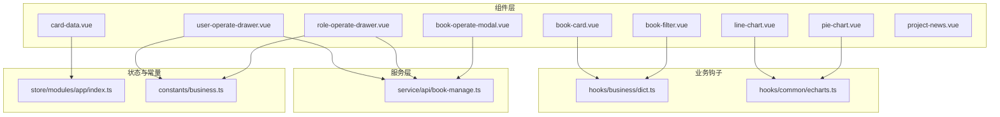
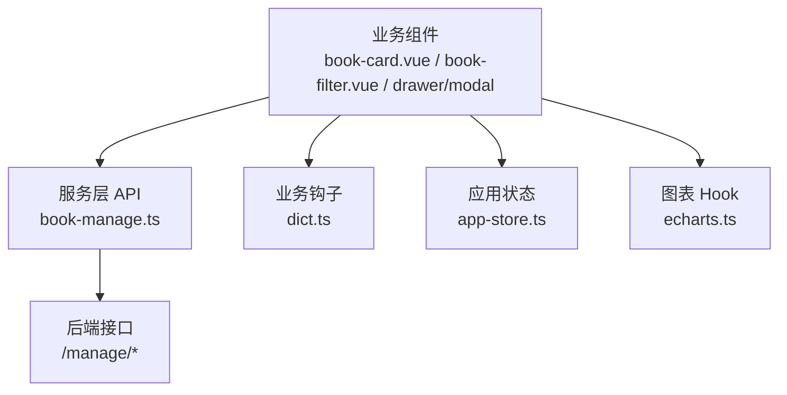
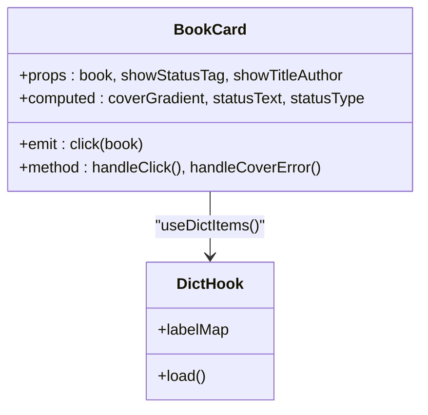
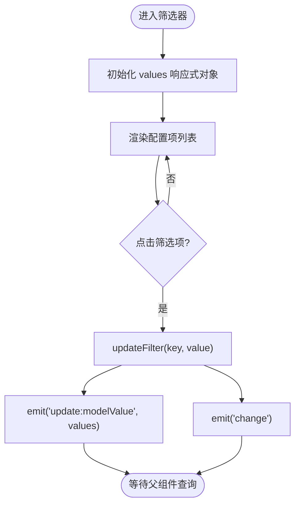
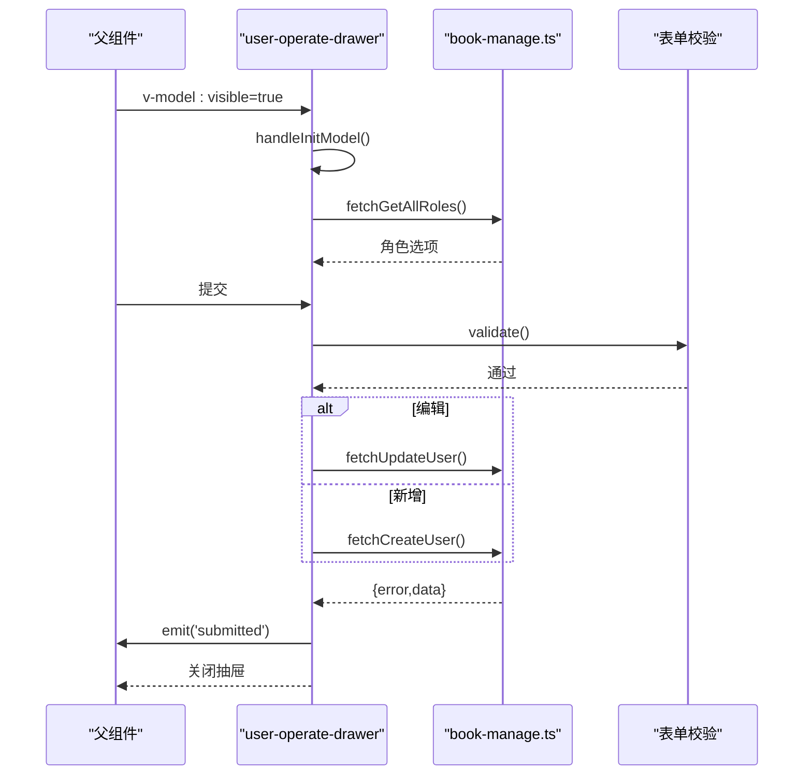
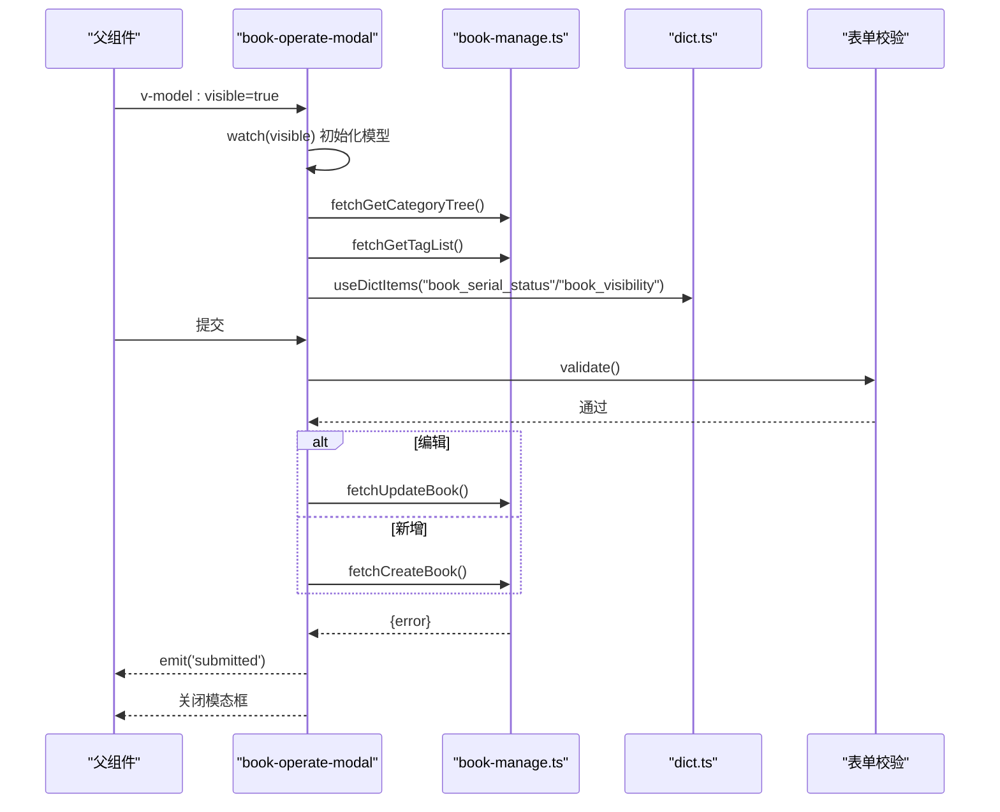
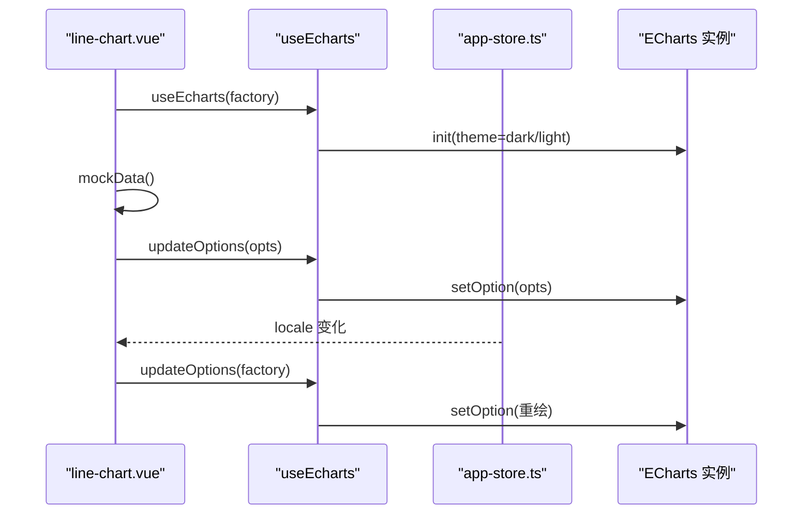
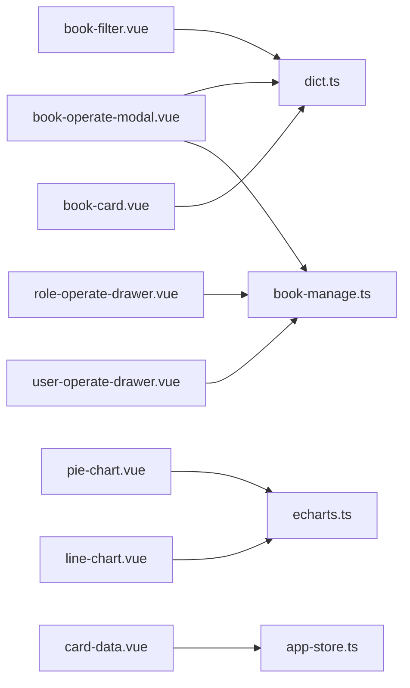

# 业务组件

<cite>
**本文引用的文件**
- [book-card.vue](file://app/web/src/components/book-card.vue)
- [book-filter.vue](file://app/web/src/components/book-filter.vue)
- [dict.ts](file://app/web/src/hooks/business/dict.ts)
- [book-manage.ts](file://app/web/src/service/api/book-manage.ts)
- [business.ts](file://app/web/src/constants/business.ts)
- [card-data.vue](file://app/web/src/views/admin/dashboard/modules/card-data.vue)
- [line-chart.vue](file://app/web/src/views/admin/dashboard/modules/line-chart.vue)
- [pie-chart.vue](file://app/web/src/views/admin/dashboard/modules/pie-chart.vue)
- [project-news.vue](file://app/web/src/views/admin/dashboard/modules/project-news.vue)
- [echarts.ts](file://app/web/src/hooks/common/echarts.ts)
- [app-store.ts](file://app/web/src/store/modules/app/index.ts)
- [user-operate-drawer.vue](file://app/web/src/views/admin/system/user/modules/user-operate-drawer.vue)
- [role-operate-drawer.vue](file://app/web/src/views/admin/system/role/modules/role-operate-drawer.vue)
- [book-operate-modal.vue](file://app/web/src/views/admin/library/book/modules/book-operate-modal.vue)
</cite>

## 目录
1. [简介](#简介)
2. [项目结构](#项目结构)
3. [核心组件](#核心组件)
4. [架构总览](#架构总览)
5. [详细组件分析](#详细组件分析)
6. [依赖关系分析](#依赖关系分析)
7. [性能考量](#性能考量)
8. [故障排查指南](#故障排查指南)
9. [结论](#结论)
10. [附录](#附录)

## 简介
本指南面向业务组件开发者，围绕“图书卡片”“图书筛选器”“系统管理抽屉/模态框”“仪表板数据卡/图表/新闻”等核心模块，系统讲解设计模式、状态管理、数据绑定、事件处理、与API服务的集成、错误处理策略以及性能优化技巧，并总结可复用的设计原则与完整开发流程。

## 项目结构
前端采用 Vue 3 + Naive UI + ECharts 的组合，组件按功能域划分在 src/components、views 下，服务层通过统一的 API 模块封装请求方法，状态通过 Pinia Store 管理，图表通过自定义 Hook 集成 ECharts。

图示来源
- [book-card.vue:1-122](file://app/web/src/components/book-card.vue#L1-L122)
- [book-filter.vue:1-139](file://app/web/src/components/book-filter.vue#L1-L139)
- [dict.ts:1-41](file://app/web/src/hooks/business/dict.ts#L1-L41)
- [book-manage.ts:1-380](file://app/web/src/service/api/book-manage.ts#L1-L380)
- [business.ts:1-56](file://app/web/src/constants/business.ts#L1-L56)
- [card-data.vue:1-116](file://app/web/src/views/admin/dashboard/modules/card-data.vue#L1-L116)
- [line-chart.vue:1-153](file://app/web/src/views/admin/dashboard/modules/line-chart.vue#L1-L153)
- [pie-chart.vue:1-110](file://app/web/src/views/admin/dashboard/modules/pie-chart.vue#L1-L110)
- [project-news.vue:1-41](file://app/web/src/views/admin/dashboard/modules/project-news.vue#L1-L41)
- [echarts.ts:1-231](file://app/web/src/hooks/common/echarts.ts#L1-L231)
- [app-store.ts:1-167](file://app/web/src/store/modules/app/index.ts#L1-L167)

章节来源
- [book-card.vue:1-122](file://app/web/src/components/book-card.vue#L1-L122)
- [book-filter.vue:1-139](file://app/web/src/components/book-filter.vue#L1-L139)
- [dict.ts:1-41](file://app/web/src/hooks/business/dict.ts#L1-L41)
- [book-manage.ts:1-380](file://app/web/src/service/api/book-manage.ts#L1-L380)
- [business.ts:1-56](file://app/web/src/constants/business.ts#L1-L56)
- [card-data.vue:1-116](file://app/web/src/views/admin/dashboard/modules/card-data.vue#L1-L116)
- [line-chart.vue:1-153](file://app/web/src/views/admin/dashboard/modules/line-chart.vue#L1-L153)
- [pie-chart.vue:1-110](file://app/web/src/views/admin/dashboard/modules/pie-chart.vue#L1-L110)
- [project-news.vue:1-41](file://app/web/src/views/admin/dashboard/modules/project-news.vue#L1-L41)
- [echarts.ts:1-231](file://app/web/src/hooks/common/echarts.ts#L1-L231)
- [app-store.ts:1-167](file://app/web/src/store/modules/app/index.ts#L1-L167)

## 核心组件
- 图书卡片组件：负责展示书籍封面、标题、作者、连载状态标签；支持占位渐变背景与懒加载错误回退；通过事件向外抛出点击行为。
- 图书筛选器组件：以配置驱动的方式渲染分类、状态、字数、标签、更新时间等筛选项，内部维护双向绑定的筛选值，向外发出变更事件。
- 系统管理抽屉/模态框：用户与角色操作抽屉，图书编辑模态框，均采用表单校验、远程选项加载、提交后反馈与刷新。
- 仪表板模块：卡片数据、折线图、饼图、项目动态，图表通过 Hook 自动适配主题与尺寸变化。

章节来源
- [book-card.vue:1-122](file://app/web/src/components/book-card.vue#L1-L122)
- [book-filter.vue:1-139](file://app/web/src/components/book-filter.vue#L1-L139)
- [user-operate-drawer.vue:1-174](file://app/web/src/views/admin/system/user/modules/user-operate-drawer.vue#L1-L174)
- [role-operate-drawer.vue:1-134](file://app/web/src/views/admin/system/role/modules/role-operate-drawer.vue#L1-L134)
- [book-operate-modal.vue:1-290](file://app/web/src/views/admin/library/book/modules/book-operate-modal.vue#L1-L290)
- [card-data.vue:1-116](file://app/web/src/views/admin/dashboard/modules/card-data.vue#L1-L116)
- [line-chart.vue:1-153](file://app/web/src/views/admin/dashboard/modules/line-chart.vue#L1-L153)
- [pie-chart.vue:1-110](file://app/web/src/views/admin/dashboard/modules/pie-chart.vue#L1-L110)
- [project-news.vue:1-41](file://app/web/src/views/admin/dashboard/modules/project-news.vue#L1-L41)

## 架构总览
整体采用“组件-服务-状态-图表”的分层架构。组件负责视图与交互，服务层封装 API 请求，状态层集中管理应用级配置与国际化，图表通过 Hook 统一初始化、主题切换与尺寸适配。

图示来源
- [book-manage.ts:1-380](file://app/web/src/service/api/book-manage.ts#L1-L380)
- [dict.ts:1-41](file://app/web/src/hooks/business/dict.ts#L1-L41)
- [app-store.ts:1-167](file://app/web/src/store/modules/app/index.ts#L1-L167)
- [echarts.ts:1-231](file://app/web/src/hooks/common/echarts.ts#L1-L231)

## 详细组件分析

### 图书卡片组件（book-card）
- 设计要点
  - 展示书籍封面或占位渐变背景，支持懒加载与错误回退。
  - 可选显示状态标签与标题作者信息。
  - 使用计算属性根据书名哈希生成固定渐变背景，提升视觉一致性。
  - 通过字典钩子映射连载状态为可读文本与样式。
- 数据绑定与事件
  - 输入属性：书籍对象、是否显示状态标签、是否显示标题作者。
  - 输出事件：点击书籍时向外抛出书籍数据。
- 性能与可用性
  - 图片懒加载减少首屏压力；错误时切换到占位背景避免空白。
  - 渐变背景基于标题哈希，避免重复与抖动。

图示来源
- [book-card.vue:1-122](file://app/web/src/components/book-card.vue#L1-L122)
- [dict.ts:1-41](file://app/web/src/hooks/business/dict.ts#L1-L41)

章节来源
- [book-card.vue:1-122](file://app/web/src/components/book-card.vue#L1-L122)
- [dict.ts:1-41](file://app/web/src/hooks/business/dict.ts#L1-L41)

### 图书筛选器组件（book-filter）
- 设计要点
  - 以配置驱动渲染多个筛选维度，内部使用响应式对象维护筛选值。
  - 支持多选/单选按钮风格，高亮当前选中项。
  - 双向绑定 modelValue，同时发出 update 与 change 事件，便于父组件同步与触发查询。
- 数据绑定与事件
  - 输入：配置项与初始筛选值。
  - 输出：update:modelValue（用于 v-model），change（用于触发查询）。
- 复用性
  - 通过配置对象解耦筛选项，便于扩展新维度。

图示来源
- [book-filter.vue:1-139](file://app/web/src/components/book-filter.vue#L1-L139)

章节来源
- [book-filter.vue:1-139](file://app/web/src/components/book-filter.vue#L1-L139)

### 系统管理抽屉组件（用户/角色）
- 用户操作抽屉（user-operate-drawer）
  - 功能：新增/编辑用户，表单校验，加载角色选项，提交后关闭并通知父组件。
  - 错误处理：请求失败弹出错误消息，成功后提示并刷新。
  - 选项来源：常量中的性别、启用状态选项，远程获取角色列表。
- 角色操作抽屉（role-operate-drawer）
  - 功能：新增/编辑角色，表单校验，提交后关闭并通知父组件。
  - 选项来源：启用状态、数据范围选项。

图示来源
- [user-operate-drawer.vue:1-174](file://app/web/src/views/admin/system/user/modules/user-operate-drawer.vue#L1-L174)
- [book-manage.ts:1-380](file://app/web/src/service/api/book-manage.ts#L1-L380)

章节来源
- [user-operate-drawer.vue:1-174](file://app/web/src/views/admin/system/user/modules/user-operate-drawer.vue#L1-L174)
- [role-operate-drawer.vue:1-134](file://app/web/src/views/admin/system/role/modules/role-operate-drawer.vue#L1-L134)
- [business.ts:1-56](file://app/web/src/constants/business.ts#L1-L56)

### 图书操作模态框（book-operate-modal）
- 功能：新增/编辑图书，加载分类树与标签列表，表单校验，提交后反馈并刷新。
- 选项加载：异步加载分类树（含缩进层级）、标签列表，使用布尔开关控制加载态。
- 字典映射：使用字典钩子映射连载状态与可见性枚举为可读标签。

图示来源
- [book-operate-modal.vue:1-290](file://app/web/src/views/admin/library/book/modules/book-operate-modal.vue#L1-L290)
- [book-manage.ts:1-380](file://app/web/src/service/api/book-manage.ts#L1-L380)
- [dict.ts:1-41](file://app/web/src/hooks/business/dict.ts#L1-L41)

章节来源
- [book-operate-modal.vue:1-290](file://app/web/src/views/admin/library/book/modules/book-operate-modal.vue#L1-L290)
- [book-manage.ts:1-380](file://app/web/src/service/api/book-manage.ts#L1-L380)
- [dict.ts:1-41](file://app/web/src/hooks/business/dict.ts#L1-L41)

### 仪表板模块组件
- 卡片数据（card-data）
  - 定义卡片数据结构，使用可复用模板组件与主题色渐变背景，支持主题半径配置。
- 折线图（line-chart）
  - 通过图表 Hook 初始化 ECharts，设置主题、网格、图例、坐标轴与系列；监听语言变化更新图例名称；初始化时模拟数据。
- 饼图（pie-chart）
  - 设置环形饼图样式、强调标签、数据映射；监听语言变化更新标题与数据。
- 项目动态（project-news）
  - 固定新闻列表，支持国际化文案与头像组件。

图示来源
- [line-chart.vue:1-153](file://app/web/src/views/admin/dashboard/modules/line-chart.vue#L1-L153)
- [pie-chart.vue:1-110](file://app/web/src/views/admin/dashboard/modules/pie-chart.vue#L1-L110)
- [card-data.vue:1-116](file://app/web/src/views/admin/dashboard/modules/card-data.vue#L1-L116)
- [echarts.ts:1-231](file://app/web/src/hooks/common/echarts.ts#L1-L231)
- [app-store.ts:1-167](file://app/web/src/store/modules/app/index.ts#L1-L167)

章节来源
- [card-data.vue:1-116](file://app/web/src/views/admin/dashboard/modules/card-data.vue#L1-L116)
- [line-chart.vue:1-153](file://app/web/src/views/admin/dashboard/modules/line-chart.vue#L1-L153)
- [pie-chart.vue:1-110](file://app/web/src/views/admin/dashboard/modules/pie-chart.vue#L1-L110)
- [project-news.vue:1-41](file://app/web/src/views/admin/dashboard/modules/project-news.vue#L1-L41)
- [echarts.ts:1-231](file://app/web/src/hooks/common/echarts.ts#L1-L231)
- [app-store.ts:1-167](file://app/web/src/store/modules/app/index.ts#L1-L167)

## 依赖关系分析
- 组件对服务层的依赖：图书卡片与筛选器不直接请求后端；用户/角色/图书操作组件通过 API 模块发起请求。
- 组件对钩子的依赖：字典钩子提供枚举映射；图表 Hook 提供 ECharts 生命周期与主题适配。
- 组件对状态的依赖：仪表板组件读取应用语言与主题配置，影响图表与文案。

图示来源
- [book-card.vue:1-122](file://app/web/src/components/book-card.vue#L1-L122)
- [book-filter.vue:1-139](file://app/web/src/components/book-filter.vue#L1-L139)
- [dict.ts:1-41](file://app/web/src/hooks/business/dict.ts#L1-L41)
- [user-operate-drawer.vue:1-174](file://app/web/src/views/admin/system/user/modules/user-operate-drawer.vue#L1-L174)
- [role-operate-drawer.vue:1-134](file://app/web/src/views/admin/system/role/modules/role-operate-drawer.vue#L1-L134)
- [book-operate-modal.vue:1-290](file://app/web/src/views/admin/library/book/modules/book-operate-modal.vue#L1-L290)
- [book-manage.ts:1-380](file://app/web/src/service/api/book-manage.ts#L1-L380)
- [line-chart.vue:1-153](file://app/web/src/views/admin/dashboard/modules/line-chart.vue#L1-L153)
- [pie-chart.vue:1-110](file://app/web/src/views/admin/dashboard/modules/pie-chart.vue#L1-L110)
- [card-data.vue:1-116](file://app/web/src/views/admin/dashboard/modules/card-data.vue#L1-L116)
- [echarts.ts:1-231](file://app/web/src/hooks/common/echarts.ts#L1-L231)
- [app-store.ts:1-167](file://app/web/src/store/modules/app/index.ts#L1-L167)

章节来源
- [book-card.vue:1-122](file://app/web/src/components/book-card.vue#L1-L122)
- [book-filter.vue:1-139](file://app/web/src/components/book-filter.vue#L1-L139)
- [dict.ts:1-41](file://app/web/src/hooks/business/dict.ts#L1-L41)
- [user-operate-drawer.vue:1-174](file://app/web/src/views/admin/system/user/modules/user-operate-drawer.vue#L1-L174)
- [role-operate-drawer.vue:1-134](file://app/web/src/views/admin/system/role/modules/role-operate-drawer.vue#L1-L134)
- [book-operate-modal.vue:1-290](file://app/web/src/views/admin/library/book/modules/book-operate-modal.vue#L1-L290)
- [book-manage.ts:1-380](file://app/web/src/service/api/book-manage.ts#L1-L380)
- [line-chart.vue:1-153](file://app/web/src/views/admin/dashboard/modules/line-chart.vue#L1-L153)
- [pie-chart.vue:1-110](file://app/web/src/views/admin/dashboard/modules/pie-chart.vue#L1-L110)
- [card-data.vue:1-116](file://app/web/src/views/admin/dashboard/modules/card-data.vue#L1-L116)
- [echarts.ts:1-231](file://app/web/src/hooks/common/echarts.ts#L1-L231)
- [app-store.ts:1-167](file://app/web/src/store/modules/app/index.ts#L1-L167)

## 性能考量
- 图片懒加载与错误回退：图书卡片在封面加载失败时自动切换到占位背景，避免空白与布局抖动。
- 计算属性缓存：字典标签映射与渐变背景计算通过计算属性缓存，减少重复计算。
- 图表按需渲染与尺寸监听：图表 Hook 在容器尺寸变化时自动 resize，首次渲染时显示加载态，主题切换时重建实例。
- 表单与远程选项：抽屉/模态框在打开时才初始化模型与加载远程选项，避免不必要的网络请求。
- 列表渲染优化：筛选器使用 v-for 渲染选项，配合高亮类名切换，减少 DOM 重排。

## 故障排查指南
- 字典数据未加载
  - 现象：状态标签或枚举显示为值而非文案。
  - 排查：确认字典钩子已调用且缓存命中；检查后端返回状态码与过滤逻辑。
  - 参考
    - [dict.ts:20-35](file://app/web/src/hooks/business/dict.ts#L20-L35)
- 表单校验失败
  - 现象：提交按钮不可用或提示必填。
  - 排查：确认规则定义与字段路径一致；提交前调用 validate。
  - 参考
    - [user-operate-drawer.vue:66-70](file://app/web/src/views/admin/system/user/modules/user-operate-drawer.vue#L66-L70)
    - [role-operate-drawer.vue:55-60](file://app/web/src/views/admin/system/role/modules/role-operate-drawer.vue#L55-L60)
    - [book-operate-modal.vue:76-84](file://app/web/src/views/admin/library/book/modules/book-operate-modal.vue#L76-L84)
- 图表不显示或主题异常
  - 现象：图表空白或颜色不正确。
  - 排查：确认容器尺寸变化监听生效；检查主题切换时的实例销毁与重建；确保 setOption 调用时机。
  - 参考
    - [echarts.ts:147-178](file://app/web/src/hooks/common/echarts.ts#L147-L178)
    - [line-chart.vue:12-102](file://app/web/src/views/admin/dashboard/modules/line-chart.vue#L12-L102)
- 抽屉/模态框无法关闭或未刷新
  - 现象：提交后界面未关闭或未触发父组件刷新。
  - 排查：确认 v-model:visible 与 emit('submitted') 的调用顺序；父组件监听并触发查询。
  - 参考
    - [user-operate-drawer.vue:107-121](file://app/web/src/views/admin/system/user/modules/user-operate-drawer.vue#L107-L121)
    - [role-operate-drawer.vue:78-89](file://app/web/src/views/admin/system/role/modules/role-operate-drawer.vue#L78-L89)
    - [book-operate-modal.vue:144-160](file://app/web/src/views/admin/library/book/modules/book-operate-modal.vue#L144-L160)

章节来源
- [dict.ts:1-41](file://app/web/src/hooks/business/dict.ts#L1-L41)
- [user-operate-drawer.vue:1-174](file://app/web/src/views/admin/system/user/modules/user-operate-drawer.vue#L1-L174)
- [role-operate-drawer.vue:1-134](file://app/web/src/views/admin/system/role/modules/role-operate-drawer.vue#L1-L134)
- [book-operate-modal.vue:1-290](file://app/web/src/views/admin/library/book/modules/book-operate-modal.vue#L1-L290)
- [echarts.ts:1-231](file://app/web/src/hooks/common/echarts.ts#L1-L231)
- [line-chart.vue:1-153](file://app/web/src/views/admin/dashboard/modules/line-chart.vue#L1-L153)

## 结论
本指南从设计模式、状态管理、数据绑定、事件处理、API 集成、错误处理与性能优化六个维度，系统梳理了图书卡片、图书筛选器、系统管理抽屉/模态框与仪表板模块的实现要点。建议在实际开发中遵循“配置驱动渲染”“表单校验前置”“远程选项按需加载”“图表生命周期受控”“错误反馈即时”的原则，以获得更高的可维护性与用户体验。

## 附录
- 开发流程建议
  - 明确组件职责与输入输出，优先使用配置驱动渲染。
  - 将枚举与文案映射抽象为钩子，统一管理。
  - 表单组件统一接入校验规则与重置逻辑。
  - 图表组件统一通过 Hook 管理生命周期与主题。
  - 错误处理统一通过消息提示与状态回滚，保证用户感知。
- 复用性设计原则
  - 配置化：筛选器、卡片、抽屉/模态框均以配置或 props 驱动。
  - 钩子化：字典、图表、表单校验抽取为可复用 Hook。
  - 事件协议：统一使用 update:modelValue 与 change 事件，便于父组件联动。