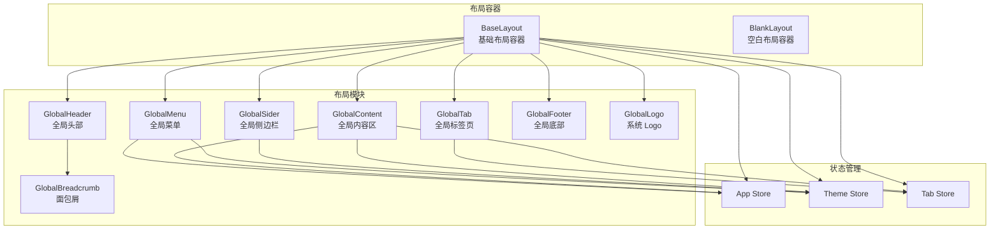
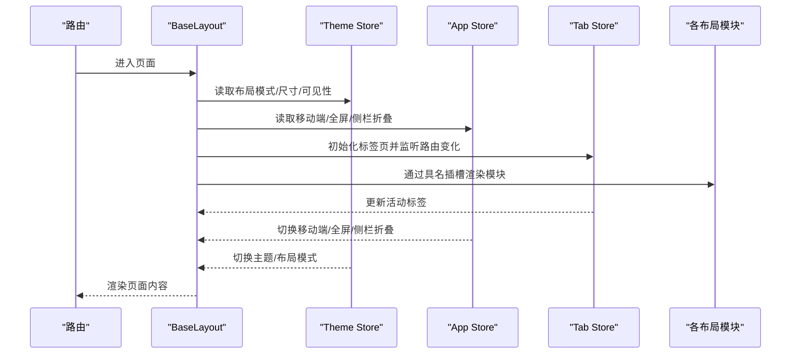
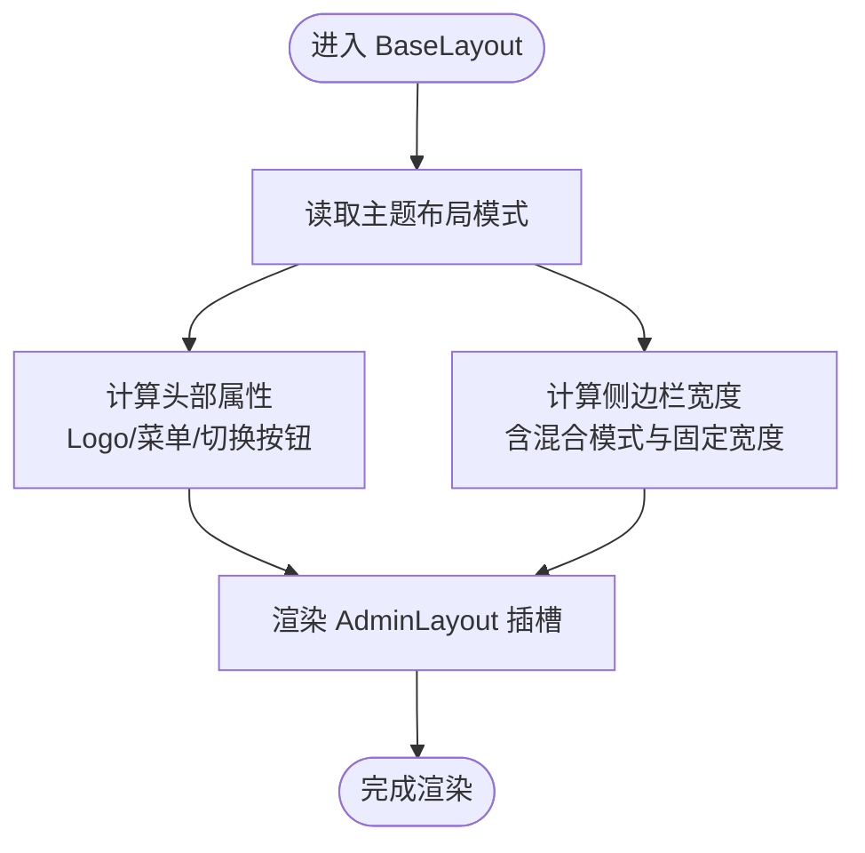
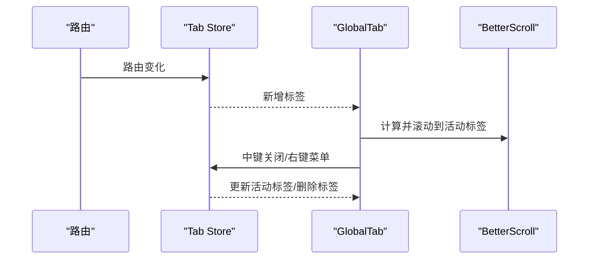
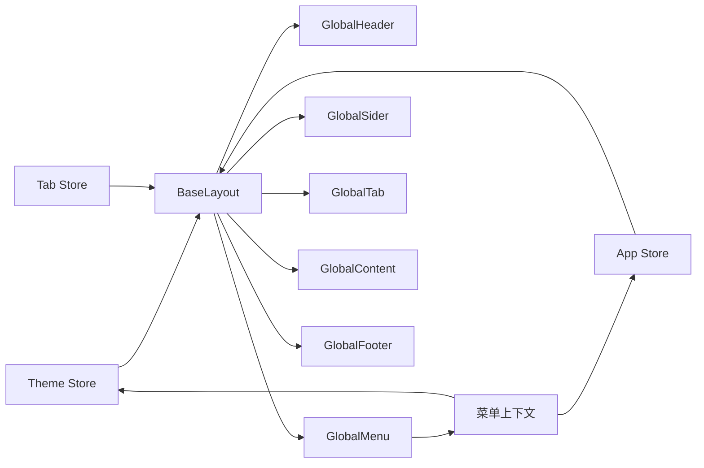

# 布局组件

<cite>
**本文引用的文件**
- [base-layout/index.vue](file://app/web/src/layouts/base-layout/index.vue)
- [blank-layout/index.vue](file://app/web/src/layouts/blank-layout/index.vue)
- [global-header/index.vue](file://app/web/src/layouts/modules/global-header/index.vue)
- [global-menu/index.vue](file://app/web/src/layouts/modules/global-menu/index.vue)
- [global-sider/index.vue](file://app/web/src/layouts/modules/global-sider/index.vue)
- [global-tab/index.vue](file://app/web/src/layouts/modules/global-tab/index.vue)
- [global-content/index.vue](file://app/web/src/layouts/modules/global-content/index.vue)
- [global-footer/index.vue](file://app/web/src/layouts/modules/global-footer/index.vue)
- [global-breadcrumb/index.vue](file://app/web/src/layouts/modules/global-breadcrumb/index.vue)
- [global-logo/index.vue](file://app/web/src/layouts/modules/global-logo/index.vue)
- [global-menu/context/index.ts](file://app/web/src/layouts/modules/global-menu/context/index.ts)
- [app-store/index.ts](file://app/web/src/store/modules/app/index.ts)
- [theme-store/index.ts](file://app/web/src/store/modules/theme/index.ts)
- [tab-store/index.ts](file://app/web/src/store/modules/tab/index.ts)
- [theme/settings.ts](file://app/web/src/theme/settings.ts)
</cite>

## 目录
1. [引言](#引言)
2. [项目结构](#项目结构)
3. [核心组件](#核心组件)
4. [架构总览](#架构总览)
5. [详细组件分析](#详细组件分析)
6. [依赖关系分析](#依赖关系分析)
7. [性能考量](#性能考量)
8. [故障排查指南](#故障排查指南)
9. [结论](#结论)
10. [附录](#附录)

## 引言
本指南聚焦于布局组件的开发与使用，系统讲解 BaseLayout 与 BlankLayout 的设计理念与适用场景；深入剖析全局头部、菜单、侧边栏、底部、面包屑、标签页等模块化布局组件的实现原理；阐述响应式设计、主题切换、布局模式配置；梳理布局组件间的通信机制、状态管理与路由集成；最后给出定制化开发最佳实践与常见问题解决方案。

## 项目结构
布局相关代码集中在前端工程的 src/layouts 目录下，采用“容器层 + 模块层”的分层组织方式：
- 容器层：BaseLayout、BlankLayout 负责整体布局骨架与参数透传
- 模块层：global-header、global-menu、global-sider、global-tab、global-content、global-footer、global-breadcrumb、global-logo 等模块各自负责特定区域的功能
- 状态层：Pinia Store（app、theme、tab）集中管理布局状态、主题与标签页状态
- 主题配置：theme/settings.ts 提供默认主题设置

图表来源
- [base-layout/index.vue:1-163](file://app/web/src/layouts/base-layout/index.vue#L1-L163)
- [blank-layout/index.vue:1-14](file://app/web/src/layouts/blank-layout/index.vue#L1-L14)
- [global-header/index.vue:1-61](file://app/web/src/layouts/modules/global-header/index.vue#L1-L61)
- [global-menu/index.vue:1-41](file://app/web/src/layouts/modules/global-menu/index.vue#L1-L41)
- [global-sider/index.vue:1-37](file://app/web/src/layouts/modules/global-sider/index.vue#L1-L37)
- [global-tab/index.vue:1-234](file://app/web/src/layouts/modules/global-tab/index.vue#L1-L234)
- [global-content/index.vue:1-59](file://app/web/src/layouts/modules/global-content/index.vue#L1-L59)
- [global-footer/index.vue:1-16](file://app/web/src/layouts/modules/global-footer/index.vue#L1-L16)
- [global-breadcrumb/index.vue:1-48](file://app/web/src/layouts/modules/global-breadcrumb/index.vue#L1-L48)
- [global-logo/index.vue:1-28](file://app/web/src/layouts/modules/global-logo/index.vue#L1-L28)
- [app-store/index.ts:1-167](file://app/web/src/store/modules/app/index.ts#L1-L167)
- [theme-store/index.ts:1-303](file://app/web/src/store/modules/theme/index.ts#L1-L303)
- [tab-store/index.ts:1-386](file://app/web/src/store/modules/tab/index.ts#L1-L386)

章节来源
- [base-layout/index.vue:1-163](file://app/web/src/layouts/base-layout/index.vue#L1-L163)
- [blank-layout/index.vue:1-14](file://app/web/src/layouts/blank-layout/index.vue#L1-L14)

## 核心组件
- BaseLayout：基于物料库 AdminLayout 的容器组件，统一承载头部、侧边栏、标签页、菜单、内容区与底部，并通过主题与应用状态动态控制布局行为（如模式、尺寸、可见性、固定等）
- BlankLayout：极简容器，仅承载内容区，适合全屏或无头部/侧边栏的页面

章节来源
- [base-layout/index.vue:1-163](file://app/web/src/layouts/base-layout/index.vue#L1-L163)
- [blank-layout/index.vue:1-14](file://app/web/src/layouts/blank-layout/index.vue#L1-L14)

## 架构总览
BaseLayout 将多个布局模块以具名插槽形式注入 AdminLayout，形成“容器 + 模块”的组合式布局。主题与应用状态贯穿其中，决定各模块的显示与交互行为。

图表来源
- [base-layout/index.vue:1-163](file://app/web/src/layouts/base-layout/index.vue#L1-L163)
- [theme-store/index.ts:1-303](file://app/web/src/store/modules/theme/index.ts#L1-L303)
- [app-store/index.ts:1-167](file://app/web/src/store/modules/app/index.ts#L1-L167)
- [tab-store/index.ts:1-386](file://app/web/src/store/modules/tab/index.ts#L1-L386)

## 详细组件分析

### BaseLayout 组件
- 设计理念
  - 作为顶层布局容器，统一协调头部、侧边栏、标签页、菜单、内容区与底部
  - 通过主题与应用状态计算布局模式、尺寸、可见性与固定策略
  - 支持异步加载菜单组件，按需渲染不同布局模式下的菜单视图
- 关键逻辑
  - 布局模式：根据主题布局模式选择 vertical 或 horizontal
  - 头部属性：依据布局模式动态决定是否显示 Logo、菜单与菜单切换按钮
  - 侧边栏宽度：综合主题宽度、折叠宽度、混合模式宽度与固定子菜单宽度
  - 可见性与固定：根据主题配置控制侧边栏、底部、标签页的显示与固定
- 使用场景
  - 需要完整布局框架的后台管理页面
  - 需要响应式布局与多模式切换的场景

图表来源
- [base-layout/index.vue:25-116](file://app/web/src/layouts/base-layout/index.vue#L25-L116)

章节来源
- [base-layout/index.vue:1-163](file://app/web/src/layouts/base-layout/index.vue#L1-L163)

### BlankLayout 组件
- 设计理念
  - 极简容器，仅承载内容区，关闭默认内边距，适合全屏页面或特殊场景
- 使用场景
  - 登录页、公告页、iframe 内嵌页等无需头部/侧边栏的页面

章节来源
- [blank-layout/index.vue:1-14](file://app/web/src/layouts/blank-layout/index.vue#L1-L14)

### 全局头部 GlobalHeader
- 功能要点
  - 条件渲染 Logo、菜单切换器、菜单容器、面包屑、搜索、全屏、语言切换、主题方案切换、主题按钮、用户头像
  - 通过主题开关控制全局搜索与多语言可见性
  - 与 App Store 协作处理移动端菜单切换
- 与主题/应用状态联动
  - 读取主题中的头部高度、面包屑与搜索配置
  - 读取应用 Store 的移动端状态与全屏状态

章节来源
- [global-header/index.vue:1-61](file://app/web/src/layouts/modules/global-header/index.vue#L1-L61)

### 全局菜单 GlobalMenu
- 功能要点
  - 根据主题布局模式动态选择具体菜单组件（垂直、水平、混合等）
  - 在移动端强制重渲染垂直菜单以适配交互
- 与上下文联动
  - 通过菜单上下文提供一级/二级/子级菜单数据与选中逻辑

章节来源
- [global-menu/index.vue:1-41](file://app/web/src/layouts/modules/global-menu/index.vue#L1-L41)
- [global-menu/context/index.ts:1-191](file://app/web/src/layouts/modules/global-menu/context/index.ts#L1-L191)

### 全局侧边栏 GlobalSider
- 功能要点
  - 在垂直布局下展示 Logo，并随侧栏折叠调整标题显示
  - 根据布局模式与主题配置决定菜单容器样式
- 与主题/应用状态联动
  - 读取头部高度用于 Logo 区域尺寸
  - 读取主题 Store 的侧栏反转与模式配置

章节来源
- [global-sider/index.vue:1-37](file://app/web/src/layouts/modules/global-sider/index.vue#L1-L37)

### 全局标签页 GlobalTab
- 功能要点
  - 基于路由变化自动增删标签，支持鼠标中键关闭、右键上下文菜单、滚动定位到活动标签
  - 支持刷新页面、全屏切换
  - 与 Tab Store 协作维护标签集合、活动标签与缓存
- 与路由/状态联动
  - 监听路由 fullPath 变化新增标签
  - 监听活动标签变化滚动定位
  - 通过 BetterScroll 实现横向滚动体验

图表来源
- [global-tab/index.vue:1-234](file://app/web/src/layouts/modules/global-tab/index.vue#L1-L234)
- [tab-store/index.ts:1-386](file://app/web/src/store/modules/tab/index.ts#L1-L386)

章节来源
- [global-tab/index.vue:1-234](file://app/web/src/layouts/modules/global-tab/index.vue#L1-L234)
- [tab-store/index.ts:1-386](file://app/web/src/store/modules/tab/index.ts#L1-L386)

### 全局内容区 GlobalContent
- 功能要点
  - 通过 RouterView 渲染当前路由组件，结合 KeepAlive 缓存策略与页面过渡动画
  - 重置滚动位置，避免横向滚动残留
- 与状态联动
  - 读取主题 Store 的页面动画配置
  - 读取应用 Store 的全屏与内容区可横向滚动标志

章节来源
- [global-content/index.vue:1-59](file://app/web/src/layouts/modules/global-content/index.vue#L1-L59)

### 全局底部 GlobalFooter
- 功能要点
  - 展示版权信息，支持暗色容器包裹
- 使用场景
  - 常规页脚展示，可按主题自动适配

章节来源
- [global-footer/index.vue:1-16](file://app/web/src/layouts/modules/global-footer/index.vue#L1-L16)

### 面包屑 GlobalBreadcrumb
- 功能要点
  - 基于路由生成面包屑，支持下拉选择跳转
  - 可配置是否显示图标与是否可见
- 与路由/主题联动
  - 读取路由 Store 的面包屑数据
  - 读取主题 Store 的面包屑可见性与图标显示配置

章节来源
- [global-breadcrumb/index.vue:1-48](file://app/web/src/layouts/modules/global-breadcrumb/index.vue#L1-L48)

### 系统 Logo GlobalLogo
- 功能要点
  - 展示系统 Logo 与标题，支持在侧栏折叠时隐藏标题
- 与主题联动
  - 读取主题 Store 的侧栏宽度用于头部 Logo 宽度适配

章节来源
- [global-logo/index.vue:1-28](file://app/web/src/layouts/modules/global-logo/index.vue#L1-L28)

## 依赖关系分析
- 容器与模块
  - BaseLayout 作为容器，依赖 AdminLayout 并注入各模块插槽
  - 各模块相对独立，通过主题与应用状态进行条件渲染与行为控制
- 状态管理
  - Theme Store：主题方案、颜色、布局模式、尺寸、可见性等
  - App Store：移动端、全屏、侧栏折叠、国际化、混合侧栏固定等
  - Tab Store：标签集合、活动标签、缓存与路由切换
- 菜单上下文
  - 提供一级/二级/子级菜单数据与选中逻辑，支撑混合布局模式下的菜单联动

图表来源
- [base-layout/index.vue:1-163](file://app/web/src/layouts/base-layout/index.vue#L1-L163)
- [theme-store/index.ts:1-303](file://app/web/src/store/modules/theme/index.ts#L1-L303)
- [app-store/index.ts:1-167](file://app/web/src/store/modules/app/index.ts#L1-L167)
- [tab-store/index.ts:1-386](file://app/web/src/store/modules/tab/index.ts#L1-L386)
- [global-menu/context/index.ts:1-191](file://app/web/src/layouts/modules/global-menu/context/index.ts#L1-L191)

章节来源
- [theme-store/index.ts:1-303](file://app/web/src/store/modules/theme/index.ts#L1-L303)
- [app-store/index.ts:1-167](file://app/web/src/store/modules/app/index.ts#L1-L167)
- [tab-store/index.ts:1-386](file://app/web/src/store/modules/tab/index.ts#L1-L386)
- [global-menu/context/index.ts:1-191](file://app/web/src/layouts/modules/global-menu/context/index.ts#L1-L191)

## 性能考量
- 按需渲染与异步加载
  - 菜单组件按布局模式动态选择并异步加载，减少初始渲染开销
- KeepAlive 缓存
  - 内容区对路由组件进行缓存，避免频繁重建导致的性能损耗
- 滚动与布局
  - 标签页横向滚动使用 BetterScroll，提升移动端滚动体验
  - 页面切换时重置滚动位置，避免横向滚动残留影响后续渲染
- 响应式与移动端优化
  - 移动端自动切换为垂直布局并折叠侧栏，降低复杂度
  - 混合侧栏固定可通过开关控制，平衡可用性与性能

章节来源
- [base-layout/index.vue:23-29](file://app/web/src/layouts/base-layout/index.vue#L23-L29)
- [global-content/index.vue:45-54](file://app/web/src/layouts/modules/global-content/index.vue#L45-L54)
- [global-tab/index.vue:189-218](file://app/web/src/layouts/modules/global-tab/index.vue#L189-L218)
- [app-store/index.ts:84-114](file://app/web/src/store/modules/app/index.ts#L84-L114)

## 故障排查指南
- 标签页不更新或无法关闭
  - 检查路由变化监听与标签初始化逻辑
  - 确认 Tab Store 的 addTab/removeTab 流程与活动标签切换
- 移动端布局异常
  - 确认 App Store 的 isMobile 断点与布局备份/恢复逻辑
  - 检查 BaseLayout 对移动端模式的处理
- 菜单上下文不生效
  - 确认菜单上下文提供的选中键与层级菜单数据
  - 检查混合布局模式下的自动选中与路由跳转逻辑
- 主题切换后样式未更新
  - 确认 Theme Store 的主题变量注入与 CSS 变量更新
  - 检查推荐色与调色板映射逻辑

章节来源
- [tab-store/index.ts:78-118](file://app/web/src/store/modules/tab/index.ts#L78-L118)
- [app-store/index.ts:84-114](file://app/web/src/store/modules/app/index.ts#L84-L114)
- [global-menu/context/index.ts:143-153](file://app/web/src/layouts/modules/global-menu/context/index.ts#L143-L153)
- [theme-store/index.ts:260-267](file://app/web/src/store/modules/theme/index.ts#L260-L267)

## 结论
该布局体系通过容器组件与模块化组件的解耦设计，配合 Pinia 状态管理与主题配置，实现了灵活、可扩展且高性能的后台布局方案。BaseLayout 适用于大多数后台页面，BlankLayout 适用于特殊场景。通过菜单上下文与路由集成，布局组件能够自适应多模式布局与多语言环境，满足复杂业务需求。

## 附录

### 布局模式与配置项速览
- 布局模式
  - vertical、horizontal、vertical-mix、vertical-hybrid-header-first、top-hybrid-sidebar-first、top-hybrid-header-first
- 关键配置
  - 头部：高度、面包屑可见性与图标、多语言、全局搜索
  - 侧边栏：宽度、折叠宽度、混合宽度、混合折叠宽度、混合子菜单宽度、反转、自动选中
  - 标签页：可见性、缓存、高度、模式、中键关闭
  - 底部：可见性、固定、高度、右侧对齐
  - 页面：动画开关与动画模式
  - 主题：主题方案、推荐色、颜色、令牌

章节来源
- [theme/settings.ts:1-97](file://app/web/src/theme/settings.ts#L1-L97)