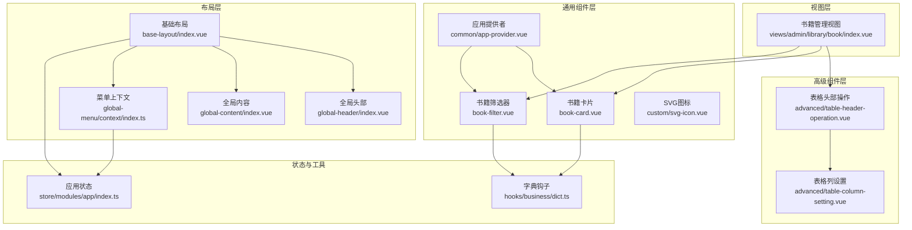
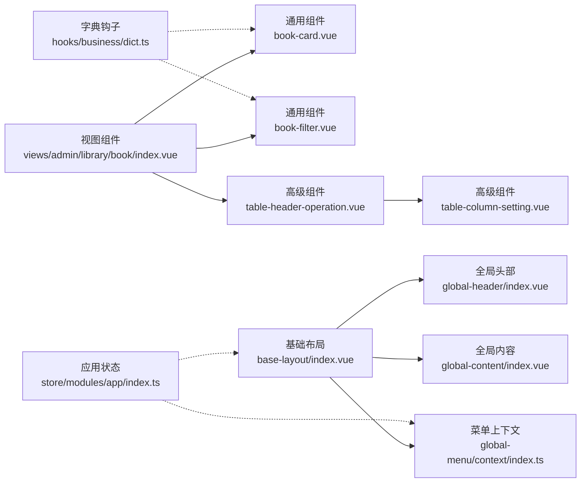
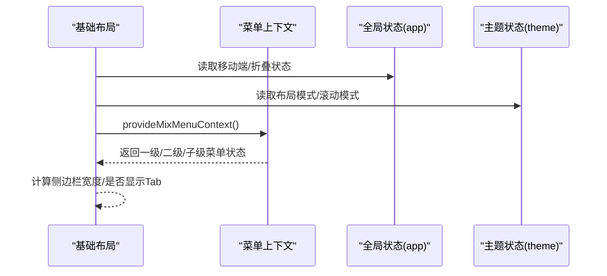
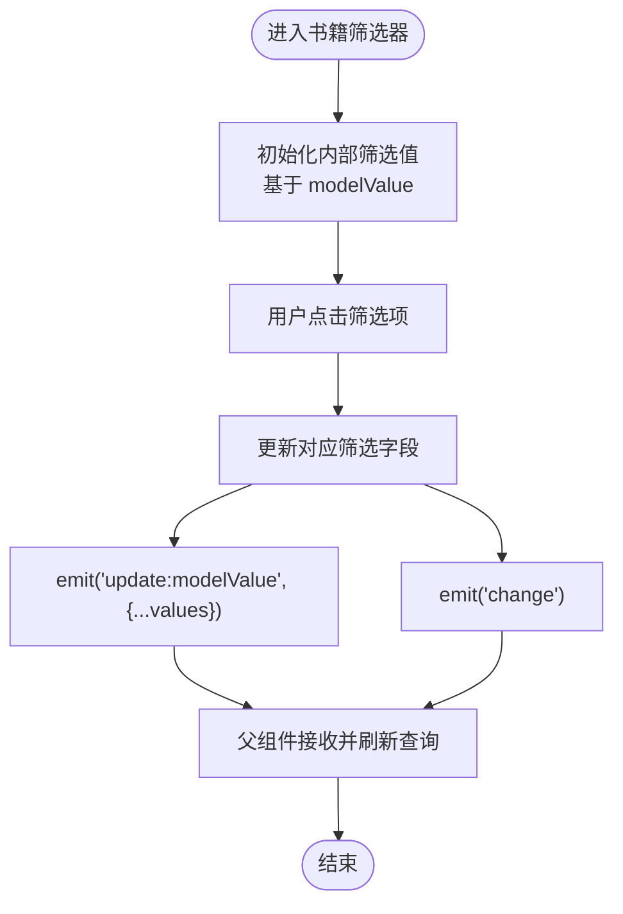
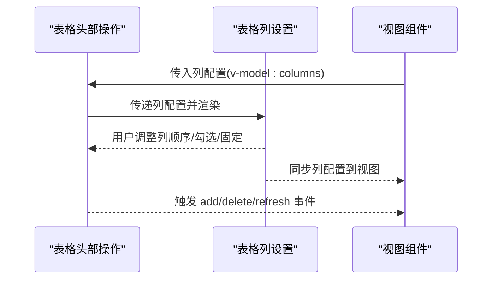
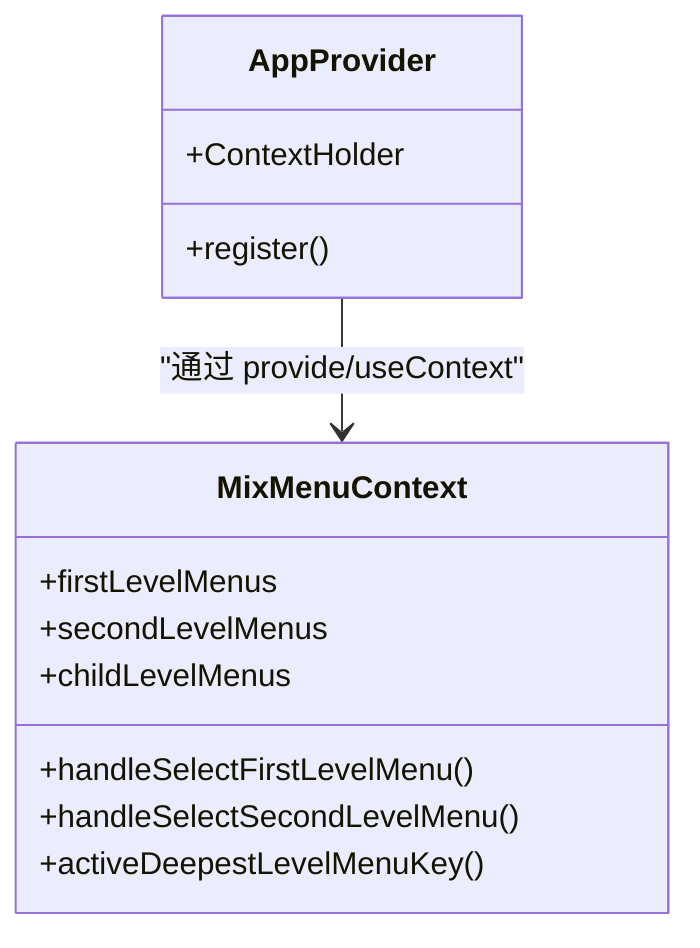
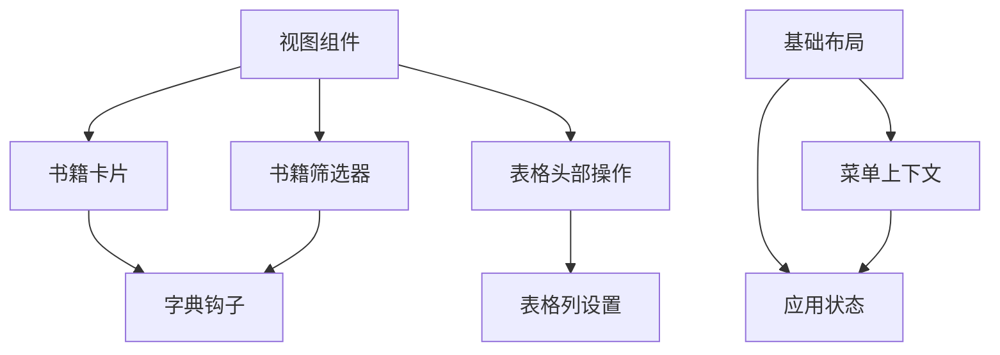

# 组件开发

<cite>
**本文引用的文件**
- [app-provider.vue](file://app/web/src/components/common/app-provider.vue)
- [book-card.vue](file://app/web/src/components/book-card.vue)
- [book-filter.vue](file://app/web/src/components/book-filter.vue)
- [table-column-setting.vue](file://app/web/src/components/advanced/table-column-setting.vue)
- [table-header-operation.vue](file://app/web/src/components/advanced/table-header-operation.vue)
- [svg-icon.vue](file://app/web/src/components/custom/svg-icon.vue)
- [base-layout\index.vue](file://app/web/src/layouts/base-layout/index.vue)
- [global-header\index.vue](file://app/web/src/layouts/modules/global-header/index.vue)
- [global-content\index.vue](file://app/web/src/layouts/modules/global-content/index.vue)
- [global-menu\context\index.ts](file://app/web/src/layouts/modules/global-menu/context/index.ts)
- [app\index.ts](file://app/web/src/store/modules/app/index.ts)
- [dict.ts](file://app/web/src/hooks/business/dict.ts)
- [book\index.vue](file://app/web/src/views/admin/library/book/index.vue)
</cite>

## 目录
1. 引言
2. 项目结构
3. 核心组件
4. 架构总览
5. 详细组件分析
6. 依赖关系分析
7. 性能考虑
8. 故障排查指南
9. 结论
10. 附录

## 引言
本指南面向Vue3组件开发者，系统梳理组件设计原则、Props定义、事件与插槽使用、布局与业务组件分类、组件通信与状态管理、可复用性与性能优化，并结合仓库现有组件给出完整开发流程与最佳实践路径。读者无需深入源码即可理解如何在本项目中高质量地开发与维护组件。

## 项目结构
本项目前端采用分层组织：布局层、通用组件层、高级组件层、自定义组件层、视图层与状态管理。组件开发遵循“高内聚、低耦合”的原则，通过Props/Events/Slots统一对外接口，通过Pinia与上下文实现跨层级通信。

**图表来源**
- [base-layout\index.vue:1-163](file://app/web/src/layouts/base-layout/index.vue#L1-L163)
- [global-header\index.vue:1-61](file://app/web/src/layouts/modules/global-header/index.vue#L1-L61)
- [global-content\index.vue:1-59](file://app/web/src/layouts/modules/global-content/index.vue#L1-L59)
- [global-menu\context\index.ts:1-191](file://app/web/src/layouts/modules/global-menu/context/index.ts#L1-L191)
- [app-provider.vue:1-40](file://app/web/src/components/common/app-provider.vue#L1-L40)
- [book-card.vue:1-122](file://app/web/src/components/book-card.vue#L1-L122)
- [book-filter.vue:1-139](file://app/web/src/components/book-filter.vue#L1-L139)
- [table-column-setting.vue:1-118](file://app/web/src/components/advanced/table-column-setting.vue#L1-L118)
- [table-header-operation.vue:1-75](file://app/web/src/components/advanced/table-header-operation.vue#L1-L75)
- [svg-icon.vue:1-55](file://app/web/src/components/custom/svg-icon.vue#L1-L55)
- [app\index.ts:1-167](file://app/web/src/store/modules/app/index.ts#L1-L167)
- [dict.ts:1-41](file://app/web/src/hooks/business/dict.ts#L1-L41)
- [book\index.vue:1-326](file://app/web/src/views/admin/library/book/index.vue#L1-L326)

**章节来源**
- [base-layout\index.vue:1-163](file://app/web/src/layouts/base-layout/index.vue#L1-L163)
- [global-header\index.vue:1-61](file://app/web/src/layouts/modules/global-header/index.vue#L1-L61)
- [global-content\index.vue:1-59](file://app/web/src/layouts/modules/global-content/index.vue#L1-L59)
- [global-menu\context\index.ts:1-191](file://app/web/src/layouts/modules/global-menu/context/index.ts#L1-L191)

## 核心组件
本节聚焦组件设计的关键要素：Props定义、事件与插槽、状态与行为分离、可复用性与可测试性。

- Props定义与默认值
  - 使用带默认值的withDefaults或defineProps，明确参数类型与可选性，避免运行期类型错误。
  - 示例参考：书籍卡片组件对展示开关的布尔默认值处理；表格头部操作组件对可选属性的声明。
  - 参考路径：
    - [book-card.vue:20-23](file://app/web/src/components/book-card.vue#L20-L23)
    - [table-header-operation.vue:8-14](file://app/web/src/components/advanced/table-header-operation.vue#L8-L14)

- 事件与插槽
  - 明确事件命名与载荷，使用defineEmits声明事件签名，确保父子通信契约清晰。
  - 插槽用于扩展内容，如表格头部操作的prefix/suffix插槽，增强组合能力。
  - 参考路径：
    - [book-card.vue:25-27](file://app/web/src/components/book-card.vue#L25-L27)
    - [table-header-operation.vue:20-22](file://app/web/src/components/advanced/table-header-operation.vue#L20-L22)
    - [table-header-operation.vue:42-71](file://app/web/src/components/advanced/table-header-operation.vue#L42-L71)

- 状态与行为分离
  - 将内部状态（如封面加载失败标记）与外部状态（v-model或事件）解耦，避免过度耦合。
  - 参考路径：
    - [book-card.vue:29-69](file://app/web/src/components/book-card.vue#L29-L69)

- 可复用性与可测试性
  - 通过Hook封装通用逻辑（如字典项加载），组件只关注渲染与交互。
  - 参考路径：
    - [dict.ts:1-41](file://app/web/src/hooks/business/dict.ts#L1-L41)

**章节来源**
- [book-card.vue:1-122](file://app/web/src/components/book-card.vue#L1-L122)
- [book-filter.vue:1-139](file://app/web/src/components/book-filter.vue#L1-L139)
- [table-header-operation.vue:1-75](file://app/web/src/components/advanced/table-header-operation.vue#L1-L75)
- [dict.ts:1-41](file://app/web/src/hooks/business/dict.ts#L1-L41)

## 架构总览
本项目采用“布局-组件-视图-状态”四层架构。布局层负责页面骨架与主题配置；组件层提供通用与高级可复用能力；视图层承载业务场景；状态层通过Pinia集中管理应用与主题、路由、标签页等状态。

**图表来源**
- [book\index.vue:1-326](file://app/web/src/views/admin/library/book/index.vue#L1-L326)
- [book-card.vue:1-122](file://app/web/src/components/book-card.vue#L1-L122)
- [book-filter.vue:1-139](file://app/web/src/components/book-filter.vue#L1-L139)
- [table-header-operation.vue:1-75](file://app/web/src/components/advanced/table-header-operation.vue#L1-L75)
- [table-column-setting.vue:1-118](file://app/web/src/components/advanced/table-column-setting.vue#L1-L118)
- [base-layout\index.vue:1-163](file://app/web/src/layouts/base-layout/index.vue#L1-L163)
- [global-header\index.vue:1-61](file://app/web/src/layouts/modules/global-header/index.vue#L1-L61)
- [global-content\index.vue:1-59](file://app/web/src/layouts/modules/global-content/index.vue#L1-L59)
- [global-menu\context\index.ts:1-191](file://app/web/src/layouts/modules/global-menu/context/index.ts#L1-L191)
- [app\index.ts:1-167](file://app/web/src/store/modules/app/index.ts#L1-L167)
- [dict.ts:1-41](file://app/web/src/hooks/business/dict.ts#L1-L41)

## 详细组件分析

### 布局组件：基础布局与全局模块
- 设计原则
  - 通过计算属性根据主题与路由动态决定头部、侧边栏、Tab等模块的可见性与属性。
  - 使用异步组件按需加载菜单模块，降低首屏体积。
  - 提供菜单上下文（provide/useContext）以支持混合布局下的多级菜单联动。
- 关键点
  - 布局模式切换与宽度计算，适配移动端与混合布局。
  - 头部属性由主题与路由状态共同决定，保证不同布局下头部行为一致。
- 参考路径
  - [base-layout\index.vue:1-163](file://app/web/src/layouts/base-layout/index.vue#L1-L163)
  - [global-header\index.vue:1-61](file://app/web/src/layouts/modules/global-header/index.vue#L1-L61)
  - [global-content\index.vue:1-59](file://app/web/src/layouts/modules/global-content/index.vue#L1-L59)
  - [global-menu\context\index.ts:1-191](file://app/web/src/layouts/modules/global-menu/context/index.ts#L1-L191)

**图表来源**
- [base-layout\index.vue:1-163](file://app/web/src/layouts/base-layout/index.vue#L1-L163)
- [global-menu\context\index.ts:1-191](file://app/web/src/layouts/modules/global-menu/context/index.ts#L1-L191)
- [app\index.ts:1-167](file://app/web/src/store/modules/app/index.ts#L1-L167)

**章节来源**
- [base-layout\index.vue:1-163](file://app/web/src/layouts/base-layout/index.vue#L1-L163)
- [global-header\index.vue:1-61](file://app/web/src/layouts/modules/global-header/index.vue#L1-L61)
- [global-content\index.vue:1-59](file://app/web/src/layouts/modules/global-content/index.vue#L1-L59)
- [global-menu\context\index.ts:1-191](file://app/web/src/layouts/modules/global-menu/context/index.ts#L1-L191)

### 通用组件：书籍卡片与筛选器
- 书籍卡片
  - Props：接收书籍对象与展示开关；默认值确保可选行为明确。
  - 事件：点击事件向外抛出当前书籍数据，便于父组件处理。
  - 插槽：无插槽，但可通过外部样式控制外观。
  - 数据与行为：内部计算封面渐变、状态标签文本与类型，处理封面加载失败回退。
  - 参考路径：
    - [book-card.vue:1-122](file://app/web/src/components/book-card.vue#L1-L122)
- 书籍筛选器
  - Props：配置项与双向绑定的筛选值；通过事件通知父组件变更。
  - 事件：update:modelValue与change，满足v-model与变更通知。
  - 行为：内部使用reactive维护筛选状态，逐项更新并同步到父组件。
  - 参考路径：
    - [book-filter.vue:1-139](file://app/web/src/components/book-filter.vue#L1-L139)

**图表来源**
- [book-filter.vue:1-139](file://app/web/src/components/book-filter.vue#L1-L139)

**章节来源**
- [book-card.vue:1-122](file://app/web/src/components/book-card.vue#L1-L122)
- [book-filter.vue:1-139](file://app/web/src/components/book-filter.vue#L1-L139)

### 高级组件：表格列设置与表格头部操作
- 表格列设置
  - 模型：使用defineModel绑定列配置数组，支持拖拽排序与勾选控制可见性与固定方向。
  - 交互：全选/半选状态计算、列固定切换、Tooltip提示文案国际化。
  - 参考路径：
    - [table-column-setting.vue:1-118](file://app/web/src/components/advanced/table-column-setting.vue#L1-L118)
- 表格头部操作
  - 模型：v-model:columns绑定列配置，支持外部传入默认列集合。
  - 事件：add/delete/refresh，配合插槽扩展前缀/后缀区域。
  - 参考路径：
    - [table-header-operation.vue:1-75](file://app/web/src/components/advanced/table-header-operation.vue#L1-L75)

**图表来源**
- [table-header-operation.vue:1-75](file://app/web/src/components/advanced/table-header-operation.vue#L1-L75)
- [table-column-setting.vue:1-118](file://app/web/src/components/advanced/table-column-setting.vue#L1-L118)

**章节来源**
- [table-header-operation.vue:1-75](file://app/web/src/components/advanced/table-header-operation.vue#L1-L75)
- [table-column-setting.vue:1-118](file://app/web/src/components/advanced/table-column-setting.vue#L1-L118)

### 自定义组件：SVG图标
- 设计要点
  - 支持Iconify图标与本地SVG图标，优先渲染本地图标；通过inheritAttrs禁用透传属性，避免样式冲突。
  - 动态计算symbolId与渲染条件，保证图标资源正确加载。
  - 参考路径：
    - [svg-icon.vue:1-55](file://app/web/src/components/custom/svg-icon.vue#L1-L55)

**章节来源**
- [svg-icon.vue:1-55](file://app/web/src/components/custom/svg-icon.vue#L1-L55)

### 应用提供者与上下文注入
- 应用提供者
  - 在根组件注入Naive UI的全局服务（消息、对话框、通知、进度条），并通过ContextHolder注册到window，便于全局调用。
  - 参考路径：
    - [app-provider.vue:1-40](file://app/web/src/components/common/app-provider.vue#L1-L40)
- 菜单上下文
  - 使用useContext提供/消费混合菜单上下文，计算一级/二级/子级菜单的激活状态与导航行为，支持自动选择首个菜单与路由跳转。
  - 参考路径：
    - [global-menu\context\index.ts:1-191](file://app/web/src/layouts/modules/global-menu/context/index.ts#L1-L191)

**图表来源**
- [app-provider.vue:1-40](file://app/web/src/components/common/app-provider.vue#L1-L40)
- [global-menu\context\index.ts:1-191](file://app/web/src/layouts/modules/global-menu/context/index.ts#L1-L191)

**章节来源**
- [app-provider.vue:1-40](file://app/web/src/components/common/app-provider.vue#L1-L40)
- [global-menu\context\index.ts:1-191](file://app/web/src/layouts/modules/global-menu/context/index.ts#L1-L191)

## 依赖关系分析
- 组件间依赖
  - 视图层依赖通用与高级组件；通用组件依赖字典钩子；布局组件依赖全局状态与菜单上下文。
- 外部依赖
  - Naive UI提供UI能力与全局服务；@vueuse/core提供响应式工具；Pinia提供状态管理。
- 循环依赖风险
  - 通过Hook与上下文解耦，避免组件间直接循环引用。

**图表来源**
- [book\index.vue:1-326](file://app/web/src/views/admin/library/book/index.vue#L1-L326)
- [book-card.vue:1-122](file://app/web/src/components/book-card.vue#L1-L122)
- [book-filter.vue:1-139](file://app/web/src/components/book-filter.vue#L1-L139)
- [table-header-operation.vue:1-75](file://app/web/src/components/advanced/table-header-operation.vue#L1-L75)
- [table-column-setting.vue:1-118](file://app/web/src/components/advanced/table-column-setting.vue#L1-L118)
- [dict.ts:1-41](file://app/web/src/hooks/business/dict.ts#L1-L41)
- [base-layout\index.vue:1-163](file://app/web/src/layouts/base-layout/index.vue#L1-L163)
- [global-menu\context\index.ts:1-191](file://app/web/src/layouts/modules/global-menu/context/index.ts#L1-L191)
- [app\index.ts:1-167](file://app/web/src/store/modules/app/index.ts#L1-L167)

**章节来源**
- [book\index.vue:1-326](file://app/web/src/views/admin/library/book/index.vue#L1-L326)
- [dict.ts:1-41](file://app/web/src/hooks/business/dict.ts#L1-L41)
- [global-menu\context\index.ts:1-191](file://app/web/src/layouts/modules/global-menu/context/index.ts#L1-L191)

## 性能考虑
- 渲染优化
  - 使用懒加载图片与过渡动画，减少首屏压力；卡片hover效果与封面缩放应适度，避免重排抖动。
  - 参考路径：
    - [book-card.vue:72-121](file://app/web/src/components/book-card.vue#L72-L121)
- 列表与表格
  - 表格启用虚拟滚动与远程分页，避免一次性渲染大量数据；列设置支持拖拽排序与固定，减少重复渲染。
  - 参考路径：
    - [table-header-operation.vue:312-314](file://app/web/src/components/advanced/table-header-operation.vue#L312-L314)
    - [table-column-setting.vue:85-112](file://app/web/src/components/advanced/table-column-setting.vue#L85-L112)
- 状态与缓存
  - 字典项加载使用内存缓存，避免重复请求；应用状态中对移动端布局的备份与恢复减少频繁主题切换开销。
  - 参考路径：
    - [dict.ts:6-35](file://app/web/src/hooks/business/dict.ts#L6-L35)
    - [app\index.ts:87-114](file://app/web/src/store/modules/app/index.ts#L87-L114)

**章节来源**
- [book-card.vue:72-121](file://app/web/src/components/book-card.vue#L72-L121)
- [table-header-operation.vue:312-314](file://app/web/src/components/advanced/table-header-operation.vue#L312-L314)
- [table-column-setting.vue:85-112](file://app/web/src/components/advanced/table-column-setting.vue#L85-L112)
- [dict.ts:6-35](file://app/web/src/hooks/business/dict.ts#L6-L35)
- [app\index.ts:87-114](file://app/web/src/store/modules/app/index.ts#L87-L114)

## 故障排查指南
- 图标不显示
  - 检查本地SVG前缀与symbolId拼接是否正确；确认Iconify图标名称是否有效。
  - 参考路径：
    - [svg-icon.vue:29-41](file://app/web/src/components/custom/svg-icon.vue#L29-L41)
- 表格列设置异常
  - 确认v-model:columns绑定正确；检查列配置项的visible/checked/fixed字段是否符合预期。
  - 参考路径：
    - [table-column-setting.vue:10-59](file://app/web/src/components/advanced/table-column-setting.vue#L10-L59)
- 事件未触发
  - 确认defineEmits声明的事件名与父组件监听一致；检查事件载荷是否正确传递。
  - 参考路径：
    - [book-card.vue:25-27](file://app/web/src/components/book-card.vue#L25-L27)
    - [table-header-operation.vue:20-38](file://app/web/src/components/advanced/table-header-operation.vue#L20-L38)
- 布局错位
  - 检查移动端断点与侧边栏折叠状态；确认主题布局模式与宽度计算逻辑。
  - 参考路径：
    - [base-layout\index.vue:84-116](file://app/web/src/layouts/base-layout/index.vue#L84-L116)
    - [app\index.ts:87-114](file://app/web/src/store/modules/app/index.ts#L87-L114)

**章节来源**
- [svg-icon.vue:29-41](file://app/web/src/components/custom/svg-icon.vue#L29-L41)
- [table-column-setting.vue:10-59](file://app/web/src/components/advanced/table-column-setting.vue#L10-L59)
- [book-card.vue:25-27](file://app/web/src/components/book-card.vue#L25-L27)
- [table-header-operation.vue:20-38](file://app/web/src/components/advanced/table-header-operation.vue#L20-L38)
- [base-layout\index.vue:84-116](file://app/web/src/layouts/base-layout/index.vue#L84-L116)
- [app\index.ts:87-114](file://app/web/src/store/modules/app/index.ts#L87-L114)

## 结论
本指南从设计原则、Props/事件/插槽、布局与业务组件分类、组件通信与状态管理、可复用性与性能优化等方面总结了Vue3组件开发的最佳实践。结合仓库现有组件，开发者可以快速构建高质量、可维护、可扩展的组件体系。

## 附录
- 开发流程建议
  - 设计阶段：明确Props/Events/Slots，绘制组件关系图与交互序列图。
  - 实现阶段：先实现Hook与数据逻辑，再实现组件渲染与交互；确保事件签名与插槽命名规范。
  - 测试阶段：编写单元测试覆盖关键分支与边界条件；对复杂交互绘制流程图辅助测试。
  - 发布阶段：遵循命名规范与目录结构，补充文档与变更日志。
- 最佳实践清单
  - 使用defineProps/defineEmits声明接口，withDefaults提供合理默认值。
  - 将内部状态与外部状态解耦，避免过度耦合。
  - 通过Hook封装可复用逻辑，组件保持薄层。
  - 使用Provide/Inject或Pinia进行跨层级通信，避免深层嵌套。
  - 对列表与表格启用虚拟化与远程分页，优化性能。
  - 使用国际化与可访问性工具，提升用户体验。