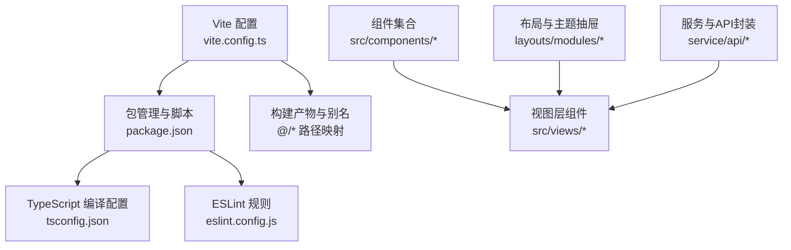
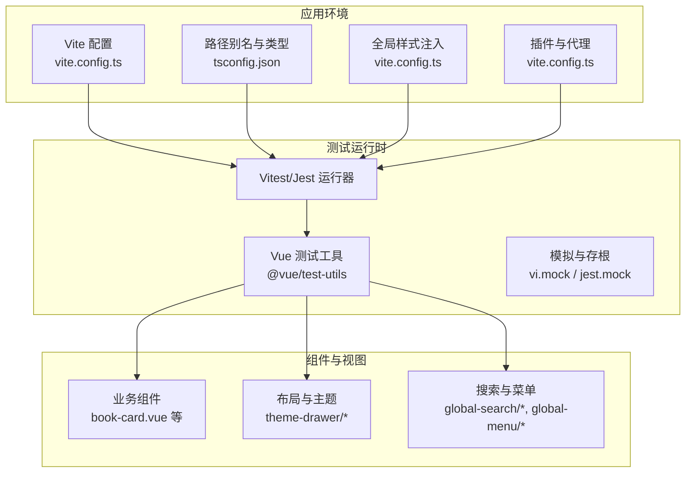
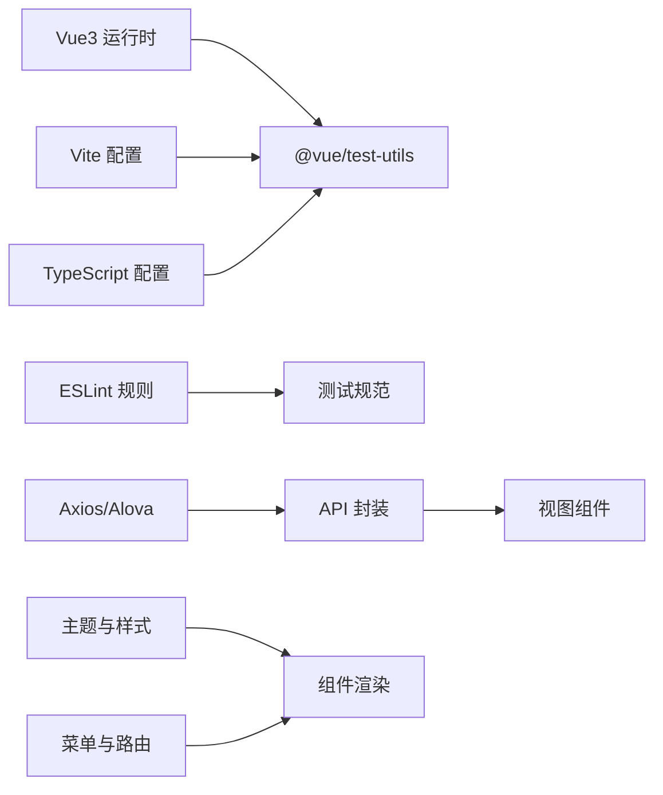

# 组件测试

<cite>
**本文引用的文件**
- [package.json](file://app/web/package.json)
- [vite.config.ts](file://app/web/vite.config.ts)
- [tsconfig.json](file://app/web/tsconfig.json)
- [eslint.config.js](file://app/web/eslint.config.js)
- [.npmrc](file://app/web/.npmrc)
- [book-card.vue](file://app/web/src/components/book-card.vue)
- [book-filter.vue](file://app/web/src/components/book-filter.vue)
- [table-column-setting.vue](file://app/web/src/components/advanced/table-column-setting.vue)
- [table-header-operation.vue](file://app/web/src/components/advanced/table-header-operation.vue)
- [index.vue](file://app/web/src/views/admin/library/book/index.vue)
- [book-manage.ts](file://app/web/src/service/api/book-manage.ts)
- [auth.ts](file://app/web/src/hooks/business/auth.ts)
- [count-to.vue](file://app/web/src/components/custom/count-to.vue)
- [button-icon.vue](file://app/web/src/components/custom/button-icon.vue)
- [svg-icon.vue](file://app/web/src/components/custom/svg-icon.vue)
- [better-scroll.vue](file://app/web/src/components/custom/better-scroll.vue)
- [theme-drawer/index.vue](file://app/web/src/layouts/modules/theme-drawer/index.vue)
- [global-header/index.vue](file://app/web/src/layouts/modules/global-header/index.vue)
- [global-search/index.vue](file://app/web/src/layouts/modules/global-search/index.vue)
- [global-search/search-modal.vue](file://app/web/src/layouts/modules/global-search/components/search-modal.vue)
- [global-search/search-result.vue](file://app/web/src/layouts/modules/global-search/components/search-result.vue)
- [global-search/search-footer.vue](file://app/web/src/layouts/modules/global-search/components/search-footer.vue)
- [layout-mode.vue](file://app/web/src/layouts/modules/theme-drawer/modules/layout/layout-mode.vue)
- [setting-item.vue](file://app/web/src/layouts/modules/theme-drawer/modules/appearance/modules/setting-item.vue)
- [theme-schema.vue](file://app/web/src/layouts/modules/theme-drawer/modules/appearance/modules/theme-schema.vue)
- [content-settings.vue](file://app/web/src/layouts/modules/theme-drawer/modules/layout/content-settings.vue)
- [header-settings.vue](file://app/web/src/layouts/modules/theme-drawer/modules/layout/header-settings.vue)
- [footer-settings.vue](file://app/web/src/layouts/modules/theme-drawer/modules/layout/footer-settings.vue)
- [sider-settings.vue](file://app/web/src/layouts/modules/theme-drawer/modules/layout/sider-settings.vue)
- [tab-settings.vue](file://app/web/src/layouts/modules/theme-drawer/modules/layout/tab-settings.vue)
- [watermark-settings.vue](file://app/web/src/layouts/modules/theme-drawer/modules/general/modules/watermark-settings.vue)
- [global-settings.vue](file://app/web/src/layouts/modules/theme-drawer/modules/general/modules/global-settings.vue)
- [theme-preset.vue](file://app/web/src/layouts/modules/theme-drawer/modules/preset/theme-preset.vue)
- [layout-mode-card.vue](file://app/web/src/layouts/modules/theme-drawer/modules/preset/layout-mode-card.vue)
- [theme-color.vue](file://app/web/src/layouts/modules/theme-drawer/modules/appearance/modules/theme-color.vue)
- [theme-radius.vue](file://app/web/src/layouts/modules/theme-drawer/modules/appearance/modules/theme-radius.vue)
- [config-operation.vue](file://app/web/src/layouts/modules/theme-drawer/index.vue)
- [modules/index.vue](file://app/web/src/layouts/modules/global-menu/modules/index.vue)
- [first-level-menu.vue](file://app/web/src/layouts/modules/global-menu/modules/first-level-menu.vue)
- [vertical-menu.vue](file://app/web/src/layouts/modules/global-menu/modules/vertical-menu.vue)
- [horizontal-menu.vue](file://app/web/src/layouts/modules/global-menu/modules/horizontal-menu.vue)
- [top-hybrid-header-first.vue](file://app/web/src/layouts/modules/global-menu/modules/top-hybrid-header-first.vue)
- [top-hybrid-sidebar-first.vue](file://app/web/src/layouts/modules/global-menu/modules/top-hybrid-sidebar-first.vue)
- [vertical-hybrid-header-first.vue](file://app/web/src/layouts/modules/global-menu/modules/vertical-hybrid-header-first.vue)
- [vertical-mix-menu.vue](file://app/web/src/layouts/modules/global-menu/modules/vertical-mix-menu.vue)
- [context/index.ts](file://app/web/src/layouts/modules/global-menu/context/index.ts)
- [modules/index.vue](file://app/web/src/layouts/modules/global-tab/index.vue)
- [context-menu.vue](file://app/web/src/layouts/modules/global-tab/context-menu.vue)
- [base-layout/index.vue](file://app/web/src/layouts/base-layout/index.vue)
- [blank-layout/index.vue](file://app/web/src/layouts/blank-layout/index.vue)
- [user-avatar.vue](file://app/web/src/layouts/modules/global-header/components/user-avatar.vue)
- [theme-button.vue](file://app/web/src/layouts/modules/global-header/components/theme-button.vue)
- [exception-base.vue](file://app/web/src/components/common/exception-base.vue)
- [reload-button.vue](file://app/web/src/components/common/reload-button.vue)
- [lang-switch.vue](file://app/web/src/components/common/lang-switch.vue)
- [menu-toggler.vue](file://app/web/src/components/common/menu-toggler.vue)
- [pin-toggler.vue](file://app/web/src/components/common/pin-toggler.vue)
- [full-screen.vue](file://app/web/src/components/common/full-screen.vue)
- [icon-tooltip.vue](file://app/web/src/components/common/icon-tooltip.vue)
- [system-logo.vue](file://app/web/src/components/common/system-logo.vue)
- [dark-mode-container.vue](file://app/web/src/components/common/dark-mode-container.vue)
- [app-provider.vue](file://app/web/src/components/common/app-provider.vue)
- [soybean-avatar.vue](file://app/web/src/components/custom/soybean-avatar.vue)
- [wave-bg.vue](file://app/web/src/components/custom/wave-bg.vue)
</cite>

## 目录
1. [引言](#引言)
2. [项目结构](#项目结构)
3. [核心组件](#核心组件)
4. [架构总览](#架构总览)
5. [详细组件分析](#详细组件分析)
6. [依赖分析](#依赖分析)
7. [性能考虑](#性能考虑)
8. [故障排查指南](#故障排查指南)
9. [结论](#结论)
10. [附录](#附录)

## 引言
本指南面向Vue3前端工程，系统化介绍组件测试策略与最佳实践，覆盖快照测试、交互测试、异步组件测试、生命周期与事件触发测试、Props验证测试、Mock数据准备、测试环境配置与覆盖率统计，并结合仓库现有组件给出可操作的测试方案与持续集成建议。

## 项目结构
前端位于 app/web，采用 Vite + TypeScript + Vue3 + NaiveUI 技术栈。测试框架可选 Vitest 或 Jest；本指南以 Vitest 为默认方案，因其与 Vite 集成更紧密，启动更快，生态契合度高。

图表来源
- [vite.config.ts:1-52](file://app/web/vite.config.ts#L1-L52)
- [package.json:1-108](file://app/web/package.json#L1-L108)
- [tsconfig.json:1-26](file://app/web/tsconfig.json#L1-L26)
- [eslint.config.js:1-13](file://app/web/eslint.config.js#L1-L13)

章节来源
- [vite.config.ts:1-52](file://app/web/vite.config.ts#L1-L52)
- [package.json:1-108](file://app/web/package.json#L1-L108)
- [tsconfig.json:1-26](file://app/web/tsconfig.json#L1-L26)
- [eslint.config.js:1-13](file://app/web/eslint.config.js#L1-L13)

## 核心组件
以下组件在测试中具有代表性，涵盖基础交互、复杂布局、主题设置、搜索与菜单等典型场景：

- 基础卡片与筛选：book-card.vue、book-filter.vue
- 高级表格控制：table-column-setting.vue、table-header-operation.vue
- 主题抽屉与布局设置：theme-drawer/index.vue 及其子模块
- 全局搜索：global-search/index.vue 及其子组件 search-modal.vue、search-result.vue、search-footer.vue
- 全局头部：global-header/index.vue 及其子组件 user-avatar.vue、theme-button.vue
- 全局菜单：global-menu/modules/* 及上下文模块
- 全局标签页：global-tab/index.vue 及 context-menu.vue
- 布局容器：base-layout/index.vue、blank-layout/index.vue
- 自定义组件：count-to.vue、button-icon.vue、svg-icon.vue、better-scroll.vue、soybean-avatar.vue、wave-bg.vue
- 通用组件：exception-base.vue、reload-button.vue、lang-switch.vue、menu-toggler.vue、pin-toggler.vue、full-screen.vue、icon-tooltip.vue、system-logo.vue、dark-mode-container.vue、app-provider.vue

章节来源
- [book-card.vue](file://app/web/src/components/book-card.vue)
- [book-filter.vue](file://app/web/src/components/book-filter.vue)
- [table-column-setting.vue](file://app/web/src/components/advanced/table-column-setting.vue)
- [table-header-operation.vue](file://app/web/src/components/advanced/table-header-operation.vue)
- [theme-drawer/index.vue](file://app/web/src/layouts/modules/theme-drawer/index.vue)
- [global-search/index.vue](file://app/web/src/layouts/modules/global-search/index.vue)
- [global-search/search-modal.vue](file://app/web/src/layouts/modules/global-search/components/search-modal.vue)
- [global-search/search-result.vue](file://app/web/src/layouts/modules/global-search/components/search-result.vue)
- [global-search/search-footer.vue](file://app/web/src/layouts/modules/global-search/components/search-footer.vue)
- [global-header/index.vue](file://app/web/src/layouts/modules/global-header/index.vue)
- [user-avatar.vue](file://app/web/src/layouts/modules/global-header/components/user-avatar.vue)
- [theme-button.vue](file://app/web/src/layouts/modules/global-header/components/theme-button.vue)
- [global-menu/modules/index.vue](file://app/web/src/layouts/modules/global-menu/modules/index.vue)
- [first-level-menu.vue](file://app/web/src/layouts/modules/global-menu/modules/first-level-menu.vue)
- [vertical-menu.vue](file://app/web/src/layouts/modules/global-menu/modules/vertical-menu.vue)
- [horizontal-menu.vue](file://app/web/src/layouts/modules/global-menu/modules/horizontal-menu.vue)
- [top-hybrid-header-first.vue](file://app/web/src/layouts/modules/global-menu/modules/top-hybrid-header-first.vue)
- [top-hybrid-sidebar-first.vue](file://app/web/src/layouts/modules/global-menu/modules/top-hybrid-sidebar-first.vue)
- [vertical-hybrid-header-first.vue](file://app/web/src/layouts/modules/global-menu/modules/vertical-hybrid-header-first.vue)
- [vertical-mix-menu.vue](file://app/web/src/layouts/modules/global-menu/modules/vertical-mix-menu.vue)
- [context/index.ts](file://app/web/src/layouts/modules/global-menu/context/index.ts)
- [global-tab/index.vue](file://app/web/src/layouts/modules/global-tab/index.vue)
- [context-menu.vue](file://app/web/src/layouts/modules/global-tab/context-menu.vue)
- [base-layout/index.vue](file://app/web/src/layouts/base-layout/index.vue)
- [blank-layout/index.vue](file://app/web/src/layouts/blank-layout/index.vue)
- [count-to.vue](file://app/web/src/components/custom/count-to.vue)
- [button-icon.vue](file://app/web/src/components/custom/button-icon.vue)
- [svg-icon.vue](file://app/web/src/components/custom/svg-icon.vue)
- [better-scroll.vue](file://app/web/src/components/custom/better-scroll.vue)
- [soybean-avatar.vue](file://app/web/src/components/custom/soybean-avatar.vue)
- [wave-bg.vue](file://app/web/src/components/custom/wave-bg.vue)
- [exception-base.vue](file://app/web/src/components/common/exception-base.vue)
- [reload-button.vue](file://app/web/src/components/common/reload-button.vue)
- [lang-switch.vue](file://app/web/src/components/common/lang-switch.vue)
- [menu-toggler.vue](file://app/web/src/components/common/menu-toggler.vue)
- [pin-toggler.vue](file://app/web/src/components/common/pin-toggler.vue)
- [full-screen.vue](file://app/web/src/components/common/full-screen.vue)
- [icon-tooltip.vue](file://app/web/src/components/common/icon-tooltip.vue)
- [system-logo.vue](file://app/web/src/components/common/system-logo.vue)
- [dark-mode-container.vue](file://app/web/src/components/common/dark-mode-container.vue)
- [app-provider.vue](file://app/web/src/components/common/app-provider.vue)

## 架构总览
组件测试需要与应用运行时保持一致的环境，包括路由、状态管理、主题、国际化、图标与样式等。下图展示了测试环境的关键依赖与入口。

图表来源
- [vite.config.ts:1-52](file://app/web/vite.config.ts#L1-L52)
- [tsconfig.json:1-26](file://app/web/tsconfig.json#L1-L26)

章节来源
- [vite.config.ts:1-52](file://app/web/vite.config.ts#L1-L52)
- [tsconfig.json:1-26](file://app/web/tsconfig.json#L1-L26)

## 详细组件分析

### 快照测试策略
- 适用组件：静态展示型组件、布局容器、异常基类组件、图标与按钮等无副作用组件。
- 实施要点：
  - 使用渲染快照对比，确保UI回归可控。
  - 对动态内容（时间戳、随机数）进行归一化或屏蔽。
  - 在同一测试文件中对不同 Props/主题/语言 的快照进行分组断言。
- 推荐组件：
  - exception-base.vue、system-logo.vue、dark-mode-container.vue、app-provider.vue、svg-icon.vue、button-icon.vue、reload-button.vue、lang-switch.vue、menu-toggler.vue、pin-toggler.vue、full-screen.vue、icon-tooltip.vue、soybean-avatar.vue、wave-bg.vue、better-scroll.vue、count-to.vue。

章节来源
- [exception-base.vue](file://app/web/src/components/common/exception-base.vue)
- [system-logo.vue](file://app/web/src/components/common/system-logo.vue)
- [dark-mode-container.vue](file://app/web/src/components/common/dark-mode-container.vue)
- [app-provider.vue](file://app/web/src/components/common/app-provider.vue)
- [svg-icon.vue](file://app/web/src/components/custom/svg-icon.vue)
- [button-icon.vue](file://app/web/src/components/custom/button-icon.vue)
- [reload-button.vue](file://app/web/src/components/common/reload-button.vue)
- [lang-switch.vue](file://app/web/src/components/common/lang-switch.vue)
- [menu-toggler.vue](file://app/web/src/components/common/menu-toggler.vue)
- [pin-toggler.vue](file://app/web/src/components/common/pin-toggler.vue)
- [full-screen.vue](file://app/web/src/components/common/full-screen.vue)
- [icon-tooltip.vue](file://app/web/src/components/common/icon-tooltip.vue)
- [soybean-avatar.vue](file://app/web/src/components/custom/soybean-avatar.vue)
- [wave-bg.vue](file://app/web/src/components/custom/wave-bg.vue)
- [better-scroll.vue](file://app/web/src/components/custom/better-scroll.vue)
- [count-to.vue](file://app/web/src/components/custom/count-to.vue)

### 交互测试策略
- 适用组件：表单控件、筛选器、按钮、弹窗、菜单、标签页、搜索框等。
- 实施要点：
  - 使用用户动作模拟（点击、输入、选择、滚动）。
  - 断言 DOM 更新、事件回调触发次数与参数、状态变化。
  - 对于复杂交互，拆分为多个小用例，覆盖正常与异常分支。
- 推荐组件：
  - book-filter.vue、table-column-setting.vue、table-header-operation.vue、global-search/search-modal.vue、global-search/search-result.vue、global-search/search-footer.vue、global-tab/context-menu.vue、global-header/components/user-avatar.vue、global-header/components/theme-button.vue、global-menu/modules/*。

章节来源
- [book-filter.vue](file://app/web/src/components/book-filter.vue)
- [table-column-setting.vue](file://app/web/src/components/advanced/table-column-setting.vue)
- [table-header-operation.vue](file://app/web/src/components/advanced/table-header-operation.vue)
- [global-search/search-modal.vue](file://app/web/src/layouts/modules/global-search/components/search-modal.vue)
- [global-search/search-result.vue](file://app/web/src/layouts/modules/global-search/components/search-result.vue)
- [global-search/search-footer.vue](file://app/web/src/layouts/modules/global-search/components/search-footer.vue)
- [global-tab/context-menu.vue](file://app/web/src/layouts/modules/global-tab/context-menu.vue)
- [user-avatar.vue](file://app/web/src/layouts/modules/global-header/components/user-avatar.vue)
- [theme-button.vue](file://app/web/src/layouts/modules/global-header/components/theme-button.vue)
- [global-menu/modules/index.vue](file://app/web/src/layouts/modules/global-menu/modules/index.vue)
- [first-level-menu.vue](file://app/web/src/layouts/modules/global-menu/modules/first-level-menu.vue)
- [vertical-menu.vue](file://app/web/src/layouts/modules/global-menu/modules/vertical-menu.vue)
- [horizontal-menu.vue](file://app/web/src/layouts/modules/global-menu/modules/horizontal-menu.vue)
- [top-hybrid-header-first.vue](file://app/web/src/layouts/modules/global-menu/modules/top-hybrid-header-first.vue)
- [top-hybrid-sidebar-first.vue](file://app/web/src/layouts/modules/global-menu/modules/top-hybrid-sidebar-first.vue)
- [vertical-hybrid-header-first.vue](file://app/web/src/layouts/modules/global-menu/modules/vertical-hybrid-header-first.vue)
- [vertical-mix-menu.vue](file://app/web/src/layouts/modules/global-menu/modules/vertical-mix-menu.vue)

### 异步组件与数据加载测试
- 适用组件：图书列表、搜索结果、菜单项、标签页内容、主题预设等。
- 实施要点：
  - 模拟异步请求（Axios/Alova），断言加载态、成功态、错误态。
  - 使用微任务/定时器推进，确保异步渲染完成。
  - 对空数据、错误、超时等边界条件进行覆盖。
- 推荐组件与数据源：
  - 视图层 index.vue（图书管理）、book-manage.ts（API 封装）、hooks 如 auth.ts（鉴权与权限）。

章节来源
- [index.vue](file://app/web/src/views/admin/library/book/index.vue)
- [book-manage.ts](file://app/web/src/service/api/book-manage.ts)
- [auth.ts](file://app/web/src/hooks/business/auth.ts)

### 生命周期与事件触发测试
- 关注点：组件挂载、更新、卸载期间的副作用（如订阅、定时器、滚动初始化）。
- 实施要点：
  - 断言生命周期钩子执行顺序与次数。
  - 触发自定义事件（如 onOpen/onClose），断言父组件回调被调用。
  - 对第三方库（如 BetterScroll）进行存根，避免真实 DOM 依赖。
- 推荐组件：
  - better-scroll.vue、theme-drawer/index.vue、global-search/index.vue、global-header/index.vue、base-layout/index.vue、blank-layout/index.vue。

章节来源
- [better-scroll.vue](file://app/web/src/components/custom/better-scroll.vue)
- [theme-drawer/index.vue](file://app/web/src/layouts/modules/theme-drawer/index.vue)
- [global-search/index.vue](file://app/web/src/layouts/modules/global-search/index.vue)
- [global-header/index.vue](file://app/web/src/layouts/modules/global-header/index.vue)
- [base-layout/index.vue](file://app/web/src/layouts/base-layout/index.vue)
- [blank-layout/index.vue](file://app/web/src/layouts/blank-layout/index.vue)

### Props 验证与默认值测试
- 关注点：Props 类型、必填性、默认值、边界值与非法值处理。
- 实施要点：
  - 为每个 Props 提供正反用例（有效值、空值、类型不符、越界值）。
  - 断言渲染结果与控制台警告（开发模式）。
- 推荐组件：
  - 所有自定义组件（count-to.vue、button-icon.vue、svg-icon.vue、soybean-avatar.vue、wave-bg.vue 等）。

章节来源
- [count-to.vue](file://app/web/src/components/custom/count-to.vue)
- [button-icon.vue](file://app/web/src/components/custom/button-icon.vue)
- [svg-icon.vue](file://app/web/src/components/custom/svg-icon.vue)
- [soybean-avatar.vue](file://app/web/src/components/custom/soybean-avatar.vue)
- [wave-bg.vue](file://app/web/src/components/custom/wave-bg.vue)

### Mock 数据准备与服务层测试
- Mock 策略：
  - 使用 vi.mock 或 jest.mock 对 API 层进行隔离。
  - 为不同场景准备固定响应（成功、失败、空数据、超时）。
  - 对鉴权、字典、菜单等跨组件共享数据进行统一 Mock。
- 推荐文件：
  - book-manage.ts、auth.ts、global-menu/context/index.ts。

章节来源
- [book-manage.ts](file://app/web/src/service/api/book-manage.ts)
- [auth.ts](file://app/web/src/hooks/business/auth.ts)
- [context/index.ts](file://app/web/src/layouts/modules/global-menu/context/index.ts)

### 测试环境配置
- Vite 集成：通过 vite.config.ts 的 alias、define、plugins、proxy 等配置保证测试与开发一致。
- TypeScript 支持：tsconfig.json 的路径映射与严格模式有助于类型安全的测试。
- ESLint 规则：eslint.config.js 的组件命名规则有助于测试文件命名一致性。
- NPM Registry：.npmrc 指定镜像源，提升安装稳定性。

章节来源
- [vite.config.ts:1-52](file://app/web/vite.config.ts#L1-L52)
- [tsconfig.json:1-26](file://app/web/tsconfig.json#L1-L26)
- [eslint.config.js:1-13](file://app/web/eslint.config.js#L1-L13)
- [.npmrc:1-2](file://app/web/.npmrc#L1-L2)

### 测试覆盖率统计
- 建议指标：语句覆盖率、分支覆盖率、函数覆盖率、行覆盖率均达到较高水平。
- 工具：Vitest 内置覆盖率收集，Jest 亦可使用 @jest/globals 或第三方插件。
- 关键关注：交互分支、异步分支、错误处理分支、Props 边界值。

### 最佳实践
- 单一职责：每个测试文件聚焦一个组件或模块。
- 可读性：使用 describe/it/expect 分层组织，命名清晰描述意图。
- 可维护性：将公共 Mock、工具函数抽取到测试辅助模块。
- 性能：避免真实网络请求，优先使用内存 Mock；减少真实 DOM 渲染。
- 回归：快照测试与交互测试并重，确保视觉与行为双保险。

### 常见测试场景
- 快照：静态组件、布局容器、图标按钮。
- 交互：按钮点击、输入框输入、下拉选择、弹窗开关、菜单导航。
- 异步：列表加载、搜索查询、权限校验、主题切换。
- 生命周期：BetterScroll 初始化、窗口尺寸变更、主题 Schema 切换。
- Props：数值范围、字符串格式、布尔开关、对象结构。

### 调试技巧
- 使用 Vue Devtools 在测试中查看组件状态与事件流。
- 逐步断点：先断言渲染，再断言事件，最后断言副作用。
- 分离关注点：将异步与同步逻辑分离，便于定位问题。
- 归因最小化：缩小到最小可复现用例，排除无关因素。

## 依赖分析
组件测试与应用环境存在强耦合关系，主要依赖如下：

图表来源
- [vite.config.ts:1-52](file://app/web/vite.config.ts#L1-L52)
- [tsconfig.json:1-26](file://app/web/tsconfig.json#L1-L26)
- [book-manage.ts](file://app/web/src/service/api/book-manage.ts)

章节来源
- [vite.config.ts:1-52](file://app/web/vite.config.ts#L1-L52)
- [tsconfig.json:1-26](file://app/web/tsconfig.json#L1-L26)
- [book-manage.ts](file://app/web/src/service/api/book-manage.ts)

## 性能考虑
- 启动速度：Vitest 默认更快，适合高频迭代；Jest 需要额外配置以获得接近体验。
- 并发执行：合理拆分测试文件，避免全局状态污染。
- Mock 策略：尽量使用内存 Mock，减少真实网络与磁盘 IO。
- 快照更新：仅在 UI 明确变更时更新快照，避免误更新导致回归检测失效。

## 故障排查指南
- 症状：测试无法识别别名路径
  - 处理：确认 vite.config.ts 中 alias 与 tsconfig.json paths 一致。
- 症状：样式缺失导致截图不一致
  - 处理：在测试入口注入全局样式，或使用 Vite 的 css.preprocessorOptions。
- 症状：异步测试不稳定
  - 处理：使用微任务推进、等待工具或显式等待，避免硬编码 setTimeout。
- 症状：第三方库报错
  - 处理：对第三方库进行 vi.mock 存根，或在测试环境禁用其副作用。

章节来源
- [vite.config.ts:1-52](file://app/web/vite.config.ts#L1-L52)
- [tsconfig.json:1-26](file://app/web/tsconfig.json#L1-L26)

## 结论
通过将 Vitest 与 @vue/test-utils 深度集成到现有 Vite + TypeScript + Vue3 工程中，结合 Mock 数据与严格的覆盖率策略，可以高效地构建稳定可靠的组件测试体系。建议从高频交互与关键业务组件入手，逐步扩展至全量组件，形成可持续演进的测试资产。

## 附录
- 测试框架选择：推荐 Vitest（与 Vite 更契合），也可使用 Jest（需额外配置）。
- 覆盖率配置：在 Vitest 中启用覆盖率收集，按需调整阈值。
- CI 集成：在流水线中增加测试与覆盖率步骤，失败即阻断合并。