# 通用组件

<cite>
**本文引用的文件**
- [system-logo.vue](file://app/web/src/components/common/system-logo.vue)
- [dark-mode-container.vue](file://app/web/src/components/common/dark-mode-container.vue)
- [full-screen.vue](file://app/web/src/components/common/full-screen.vue)
- [lang-switch.vue](file://app/web/src/components/common/lang-switch.vue)
- [theme-schema-switch.vue](file://app/web/src/components/common/theme-schema-switch.vue)
- [svg-icon.vue](file://app/web/src/components/custom/svg-icon.vue)
- [better-scroll.vue](file://app/web/src/components/custom/better-scroll.vue)
- [count-to.vue](file://app/web/src/components/custom/count-to.vue)
- [table-column-setting.vue](file://app/web/src/components/advanced/table-column-setting.vue)
- [table-header-operation.vue](file://app/web/src/components/advanced/table-header-operation.vue)
</cite>

## 目录
1. [引言](#引言)
2. [项目结构](#项目结构)
3. [核心组件](#核心组件)
4. [架构总览](#架构总览)
5. [详细组件分析](#详细组件分析)
6. [依赖关系分析](#依赖关系分析)
7. [性能考量](#性能考量)
8. [故障排查指南](#故障排查指南)
9. [结论](#结论)
10. [附录](#附录)

## 引言
本指南聚焦于通用组件开发，围绕系统 Logo、深色模式容器、全屏切换、语言切换等基础通用组件，以及 SVG 图标、BetterScroll、CountTo 等自定义组件展开；同时深入解析表格列设置与表头操作等高级组件。文档从 Props 设计、事件系统、插槽使用、样式定制等方面进行系统梳理，并给出组件复用策略、性能优化与可访问性建议，帮助开发者在不同业务场景下高效构建与扩展通用组件。

## 项目结构
通用组件主要分布在以下目录：
- 基础通用组件：common 目录（如系统 Logo、深色模式容器、全屏切换、语言切换、主题切换等）
- 自定义组件：custom 目录（如 SVG 图标、BetterScroll、CountTo 等）
- 高级组件：advanced 目录（如表格列设置、表头操作）

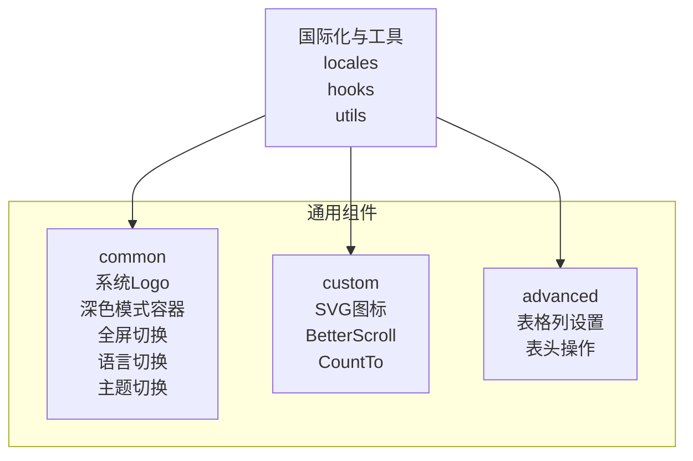

## 核心组件
本节对关键通用组件进行概览式说明，后续章节将逐个深入。

- 系统 Logo：基于 SVG 的矢量图形，通过 CSS 变量控制渐变色彩，适配主题切换。
- 深色模式容器：提供背景与文本色的反转样式，支持插槽承载内容。
- 全屏切换：根据状态渲染不同图标，结合 Tooltip 提示文案。
- 语言切换：下拉选择语言，触发自定义事件，支持 Tooltip 与选项间距美化。
- 主题切换：根据当前主题方案显示对应图标，触发切换事件。
- SVG 图标：统一图标渲染入口，优先本地 SVG 符号，其次 Iconify 图标。
- BetterScroll：封装滚动容器，自动响应尺寸变化并刷新滚动实例。
- CountTo：数值过渡动画组件，支持前缀、后缀、千分位、小数点等格式化。
- 表格列设置：拖拽排序可见列、批量勾选、固定列状态切换。
- 表头操作：封装新增、批量删除、刷新等常用表头操作按钮与插槽。

**章节来源**
- [system-logo.vue:1-161](file://app/web/src/components/common/system-logo.vue#L1-L161)
- [dark-mode-container.vue:1-18](file://app/web/src/components/common/dark-mode-container.vue#L1-L18)
- [full-screen.vue:1-23](file://app/web/src/components/common/full-screen.vue#L1-L23)
- [lang-switch.vue:1-62](file://app/web/src/components/common/lang-switch.vue#L1-L62)
- [theme-schema-switch.vue:1-57](file://app/web/src/components/common/theme-schema-switch.vue#L1-L57)
- [svg-icon.vue:1-55](file://app/web/src/components/custom/svg-icon.vue#L1-L55)
- [better-scroll.vue:1-54](file://app/web/src/components/custom/better-scroll.vue#L1-L54)
- [count-to.vue:1-89](file://app/web/src/components/custom/count-to.vue#L1-L89)
- [table-column-setting.vue:1-118](file://app/web/src/components/advanced/table-column-setting.vue#L1-L118)
- [table-header-operation.vue:1-75](file://app/web/src/components/advanced/table-header-operation.vue#L1-L75)

## 架构总览
通用组件遵循“低耦合、高内聚”的原则，通过统一的图标系统、国际化与主题体系支撑基础能力；高级组件以模型驱动的方式管理表格列状态，形成清晰的数据流与交互链路。

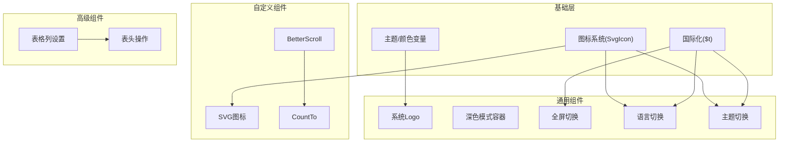

**图表来源**
- [system-logo.vue:152-161](file://app/web/src/components/common/system-logo.vue#L152-L161)
- [full-screen.vue:16-20](file://app/web/src/components/common/full-screen.vue#L16-L20)
- [lang-switch.vue:52-58](file://app/web/src/components/common/lang-switch.vue#L52-L58)
- [theme-schema-switch.vue:48-54](file://app/web/src/components/common/theme-schema-switch.vue#L48-L54)
- [svg-icon.vue:43-52](file://app/web/src/components/custom/svg-icon.vue#L43-L52)
- [table-column-setting.vue:63-115](file://app/web/src/components/advanced/table-column-setting.vue#L63-L115)
- [table-header-operation.vue:41-72](file://app/web/src/components/advanced/table-header-operation.vue#L41-L72)

## 详细组件分析

### 系统 Logo 组件
- 功能要点
  - 使用 SVG 路径绘制品牌标识，通过多个线性渐变填充不同区域，增强视觉层次。
  - 渐变色值通过 CSS 变量映射到主题色系，实现与主题联动。
- Props 与插槽
  - 无 Props，无插槽；通过全局主题变量控制外观。
- 样式定制
  - 通过覆盖 CSS 变量即可改变颜色方案，无需修改组件内部。
- 可访问性
  - 作为装饰性 Logo，未提供额外语义属性；若需提升可访问性，可在父容器中添加描述性文本或 ARIA 属性。

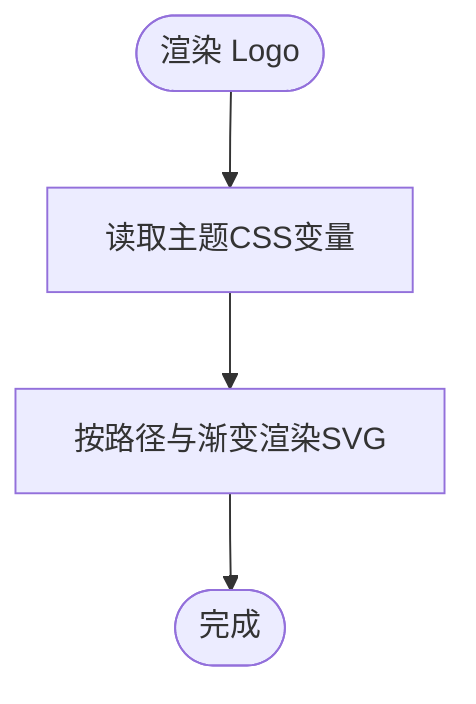

**图表来源**
- [system-logo.vue:11-61](file://app/web/src/components/common/system-logo.vue#L11-L61)
- [system-logo.vue:62-147](file://app/web/src/components/common/system-logo.vue#L62-L147)
- [system-logo.vue:152-161](file://app/web/src/components/common/system-logo.vue#L152-L161)

**章节来源**
- [system-logo.vue:1-161](file://app/web/src/components/common/system-logo.vue#L1-L161)

### 深色模式容器
- 功能要点
  - 提供统一的背景与文本色容器，支持 inverted 反转模式，便于在深色/浅色背景下切换对比度。
- Props
  - inverted: 是否启用反转样式。
- 插槽
  - 默认插槽承载子内容。
- 样式定制
  - 通过类名组合与主题变量实现灵活切换。

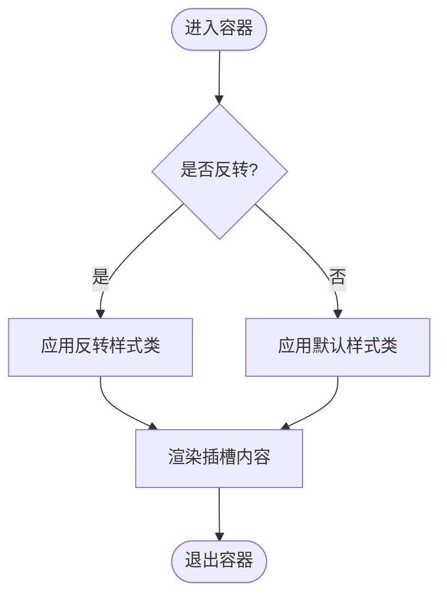

**图表来源**
- [dark-mode-container.vue:11-15](file://app/web/src/components/common/dark-mode-container.vue#L11-L15)

**章节来源**
- [dark-mode-container.vue:1-18](file://app/web/src/components/common/dark-mode-container.vue#L1-L18)

### 全屏切换
- 功能要点
  - 根据传入的 full 状态决定渲染全屏或退出全屏图标，并通过 Tooltip 显示提示文案。
- Props
  - full: 当前是否处于全屏状态。
- 插槽
  - 无；内部使用 ButtonIcon 与图标组件。
- 国际化
  - Tooltip 文案来自国际化模块。

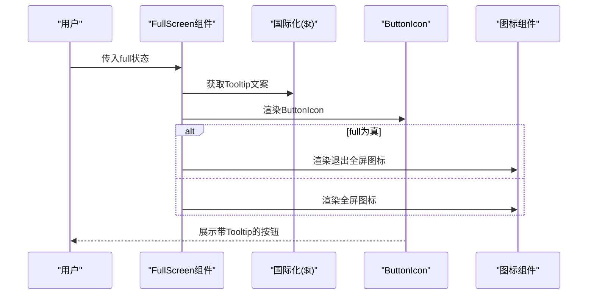

**图表来源**
- [full-screen.vue:16-20](file://app/web/src/components/common/full-screen.vue#L16-L20)
- [full-screen.vue:16-19](file://app/web/src/components/common/full-screen.vue#L16-L19)

**章节来源**
- [full-screen.vue:1-23](file://app/web/src/components/common/full-screen.vue#L1-L23)

### 语言切换
- 功能要点
  - 下拉选择语言，触发 changeLang 事件；支持 Tooltip 与选项底部间距美化。
- Props
  - lang: 当前语言类型
  - langOptions: 语言选项数组
  - showTooltip: 是否显示 Tooltip
- 事件
  - changeLang(lang): 选择语言时触发
- 插槽
  - 无；内部使用 NDropdown 与 ButtonIcon/SvgIcon。
- 样式定制
  - 通过选项 props 的 class 控制间距，保持视觉一致性。

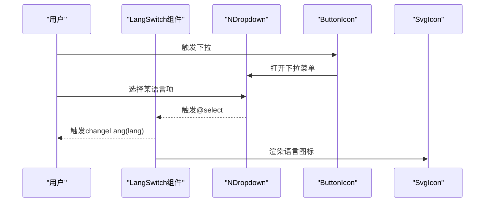

**图表来源**
- [lang-switch.vue:52-58](file://app/web/src/components/common/lang-switch.vue#L52-L58)
- [lang-switch.vue:46-48](file://app/web/src/components/common/lang-switch.vue#L46-L48)

**章节来源**
- [lang-switch.vue:1-62](file://app/web/src/components/common/lang-switch.vue#L1-L62)

### 主题切换
- 功能要点
  - 根据当前主题方案（亮/暗/自动）显示对应图标，点击触发 switch 事件。
- Props
  - themeSchema: 当前主题方案
  - showTooltip: 是否显示 Tooltip
  - tooltipPlacement: Tooltip 方向
- 事件
  - switch: 切换主题时触发
- 插槽
  - 无；内部使用 ButtonIcon。

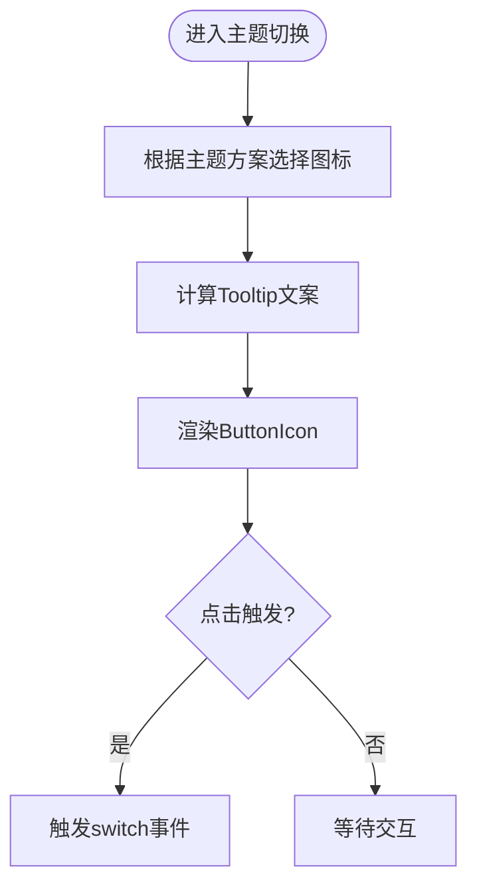

**图表来源**
- [theme-schema-switch.vue:32-38](file://app/web/src/components/common/theme-schema-switch.vue#L32-L38)
- [theme-schema-switch.vue:40-44](file://app/web/src/components/common/theme-schema-switch.vue#L40-L44)
- [theme-schema-switch.vue:48-54](file://app/web/src/components/common/theme-schema-switch.vue#L48-L54)

**章节来源**
- [theme-schema-switch.vue:1-57](file://app/web/src/components/common/theme-schema-switch.vue#L1-L57)

### SVG 图标
- 功能要点
  - 统一图标渲染入口，优先渲染本地 SVG 符号，否则回退到 Iconify 图标。
  - 支持透传类名与样式，保证与外部布局一致。
- Props
  - icon?: Iconify 图标名称
  - localIcon?: 本地 SVG 图标名称
- 插槽
  - 无；内部使用 Icon 或 SVG use。
- 样式定制
  - 通过透传 class/style 实现尺寸、颜色等定制。

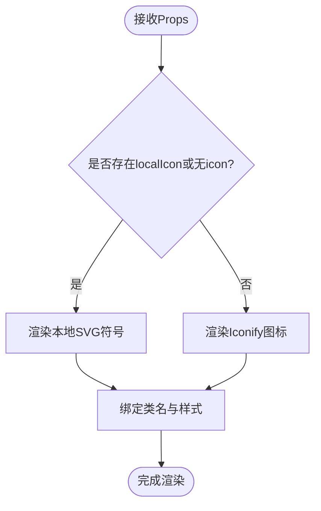

**图表来源**
- [svg-icon.vue:29-41](file://app/web/src/components/custom/svg-icon.vue#L29-L41)
- [svg-icon.vue:43-52](file://app/web/src/components/custom/svg-icon.vue#L43-L52)

**章节来源**
- [svg-icon.vue:1-55](file://app/web/src/components/custom/svg-icon.vue#L1-L55)

### BetterScroll
- 功能要点
  - 封装 BetterScroll，自动监听容器与内容尺寸变化并刷新滚动实例。
- Props
  - options: BetterScroll 初始化配置
- 插槽
  - 默认插槽承载滚动内容。
- 复用策略
  - 通过 expose 暴露实例，便于外部调用刷新、滚动到指定位置等方法。
- 性能优化
  - 使用尺寸监听避免频繁重排；仅在挂载后初始化实例。

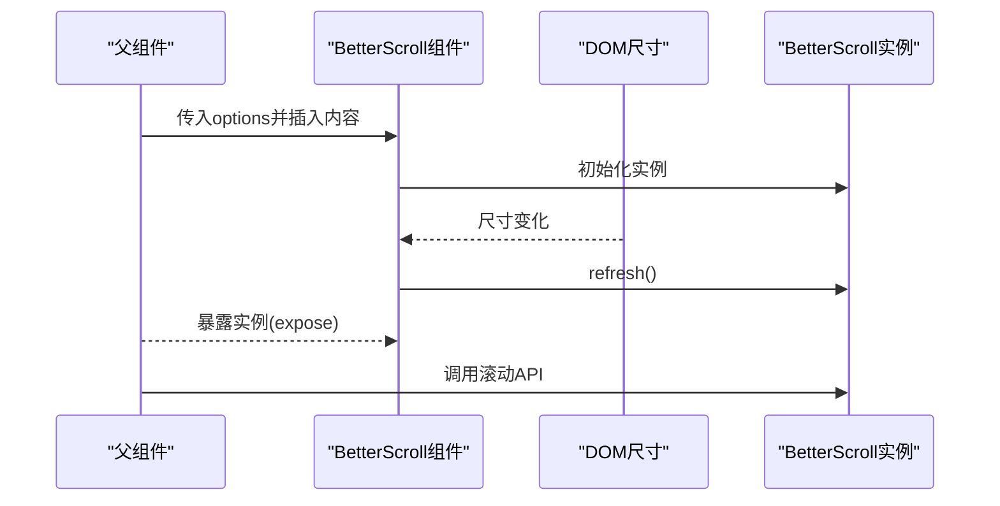

**图表来源**
- [better-scroll.vue:28-42](file://app/web/src/components/custom/better-scroll.vue#L28-L42)
- [better-scroll.vue:34-36](file://app/web/src/components/custom/better-scroll.vue#L34-L36)

**章节来源**
- [better-scroll.vue:1-54](file://app/web/src/components/custom/better-scroll.vue#L1-L54)

### CountTo
- 功能要点
  - 数值过渡动画，支持前缀、后缀、千分位、小数点、缓动曲线与持续时间等配置。
- Props
  - startValue、endValue、duration、autoplay、decimals、prefix、suffix、separator、decimal、useEasing、transition
- 插槽
  - 无；内部直接渲染文本。
- 复用策略
  - 通过 watch 监听起止值变化并在 autoplay 时自动播放；支持外部手动触发 start。
- 性能优化
  - 使用 useTransition 与 nextTick 协调渲染时机，减少不必要的重绘。

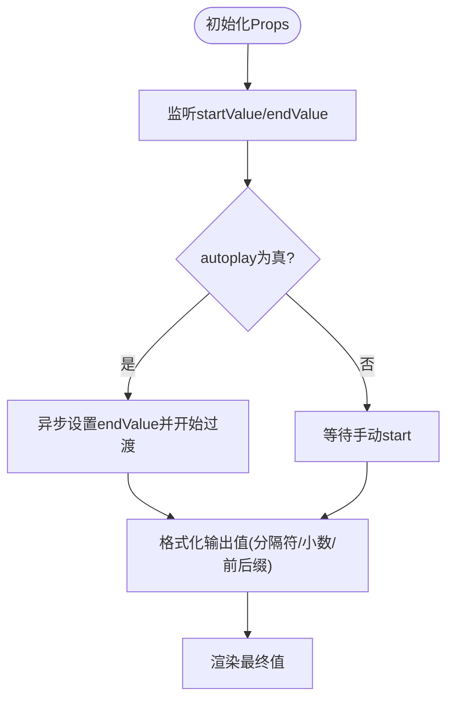

**图表来源**
- [count-to.vue:23-35](file://app/web/src/components/custom/count-to.vue#L23-L35)
- [count-to.vue:73-81](file://app/web/src/components/custom/count-to.vue#L73-L81)
- [count-to.vue:49-66](file://app/web/src/components/custom/count-to.vue#L49-L66)

**章节来源**
- [count-to.vue:1-89](file://app/web/src/components/custom/count-to.vue#L1-L89)

### 表格列设置
- 功能要点
  - 支持拖拽排序列顺序、批量勾选显示列、切换固定状态（左/右/不固定），并统计可见列与勾选情况。
- 数据模型
  - 使用 defineModel 管理 columns（NaiveUI.TableColumnCheck[]），包含 key、title、visible、checked、fixed 等字段。
- 交互逻辑
  - 切换固定状态循环切换三种值；全选/半选状态由可见列与勾选数量计算得出。
- 插槽
  - 无；内部使用 NPopover/NCheckbox/VueDraggable 等组件。

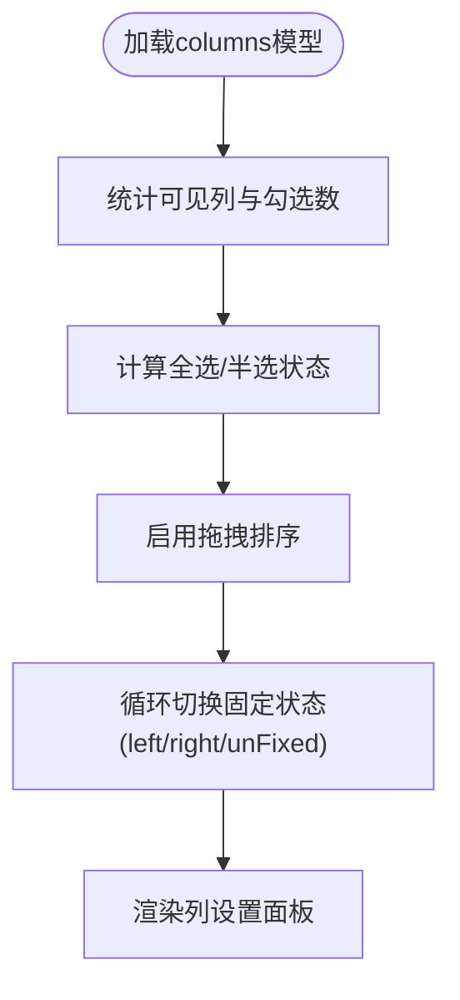

**图表来源**
- [table-column-setting.vue:27-59](file://app/web/src/components/advanced/table-column-setting.vue#L27-L59)
- [table-column-setting.vue:85-112](file://app/web/src/components/advanced/table-column-setting.vue#L85-L112)

**章节来源**
- [table-column-setting.vue:1-118](file://app/web/src/components/advanced/table-column-setting.vue#L1-L118)

### 表头操作
- 功能要点
  - 封装常用表头操作：新增、批量删除（带二次确认）、刷新（带加载旋转动画），并集成表格列设置。
- Props
  - itemAlign: 子项对齐方式
  - disabledDelete: 禁用批量删除
  - loading: 刷新按钮加载态
- 事件
  - add、delete、refresh
- 插槽
  - prefix/suffix：前后置扩展区；default：默认按钮集合。
- 复用策略
  - 通过 defineModel 绑定 columns，与 TableColumnSetting 解耦协作。

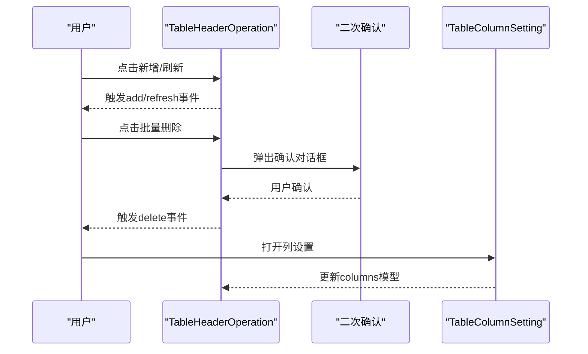

**图表来源**
- [table-header-operation.vue:28-38](file://app/web/src/components/advanced/table-header-operation.vue#L28-L38)
- [table-header-operation.vue:51-68](file://app/web/src/components/advanced/table-header-operation.vue#L51-L68)
- [table-header-operation.vue:69](file://app/web/src/components/advanced/table-header-operation.vue#L69)

**章节来源**
- [table-header-operation.vue:1-75](file://app/web/src/components/advanced/table-header-operation.vue#L1-L75)

## 依赖关系分析
- 组件间依赖
  - 通用组件之间无直接依赖，通过公共图标、国际化与主题体系间接关联。
  - 高级组件（表格列设置、表头操作）通过模型与事件协同工作。
- 外部依赖
  - BetterScroll：滚动容器封装
  - VueUse：useTransition/useElementSize 等
  - Naive UI：下拉、弹出、复选框、按钮等基础 UI 组件
  - Iconify：远程图标渲染

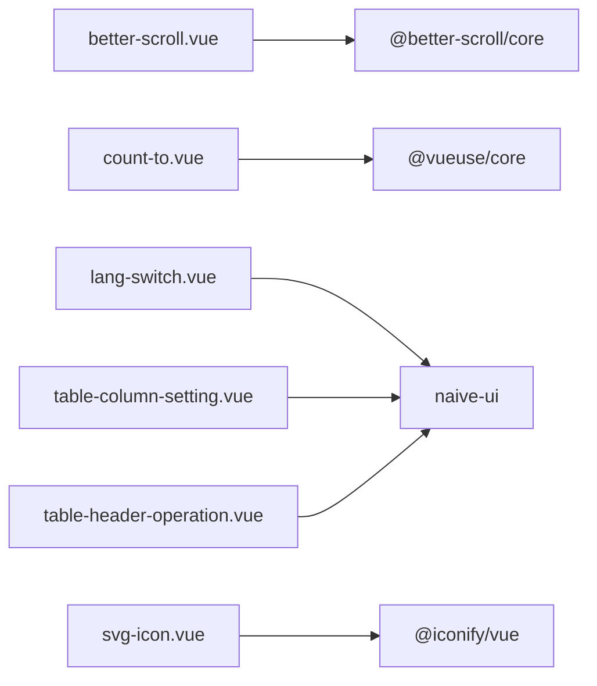

**图表来源**
- [better-scroll.vue:3-5](file://app/web/src/components/custom/better-scroll.vue#L3-L5)
- [count-to.vue:2-4](file://app/web/src/components/custom/count-to.vue#L2-L4)
- [lang-switch.vue:52-58](file://app/web/src/components/common/lang-switch.vue#L52-L58)
- [table-column-setting.vue:2-4](file://app/web/src/components/advanced/table-column-setting.vue#L2-L4)
- [table-header-operation.vue:42-72](file://app/web/src/components/advanced/table-header-operation.vue#L42-L72)
- [svg-icon.vue:3](file://app/web/src/components/custom/svg-icon.vue#L3)

**章节来源**
- [better-scroll.vue:1-54](file://app/web/src/components/custom/better-scroll.vue#L1-L54)
- [count-to.vue:1-89](file://app/web/src/components/custom/count-to.vue#L1-L89)
- [lang-switch.vue:1-62](file://app/web/src/components/common/lang-switch.vue#L1-L62)
- [table-column-setting.vue:1-118](file://app/web/src/components/advanced/table-column-setting.vue#L1-L118)
- [table-header-operation.vue:1-75](file://app/web/src/components/advanced/table-header-operation.vue#L1-L75)
- [svg-icon.vue:1-55](file://app/web/src/components/custom/svg-icon.vue#L1-L55)

## 性能考量
- BetterScroll
  - 使用尺寸监听避免频繁 refresh；仅在容器与内容尺寸变化时刷新，降低重排成本。
- CountTo
  - 使用 useTransition 与 nextTick 协调渲染，减少无效更新；可通过调整 duration 与 transition 控制流畅度与性能。
- 图标系统
  - 本地 SVG 符号优先渲染，减少网络请求；Iconify 图标按需加载，避免一次性引入过多资源。
- 表格列设置
  - 使用虚拟滚动与受控模型，避免大列表全量渲染；拖拽排序时禁用不可拖拽项，减少计算。

## 故障排查指南
- 全屏切换 Tooltip 不显示
  - 检查国际化键是否存在；确认按钮 Tooltip 配置是否正确。
- 语言切换不触发事件
  - 确认父组件是否监听 changeLang；检查下拉选项的 value 与事件回调参数是否匹配。
- BetterScroll 无法滚动
  - 确认容器与内容高度/宽度设置；检查 options 配置；确保在尺寸变化后调用 refresh。
- CountTo 不生效
  - 检查 startValue/endValue 是否变化；确认 autoplay 是否开启；查看 useTransition 的 duration 与 easing。
- 表格列设置不更新
  - 确认 columns 模型已通过 defineModel 正确绑定；检查 visible/checked/fixed 字段是否被修改。

**章节来源**
- [full-screen.vue:16-20](file://app/web/src/components/common/full-screen.vue#L16-L20)
- [lang-switch.vue:46-48](file://app/web/src/components/common/lang-switch.vue#L46-L48)
- [better-scroll.vue:34-36](file://app/web/src/components/custom/better-scroll.vue#L34-L36)
- [count-to.vue:68-71](file://app/web/src/components/custom/count-to.vue#L68-L71)
- [table-column-setting.vue:10-12](file://app/web/src/components/advanced/table-column-setting.vue#L10-L12)

## 结论
通用组件的设计应注重“可配置、可复用、可扩展”。通过统一的图标与国际化体系、合理的 Props/事件/插槽设计以及良好的性能与可访问性实践，可以在多业务场景下快速落地高质量组件。高级组件以模型驱动的方式管理复杂交互，既保证了灵活性，也降低了维护成本。

## 附录
- 组件复用策略
  - 抽象公共能力（图标、主题、国际化）为独立模块，避免重复实现。
  - 使用 defineModel 管理受控状态，便于父子组件解耦协作。
  - 通过 expose 暴露实例方法，满足外部控制需求。
- 可访问性建议
  - 为交互元素提供明确的 ARIA 属性与键盘可达性。
  - 对动态内容变化提供屏幕阅读器友好的提示。
- 扩展方法
  - 在现有组件基础上增加可选 Props 与插槽，保持向后兼容。
  - 通过组合式 API 与工具函数抽象通用逻辑，提升可测试性与可维护性。