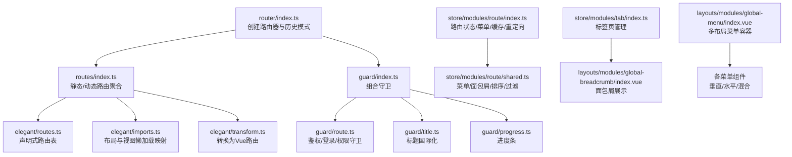
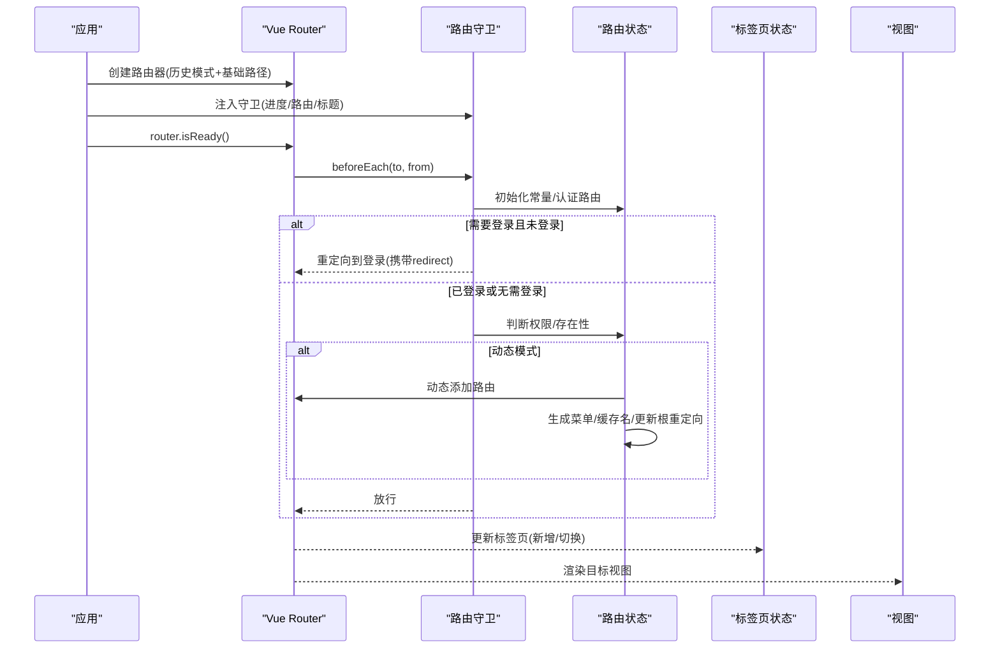
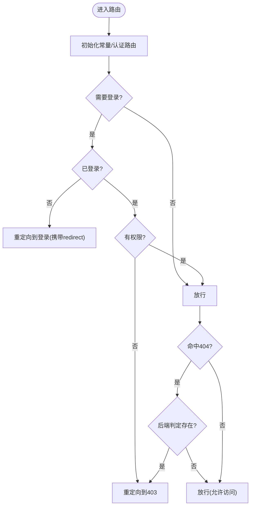
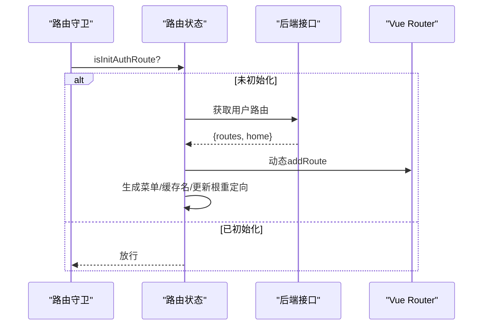
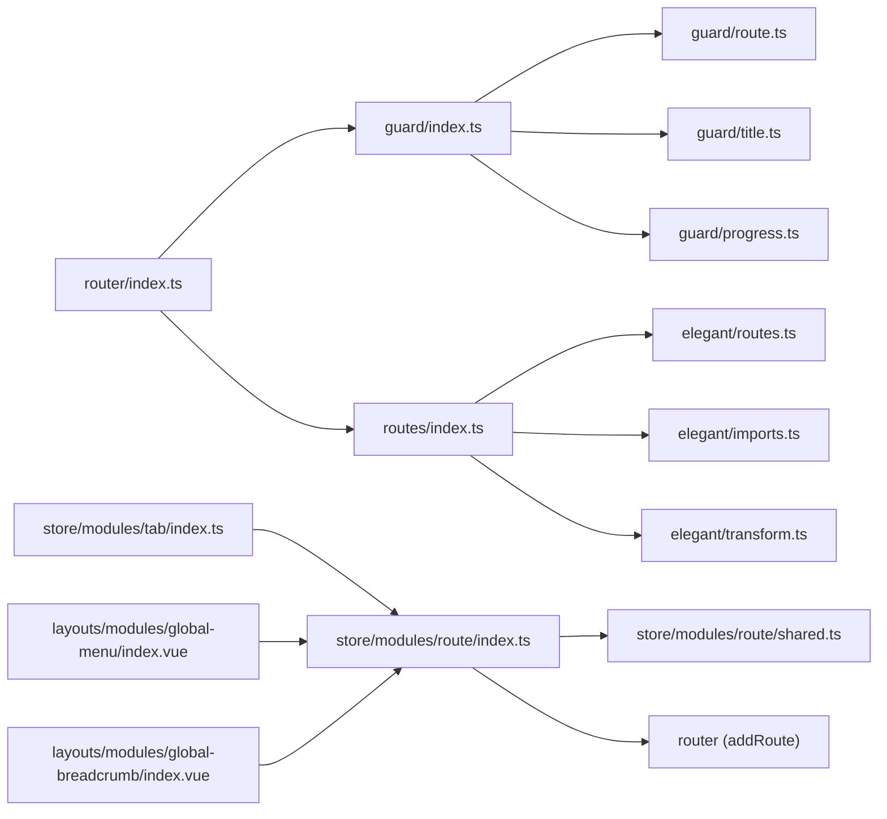

# 路由与导航

<cite>
**本文引用的文件**
- [router/index.ts](file://app/web/src/router/index.ts)
- [routes/index.ts](file://app/web/src/router/routes/index.ts)
- [routes/builtin.ts](file://app/web/src/router/routes/builtin.ts)
- [guard/index.ts](file://app/web/src/router/guard/index.ts)
- [guard/route.ts](file://app/web/src/router/guard/route.ts)
- [guard/title.ts](file://app/web/src/router/guard/title.ts)
- [guard/progress.ts](file://app/web/src/router/guard/progress.ts)
- [elegant/routes.ts](file://app/web/src/router/elegant/routes.ts)
- [elegant/imports.ts](file://app/web/src/router/elegant/imports.ts)
- [elegant/transform.ts](file://app/web/src/router/elegant/transform.ts)
- [store/modules/route/index.ts](file://app/web/src/store/modules/route/index.ts)
- [store/modules/route/shared.ts](file://app/web/src/store/modules/route/shared.ts)
- [store/modules/tab/index.ts](file://app/web/src/store/modules/tab/index.ts)
- [layouts/modules/global-menu/index.vue](file://app/web/src/layouts/modules/global-menu/index.vue)
- [layouts/modules/global-breadcrumb/index.vue](file://app/web/src/layouts/modules/global-breadcrumb/index.vue)
</cite>

## 目录
1. [简介](#简介)
2. [项目结构](#项目结构)
3. [核心组件](#核心组件)
4. [架构总览](#架构总览)
5. [详细组件分析](#详细组件分析)
6. [依赖关系分析](#依赖关系分析)
7. [性能考量](#性能考量)
8. [故障排查指南](#故障排查指南)
9. [结论](#结论)
10. [附录](#附录)

## 简介
本文件系统性梳理前端路由与导航体系，覆盖 Vue Router 配置、路由守卫、动态/静态路由、嵌套路由、权限控制、面包屑生成、页面标题设置、路由懒加载与缓存、导航菜单与侧边栏联动、标签页管理、多布局切换与混合模式导航等主题。内容以代码为依据，配合图示帮助不同背景读者理解。

## 项目结构
路由与导航相关代码主要分布在以下位置：
- 路由入口与历史模式：router/index.ts
- 路由定义与转换：router/elegant/*（routes.ts、imports.ts、transform.ts）
- 路由注册与内置路由：router/routes/*
- 路由守卫：router/guard/*
- 状态管理：store/modules/route、store/modules/tab
- 导航视图：layouts/modules/*

图表来源
- [router/index.ts:1-31](file://app/web/src/router/index.ts#L1-L31)
- [routes/index.ts:1-41](file://app/web/src/router/routes/index.ts#L1-L41)
- [elegant/routes.ts:1-250](file://app/web/src/router/elegant/routes.ts#L1-L250)
- [elegant/imports.ts:1-40](file://app/web/src/router/elegant/imports.ts#L1-L40)
- [elegant/transform.ts:1-211](file://app/web/src/router/elegant/transform.ts#L1-L211)
- [guard/index.ts:1-16](file://app/web/src/router/guard/index.ts#L1-L16)
- [guard/route.ts:1-178](file://app/web/src/router/guard/route.ts#L1-L178)
- [guard/title.ts:1-14](file://app/web/src/router/guard/title.ts#L1-L14)
- [guard/progress.ts:1-12](file://app/web/src/router/guard/progress.ts#L1-L12)
- [store/modules/route/index.ts:1-387](file://app/web/src/store/modules/route/index.ts#L1-L387)
- [store/modules/route/shared.ts:1-336](file://app/web/src/store/modules/route/shared.ts#L1-L336)
- [store/modules/tab/index.ts:1-386](file://app/web/src/store/modules/tab/index.ts#L1-L386)
- [layouts/modules/global-menu/index.vue:1-41](file://app/web/src/layouts/modules/global-menu/index.vue#L1-L41)
- [layouts/modules/global-breadcrumb/index.vue:1-48](file://app/web/src/layouts/modules/global-breadcrumb/index.vue#L1-L48)

章节来源
- [router/index.ts:1-31](file://app/web/src/router/index.ts#L1-L31)
- [routes/index.ts:1-41](file://app/web/src/router/routes/index.ts#L1-L41)
- [elegant/routes.ts:1-250](file://app/web/src/router/elegant/routes.ts#L1-L250)
- [elegant/imports.ts:1-40](file://app/web/src/router/elegant/imports.ts#L1-L40)
- [elegant/transform.ts:1-211](file://app/web/src/router/elegant/transform.ts#L1-L211)

## 核心组件
- 路由器创建与历史模式选择：根据环境变量选择 hash/history/memory，支持基础路径前缀。
- 声明式路由表：通过 Elegant Router 的声明式语法定义路由，自动转换为 Vue Router 可识别的结构。
- 路由守卫：统一注入进度条、鉴权、登录态与权限校验、文档标题国际化。
- 路由状态管理：负责常量/认证路由初始化、动态菜单生成、面包屑、缓存路由名、根路由重定向更新。
- 标签页管理：记录当前路由标签、固定/关闭标签、跨标签缓存清理、本地持久化。
- 导航视图：全局菜单容器按主题布局模式动态渲染不同菜单组件；面包屑基于菜单与当前路由生成。

章节来源
- [router/index.ts:12-31](file://app/web/src/router/index.ts#L12-L31)
- [elegant/routes.ts:8-249](file://app/web/src/router/elegant/routes.ts#L8-L249)
- [elegant/imports.ts:12-39](file://app/web/src/router/elegant/imports.ts#L12-L39)
- [elegant/transform.ts:16-158](file://app/web/src/router/elegant/transform.ts#L16-L158)
- [guard/index.ts:11-15](file://app/web/src/router/guard/index.ts#L11-L15)
- [guard/route.ts:14-57](file://app/web/src/router/guard/route.ts#L14-L57)
- [guard/title.ts:5-13](file://app/web/src/router/guard/title.ts#L5-L13)
- [guard/progress.ts:3-11](file://app/web/src/router/guard/progress.ts#L3-L11)
- [store/modules/route/index.ts:26-386](file://app/web/src/store/modules/route/index.ts#L26-L386)
- [store/modules/tab/index.ts:26-386](file://app/web/src/store/modules/tab/index.ts#L26-L386)
- [layouts/modules/global-menu/index.vue:20-37](file://app/web/src/layouts/modules/global-menu/index.vue#L20-L37)
- [layouts/modules/global-breadcrumb/index.vue:27-44](file://app/web/src/layouts/modules/global-breadcrumb/index.vue#L27-L44)

## 架构总览
整体流程：应用启动时创建路由器，注入守卫；首次访问触发“常量路由初始化”和“认证路由初始化”，随后根据模式（静态/动态）生成菜单、缓存路由名、设置根路由重定向；路由切换时更新标签页、面包屑、标题与进度条。

图表来源
- [router/index.ts:25-30](file://app/web/src/router/index.ts#L25-L30)
- [guard/index.ts:11-15](file://app/web/src/router/guard/index.ts#L11-L15)
- [guard/route.ts:64-151](file://app/web/src/router/guard/route.ts#L64-L151)
- [store/modules/route/index.ts:181-285](file://app/web/src/store/modules/route/index.ts#L181-L285)
- [store/modules/tab/index.ts:78-91](file://app/web/src/store/modules/tab/index.ts#L78-L91)

## 详细组件分析

### 路由器创建与历史模式
- 历史模式选择：根据环境变量决定 hash/history/memory，并支持基础路径前缀。
- 内置路由：根重定向与 404 等常量路由在构建时注入，确保基础导航可用。
- 路由注册：将 Elegant 路由转换为 Vue 路由后一次性注册。

章节来源
- [router/index.ts:12-31](file://app/web/src/router/index.ts#L12-L31)
- [routes/builtin.ts:29-31](file://app/web/src/router/routes/builtin.ts#L29-L31)

### 声明式路由与嵌套路由
- 声明式路由：通过 name/path/component/meta/children 等字段描述路由，支持单层与嵌套。
- 组件映射：layout.* 与 view.* 作为占位符，运行时映射到具体组件或懒加载函数。
- 转换规则：将声明式路由转换为 Vue Router 的 RouteRecordRaw 结构，处理重定向、props、keepAlive 等。

章节来源
- [elegant/routes.ts:8-249](file://app/web/src/router/elegant/routes.ts#L8-L249)
- [elegant/imports.ts:12-39](file://app/web/src/router/elegant/imports.ts#L12-L39)
- [elegant/transform.ts:16-158](file://app/web/src/router/elegant/transform.ts#L16-L158)

### 路由守卫体系
- 进度条守卫：进入前启动，离开后完成。
- 文档标题守卫：根据 meta.i18nKey 或 title 设置页面标题。
- 路由守卫：统一处理登录态、权限、常量/认证路由初始化、动态路由存在性检查、错误页跳转。

图表来源
- [guard/route.ts:14-151](file://app/web/src/router/guard/route.ts#L14-L151)
- [guard/progress.ts:3-11](file://app/web/src/router/guard/progress.ts#L3-L11)
- [guard/title.ts:5-13](file://app/web/src/router/guard/title.ts#L5-L13)

章节来源
- [guard/index.ts:11-15](file://app/web/src/router/guard/index.ts#L11-L15)
- [guard/route.ts:14-151](file://app/web/src/router/guard/route.ts#L14-L151)
- [guard/title.ts:5-13](file://app/web/src/router/guard/title.ts#L5-L13)
- [guard/progress.ts:3-11](file://app/web/src/router/guard/progress.ts#L3-L11)

### 权限控制与动态路由
- 静态模式：前端静态生成认证路由，按用户角色过滤后注入。
- 动态模式：后端返回用户路由与首页标识，前端注入路由、生成菜单树、更新根重定向。
- 存在性校验：对 404 捕获的路由向后端查询是否存在，决定 403 或放行。

图表来源
- [guard/route.ts:109-128](file://app/web/src/router/guard/route.ts#L109-L128)
- [store/modules/route/index.ts:206-262](file://app/web/src/store/modules/route/index.ts#L206-L262)

章节来源
- [store/modules/route/index.ts:181-285](file://app/web/src/store/modules/route/index.ts#L181-L285)
- [guard/route.ts:64-151](file://app/web/src/router/guard/route.ts#L64-L151)

### 面包屑与页面标题
- 面包屑：基于菜单树与当前路由生成，支持下拉选项与点击跳转。
- 标题：优先使用 meta.i18nKey 对应的国际化文本，否则回退到 title。

章节来源
- [layouts/modules/global-breadcrumb/index.vue:27-44](file://app/web/src/layouts/modules/global-breadcrumb/index.vue#L27-L44)
- [store/modules/route/shared.ts:282-316](file://app/web/src/store/modules/route/shared.ts#L282-L316)
- [guard/title.ts:5-13](file://app/web/src/router/guard/title.ts#L5-L13)

### 路由懒加载与缓存机制
- 懒加载：视图组件通过函数返回 import(...) 实现按需加载。
- 缓存策略：通过 meta.keepAlive 标记的路由加入缓存白名单；标签页关闭时可触发缓存清理。
- 根据环境变量选择路由历史模式，影响 URL 形态与部署方式。

章节来源
- [elegant/imports.ts:17-39](file://app/web/src/router/elegant/imports.ts#L17-L39)
- [store/modules/route/shared.ts:152-165](file://app/web/src/store/modules/route/shared.ts#L152-L165)
- [store/modules/tab/index.ts:116-118](file://app/web/src/store/modules/tab/index.ts#L116-L118)
- [router/index.ts:12-18](file://app/web/src/router/index.ts#L12-L18)

### 导航菜单生成与侧边栏联动
- 多布局菜单：根据主题布局模式动态渲染不同菜单组件（垂直/水平/混合）。
- 菜单来源：静态模式从全量路由生成；动态模式使用后端返回的菜单树驱动。
- 选中路径：根据当前路由键计算选中菜单的 key 路径，用于高亮与展开。

章节来源
- [layouts/modules/global-menu/index.vue:20-37](file://app/web/src/layouts/modules/global-menu/index.vue#L20-L37)
- [store/modules/route/index.ts:276-282](file://app/web/src/store/modules/route/index.ts#L276-L282)
- [store/modules/route/shared.ts:203-255](file://app/web/src/store/modules/route/shared.ts#L203-L255)

### 标签页管理
- 新增/切换：进入新路由时添加标签，激活对应标签。
- 关闭策略：支持关闭当前、左侧、右侧、全部；固定标签不可被普通关闭。
- 缓存清理：关闭标签时根据其路由键重置缓存，避免内存泄漏。
- 本地持久化：窗口卸载时缓存标签列表，刷新后恢复。

章节来源
- [store/modules/tab/index.ts:78-91](file://app/web/src/store/modules/tab/index.ts#L78-L91)
- [store/modules/tab/index.ts:98-118](file://app/web/src/store/modules/tab/index.ts#L98-L118)
- [store/modules/tab/index.ts:142-185](file://app/web/src/store/modules/tab/index.ts#L142-L185)
- [store/modules/tab/index.ts:356-358](file://app/web/src/store/modules/tab/index.ts#L356-L358)

### 多布局切换与混合模式导航
- 布局模式：支持 vertical、horizontal、vertical-mix、vertical-hybrid-header-first、top-hybrid-sidebar-first、top-hybrid-header-first 等。
- 菜单组件：按布局模式映射到具体菜单组件，实现不同导航形态。
- 移动端适配：当布局为 vertical 且移动端时，强制重新渲染以保证交互体验。

章节来源
- [layouts/modules/global-menu/index.vue:20-37](file://app/web/src/layouts/modules/global-menu/index.vue#L20-L37)

## 依赖关系分析
- 路由器依赖：路由守卫 -> 路由状态 -> 标签页状态 -> 视图组件。
- 路由状态依赖：Elegant 路由表、导入映射、转换器；与后端接口交互以支持动态模式。
- 导航视图依赖：主题布局模式与菜单组件映射，以及路由状态提供的菜单与面包屑数据。

图表来源
- [router/index.ts:1-31](file://app/web/src/router/index.ts#L1-L31)
- [guard/index.ts:1-16](file://app/web/src/router/guard/index.ts#L1-L16)
- [guard/route.ts:1-178](file://app/web/src/router/guard/route.ts#L1-L178)
- [guard/title.ts:1-14](file://app/web/src/router/guard/title.ts#L1-L14)
- [guard/progress.ts:1-12](file://app/web/src/router/guard/progress.ts#L1-L12)
- [routes/index.ts:1-41](file://app/web/src/router/routes/index.ts#L1-L41)
- [elegant/routes.ts:1-250](file://app/web/src/router/elegant/routes.ts#L1-L250)
- [elegant/imports.ts:1-40](file://app/web/src/router/elegant/imports.ts#L1-L40)
- [elegant/transform.ts:1-211](file://app/web/src/router/elegant/transform.ts#L1-L211)
- [store/modules/route/index.ts:1-387](file://app/web/src/store/modules/route/index.ts#L1-L387)
- [store/modules/route/shared.ts:1-336](file://app/web/src/store/modules/route/shared.ts#L1-L336)
- [store/modules/tab/index.ts:1-386](file://app/web/src/store/modules/tab/index.ts#L1-L386)
- [layouts/modules/global-menu/index.vue:1-41](file://app/web/src/layouts/modules/global-menu/index.vue#L1-L41)
- [layouts/modules/global-breadcrumb/index.vue:1-48](file://app/web/src/layouts/modules/global-breadcrumb/index.vue#L1-L48)

## 性能考量
- 路由懒加载：视图组件采用动态 import，减少首屏体积，提升初始加载速度。
- 路由缓存：仅对标记 keepAlive 的末级路由进行缓存，降低重复渲染成本。
- 标签页缓存清理：关闭标签时按路由键重置缓存，避免长期驻留导致内存增长。
- 进度条：轻量的 NProgress 进度指示，避免阻塞导航主流程。
- 动态路由：在未初始化时拦截并重定向，避免无效渲染与重复请求。

## 故障排查指南
- 登录循环跳转
  - 现象：登录成功后仍反复跳转到登录页。
  - 排查：确认本地存储 token 是否存在；检查守卫中的登录态判断逻辑与重定向参数。
  - 参考
    - [guard/route.ts:27-47](file://app/web/src/router/guard/route.ts#L27-L47)
- 无权限访问
  - 现象：访问受控路由后跳转 403。
  - 排查：确认用户角色是否包含路由 meta.roles；静态模式下检查角色过滤逻辑。
  - 参考
    - [guard/route.ts:29-52](file://app/web/src/router/guard/route.ts#L29-L52)
    - [store/modules/route/shared.ts:12-43](file://app/web/src/store/modules/route/shared.ts#L12-L43)
- 404 页面误判
  - 现象：路由存在但被重定向到 403。
  - 排查：确认动态模式下后端对路由存在性的校验结果；检查路由名称映射。
  - 参考
    - [guard/route.ts:138-150](file://app/web/src/router/guard/route.ts#L138-L150)
    - [store/modules/route/index.ts:328-347](file://app/web/src/store/modules/route/index.ts#L328-L347)
- 标题未国际化
  - 现象：页面标题显示为 i18nKey 文本而非翻译。
  - 排查：确认 meta.i18nKey 是否正确；检查国际化资源是否加载。
  - 参考
    - [guard/title.ts:7-11](file://app/web/src/router/guard/title.ts#L7-L11)
- 根重定向异常
  - 现象：登录后未跳转到期望首页。
  - 排查：确认动态模式下的首页标识与根路由重定向更新逻辑。
  - 参考
    - [store/modules/route/index.ts:313-325](file://app/web/src/store/modules/route/index.ts#L313-L325)
- 标签页缓存未清理
  - 现象：关闭标签后内存未释放。
  - 排查：确认关闭标签时是否调用缓存重置；检查路由键是否正确。
  - 参考
    - [store/modules/tab/index.ts:116-118](file://app/web/src/store/modules/tab/index.ts#L116-L118)

## 结论
该路由与导航体系以 Elegant Router 为核心，结合守卫、状态管理与视图模块，实现了从静态到动态的灵活路由模式、完善的权限控制、可扩展的多布局菜单与标签页管理。通过懒加载与缓存策略优化性能，借助进度条与标题国际化提升用户体验。建议在生产环境优先采用动态模式以获得更灵活的菜单与权限控制能力。

## 附录
- 配置项与默认值
  - 路由历史模式：history/hash/memory，默认 history
  - 基础路径：VITE_BASE_URL
  - 认证路由模式：VITE_AUTH_ROUTE_MODE（开发推荐 static，生产推荐 dynamic）
  - 首页路由键：VITE_ROUTE_HOME
- 关键流程参考
  - 路由守卫初始化与登录态判断：[guard/route.ts:14-57](file://app/web/src/router/guard/route.ts#L14-L57)
  - 动态路由注入与菜单生成：[store/modules/route/index.ts:240-282](file://app/web/src/store/modules/route/index.ts#L240-L282)
  - 标签页新增与缓存清理：[store/modules/tab/index.ts:78-118](file://app/web/src/store/modules/tab/index.ts#L78-L118)