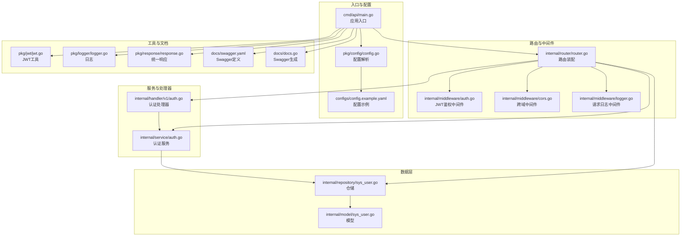
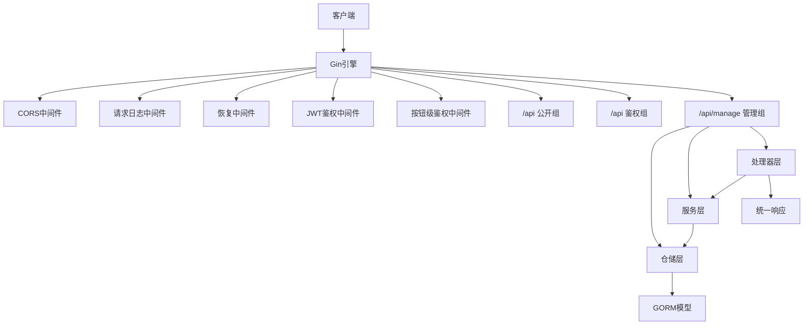
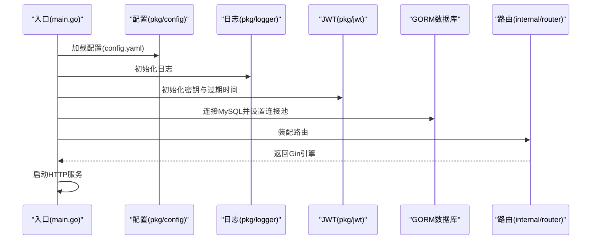
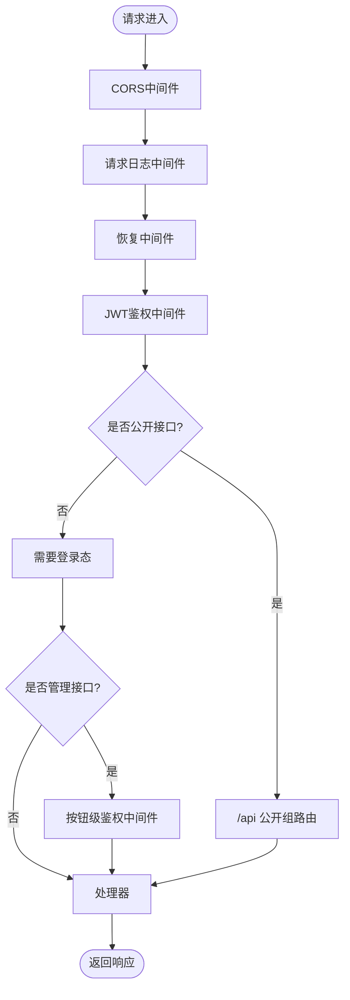
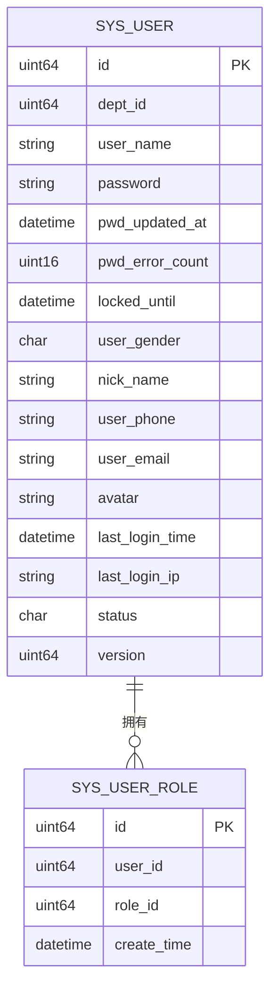
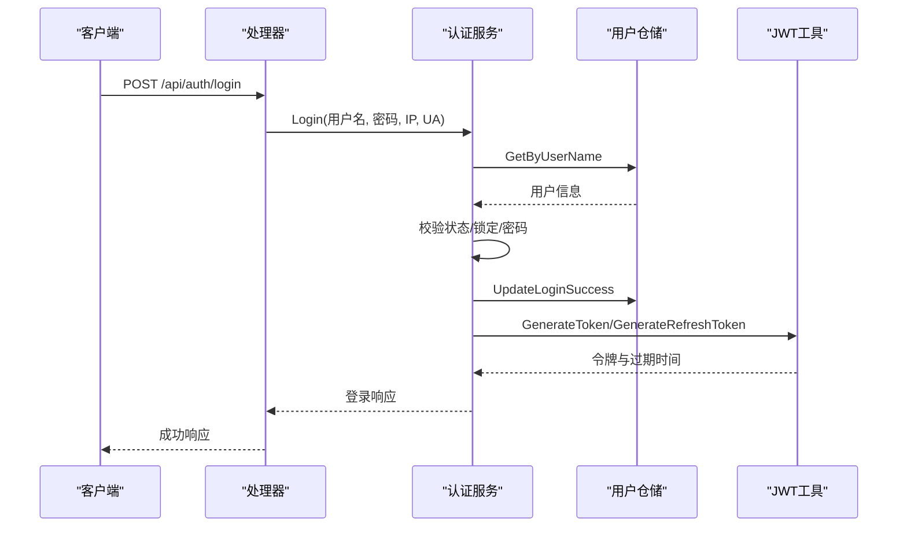
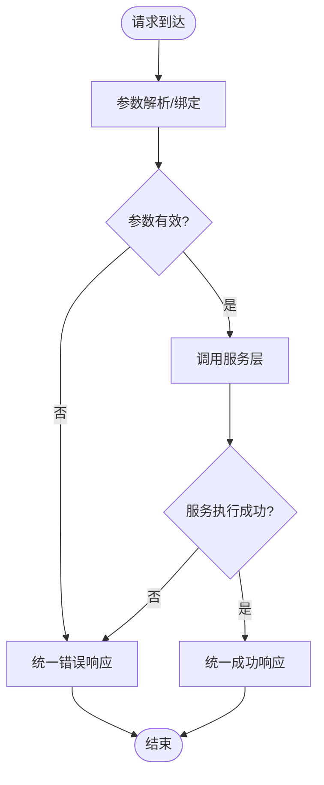
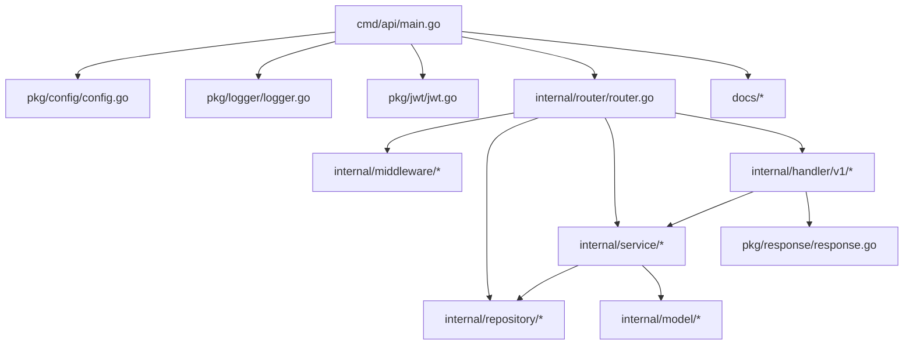

# 后端开发

<cite>
**本文引用的文件**
- [main.go](file://app/server/cmd/api/main.go)
- [go.mod](file://app/server/go.mod)
- [config.example.yaml](file://app/server/configs/config.example.yaml)
- [router.go](file://app/server/internal/router/router.go)
- [config.go](file://app/server/pkg/config/config.go)
- [jwt.go](file://app/server/pkg/jwt/jwt.go)
- [logger.go](file://app/server/pkg/logger/logger.go)
- [response.go](file://app/server/pkg/response/response.go)
- [auth.go（中间件）](file://app/server/internal/middleware/auth.go)
- [sys_user.go（模型）](file://app/server/internal/model/sys_user.go)
- [sys_user.go（仓库）](file://app/server/internal/repository/sys_user.go)
- [auth.go（服务）](file://app/server/internal/service/auth.go)
- [auth.go（处理器）](file://app/server/internal/handler/v1/auth.go)
- [swagger.yaml](file://app/server/docs/swagger.yaml)
- [docs.go](file://app/server/docs/docs.go)
</cite>

## 目录
1. [简介](#简介)
2. [项目结构](#项目结构)
3. [核心组件](#核心组件)
4. [架构总览](#架构总览)
5. [详细组件分析](#详细组件分析)
6. [依赖关系分析](#依赖关系分析)
7. [性能考量](#性能考量)
8. [故障排查指南](#故障排查指南)
9. [结论](#结论)
10. [附录](#附录)

## 简介
本指南面向boread后端开发，围绕基于Go语言的RESTful API进行系统化讲解，涵盖项目结构与包组织、中间件设计、路由配置、数据库设计与ORM使用、事务管理与连接池、JWT认证与权限控制、日志与错误处理、Swagger API文档自动生成、单元测试与性能监控、以及DTO与服务层架构模式等主题。目标是帮助开发者快速理解并高效扩展后端能力。

## 项目结构
后端采用清晰的分层架构：入口程序负责配置加载、数据库连接与路由装配；内部模块按职责划分为路由、中间件、数据模型、仓储、服务与处理器；工具包提供配置、JWT、日志与统一响应封装；文档模块通过Swagger生成API文档。

**图表来源**
- [main.go:30-84](file://app/server/cmd/api/main.go#L30-L84)
- [router.go:15-205](file://app/server/internal/router/router.go#L15-L205)
- [config.go:58-66](file://app/server/pkg/config/config.go#L58-L66)
- [jwt.go:19-71](file://app/server/pkg/jwt/jwt.go#L19-L71)
- [logger.go:13-52](file://app/server/pkg/logger/logger.go#L13-L52)
- [response.go:15-37](file://app/server/pkg/response/response.go#L15-L37)
- [sys_user.go（模型）:6-25](file://app/server/internal/model/sys_user.go#L6-L25)
- [sys_user.go（仓库）:21-196](file://app/server/internal/repository/sys_user.go#L21-L196)
- [auth.go（服务）:37-39](file://app/server/internal/service/auth.go#L37-L39)
- [auth.go（处理器）:19-21](file://app/server/internal/handler/v1/auth.go#L19-L21)
- [swagger.yaml:1-200](file://app/server/docs/swagger.yaml#L1-L200)
- [docs.go:6-100](file://app/server/docs/docs.go#L6-L100)

**章节来源**
- [main.go:30-84](file://app/server/cmd/api/main.go#L30-L84)
- [router.go:15-205](file://app/server/internal/router/router.go#L15-L205)
- [config.go:58-66](file://app/server/pkg/config/config.go#L58-L66)
- [jwt.go:19-71](file://app/server/pkg/jwt/jwt.go#L19-L71)
- [logger.go:13-52](file://app/server/pkg/logger/logger.go#L13-L52)
- [response.go:15-37](file://app/server/pkg/response/response.go#L15-L37)
- [sys_user.go（模型）:6-25](file://app/server/internal/model/sys_user.go#L6-L25)
- [sys_user.go（仓库）:21-196](file://app/server/internal/repository/sys_user.go#L21-L196)
- [auth.go（服务）:37-39](file://app/server/internal/service/auth.go#L37-L39)
- [auth.go（处理器）:19-21](file://app/server/internal/handler/v1/auth.go#L19-L21)
- [swagger.yaml:1-200](file://app/server/docs/swagger.yaml#L1-L200)
- [docs.go:6-100](file://app/server/docs/docs.go#L6-L100)

## 核心组件
- 应用入口与配置
  - 加载配置、初始化日志、JWT、数据库连接与连接池、种子模式、路由装配与启动HTTP服务。
- 路由与中间件
  - 统一注册健康检查、Swagger UI、CORS、请求日志与恢复中间件；按组划分公开、登录态与受保护管理接口；在管理接口上叠加按钮级鉴权中间件。
- 数据层
  - GORM模型定义与仓储方法，支持分页、条件查询、角色与按钮权限聚合、菜单树构建等。
- 服务层
  - 认证服务包含登录风控、签发JWT、用户信息与菜单树构建、登录日志写入等。
- 处理器层
  - 统一接收请求、参数校验、调用服务、返回统一响应格式。
- 工具与文档
  - 配置解析、JWT签发与解析、Zap日志、统一响应封装；Swagger注解与生成。

**章节来源**
- [main.go:34-84](file://app/server/cmd/api/main.go#L34-L84)
- [router.go:15-205](file://app/server/internal/router/router.go#L15-L205)
- [sys_user.go（仓库）:21-196](file://app/server/internal/repository/sys_user.go#L21-L196)
- [auth.go（服务）:42-95](file://app/server/internal/service/auth.go#L42-L95)
- [auth.go（处理器）:31-56](file://app/server/internal/handler/v1/auth.go#L31-L56)
- [config.go:58-66](file://app/server/pkg/config/config.go#L58-L66)
- [jwt.go:24-71](file://app/server/pkg/jwt/jwt.go#L24-L71)
- [logger.go:13-52](file://app/server/pkg/logger/logger.go#L13-L52)
- [response.go:15-37](file://app/server/pkg/response/response.go#L15-L37)

## 架构总览
后端采用“入口程序 → 路由 → 中间件 → 仓储 → 服务 → 处理器”的典型分层架构，配合GORM ORM与MySQL驱动，结合Swagger自动生成API文档，形成可维护、可扩展、可测试的后端体系。

**图表来源**
- [router.go:20-205](file://app/server/internal/router/router.go#L20-L205)
- [auth.go（中间件）:13-40](file://app/server/internal/middleware/auth.go#L13-L40)

**章节来源**
- [router.go:20-205](file://app/server/internal/router/router.go#L20-L205)
- [auth.go（中间件）:13-40](file://app/server/internal/middleware/auth.go#L13-L40)

## 详细组件分析

### 应用入口与配置加载
- 配置加载：从YAML读取服务器、数据库、JWT、日志等配置，初始化日志与JWT。
- 数据库连接：构造DSN，使用GORM打开MySQL连接，设置连接池最大空闲与最大活跃连接数。
- 路由装配：构建Gin引擎，注册中间件与路由，支持种子模式（初始化数据后退出）。
- 启动服务：监听配置端口并启动HTTP服务。

**图表来源**
- [main.go:34-84](file://app/server/cmd/api/main.go#L34-L84)
- [config.go:58-66](file://app/server/pkg/config/config.go#L58-L66)
- [logger.go:13-38](file://app/server/pkg/logger/logger.go#L13-L38)
- [jwt.go:19-22](file://app/server/pkg/jwt/jwt.go#L19-L22)
- [router.go:15-205](file://app/server/internal/router/router.go#L15-L205)

**章节来源**
- [main.go:34-84](file://app/server/cmd/api/main.go#L34-L84)
- [config.go:58-66](file://app/server/pkg/config/config.go#L58-L66)
- [logger.go:13-38](file://app/server/pkg/logger/logger.go#L13-L38)
- [jwt.go:19-22](file://app/server/pkg/jwt/jwt.go#L19-L22)
- [router.go:15-205](file://app/server/internal/router/router.go#L15-L205)

### 路由与中间件设计
- 中间件
  - CORS：允许跨域请求。
  - 请求日志：记录请求与响应信息。
  - 恢复：捕获panic并返回标准错误。
  - JWT鉴权：从Authorization头解析Bearer Token，校验后注入用户上下文。
  - 按钮级鉴权：基于用户角色聚合的按钮码集合进行细粒度授权。
- 路由分组
  - 公开接口：如登录、热门分类等。
  - 鉴权接口：需要登录态但不进行按钮校验。
  - 管理接口：受JWT与按钮级鉴权双重保护，覆盖部门、角色、用户、菜单、字典、日志、图书分类、标签、图书、上传与规则等模块。

**图表来源**
- [router.go:20-205](file://app/server/internal/router/router.go#L20-L205)
- [auth.go（中间件）:13-40](file://app/server/internal/middleware/auth.go#L13-L40)

**章节来源**
- [router.go:20-205](file://app/server/internal/router/router.go#L20-L205)
- [auth.go（中间件）:13-40](file://app/server/internal/middleware/auth.go#L13-L40)

### 数据库设计与ORM使用
- 模型与表
  - 用户模型包含基础字段、状态与版本号，关联用户-角色表。
  - 仓储提供按用户名/ID查询、登录成功更新、错误计数与锁定、角色与按钮码聚合、菜单树查询、分页查询、替换角色集合（事务）等方法。
- ORM与事务
  - 使用GORM v1，开启Warn级别日志；在替换用户角色集合时使用事务保证一致性。
- 连接池
  - 通过sql.DB设置最大空闲与最大连接数，满足高并发场景。

**图表来源**
- [sys_user.go（模型）:6-35](file://app/server/internal/model/sys_user.go#L6-L35)
- [sys_user.go（仓库）:134-196](file://app/server/internal/repository/sys_user.go#L134-L196)

**章节来源**
- [sys_user.go（模型）:6-35](file://app/server/internal/model/sys_user.go#L6-L35)
- [sys_user.go（仓库）:21-196](file://app/server/internal/repository/sys_user.go#L21-L196)

### JWT认证机制与权限控制
- JWT签发与解析
  - 初始化密钥与过期时间；签发访问令牌与刷新令牌，分别设置到期时间；解析并校验令牌有效性。
- 权限控制
  - 登录态中间件：校验Authorization头格式与令牌有效性，注入用户上下文。
  - 按钮级鉴权：根据用户角色聚合按钮码集合，按资源与动作进行细粒度校验。
- 认证服务
  - 登录流程包含用户状态与锁定检查、密码校验（bcrypt）、错误计数与自动锁定、登录成功更新、签发令牌与写入登录日志。
  - 提供用户信息（角色与按钮码）、菜单树构建（树形结构）与按钮码查询。

**图表来源**
- [auth.go（处理器）:31-56](file://app/server/internal/handler/v1/auth.go#L31-L56)
- [auth.go（服务）:42-95](file://app/server/internal/service/auth.go#L42-L95)
- [sys_user.go（仓库）:21-49](file://app/server/internal/repository/sys_user.go#L21-L49)
- [jwt.go:24-55](file://app/server/pkg/jwt/jwt.go#L24-L55)

**章节来源**
- [jwt.go:19-71](file://app/server/pkg/jwt/jwt.go#L19-L71)
- [auth.go（中间件）:13-40](file://app/server/internal/middleware/auth.go#L13-L40)
- [auth.go（服务）:42-134](file://app/server/internal/service/auth.go#L42-L134)
- [auth.go（处理器）:31-56](file://app/server/internal/handler/v1/auth.go#L31-L56)

### 日志记录与错误处理
- 日志
  - 支持控制台与文件双通道输出，按级别过滤；初始化时根据配置选择输出级别与文件路径。
- 错误处理
  - 统一响应封装，提供成功与错误两类返回；处理器层对业务错误进行映射与提示。

**图表来源**
- [response.go:15-37](file://app/server/pkg/response/response.go#L15-L37)
- [logger.go:13-52](file://app/server/pkg/logger/logger.go#L13-L52)

**章节来源**
- [logger.go:13-52](file://app/server/pkg/logger/logger.go#L13-L52)
- [response.go:15-37](file://app/server/pkg/response/response.go#L15-L37)

### Swagger API文档自动生成
- 文档生成
  - 在入口导入docs包触发生成；处理器函数使用Swagger注解描述接口，包括标签、摘要、参数与响应。
- 定义文件
  - 自动生成swagger.yaml与docs.go，覆盖认证、图书分类、图书标签、部门、角色、用户、菜单、字典、日志、图书与上传等模块。

**图表来源**
- [docs.go:6-100](file://app/server/docs/docs.go#L6-L100)
- [swagger.yaml:1-200](file://app/server/docs/swagger.yaml#L1-L200)
- [router.go:32-33](file://app/server/internal/router/router.go#L32-L33)

**章节来源**
- [docs.go:6-100](file://app/server/docs/docs.go#L6-L100)
- [swagger.yaml:1-200](file://app/server/docs/swagger.yaml#L1-L200)
- [router.go:32-33](file://app/server/internal/router/router.go#L32-L33)

### DTO、服务层与数据传输对象
- DTO
  - 包含登录请求/响应、用户信息、菜单树、分页、字典项、部门、角色、图书分类与标签等结构体，用于接口参数与响应的数据契约。
- 服务层
  - 认证服务提供登录、用户信息、菜单树与按钮码查询；仓储提供用户相关CRUD与权限聚合查询；处理器负责参数绑定与响应封装。

**章节来源**
- [swagger.yaml:185-210](file://app/server/docs/swagger.yaml#L185-L210)
- [swagger.yaml:577-591](file://app/server/docs/swagger.yaml#L577-L591)
- [auth.go（服务）:97-134](file://app/server/internal/service/auth.go#L97-L134)
- [auth.go（处理器）:65-122](file://app/server/internal/handler/v1/auth.go#L65-L122)

## 依赖关系分析
- 外部依赖
  - Web框架：Gin；JWT：golang-jwt；日志：Zap；ORM：GORM + MySQL驱动；Swagger：swaggo/gin-swagger与swag。
- 内部依赖
  - 入口依赖配置、日志、JWT与路由；路由依赖中间件、仓储与服务；服务依赖仓储；处理器依赖服务与统一响应。

**图表来源**
- [go.mod:5-16](file://app/server/go.mod#L5-L16)
- [main.go:34-84](file://app/server/cmd/api/main.go#L34-L84)
- [router.go:15-205](file://app/server/internal/router/router.go#L15-L205)

**章节来源**
- [go.mod:5-16](file://app/server/go.mod#L5-L16)
- [main.go:34-84](file://app/server/cmd/api/main.go#L34-L84)
- [router.go:15-205](file://app/server/internal/router/router.go#L15-L205)

## 性能考量
- 连接池
  - 通过设置最大空闲与最大连接数，平衡内存占用与并发吞吐；建议结合实际QPS与数据库性能调优。
- ORM与查询
  - 使用分页查询与条件拼装，避免一次性加载大结果集；聚合查询（角色-按钮、菜单树）需注意索引与排序字段。
- 中间件
  - 日志与恢复中间件开销较低，建议保留；在高并发场景可考虑异步写日志。
- 缓存与鉴权
  - 按钮码集合可在内存中缓存，减少频繁查询；令牌过期策略与刷新令牌使用需平衡安全性与用户体验。

[本节为通用指导，不直接分析具体文件]

## 故障排查指南
- 配置问题
  - 确认配置文件路径与字段正确；检查日志级别与输出文件路径是否存在。
- 数据库连接
  - 检查DSN参数、网络连通性与数据库权限；确认连接池参数合理。
- JWT与权限
  - 校验Authorization头格式与令牌签名；确认密钥与过期时间配置一致；检查按钮码是否正确授予。
- 日志与响应
  - 查看控制台与文件日志；统一响应中的错误码与消息便于定位问题。

**章节来源**
- [config.example.yaml:1-21](file://app/server/configs/config.example.yaml#L1-L21)
- [logger.go:13-52](file://app/server/pkg/logger/logger.go#L13-L52)
- [response.go:23-37](file://app/server/pkg/response/response.go#L23-L37)

## 结论
boread后端以清晰的分层架构、完善的中间件体系、严谨的ORM与事务管理、可扩展的JWT与权限控制、以及自动生成的Swagger文档为基础，提供了可维护与可演进的RESTful API实现范式。遵循本文档的最佳实践，可快速完成新功能开发与性能优化。

## 附录
- 开发与部署建议
  - 使用种子模式初始化系统数据；在生产环境调整日志级别与输出路径；定期备份数据库与审计日志。
- 测试建议
  - 为处理器与服务层编写单元测试，覆盖正常与异常分支；对关键业务流程进行集成测试；利用Swagger UI验证接口行为。

[本节为通用指导，不直接分析具体文件]