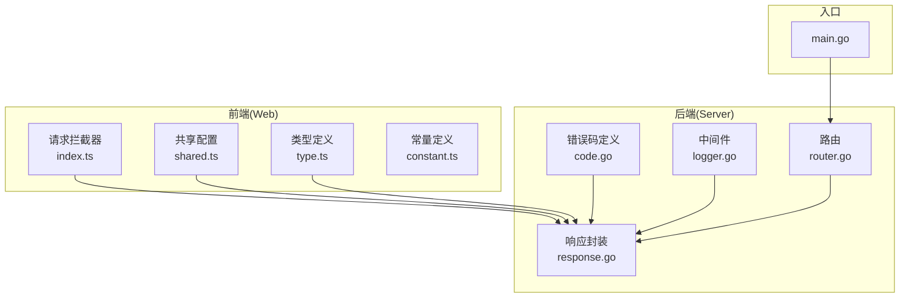
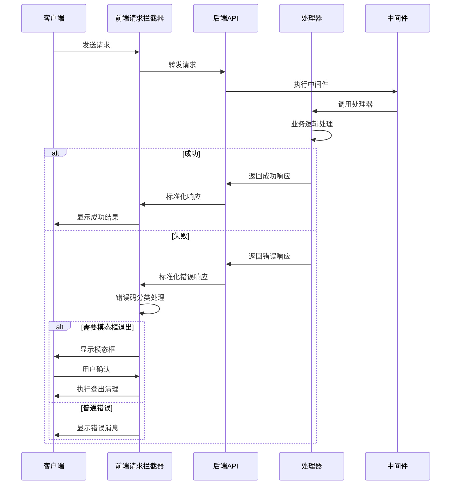
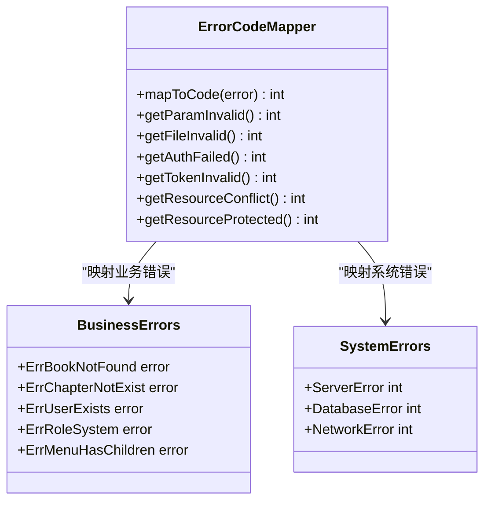
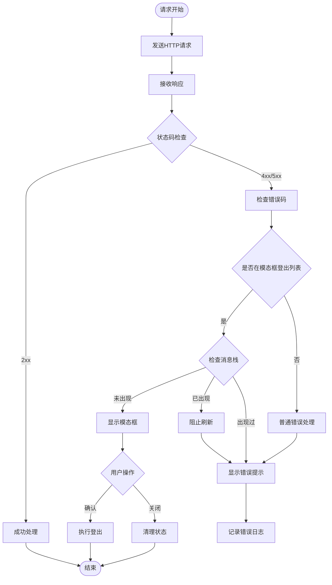
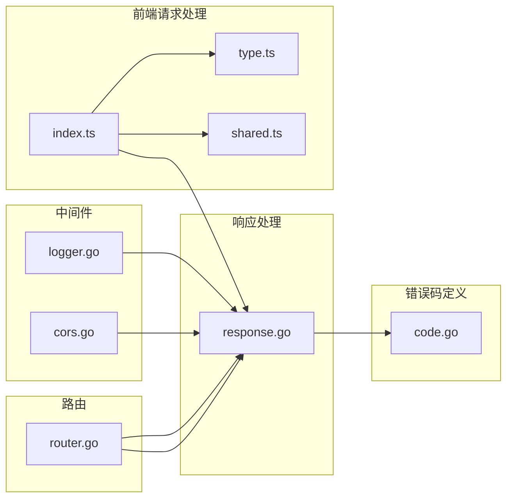

# 统一错误处理

<cite>
**本文档引用的文件**
- [code.go](file://app/server/internal/code/code.go)
- [response.go](file://app/server/pkg/response/response.go)
- [index.ts](file://app/web/src/service/request/index.ts)
- [shared.ts](file://app/web/src/service/request/shared.ts)
- [type.ts](file://app/web/src/service/request/type.ts)
- [logger.go](file://app/server/internal/middleware/logger.go)
- [cors.go](file://app/server/internal/middleware/cors.go)
- [main.go](file://app/server/cmd/api/main.go)
- [router.go](file://app/server/router/router.go)
</cite>

## 目录
1. [简介](#简介)
2. [项目结构](#项目结构)
3. [核心组件](#核心组件)
4. [架构概览](#架构概览)
5. [详细组件分析](#详细组件分析)
6. [依赖分析](#依赖分析)
7. [性能考虑](#性能考虑)
8. [故障排除指南](#故障排除指南)
9. [结论](#结论)

## 简介

本项目实现了统一的错误处理机制，通过前后端分离的方式提供一致的错误处理体验。后端使用Go语言的Gin框架，前端使用Vue.js和TypeScript，通过标准化的错误码和响应格式实现跨系统的错误处理统一。

## 项目结构

项目采用前后端分离架构，错误处理机制分布在以下关键位置：

**图表来源**
- [main.go:1-50](file://app/server/cmd/api/main.go#L1-L50)
- [router.go:1-100](file://app/server/router/router.go#L1-L100)
- [code.go:1-50](file://app/server/internal/code/code.go#L1-L50)

**章节来源**
- [main.go:1-50](file://app/server/cmd/api/main.go#L1-L50)
- [router.go:1-100](file://app/server/router/router.go#L1-L100)

## 核心组件

### 后端错误码系统

后端实现了完整的错误码分类体系，涵盖通用、认证授权、业务资源等各个领域：

| 错误码范围 | 类别 | 描述 |
|------------|------|------|
| 1000-1999 | 通用 | 参数验证、文件处理错误 |
| 2000-2999 | 认证授权 | 登录认证、权限相关错误 |
| 3000-3999 | 业务资源 | 资源冲突、保护性资源错误 |
| 4000-4999 | 分页搜索 | 分页参数、搜索参数错误 |
| 5000-5999 | 系统错误 | 服务器内部错误 |

### 前端错误处理机制

前端实现了基于错误码的统一错误处理，包括模态框登录退出、错误消息栈管理等功能。

**章节来源**
- [code.go:1-345](file://app/server/internal/code/code.go#L1-L345)
- [index.ts:58-81](file://app/web/src/service/request/index.ts#L58-L81)

## 架构概览

整体错误处理架构采用分层设计，确保前后端的一致性和可维护性：

**图表来源**
- [index.ts:58-81](file://app/web/src/service/request/index.ts#L58-L81)
- [logger.go:1-29](file://app/server/internal/middleware/logger.go#L1-L29)

## 详细组件分析

### 后端错误码映射系统

后端实现了从Go错误到统一错误码的映射机制：

**图表来源**
- [code.go:14-345](file://app/server/internal/code/code.go#L14-L345)

### 前端错误拦截器

前端实现了智能的错误拦截和处理机制：

**图表来源**
- [index.ts:58-81](file://app/web/src/service/request/index.ts#L58-L81)

**章节来源**
- [index.ts:58-81](file://app/web/src/service/request/index.ts#L58-L81)
- [shared.ts:1-100](file://app/web/src/service/request/shared.ts#L1-L100)

### 中间件错误处理

后端中间件提供了统一的日志记录和错误处理能力：

**章节来源**
- [logger.go:1-29](file://app/server/internal/middleware/logger.go#L1-L29)
- [cors.go:1-23](file://app/server/internal/middleware/cors.go#L1-L23)

## 依赖分析

错误处理系统的依赖关系如下：

**图表来源**
- [code.go:1-50](file://app/server/internal/code/code.go#L1-L50)
- [response.go:1-100](file://app/server/pkg/response/response.go#L1-L100)
- [index.ts:1-100](file://app/web/src/service/request/index.ts#L1-L100)

**章节来源**
- [code.go:1-50](file://app/server/internal/code/code.go#L1-L50)
- [response.go:1-100](file://app/server/pkg/response/response.go#L1-L100)

## 性能考虑

1. **错误码缓存**: 后端错误码映射使用常量定义，避免运行时计算开销
2. **消息去重**: 前端错误消息栈防止重复弹窗影响用户体验
3. **延迟加载**: 错误处理逻辑按需执行，不影响正常请求流程
4. **内存优化**: 错误消息栈限制长度，避免内存泄漏

## 故障排除指南

### 常见问题及解决方案

| 问题类型 | 症状 | 解决方案 |
|----------|------|----------|
| 错误码不匹配 | 前端显示未知错误 | 检查后端错误码映射函数 |
| 模态框重复弹窗 | 用户收到多次登出提示 | 检查错误消息栈逻辑 |
| CORS错误 | 跨域请求失败 | 验证CORS中间件配置 |
| 日志缺失 | 无错误日志记录 | 检查请求日志中间件 |

### 调试步骤

1. **启用详细日志**: 在开发环境中开启详细的错误日志记录
2. **检查网络请求**: 使用浏览器开发者工具查看具体的HTTP响应
3. **验证错误码**: 确认后端返回的错误码与前端映射表一致
4. **测试边界条件**: 验证各种异常情况下的错误处理行为

**章节来源**
- [logger.go:1-29](file://app/server/internal/middleware/logger.go#L1-L29)
- [index.ts:58-81](file://app/web/src/service/request/index.ts#L58-L81)

## 结论

本项目实现了完善的统一错误处理机制，通过前后端协作提供了良好的用户体验和可维护性。主要特点包括：

1. **标准化错误码**: 统一的错误码分类和映射机制
2. **智能错误处理**: 前端基于错误码的智能处理策略
3. **完整日志记录**: 全面的请求和错误日志记录
4. **灵活扩展**: 易于添加新的错误类型和处理逻辑

这套错误处理机制为后续功能扩展奠定了坚实的基础，确保了系统的稳定性和用户体验的一致性。