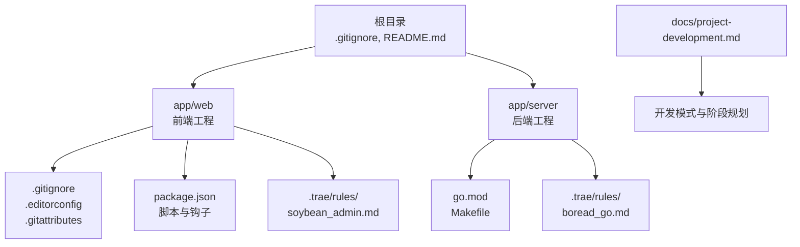
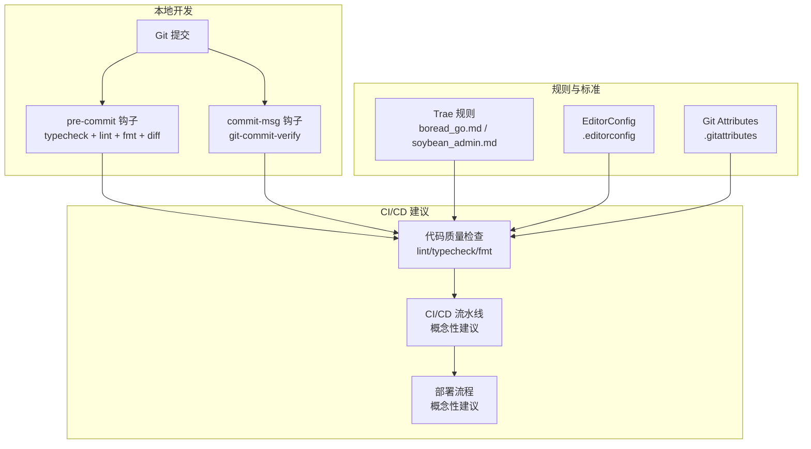
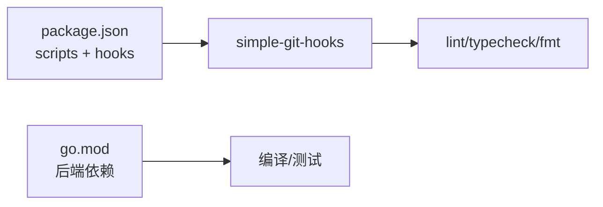

# Git协作工具

<cite>
**本文引用的文件**
- [.gitignore](file://.gitignore)
- [app/web/.gitignore](file://app/web/.gitignore)
- [app/web/.editorconfig](file://app/web/.editorconfig)
- [app/web/.gitattributes](file://app/web/.gitattributes)
- [app/web/package.json](file://app/web/package.json)
- [app/server/.trae/rules/boread_go.md](file://app/server/.trae/rules/boread_go.md)
- [app/web/.trae/rules/soybean_admin.md](file://app/web/.trae/rules/soybean_admin.md)
- [docs/project-development.md](file://docs/project-development.md)
- [README.md](file://README.md)
- [app/server/go.mod](file://app/server/go.mod)
</cite>

## 目录
1. [简介](#简介)
2. [项目结构](#项目结构)
3. [核心组件](#核心组件)
4. [架构总览](#架构总览)
5. [详细组件分析](#详细组件分析)
6. [依赖分析](#依赖分析)
7. [性能考虑](#性能考虑)
8. [故障排查指南](#故障排查指南)
9. [结论](#结论)
10. [附录](#附录)

## 简介
本指南面向boread项目的Git协作与工作流程，结合仓库内现有的规则与配置，系统性说明分支策略、提交规范、合并流程、代码质量检查、部署建议、Trae规则系统、.gitignore与.gitattributes配置、以及团队协作与代码审查建议。需要特别说明的是：当前仓库未包含GitHub Actions工作流、PR模板与Issue模板，因此本指南在这些方面提供“概念性建议”而非具体配置文件。

## 项目结构
boread采用前后端分离的多模块结构，根目录包含通用忽略规则与顶层说明；前端位于app/web，后端位于app/server；各模块内均配有规则文件与开发文档，便于开发者快速上手。

图表来源
- [README.md:1-11](file://README.md#L1-L11)
- [docs/project-development.md:31-69](file://docs/project-development.md#L31-L69)
- [app/web/package.json:1-108](file://app/web/package.json#L1-L108)
- [app/server/go.mod:1-66](file://app/server/go.mod#L1-L66)

章节来源
- [README.md:1-11](file://README.md#L1-L11)
- [docs/project-development.md:31-69](file://docs/project-development.md#L31-L69)

## 核心组件
- 提交消息与分支规范：通过Trae规则系统约束提交消息格式与代码风格，确保一致性。
- 代码质量检查：前端通过simple-git-hooks与lint/typecheck/fmt联动，后端通过Makefile与lint工具链配合。
- 忽略规则：根级与前端级.gitignore分别屏蔽构建产物、锁文件与本地配置；.gitattributes统一换行符。
- 开发模式：单人+AI协作，强调“AI生成→人工review→测试验证→提交”的闭环。

章节来源
- [app/web/.trae/rules/soybean_admin.md:1-93](file://app/web/.trae/rules/soybean_admin.md#L1-L93)
- [app/server/.trae/rules/boread_go.md:1-91](file://app/server/.trae/rules/boread_go.md#L1-L91)
- [app/web/package.json:98-101](file://app/web/package.json#L98-L101)
- [docs/project-development.md:73-84](file://docs/project-development.md#L73-L84)

## 架构总览
下图展示Git协作与质量控制的关键交互：提交前钩子触发类型检查、代码格式化与静态检查；提交消息钩子验证提交信息格式；Trae规则文件为AI生成与人工review提供统一标准。

图表来源
- [app/web/package.json:98-101](file://app/web/package.json#L98-L101)
- [app/web/.editorconfig:1-12](file://app/web/.editorconfig#L1-L12)
- [app/web/.gitattributes:1-14](file://app/web/.gitattributes#L1-L14)
- [app/server/.trae/rules/boread_go.md:1-91](file://app/server/.trae/rules/boread_go.md#L1-L91)
- [app/web/.trae/rules/soybean_admin.md:1-93](file://app/web/.trae/rules/soybean_admin.md#L1-L93)

## 详细组件分析

### 提交消息与分支策略
- 提交消息规范
  - 前端通过simple-git-hooks的commit-msg钩子调用git-commit-verify，确保提交信息符合Trae规则。
  - Trae规则文件定义了Go与前端的开发规范，间接约束提交信息的可读性与一致性。
- 分支策略建议
  - 基于功能/修复/热修复分支命名，主分支仅允许受控合并（squash或rebase），保留清晰历史。
  - 重要节点打标签（语义化版本），用于发布与回溯。

章节来源
- [app/web/package.json:98-101](file://app/web/package.json#L98-L101)
- [app/web/.trae/rules/soybean_admin.md:1-93](file://app/web/.trae/rules/soybean_admin.md#L1-L93)
- [app/server/.trae/rules/boread_go.md:1-91](file://app/server/.trae/rules/boread_go.md#L1-L91)

### 提交前质量检查（pre-commit）
- 前端
  - pre-commit钩子执行：类型检查、Lint、格式化、diff空检查，确保提交前质量门槛。
- 后端
  - Makefile与lint工具链配合，建议在本地或CI中执行统一的静态检查与格式化。

章节来源
- [app/web/package.json:98-101](file://app/web/package.json#L98-L101)
- [docs/project-development.md:496-519](file://docs/project-development.md#L496-L519)

### 提交后流程与合并
- 建议采用squash合并，保持主分支整洁；合并后删除功能分支，减少分支冗余。
- 合并前进行一次快速自检（lint/typecheck/fmt），确保变更通过本地钩子。

章节来源
- [docs/project-development.md:73-84](file://docs/project-development.md#L73-L84)

### GitHub Actions自动化工作流（概念性建议）
由于仓库未包含.github/workflows目录，以下为建议性配置思路：
- 触发条件
  - 推送主分支：执行全量质量检查与构建。
  - 开启PR：执行单元测试、集成测试与安全扫描。
- 步骤建议
  - 前端：安装依赖、类型检查、Lint、格式化、打包构建。
  - 后端：编译、单元测试、覆盖率、Swagger文档更新。
  - 发布：镜像构建与制品上传、版本标签打标。
- 代码质量
  - 集成SonarQube或类似工具进行静态分析与重复率检测。
- 部署
  - 支持蓝绿/金丝雀发布，结合环境变量与配置文件进行差异化部署。

（本节为概念性建议，不直接对应具体文件）

### Trae规则系统使用
- Go后端规则
  - 明确目录结构、命名规范、分层职责、统一响应格式与错误码范围，指导AI生成与人工review。
- 前端规则
  - Vue组件规范、命名约定、SFC代码顺序、样式隔离与请求函数命名，统一前端代码风格。
- 使用建议
  - 在AI生成代码时，明确引用相应规则文件；在review时对照规则核验一致性。

章节来源
- [app/server/.trae/rules/boread_go.md:1-91](file://app/server/.trae/rules/boread_go.md#L1-L91)
- [app/web/.trae/rules/soybean_admin.md:1-93](file://app/web/.trae/rules/soybean_admin.md#L1-L93)

### .gitignore与.gitattributes配置
- 根级与前端级.gitignore
  - 根级忽略构建产物、日志、锁文件与敏感配置；前端级忽略IDE缓存、依赖目录与测试截图。
- .gitattributes
  - 统一前端文本文件换行符为LF，避免跨平台差异导致的误判。
- .editorconfig
  - 统一字符集、缩进风格、行尾与空白处理，提升协作一致性。

章节来源
- [.gitignore:1-17](file://.gitignore#L1-L17)
- [app/web/.gitignore:1-37](file://app/web/.gitignore#L1-L37)
- [app/web/.gitattributes:1-14](file://app/web/.gitattributes#L1-L14)
- [app/web/.editorconfig:1-12](file://app/web/.editorconfig#L1-L12)

### Git最佳实践
- 分支命名
  - feat/xxx、fix/xxx、docs/xxx、refactor/xxx等，清晰表达变更意图。
- 提交信息
  - 遵循commit-msg钩子与Trae规则，保证信息简洁、可追溯。
- 冲突解决
  - 优先rebase保持线性历史；冲突时逐文件解决并自检。
- 版本标签
  - 语义化版本打标，配合CHANGELOG记录重大变更。

章节来源
- [docs/project-development.md:73-84](file://docs/project-development.md#L73-L84)

### 团队协作与代码审查
- 单人+AI协作模式
  - AI负责按规范生成代码，人工负责启动开发、执行SQL、测试验证与提交。
- 代码审查建议
  - 即使是单人项目，也建议在关键节点进行“自我审查”：对照规则文件、执行质量检查清单、回归测试。
- PR与Issue模板（建议）
  - 为未来引入PR/Issue模板预留目录结构，便于规范化协作。

章节来源
- [docs/project-development.md:73-84](file://docs/project-development.md#L73-L84)

## 依赖分析
- 前端依赖与脚本
  - package.json定义了开发脚本与simple-git-hooks钩子，确保提交前质量检查。
- 后端依赖与版本
  - go.mod声明核心依赖与版本，支撑后端工程稳定演进。

图表来源
- [app/web/package.json:29-44](file://app/web/package.json#L29-L44)
- [app/web/package.json:98-101](file://app/web/package.json#L98-L101)
- [app/server/go.mod:5-16](file://app/server/go.mod#L5-L16)

章节来源
- [app/web/package.json:1-108](file://app/web/package.json#L1-L108)
- [app/server/go.mod:1-66](file://app/server/go.mod#L1-L66)

## 性能考虑
- 本地质量检查前置：在pre-commit阶段拦截低质量提交，减少CI失败与重试成本。
- 依赖锁定与缓存：合理利用pnpm与Go模块缓存，缩短CI构建时间。
- 构建产物隔离：通过.gitignore排除构建目录，避免无关文件进入索引影响性能。

（本节为通用建议，不直接对应具体文件）

## 故障排查指南
- 提交被拒绝（commit-msg）
  - 检查提交信息是否符合Trae规则；修正后重试。
- pre-commit失败
  - 类型检查、Lint或格式化报错：按提示修复；确认本地与CI使用相同工具版本。
- 忽略规则生效异常
  - 核对.gitignore层级与路径匹配；确认.gitattributes换行符设置。
- 依赖安装问题
  - 清理缓存后重装依赖；检查Node与pnpm版本要求。

章节来源
- [app/web/package.json:98-101](file://app/web/package.json#L98-L101)
- [app/web/.gitignore:1-37](file://app/web/.gitignore#L1-L37)
- [app/web/.gitattributes:1-14](file://app/web/.gitattributes#L1-L14)
- [docs/project-development.md:496-519](file://docs/project-development.md#L496-L519)

## 结论
boread项目已具备完善的规则与质量控制基础：Trae规则文件统一前后端开发标准，simple-git-hooks在本地强制执行质量检查，.gitignore与.gitattributes保障协作一致性。建议在现有基础上补充GitHub Actions流水线、PR/Issue模板与版本标签策略，进一步完善自动化与规范化协作流程。

## 附录
- 快速启动与质量检查清单
  - 后端：参考开发文档中的快速启动步骤与提交前检查清单。
  - 前端：类型检查、Lint、格式化与路由生成脚本。

章节来源
- [docs/project-development.md:469-492](file://docs/project-development.md#L469-L492)
- [docs/project-development.md:496-519](file://docs/project-development.md#L496-L519)