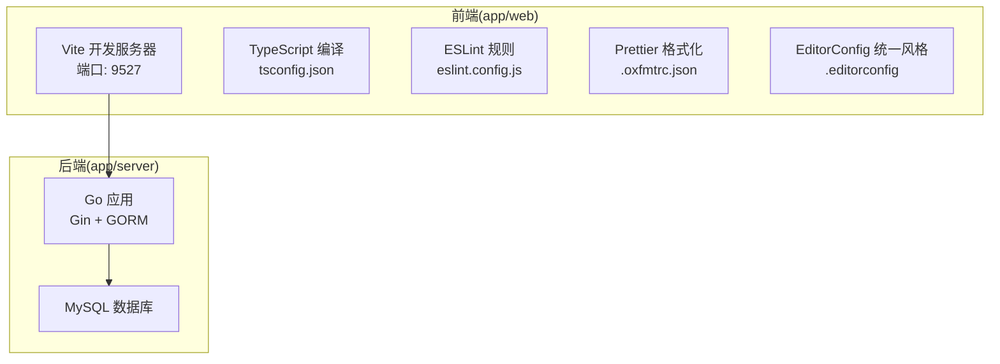
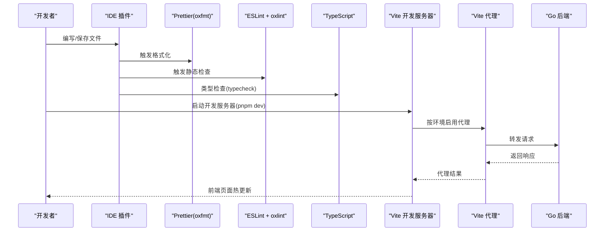
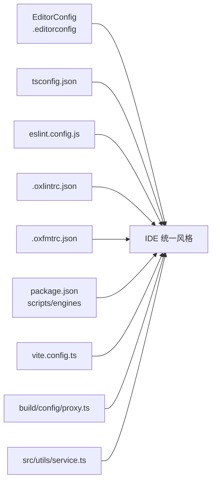

# IDE插件推荐

<cite>
**本文引用的文件**
- [README.md](file://README.md)
- [项目开发文档.md](file://docs/project-development.md)
- [app/web/.editorconfig](file://app/web/.editorconfig)
- [app/web/eslint.config.js](file://app/web/eslint.config.js)
- [app/web/.oxlintrc.json](file://app/web/.oxlintrc.json)
- [app/web/.oxfmtrc.json](file://app/web/.oxfmtrc.json)
- [app/web/tsconfig.json](file://app/web/tsconfig.json)
- [app/web/package.json](file://app/web/package.json)
- [app/web/vite.config.ts](file://app/web/vite.config.ts)
- [app/web/build/plugins/index.ts](file://app/web/build/plugins/index.ts)
- [app/web/build/config/proxy.ts](file://app/web/build/config/proxy.ts)
- [app/web/src/utils/service.ts](file://app/web/src/utils/service.ts)
</cite>

## 目录
1. [简介](#简介)
2. [项目结构](#项目结构)
3. [核心组件](#核心组件)
4. [架构总览](#架构总览)
5. [详细组件分析](#详细组件分析)
6. [依赖分析](#依赖分析)
7. [性能考虑](#性能考虑)
8. [故障排查指南](#故障排查指南)
9. [结论](#结论)
10. [附录](#附录)

## 简介
本指南面向boread项目的IDE（VS Code、WebStorm等）插件推荐与配置，聚焦于Vue、TypeScript、ESLint、Prettier、GitLens等插件的功能与配置要点；说明EditorConfig统一代码风格的作用与配置方法；解释快捷键、代码片段、智能提示；提供不同IDE的配置文件示例与导入方法；并覆盖调试配置、远程开发、多语言支持等高级功能的使用技巧。

## 项目结构
boread采用前后端分离架构：
- 前端：基于Vue 3 + Vite + TypeScript + NaiveUI + UnoCSS的SoybeanAdmin模板
- 后端：Go + Gin + GORM + MySQL
- 文档与开发流程：包含开发阶段、质量检查清单、环境启动脚本等

**图表来源**
- [app/web/vite.config.ts:14-50](file://app/web/vite.config.ts#L14-L50)
- [app/web/tsconfig.json:1-26](file://app/web/tsconfig.json#L1-L26)
- [app/web/eslint.config.js:1-13](file://app/web/eslint.config.js#L1-L13)
- [app/web/.oxfmtrc.json:1-12](file://app/web/.oxfmtrc.json#L1-L12)
- [app/web/.editorconfig:1-12](file://app/web/.editorconfig#L1-L12)

**章节来源**
- [README.md:1-11](file://README.md#L1-L11)
- [项目开发文档.md:31-69](file://docs/project-development.md#L31-L69)

## 核心组件
- 统一代码风格：EditorConfig确保跨IDE一致的缩进、换行、字符集等
- 类型约束：TypeScript严格模式与路径别名配置
- 代码质量：ESLint + oxlint组合，兼顾Vue与TypeScript规则
- 格式化：Prettier（oxfmt）统一格式，避免风格分歧
- 开发体验：Vite插件生态（路由、UnoCSS、图标、过渡根校验等）

**章节来源**
- [app/web/.editorconfig:1-12](file://app/web/.editorconfig#L1-L12)
- [app/web/tsconfig.json:1-26](file://app/web/tsconfig.json#L1-L26)
- [app/web/eslint.config.js:1-13](file://app/web/eslint.config.js#L1-L13)
- [app/web/.oxlintrc.json:1-15](file://app/web/.oxlintrc.json#L1-L15)
- [app/web/.oxfmtrc.json:1-12](file://app/web/.oxfmtrc.json#L1-L12)
- [app/web/build/plugins/index.ts:12-26](file://app/web/build/plugins/index.ts#L12-L26)

## 架构总览
IDE侧的开发链路与项目配置相互配合，形成“编辑器—格式化—校验—编译—代理—运行”的闭环。

**图表来源**
- [app/web/package.json:29-44](file://app/web/package.json#L29-L44)
- [app/web/vite.config.ts:14-50](file://app/web/vite.config.ts#L14-L50)
- [app/web/build/config/proxy.ts:12-28](file://app/web/build/config/proxy.ts#L12-L28)
- [app/web/src/utils/service.ts:8-41](file://app/web/src/utils/service.ts#L8-L41)

## 详细组件分析

### EditorConfig：统一代码风格
- 作用：跨编辑器保持一致的编码风格（缩进、换行、字符集、尾随空白等），减少因IDE差异导致的格式漂移
- 关键配置点：缩进风格与大小、字符集、行结束符、尾随空白清理、末尾换行插入
- 影响范围：所有受[*]匹配的文件

**章节来源**
- [app/web/.editorconfig:1-12](file://app/web/.editorconfig#L1-L12)

### TypeScript：严格类型与路径别名
- 严格模式与空值检查：提升类型安全性
- 路径别名：@/*、~/*，便于模块导入
- 模块解析：bundler模式，与Vite生态兼容
- JSX与Vue：保留JSX，指定jsxImportSource为vue

**章节来源**
- [app/web/tsconfig.json:1-26](file://app/web/tsconfig.json#L1-L26)

### ESLint：规则与扩展
- 基于@soybeanjs/eslint-config-vue，统一Vue与TypeScript风格
- 自定义规则：如组件命名大小写、忽略特定前缀等
- 与oxlint协同：oxlint侧重性能与稳定性类别，ESLint负责风格与一致性

**章节来源**
- [app/web/eslint.config.js:1-13](file://app/web/eslint.config.js#L1-L13)
- [app/web/.oxlintrc.json:1-15](file://app/web/.oxlintrc.json#L1-L15)

### Prettier（oxfmt）：格式化策略
- 输出宽度、单引号、尾随逗号、箭头函数括号策略
- 忽略特定类型声明文件，避免误格式化
- 包管理脚本自动排序与格式化

**章节来源**
- [app/web/.oxfmtrc.json:1-12](file://app/web/.oxfmtrc.json#L1-L12)
- [app/web/package.json:39-39](file://app/web/package.json#L39-L39)

### Vite与代理：本地开发与后端联调
- 别名：@指向src目录，~指向项目根
- 插件：vue、vue-jsx、路由、UnoCSS、图标、进度条、过渡根校验、DevTools等
- 代理：按环境变量启用，支持日志输出，自动rewrite路径
- 服务：默认监听0.0.0.0，端口9527，自动打开浏览器

**章节来源**
- [app/web/vite.config.ts:14-50](file://app/web/vite.config.ts#L14-L50)
- [app/web/build/plugins/index.ts:12-26](file://app/web/build/plugins/index.ts#L12-L26)
- [app/web/build/config/proxy.ts:12-56](file://app/web/build/config/proxy.ts#L12-L56)
- [app/web/src/utils/service.ts:8-41](file://app/web/src/utils/service.ts#L8-L41)

### Git钩子与提交规范
- pre-commit：类型检查、ESLint + oxlint、格式化、git diff校验
- commit-msg：提交信息校验（基于约定式提交）
- 一键提交：pnpm commit / pnpm commit:zh

**章节来源**
- [app/web/package.json:98-101](file://app/web/package.json#L98-L101)

## 依赖分析
IDE插件与项目配置的耦合关系如下：

**图表来源**
- [app/web/.editorconfig:1-12](file://app/web/.editorconfig#L1-L12)
- [app/web/tsconfig.json:1-26](file://app/web/tsconfig.json#L1-L26)
- [app/web/eslint.config.js:1-13](file://app/web/eslint.config.js#L1-L13)
- [app/web/.oxlintrc.json:1-15](file://app/web/.oxlintrc.json#L1-L15)
- [app/web/.oxfmtrc.json:1-12](file://app/web/.oxfmtrc.json#L1-L12)
- [app/web/package.json:29-105](file://app/web/package.json#L29-L105)
- [app/web/vite.config.ts:14-50](file://app/web/vite.config.ts#L14-L50)
- [app/web/build/config/proxy.ts:12-56](file://app/web/build/config/proxy.ts#L12-L56)
- [app/web/src/utils/service.ts:8-41](file://app/web/src/utils/service.ts#L8-L41)

**章节来源**
- [app/web/package.json:29-105](file://app/web/package.json#L29-L105)

## 性能考虑
- 代理日志：在需要时开启代理日志，有助于定位转发问题，但会带来少量性能开销
- 类型检查：在IDE中启用typecheck，可在保存时快速发现类型问题，避免频繁命令行执行
- 格式化与校验：将格式化与校验纳入pre-commit，减少CI压力，提升提交效率

[本节为通用指导，无需引用具体文件]

## 故障排查指南
- 代理未生效
  - 检查环境变量开关与目标地址
  - 查看代理日志输出，确认rewrite规则
- 路由别名失效
  - 确认Vite别名配置与tsconfig路径映射一致
- ESLint/oxlint冲突
  - 优先遵循eslint.config.js与.oxtlintrc.json的规则集合
- 格式化异常
  - 检查.prettierrc（oxfmt）与.gitignore中的忽略规则
- 提交被拒绝
  - 按pre-commit输出修复类型错误、格式问题或未通过diff校验

**章节来源**
- [app/web/build/config/proxy.ts:12-56](file://app/web/build/config/proxy.ts#L12-L56)
- [app/web/vite.config.ts:16-21](file://app/web/vite.config.ts#L16-L21)
- [app/web/tsconfig.json:9-12](file://app/web/tsconfig.json#L9-L12)
- [app/web/.oxfmtrc.json:1-12](file://app/web/.oxfmtrc.json#L1-L12)
- [app/web/package.json:98-101](file://app/web/package.json#L98-L101)

## 结论
通过EditorConfig统一风格、TypeScript严格类型、ESLint与oxlint双轨校验、Prettier格式化以及Vite代理与插件生态，boread在IDE侧提供了高质量的开发体验。建议在VS Code与WebStorm中按本文档配置相应插件与规则，结合项目脚本与环境变量，实现一致、高效、可维护的开发流程。

[本节为总结，无需引用具体文件]

## 附录

### VS Code 插件推荐与配置要点
- Vue相关
  - Vue Language Features (Volar)：提供TypeScript + Vue SFC支持
  - ESLint：启用保存时自动修复
  - Prettier：设置默认格式化器为Prettier
  - EditorConfig：启用EditorConfig支持
  - GitLens：增强Git交互与历史查看
- TypeScript
  - 启用“在保存时自动类型检查”
  - 配置tsconfig.json路径别名与严格模式
- 代理与网络
  - 根据项目环境变量启用Vite代理
  - 若需调试后端，使用Live Server或Postman辅助
- 快捷键与片段
  - 自定义常用片段（如API请求、i18n文本占位）
  - 使用Ctrl+Shift+P搜索“首选项：打开键盘快捷方式”，按需绑定常用命令
- 配置文件导入
  - 将.editorconfig、tsconfig.json、eslint.config.js、.oxlintrc.json、.oxfmtrc.json复制至工作区根目录
  - 在设置中启用“files.associations”以识别特殊文件类型

[本节为概念性说明，无需引用具体文件]

### WebStorm 插件推荐与配置要点
- Vue与TypeScript
  - Vue.js：启用Vue SFC支持
  - TypeScript：启用“在保存时自动类型检查”
  - ESLint：在Settings中配置为外部工具或启用“On save”
  - Prettier：在Settings中配置为外部工具或启用“On save”
- EditorConfig
  - 启用EditorConfig支持，确保缩进与换行一致
- GitLens
  - 启用GitLens以增强版本控制可视化
- 代理与网络
  - 通过Vite代理配置访问后端
  - 在Run/Debug Configurations中配置前端开发服务器
- 快捷键与片段
  - 使用Live Templates自定义常用片段
  - 在Settings中自定义快捷键以提升效率
- 配置文件导入
  - 将.editorconfig、tsconfig.json、eslint.config.js、.oxlintrc.json、.oxfmtrc.json复制至工作区根目录
  - 在Settings中导入配置文件以统一风格

[本节为概念性说明，无需引用具体文件]

### 调试配置与远程开发
- 调试配置
  - 在IDE中为前端Vite开发服务器创建调试配置
  - 在后端Go应用中创建调试配置（Delve）
- 远程开发
  - 使用SSH挂载远程目录，结合IDE的Remote Development插件
  - 在远程环境中复用本地.editorconfig、tsconfig.json等配置
- 多语言支持
  - 在前端i18n配置中新增语言包
  - 在IDE中启用多语言片段与拼写检查

[本节为概念性说明，无需引用具体文件]